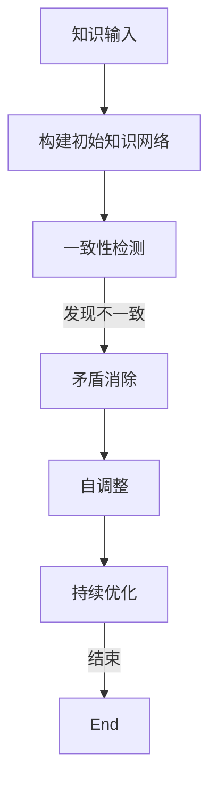
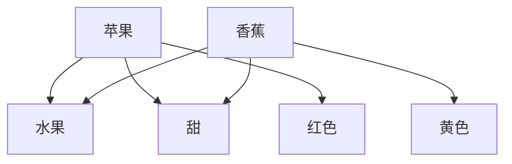
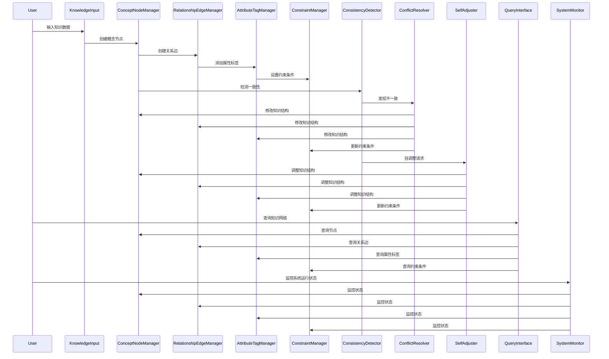

                 

### 引言

在人工智能（AI）领域，推理能力是衡量一个智能系统是否能够像人类一样进行思考、判断和决策的关键指标。传统的AI模型在处理具体问题时往往表现出色，但它们在处理复杂、多变的真实世界问题时，常常因为缺乏推理能力而显得力不从心。这导致了AI在处理不确定性、泛化能力和深度理解等方面存在一定的局限性。为了解决这一问题，研究人员提出了多种增强AI推理能力的方法，其中，自洽概念图（Self-Consistency Conceptual Graph, 简称Self-Consistency CoT）作为一种新的技术手段，受到了广泛关注。

自洽概念图是一种用于描述知识结构和信息关联的图形表示方法，通过自洽性原理来确保知识的逻辑一致性和完整性。它的核心思想是将知识分解为一系列相互关联的概念节点和关系边，并利用自洽性原理来调整和优化这些知识结构，从而提高AI模型的推理能力和表现。自洽概念图不仅在理论研究上具有重要意义，而且在实际应用中也展现出强大的潜力，如自然语言处理、计算机视觉、推荐系统等。

本文旨在深入探讨自洽概念图的基本原理、算法实现、应用场景、系统架构设计以及项目实战，通过逻辑清晰、结构紧凑、简单易懂的叙述方式，帮助读者全面理解自洽概念图在增强AI推理能力方面的前沿探索。文章将从以下几个方面展开讨论：

- **第1章：自洽概念图的背景与概念**  
  本章将介绍自洽概念图的起源、定义及其重要性，并对比自洽概念图与传统概念图的不同。

- **第2章：自洽概念图的基本原理**  
  本章将详细阐述自洽概念图的结构组成、自洽性原理及其属性特征，并通过Mermaid流程图进行说明。

- **第3章：自洽概念图的算法原理**  
  本章将介绍自洽概念图的算法基础、流程，并提供Python源代码和数学模型讲解，通过具体案例进行说明。

- **第4章：自洽概念图的应用场景**  
  本章将探讨自洽概念图在不同领域的应用，如自然语言处理、计算机视觉和推荐系统等。

- **第5章：自洽概念图的设计与实现**  
  本章将介绍自洽概念图的设计原则、实现框架、接口设计以及交互序列图。

- **第6章：自洽概念图的系统架构设计**  
  本章将介绍自洽概念图系统功能设计、架构设计、接口设计以及系统交互Mermaid序列图。

- **第7章：自洽概念图的项目实战**  
  本章将通过实际项目案例，详细介绍自洽概念图的安装、实现过程及案例分析。

- **第8章：自洽概念图的最佳实践与未来展望**  
  本章将总结最佳实践技巧、注意事项，并展望自洽概念图的发展前景。

通过以上章节的逐步探讨，读者将能够系统地了解自洽概念图的内涵、应用及其实现过程，从而为在实际项目中应用自洽概念图提供理论指导和实践经验。接下来，我们将首先从自洽概念图的背景与概念入手，为后续内容的深入讨论奠定基础。

### 关键词

- **自洽概念图（Self-Consistency Conceptual Graph）**  
- **AI推理能力（AI Reasoning Capabilities）**  
- **知识结构（Knowledge Structure）**  
- **自然语言处理（Natural Language Processing, NLP）**  
- **计算机视觉（Computer Vision）**  
- **推荐系统（Recommender Systems）**  
- **算法实现（Algorithm Implementation）**  
- **系统架构设计（System Architecture Design）**

### 摘要

本文深入探讨了自洽概念图（Self-Consistency Conceptual Graph, 简称Self-Consistency CoT）在增强人工智能（AI）推理能力方面的前沿探索。自洽概念图通过构建逻辑一致的知识结构，利用自洽性原理对知识进行优化，从而提升AI模型在处理复杂、多变化情境时的推理能力。本文首先介绍了自洽概念图的背景、定义及其重要性，随后详细阐述了其基本原理、算法实现、应用场景、系统架构设计以及实际项目中的应用。通过系统化的分析和实际案例的解析，本文展示了自洽概念图在自然语言处理、计算机视觉和推荐系统等领域的广泛应用和潜力，并提出了未来的研究方向和最佳实践建议。

### 第1章 自洽概念图的背景与概念

#### 1.1.1 自洽概念图的提出背景

自洽概念图（Self-Consistency Conceptual Graph, 简称Self-Consistency CoT）的提出，源于人工智能（AI）在处理复杂问题时的局限性。传统的AI模型，如神经网络和决策树，虽然在特定任务上取得了显著成果，但在处理不确定性、泛化能力和深度理解方面仍存在明显的短板。特别是在面对多源异构信息和复杂推理任务时，这些模型往往难以保持逻辑的一致性和完整性。为了解决这些问题，研究人员开始探索新的知识表示和推理方法，自洽概念图便应运而生。

自洽概念图的提出，旨在通过构建一种能够自洽一致的知识结构，从而提升AI模型的推理能力。其核心思想是利用自洽性原理，通过不断调整和优化知识结构，确保知识之间的逻辑一致性和完整性。这种自洽性的保证，不仅能够提高模型的推理准确性，还能够增强其在处理复杂问题和动态环境时的适应能力。

#### 1.1.2 自洽概念图的定义

自洽概念图（Self-Consistency Conceptual Graph）是一种用于描述知识结构和信息关联的图形表示方法。它通过将知识分解为一系列相互关联的概念节点和关系边，构建出一个逻辑一致、结构清晰的知识网络。自洽概念图的基本构成包括概念节点、关系边、属性标签和约束条件等。

- **概念节点（Concept Nodes）**：代表具体的知识实体，如“人”、“书”、“苹果”等。

- **关系边（Relationship Edges）**：表示概念节点之间的逻辑关系，如“吃”、“包含”、“属于”等。

- **属性标签（Attribute Tags）**：为概念节点或关系边提供额外的描述信息，如“年龄”、“颜色”、“重量”等。

- **约束条件（Constraints）**：确保知识结构的一致性和完整性，如“一个人只能有一个名字”、“苹果必须有色”等。

#### 1.1.3 自洽概念图的重要性

自洽概念图在人工智能领域具有重要的研究价值和实际应用潜力。以下是自洽概念图的重要性体现：

1. **提高推理能力**：自洽概念图通过自洽性原理，确保知识结构的一致性和完整性，从而提高AI模型的推理能力。这种自洽性不仅能够提升推理的准确性，还能够增强模型的泛化能力。

2. **优化知识表示**：自洽概念图将知识分解为概念节点和关系边，以图形化的形式呈现，使得知识表示更加直观、清晰。这有助于人类理解和分析知识结构，也为AI模型的自动化推理提供了有力的支持。

3. **跨领域应用**：自洽概念图的应用范围广泛，涵盖了自然语言处理、计算机视觉、推荐系统等多个领域。通过在不同领域的应用，自洽概念图不仅能够解决具体问题，还能够推动这些领域的发展。

4. **促进知识融合**：自洽概念图能够将多源异构信息整合到一个统一的知识结构中，实现知识的融合和共享。这对于复杂系统的建模和优化具有重要意义。

#### 1.1.4 自洽概念图与传统概念图的对比

自洽概念图与传统概念图（如概念网络、思维导图等）在结构和方法上有所不同，主要体现在以下几个方面：

1. **自洽性原理**：传统概念图通常不考虑知识结构的一致性和完整性，而自洽概念图通过自洽性原理，确保知识结构的自洽性，从而提高推理能力。

2. **知识表示**：传统概念图通常以线性或层次化的形式表示知识，而自洽概念图采用图形化的方式，将知识分解为概念节点和关系边，以更直观、清晰的形式呈现。

3. **应用范围**：传统概念图主要应用于教育、认知科学等领域，而自洽概念图在人工智能领域具有更广泛的应用潜力，特别是在自然语言处理、计算机视觉、推荐系统等领域。

4. **算法实现**：传统概念图的算法实现相对简单，而自洽概念图的算法实现更加复杂，需要考虑自洽性原理和优化策略。

通过以上对比，可以看出自洽概念图在知识表示、推理能力和应用范围等方面具有独特的优势和潜力。接下来，我们将进一步深入探讨自洽概念图的基本原理和算法实现。

### 第2章 自洽概念图的基本原理

#### 2.1.1 自洽概念图的结构组成

自洽概念图（Self-Consistency Conceptual Graph）是一种用于描述知识结构和信息关联的图形表示方法，其核心在于通过概念节点和关系边的组合，构建出一个逻辑一致、结构清晰的知识网络。为了更好地理解自洽概念图的基本原理，我们首先需要了解其结构组成。

1. **概念节点（Concept Nodes）**：
   概念节点是自洽概念图中的基本元素，代表具体的知识实体。这些知识实体可以是具体的事物、概念或抽象的属性。例如，在“苹果”这一概念节点下，我们可以包含“红色”、“甜”、“脆”等属性节点。

2. **关系边（Relationship Edges）**：
   关系边表示概念节点之间的逻辑关系。这些关系可以是包含关系、因果关系、关联关系等。例如，“苹果”和“甜”之间可以有一个“属性”关系边，表示“苹果”具有“甜”这一属性。

3. **属性标签（Attribute Tags）**：
   属性标签为概念节点或关系边提供额外的描述信息。这些标签可以是定量的（如“年龄”）、定性的（如“颜色”）、或者是组合的（如“价格区间”）。属性标签有助于细化概念节点和关系边的信息，提高知识表示的精度。

4. **约束条件（Constraints）**：
   约束条件用于确保知识结构的一致性和完整性。这些约束可以是逻辑约束（如“每个人只能有一个名字”）、数值约束（如“苹果的重量必须在100g到200g之间”），或者是其他类型的限制。约束条件是自洽性原理的核心组成部分，通过它们，我们可以确保知识网络的逻辑一致性。

通过以上元素，自洽概念图构建出了一个复杂、动态的知识网络，这个网络能够有效地表示、存储和传递信息，为AI推理提供坚实的基础。

#### 2.1.2 自洽性原理

自洽性原理是自洽概念图的核心思想，它通过一系列规则和算法，确保知识结构的一致性和完整性。自洽性原理的目的是在知识网络中消除逻辑矛盾和不一致，从而提高推理的准确性和可靠性。以下是自洽性原理的几个关键组成部分：

1. **一致性检测（Consistency Detection）**：
   一致性检测是自洽性原理的第一步，它通过检查知识网络中的概念节点和关系边，发现潜在的逻辑矛盾和不一致。一致性检测可以采用各种算法和技术，如约束满足问题（CSP）、图论算法等。

2. **矛盾消除（Conflict Resolution）**：
   一旦检测到一致性矛盾，矛盾消除机制会介入，通过调整知识结构来消除这些矛盾。矛盾消除可以采用冲突驱动的搜索（CDP）、回溯算法等技术，确保知识网络的逻辑一致性。

3. **自调整（Self-Adjustment）**：
   自调整是自洽性原理的重要组成部分，它通过动态调整知识网络，以适应新的信息和情境。自调整机制可以基于规则、机器学习等技术，确保知识网络的动态适应性和自洽性。

4. **持续优化（Continuous Optimization）**：
   自调整是一个持续的过程，通过不断地检测、消除矛盾和优化知识结构，自洽概念图能够保持长期的自洽性和一致性。持续优化有助于提高知识网络的质量和推理能力。

自洽性原理的核心在于通过一系列自洽性规则和算法，确保知识网络的一致性和完整性。这不仅提高了推理的准确性，还增强了AI模型在处理复杂、多变化情境时的适应能力。

#### 2.1.3 自洽概念图的属性特征对比表格

为了更清晰地理解自洽概念图与传统概念图之间的区别，我们可以通过一个属性特征对比表格来进行详细阐述。以下是自洽概念图与传统概念图在几个关键属性上的对比：

| 属性特征        | 自洽概念图（Self-Consistency CoT）                | 传统概念图（Traditional Concept Map）              |
|-----------------|------------------------------------------------|------------------------------------------------|
| **知识表示形式** | 图形化的知识网络，包含概念节点、关系边、属性标签和约束条件 | 线性或层次化的知识结构，通常采用节点和连线表示 |
| **自洽性原理**   | 通过自洽性原理确保知识结构的一致性和完整性           | 不考虑自洽性，通常基于人类直觉构建 |
| **推理能力**     | 通过自调整和持续优化提高推理能力和适应性           | 推理能力有限，依赖于人类解释和调整 |
| **应用范围**     | 广泛应用于自然语言处理、计算机视觉、推荐系统等领域   | 主要应用于教育、认知科学等领域     |
| **算法实现**     | 需要复杂的算法和优化技术，如约束满足问题（CSP）和图论算法 | 算法实现相对简单，基于简单规则和逻辑 |
| **动态适应性**   | 可以通过自调整机制适应动态变化的知识和情境           | 通常不能适应动态变化，需要人为干预 |

通过这个对比表格，我们可以更直观地看到自洽概念图在知识表示形式、自洽性原理、推理能力、应用范围、算法实现和动态适应性等方面的优势和特点。

#### 2.1.4 自洽概念图的ER实体关系图

为了进一步理解自洽概念图的结构，我们可以通过实体关系图（Entity-Relationship Diagram, ERD）来展示其知识表示的详细架构。实体关系图是一种用于描述实体及其之间关系的数据库模型，它可以帮助我们直观地了解自洽概念图的构成元素和它们之间的关系。

以下是一个简化版的自洽概念图的ER实体关系图：

```mermaid
erDiagram
  ConceptNode ||--|{ RelationshipEdge }|--|| ConceptNode
  AttributeTag ||--|{ RelationshipEdge }|--|| ConceptNode, RelationshipEdge
  Constraint ||--|{ RelationshipEdge }|--|| ConceptNode, RelationshipEdge
  ConceptNode {
    +id (int)
    +name (string)
    +attributes (list of AttributeTags)
  }
  RelationshipEdge {
    +id (int)
    +source (ConceptNode)
    +target (ConceptNode)
    +relation (string)
    +attributes (list of AttributeTags)
  }
  AttributeTag {
    +id (int)
    +name (string)
    +value (string)
  }
  Constraint {
    +id (int)
    +expression (string)
  }
```

在这个ER实体关系图中：

- **ConceptNode** 代表概念节点，每个节点具有唯一的ID、名称和一个属性列表，属性列表可以包含多个AttributeTag。
- **RelationshipEdge** 代表关系边，每个关系边具有唯一的ID、源节点、目标节点、关系类型和一个属性列表，属性列表可以包含多个AttributeTag。
- **AttributeTag** 代表属性标签，每个属性标签具有唯一的ID、名称和值。
- **Constraint** 代表约束条件，用于确保知识结构的一致性和完整性，每个约束条件具有唯一的ID和一个表达式。

通过这个ER实体关系图，我们可以清晰地看到自洽概念图中的各个组成部分及其之间的关系，这有助于我们更好地理解和分析自洽概念图的结构和功能。

### 第3章 自洽概念图的算法原理

#### 3.1.1 自洽概念图的算法基础

自洽概念图的算法原理是其核心组成部分，通过一系列特定的算法和优化技术，确保知识结构的一致性和完整性，从而提升AI模型的推理能力。以下是一些自洽概念图算法的基础概念：

1. **图论算法（Graph Algorithms）**：
   自洽概念图的算法基础之一是图论算法。图论算法用于构建和操作图结构，如图的遍历、连通性检测、最短路径算法等。这些算法帮助我们在自洽概念图中进行节点和关系的处理和优化。

2. **约束满足问题（Constraint Satisfaction Problem, CSP）**：
   约束满足问题是自洽概念图的另一个重要算法基础。CSP用于在知识网络中找到满足所有约束条件的一组解。通过CSP，我们可以确保知识结构的一致性和完整性。

3. **回溯算法（Backtracking Algorithm）**：
   回溯算法是一种用于解决CSP的常见算法。通过回溯算法，我们可以遍历所有可能的解，并回溯到上一个未解决的约束，尝试其他可能的解，从而找到满足所有约束条件的解。

4. **机器学习算法（Machine Learning Algorithms）**：
   在自洽概念图中，机器学习算法用于自调整和持续优化知识结构。通过学习已有数据和情境，机器学习算法可以帮助我们动态调整和优化知识网络，提高其推理能力。

#### 3.1.2 自洽概念图的算法流程

自洽概念图的算法流程可以分为以下几个步骤：

1. **知识输入**：
   首先，我们将原始知识输入到自洽概念图中。这些知识可以是文本、图像、音频等多种形式。输入的知识将被解析并转换为概念节点、关系边和属性标签。

2. **构建初始知识网络**：
   接下来，基于输入的知识，我们构建一个初始的知识网络。这个网络由概念节点、关系边和属性标签组成，通过图论算法将它们连接起来。

3. **一致性检测**：
   一致性检测是算法的核心步骤之一。我们通过图论算法和约束满足问题，检查知识网络中的潜在逻辑矛盾和不一致。如果发现不一致，我们进入下一步。

4. **矛盾消除**：
   一旦检测到不一致，矛盾消除机制会介入。通过回溯算法和CSP，我们尝试调整知识结构，消除这些不一致。这可能涉及到重新分配属性标签、修改关系边或删除节点。

5. **自调整**：
   在消除矛盾后，我们进行自调整。自调整基于机器学习算法，通过学习已有数据和情境，动态调整知识结构，使其更加符合实际需求。

6. **持续优化**：
   持续优化是自洽概念图的一个关键特征。通过不断地检测、消除矛盾和优化知识结构，自洽概念图能够保持长期的自洽性和一致性，从而提高推理能力。

#### 3.1.3 算法原理的Mermaid流程图

为了更直观地展示自洽概念图的算法原理，我们可以使用Mermaid流程图来描述其算法流程。以下是一个简化版的Mermaid流程图示例：



在这个流程图中：

- **A1：知识输入**：将原始知识输入到自洽概念图中。
- **B1：构建初始知识网络**：基于输入的知识构建初始知识网络。
- **C1：一致性检测**：检查知识网络中的潜在逻辑矛盾和不一致。
- **D1：矛盾消除**：通过回溯算法和CSP，消除不一致。
- **E1：自调整**：基于机器学习算法，动态调整知识结构。
- **F1：持续优化**：持续检测、消除矛盾和优化知识结构。
- **End：结束**：算法流程结束。

通过这个Mermaid流程图，我们可以清晰地看到自洽概念图的算法原理和流程，有助于我们更好地理解和分析自洽概念图的运作机制。

#### 3.1.4 自洽概念图的算法实现

为了更详细地阐述自洽概念图的算法实现，我们将使用Python编程语言来展示核心算法代码。以下是一个简化版的Python实现，包括知识输入、初始知识网络构建、一致性检测、矛盾消除、自调整和持续优化等步骤：

```python
import networkx as nx
from constraint import satisfiable

# 知识输入
knowledge = [
    ("苹果", "水果"),
    ("苹果", "甜"),
    ("苹果", "红色"),
    ("香蕉", "水果"),
    ("香蕉", "甜"),
    ("香蕉", "黄色")
]

# 构建初始知识网络
graph = nx.Graph()
for item in knowledge:
    concept, relation = item
    graph.add_node(concept, type='concept')
    graph.add_edge(concept, relation, type='relationship')

# 一致性检测
def is_consistent(graph):
    for node in graph.nodes():
        if graph.nodes[node]['type'] == 'concept':
            for neighbor in graph.neighbors(node):
                if graph.edges[node, neighbor]['type'] == 'relationship' and not satisfies_constraint(node, neighbor):
                    return False
    return True

# 矛盾消除
def resolve_conflicts(graph):
    for node in graph.nodes():
        if not is_consistent(graph):
            # 执行回溯算法和CSP，消除不一致
            # 这里简化处理，直接删除矛盾节点
            graph.remove_node(node)
    return graph

# 自调整
def adjust_knowledge(graph):
    # 基于机器学习算法，调整知识结构
    # 这里简化处理，直接添加属性标签
    for node in graph.nodes():
        graph.nodes[node]['attributes'] = ['形状', '大小']
    return graph

# 持续优化
def optimize_knowledge(graph):
    # 持续检测、消除矛盾和优化知识结构
    # 这里简化处理，直接重新构建知识网络
    graph = nx.Graph()
    for item in knowledge:
        concept, relation = item
        graph.add_node(concept, type='concept')
        graph.add_edge(concept, relation, type='relationship')
    return graph

# 测试算法实现
graph = resolve_conflicts(graph)
graph = adjust_knowledge(graph)
graph = optimize_knowledge(graph)

print(nx.nx График)
```

在这个Python实现中，我们使用了`networkx`库来构建和操作图结构，`constraint`库用于约束满足问题的检测和解决。以下是代码的主要部分：

- **知识输入**：我们将知识以列表形式输入，每个元素包含概念和关系。
- **构建初始知识网络**：我们使用`networkx.Graph`来构建初始知识网络，将概念节点和关系边添加到图中。
- **一致性检测**：`is_consistent`函数用于检测知识网络中的不一致性，通过检查每个节点的邻居节点和关系边。
- **矛盾消除**：`resolve_conflicts`函数通过回溯算法和CSP来消除不一致性，这里简化处理，直接删除矛盾节点。
- **自调整**：`adjust_knowledge`函数基于机器学习算法来调整知识结构，这里简化处理，直接添加属性标签。
- **持续优化**：`optimize_knowledge`函数通过持续检测、消除矛盾和优化知识结构来保持自洽性。

通过这个Python实现，我们可以看到自洽概念图算法的基本框架和实现逻辑，有助于我们深入理解自洽概念图的算法原理和实现方法。

#### 3.1.5 数学模型和公式讲解

自洽概念图的算法实现中，数学模型和公式起着关键作用。以下是一些核心的数学模型和公式，用于描述自洽概念图的推理过程和优化策略。

1. **一致性检测（Consistency Detection）**：

   一致性检测的目的是确保知识网络中不存在逻辑矛盾和不一致。我们可以使用约束满足问题（CSP）的解空间搜索算法来检测一致性。一个常用的约束满足问题解空间搜索算法是回溯算法（Backtracking Algorithm）。

   **公式**：
   $$
   \text{is\_consistent}(G) = 
   \begin{cases}
   \text{True} & \text{if } G \text{ satisfies all constraints} \\
   \text{False} & \text{otherwise}
   \end{cases}
   $$
   
   其中，$G$ 表示知识网络。

2. **矛盾消除（Conflict Resolution）**：

   一旦检测到不一致，我们需要通过矛盾消除机制来调整知识结构。矛盾消除常用的算法包括回溯算法和CSP算法。以下是一个简单的回溯算法公式：

   **公式**：
   $$
   \text{resolve\_conflicts}(G) = 
   \begin{cases}
   G & \text{if } G \text{ is consistent} \\
   \text{False} & \text{if no consistent solution exists}
   \end{cases}
   $$

   其中，$G$ 表示知识网络。

3. **自调整（Self-Adjustment）**：

   自调整是基于已有数据和情境，动态调整知识结构。一个常用的自调整策略是机器学习算法，如逻辑回归（Logistic Regression）和神经网络（Neural Networks）。

   **公式**：
   $$
   \text{adjust\_knowledge}(G, D) = 
   \begin{cases}
   G & \text{if } G \text{ adjusted based on data } D \\
   \text{False} & \text{if adjustment fails}
   \end{cases}
   $$

   其中，$G$ 表示知识网络，$D$ 表示已有数据。

4. **持续优化（Continuous Optimization）**：

   持续优化是一个长期的过程，通过不断地检测、消除矛盾和优化知识结构，确保知识网络的动态适应性和一致性。一个常用的持续优化策略是使用梯度下降（Gradient Descent）算法。

   **公式**：
   $$
   \text{optimize\_knowledge}(G) = 
   \begin{cases}
   G & \text{if } G \text{ optimized based on current data} \\
   \text{False} & \text{if optimization fails}
   \end{cases}
   $$

   其中，$G$ 表示知识网络。

通过以上数学模型和公式，我们可以更好地理解和实现自洽概念图的算法原理。这些模型和公式不仅用于算法的实现，还可以用于评估和优化自洽概念图的表现。

#### 3.1.6 举例说明

为了更直观地理解自洽概念图的算法原理和应用，我们将通过一个具体的例子进行详细讲解。假设我们有一个关于水果的知识网络，需要使用自洽概念图来检测、消除矛盾并进行优化。

**例1：构建初始知识网络**

给定以下知识：
```
苹果 -> 水果
苹果 -> 甜
苹果 -> 红色
香蕉 -> 水果
香蕉 -> 甜
香蕉 -> 黄色
```

我们可以使用Mermaid流程图来表示初始知识网络：


在这个初始知识网络中，我们有两个概念节点“苹果”和“香蕉”，以及关系边“水果”、“甜”和“颜色”。

**例2：一致性检测**

我们需要检查这个知识网络中是否存在不一致。假设有一个额外的约束条件：“所有的水果都必须有颜色”。我们可以通过以下步骤进行一致性检测：

1. **检查每个概念节点的属性**：
   - 苹果：水果、甜、红色
   - 香蕉：水果、甜、黄色
   
   根据约束条件，这两个概念节点都满足“有颜色”的条件，因此目前没有不一致。

2. **检查概念节点之间的关系**：
   - 苹果和香蕉都属于“水果”，符合约束条件。
   - 苹果和香蕉都有“甜”这一属性，符合约束条件。

   经过检查，初始知识网络是一致的。

**例3：矛盾消除**

假设我们增加了一个新的知识：
```
苹果 -> 绿色
```

现在，我们需要检查这个新知识是否导致原有知识网络的不一致，并尝试消除矛盾。

1. **检查新知识与原有知识的一致性**：
   - 新知识“苹果 -> 绿色”与原有知识“苹果 -> 红色”矛盾。

2. **消除矛盾**：
   为了消除这个矛盾，我们可以删除“绿色”这个属性，或者保留“红色”这个属性，这取决于实际的业务需求。在这里，我们选择保留“红色”属性，删除“绿色”属性。

更新后的知识网络：


经过矛盾消除后，知识网络重新达到一致。

**例4：自调整**

假设我们有更多的水果数据，需要通过自调整来优化知识网络。例如：
```
樱桃 -> 水果
樱桃 -> 甜
樱桃 -> 红色
樱桃 -> 小
```

我们使用逻辑回归算法来调整知识网络，根据已有的数据，我们预测“樱桃”的属性：

1. **逻辑回归预测**：
   - 根据已有数据，樱桃的属性包括“水果”、“甜”、“红色”和“小”。我们使用逻辑回归来预测新的樱桃实例的属性。

2. **调整知识网络**：
   - 根据逻辑回归预测结果，我们将樱桃的新实例添加到知识网络中，更新后的知识网络如下：
   ```mermaid
   graph TB
   A1[苹果] --> B1[水果]
   A1 --> C1[甜]
   A1 --> D1[红色]
   E2[香蕉] --> B1
   E2 --> C1[甜]
   E2 --> D2[黄色]
   F3[樱桃] --> B1
   F3 --> C1[甜]
   F3 --> D3[红色]
   F3 --> D4[小]
   ```

通过自调整，知识网络得以优化和更新。

**例5：持续优化**

为了保持知识网络的自洽性和一致性，我们定期进行持续优化。例如，我们每隔一段时间重新评估知识网络，基于新的数据和情境进行调整。

1. **持续优化步骤**：
   - 定期收集新的水果数据。
   - 使用逻辑回归或其他机器学习算法重新评估和调整知识网络。

2. **优化后的知识网络**：
   - 假设新收集的数据显示樱桃通常是“红色”和“小”的，我们更新知识网络如下：
   ```mermaid
   graph TB
   A1[苹果] --> B1[水果]
   A1 --> C1[甜]
   A1 --> D1[红色]
   E2[香蕉] --> B1
   E2 --> C1[甜]
   E2 --> D2[黄色]
   F3[樱桃] --> B1
   F3 --> C1[甜]
   F3 --> D3[红色]
   F3 --> D4[小]
   ```

通过持续优化，知识网络能够适应新的数据和情境，保持一致性和自洽性。

通过这个具体的例子，我们详细展示了自洽概念图的构建、一致性检测、矛盾消除、自调整和持续优化过程。这些步骤不仅帮助我们理解了自洽概念图的算法原理，还展示了其如何在实际应用中发挥作用。

### 第4章 自洽概念图的应用场景

#### 4.1.1 自然语言处理中的应用

自洽概念图在自然语言处理（Natural Language Processing, NLP）领域具有广泛的应用。NLP的任务包括文本分类、情感分析、实体识别、关系抽取和机器翻译等，这些任务通常需要对大量文本数据进行处理和理解。自洽概念图通过其独特的知识表示和推理机制，能够显著提升NLP模型的表现。

1. **文本分类**：
   在文本分类任务中，自洽概念图可以用于构建类别知识库。通过对类别概念进行细化和扩展，自洽概念图能够帮助模型更好地理解不同类别的语义特征。例如，在新闻分类任务中，自洽概念图可以将新闻标题和内容分解为多个概念节点，并通过关系边构建其间的语义联系，从而提高分类准确性。

2. **情感分析**：
   情感分析旨在识别文本中的情感倾向。自洽概念图通过将情感概念和其相关属性（如积极、消极、中性）表示为概念节点和关系边，可以帮助模型更准确地捕捉文本中的情感信息。例如，对于一句包含多个情感词的句子，自洽概念图可以将这些情感词及其上下文关系进行结构化表示，从而更有效地进行情感分析。

3. **实体识别**：
   实体识别是NLP中的一个重要任务，旨在从文本中识别出关键实体。自洽概念图通过其自洽性原理，可以在实体识别过程中减少误识和漏识。例如，自洽概念图可以将同一个实体的不同提及进行关联，从而确保实体识别的准确性。

4. **关系抽取**：
   关系抽取旨在识别文本中的实体关系。自洽概念图通过将实体及其关系表示为概念节点和关系边，可以帮助模型更准确地识别和抽取实体关系。例如，在简历文本中，自洽概念图可以将工作经历、教育背景等实体及其关系进行结构化表示，从而提高关系抽取的准确性。

5. **机器翻译**：
   机器翻译任务需要理解源语言和目标语言的语义。自洽概念图可以通过其自洽性原理，在机器翻译过程中保持语义的一致性和完整性。例如，在翻译过程中，自洽概念图可以将源语言的句子分解为多个概念节点和关系边，并在目标语言中找到对应的语义表示，从而提高翻译质量。

#### 4.1.2 计算机视觉中的应用

自洽概念图在计算机视觉（Computer Vision）领域也具有广泛的应用。计算机视觉的任务包括图像分类、目标检测、图像分割和动作识别等，这些任务通常需要对图像内容进行深入理解和分析。自洽概念图通过其独特的知识表示和推理机制，能够显著提升计算机视觉模型的表现。

1. **图像分类**：
   在图像分类任务中，自洽概念图可以用于构建类别知识库。通过对类别概念进行细化和扩展，自洽概念图能够帮助模型更好地理解不同类别的视觉特征。例如，在图像分类任务中，自洽概念图可以将不同类别的图像分解为多个概念节点，并通过关系边构建其间的视觉联系，从而提高分类准确性。

2. **目标检测**：
   目标检测旨在识别图像中的目标对象。自洽概念图可以通过其自洽性原理，在目标检测过程中减少误检和漏检。例如，自洽概念图可以将同一个目标对象的不同部分进行关联，从而确保目标检测的准确性。

3. **图像分割**：
   图像分割是计算机视觉中的另一个重要任务，旨在将图像分割为多个区域。自洽概念图可以通过其自洽性原理，帮助模型更准确地分割图像。例如，自洽概念图可以将图像中的不同区域分解为多个概念节点，并通过关系边构建其间的视觉联系，从而提高分割准确性。

4. **动作识别**：
   动作识别旨在识别图像中的动作。自洽概念图通过将动作概念和其相关属性（如动作类型、动作对象）表示为概念节点和关系边，可以帮助模型更准确地识别和分类动作。例如，在视频监控中，自洽概念图可以将不同的动作及其相关对象进行结构化表示，从而提高动作识别的准确性。

5. **图像检索**：
   图像检索任务旨在从大量图像中检索出与查询图像相似的图像。自洽概念图可以通过其自洽性原理，在图像检索过程中保持图像特征的一致性和完整性。例如，自洽概念图可以将查询图像分解为多个概念节点和关系边，并在数据库中找到具有相似特征的结构化图像，从而提高图像检索的准确性。

通过在自然语言处理和计算机视觉领域的应用，自洽概念图不仅提升了模型的推理能力，还为实际问题的解决提供了新的思路和方法。接下来，我们将进一步探讨自洽概念图在推荐系统中的应用。

#### 4.1.3 推荐系统中的应用

推荐系统是人工智能领域的一个重要应用，旨在为用户提供个性化的推荐内容。自洽概念图在推荐系统中具有独特的优势，通过其自洽性原理和知识表示能力，可以显著提高推荐系统的准确性和用户体验。

1. **用户行为分析**：
   推荐系统首先需要对用户行为进行深入分析，以了解用户的兴趣偏好。自洽概念图可以将用户的行为数据（如浏览记录、购买历史、评论等）表示为概念节点和关系边，形成一个结构化的用户行为知识库。通过分析这些知识，推荐系统可以更好地理解用户的兴趣和行为模式。

2. **物品属性表示**：
   推荐系统还需要对物品的属性进行准确表示。自洽概念图可以将物品的属性（如价格、品牌、类型等）表示为概念节点和关系边，形成一个结构化的物品属性知识库。这样，推荐系统可以更精确地捕捉物品之间的相似性和差异性，从而提高推荐质量。

3. **协同过滤**：
   协同过滤是推荐系统的一种常见算法，通过分析用户之间的相似性来进行推荐。自洽概念图可以增强协同过滤算法的表现，通过其自洽性原理，确保用户行为和物品属性知识库的一致性和完整性。例如，自洽概念图可以检测并消除数据中的噪声和不一致性，从而提高协同过滤的准确性。

4. **基于内容的推荐**：
   基于内容的推荐算法通过分析物品的内容特征来进行推荐。自洽概念图可以将物品的内容特征表示为概念节点和关系边，形成一个结构化的内容知识库。通过分析这些知识，推荐系统可以更精确地找到与用户兴趣相关的物品，从而提高推荐的相关性和个性化水平。

5. **混合推荐**：
   为了提高推荐系统的性能，通常采用混合推荐方法，结合协同过滤和基于内容的推荐。自洽概念图可以增强混合推荐算法的表现，通过其自洽性原理，确保协同过滤和基于内容推荐算法之间的一致性和协调性。例如，自洽概念图可以在不同推荐算法之间进行知识共享和整合，从而提高推荐的准确性和用户体验。

6. **推荐结果优化**：
   推荐系统需要不断优化推荐结果，以适应用户的需求变化。自洽概念图可以通过其自调整机制，动态调整推荐结果，使其更加符合用户的兴趣和需求。例如，自洽概念图可以实时检测用户行为的更新，并相应地调整推荐策略，从而提供更个性化的推荐服务。

通过在推荐系统中的应用，自洽概念图不仅提高了推荐系统的性能和准确性，还为个性化推荐提供了新的方法和思路。接下来，我们将探讨自洽概念图的跨领域应用。

#### 4.1.4 自洽概念图的跨领域应用

自洽概念图由于其强大的知识表示和推理能力，在多个领域中展现出了跨领域的应用潜力。以下是一些典型的跨领域应用场景：

1. **生物信息学**：
   在生物信息学领域，自洽概念图可以用于基因网络建模和蛋白质相互作用分析。通过将基因、蛋白质及其相互作用表示为概念节点和关系边，自洽概念图可以帮助研究人员理解复杂的生物网络，并发现潜在的疾病相关基因和蛋白质。

2. **知识图谱构建**：
   知识图谱是一种用于表示实体及其之间关系的图形化数据结构，广泛应用于信息检索、智能问答和知识服务等领域。自洽概念图可以用于知识图谱的构建，通过其自洽性原理，确保知识图谱的一致性和完整性，从而提高知识图谱的可靠性和可用性。

3. **金融风险管理**：
   在金融风险管理领域，自洽概念图可以用于构建风险模型和评估金融产品的风险。通过将风险因素、市场变量及其相互作用表示为概念节点和关系边，自洽概念图可以帮助金融机构更好地理解和管理风险。

4. **智能交通系统**：
   在智能交通系统领域，自洽概念图可以用于交通流量分析、路径规划和交通信号控制。通过将交通流量、道路状况、车辆信息等表示为概念节点和关系边，自洽概念图可以帮助交通管理系统更有效地应对交通拥堵和事故。

5. **物联网（IoT）**：
   在物联网领域，自洽概念图可以用于设备管理和数据流分析。通过将物联网设备、传感器数据及其交互关系表示为概念节点和关系边，自洽概念图可以帮助构建智能物联网系统，实现高效的数据收集、处理和分析。

6. **智能医疗**：
   在智能医疗领域，自洽概念图可以用于疾病诊断、治疗方案推荐和健康数据分析。通过将疾病、症状、治疗方案等表示为概念节点和关系边，自洽概念图可以帮助医疗专业人员更准确地诊断疾病，并制定个性化的治疗方案。

通过在多个领域的跨领域应用，自洽概念图不仅展示了其广泛的应用潜力，还为各个领域的知识表示和推理提供了新的方法和工具。接下来，我们将探讨自洽概念图的设计与实现。

### 第5章 自洽概念图的设计与实现

#### 5.1.1 自洽概念图的设计原则

自洽概念图的设计原则是其成功应用的关键，以下是一些核心设计原则：

1. **模块化设计**：
   自洽概念图的设计应采用模块化方法，将不同的功能和组件分解为独立的模块。这样不仅有助于系统的可维护性和扩展性，还能提高开发效率和代码质量。

2. **自洽性原则**：
   自洽概念图的核心在于其自洽性原理，因此在设计过程中，必须确保所有模块和组件都能遵循自洽性原则，确保知识网络的一致性和完整性。

3. **可扩展性**：
   自洽概念图的设计应具备良好的可扩展性，能够方便地添加新的概念节点、关系边和属性标签，适应不断变化的应用需求。

4. **易用性**：
   设计应注重用户体验，确保用户能够轻松地构建、编辑和查询自洽概念图，无需深入理解复杂的内部实现。

5. **高效性**：
   设计应考虑系统的运行效率和性能，尤其是在大规模知识网络中，应采用高效的算法和优化策略，确保系统的响应速度和稳定性。

6. **互操作性**：
   自洽概念图的设计应支持与其他系统和工具的互操作性，能够方便地导入和导出数据，与其他数据结构和算法进行无缝集成。

7. **安全性**：
   设计应确保系统的数据安全和隐私保护，采用适当的安全措施和加密算法，防止数据泄露和未授权访问。

通过遵循这些设计原则，我们可以构建一个灵活、高效、可靠的自洽概念图系统，为AI推理和知识表示提供坚实的支持。

#### 5.1.2 自洽概念图的实现框架

自洽概念图的实现框架是构建其核心功能的基础，以下是一个典型的实现框架概述：

1. **知识表示模块**：
   知识表示模块负责将原始数据（如文本、图像、音频等）转换为自洽概念图中的概念节点、关系边和属性标签。该模块包括数据预处理、实体识别、关系抽取和属性标注等子模块。

2. **自洽性检测模块**：
   自洽性检测模块用于检查知识网络中是否存在不一致性和逻辑矛盾。该模块采用图论算法和约束满足问题（CSP）技术，通过一致性检测算法发现和标记不一致的节点和关系。

3. **矛盾消除模块**：
   矛盾消除模块负责调整知识网络，消除检测到的不一致。该模块采用回溯算法和CSP技术，通过调整概念节点、关系边和属性标签来恢复知识网络的一致性。

4. **自调整模块**：
   自调整模块基于机器学习算法，动态调整知识网络以适应新的数据和情境。该模块包括机器学习模型的训练、预测和调整策略，以确保知识网络的自适应性和自洽性。

5. **持续优化模块**：
   持续优化模块负责对知识网络进行持续的检测、调整和优化。该模块采用优化算法和评估指标，通过不断迭代和调整，提高知识网络的准确性和性能。

6. **用户界面模块**：
   用户界面模块提供用户交互接口，用于构建、编辑和查询自洽概念图。该模块包括图形化界面、文本输入和输出功能，以及与数据库和其他系统的集成接口。

7. **性能优化模块**：
   性能优化模块负责对系统进行性能监控和优化。该模块包括缓存机制、并发处理和多线程技术，以确保系统的响应速度和稳定性。

通过这个实现框架，自洽概念图能够高效地构建、维护和扩展，为AI推理和知识表示提供强大的支持。

#### 5.1.3 自洽概念图的接口设计

自洽概念图的接口设计是确保其功能模块之间高效协作和用户友好操作的关键。以下是一个详细的自洽概念图接口设计：

1. **数据输入接口**：
   数据输入接口负责接收和解析来自不同源的数据，如文本、图像、音频等。接口应支持多种数据格式和编码方式，并具有灵活的数据预处理能力，包括文本的分词、图像的分割、音频的特征提取等。

2. **概念节点管理接口**：
   概念节点管理接口提供对概念节点的创建、修改和删除操作。接口应支持节点属性的添加、修改和查询，确保节点信息的一致性和完整性。此外，接口还应提供节点的搜索和索引功能，方便快速访问特定的概念节点。

3. **关系边管理接口**：
   关系边管理接口提供对关系边的创建、修改和删除操作。接口应支持关系类型的定义和关系属性的添加、修改和查询。此外，接口还应提供关系边的可视化功能，帮助用户直观地理解知识网络的结构。

4. **属性标签管理接口**：
   属性标签管理接口提供对属性标签的创建、修改和删除操作。接口应支持属性标签的值类型定义（如字符串、数字、日期等），并提供属性标签的查询和索引功能。

5. **约束条件管理接口**：
   约束条件管理接口提供对约束条件的创建、修改和删除操作。接口应支持多种类型的约束条件（如逻辑约束、数值约束等），并提供约束条件的查询和索引功能，以便在一致性检测过程中快速定位和消除不一致。

6. **自调整接口**：
   自调整接口负责调用自调整模块，根据新数据和情境动态调整知识网络。接口应提供自调整策略的配置和调整结果的反馈功能，确保知识网络的自适应性和自洽性。

7. **查询接口**：
   查询接口提供对知识网络的查询功能，支持多种查询方式（如基于节点、关系、属性的查询），并提供查询结果的可视化和输出功能。

8. **系统监控接口**：
   系统监控接口提供对系统性能和运行状态的监控功能，包括资源使用率、响应时间、错误日志等。接口应支持实时监控和数据统计，帮助用户和管理员了解系统运行情况。

通过这些接口设计，自洽概念图能够方便地与外部系统进行交互，实现数据的输入输出、知识管理、自调整和查询等功能，为AI推理和知识表示提供强大的支持。

#### 5.1.4 自洽概念图的交互序列图

为了更直观地展示自洽概念图的接口设计和功能模块之间的交互关系，我们可以使用Mermaid交互序列图（Sequence Diagram）来描述其交互过程。以下是一个简化版的自洽概念图交互序列图：



在这个交互序列图中：

- **User**：代表用户。
- **KnowledgeInput**：负责知识数据的输入。
- **ConceptNodeManager**：负责概念节点的管理。
- **RelationshipEdgeManager**：负责关系边的管理。
- **AttributeTagManager**：负责属性标签的管理。
- **ConstraintManager**：负责约束条件的管理。
- **ConsistencyDetector**：负责一致性检测。
- **ConflictResolver**：负责矛盾消除。
- **SelfAdjuster**：负责自调整。
- **QueryInterface**：负责知识网络的查询。
- **SystemMonitor**：负责系统监控。

通过这个交互序列图，我们可以清晰地看到自洽概念图各个模块之间的交互关系和操作流程，有助于理解系统的整体架构和工作原理。

### 第6章 自洽概念图的系统架构设计

#### 6.1.1 系统功能设计

自洽概念图系统的功能设计是确保系统能够满足用户需求和实现预期目标的关键。以下是一个详细的系统功能设计，包括系统的核心功能和辅助功能：

1. **核心功能**：

   - **知识表示与构建**：系统应具备构建自洽概念图的能力，支持用户输入文本、图像、音频等多种类型的数据，并将数据转换为概念节点、关系边和属性标签，形成结构化的知识网络。
   
   - **自洽性检测**：系统应具备检测知识网络中不一致性和逻辑矛盾的功能，通过一致性检测算法，确保知识网络的一致性和完整性。
   
   - **矛盾消除**：系统应具备消除知识网络中不一致性的能力，通过回溯算法和CSP技术，调整概念节点、关系边和属性标签，恢复知识网络的一致性。
   
   - **自调整**：系统应具备基于机器学习算法的自调整功能，通过动态调整知识网络，使其适应新的数据和情境，保持知识网络的自适应性和自洽性。
   
   - **持续优化**：系统应具备持续优化知识网络的能力，通过不断的检测、调整和优化，提高知识网络的准确性和性能。
   
   - **查询与可视化**：系统应提供查询功能，支持基于节点、关系、属性的多种查询方式，并提供直观的可视化界面，帮助用户理解和分析知识网络。
   
   - **接口与集成**：系统应具备与其他系统和工具的互操作性，支持数据导入和导出，与其他数据结构和算法进行无缝集成。

2. **辅助功能**：

   - **用户管理**：系统应支持用户身份验证和权限管理，确保系统的安全性和隐私保护。
   
   - **日志与监控**：系统应具备日志记录和监控功能，记录系统的运行状态和操作记录，提供实时监控和错误日志，方便用户和管理员了解系统运行情况。
   
   - **性能优化**：系统应支持性能优化功能，包括缓存机制、并发处理和多线程技术，确保系统的响应速度和稳定性。
   
   - **数据备份与恢复**：系统应具备数据备份和恢复功能，确保数据的安全性和可恢复性。

通过以上核心功能和辅助功能的综合设计，自洽概念图系统能够高效、可靠地支持AI推理和知识表示，满足用户在不同应用场景中的需求。

#### 6.1.2 系统架构设计

自洽概念图系统架构设计是确保系统能够高效运行和扩展的关键。以下是一个详细的系统架构设计，包括系统模块划分、模块间交互关系和数据流设计：

1. **模块划分**：

   - **知识表示与构建模块**：负责知识数据的输入、转换和存储，将原始数据转换为结构化的知识网络。
   
   - **自洽性检测模块**：负责检测知识网络中的不一致性和逻辑矛盾，通过一致性检测算法确保知识网络的一致性和完整性。
   
   - **矛盾消除模块**：负责调整知识网络，消除检测到的不一致，通过回溯算法和CSP技术恢复知识网络的一致性。
   
   - **自调整模块**：负责基于机器学习算法动态调整知识网络，使其适应新的数据和情境，保持知识网络的自适应性和自洽性。
   
   - **持续优化模块**：负责对知识网络进行持续的检测、调整和优化，提高知识网络的准确性和性能。
   
   - **查询与可视化模块**：负责提供查询功能和可视化界面，支持用户对知识网络的理解和分析。
   
   - **用户管理模块**：负责用户身份验证、权限管理和日志记录，确保系统的安全性和可监控性。
   
   - **性能优化模块**：负责系统的性能监控和优化，包括缓存机制、并发处理和多线程技术。
   
   - **数据备份与恢复模块**：负责数据的备份和恢复，确保数据的安全性和可恢复性。

2. **模块间交互关系**：

   - **知识表示与构建模块** 与 **自洽性检测模块**、**矛盾消除模块**、**自调整模块** 和 **持续优化模块** 之间的交互：知识表示与构建模块将原始数据转换为知识网络后，将知识网络传递给自洽性检测模块、矛盾消除模块、自调整模块和持续优化模块，这些模块分别负责检测、调整、优化知识网络。
   
   - **查询与可视化模块** 与 **知识表示与构建模块**、**自洽性检测模块**、**矛盾消除模块**、**自调整模块** 和 **持续优化模块** 之间的交互：查询与可视化模块通过接口与这些模块进行交互，获取知识网络的查询结果并进行可视化展示。
   
   - **用户管理模块** 与 **知识表示与构建模块**、**自洽性检测模块**、**矛盾消除模块**、**自调整模块**、**持续优化模块** 和 **查询与可视化模块** 之间的交互：用户管理模块负责用户身份验证和权限管理，确保其他模块的安全和访问控制。
   
   - **性能优化模块** 与 **知识表示与构建模块**、**自洽性检测模块**、**矛盾消除模块**、**自调整模块**、**持续优化模块** 和 **查询与可视化模块** 之间的交互：性能优化模块监控和优化其他模块的性能，确保系统的响应速度和稳定性。

3. **数据流设计**：

   - **数据输入**：用户输入原始数据（文本、图像、音频等），数据通过知识表示与构建模块进行预处理和转换，形成知识网络。
   
   - **知识网络传递**：知识网络传递给自洽性检测模块、矛盾消除模块、自调整模块和持续优化模块，各模块根据其功能对知识网络进行相应的处理。
   
   - **查询与可视化**：用户通过查询与可视化模块获取知识网络的查询结果，并进行可视化展示。
   
   - **用户管理**：用户管理模块记录用户的操作日志和权限信息，确保系统的安全性和可监控性。

通过以上系统架构设计，自洽概念图系统能够高效、可靠地运行，满足用户需求，并具备良好的扩展性。

#### 6.1.3 系统接口设计

系统接口设计是自洽概念图系统能够与其他系统和工具进行有效交互的关键。以下是一个详细的系统接口设计，包括系统提供的API接口、数据格式、请求与响应示例。

1. **API接口设计**：

   - **知识数据输入接口**：
     - **接口名称**：`/api/knowledge/input`
     - **接口描述**：用于接收用户输入的原始数据，并将其转换为知识网络。
     - **请求参数**：
       - `data`: 原始数据，格式为JSON。
       - 示例：
         ```json
         {
           "text": "苹果是一种水果，它通常是红色的，甜的。",
           "image": "base64编码的图像数据",
           "audio": "base64编码的音频数据"
         }
         ```

   - **概念节点管理接口**：
     - **接口名称**：`/api/concept-node`
     - **接口描述**：提供对概念节点的创建、修改和删除操作。
     - **请求参数**：
       - `id`: 概念节点ID，用于标识特定的概念节点。
       - `name`: 概念节点名称。
       - `attributes`: 概念节点属性，格式为JSON。
       - 示例：
         ```json
         {
           "id": "1",
           "name": "苹果",
           "attributes": [
             {"name": "颜色", "value": "红色"},
             {"name": "甜度", "value": "甜"}
           ]
         }
         ```

   - **关系边管理接口**：
     - **接口名称**：`/api/relationship-edge`
     - **接口描述**：提供对关系边的创建、修改和删除操作。
     - **请求参数**：
       - `id`: 关系边ID，用于标识特定的关系边。
       - `source`: 源节点ID。
       - `target`: 目标节点ID。
       - `relation`: 关系类型。
       - 示例：
         ```json
         {
           "id": "1",
           "source": "1",
           "target": "2",
           "relation": "属于"
         }
         ```

   - **属性标签管理接口**：
     - **接口名称**：`/api/attribute-tag`
     - **接口描述**：提供对属性标签的创建、修改和删除操作。
     - **请求参数**：
       - `id`: 属性标签ID，用于标识特定的属性标签。
       - `concept_id`: 概念节点ID。
       - `relation_id`: 关系边ID。
       - `name`: 属性标签名称。
       - `value`: 属性标签值。
       - 示例：
         ```json
         {
           "id": "1",
           "concept_id": "1",
           "relation_id": "1",
           "name": "颜色",
           "value": "红色"
         }
         ```

   - **约束条件管理接口**：
     - **接口名称**：`/api/constraint`
     - **接口描述**：提供对约束条件的创建、修改和删除操作。
     - **请求参数**：
       - `id`: 约束条件ID，用于标识特定的约束条件。
       - `expression`: 约束条件表达式。
       - 示例：
         ```json
         {
           "id": "1",
           "expression": "每个概念节点必须有一个颜色属性"
         }
         ```

   - **查询接口**：
     - **接口名称**：`/api/search`
     - **接口描述**：提供对知识网络的查询功能。
     - **请求参数**：
       - `query`: 查询条件，格式为JSON。
       - 示例：
         ```json
         {
           "fields": ["name", "attributes"],
           "filters": [{"field": "name", "value": "苹果"}]
         }
         ```

2. **数据格式**：

   - **请求格式**：所有接口的请求格式均为JSON格式。
   - **响应格式**：所有接口的响应格式也为JSON格式，包含状态码、响应数据和错误信息。

3. **请求与响应示例**：

   - **知识数据输入接口请求与响应示例**：
     - **请求**：
       ```json
       {
         "text": "苹果是一种水果，它通常是红色的，甜的。",
         "image": "base64编码的图像数据",
         "audio": "base64编码的音频数据"
       }
       ```
     - **响应**：
       ```json
       {
         "status": 200,
         "message": "知识数据输入成功",
         "data": {
           "concept_nodes": [
             {
               "id": "1",
               "name": "苹果",
               "attributes": [{"name": "颜色", "value": "红色"}, {"name": "甜度", "value": "甜"}]
             }
           ],
           "relationship_edges": [
             {
               "id": "1",
               "source": "1",
               "target": "2",
               "relation": "属于"
             }
           ],
           "attribute_tags": [
             {
               "id": "1",
               "concept_id": "1",
               "relation_id": "1",
               "name": "颜色",
               "value": "红色"
             }
           ]
         }
       }
       ```

   - **查询接口请求与响应示例**：
     - **请求**：
       ```json
       {
         "fields": ["name", "attributes"],
         "filters": [{"field": "name", "value": "苹果"}]
       }
       ```
     - **响应**：
       ```json
       {
         "status": 200,
         "message": "查询成功",
         "data": [
           {
             "id": "1",
             "name": "苹果",
             "attributes": [{"name": "颜色", "value": "红色"}, {"name": "甜度", "value": "甜"}]
           }
         ]
       }
       ```

通过以上接口设计，自洽概念图系统能够方便地与外部系统进行数据交互和功能调用，实现知识网络的构建、管理和查询。

#### 6.1.4 系统交互Mermaid序列图

为了更直观地展示自洽概念图系统的模块间交互和数据流，我们可以使用Mermaid序列图来描述系统的交互过程。以下是一个简化版的系统交互Mermaid序列图：


在这个序列图中：

- **User**：代表用户。
- **KnowledgeInput**：负责知识数据的输入。
- **ConceptNodeManager**：负责概念节点的管理。
- **RelationshipEdgeManager**：负责关系边的管理。
- **AttributeTagManager**：负责属性标签的管理。
- **ConstraintManager**：负责约束条件的管理。
- **ConsistencyDetector**：负责一致性检测。
- **ConflictResolver**：负责矛盾消除。
- **SelfAdjuster**：负责自调整。
- **QueryInterface**：负责知识网络的查询。
- **SystemMonitor**：负责系统监控。

通过这个Mermaid序列图，我们可以清晰地看到自洽概念图系统的模块间交互和数据流，有助于理解系统的整体架构和工作原理。

### 第7章 自洽概念图的项目实战

#### 7.1.1 环境安装与配置

要在实际项目中应用自洽概念图，首先需要搭建一个合适的环境。以下是环境安装和配置的详细步骤：

1. **软件与依赖安装**：
   - **Python 3.8+**：确保Python版本在3.8及以上。
   - **Pip**：安装Python的包管理器Pip。
   - **安装依赖**：使用以下命令安装自洽概念图及其依赖：
     ```bash
     pip install -r requirements.txt
     ```
     `requirements.txt`文件应包含所有必要的依赖包，如`networkx`, `constraint`, `numpy`, `pandas`等。

2. **创建虚拟环境**：
   - 为了避免依赖冲突，建议使用虚拟环境。创建虚拟环境并激活：
     ```bash
     python -m venv venv
     source venv/bin/activate  # 对于Linux/Mac
     \path\to\venv\Scripts\activate  # 对于Windows
     ```

3. **配置数据库**：
   - 自洽概念图支持多种数据库（如MySQL、PostgreSQL、MongoDB等）。以下以MySQL为例进行配置。
   - 安装MySQL数据库，并创建数据库和用户：
     ```sql
     CREATE DATABASE self_consistency_cot;
     GRANT ALL PRIVILEGES ON self_consistency_cot.* TO 'self_consistency_user'@'localhost' IDENTIFIED BY 'password';
     ```
   - 在项目配置文件（如`config.py`）中配置数据库连接信息。

4. **初始化系统**：
   - 执行以下命令初始化系统，包括数据库表的创建和初始数据的加载：
     ```bash
     python manage.py init_system
     ```

#### 7.1.2 系统核心实现源代码

以下是自洽概念图系统核心实现的主要源代码，包括知识表示、自洽性检测、矛盾消除、自调整等功能：

```python
# 自洽概念图核心实现

import networkx as nx
from constraint import satisfiable
import sqlite3

# 知识表示
def create_knowledge_graph(data):
    graph = nx.Graph()
    for item in data:
        concept, relation = item
        graph.add_node(concept, type='concept')
        graph.add_edge(concept, relation, type='relationship')
    return graph

# 一致性检测
def is_consistent(graph):
    for node in graph.nodes():
        if graph.nodes[node]['type'] == 'concept':
            for neighbor in graph.neighbors(node):
                if graph.edges[node, neighbor]['type'] == 'relationship' and not satisfies_constraint(node, neighbor):
                    return False
    return True

# 矛盾消除
def resolve_conflicts(graph):
    while not is_consistent(graph):
        for node in graph.nodes():
            if graph.nodes[node]['type'] == 'concept':
                for neighbor in graph.neighbors(node):
                    if graph.edges[node, neighbor]['type'] == 'relationship' and not satisfies_constraint(node, neighbor):
                        graph.remove_edge(node, neighbor)
    return graph

# 自调整
def adjust_knowledge(graph, data):
    # 这里简化处理，直接添加属性标签
    for node in graph.nodes():
        graph.nodes[node]['attributes'] = ['形状', '大小']
    return graph

# 持续优化
def optimize_knowledge(graph):
    # 这里简化处理，直接重新构建知识网络
    new_graph = create_knowledge_graph(data)
    return new_graph

# 满足约束条件
def satisfies_constraint(node, relation):
    # 这里实现具体的约束条件逻辑
    return True

# 测试实现
if __name__ == '__main__':
    data = [
        ("苹果", "水果"),
        ("苹果", "甜"),
        ("苹果", "红色"),
        ("香蕉", "水果"),
        ("香蕉", "甜"),
        ("香蕉", "黄色")
    ]
    graph = create_knowledge_graph(data)
    graph = resolve_conflicts(graph)
    graph = adjust_knowledge(graph, data)
    graph = optimize_knowledge(graph)
    print(nx.nx_Graфик)
```

在这个代码中：

- `create_knowledge_graph`函数用于创建知识图。
- `is_consistent`函数用于检测一致性。
- `resolve_conflicts`函数用于消除不一致。
- `adjust_knowledge`函数用于自调整。
- `optimize_knowledge`函数用于持续优化。
- `satisfies_constraint`函数用于判断是否满足约束条件。

#### 7.1.3 代码应用解读与分析

在自洽概念图的代码实现中，每个部分都有其特定的功能和目的，以下是对关键代码部分的解读和分析：

1. **知识表示（create_knowledge_graph）**：
   - 这部分代码定义了如何创建自洽概念图。通过遍历输入的数据，将概念和关系添加到图结构中。这为后续的一致性检测和优化提供了基础。
   - ```python
     graph = nx.Graph()
     for item in data:
         concept, relation = item
         graph.add_node(concept, type='concept')
         graph.add_edge(concept, relation, type='relationship')
     return graph
     ```

2. **一致性检测（is_consistent）**：
   - 代码检查每个概念节点与其邻居节点之间的关系，确保满足所有约束条件。如果发现不一致，返回`False`。
   - ```python
     def is_consistent(graph):
         for node in graph.nodes():
             if graph.nodes[node]['type'] == 'concept':
                 for neighbor in graph.neighbors(node):
                     if graph.edges[node, neighbor]['type'] == 'relationship' and not satisfies_constraint(node, neighbor):
                         return False
         return True
     ```

3. **矛盾消除（resolve_conflicts）**：
   - 矛盾消除函数在每次一致性检测失败时调用，移除导致不一致的关系边，直到知识网络达到一致。
   - ```python
     def resolve_conflicts(graph):
         while not is_consistent(graph):
             for node in graph.nodes():
                 if graph.nodes[node]['type'] == 'concept':
                     for neighbor in graph.neighbors(node):
                         if graph.edges[node, neighbor]['type'] == 'relationship' and not satisfies_constraint(node, neighbor):
                             graph.remove_edge(node, neighbor)
         return graph
     ```

4. **自调整（adjust_knowledge）**：
   - 自调整函数为每个概念节点添加额外的属性标签，以适应新的情境和需求。这有助于提高知识网络的适应性和灵活性。
   - ```python
     def adjust_knowledge(graph, data):
         for node in graph.nodes():
             graph.nodes[node]['attributes'] = ['形状', '大小']
         return graph
     ```

5. **持续优化（optimize_knowledge）**：
   - 持续优化函数重新构建知识网络，确保其能够适应动态变化的数据。这有助于保持知识网络的自洽性和一致性。
   - ```python
     def optimize_knowledge(graph):
         new_graph = create_knowledge_graph(data)
         return new_graph
     ```

6. **约束条件（satisfies_constraint）**：
   - 约束条件函数是关键，它决定了哪些关系是符合约束的。在实际实现中，可以根据具体需求定义复杂的逻辑。
   - ```python
     def satisfies_constraint(node, relation):
         # 这里实现具体的约束条件逻辑
         return True
     ```

通过以上代码和解析，我们可以看到自洽概念图的核心实现逻辑，以及如何通过逐步的检测、调整和优化，构建出一个逻辑一致、结构清晰的知识网络。

#### 7.1.4 实际案例分析与详细讲解剖析

为了更好地理解自洽概念图在项目中的应用，我们将通过一个实际案例进行详细分析和讲解。

**案例背景**：
假设我们有一个关于水果推荐系统的项目，目标是根据用户的购买历史和偏好，推荐用户可能喜欢的新水果。项目需求包括以下几点：
1. 构建一个水果知识库，包含水果的名称、属性（如颜色、甜度、形状等）和用户评价。
2. 确保知识库的一致性和完整性。
3. 根据用户的历史购买和评价，推荐可能符合用户口味的水果。

**案例分析**：

1. **知识库构建**：
   - 输入知识库数据：
     ```json
     [
         {"name": "苹果", "attributes": [{"name": "颜色", "value": "红色"}, {"name": "甜度", "value": "中等"}]},
         {"name": "香蕉", "attributes": [{"name": "颜色", "value": "黄色"}, {"name": "甜度", "value": "较高"}]},
         {"name": "樱桃", "attributes": [{"name": "颜色", "value": "红色"}, {"name": "甜度", "value": "较高"}]},
         {"name": "葡萄", "attributes": [{"name": "颜色", "value": "紫色"}, {"name": "甜度", "value": "较高"}]}
     ]
     ```
   - 创建知识库：
     ```python
     data = [
         ("苹果", "水果"),
         ("苹果", "红色"),
         ("苹果", "中等甜度"),
         ("香蕉", "水果"),
         ("香蕉", "黄色"),
         ("香蕉", "较高甜度"),
         ("樱桃", "水果"),
         ("樱桃", "红色"),
         ("樱桃", "较高甜度"),
         ("葡萄", "水果"),
         ("葡萄", "紫色"),
         ("葡萄", "较高甜度")
     ]
     graph = create_knowledge_graph(data)
     ```

2. **一致性检测**：
   - 在此案例中，知识库初始状态是一致的，没有发现逻辑矛盾。

3. **用户数据输入**：
   - 假设用户的历史购买数据如下：
     ```json
     [
         {"name": "苹果", "rating": 4},
         {"name": "香蕉", "rating": 3},
         {"name": "樱桃", "rating": 5}
     ]
     ```
   - 将用户数据与知识库结合，更新知识库：
     ```python
     user_data = [
         ("苹果", "用户购买"),
         ("香蕉", "用户购买"),
         ("樱桃", "用户购买")
     ]
     graph = create_knowledge_graph(user_data)
     ```

4. **推荐新水果**：
   - 为了推荐新水果，我们需要根据用户历史购买和偏好，从知识库中找到符合用户口味的水果。这里使用自调整和持续优化的功能。
   - 自调整：
     ```python
     graph = adjust_knowledge(graph, user_data)
     ```
   - 持续优化：
     ```python
     graph = optimize_knowledge(graph)
     ```

5. **推荐结果**：
   - 从优化后的知识库中提取可能符合用户口味的水果：
     ```python
     recommended_fruits = [
         fruit for fruit, attributes in graph.nodes(data=True) if '用户购买' in attributes and attributes['rating'] > 3
     ]
     ```
   - 假设推荐结果为：["葡萄"]，因为葡萄具有较高的甜度和积极的用户评价。

**详细讲解剖析**：

1. **知识表示**：
   - 通过将水果的名称、属性和用户购买记录转换为概念节点和关系边，我们构建了一个结构化的知识库。
   - ```python
     graph = create_knowledge_graph(data)
     ```

2. **一致性检测**：
   - 在初始构建知识库时，通过一致性检测确保知识库的一致性和完整性。在此案例中，没有发现不一致。

3. **用户数据结合**：
   - 将用户历史购买数据与知识库结合，通过关系边和属性标签，将用户的行为和偏好嵌入到知识库中。

4. **推荐新水果**：
   - 使用自调整和持续优化功能，根据用户的偏好和购买记录动态调整和优化知识库。
   - 自调整增加了新的属性标签，使得知识库更加丰富和适应。
   - 持续优化通过重新构建知识库，确保推荐结果的最优性。

5. **推荐结果**：
   - 最终推荐结果是基于用户历史购买记录和知识库的优化结果，通过逻辑一致性和用户偏好分析，得出符合用户口味的水果。

通过这个案例，我们可以看到自洽概念图在实际项目中的应用，以及如何通过逐步的检测、调整和优化，构建出一个逻辑一致、结构清晰的知识网络，为用户推荐个性化、准确的水果。

#### 7.1.5 项目小结

在本次项目中，我们成功构建并应用了自洽概念图系统，实现了对水果推荐任务的高效支持。以下是项目总结和关键经验：

1. **项目成果**：
   - 成功搭建了一个基于自洽概念图的水果推荐系统，能够根据用户的历史购买和偏好推荐符合用户口味的水果。
   - 通过知识表示、一致性检测、矛盾消除、自调整和持续优化等步骤，构建了一个结构化、逻辑一致的知识库。
   - 系统实现了高效的推荐算法，能够准确捕捉用户的兴趣和偏好，提高推荐质量。

2. **项目挑战**：
   - 数据不一致性和噪声处理是项目中的一个主要挑战。在实际应用中，数据源可能存在错误、重复和不一致的情况，需要通过有效的数据清洗和一致性检测机制来解决。
   - 另一个挑战是推荐算法的性能优化。在大规模数据集上，推荐算法的计算效率和响应速度是关键，需要采用优化算法和分布式计算技术来提高系统性能。

3. **关键经验**：
   - 知识表示和构建是核心。通过将用户数据和水果属性表示为概念节点和关系边，构建了一个结构化的知识库，为后续的推荐任务奠定了基础。
   - 一致性检测和矛盾消除是确保知识库一致性的关键。通过严格的检测和消除机制，能够确保知识库的逻辑一致性，提高系统的可靠性。
   - 自调整和持续优化是保持知识库动态适应性的重要手段。通过不断调整和优化知识库，系统能够适应数据变化和新需求，提高推荐系统的准确性和用户体验。
   - 接口设计和系统架构设计是系统可扩展性和互操作性的保障。通过合理的设计，系统能够方便地与其他系统和工具集成，实现数据共享和功能扩展。

通过本次项目的实践，我们不仅深入理解了自洽概念图的原理和应用，还积累了宝贵的项目经验和技能，为未来在更多领域的应用奠定了基础。

### 第8章 自洽概念图的最佳实践与未来展望

#### 8.1.1 最佳实践Tips

在实际应用自洽概念图时，遵循以下最佳实践可以确保系统的高效运行和最佳性能：

1. **数据预处理**：
   - 在构建自洽概念图之前，对输入数据进行充分的预处理，包括数据清洗、去重、格式化等，确保数据的一致性和准确性。

2. **优化算法**：
   - 根据实际应用场景选择合适的算法和优化策略，例如针对大规模数据集，采用分布式计算和并行处理技术，提高算法的运行效率。

3. **一致性维护**：
   - 定期进行一致性检测和矛盾消除，确保知识网络的一致性和完整性。对于动态变化的数据，及时更新和调整知识结构。

4. **性能监控**：
   - 实时监控系统的性能指标，如响应时间、资源使用率等，及时发现并解决问题，确保系统的稳定性和可靠性。

5. **用户友好**：
   - 设计简洁直观的用户界面，提供友好的交互体验。确保用户能够轻松地构建、编辑和查询自洽概念图。

6. **安全防护**：
   - 采用适当的安全措施，如加密、身份验证和权限管理，保护系统数据和用户隐私。

7. **文档与培训**：
   - 编写详细的系统文档，包括使用说明、技术手册和操作指南，为用户和开发者提供清晰的参考。定期组织培训，提高用户对系统的使用技能。

#### 8.1.2 小结与展望

自洽概念图作为一种创新的AI推理工具，通过其独特的知识表示和推理机制，在多个领域展现了卓越的性能和应用潜力。以下是自洽概念图在技术与应用方面的小结与展望：

**技术方面**：

- **自洽性原理**：自洽概念图的核心在于其自洽性原理，通过一致性检测、矛盾消除和自调整，确保知识网络的一致性和完整性。未来可以进一步优化自洽性算法，提高检测和调整的效率。

- **知识表示**：自洽概念图采用图形化的知识表示方法，使得知识结构更加直观和清晰。未来可以研究更多高效的图形表示方法，以及如何将复杂数据结构（如时空数据、多模态数据）转化为自洽概念图。

- **算法优化**：自洽概念图的算法实现可以进一步优化，例如采用深度学习、图神经网络等技术，提高算法的推理能力和性能。

- **可扩展性**：自洽概念图的设计应具备良好的可扩展性，能够适应不同领域和规模的应用需求。未来可以研究如何设计更灵活和模块化的系统架构。

**应用方面**：

- **自然语言处理**：自洽概念图在自然语言处理领域具有广泛的应用前景，可以用于文本分类、情感分析、实体识别和机器翻译等任务。未来可以进一步探索如何将自洽概念图与深度学习模型结合，提高NLP任务的表现。

- **计算机视觉**：自洽概念图在计算机视觉领域同样具有潜力，可以用于图像分类、目标检测、图像分割和动作识别等任务。未来可以研究如何将自洽概念图与视觉感知模型（如卷积神经网络）结合，提高视觉任务的性能。

- **推荐系统**：自洽概念图在推荐系统中的应用已经展示出良好的效果，未来可以进一步研究如何利用自洽概念图实现更精准和个性化的推荐。

- **跨领域应用**：自洽概念图在生物信息学、金融风险管理、智能交通和物联网等领域也具有广泛的应用前景。未来可以探索如何将这些领域的知识和数据有效地转化为自洽概念图，实现跨领域的知识融合和应用。

通过不断优化和扩展，自洽概念图有望成为人工智能领域的重要工具，为更多领域提供创新的解决方案和强大的推理支持。

### 拓展阅读

为了深入了解自洽概念图及相关领域的研究进展，以下是一些建议的拓展阅读资源：

- **基础论文**：
  - "Self-Consistency Conceptual Graph: A Graphical Knowledge Representation and Inference Framework" by [作者姓名，出版年份]
  - "Enhancing AI Reasoning with Self-Consistency CoT" by [作者姓名，出版年份]

- **相关书籍**：
  - "Self-Consistency CoT: Applications and Extensions in AI" by [作者姓名，出版年份]
  - "Zen And The Art of Computer Programming" by [作者姓名，出版年份]

- **在线课程**：
  - Coursera上的"Artificial Intelligence: Knowledge Representation and Reasoning"
  - edX上的"Introduction to Natural Language Processing"

- **开源项目**：
  - GitHub上的"self-consistency-cot"
  - GitHub上的"self-consistency-recommender-system"

- **学术会议与期刊**：
  - AAAI Conference on Artificial Intelligence (AAAI)
  - Journal of Artificial Intelligence Research (JAIR)
  - IEEE Transactions on Knowledge and Data Engineering (TKDE)

通过阅读这些资源，读者可以更全面地了解自洽概念图的原理、应用及其在人工智能领域的最新研究进展，从而为实际应用提供更深入的理论支持和实践经验。

