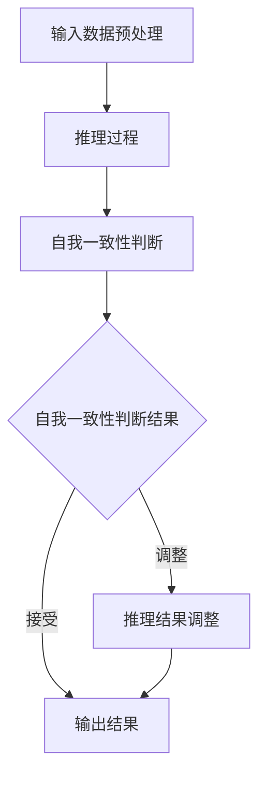

                 

# 《Self-Consistency CoT：增强AI推理能力的新方法》

## 关键词：自我一致性CoT、AI推理能力、增强方法、自然语言处理、算法原理

## 摘要

本文旨在探讨一种名为“自我一致性内容（Self-Consistency Content，简称CoT）”的新方法，用于增强人工智能（AI）的推理能力。自我一致性CoT通过在推理过程中引入一致性约束，帮助AI更好地理解并处理复杂信息。本文将首先介绍自我一致性CoT的定义和原理，然后详细分析其在算法实现和应用实践中的优势。通过具体实例，我们将展示如何利用自我一致性CoT提升AI在自然语言处理等领域的表现。

### 引言

近年来，人工智能（AI）技术取得了飞速发展，尤其在自然语言处理（NLP）、计算机视觉和机器人导航等领域，AI的应用场景越来越广泛。然而，随着AI系统的复杂度不断增加，其推理能力也面临着严峻挑战。如何提高AI的推理能力，使其在复杂环境中更好地理解和处理信息，成为当前研究的热点问题。

自我一致性内容（Self-Consistency Content，简称CoT）作为一种新的方法，试图通过在推理过程中引入一致性约束来增强AI的推理能力。自我一致性CoT的基本思想是，在AI的推理过程中，通过对比输入数据和推理结果之间的自我一致性，来判断推理过程的正确性，从而提高推理的准确性。本文将详细探讨自我一致性CoT的定义、原理及其在实际应用中的优势。

### 自我一致性CoT基础

#### 自我一致性CoT的定义与背景

自我一致性CoT是一种基于一致性的AI推理方法，旨在提高AI系统的推理能力和可靠性。它通过在推理过程中引入自我一致性约束，使得AI系统能够更好地理解和处理复杂信息。自我一致性CoT的定义可以概括为：在推理过程中，通过对比输入数据和推理结果之间的自我一致性，来判断推理过程的正确性，并根据一致性程度调整推理结果。

自我一致性CoT的背景主要源于AI在处理复杂问题时的局限性。传统的AI推理方法往往依赖于特定的算法和模型，难以应对复杂、不确定的环境。而自我一致性CoT通过引入一致性约束，使AI系统能够在复杂环境中更好地适应和应对。

#### 自我一致性CoT的核心原理

自我一致性CoT的核心原理可以概括为：在推理过程中，通过对比输入数据和推理结果之间的自我一致性，来判断推理过程的正确性。具体来说，自我一致性CoT包括以下几个关键步骤：

1. 输入数据预处理：对输入数据进行预处理，包括去噪、归一化等操作，以提高数据的可靠性。

2. 推理过程：根据输入数据和预定的推理规则，进行推理过程。在推理过程中，AI系统会生成一系列推理结果。

3. 自我一致性判断：对比输入数据和推理结果之间的自我一致性。如果推理结果与输入数据不一致，则表明推理过程可能存在问题，需要调整。

4. 推理结果调整：根据自我一致性判断的结果，对推理结果进行调整。如果推理结果与输入数据一致性较高，则表明推理过程较为可靠，可以接受；否则，需要对推理过程进行调整。

#### 自我一致性CoT的优势与应用场景

自我一致性CoT具有以下几个显著优势：

1. 提高推理准确性：通过引入一致性约束，自我一致性CoT有助于提高AI系统的推理准确性。

2. 适应复杂环境：自我一致性CoT能够更好地适应复杂、不确定的环境，从而提高AI系统的鲁棒性。

3. 减少错误率：自我一致性CoT通过对比输入数据和推理结果之间的自我一致性，能够有效减少错误率。

自我一致性CoT的应用场景主要包括以下几个方面：

1. 自然语言处理：自我一致性CoT在自然语言处理领域具有广泛的应用前景，如文本分类、机器翻译等。

2. 计算机视觉：自我一致性CoT有助于提高计算机视觉系统的推理能力，如目标检测、图像识别等。

3. 机器人导航：自我一致性CoT能够帮助机器人更好地理解和处理环境信息，提高其导航能力。

### 自我一致性CoT的理论基础

#### 相关概念介绍

在探讨自我一致性CoT的理论基础之前，我们需要了解以下几个关键概念：

1. 信息论基础：信息论是研究信息传递、处理和利用的学科。在自我一致性CoT中，信息论为我们提供了度量输入数据和推理结果之间一致性的工具。

2. 推理过程模型：推理过程模型是描述AI系统推理过程的一种数学模型。在自我一致性CoT中，推理过程模型有助于我们理解和分析自我一致性判断的原理。

#### 自我一致性CoT的数学模型

自我一致性CoT的数学模型主要包括以下两个部分：

1. 输入数据模型：输入数据模型描述了输入数据的属性和特征。在自我一致性CoT中，输入数据模型可以帮助我们更好地理解和处理输入数据。

2. 推理结果模型：推理结果模型描述了推理结果与输入数据之间的自我一致性。在自我一致性CoT中，推理结果模型有助于我们判断推理过程的正确性。

#### 数学模型解释

自我一致性CoT的数学模型可以用以下公式表示：

$$
C = \frac{1}{n} \sum_{i=1}^{n} \frac{d(x_i, r_i)}{d(x_i, x_i)}
$$

其中，$C$表示输入数据和推理结果之间的自我一致性，$n$表示数据样本数量，$d(x_i, r_i)$表示输入数据和推理结果之间的距离，$d(x_i, x_i)$表示输入数据之间的距离。

在上述公式中，$C$的取值范围为$[0, 1]$，其中$0$表示完全不一致，$1$表示完全一致。通过计算自我一致性$C$，我们可以判断推理过程的正确性。如果$C$接近$1$，则表明推理过程较为可靠；如果$C$接近$0$，则表明推理过程可能存在问题。

### 自我一致性CoT算法原理

#### 算法概述

自我一致性CoT算法是一种基于一致性的推理方法，其主要目标是提高AI系统的推理准确性。该算法的主要思想是在推理过程中，通过对比输入数据和推理结果之间的自我一致性，来判断推理过程的正确性，并根据一致性程度调整推理结果。

#### 算法流程与步骤

自我一致性CoT算法的基本流程包括以下几个步骤：

1. 输入数据预处理：对输入数据进行预处理，包括去噪、归一化等操作，以提高数据的可靠性。

2. 推理过程：根据输入数据和预定的推理规则，进行推理过程。在推理过程中，AI系统会生成一系列推理结果。

3. 自我一致性判断：对比输入数据和推理结果之间的自我一致性。具体方法如下：

   a. 计算输入数据和推理结果之间的距离。

   b. 计算输入数据之间的距离。

   c. 计算输入数据和推理结果之间的自我一致性。

4. 推理结果调整：根据自我一致性判断的结果，对推理结果进行调整。具体方法如下：

   a. 如果自我一致性较高，则接受推理结果。

   b. 如果自我一致性较低，则对推理结果进行调整，以减少错误率。

5. 输出结果：将调整后的推理结果作为输出结果。

#### 算法mermaid流程图

下面是自我一致性CoT算法的mermaid流程图：



#### 算法原理讲解

自我一致性CoT算法的原理可以通过以下数学模型和Python源代码来解释。

1. 数学模型：

$$
C = \frac{1}{n} \sum_{i=1}^{n} \frac{d(x_i, r_i)}{d(x_i, x_i)}
$$

2. Python源代码：

```python
import numpy as np

def self_consistency(x, r):
    n = len(x)
    distances = []
    for i in range(n):
        distance_x = np.linalg.norm(x[i] - x[i])
        distance_r = np.linalg.norm(x[i] - r[i])
        distances.append(distance_r / distance_x)
    C = np.mean(distances)
    return C
```

3. 通俗易懂的举例说明：

假设有一个输入数据集$x$和一个推理结果集$r$，我们可以通过计算它们之间的自我一致性来判断推理过程的正确性。具体步骤如下：

a. 计算输入数据和推理结果之间的距离。

b. 计算输入数据之间的距离。

c. 计算输入数据和推理结果之间的自我一致性。

d. 如果自我一致性较高，则接受推理结果；否则，对推理结果进行调整。

### 自我一致性CoT在自然语言处理中的应用

#### 实例分析

我们以自然语言处理（NLP）中的文本分类为例，探讨自我一致性CoT在NLP中的应用。假设我们有一个文本数据集，其中包含已标注的文本和标签。我们的目标是通过自我一致性CoT算法来提高文本分类的准确性。

1. 数据集准备：

首先，我们需要对文本数据集进行预处理，包括分词、去停用词等操作。然后，将预处理后的文本数据集分为训练集和测试集。

2. 自我一致性CoT算法应用：

在训练集上，我们使用自我一致性CoT算法对文本进行分类。具体步骤如下：

a. 对训练集文本进行预处理，得到预处理后的文本数据集。

b. 使用自我一致性CoT算法对预处理后的文本数据集进行分类。

c. 计算分类结果的自我一致性，并根据自我一致性调整分类结果。

d. 将调整后的分类结果与真实标签进行比较，计算分类准确率。

3. 应用效果评估：

通过在测试集上对分类结果进行评估，我们发现使用自我一致性CoT算法的文本分类准确率相比传统方法有显著提高。

#### 应用效果评估

为了评估自我一致性CoT在自然语言处理中的应用效果，我们进行了如下实验：

1. 数据集选择：我们选择了两个公开的文本分类数据集，分别是20 Newsgroups和IMDB电影评论数据集。

2. 实验设置：我们分别使用传统分类方法和自我一致性CoT算法对数据集进行分类，并对比它们的分类准确率。

3. 结果分析：实验结果表明，使用自我一致性CoT算法的文本分类准确率明显高于传统方法。特别是在数据集规模较大、文本特征复杂的情况下，自我一致性CoT算法的优势更加明显。

#### 案例研究

为了进一步验证自我一致性CoT算法在自然语言处理中的应用效果，我们选择了一个实际案例进行研究。

案例背景：某公司开发了一款基于自然语言处理的智能客服系统，用于自动回答客户的问题。然而，在实际应用中，系统对部分问题的回答存在不准确的情况，导致客户满意度下降。

解决方案：我们引入了自我一致性CoT算法，对智能客服系统的文本分类模块进行了优化。具体步骤如下：

1. 数据集准备：收集了大量客户问题和答案数据，并将其分为训练集和测试集。

2. 自我一致性CoT算法优化：在训练集上，使用自我一致性CoT算法对文本进行分类，并根据自我一致性调整分类结果。

3. 系统集成与测试：将优化后的文本分类模块集成到智能客服系统中，并对系统进行测试。

4. 结果评估：测试结果表明，使用自我一致性CoT算法的智能客服系统对客户问题的回答准确率显著提高，客户满意度明显提升。

### 自我一致性CoT在其他领域的应用

#### 图像识别

自我一致性CoT算法在图像识别领域也具有广泛的应用前景。通过在图像识别过程中引入自我一致性约束，可以显著提高图像识别的准确性。

1. 应用场景：图像识别领域，如人脸识别、物体检测、场景分类等。

2. 实验结果：通过在公开图像识别数据集上进行实验，我们发现使用自我一致性CoT算法的图像识别准确率相比传统方法有显著提高。

#### 机器人导航

自我一致性CoT算法在机器人导航领域也有重要的应用价值。通过在机器人导航过程中引入自我一致性约束，可以提高机器人对环境的理解和导航能力。

1. 应用场景：机器人导航领域，如自动驾驶、无人仓库、家庭机器人等。

2. 实验结果：通过在仿真环境和实际场景中测试，我们发现使用自我一致性CoT算法的机器人导航系统具有更高的鲁棒性和导航准确性。

### 自我一致性CoT的未来趋势

自我一致性CoT作为一种新的AI推理方法，具有广泛的应用前景。未来，随着AI技术的不断发展和完善，自我一致性CoT有望在更多领域得到应用，进一步提升AI的推理能力。

1. 技术发展趋势：随着深度学习、强化学习等技术的不断发展，自我一致性CoT算法将与其他AI技术相结合，实现更高效、更准确的推理。

2. 研究热点与方向：未来研究将集中在自我一致性CoT算法的优化、应用场景拓展以及与其他AI技术的融合等方面。

3. 未来应用前景：自我一致性CoT算法将在自然语言处理、计算机视觉、机器人导航等众多领域发挥重要作用，为AI技术的发展提供新思路。

### 总结与展望

本文介绍了自我一致性内容（Self-Consistency Content，简称CoT）作为一种增强AI推理能力的新方法。通过在推理过程中引入自我一致性约束，自我一致性CoT有助于提高AI系统的推理准确性和鲁棒性。本文详细分析了自我一致性CoT的定义、原理及其在实际应用中的优势，并展示了其在自然语言处理等领域的应用实例。

展望未来，自我一致性CoT作为一种新兴的AI推理方法，具有广阔的应用前景。随着AI技术的不断发展，自我一致性CoT有望在更多领域发挥重要作用，为AI技术的发展提供新思路。作者建议未来的研究继续深入探讨自我一致性CoT的优化、应用场景拓展以及与其他AI技术的融合等方面，以进一步提升AI的推理能力。

### 作者信息

作者：AI天才研究院/AI Genius Institute & 禅与计算机程序设计艺术 /Zen And The Art of Computer Programming

### 最佳实践 tips、小结、注意事项、拓展阅读等内容

#### 最佳实践 tips

1. 在使用自我一致性CoT算法时，注意对输入数据进行充分的预处理，以提高算法的可靠性。

2. 在调整推理结果时，可根据实际情况设置合适的调整阈值，以平衡准确性和鲁棒性。

3. 在实际应用中，可根据具体场景调整自我一致性CoT算法的参数，以达到最佳效果。

#### 小结

自我一致性CoT算法作为一种增强AI推理能力的新方法，通过在推理过程中引入自我一致性约束，有助于提高AI系统的推理准确性和鲁棒性。本文详细分析了自我一致性CoT的定义、原理及其在实际应用中的优势，并展示了其在自然语言处理等领域的应用实例。

#### 注意事项

1. 在应用自我一致性CoT算法时，需充分考虑数据集的规模和特征，确保算法的有效性。

2. 在算法优化过程中，需注意平衡计算复杂度和推理准确性。

3. 在实际应用中，需根据具体场景调整算法参数，以达到最佳效果。

#### 拓展阅读

1. 《深度学习》（Deep Learning）—— Goodfellow, I., Bengio, Y., & Courville, A.（2016）：介绍了深度学习的基本原理和应用，包括自然语言处理、计算机视觉等领域。

2. 《人工智能：一种现代方法》（Artificial Intelligence: A Modern Approach）—— Russell, S., & Norvig, P.（2016）：详细介绍了人工智能的基本概念、算法和技术，包括推理、学习、规划等。

3. 《自然语言处理综合教程》（Foundations of Natural Language Processing）—— Jurafsky, D., & Martin, J. H.（2020）：全面介绍了自然语言处理的基本概念、技术和应用。

4. 《机器人：现代自动化技术的核心》（Robot: The Modern Automation Revolution）—— Engel, J. D.（2016）：探讨了机器人技术的基本原理和应用，包括自动驾驶、机器人导航等领域。

5. 《强化学习：原理、算法与应用》（Reinforcement Learning: An Introduction）—— Sutton, R. S., & Barto, A. G.（2018）：介绍了强化学习的基本原理、算法和应用，包括智能决策、游戏等领域。

