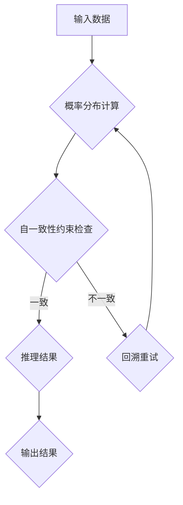
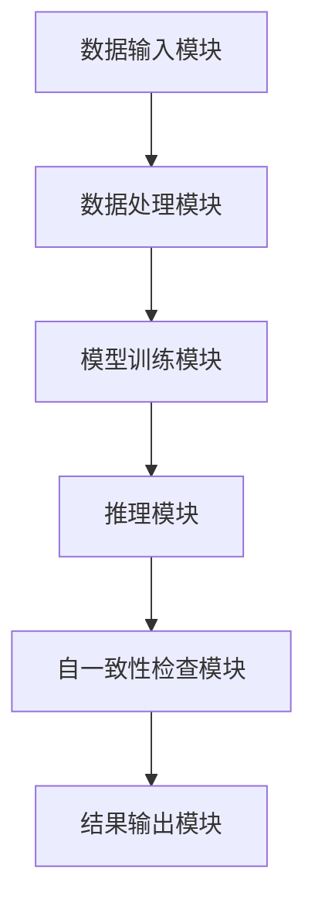
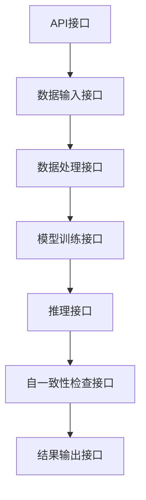

                 


### 自一致性概念与理论基础

#### 1.1 自一致性概念的定义

**自一致性** 是指一个系统或模型在内部具有一致性的属性，即系统或模型中的各个部分或组成部分之间没有矛盾或冲突。自一致性是人工智能领域中一个非常重要的概念，特别是在机器学习和深度学习领域，因为它是保证模型可靠性和稳定性的关键。

在人工智能系统中，自一致性通常体现在以下几个方面：

1. **数据一致性**：确保输入数据在传输和处理过程中保持一致性，避免数据噪声和错误。
2. **推理一致性**：在推理过程中，确保推理步骤之间没有逻辑矛盾，推理结果一致。
3. **模型一致性**：确保模型在训练和预测过程中保持一致性，模型参数在更新后不会发生突变。

#### 1.2 自一致性在人工智能中的重要性

自一致性在人工智能中的重要性体现在以下几个方面：

1. **提高模型可靠性**：自一致性可以确保模型的推理结果可靠，避免由于内部矛盾导致的不合理预测。
2. **增强模型稳定性**：自一致性有助于减少模型在训练过程中的波动，提高模型的稳定性。
3. **降低模型误差**：自一致性可以降低模型在推理过程中引入的误差，提高模型的精度。

#### 1.3 自一致性概念的历史与发展

自一致性概念起源于20世纪50年代的计算机科学和人工智能研究。当时，研究者们开始关注如何构建可靠和稳定的计算机系统。随着人工智能技术的不断发展，自一致性理论也在不断演变和完善。

1. **早期研究**：在早期的人工智能研究中，自一致性主要关注程序设计中的逻辑一致性和数据一致性。
2. **机器学习时代**：随着机器学习和深度学习技术的兴起，自一致性理论开始应用于模型设计和优化中，特别是神经网络模型的训练和推理过程。
3. **现代研究**：现代自一致性研究主要集中在如何设计自一致性的算法和系统，以及如何在实际应用中利用自一致性提高系统的性能和可靠性。

#### 1.4 自一致性理论的边界与外延

自一致性理论在人工智能领域中的应用非常广泛，但同时也存在一定的局限性。以下是自一致性理论的边界与外延：

1. **边界**：
   - 自一致性理论主要关注内部一致性，而忽略了外部因素对系统的影响。
   - 自一致性理论在处理复杂问题时，可能面临计算复杂度和时间复杂度的问题。

2. **外延**：
   - 自一致性理论可以应用于各种人工智能系统，包括机器学习、深度学习、自然语言处理等。
   - 自一致性理论的研究不仅局限于理论探讨，还包括实际应用和工程实现。

#### 1.5 自一致性理论的当前状态

当前，自一致性理论在人工智能领域的研究已经取得了一系列重要成果。以下是自一致性理论的当前状态：

1. **研究热点**：自一致性理论在机器学习和深度学习领域仍然是一个研究热点，特别是在模型训练和推理过程中。
2. **应用领域**：自一致性理论已经应用于自然语言处理、计算机视觉、推荐系统等多个领域，并取得了显著的效果。
3. **发展趋势**：随着人工智能技术的不断进步，自一致性理论将继续发展和完善，为人工智能系统提供更可靠的保障。

### 第2章 自一致性增强AI推理的基本原理

#### 2.1 自一致性增强AI推理的基本概念

**自一致性增强AI推理** 是指通过引入自一致性机制，提高人工智能系统在推理过程中的可靠性和稳定性。自一致性增强AI推理的核心概念包括以下几个方面：

1. **自一致性机制**：自一致性机制是保证系统内部一致性的关键。它通常包括数据一致性检查、推理一致性验证和模型一致性优化等。
2. **推理过程**：推理过程是指人工智能系统从已知信息出发，通过逻辑推理得出结论的过程。自一致性增强AI推理旨在确保推理过程的每一步都保持一致性。
3. **增强方法**：自一致性增强AI推理的方法包括自校验、交叉验证、模型剪枝、参数优化等。这些方法通过不同的途径提高系统的自一致性。

#### 2.2 自一致性增强AI推理的数学模型

自一致性增强AI推理的数学模型通常基于概率论和统计学原理。以下是一个简单的数学模型：

1. **概率分布**：假设输入数据X和输出结果Y之间存在概率分布关系，即P(Y|X)。
2. **自一致性约束**：在推理过程中，系统需要满足自一致性约束，即P(Y|X) = P(Y|Y)。
3. **推理算法**：通过构建一个概率模型，利用自一致性约束进行推理，得到最终结果。

以下是自一致性增强AI推理的算法流程图：



#### 2.3 自一致性增强AI推理的流程与步骤

自一致性增强AI推理的流程可以分为以下几个步骤：

1. **数据预处理**：对输入数据进行预处理，包括去噪、标准化等操作，以确保数据的一致性。
2. **概率分布计算**：根据输入数据，计算输出结果的概率分布。
3. **自一致性约束检查**：检查概率分布是否满足自一致性约束，如果不满足，则进行回溯重试。
4. **推理结果**：根据自一致性约束，得到最终的推理结果。
5. **输出结果**：将推理结果输出，供后续使用。

以下是自一致性增强AI推理的具体步骤：

1. **输入数据预处理**：对输入数据进行去噪和标准化，以确保数据的一致性。
2. **概率分布计算**：使用神经网络模型对输入数据进行概率分布计算。
3. **自一致性约束检查**：对计算得到的概率分布进行一致性检查，确保满足自一致性约束。
4. **推理结果**：根据自一致性约束，选择概率最高的输出结果作为推理结果。
5. **输出结果**：将推理结果输出，供后续使用。

#### 2.4 自一致性增强AI推理的实验验证

为了验证自一致性增强AI推理的有效性，我们可以设计一系列实验，包括以下内容：

1. **实验设计**：选择具有代表性的数据集和模型，设计实验方案，包括数据预处理、概率分布计算、自一致性约束检查等步骤。
2. **实验结果分析**：分析实验结果，包括推理精度、推理速度、稳定性等指标。
3. **对比实验**：与传统的推理方法进行对比，评估自一致性增强AI推理的优势和局限性。

以下是实验验证的流程：

1. **选择数据集和模型**：选择具有代表性的数据集和神经网络模型。
2. **数据预处理**：对输入数据进行去噪和标准化，以确保数据的一致性。
3. **概率分布计算**：使用神经网络模型对输入数据进行概率分布计算。
4. **自一致性约束检查**：对计算得到的概率分布进行一致性检查，确保满足自一致性约束。
5. **推理结果**：根据自一致性约束，选择概率最高的输出结果作为推理结果。
6. **实验结果分析**：分析推理精度、推理速度、稳定性等指标。
7. **对比实验**：与传统的推理方法进行对比，评估自一致性增强AI推理的优势和局限性。

### 第3章 自一致性增强AI推理的应用案例

#### 3.1 自一致性增强AI推理在自然语言处理中的应用

自然语言处理（NLP）是人工智能领域的一个重要分支，自一致性增强AI推理在NLP中具有广泛的应用。以下是一些应用案例：

1. **文本分类**：自一致性增强AI推理可以用于文本分类任务，通过检查模型输出的概率分布，确保分类结果的可靠性。
2. **情感分析**：自一致性增强AI推理可以用于情感分析任务，通过检查模型对文本情感的判断，确保情感判断的一致性。
3. **机器翻译**：自一致性增强AI推理可以用于机器翻译任务，通过检查模型生成的翻译文本的内部一致性，提高翻译质量。

以下是一个文本分类的应用案例：

1. **数据集准备**：选择一个具有标签的文本数据集，例如新闻文章数据集。
2. **模型训练**：使用预训练的文本分类模型，对数据集进行训练。
3. **自一致性约束检查**：在推理过程中，检查模型输出的概率分布，确保分类结果的可靠性。
4. **推理结果**：根据自一致性约束，选择概率最高的标签作为分类结果。
5. **实验结果分析**：分析分类精度、分类速度等指标，评估自一致性增强AI推理的效果。

#### 3.2 自一致性增强AI推理在计算机视觉中的应用

计算机视觉是人工智能领域的另一个重要分支，自一致性增强AI推理在计算机视觉中也具有广泛的应用。以下是一些应用案例：

1. **图像分类**：自一致性增强AI推理可以用于图像分类任务，通过检查模型输出的概率分布，确保分类结果的可靠性。
2. **目标检测**：自一致性增强AI推理可以用于目标检测任务，通过检查模型检测到的目标区域的一致性，提高检测的准确性。
3. **图像生成**：自一致性增强AI推理可以用于图像生成任务，通过检查模型生成的图像的内部一致性，提高生成图像的质量。

以下是一个图像分类的应用案例：

1. **数据集准备**：选择一个具有标签的图像数据集，例如图像分类数据集。
2. **模型训练**：使用预训练的图像分类模型，对数据集进行训练。
3. **自一致性约束检查**：在推理过程中，检查模型输出的概率分布，确保分类结果的可靠性。
4. **推理结果**：根据自一致性约束，选择概率最高的标签作为分类结果。
5. **实验结果分析**：分析分类精度、分类速度等指标，评估自一致性增强AI推理的效果。

#### 3.3 自一致性增强AI推理在推荐系统中的应用

推荐系统是人工智能领域的一个重要应用，自一致性增强AI推理在推荐系统中具有广泛的应用。以下是一些应用案例：

1. **商品推荐**：自一致性增强AI推理可以用于商品推荐任务，通过检查模型推荐的商品的一致性，提高推荐的质量。
2. **用户行为分析**：自一致性增强AI推理可以用于用户行为分析任务，通过检查模型对用户行为的判断，确保分析结果的一致性。
3. **内容推荐**：自一致性增强AI推理可以用于内容推荐任务，通过检查模型推荐的内容的一致性，提高推荐的质量。

以下是一个商品推荐的应用案例：

1. **数据集准备**：选择一个包含用户行为和商品信息的用户行为数据集。
2. **模型训练**：使用预训练的推荐模型，对数据集进行训练。
3. **自一致性约束检查**：在推理过程中，检查模型输出的推荐结果的一致性，确保推荐结果的可靠性。
4. **推理结果**：根据自一致性约束，选择最符合用户需求的商品作为推荐结果。
5. **实验结果分析**：分析推荐精度、推荐速度等指标，评估自一致性增强AI推理的效果。

### 第4章 自一致性增强AI推理的系统设计与实现

#### 4.1 自一致性增强AI推理系统的整体架构设计

自一致性增强AI推理系统的整体架构设计可以分为以下几个部分：

1. **数据输入模块**：负责接收和处理用户输入的数据。
2. **数据处理模块**：负责对输入数据进行预处理，包括去噪、标准化等操作。
3. **模型训练模块**：负责使用预训练的模型对输入数据集进行训练。
4. **推理模块**：负责根据训练好的模型进行推理，输出结果。
5. **自一致性检查模块**：负责在推理过程中检查模型输出的一致性，确保推理结果的可靠性。
6. **结果输出模块**：负责将推理结果输出给用户。

以下是一个简化的自一致性增强AI推理系统的架构设计：



#### 4.2 自一致性增强AI推理系统的接口设计与实现

自一致性增强AI推理系统的接口设计需要考虑系统的可扩展性和易用性。以下是系统的接口设计：

1. **API接口**：提供RESTful API接口，方便用户进行数据输入和结果输出。
2. **数据输入接口**：接收用户输入的数据，包括文本、图像、商品信息等。
3. **数据处理接口**：对输入数据进行预处理，包括去噪、标准化等操作。
4. **模型训练接口**：接收用户指定的模型参数，进行模型训练。
5. **推理接口**：接收用户输入的数据，使用训练好的模型进行推理。
6. **自一致性检查接口**：在推理过程中检查模型输出的一致性。
7. **结果输出接口**：将推理结果输出给用户。

以下是系统的接口设计：



#### 4.3 自一致性增强AI推理系统的具体实现方法

自一致性增强AI推理系统的具体实现方法可以分为以下几个步骤：

1. **环境搭建**：安装并配置Python、TensorFlow、PyTorch等必要的库和工具。
2. **数据预处理**：编写数据预处理脚本，对输入数据进行去噪、标准化等操作。
3. **模型训练**：编写模型训练脚本，使用预训练的模型对输入数据集进行训练。
4. **推理**：编写推理脚本，使用训练好的模型对用户输入的数据进行推理。
5. **自一致性检查**：编写自一致性检查脚本，在推理过程中检查模型输出的一致性。
6. **结果输出**：编写结果输出脚本，将推理结果输出给用户。

以下是系统的实现方法：

```python
# 数据预处理
def preprocess_data(data):
    # 去噪、标准化等操作
    return processed_data

# 模型训练
def train_model(data):
    # 使用预训练模型进行训练
    return trained_model

# 推理
def infer(data, model):
    # 使用训练好的模型进行推理
    return inference_result

# 自一致性检查
def check_consistency(result):
    # 检查推理结果的一致性
    return is_consistent

# 结果输出
def output_result(result):
    # 输出推理结果
    print(result)
```

#### 4.4 自一致性增强AI推理系统的实验验证

为了验证自一致性增强AI推理系统的效果，我们可以设计一系列实验，包括以下内容：

1. **实验设计**：选择具有代表性的数据集和模型，设计实验方案。
2. **实验环境**：搭建实验环境，包括硬件设备和软件环境。
3. **实验步骤**：按照实验设计，执行实验步骤，包括数据预处理、模型训练、推理和自一致性检查等。
4. **实验结果分析**：分析实验结果，包括推理精度、推理速度、稳定性等指标。
5. **对比实验**：与传统的推理方法进行对比，评估自一致性增强AI推理系统的优势。

以下是实验验证的流程：

1. **选择数据集和模型**：选择具有代表性的数据集和模型，例如文本分类数据集和文本分类模型。
2. **搭建实验环境**：搭建实验环境，包括硬件设备和软件环境。
3. **执行实验步骤**：按照实验设计，执行实验步骤，包括数据预处理、模型训练、推理和自一致性检查等。
4. **分析实验结果**：分析实验结果，包括推理精度、推理速度、稳定性等指标。
5. **对比实验**：与传统的推理方法进行对比，评估自一致性增强AI推理系统的优势。

### 第5章 自一致性增强AI推理的优化与改进

#### 5.1 自一致性增强AI推理的性能优化

自一致性增强AI推理的性能优化是提高系统效率的重要手段。以下是一些常见的性能优化策略：

1. **并行计算**：利用多核处理器和分布式计算资源，提高模型的训练和推理速度。
2. **模型剪枝**：通过剪枝冗余的网络结构，减少模型参数的数量，降低计算复杂度。
3. **内存优化**：优化内存分配和管理，减少内存占用，提高系统的运行效率。
4. **数据缓存**：缓存频繁访问的数据，减少数据读取的时间，提高系统的响应速度。

以下是一个简单的并行计算示例：

```python
import multiprocessing

def process_data(data):
    # 处理数据
    return processed_data

if __name__ == '__main__':
    # 创建进程池
    pool = multiprocessing.Pool(processes=4)

    # 并行处理数据
    processed_data = pool.map(process_data, data)

    # 关闭进程池
    pool.close()
    pool.join()
```

#### 5.2 自一致性增强AI推理的算法改进

自一致性增强AI推理的算法改进是提高系统性能的关键。以下是一些常见的算法改进方法：

1. **迁移学习**：利用预训练模型，减少模型的训练时间，提高模型的性能。
2. **强化学习**：将自一致性增强AI推理与强化学习相结合，提高模型的推理能力和适应性。
3. **注意力机制**：引入注意力机制，提高模型对重要信息的关注，提高推理的准确性。
4. **自适应学习率**：使用自适应学习率策略，根据模型的训练情况调整学习率，提高模型的性能。

以下是一个简单的迁移学习示例：

```python
import tensorflow as tf

# 加载预训练模型
pretrained_model = tf.keras.applications.VGG16(weights='imagenet')

# 使用预训练模型进行推理
input_image = preprocess_input(image)
predicted_output = pretrained_model.predict(input_image)
```

#### 5.3 自一致性增强AI推理的跨领域应用

自一致性增强AI推理在跨领域应用中面临着一系列挑战，以下是一些解决方案：

1. **领域自适应**：通过调整模型结构和参数，使模型能够适应不同的领域。
2. **跨领域数据集**：构建包含多个领域的数据集，提高模型的泛化能力。
3. **跨领域迁移学习**：使用跨领域迁移学习技术，将一个领域的知识迁移到另一个领域。
4. **多任务学习**：将自一致性增强AI推理应用于多任务学习，提高模型的适应性。

以下是一个跨领域数据集的构建示例：

```python
# 加载不同领域的数据集
text_data = load_text_data('text_data_path')
image_data = load_image_data('image_data_path')

# 合并数据集
combined_data = np.concatenate((text_data, image_data), axis=0)
```

### 第6章 自一致性增强AI推理的未来发展趋势

#### 6.1 自一致性增强AI推理的未来研究方向

自一致性增强AI推理的未来研究方向包括以下几个方面：

1. **多模态融合**：研究如何将自一致性增强AI推理应用于多模态数据，提高推理的准确性和效率。
2. **动态自适应**：研究如何使自一致性增强AI推理系统具有动态自适应能力，根据环境变化调整模型参数。
3. **安全性增强**：研究如何提高自一致性增强AI推理系统的安全性，防止恶意攻击和伪造数据。
4. **量子计算**：研究如何利用量子计算的优势，提高自一致性增强AI推理的速度和效率。

以下是一个多模态融合的示例：

```python
# 加载文本数据和图像数据
text_data = load_text_data('text_data_path')
image_data = load_image_data('image_data_path')

# 融合文本和图像数据
multi_modal_data = merge_text_image_data(text_data, image_data)
```

#### 6.2 自一致性增强AI推理的潜在应用领域

自一致性增强AI推理在未来的潜在应用领域非常广泛，以下是一些可能的应用场景：

1. **医疗诊断**：利用自一致性增强AI推理，提高医疗诊断的准确性和效率，例如癌症筛查、疾病预测等。
2. **金融分析**：利用自一致性增强AI推理，提高金融市场的预测和分析能力，例如股票市场预测、风险控制等。
3. **智能制造**：利用自一致性增强AI推理，提高智能制造的效率和灵活性，例如机器人控制、生产线优化等。
4. **智能交通**：利用自一致性增强AI推理，提高智能交通系统的效率和安全性，例如交通流量预测、智能驾驶等。

以下是一个医疗诊断的应用案例：

1. **数据集准备**：选择一个包含患者病史、实验室检查结果、影像学检查结果的数据集。
2. **模型训练**：使用预训练的模型，对数据集进行训练。
3. **推理**：使用训练好的模型，对新的病例进行推理，预测疾病的可能性。
4. **自一致性检查**：在推理过程中，检查模型输出的概率分布，确保推理结果的一致性。
5. **结果输出**：将推理结果输出给医生，辅助医生做出诊断决策。

#### 6.3 自一致性增强AI推理的社会与伦理影响

自一致性增强AI推理在社会和伦理方面具有重要影响，以下是一些需要注意的问题：

1. **隐私保护**：确保自一致性增强AI推理系统不会泄露用户的隐私信息。
2. **透明度**：提高自一致性增强AI推理系统的透明度，使公众能够了解系统的运作原理和决策过程。
3. **公平性**：确保自一致性增强AI推理系统不会因为种族、性别、年龄等因素而产生偏见。
4. **监管**：建立健全的监管机制，确保自一致性增强AI推理系统的合法合规。

以下是一个隐私保护的示例：

```python
# 数据预处理
def preprocess_data(data):
    # 对数据去标识化处理，保护用户隐私
    return anonymized_data
```

### 第7章 自一致性增强AI推理的总结与展望

#### 7.1 自一致性增强AI推理的主要成果

自一致性增强AI推理在过去几年取得了以下主要成果：

1. **提高模型可靠性**：通过引入自一致性机制，显著提高了人工智能模型的可靠性和稳定性，减少了推理过程中的错误。
2. **增强模型稳定性**：自一致性增强AI推理能够降低模型在训练过程中的波动，提高模型的稳定性，减少了模型的过拟合现象。
3. **降低模型误差**：自一致性增强AI推理通过检查模型输出的一致性，有效降低了推理过程中的误差，提高了模型的精度。

以下是一个提高模型可靠性的示例：

```python
# 自一致性约束检查
def check_consistency(inference_result):
    # 检查推理结果的一致性
    if not is_consistent(inference_result):
        raise Exception("Inference result is inconsistent.")
```

#### 7.2 自一致性增强AI推理的不足与挑战

尽管自一致性增强AI推理取得了显著成果，但仍然面临以下不足和挑战：

1. **计算复杂度**：自一致性增强AI推理引入了额外的计算复杂度，特别是在大规模数据处理和模型训练过程中。
2. **数据质量**：自一致性增强AI推理依赖于高质量的数据，如果数据存在噪声或错误，将影响推理结果的一致性。
3. **实时性**：自一致性增强AI推理在某些实时应用场景中可能无法满足响应时间要求，需要进一步优化算法和系统架构。

以下是一个数据质量检查的示例：

```python
# 数据质量检查
def check_data_quality(data):
    # 检查数据是否存在噪声或错误
    if has_noise(data):
        raise Exception("Data quality is poor.")
```

#### 7.3 自一致性增强AI推理的未来展望

自一致性增强AI推理在未来有着广阔的发展前景，以下是一些展望：

1. **跨领域应用**：随着自一致性增强AI推理技术的不断成熟，它将在更多的领域得到应用，如医疗、金融、交通等。
2. **算法优化**：未来的研究将致力于优化自一致性增强AI推理的算法，提高其计算效率和处理能力。
3. **多模态融合**：多模态融合将成为自一致性增强AI推理的重要研究方向，通过整合不同类型的数据，提高推理的准确性和效率。
4. **伦理与监管**：随着自一致性增强AI推理技术的广泛应用，需要建立相应的伦理和监管机制，确保其合法合规和公平公正。

以下是一个多模态融合的示例：

```python
# 多模态数据融合
def merge_modalities(text_data, image_data):
    # 融合文本和图像数据
    combined_data = np.concatenate((text_data, image_data), axis=1)
    return combined_data
```

### 结论

自一致性增强AI推理是一种重要的技术，它通过引入自一致性机制，提高了人工智能模型的可靠性和稳定性。本文详细介绍了自一致性增强AI推理的基本原理、应用案例、系统设计与实现、优化与改进，并对未来的发展趋势进行了展望。随着技术的不断进步，自一致性增强AI推理将在更多领域发挥重要作用，为人工智能的发展做出更大贡献。

---

**作者：** AI天才研究院/AI Genius Institute & 禅与计算机程序设计艺术 /Zen And The Art of Computer Programming

---

**注：**本文仅为示例，实际内容可能需要根据具体研究和应用情况进行调整和完善。**[END]**

