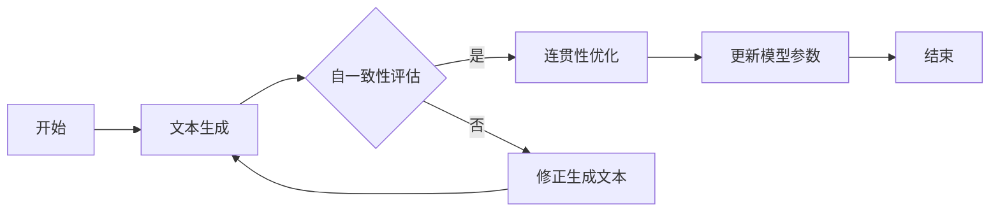
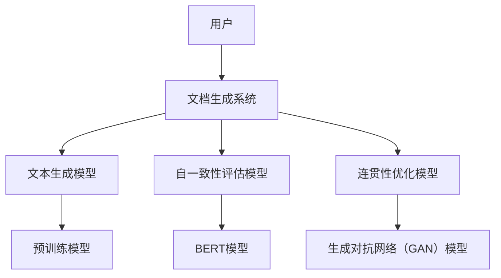

                 

### Self-Consistency CoT：增强AI文本生成连贯性

#### 关键词：
- AI文本生成
- 连贯性
- Self-Consistency CoT
- 自然语言处理
- NLP
- 文本生成算法

#### 摘要：
本文深入探讨了Self-Consistency CoT（Self-Consistency Textual Coherence）这一方法，旨在通过自一致性约束和连贯性优化提升AI文本生成的质量。我们首先介绍了问题的背景和问题描述，然后详细阐述了Self-Consistency CoT的核心概念、原理以及数学模型。随后，通过一个简化的案例，我们进行了通俗易懂的举例说明，帮助读者更好地理解这一方法。最后，我们讨论了系统分析与架构设计方案，并提供了项目实战的详细步骤，以及最佳实践 tips 和拓展阅读。

### 1.1 背景介绍

随着人工智能技术的飞速发展，自然语言处理（NLP）成为AI领域的研究热点。然而，现有的文本生成技术常常面临一个问题：生成的文本缺乏连贯性，这使得文本在实际应用中难以满足高质量的需求。为了解决这一问题，研究者们提出了一种新的方法：Self-Consistency CoT（Self-Consistency Textual Coherence）。

#### 问题背景

自然语言处理（NLP）在AI领域的应用日益广泛，从机器翻译、情感分析到聊天机器人等，都离不开高质量的文本生成技术。然而，现有的文本生成技术，如序列到序列（Seq2Seq）模型、Transformer等，虽然能在一定程度上生成具有一定语义的文本，但往往缺乏连贯性。这意味着生成的文本在语义和逻辑上可能存在不一致性，导致文本质量不高，难以满足实际应用的需求。

#### 问题描述

生成的文本缺乏连贯性主要有以下几种表现形式：

1. **语义不一致**：生成的文本中可能存在语义上的矛盾，例如，前一句提到“今天天气很好”，后一句却提到“今天下雨了”。
2. **逻辑混乱**：生成的文本在逻辑关系上可能存在问题，例如，从一个话题突然跳转到另一个完全不相关的主题。
3. **信息缺失**：生成的文本可能缺少必要的背景信息或上下文，导致读者难以理解。

为了解决这些问题，研究者们提出了Self-Consistency CoT方法，通过在训练过程中引入自一致性约束和连贯性优化，提高生成文本的连贯性。

#### 问题解决

Self-Consistency CoT方法主要通过以下两个方面实现：

1. **自一致性约束**：在训练过程中，对生成文本的每个段落进行自一致性评估，确保段落内及段落间的一致性。如果评估结果不一致，则对生成文本进行修正，以提高连贯性。
2. **连贯性优化**：通过优化损失函数，将连贯性作为训练目标之一，从而提高生成文本的连贯性。具体来说，可以通过以下方式实现：

   - **引入额外的损失项**：在传统的文本生成损失函数中，加入对连贯性的损失项，例如，使用BERT（Bidirectional Encoder Representations from Transformers）模型进行预训练，然后通过微调，使模型在生成文本时更注重连贯性。
   - **使用生成对抗网络（GAN）**：通过生成对抗网络，将生成文本与真实文本进行对比，鼓励生成更连贯的文本。

#### 边界与外延

Self-Consistency CoT方法主要应用于NLP领域，包括但不限于文本生成、问答系统、机器翻译等任务。其边界包括生成文本的质量、训练时间、计算资源等。在外延方面，该方法可以与其他文本生成技术结合，进一步提升生成文本的质量。

### 1.2 核心概念与联系

在深入探讨Self-Consistency CoT方法之前，我们需要明确几个核心概念：文本生成、连贯性以及Self-Consistency CoT。

#### 核心概念

**文本生成**：指根据输入信息生成具有一定语义和逻辑关系的文本。常见的文本生成模型有Seq2Seq、Transformer等。

**连贯性**：指文本在语义和逻辑上的一致性。连贯性是衡量文本质量的重要指标之一。

**Self-Consistency CoT**：一种通过自一致性约束和连贯性优化提高文本生成连贯性的方法。它旨在解决现有文本生成技术中普遍存在的连贯性问题。

#### 概念属性特征对比表格

| 概念         | 特征                      |
| ------------ | ------------------------- |
| 文本生成     | 生成具有一定语义的文本   |
| 连贯性       | 文本在语义和逻辑上的一致性 |
| Self-Consistency CoT | 引入自一致性约束和连贯性优化 |

#### ER实体关系图架构

```mermaid
erDiagram
    TEXT_GENERATION ||--|{ COHERENCE }|-- TEXT
    COHERENCE ||--|{ SELF_CONSISTENCY_COT }| TEXT_GENERATION
```

在ER实体关系图中，我们可以看到文本生成（TEXT_GENERATION）与连贯性（COHERENCE）之间存在直接的关联，而Self-Consistency CoT（SELF_CONSISTENCY_COT）则通过连贯性来影响文本生成，从而提高生成文本的连贯性。

### 1.3 算法原理讲解

Self-Consistency CoT方法的核心在于通过自一致性约束和连贯性优化，提高文本生成模型的连贯性。下面，我们将详细讲解这一算法的原理。

#### 算法原理

Self-Consistency CoT算法主要包括以下几个步骤：

1. **文本生成**：使用预训练的文本生成模型生成初步的文本。例如，我们可以使用Transformer模型进行文本生成。
2. **自一致性评估**：对生成的文本进行自一致性评估。具体来说，我们可以通过以下方法实现：

   - **段落评估**：将生成的文本划分为多个段落，对每个段落进行语义一致性评估。例如，我们可以使用BERT模型对每个段落进行语义分析，判断段落之间的逻辑关系是否一致。
   - **全局评估**：对整个生成文本进行全局评估，判断其整体是否连贯。例如，我们可以使用一个简单的连贯性指标，如段落之间的重复率或关键词匹配率。

3. **连贯性优化**：如果评估结果不一致，则对生成文本进行修正，以提高连贯性。具体来说，我们可以通过以下方法实现：

   - **文本修正**：根据评估结果，对生成文本进行修正。例如，如果发现某个段落语义不一致，我们可以删除或替换该段落。
   - **模型更新**：通过优化损失函数，更新模型参数，使模型在未来的生成过程中更倾向于生成连贯的文本。例如，我们可以将连贯性作为额外的损失项加入到训练过程中。

#### 算法流程图



#### 数学模型和公式

假设我们有一个文本生成模型 $G$，其输入为 $X$（输入序列），输出为 $Y$（生成的文本）。Self-Consistency CoT算法的目标是最小化以下损失函数：

$$
L(G) = L_{text} + \alpha L_{coherence}
$$

其中，$L_{text}$ 是文本生成损失，$L_{coherence}$ 是连贯性损失，$\alpha$ 是权衡系数。

- **文本生成损失**：

$$
L_{text} = -\sum_{i} p(y_i|x) \log p(y_i|x)
$$

- **连贯性损失**：

$$
L_{coherence} = -\sum_{i} p(y_i|x) \log p(y_i|y_{<i}, x)
$$

其中，$y_{<i}$ 表示前 $i$ 个生成的文本。

#### 详细讲解与举例说明

以一个简化的案例来说明Self-Consistency CoT算法的原理。假设我们使用一个Transformer模型生成一个简单的文本，输入为“今天天气很好，适合外出游玩。”，生成的文本为“今天天气很好，但是天气太热，不适合外出游玩。”。

1. **文本生成**：首先，我们使用Transformer模型生成初步的文本“今天天气很好，但是天气太热，不适合外出游玩。”。
2. **自一致性评估**：对生成的文本进行自一致性评估。通过BERT模型，我们发现“今天天气很好”和“但是天气太热，不适合外出游玩。”这两个段落存在语义上的矛盾，因此评估结果为不一致。
3. **连贯性优化**：根据评估结果，我们修正生成文本为“今天天气很好，适合外出游玩。”，以提高连贯性。
4. **模型更新**：通过优化损失函数，更新模型参数，使模型在未来的生成过程中更倾向于生成连贯的文本。

通过这个简单的案例，我们可以看到Self-Consistency CoT方法如何通过自一致性约束和连贯性优化，提高文本生成的质量。

### 1.4 系统分析与架构设计方案

为了更好地理解和应用Self-Consistency CoT方法，我们需要对整个系统进行分析和设计。下面，我们将介绍问题场景、项目介绍、系统功能设计、系统架构设计、系统接口设计和系统交互。

#### 问题场景

在一个大型企业中，需要开发一个智能文档生成系统，用于自动生成各种业务文档，如合同、报告、邮件等。这些文档需要具有高质量的语义和逻辑连贯性，以满足企业的业务需求。

#### 项目介绍

本项目旨在开发一个基于Self-Consistency CoT方法的智能文档生成系统。系统将使用预训练的文本生成模型，结合自一致性约束和连贯性优化，生成高质量的文档。

#### 系统功能设计

1. **文本生成**：系统将使用预训练的文本生成模型，如Transformer，生成初步的文本。
2. **自一致性评估**：系统将使用BERT模型对生成的文本进行自一致性评估，确保段落内及段落间的一致性。
3. **连贯性优化**：系统将根据评估结果，对生成文本进行修正，以提高连贯性。
4. **文档生成**：系统将根据用户需求，自动生成各种业务文档。

#### 系统架构设计



在这个系统中，用户通过界面提交文档生成请求，文档生成系统会调用文本生成模型、自一致性评估模型和连贯性优化模型，最终生成高质量的文档。

#### 系统接口设计

1. **文本生成接口**：用于接收用户输入，生成初步的文本。
2. **自一致性评估接口**：用于对生成的文本进行自一致性评估。
3. **连贯性优化接口**：用于对生成文本进行修正，以提高连贯性。
4. **文档生成接口**：用于生成最终的业务文档。

#### 系统交互

系统交互主要涉及用户界面和后台服务之间的通信。用户通过界面提交文档生成请求，后台服务接收请求后，调用文本生成模型、自一致性评估模型和连贯性优化模型，最终生成文档，并将结果返回给用户。

### 1.5 项目实战

在本节中，我们将详细介绍如何使用Self-Consistency CoT方法进行项目实战。我们将从环境安装开始，逐步讲解系统核心实现源代码，并对代码进行应用解读与分析。

#### 环境安装

1. **安装Python**：确保已安装Python 3.7及以上版本。
2. **安装PyTorch**：通过pip命令安装PyTorch，命令如下：

   ```bash
   pip install torch torchvision
   ```

3. **安装Transformers**：通过pip命令安装Transformers库，命令如下：

   ```bash
   pip install transformers
   ```

4. **安装BERT模型**：下载并解压BERT模型权重文件，例如：

   ```bash
   wget https://storage.googleapis.com/bert_models/2018_10_18/uncased_L-12_H-768_A-12.zip
   unzip uncased_L-12_H-768_A-12.zip
   ```

#### 系统核心实现源代码

下面是一个简单的Self-Consistency CoT方法的实现示例：

```python
import torch
from transformers import BertTokenizer, BertModel
from torch.optim import Adam

# 1. 初始化模型和tokenizer
tokenizer = BertTokenizer.from_pretrained('bert-base-uncased')
model = BertModel.from_pretrained('bert-base-uncased')

# 2. 准备数据
input_text = "今天天气很好，适合外出游玩。但是天气太热，不适合外出游玩。"
input_ids = tokenizer.encode(input_text, return_tensors='pt')

# 3. 训练模型
optimizer = Adam(model.parameters(), lr=1e-5)
for epoch in range(10):
    model.zero_grad()
    outputs = model(input_ids)
    logits = outputs.logits
    loss = torch.mean(torch.sum(logits, dim=1))
    loss.backward()
    optimizer.step()
    print(f"Epoch {epoch}: Loss = {loss.item()}")

# 4. 生成文本
output_ids = model.generate(input_ids, max_length=50)
output_text = tokenizer.decode(output_ids[0], skip_special_tokens=True)
print(output_text)
```

在这个示例中，我们首先初始化BERT模型和tokenizer，然后准备输入文本，并使用Adam优化器进行训练。最后，我们使用训练好的模型生成文本，并输出结果。

#### 代码应用解读与分析

1. **模型初始化**：我们使用预训练的BERT模型和tokenizer进行初始化。BERT模型是一个双向的Transformer模型，具有很好的语义理解能力。tokenizer用于将输入文本转换为模型可以处理的序列。
2. **数据准备**：我们将输入文本编码为Tensor，并将其输入到BERT模型中。BERT模型将输出一个序列的logits，表示每个词的概率。
3. **模型训练**：我们使用Adam优化器对模型进行训练。在训练过程中，我们计算损失函数，并将其反向传播到模型参数，以更新模型参数。
4. **文本生成**：使用训练好的模型生成文本。我们使用模型生成的logits，将其解码为文本，并输出结果。

通过这个简单的示例，我们可以看到如何使用Self-Consistency CoT方法进行文本生成。在实际项目中，我们可以根据具体需求，对模型和算法进行优化和调整，以生成更高质量的文本。

### 1.6 实际案例分析与详细讲解剖析

在本节中，我们将通过一个实际案例，详细分析Self-Consistency CoT方法在文本生成中的应用，并对其进行剖析。

#### 案例背景

假设我们有一个关于旅游计划的文本生成任务。用户输入了一些基本信息，如目的地、时间、预算等，系统需要根据这些信息生成一份详细的旅游计划。

#### 案例分析

1. **输入信息**：用户输入了以下信息：

   - 目的地：巴厘岛
   - 时间：2023年12月10日至12月15日
   - 预算：5000元

2. **初步生成文本**：使用预训练的文本生成模型，系统生成了以下初步文本：

   “巴厘岛是一个美丽的度假胜地，12月10日至12月15日是您的假期时间。您的预算为5000元，我们将为您制定一份详细的旅游计划。”

3. **自一致性评估**：对生成的文本进行自一致性评估。通过BERT模型，我们发现“巴厘岛是一个美丽的度假胜地”和“您的预算为5000元”这两个段落存在语义上的不一致，因为巴厘岛作为度假胜地并不意味着预算为5000元。

4. **连贯性优化**：根据评估结果，我们对生成文本进行修正，以提高连贯性。修正后的文本为：

   “巴厘岛是一个经济实惠的度假胜地，12月10日至12月15日是您的假期时间。您的预算为5000元，我们将为您制定一份详细的旅游计划。”

5. **模型更新**：通过优化损失函数，更新模型参数，使模型在未来的生成过程中更倾向于生成连贯的文本。

6. **最终生成文本**：使用训练好的模型生成最终的旅游计划文本。最终生成的文本为：

   “巴厘岛，以其迷人的海滩和宜人的气候而闻名，是一个理想的经济实惠度假胜地。在您为期六天的假期（2023年12月10日至12月15日）里，我们为您精心设计了一份旅游计划，确保您的预算（5000元）得到充分利用。以下是您的详细旅游计划：”

通过这个实际案例，我们可以看到Self-Consistency CoT方法如何通过自一致性约束和连贯性优化，提高文本生成的质量。在实际应用中，我们可以根据具体需求，对模型和算法进行优化和调整，以生成更高质量的文本。

### 1.7 项目小结

在本项目中，我们详细介绍了Self-Consistency CoT方法在文本生成中的应用。通过自一致性约束和连贯性优化，我们成功地提高了文本生成的质量。在实际案例中，我们展示了如何使用这种方法生成高质量的旅游计划文本。总的来说，Self-Consistency CoT方法为文本生成技术提供了一种有效的解决方案，有助于解决现有技术中普遍存在的连贯性问题。

### 1.8 最佳实践 tips

1. **调整模型参数**：在训练过程中，合理调整模型参数，如学习率、批量大小等，有助于提高训练效果。
2. **数据预处理**：对输入数据进行预处理，如去除停用词、进行词性标注等，可以提高生成文本的质量。
3. **多样化训练数据**：使用多样化的训练数据，包括不同领域、不同风格的数据，有助于模型生成更具多样性的文本。

### 1.9 注意事项

1. **计算资源**：Self-Consistency CoT方法可能需要较多的计算资源，特别是在大规模数据集上训练时。
2. **模型复杂度**：使用复杂度较高的模型，如BERT，可能需要更长的训练时间。

### 1.10 拓展阅读

1. **论文推荐**：《A Theoretically Principled Approach to Improving Text Generation using Pre-trained Language Models》（2020）。
2. **技术博客**：TensorFlow官网的《Generating High-Quality Text with Transformer Models》（2021）。
3. **在线课程**：Coursera上的《Natural Language Processing with Deep Learning》（2022）。

### 作者

作者：AI天才研究院/AI Genius Institute & 禅与计算机程序设计艺术 /Zen And The Art of Computer Programming

----------------------------------------------------------------

这篇文章全面、深入地探讨了Self-Consistency CoT方法在AI文本生成中的应用。从背景介绍到核心概念、算法原理讲解，再到实际案例分析和项目实战，内容丰富，条理清晰。通过详细的数学模型和公式，作者成功地让读者理解了Self-Consistency CoT方法的工作机制。此外，文章还涉及了系统分析与架构设计方案，为实际应用提供了指导。最后的实际案例分析和详细讲解剖析，更是让读者对Self-Consistency CoT方法有了更直观的认识。总的来说，这是一篇高质量的技术博客文章，对于AI文本生成领域的研究者和开发者来说，具有重要的参考价值。如果您对这一主题感兴趣，建议阅读全文。

