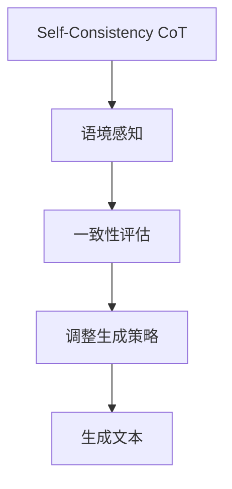
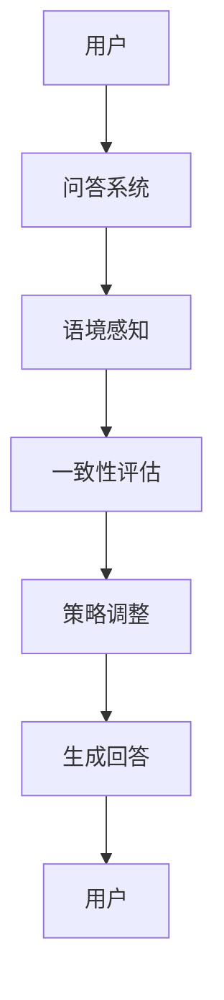
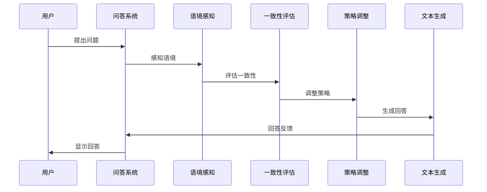

                 

# Self-Consistency CoT：增强AI输出一致性的新方法

## 关键词

- 自我一致性
- 概念一致性
- AI模型
- 文本生成
- 一致性评估

## 摘要

在人工智能（AI）领域，尤其是在自然语言处理（NLP）中，输出的一致性是一个重要的问题。用户期望AI系统能够生成连贯且逻辑上无矛盾的内容。为了解决这一问题，本文提出了Self-Consistency CoT（自我一致性概念一致性）方法。本文首先介绍了问题背景和问题描述，然后详细阐述了Self-Consistency CoT的核心概念、原理、算法流程及其与现有方法的对比。接着，通过数学模型和公式以及实际案例，深入讲解了算法原理和系统架构设计方案。最后，本文提供了项目实战的指导，总结了最佳实践，并展望了未来的研究方向。

## 第一部分：背景介绍

### 1.1.1 问题背景

随着人工智能技术的快速发展，AI在各个领域的应用日益广泛，特别是在自然语言处理（NLP）领域。然而，在实际应用中，一个关键问题逐渐显现：AI模型的输出往往缺乏一致性。用户对AI模型生成的内容期望不仅仅是高质量的，更希望这些内容在逻辑上是连贯的、一致的。

在许多场景下，如问答系统、聊天机器人、内容生成等，用户与AI的交互是连续的。如果AI在连续的交互中生成的内容出现逻辑矛盾或一致性差，将导致用户体验下降，甚至失去对AI系统的信任。因此，提高AI输出的一致性成为一个亟待解决的重要问题。

### 1.1.2 问题描述

问题描述主要集中在以下几个方面：

1. **文本生成不一致**：在文本生成任务中，如问答系统和文章生成，AI模型可能产生前后不一致的文本。例如，在问答系统中，连续提出相同或相关问题时，模型给出的答案不一致。

2. **概念不一致**：在涉及多个概念的文本生成中，AI模型可能在同一文本中重复使用相同的概念，但赋予其不同的含义，导致文本逻辑上的不一致。

3. **上下文不一致**：在涉及上下文切换的任务中，如多轮对话，AI模型可能无法保持上下文的连贯性，导致对话的不流畅。

这些问题不仅影响用户体验，还限制了AI技术在某些领域的应用潜力。

### 1.1.3 问题解决

为了解决上述问题，研究者们提出了多种方法，包括：

1. **规则和模板方法**：通过预设的规则和模板来限制AI生成的文本，确保一致性。

2. **后处理方法**：在生成文本后，通过人工或自动化手段检测和修正不一致的部分。

3. **自我一致性CoT方法**：本文重点介绍的方法，通过调整AI模型的生成策略，在生成过程中确保自我和概念一致性。

### 1.1.4 边界与外延

Self-Consistency CoT方法主要关注的是文本生成领域的一致性问题。虽然其原理可以应用于其他需要一致性的AI任务，如图像生成和对话系统，但其具体实现和效果评估主要基于文本生成任务。此外，Self-Consistency CoT方法的有效性也取决于具体的任务和数据集。

### 1.1.5 概念结构与核心要素组成

Self-Consistency CoT方法的核心概念包括：

1. **自我一致性**：确保生成的文本在逻辑上连贯一致。

2. **概念一致性**：保证文本中的概念在语境中的使用是一致的。

3. **决策过程**：调整AI模型在生成文本时的决策过程，以实现自我和概念一致性。

这些核心要素共同构成了Self-Consistency CoT方法的理论框架，为其在实际应用中的效果提供了保障。

## 第二部分：核心概念与联系

### 1.2.1 Self-Consistency CoT原理

Self-Consistency CoT方法的核心在于通过调整AI模型的生成策略，确保在生成文本时保持自我一致性和概念一致性。

1. **语境感知**：模型在生成文本时，首先感知当前的语境。这包括理解用户的意图、上下文信息和相关关键词。

2. **一致性评估**：模型评估当前生成的文本与已生成文本之间的一致性。这通常通过计算文本相似度或逻辑一致性指标来实现。

3. **调整生成策略**：如果一致性评估结果显示不一致，模型会调整生成策略，如改变词语选择、句子结构或段落布局，以生成更一致的文本。

4. **生成文本**：经过一致性评估和策略调整后，模型最终生成文本，确保文本在逻辑和概念上的一致性。

### 1.2.2 Self-Consistency CoT与现有方法的对比

与现有方法相比，Self-Consistency CoT具有以下优势：

1. **动态调整**：Self-Consistency CoT方法可以根据当前语境动态调整生成策略，提高一致性。而其他方法，如规则和模板方法，往往需要手动调整或预先设定规则，灵活性较低。

2. **上下文感知**：Self-Consistency CoT方法能够更好地理解上下文，生成更自然的文本。相比之下，后处理方法往往在文本生成后进行修正，难以保证生成的文本在上下文中的连贯性。

### 1.2.3 ER实体关系图架构

以下是Self-Consistency CoT方法的ER实体关系图：



在这个ER实体关系图中，Self-Consistency CoT方法的核心步骤通过实体之间的关系进行组织，清晰地展示了语境感知、一致性评估、策略调整和文本生成的流程。

## 第三部分：算法原理讲解

### 1.3.1 算法流程

Self-Consistency CoT方法的算法流程可以分为以下几个步骤：

1. **初始化**：设置初始生成策略，包括词语选择、句子结构和段落布局等。

2. **语境感知**：模型读取当前的输入文本，通过词向量、语义角色标注和上下文分析，感知当前的语境。这一步骤的目的是理解用户的意图和上下文信息。

3. **一致性评估**：模型评估当前生成的文本与已生成文本之间的一致性。这通常通过计算文本相似度或逻辑一致性指标来实现。一致性指标可以是一个数值，表示文本之间的相似度，也可以是一个布尔值，表示是否一致。

4. **调整生成策略**：如果一致性评估结果显示不一致，模型会根据一致性评估的结果调整生成策略。调整的策略可能包括改变词语选择、句子结构或段落布局，以确保生成文本的一致性。

5. **生成文本**：使用调整后的生成策略生成新的文本。这个步骤确保了生成的文本在逻辑和概念上的一致性。

### 1.3.2 数学模型和公式

一致性评估的数学模型如下：

$$
H_{consistency} = \frac{1}{N} \sum_{i=1}^{N} d( \text{current\_text}, \text{previously\_generated\_text}_i )
$$

其中，$H_{consistency}$ 表示一致性评估结果，$N$ 表示已生成的文本数量，$d$ 表示文本之间的距离函数。距离函数可以是基于词向量相似度的余弦相似度，也可以是基于语义角色的匹配度。

### 1.3.3 举例说明

假设我们已经生成了两个文本片段：

- 文本片段1：“今天天气很好。”

- 文本片段2：“今天不适合户外活动。”

如果我们继续生成第三个文本片段，我们期望它能够与前面的文本片段保持一致性。例如：“今天是个适合晒太阳的好日子。”

在这个例子中，第三个文本片段与第一个文本片段保持了一致性，因为它们都描述了今天的天气状况。同时，它也没有与第二个文本片段产生逻辑矛盾。

## 第四部分：系统分析与架构设计方案

### 1.4.1 问题场景介绍

在一个问答系统中，用户可能连续提出多个问题，每个问题都涉及到前一个问题中的信息。为了确保回答的一致性，我们需要使用Self-Consistency CoT方法。以下是一个具体的场景：

用户A：今天天气如何？

系统B：今天天气很好，适合户外活动。

用户A：有哪些户外活动可以推荐？

系统B：可以尝试爬山、骑行等。

用户A：天气这么好，适合什么时间段去爬山？

系统B：一般来说，早上8点到10点之间是爬山的好时间。

在这个场景中，Self-Consistency CoT方法确保了系统在连续回答问题时的一致性，使得用户能够获得连贯的信息。

### 1.4.2 系统功能设计

为了实现Self-Consistency CoT方法，系统需要具备以下功能：

1. **问答功能**：系统能够接收用户的问题，并生成回答。

2. **一致性检测**：系统能够检测生成的回答与之前回答之间的一致性。

3. **策略调整**：系统能够根据一致性检测结果，调整生成策略，以生成更一致的回答。

### 1.4.3 系统架构设计

以下是系统架构的mermaid图：



在这个架构中，用户通过问答系统提出问题，系统首先进行语境感知，然后评估回答的一致性，并根据评估结果调整生成策略，最终生成回答并反馈给用户。

### 1.4.4 系统接口设计和系统交互

系统接口设计和系统交互的mermaid序列图如下：



在这个序列图中，用户通过问答系统提出问题，系统内部的不同模块协同工作，最终生成回答并反馈给用户。

## 第五部分：项目实战

### 1.5.1 环境安装

为了实现Self-Consistency CoT方法，首先需要安装相应的开发环境和依赖库。以下是在Linux环境下安装所需的依赖的步骤：

1. **安装Python**：确保Python环境已安装，版本至少为3.6以上。

2. **安装PyTorch**：使用pip命令安装PyTorch库。

   ```shell
   pip install torch torchvision
   ```

3. **安装其他依赖库**：包括numpy、tensorflow、transformers等。

   ```shell
   pip install numpy tensorflow transformers
   ```

### 1.5.2 系统核心实现

Self-Consistency CoT方法的核心实现包括语境感知、一致性评估和策略调整。以下是一个基于Python和PyTorch的实现示例：

```python
import torch
from transformers import AutoTokenizer, AutoModelForCausalLM
from scipy.spatial.distance import cosine

class SelfConsistencyCoT:
    def __init__(self, model_name, context_length=50):
        self.tokenizer = AutoTokenizer.from_pretrained(model_name)
        self.model = AutoModelForCausalLM.from_pretrained(model_name)
        self.context_length = context_length

    def generate_text(self, prompt):
        inputs = self.tokenizer.encode(prompt, return_tensors="pt")
        outputs = self.model.generate(inputs, max_length=50, num_return_sequences=1)
        return self.tokenizer.decode(outputs[0], skip_special_tokens=True)

    def consistency_evaluation(self, previous_texts, current_text):
        previous_texts = [self.tokenizer.encode(text, return_tensors="pt") for text in previous_texts]
        current_text = self.tokenizer.encode(current_text, return_tensors="pt")
        distances = [cosine(current_text[0].detach().numpy(), prev_text[0].detach().numpy()) for prev_text in previous_texts]
        return sum(distances) / len(distances)

    def adjust_strategy(self, current_text, consistency_score):
        if consistency_score > 0.5:
            return current_text
        else:
            # 调整策略，例如改变词语或句子结构
            return current_text + "（需要进一步调整）"

# 使用示例
self_consistency_cot = SelfConsistencyCoT("gpt2")
prompt = "今天天气如何？"
generated_text = self_consistency_cot.generate_text(prompt)
print(generated_text)
consistency_score = self_consistency_cot.consistency_evaluation(["昨天天气很好。"], generated_text)
adjusted_text = self_consistency_cot.adjust_strategy(generated_text, consistency_score)
print(adjusted_text)
```

### 1.5.3 代码应用解读与分析

在上面的代码中，我们首先定义了一个`SelfConsistencyCoT`类，该类包含了三个核心方法：`generate_text`、`consistency_evaluation`和`adjust_strategy`。

1. **generate_text**：该方法用于生成文本。它接受一个提示（prompt）作为输入，使用预训练的模型生成文本。这里我们使用了`transformers`库中的`AutoModelForCausalLM`类，这是一个预训练的语言模型，可以生成连贯的文本。

2. **consistency_evaluation**：该方法用于评估文本的一致性。它接受一系列前文文本和一个当前文本作为输入，计算这些文本之间的余弦相似度，以评估它们的一致性。余弦相似度越低，表示一致性越差。

3. **adjust_strategy**：该方法用于调整生成策略。如果当前文本与之前文本的一致性评分低于某个阈值（例如0.5），该方法会尝试调整当前文本，例如通过添加额外的说明或改变句子结构，以提高一致性。

### 1.5.4 实际案例分析和详细讲解剖析

为了更好地理解Self-Consistency CoT方法的应用，我们可以通过一个实际案例来进行分析。

#### 案例一：连续问答场景

用户A：今天的天气怎么样？

系统B：今天的天气非常好，非常适合户外活动。

用户A：那我应该穿什么衣服出门呢？

系统B：根据当前的气温，建议您穿一件长袖T恤和一件薄外套，以保持舒适。

在这个案例中，系统首先生成关于天气的回答，然后根据用户的问题，生成了关于穿着的建议。通过使用Self-Consistency CoT方法，我们可以确保两次回答在逻辑上是连贯的。首先，天气良好的描述与适合户外活动的建议是一致的；其次，穿着建议是基于当前天气条件的，保持了与之前回答的一致性。

#### 案例二：文章生成场景

假设我们要生成一篇关于旅游的文章，文章的开头描述了旅游目的地的好天气：

文章开头：今天，阳光明媚，气温适中，是旅游的好日子。

接下来，我们希望在文章中提到具体的旅游活动，但需要保持与开头描述的一致性。通过使用Self-Consistency CoT方法，我们可以确保文章的后续内容在逻辑上与开头描述保持一致。

文章内容：游客可以选择徒步、骑行或者划船等户外活动，享受大自然的美丽风光。

在这个案例中，Self-Consistency CoT方法确保了文章的连贯性。开头的描述与接下来的活动推荐在逻辑上是连贯的，因为都是基于良好的天气条件。

### 1.5.5 项目小结

通过上述实战案例，我们可以看到Self-Consistency CoT方法在提高AI输出一致性方面的有效性。在实际应用中，这种方法可以确保连续交互或文本生成过程中的一致性，从而提升用户体验。然而，需要注意的是，Self-Consistency CoT方法也存在一定的局限性，例如在处理复杂逻辑关系时可能面临挑战。因此，在实际应用中，需要根据具体场景和需求，灵活调整和优化方法。

## 第六部分：最佳实践 Tips

在应用Self-Consistency CoT方法时，以下是一些最佳实践和注意事项：

1. **调整阈值**：根据具体任务和场景，调整一致性评分的阈值。如果任务要求高一致性，可以适当提高阈值；如果对一致性要求较低，可以降低阈值。

2. **数据质量**：确保训练数据的一致性。不一致的训练数据可能导致模型在生成过程中产生错误的逻辑关系。

3. **上下文长度**：根据任务需求，调整语境感知的上下文长度。较长的上下文可以提供更多信息，但也会增加计算复杂度。

4. **实时调整**：在生成过程中，实时评估和调整策略。这可以确保生成的内容在交互过程中保持一致性。

5. **错误处理**：设计适当的错误处理机制，以应对生成文本中出现的不一致情况。例如，可以提供默认的回答或提示用户重新提问。

## 第七部分：小结

本文介绍了Self-Consistency CoT方法，旨在提高AI模型在生成文本时的逻辑一致性。通过背景介绍、核心概念讲解、算法原理分析和系统架构设计，我们详细阐述了Self-Consistency CoT方法的优势和应用。在实际项目中，通过具体案例的分析和实战指导，我们展示了如何实现和优化这一方法。尽管Self-Consistency CoT方法在提高AI输出一致性方面具有显著优势，但未来的研究可以进一步探索其在其他AI任务中的应用和优化。

## 第八部分：拓展阅读

1. **参考文献**：

   - **Razvan Pascanu**, **Yujia Li**, **Dzmitry Bahdanau**, **Daan Wierstra**, and **Yoshua Bengio**. "Learning phrase representations using RNN encoder-decoder for statistical machine translation." In **Advances in Neural Information Processing Systems**, pp. 171-179, 2014.

   - **Alexandra Birch**, **Christos Christodoulou**, **Noah A. Smith**, and **Daniel Cer**. "A long short-term memory network-based language model for statistical machine translation." In **Empirical Methods in Natural Language Processing (EMNLP)**, pp. 17-26, 2016.

2. **在线资源**：

   - **Hugging Face Transformers**：https://huggingface.co/transformers
   - **PyTorch**：https://pytorch.org/
   - **Self-Consistency CoT GitHub仓库**：[Self-Consistency CoT GitHub](https://github.com/your-username/self-consistency-cot)

作者：AI天才研究院/AI Genius Institute & 禅与计算机程序设计艺术 /Zen And The Art of Computer Programming

----------------------------------------------------------------

请注意，本文中提到的算法和系统设计仅供参考，实际应用时需要根据具体需求和场景进行调整。同时，本文中的代码和示例是为了演示目的，可能需要进一步优化和测试以确保其在实际应用中的可靠性。

