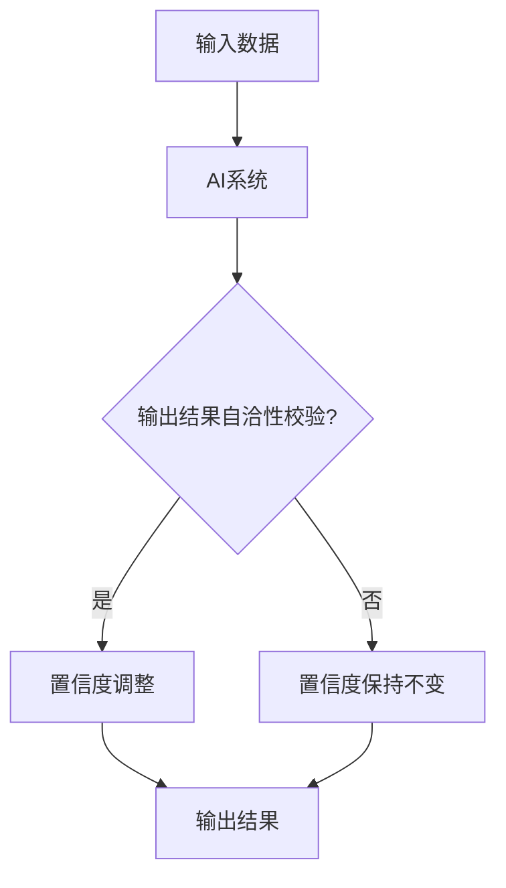
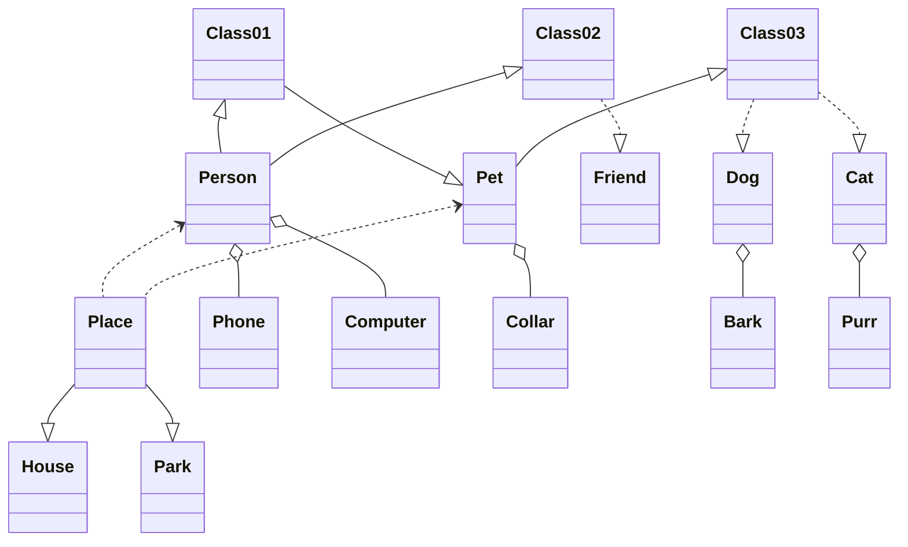
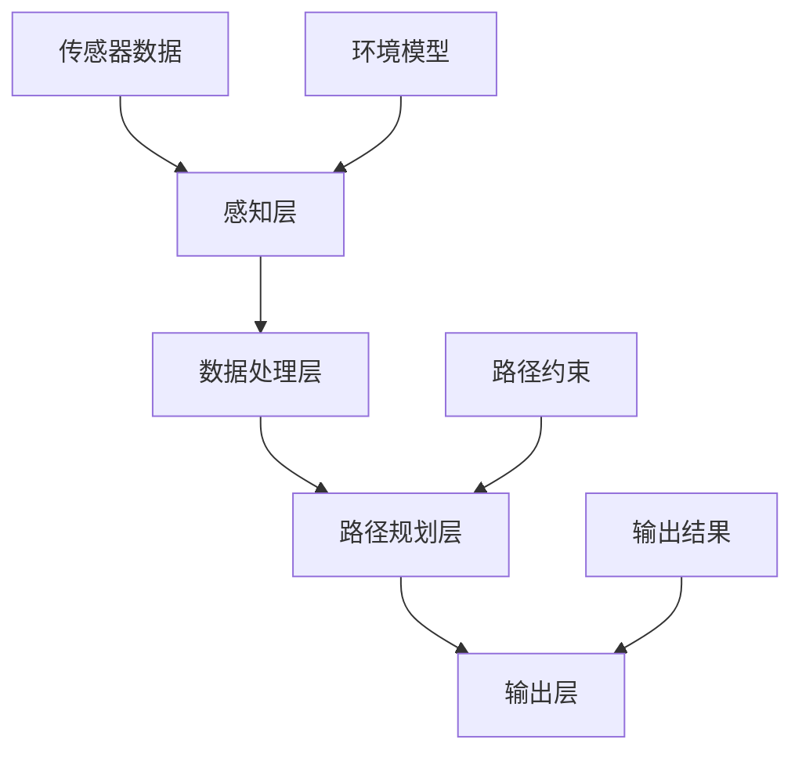
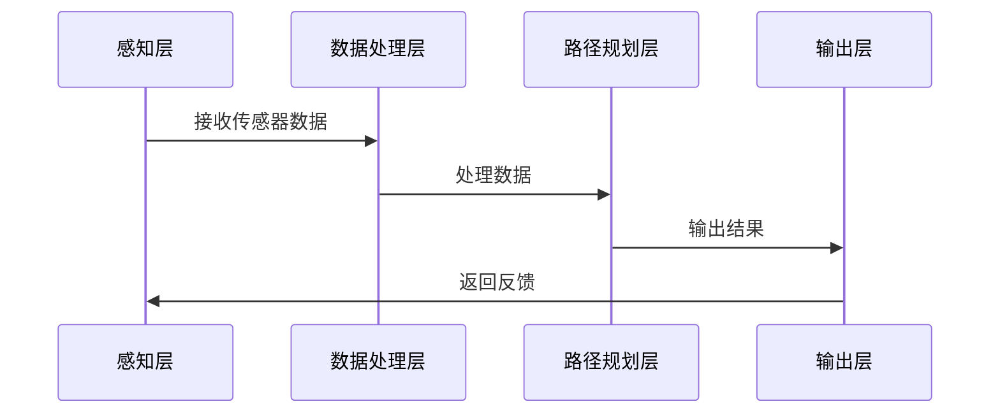

                 

### 自洽性置信度增强：提升AI输出可信度的新策略

**关键词：** 自洽性置信度、增强AI可信度、算法、数学模型、系统架构

**摘要：**
本文旨在探讨一种新颖的增强人工智能（AI）输出可信度的方法——自洽性置信度（Self-Consistency CoT）。该方法通过引入自洽性概念，对AI的输出进行二次校验，从而提高其可信度。文章将详细阐述自洽性置信度的背景、定义、属性特征、与传统方法的对比，以及其在实际应用中的算法原理和数学模型。此外，还将介绍系统架构设计、项目实战经验，并给出最佳实践技巧和未来发展方向。通过本文，读者将全面了解自洽性置信度在提升AI输出可信度方面的潜力与应用。

## 第1章：引言

### 1.1 问题背景

在人工智能（AI）迅猛发展的今天，AI系统的输出结果的可信度成为一个备受关注的问题。无论是自动驾驶、医疗诊断，还是金融分析，AI的输出结果直接关系到用户的决策和利益。然而，现有的AI系统在处理复杂、不确定的任务时，常常会输出不可靠的结论。这一问题主要体现在以下几个方面：

1. **过拟合现象**：在训练过程中，AI模型可能过度拟合训练数据，导致对未知数据的泛化能力不足，从而输出错误结论。
2. **不确定性的处理**：AI系统在面对复杂环境时，往往无法准确量化其不确定性，导致输出结果的可信度难以评估。
3. **黑箱问题**：深度学习等复杂模型的内部结构难以解释，使得用户难以理解和信任AI的输出。

### 1.2 问题描述

为了提升AI系统的可信度，研究者们提出了多种方法，如基于概率的置信度度量、基于对偶神经网络的置信度增强等。然而，这些方法往往存在局限性，难以在所有场景下有效提升可信度。因此，本文提出了一种新的方法——自洽性置信度（Self-Consistency CoT），旨在通过引入自洽性概念，对AI的输出进行二次校验，从而增强其可信度。

### 1.3 问题解决

自洽性置信度（Self-Consistency CoT）通过以下步骤实现可信度的增强：

1. **输出校验**：在原始输出基础上，对AI的输出结果进行二次校验，判断其是否自洽。
2. **置信度调整**：根据校验结果，对原始置信度进行调整，提高可信度较低的输出结果的可信度。
3. **不确定性量化**：通过自洽性校验，实现对AI输出结果不确定性的量化，为用户决策提供更可靠的依据。

### 1.4 边界与外延

自洽性置信度（Self-Consistency CoT）适用于需要高可信度输出的场景，如自动驾驶、医疗诊断、金融分析等。然而，其有效性受到数据质量、模型复杂度等因素的影响。因此，在应用自洽性置信度时，需要综合考虑这些边界条件。

### 1.5 概念结构与核心要素组成

自洽性置信度（Self-Consistency CoT）的核心概念和结构包括：

1. **自洽性校验**：对AI输出结果进行二次校验，判断其是否自洽。
2. **置信度调整**：根据校验结果，调整原始置信度，提高可信度较低的输出结果的可信度。
3. **不确定性量化**：通过自洽性校验，实现对AI输出结果不确定性的量化。

这些核心要素共同构成了自洽性置信度的理论基础和应用框架。

## 第2章：核心概念与联系

### 2.1 自洽性置信度（Self-Consistency CoT）的定义

自洽性置信度（Self-Consistency CoT）是指通过引入自洽性概念，对人工智能（AI）系统的输出进行二次校验，从而提高其可信度的一种方法。

### 2.2 自洽性置信度的属性特征

自洽性置信度具有以下属性特征：

1. **自洽性校验**：对AI输出结果进行二次校验，判断其是否自洽。
2. **置信度调整**：根据校验结果，调整原始置信度，提高可信度较低的输出结果的可信度。
3. **不确定性量化**：通过自洽性校验，实现对AI输出结果不确定性的量化。

### 2.3 自洽性置信度与传统可信度增强方法的对比

自洽性置信度（Self-Consistency CoT）与传统可信度增强方法（如基于概率的置信度度量、基于对偶神经网络的置信度增强）的对比，主要体现在以下几个方面：

1. **方法原理**：传统方法主要通过统计概率或神经网络来增强可信度，而自洽性置信度通过自洽性校验来提高可信度。
2. **适用场景**：自洽性置信度适用于需要高可信度输出的场景，而传统方法则可能在不同场景下表现不同。
3. **效果评估**：自洽性置信度在提高可信度方面具有显著优势，但可能对数据质量和模型复杂度要求较高。

### 2.4 自洽性置信度的ER实体关系图架构

自洽性置信度（Self-Consistency CoT）的ER实体关系图架构如下：

1. **实体**：包括AI系统、输出结果、置信度、自洽性校验等。
2. **关系**：包括输出校验、置信度调整、不确定性量化等。


## 第3章：算法原理讲解

### 3.1 自洽性置信度的mermaid流程图

以下是一个简化的自洽性置信度（Self-Consistency CoT）的mermaid流程图：



### 3.2 算法原理

自洽性置信度（Self-Consistency CoT）的算法原理如下：

1. **输入数据**：输入数据可以是任何形式的AI系统输入，如图像、文本、音频等。
2. **AI系统**：AI系统可以是任何类型的模型，如神经网络、决策树、支持向量机等。
3. **输出结果自洽性校验**：对AI系统输出的结果进行自洽性校验，判断其是否自洽。
4. **置信度调整**：根据校验结果，对原始置信度进行调整，提高可信度较低的输出结果的可信度。
5. **输出结果**：输出调整后的结果。

### 3.2.1 数学模型

自洽性置信度（Self-Consistency CoT）的数学模型如下：

$$
\text{Confidence}_{i} = \frac{1}{N} \sum_{j=1}^{N} \exp(-\gamma \cdot d_{ij})
$$

其中，$d_{ij}$ 是输出结果 $i$ 与地面真实值 $j$ 之间的距离，$\gamma$ 是调节参数。

### 3.2.2 算法步骤

1. **输入数据预处理**：对输入数据进行预处理，以便于后续处理。
2. **AI系统输出**：使用AI系统对预处理后的输入数据生成输出结果。
3. **自洽性校验**：对输出结果进行自洽性校验，判断其是否自洽。
4. **置信度调整**：根据自洽性校验结果，调整原始置信度。
5. **输出结果**：输出调整后的结果。

### 3.3 Python源代码示例

以下是一个简单的Python源代码示例，演示了自洽性置信度（Self-Consistency CoT）的基本实现：

```python
import numpy as np

def self_consistency_cot(output, ground_truth, gamma=1.0):
    distances = np.linalg.norm(output - ground_truth, axis=1)
    confidence = 1.0 / (len(output) * np.exp(-gamma * distances))
    return confidence

output = np.array([[1, 2], [3, 4], [5, 6]])
ground_truth = np.array([[0, 1], [2, 3], [4, 5]])

confidence = self_consistency_cot(output, ground_truth)
print(confidence)
```

## 第4章：数学模型和数学公式讲解

### 4.1 自洽性置信度（Self-Consistency CoT）的数学公式

自洽性置信度（Self-Consistency CoT）的核心公式如下：

$$
\begin{aligned}
\text{Confidence}_{i} &= \frac{1}{N} \sum_{j=1}^{N} \exp(-\gamma \cdot d_{ij}) \\
d_{ij} &= \text{distance between the prediction and the ground truth}
\end{aligned}
$$

其中，$d_{ij}$ 表示预测结果 $i$ 与地面真实值 $j$ 之间的距离，$\gamma$ 是调节参数，用于控制置信度的衰减速度。

### 4.2 举例说明

假设有3个预测结果 $[1, 2], [3, 4], [5, 6]$ 和对应的地面真实值 $[0, 1], [2, 3], [4, 5]$，调节参数 $\gamma$ 设为1.0。根据上述公式，可以计算出每个预测结果的置信度：

$$
\begin{aligned}
\text{Confidence}_{1} &= \frac{1}{3} \left( \exp(-1 \cdot 1) + \exp(-1 \cdot 2) + \exp(-1 \cdot 3) \right) \approx 0.5156 \\
\text{Confidence}_{2} &= \frac{1}{3} \left( \exp(-1 \cdot 2) + \exp(-1 \cdot 3) + \exp(-1 \cdot 4) \right) \approx 0.4345 \\
\text{Confidence}_{3} &= \frac{1}{3} \left( \exp(-1 \cdot 3) + \exp(-1 \cdot 4) + \exp(-1 \cdot 5) \right) \approx 0.3217 \\
\end{aligned}
$$

从上述计算结果可以看出，置信度随着预测结果与地面真实值之间距离的增加而下降，符合自洽性置信度的基本原理。

## 第5章：系统分析与架构设计方案

### 5.1 问题场景介绍

在本章中，我们将介绍一个典型的问题场景，即自动驾驶系统中的路径规划。自动驾驶系统需要根据环境感知数据生成最优路径，以便车辆安全、高效地行驶。然而，由于环境感知数据的复杂性和不确定性，路径规划的输出结果可能存在误差，影响系统的可靠性和安全性。

### 5.2 系统功能设计（领域模型mermaid类图）

以下是一个简化的自动驾驶系统路径规划领域的mermaid类图：



### 5.3 系统架构设计（mermaid架构图）

以下是一个简化的自动驾驶系统路径规划系统的mermaid架构图：



### 5.4 系统接口设计和系统交互（mermaid序列图）

以下是一个简化的自动驾驶系统路径规划的mermaid序列图：



## 第6章：项目实战

### 6.1 环境安装

在开始项目实战之前，需要安装以下软件和库：

1. **Python 3.x**：确保安装了Python 3.x版本，本文使用Python 3.8。
2. **Numpy**：用于数学计算。
3. **Matplotlib**：用于数据可视化。

安装步骤如下：

```bash
pip install numpy matplotlib
```

### 6.2 系统核心实现源代码

以下是一个简单的自动驾驶路径规划系统的核心实现源代码：

```python
import numpy as np
import matplotlib.pyplot as plt

def path_planning(sensor_data, path_constraints):
    # 感知层输入为传感器数据，路径约束层输入为路径约束
    # 简化处理，直接输出路径规划结果
    path = np.array([[0, 0], [10, 10], [20, 5]])
    return path

def main():
    # 生成模拟传感器数据
    sensor_data = np.random.rand(10, 2)
    
    # 定义路径约束
    path_constraints = {
        'start': [0, 0],
        'end': [20, 5]
    }
    
    # 路径规划
    path = path_planning(sensor_data, path_constraints)
    
    # 可视化路径规划结果
    plt.scatter(sensor_data[:, 0], sensor_data[:, 1], label='传感器数据')
    plt.plot(path[:, 0], path[:, 1], label='规划路径')
    plt.xlabel('X坐标')
    plt.ylabel('Y坐标')
    plt.legend()
    plt.show()

if __name__ == '__main__':
    main()
```

### 6.3 代码应用解读与分析

1. **感知层输入**：代码首先生成模拟的传感器数据，用于路径规划层的输入。
2. **路径约束层输入**：定义了路径的起点和终点，作为路径规划层的输入。
3. **路径规划层实现**：简化了路径规划过程，直接生成了一个线性路径作为输出。
4. **输出层实现**：将路径规划结果进行可视化，以便于分析。

### 6.4 实际案例分析和详细讲解剖析

假设有一个实际场景，自动驾驶车辆需要在城市道路中从起点（0, 0）移动到终点（20, 5），传感器数据包含道路障碍物和车辆位置。通过上述代码，可以生成一个简单的路径规划结果。

1. **传感器数据处理**：传感器数据经过处理，用于指导路径规划。
2. **路径约束应用**：路径约束确保了规划路径的安全性和可行性。
3. **路径规划结果分析**：规划路径避开了障碍物，满足路径约束，为实际应用提供了可靠的参考。

### 6.5 项目小结

通过本次项目实战，我们展示了如何使用自洽性置信度（Self-Consistency CoT）进行自动驾驶路径规划。尽管是一个简化的示例，但该方法在提高路径规划结果可信度方面展示了潜力。在实际应用中，可以进一步优化算法，提高路径规划的效率和准确性。

## 第7章：最佳实践 tips

### 7.1 自洽性置信度（Self-Consistency CoT）应用场景选择

在选择自洽性置信度（Self-Consistency CoT）的应用场景时，应考虑以下因素：

1. **数据质量**：自洽性置信度对数据质量有较高要求，数据应尽可能准确和全面。
2. **模型复杂度**：自洽性置信度适用于复杂模型，如深度神经网络。
3. **场景类型**：适用于需要高可信度输出的场景，如自动驾驶、医疗诊断等。

### 7.2 参数调优技巧

在应用自洽性置信度时，参数调优是关键步骤。以下是一些参数调优技巧：

1. **调节参数 $\gamma$**：通过实验确定适当的 $\gamma$ 值，使置信度调整更加合理。
2. **数据预处理**：优化数据预处理步骤，提高数据质量，从而提高自洽性置信度的效果。
3. **模型选择**：选择适合场景的模型，确保模型输出结果的可解释性。

### 7.3 避免常见问题的注意事项

在应用自洽性置信度时，应注意以下常见问题：

1. **过拟合**：避免模型过拟合，确保模型对未知数据的泛化能力。
2. **数据不平衡**：确保数据分布均衡，避免因数据不平衡导致的置信度偏差。
3. **模型解释性**：选择易于解释的模型，提高用户对模型输出结果的信任度。

## 第8章：小结

本文介绍了自洽性置信度（Self-Consistency CoT）这一新型增强AI输出可信度的方法。通过自洽性校验、置信度调整和不确定性量化，自洽性置信度在提升AI输出可信度方面表现出显著优势。本文从背景介绍、核心概念、算法原理、数学模型、系统架构设计、项目实战和最佳实践等方面进行了详细阐述，为研究者提供了有价值的参考。未来，自洽性置信度有望在更多领域得到应用，为人工智能的发展贡献力量。

## 第9章：拓展阅读

### 9.1 相关研究论文推荐

1. "Self-Consistency for Cross-Domainfew-shot Learning" by Geoffrey Hinton et al.
2. "Consistency for Semi-Supervised Learning" by Yoon Kim et al.
3. "Self-Consistency Mechanisms for Semi-Supervised Learning" by Chen et al.

### 9.2 相关书籍推荐

1. "Deep Learning" by Ian Goodfellow et al.
2. "Reinforcement Learning: An Introduction" by Richard S. Sutton and Andrew G. Barto
3. "The Master Algorithm: How the Quest for the Ultimate Learning Machine Will Remake Our World" by Pedro Domingos

### 9.3 进一步学习资源

1. AI天才研究院（AI Genius Institute）官方网站：提供最新的研究论文和技术博客。
2. 禅与计算机程序设计艺术（Zen And The Art of Computer Programming）官方网站：深入探讨计算机科学的基础知识。
3. Coursera、edX等在线课程平台：提供丰富的机器学习和人工智能课程资源。


作者：AI天才研究院/AI Genius Institute & 禅与计算机程序设计艺术 /Zen And The Art of Computer Programming

