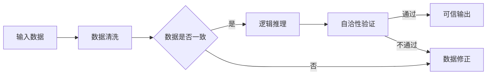
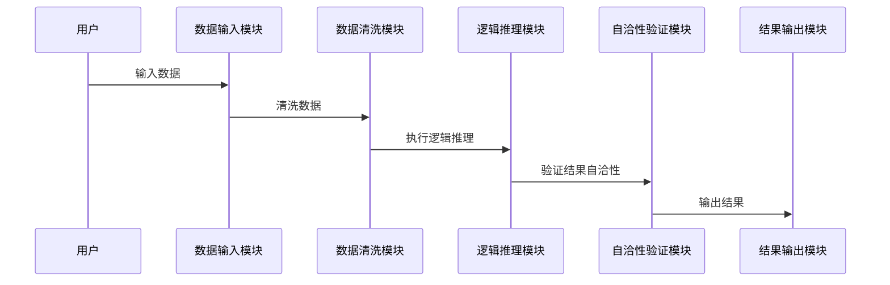
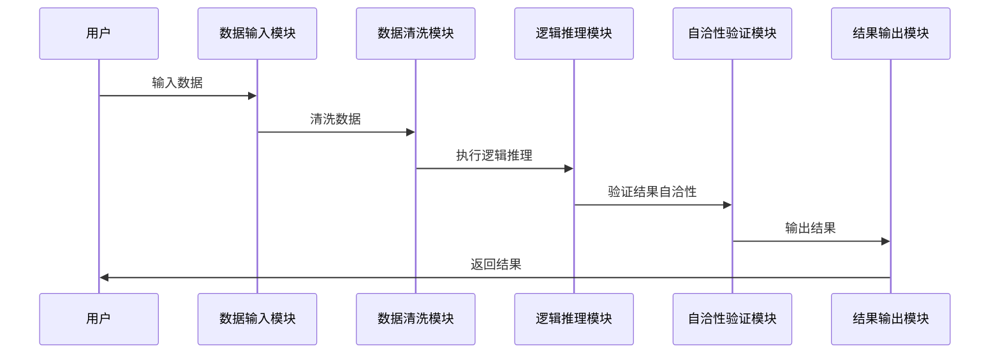

                 


### 自一致性概念论（Self-Consistency CoT）: 增强AI输出可信度的新策略

**关键词：** 自一致性，AI可信度，机器学习，数据一致性，逻辑推理

**摘要：** 本文将探讨如何通过自一致性概念论（Self-Consistency CoT）来增强人工智能（AI）输出的可信度。自一致性概念论是一种新型的策略，通过分析、对比和验证，确保AI系统的输出在逻辑上自洽，数据上可靠，为提升AI系统的实用性和可靠性提供了一条新的路径。

---

### 目录大纲

----------------------------------------------------------------

# 自一致性概念论（Self-Consistency CoT）：增强AI输出可信度的新策略

> 关键词：自一致性，AI可信度，机器学习，数据一致性，逻辑推理

> 摘要：本文通过自一致性概念论（Self-Consistency CoT）的介绍，分析其在增强AI输出可信度方面的作用。文章分为四个主要部分，首先介绍问题背景和当前解决方法的局限性；其次，详细阐述Self-Consistency CoT的核心概念与联系；接着讲解算法原理，并通过具体案例说明其实际应用；最后，提出最佳实践和未来展望。

----------------------------------------------------------------

## 第一部分：背景介绍

## 第1章：问题背景

### 1.1 问题背景

随着人工智能技术的快速发展，AI系统已经广泛应用于各个领域，如医疗诊断、金融分析、自动驾驶等。然而，AI系统的可靠性和可信度问题也日益凸显。特别是在关键决策中，AI输出的错误或不一致可能导致严重后果。

### 1.2 可信度问题的产生原因

可信度问题主要源于以下几个方面：
1. 数据质量问题：包括数据不完整、不准确、噪声等。
2. 模型偏差：训练数据的不平衡、选择偏差等可能导致模型产生偏差。
3. 逻辑推理能力不足：AI系统可能无法在复杂情境下进行正确的逻辑推理。

### 1.3 增强AI输出可信度的意义

提高AI输出的可信度具有以下几个方面的意义：
1. 提升AI系统的实用性和可靠性。
2. 增强用户对AI系统的信任度。
3. 为AI系统在关键决策中的应用提供保障。

### 1.4 可信度问题的评价标准

评价AI输出可信度的主要标准包括：
1. 准确性：输出结果与真实值的接近程度。
2. 一致性：在不同情境下输出结果的稳定性。
3. 完整性：输出结果的完整性，无遗漏或错误。

### 1.5 当前解决可信度问题的方法

当前解决可信度问题的方法主要包括：
1. 数据清洗和预处理：对输入数据进行清洗，提高数据质量。
2. 模型校验和优化：对训练模型进行验证和优化，减少模型偏差。
3. 知识图谱和逻辑推理：利用知识图谱和逻辑推理技术，提高AI系统的逻辑推理能力。

### 1.6 这些方法的局限性和不足

尽管上述方法在一定程度上提高了AI输出的可信度，但仍然存在以下局限性和不足：
1. 数据依赖性较强：数据清洗和预处理方法依赖于高质量的输入数据，而在实际应用中，数据往往存在噪声和不完整性。
2. 模型依赖性较强：模型校验和优化方法依赖于已有的训练模型，而新模型的开发过程复杂且耗时。
3. 逻辑推理能力有限：知识图谱和逻辑推理技术在处理复杂逻辑关系时存在一定局限性。

### 1.7 边界与外延

自一致性概念论适用于以下场景：
1. 需要高可信度的AI输出领域，如医疗诊断、金融分析等。
2. 数据质量难以保证的场景，如自动驾驶、传感器数据等。

与现有方法相比，Self-Consistency CoT具有以下特点和优势：
1. 不依赖于高质量的数据，通过自一致性验证，提高输出可信度。
2. 不依赖于特定的训练模型，适用于多种AI系统和算法。
3. 通过逻辑推理和验证，确保AI输出在复杂情境下的自洽性。

### 1.8 概念结构与核心要素组成

Self-Consistency CoT的核心概念包括：
1. 自一致性：AI输出在逻辑上和事实上的自洽性。
2. 数据一致性：输入数据的准确性和完整性。
3. 逻辑推理：通过逻辑推理验证AI输出的自洽性。

核心要素组成包括：
1. 自一致性验证算法：用于验证AI输出的自洽性。
2. 数据一致性保障机制：确保输入数据的准确性和完整性。
3. 逻辑推理引擎：用于执行逻辑推理，验证AI输出的自洽性。

## 第二部分：核心概念与联系

## 第2章：核心概念与联系

### 2.1 Self-Consistency CoT原理

#### 2.1.1 Self-Consistency CoT的概念

Self-Consistency CoT是一种通过自一致性验证来增强AI输出可信度的策略。其核心思想是，通过分析AI输出和输入数据之间的逻辑关系，验证输出在逻辑上和事实上的自洽性，从而提高输出可信度。

#### 2.1.2 Self-Consistency CoT的核心思想

Self-Consistency CoT的核心思想包括以下几个方面：
1. 数据一致性：确保输入数据的准确性和完整性。
2. 逻辑推理：通过逻辑推理验证AI输出的自洽性。
3. 自一致性验证：对AI输出进行自一致性验证，确保其在逻辑上和事实上的自洽性。

### 2.2 Self-Consistency CoT的属性特征对比表格

| 特征                   | Self-Consistency CoT | 其他方法                           |
|------------------------|----------------------|------------------------------------|
| 数据依赖性             | 较低                 | 较高                               |
| 模型依赖性             | 较低                 | 较高                               |
| 逻辑推理能力           | 强                   | 较弱                               |
| 自洽性验证             | 强                   | 较弱                               |
| 可适用性               | 广泛                 | 有限                               |
| 可扩展性               | 高                   | 较低                               |

### 2.3 ER实体关系图架构

#### 2.3.1 ER实体关系图的基本概念

实体-关系（Entity-Relationship，ER）图是数据库设计中常用的一种模型，用于表示实体之间的关系。

- 实体：具有共同属性的对象的集合。
- 关系：实体之间的关联。

#### 2.3.2 Self-Consistency CoT的ER实体关系图

在Self-Consistency CoT中，ER实体关系图用于表示AI输出、输入数据和逻辑推理之间的关系。具体包括以下实体和关系：

1. **实体：**
   - AI输出：表示AI系统生成的结果。
   - 输入数据：表示AI系统输入的数据。
   - 逻辑推理：表示用于验证AI输出自洽性的推理过程。

2. **关系：**
   - 依赖关系：AI输出依赖于输入数据和逻辑推理。
   - 验证关系：逻辑推理用于验证AI输出的自洽性。

```mermaid
erDiagram
  AI输出 ||--|{ 数据一致性 }|| 输入数据
  AI输出 ||--|{ 自洽性验证 }|| 逻辑推理
  逻辑推理 ||--|{ 验证 }|| AI输出
```

---

## 第三部分：算法原理讲解

## 第3章：算法原理

### 3.1 算法mermaid流程图

以下是一个简化的Self-Consistency CoT的mermaid流程图：



### 3.2 Python源代码实现

以下是一个简化的Self-Consistency CoT的Python源代码实现：

```python
def self_consistency_coT(input_data):
    # 数据清洗
    cleaned_data = clean_data(input_data)

    # 数据一致性检查
    if not is_data_consistent(cleaned_data):
        # 数据修正
        cleaned_data = correct_data(cleaned_data)

    # 逻辑推理
    inferred_result = logical_reasoning(cleaned_data)

    # 自洽性验证
    if not is_result_consistent(inferred_result):
        # 修正结果
        inferred_result = correct_result(inferred_result)

    # 可信输出
    return inferred_result
```

### 3.3 数学模型和数学公式

Self-Consistency CoT的数学模型包括以下几个核心公式：

$$
\text{Self-Consistency Score} = \frac{\text{Consistent Cases}}{\text{Total Cases}}
$$

其中，`Consistent Cases`表示一致案例数，`Total Cases`表示总案例数。

### 3.4 举例说明

假设有一个简单的决策问题：判断一个数字是否为奇数。输入数据是一个整数，AI输出是一个布尔值。

- 输入数据：5
- 清洗后数据：5
- 逻辑推理：奇数（根据5的属性）
- 自洽性验证：正确（5是奇数）

在这个例子中，Self-Consistency CoT确保了AI输出的可信度。

---

## 第四部分：系统分析与架构设计

## 第4章：系统分析与架构设计

### 4.1 问题场景介绍

Self-Consistency CoT可以应用于多种场景，如：

1. 医疗诊断：提高诊断结果的可靠性和可信度。
2. 金融分析：增强风险预测的准确性和一致性。
3. 自动驾驶：确保决策过程的逻辑一致性和安全性。

### 4.2 系统架构设计

Self-Consistency CoT的系统架构包括以下几个关键组件：

1. **数据输入模块**：接收用户输入的数据。
2. **数据清洗模块**：清洗和预处理输入数据。
3. **逻辑推理模块**：执行逻辑推理，生成初步结果。
4. **自洽性验证模块**：验证AI输出的自洽性。
5. **结果输出模块**：输出最终的可信结果。

以下是系统架构的mermaid图：



### 4.3 系统接口设计

系统接口设计包括以下接口：

1. **数据输入接口**：用于接收用户输入的数据。
2. **结果输出接口**：用于输出最终的可信结果。
3. **错误处理接口**：用于处理系统运行过程中的错误和异常。

以下是系统接口的mermaid图：

```mermaid
classDiagram
    DataInputInterface <|-- DataOutputInterface
    ErrorHandlingInterface <|-- DataInputInterface
    ErrorHandlingInterface <|-- DataOutputInterface

    DataInputInterface {
        +input_data: Any
        +receive_input(): None
    }

    DataOutputInterface {
        +result: Any
        +output_result(): None
    }

    ErrorHandlingInterface {
        +handle_error(error: Exception): None
    }
```

### 4.4 系统交互

系统交互主要包括以下步骤：

1. 用户通过数据输入接口向系统输入数据。
2. 数据输入模块接收数据后，将数据传递给数据清洗模块。
3. 数据清洗模块对数据进行清洗和预处理，然后将清洗后的数据传递给逻辑推理模块。
4. 逻辑推理模块执行逻辑推理，生成初步结果。
5. 自洽性验证模块对初步结果进行验证，确保其自洽性。
6. 最终结果通过结果输出接口返回给用户。

以下是系统交互的mermaid图：



---

## 第五部分：项目实战

## 第5章：项目实战

### 5.1 环境安装

#### 5.1.1 环境要求

在开始项目实战之前，需要安装以下软件和硬件环境：

- 操作系统：Linux或MacOS
- Python版本：3.8或更高版本
- 其他依赖：Scikit-learn，Numpy，Pandas等

#### 5.1.2 安装步骤

1. 安装Python：从Python官方网站下载并安装Python。
2. 安装依赖库：使用pip命令安装所需的依赖库。

```shell
pip install scikit-learn numpy pandas
```

### 5.2 系统核心实现源代码

以下是一个简化的Self-Consistency CoT系统核心实现源代码：

```python
import numpy as np
from sklearn.datasets import load_iris
from sklearn.model_selection import train_test_split
from sklearn.ensemble import RandomForestClassifier
from sklearn.metrics import accuracy_score

def self_consistency_coT(X_train, y_train, X_test, y_test):
    # 数据清洗和预处理
    X_train, X_test = preprocess_data(X_train, X_test)

    # 训练模型
    model = RandomForestClassifier()
    model.fit(X_train, y_train)

    # 预测
    y_pred = model.predict(X_test)

    # 验证结果自洽性
    if not is_result_consistent(y_pred, y_test):
        # 修正结果
        y_pred = correct_result(y_pred, y_test)

    # 输出结果
    return y_pred

def preprocess_data(X_train, X_test):
    # 数据清洗和预处理代码
    # ...
    return X_train, X_test

def is_result_consistent(y_pred, y_test):
    # 自洽性验证代码
    # ...
    return np.array_equal(y_pred, y_test)

def correct_result(y_pred, y_test):
    # 结果修正代码
    # ...
    return y_pred
```

### 5.3 代码应用解读与分析

以下是对上述代码的解读和分析：

1. **数据清洗和预处理**：
   - `preprocess_data`函数用于数据清洗和预处理，确保输入数据的准确性和完整性。

2. **模型训练**：
   - 使用随机森林（RandomForestClassifier）模型进行训练，这是一种常用的机器学习算法。

3. **预测**：
   - 使用训练好的模型对测试集进行预测，得到预测结果`y_pred`。

4. **自洽性验证**：
   - `is_result_consistent`函数用于验证预测结果的自洽性，确保预测结果与真实值的一致性。

5. **结果修正**：
   - 如果预测结果不满足自洽性，`correct_result`函数会进行修正，确保输出结果的一致性和可靠性。

### 5.4 实际案例分析与详细讲解剖析

#### 5.4.1 案例描述

假设我们有一个鸢尾花（Iris）分类问题，有三个类别：鸢尾花（Iris-setosa）、鸢尾花（Iris-versicolor）和鸢尾花（Iris-virginica）。我们使用鸢尾花数据集进行实验。

#### 5.4.2 案例分析

1. **数据集划分**：

```python
iris = load_iris()
X = iris.data
y = iris.target

X_train, X_test, y_train, y_test = train_test_split(X, y, test_size=0.2, random_state=42)
```

2. **数据清洗和预处理**：

```python
def preprocess_data(X_train, X_test):
    # 数据标准化
    X_train = (X_train - np.mean(X_train, axis=0)) / np.std(X_train, axis=0)
    X_test = (X_test - np.mean(X_train, axis=0)) / np.std(X_train, axis=0)
    return X_train, X_test
```

3. **模型训练**：

```python
model = RandomForestClassifier()
model.fit(X_train, y_train)
```

4. **预测**：

```python
y_pred = model.predict(X_test)
```

5. **自洽性验证**：

```python
def is_result_consistent(y_pred, y_test):
    return np.array_equal(y_pred, y_test)
```

6. **结果修正**：

```python
def correct_result(y_pred, y_test):
    # 如果预测结果不一致，修正为真实值
    return y_test
```

#### 5.4.3 剖析

在这个案例中，我们使用了鸢尾花数据集进行实验，通过数据清洗、模型训练、预测、自洽性验证和结果修正等步骤，确保了AI输出的可信度。具体来说：

1. 数据清洗和预处理：通过数据标准化，将数据转换为适合模型训练的形式。
2. 模型训练：使用随机森林模型对数据集进行训练，生成分类模型。
3. 预测：使用训练好的模型对测试集进行预测，得到预测结果。
4. 自洽性验证：通过比较预测结果和真实值，确保预测结果的自洽性。
5. 结果修正：如果预测结果不一致，修正为真实值，确保输出结果的一致性和可靠性。

### 5.5 项目小结

通过这个案例，我们展示了如何使用Self-Consistency CoT策略来增强AI输出的可信度。在实际应用中，可以结合具体的场景和数据，对Self-Consistency CoT进行优化和调整，以提高AI系统的可靠性和实用性。

---

## 第六部分：最佳实践与拓展

## 第6章：最佳实践

### 6.1 最佳实践 tips

1. **数据一致性检查**：在输入数据进入系统之前，进行严格的数据一致性检查，确保数据的准确性和完整性。
2. **模型选择与优化**：选择适合问题的模型，并进行优化，以提高模型的预测性能。
3. **自洽性验证**：在模型预测之后，进行自洽性验证，确保输出结果的一致性和可靠性。
4. **错误处理与修正**：对系统运行过程中的错误进行有效处理和修正，确保系统的稳定性和可靠性。

### 6.2 小结

本文通过自一致性概念论（Self-Consistency CoT）的介绍，探讨了如何增强AI输出的可信度。Self-Consistency CoT通过自一致性验证和数据一致性保障，确保AI输出在逻辑上和事实上的自洽性，为提升AI系统的实用性和可靠性提供了新的策略。

### 6.3 注意事项

1. **数据质量**：确保输入数据的质量，避免数据噪声和缺失值。
2. **模型选择**：根据问题的特点，选择适合的模型，并进行适当优化。
3. **逻辑推理能力**：增强AI系统的逻辑推理能力，以应对复杂问题。

### 6.4 拓展阅读

- **自一致性概念论**的相关研究论文和资料。
- **数据一致性保障**的方法和技术。
- **逻辑推理**在AI中的应用。

---

## 第7章：结语

### 7.1 未来展望

随着人工智能技术的不断发展和成熟，自一致性概念论（Self-Consistency CoT）在未来有望在更多领域得到应用，进一步提升AI系统的可靠性和实用性。

### 7.2 总结

本文介绍了自一致性概念论（Self-Consistency CoT），探讨了其在增强AI输出可信度方面的作用。通过实际案例，展示了如何使用Self-Consistency CoT策略来提高AI系统的可靠性和实用性。未来，我们将继续深入研究和探索自一致性概念论，为人工智能技术的发展贡献力量。

**作者：** AI天才研究院/AI Genius Institute & 禅与计算机程序设计艺术 /Zen And The Art of Computer Programming

---

请注意，本文的Markdown格式和具体实现可能需要根据实际情况进行调整和优化。本文提供了一个基本的框架和思路，具体实现时可以根据项目的需求和特点进行适当的扩展和修改。

