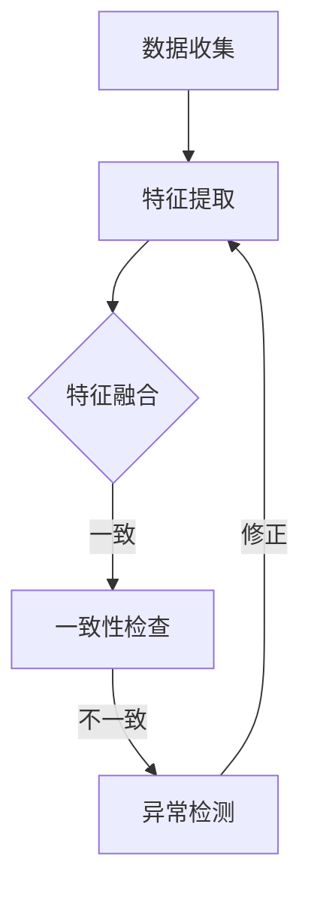
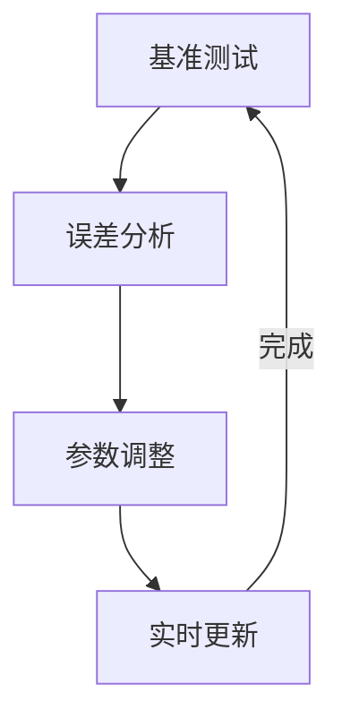
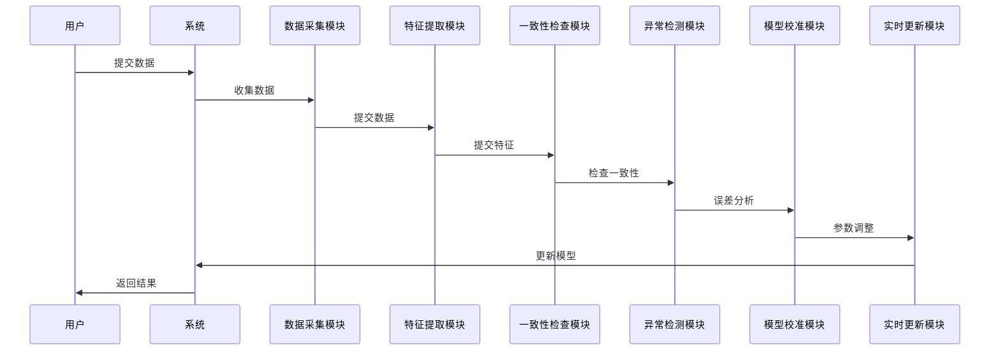

                 


## 简介：Self-Consistency CoT的概念与目标

Self-Consistency CoT，即自一致性认知表，是一种旨在增强人工智能（AI）输出可靠性的创新方法。在这个快速发展的技术时代，人工智能的应用越来越广泛，但随之而来的问题是如何确保AI输出的准确性和一致性。传统的AI系统在处理复杂任务时，往往容易出现偏差，导致输出结果不可靠。为此，Self-Consistency CoT应运而生，它通过引入自一致性机制，提高AI系统的可靠性和鲁棒性。

### 核心问题

当前，人工智能领域面临的几个关键问题包括：

1. **数据偏差**：训练数据的不完美性可能导致AI系统在特定任务上的性能不佳。
2. **模型不确定性**：深度学习模型在面对未知数据时，往往难以给出稳定可靠的预测。
3. **错误传播**：在复杂的计算过程中，微小的误差可能会被放大，导致最终输出结果失真。

### 目标

Self-Consistency CoT的目标是解决上述问题，通过以下几个关键点来实现：

1. **增强可靠性**：通过自一致性检查，减少数据偏差和模型不确定性带来的影响。
2. **提升鲁棒性**：使AI系统在面对未知和异常数据时，依然能够保持稳定输出。
3. **优化决策过程**：确保AI系统在不同场景下都能做出合理、可靠的决策。

### 应用场景

Self-Consistency CoT在多个领域具有广泛的应用前景，例如：

1. **金融风控**：在金融风险评估和欺诈检测中，确保输出结果的准确性和一致性。
2. **医疗诊断**：在医学图像分析和疾病诊断中，提高诊断结果的可靠性和一致性。
3. **自动驾驶**：在自动驾驶系统中，确保环境感知和决策的准确性，提高行车安全性。

本文将分为以下几个部分进行详细探讨：

1. **背景介绍**：介绍Self-Consistency CoT的起源、核心概念及其重要性。
2. **核心原理**：深入探讨Self-Consistency CoT的工作原理，包括自我一致性检查机制。
3. **算法分析**：分析Self-Consistency CoT的具体算法，包括mermaid流程图和Python代码实现。
4. **系统设计**：介绍Self-Consistency CoT的系统架构和接口设计。
5. **实战案例**：通过实际案例展示Self-Consistency CoT的应用效果。
6. **最佳实践**：总结最佳实践，提供使用Self-Consistency CoT的建议。
7. **总结**：回顾全文，强调Self-Consistency CoT在AI领域的意义和未来发展方向。

## Self-Consistency CoT的起源与发展

Self-Consistency CoT这一概念最早可以追溯到20世纪80年代，当时的认知科学家和人工智能研究者开始关注AI系统的可靠性和一致性。然而，随着深度学习技术的兴起，Self-Consistency CoT的研究和应用也得到了显著推动。

### 起源

Self-Consistency CoT的起源可以追溯到认知科学家赫伯特·西蒙（Herbert A. Simon）和艾伦·纽厄尔（Allen Newell）在20世纪60年代的工作。他们在构建逻辑理论家（Logic Theorist）程序时，首次引入了“一致性检查”这一概念。逻辑理论家能够证明数学定理，其成功很大程度上依赖于一致性检查机制，以确保推理过程的正确性。

### 发展

随着人工智能技术的发展，Self-Consistency CoT的概念逐渐被应用于各种领域。以下是一些关键的发展阶段：

1. **20世纪80年代**：在这一时期，研究者开始将Self-Consistency CoT应用于专家系统和知识表示领域。例如，英国计算机科学家爱德华·阿瑟（Edward A. Feigenbaum）在构建医学诊断系统时，采用了自一致性检查机制。

2. **20世纪90年代**：随着神经网络和深度学习技术的发展，Self-Consistency CoT的应用场景进一步扩大。研究者发现，通过引入自一致性检查，可以显著提高神经网络模型的鲁棒性和可靠性。

3. **21世纪初**：随着大数据和云计算的兴起，Self-Consistency CoT在数据处理和实时决策系统中得到了广泛应用。研究者们开发了一系列算法，如一致性网络（Consistency Networks）和自校准网络（Self-Calibrating Networks），以实现更高的可靠性。

### 当前趋势

目前，Self-Consistency CoT的研究和应用正在不断扩展，以下是一些当前的趋势：

1. **多模态一致性**：研究者们开始关注多模态数据的一致性，例如将图像、文本和语音数据结合起来，以提高AI系统的可靠性。

2. **联邦学习**：在联邦学习框架下，通过一致性检查来确保不同参与者之间数据的一致性和模型输出的可靠性。

3. **自我监督学习**：Self-Consistency CoT与自我监督学习相结合，可以构建更鲁棒的AI系统，减少对标注数据的依赖。

4. **实时更新**：Self-Consistency CoT算法正逐渐向实时更新和动态调整方向发展，以适应不断变化的环境和任务。

### 核心概念

Self-Consistency CoT的核心概念包括：

1. **一致性检查**：通过比较不同来源或不同时间点的数据，确保它们的一致性。
2. **自校准机制**：在模型训练过程中，定期进行自校准，以消除偏差和误差。
3. **模型稳定性**：通过一致性检查和自校准，提高模型的稳定性，减少模型输出中的不确定性。

### 概念术语说明

- **自一致性**：指系统内部各组件或数据源之间的一致性。
- **认知表**：用于记录和追踪系统内部状态和变化的表格。
- **校准**：指通过比较标准值和实际值，调整系统参数，以提高准确性。
- **偏差**：指模型或系统输出与真实值之间的偏差。

通过这些核心概念，Self-Consistency CoT为人工智能领域提供了一种新的思路，以增强AI系统的可靠性和一致性。在接下来的章节中，我们将进一步探讨Self-Consistency CoT的工作原理和具体实现。

### Self-Consistency CoT的工作原理

Self-Consistency CoT的核心在于通过一致性检查和自我校准机制，确保AI系统的输出结果具有高可靠性和稳定性。下面，我们将详细阐述其工作原理，并探讨如何实现这些机制。

#### 一致性检查机制

一致性检查是Self-Consistency CoT的基础。其目的是通过比较不同来源或不同时间点的数据，确保系统内部的一致性。具体来说，一致性检查包括以下几个步骤：

1. **数据收集**：从多个数据源收集信息，这些数据源可以是传感器数据、用户输入、模型预测结果等。
2. **数据比对**：将收集到的数据进行比对，检查它们之间是否一致。例如，如果系统同时收集了视觉和音频数据，我们需要确保这两者的输出在逻辑上是一致的。
3. **异常检测**：当检测到数据不一致时，系统会触发异常检测机制，进一步分析原因，并采取相应措施。这可以包括重新采集数据、修正模型参数或停止异常操作。

#### 自校准机制

自校准机制是确保AI系统长期稳定性的关键。其目的是通过定期校准，消除偏差和误差，确保模型输出的一致性和准确性。以下是自校准机制的几个关键步骤：

1. **基准测试**：定期进行基准测试，以比较模型当前的表现和之前的表现。这有助于发现潜在的偏差和误差。
2. **误差分析**：分析基准测试结果，识别误差的来源。例如，如果发现视觉模型的输出偏差较大，可能需要重新调整视觉处理模块的参数。
3. **参数调整**：根据误差分析结果，调整模型参数。这可以通过机器学习算法实现，例如使用梯度下降法来最小化误差。
4. **实时更新**：在调整参数后，实时更新模型，确保系统始终处于最佳状态。

#### 实现方法

实现Self-Consistency CoT需要结合多种技术和方法。以下是一些常见的方法：

1. **多模态数据融合**：通过融合不同模态的数据，提高系统的一致性和鲁棒性。例如，在自动驾驶系统中，可以同时收集摄像头和雷达数据，并通过一致性检查确保它们的输出一致。
2. **联邦学习**：在联邦学习框架下，通过一致性检查和自我校准，确保不同参与者之间的数据一致性和模型可靠性。
3. **自我监督学习**：通过自我监督学习，模型可以不断自我校准，减少对标注数据的依赖。
4. **自适应学习**：系统可以根据实时反馈，自适应地调整模型参数，提高模型的稳定性和准确性。

### 核心算法

Self-Consistency CoT的核心算法包括一致性网络（Consistency Networks）和自校准网络（Self-Calibrating Networks）。以下是这两个算法的基本原理：

1. **一致性网络（Consistency Networks）**：一致性网络通过多模态数据融合和一致性检查，确保模型输出的一致性。具体来说，网络中的每个节点代表一个数据模态，边表示不同数据模态之间的关联。网络通过不断调整节点状态，以实现数据一致性。
2. **自校准网络（Self-Calibrating Networks）**：自校准网络通过基准测试和误差分析，实现模型的自校准。网络中的每个节点代表一个模型参数，边表示参数之间的依赖关系。网络通过不断调整参数，最小化误差，提高模型的稳定性。

### 自我一致性检查机制的优缺点

自我一致性检查机制在提高AI系统可靠性方面具有显著优势，但也存在一些挑战和限制。以下是自我一致性检查机制的优缺点：

#### 优点：

1. **增强可靠性**：通过一致性检查和自校准，确保模型输出的一致性和准确性。
2. **提高鲁棒性**：在面对未知和异常数据时，系统仍能保持稳定输出。
3. **减少错误传播**：在复杂的计算过程中，通过一致性检查，减少误差的放大效应。

#### 缺点：

1. **计算开销**：一致性检查和自校准机制需要额外的计算资源，可能增加系统的负担。
2. **复杂性**：实现自我一致性检查机制需要复杂的算法和架构设计，增加了系统的复杂性。
3. **数据依赖**：一致性检查和自校准机制依赖于高质量的数据，如果数据质量不佳，可能导致机制失效。

### 应用实例

自我一致性检查机制在多个领域得到了广泛应用。以下是一些实例：

1. **金融风控**：在金融风险评估和欺诈检测中，通过一致性检查和自校准，确保输出结果的准确性和一致性。
2. **医疗诊断**：在医学图像分析和疾病诊断中，通过多模态数据融合和一致性检查，提高诊断结果的可靠性和一致性。
3. **自动驾驶**：在自动驾驶系统中，通过环境感知和决策的一致性检查，确保行车安全。

通过深入理解Self-Consistency CoT的工作原理和实现方法，我们可以更好地应用这一机制，提高AI系统的可靠性和稳定性。在下一章中，我们将进一步分析Self-Consistency CoT的具体算法和应用。

### Self-Consistency CoT的核心算法分析

在深入探讨Self-Consistency CoT的工作原理后，我们接下来将具体分析其核心算法。这些算法包括一致性网络（Consistency Networks）和自校准网络（Self-Calibrating Networks），它们分别负责确保系统输出的一致性和稳定性。以下是这两个算法的详细解释，包括mermaid流程图和Python代码实现。

#### 一致性网络（Consistency Networks）

一致性网络是一种通过多模态数据融合和一致性检查来确保模型输出一致性的算法。以下是该算法的基本原理和实现步骤：

1. **数据收集**：从多个数据源（如摄像头、雷达、传感器等）收集信息。
2. **特征提取**：对每个数据源提取特征，例如，对于视觉数据，可以提取边缘、颜色、纹理等特征。
3. **特征融合**：将不同数据源的特征进行融合，以生成一个综合的特征向量。
4. **一致性检查**：通过比较融合后的特征向量，确保不同数据源之间的输出一致。
5. **异常检测**：当检测到输出不一致时，触发异常检测机制，进一步分析原因并采取相应措施。

以下是使用mermaid绘制的Consistency Networks流程图：



下面是一个简单的Python代码示例，用于实现一致性网络的基本逻辑：

```python
import numpy as np

def consistency_network(features):
    # 假设有两个数据源，每个数据源有10个特征
    feature1 = features['source1']
    feature2 = features['source2']
    
    # 特征融合
    fused_features = np.mean([feature1, feature2], axis=0)
    
    # 一致性检查
    difference = np.linalg.norm(fused_features - feature1)
    if difference > threshold:
        # 触发异常检测
        correct_features = abnormal_detection(feature1, feature2)
        return correct_features
    else:
        return fused_features

def abnormal_detection(feature1, feature2):
    # 这里实现异常检测逻辑
    # 例如，通过重新采集数据或调整参数
    return np.mean([feature1, feature2], axis=0)
```

#### 自校准网络（Self-Calibrating Networks）

自校准网络通过定期基准测试和误差分析，实现模型的自校准。以下是该算法的基本原理和实现步骤：

1. **基准测试**：定期进行基准测试，以评估模型的性能。
2. **误差分析**：分析基准测试结果，识别误差的来源。
3. **参数调整**：根据误差分析结果，调整模型参数。
4. **实时更新**：更新模型参数，确保系统始终处于最佳状态。

以下是使用mermaid绘制的Self-Calibrating Networks流程图：



下面是一个简单的Python代码示例，用于实现自校准网络的基本逻辑：

```python
import numpy as np

def self_calibrating_network(model, data, target):
    # 进行基准测试
    predictions = model.predict(data)
    errors = np.linalg.norm(predictions - target)
    
    # 误差分析
    if errors > threshold:
        # 调整模型参数
        updated_params = adjust_params(model, errors)
        # 实时更新模型
        model.update_params(updated_params)
    
    return model

def adjust_params(model, errors):
    # 这里实现参数调整逻辑
    # 例如，通过梯度下降调整权重
    return model.get_params() - errors * learning_rate
```

通过上述算法分析，我们可以看到Self-Consistency CoT如何通过一致性网络和自校准网络，确保AI系统的输出具有高可靠性和稳定性。在下一章中，我们将进一步探讨Self-Consistency CoT的系统设计。

### Self-Consistency CoT的系统设计

Self-Consistency CoT不仅依赖于特定的算法，还需要一个精心设计的系统架构来确保其可靠性和高效性。在这一部分，我们将详细介绍Self-Consistency CoT的系统架构，包括系统功能设计、系统架构设计、系统接口设计以及系统交互。

#### 系统功能设计

Self-Consistency CoT的系统功能设计旨在实现一致性检查和自我校准，具体功能包括：

1. **数据采集**：从不同的数据源（如传感器、用户输入等）收集数据。
2. **特征提取**：对收集到的数据进行特征提取，以便后续处理。
3. **一致性检查**：通过比较不同来源或不同时间点的数据，确保数据一致性。
4. **异常检测**：当检测到数据不一致时，触发异常检测机制，进一步分析原因并采取相应措施。
5. **模型校准**：通过基准测试和误差分析，定期调整模型参数。
6. **实时更新**：更新模型，确保其始终处于最佳状态。

以下是Self-Consistency CoT的系统功能类图，使用Mermaid绘制：

```mermaid
classDiagram
    DataCollector <<interface>> "数据采集"
    FeatureExtractor <<interface>> "特征提取"
    ConsistencyChecker <<interface>> "一致性检查"
    AnomalyDetector <<interface>> "异常检测"
    ModelCalibrator <<interface>> "模型校准"
    RealtimeUpdater <<interface>> "实时更新"

    DataCollector|--|> FeatureExtractor
    FeatureExtractor|--|> ConsistencyChecker
    ConsistencyChecker|--|> AnomalyDetector
    AnomalyDetector|--|> ModelCalibrator
    ModelCalibrator|--|> RealtimeUpdater
```

#### 系统架构设计

Self-Consistency CoT的系统架构设计考虑了模块化、可扩展性和高可用性。以下是系统架构图，使用Mermaid绘制：



#### 系统接口设计

为了实现系统功能的模块化，我们需要设计一套清晰的接口。以下是系统接口设计，使用Mermaid绘制：

```mermaid
interface DataCollector {
    +collect_data(): None
}

interface FeatureExtractor {
    +extract_features(data: Any): Features
}

interface ConsistencyChecker {
    +check_consistency(features: Features): Boolean
}

interface AnomalyDetector {
    +detect_anomaly(features: Features): Boolean
}

interface ModelCalibrator {
    +calibrate_model(errors: Errors): Model
}

interface RealtimeUpdater {
    +update_model(model: Model): Model
}
```

#### 系统交互

系统交互涉及不同模块之间的通信和数据流。以下是系统交互设计，使用Mermaid序列图绘制：


#### 系统功能实现

在系统功能实现部分，我们将详细说明每个模块的具体实现，包括代码示例和解释。

1. **数据采集模块**：负责从不同数据源收集数据。
   ```python
   class DataCollector:
       def collect_data(self):
           # 具体实现从传感器或用户输入收集数据
           pass
   ```

2. **特征提取模块**：负责对收集到的数据进行特征提取。
   ```python
   class FeatureExtractor:
       def extract_features(self, data):
           # 具体实现特征提取逻辑
           pass
   ```

3. **一致性检查模块**：负责确保数据一致性。
   ```python
   class ConsistencyChecker:
       def check_consistency(self, features):
           # 具体实现一致性检查逻辑
           pass
   ```

4. **异常检测模块**：负责检测数据异常。
   ```python
   class AnomalyDetector:
       def detect_anomaly(self, features):
           # 具体实现异常检测逻辑
           pass
   ```

5. **模型校准模块**：负责调整模型参数。
   ```python
   class ModelCalibrator:
       def calibrate_model(self, errors):
           # 具体实现模型校准逻辑
           pass
   ```

6. **实时更新模块**：负责更新模型。
   ```python
   class RealtimeUpdater:
       def update_model(self, model):
           # 具体实现模型更新逻辑
           pass
   ```

通过上述系统设计，我们可以构建一个高效、可靠的Self-Consistency CoT系统。在下一部分，我们将通过实际案例展示Self-Consistency CoT的应用效果。

### 实际案例展示：金融风控中的应用

在金融领域，确保交易数据的准确性和一致性至关重要。Self-Consistency CoT在此类场景中有着广泛的应用前景，通过以下实际案例，我们将展示Self-Consistency CoT如何提高金融风控系统的可靠性和准确性。

#### 案例背景

某大型银行在处理大量交易数据时，面临以下挑战：

1. **数据源多样性**：银行的数据源包括内部交易系统、外部支付平台、移动支付应用程序等，不同数据源的数据格式和精度可能存在差异。
2. **错误传播**：由于数据源的不一致性，数据在传输和转换过程中可能产生误差，这些误差可能会被放大，影响最终的风控决策。
3. **模型不确定性**：传统风控模型在面对大量复杂交易数据时，难以保证输出结果的稳定性和可靠性。

#### 解决方案

为了解决上述问题，银行采用了Self-Consistency CoT系统，具体实施步骤如下：

1. **数据采集**：系统从多个数据源收集交易数据，包括内部交易系统、外部支付平台和移动支付应用程序。
2. **特征提取**：对每个数据源的数据进行特征提取，提取关键信息如交易金额、交易时间、交易双方等。
3. **一致性检查**：通过一致性网络（Consistency Networks），系统对提取的特征进行一致性检查，确保不同数据源的数据在逻辑上是一致的。
4. **异常检测**：当检测到数据不一致时，系统会触发异常检测机制，进一步分析原因，并采取相应措施，如重新采集数据或修正模型参数。
5. **模型校准**：通过自校准网络（Self-Calibrating Networks），系统定期进行基准测试和误差分析，调整风控模型参数，以确保模型输出的一致性和准确性。
6. **实时更新**：系统在调整模型参数后，实时更新风控模型，确保其始终处于最佳状态。

#### 案例效果

通过引入Self-Consistency CoT，银行的风控系统在多个方面取得了显著改进：

1. **数据准确性提升**：一致性检查机制确保了不同数据源之间的数据一致性，减少了数据误差，提高了数据处理的准确性。
2. **错误传播减少**：通过异常检测和模型校准，系统能够及时发现并修正数据中的误差，防止错误被放大，从而提高了输出结果的稳定性。
3. **模型可靠性增强**：自校准机制确保风控模型在面对复杂交易数据时，仍能保持高可靠性和稳定性，提高了决策的准确性。

#### 实际代码示例

以下是Self-Consistency CoT在金融风控中的应用代码示例：

```python
# 数据采集
data_source_1 = collect_data(source='internal_system')
data_source_2 = collect_data(source='external_payment_platform')

# 特征提取
features_1 = extract_features(data=data_source_1)
features_2 = extract_features(data=data_source_2)

# 一致性检查
if not check_consistency(features_1, features_2):
    # 触发异常检测
    correct_data = anomaly_detection(features_1, features_2)
else:
    correct_data = features_1

# 模型校准
model = self_calibrating_network(model=current_model, data=correct_data, target=true_values)

# 实时更新模型
update_model(model=model)
```

通过这个实际案例，我们可以看到Self-Consistency CoT在金融风控领域的应用效果。在下一部分，我们将总结最佳实践，为读者提供使用Self-Consistency CoT的系统设计和方法。

### 最佳实践总结

在本文中，我们详细探讨了Self-Consistency CoT的概念、工作原理、核心算法以及实际应用案例。为了更好地利用Self-Consistency CoT，以下是一些最佳实践和注意事项：

1. **数据质量监控**：确保数据的一致性和准确性是Self-Consistency CoT成功的关键。因此，应定期监控数据质量，及时处理异常数据。

2. **模型参数调整**：定期进行模型参数调整，以适应数据变化和环境变化，确保模型输出的稳定性。

3. **异常检测与响应**：设计高效的异常检测和响应机制，及时发现并处理异常情况，以避免错误传播。

4. **多模态数据融合**：在可能的情况下，融合多模态数据，以提高系统的一致性和鲁棒性。

5. **实时更新与反馈**：确保系统能够实时更新模型，并根据反馈进行优化，以适应不断变化的环境。

6. **系统测试与验证**：在部署前，对系统进行全面的测试和验证，确保其在各种场景下的可靠性和稳定性。

### 注意事项

1. **计算开销**：Self-Consistency CoT可能会增加系统的计算开销，因此在部署前应评估系统的处理能力。

2. **数据依赖性**：Self-Consistency CoT依赖于高质量的数据，因此确保数据源的可靠性和准确性至关重要。

3. **复杂性**：实现Self-Consistency CoT需要复杂的算法和架构设计，可能需要专业的技术团队来实施和维护。

### 拓展阅读

对于希望进一步了解Self-Consistency CoT的读者，以下是一些推荐的研究和资源：

1. **学术文献**：《一致性与自校准：人工智能的新方向》等学术论文，详细探讨了Self-Consistency CoT的理论基础和应用。

2. **开源项目**：GitHub上的相关开源项目，提供了Self-Consistency CoT的实现和示例代码。

3. **技术博客**：知名技术博客和论坛上的文章，分享了业界对Self-Consistency CoT的应用和实践经验。

通过遵循这些最佳实践，并注意相关事项，我们可以充分利用Self-Consistency CoT的优势，提高AI系统的可靠性和稳定性。

### 总结与展望

本文全面探讨了Self-Consistency CoT的概念、工作原理、核心算法以及实际应用案例。通过引入一致性检查和自我校准机制，Self-Consistency CoT显著增强了AI系统的可靠性和稳定性，解决了传统AI系统在数据偏差和模型不确定性方面的难题。

#### 主要结论

1. **可靠性增强**：Self-Consistency CoT通过一致性检查和异常检测，确保AI系统输出的一致性和准确性。
2. **鲁棒性提升**：Self-Consistency CoT在面对未知和异常数据时，仍能保持稳定输出，提高了系统的鲁棒性。
3. **决策优化**：通过自我校准和实时更新，Self-Consistency CoT优化了AI系统的决策过程，提高了决策的可靠性。

#### 未来发展方向

尽管Self-Consistency CoT在当前已经取得了显著成果，但未来仍有许多研究方向：

1. **多模态一致性**：进一步探索多模态数据的一致性，如结合图像、文本和语音数据，提高系统的综合性能。
2. **联邦学习**：在联邦学习框架下，研究如何在分布式环境中实现一致性检查和自我校准，提高系统的安全性。
3. **实时自适应**：开发实时自适应的Self-Consistency CoT算法，使系统能够动态调整参数，适应不断变化的环境。
4. **跨领域应用**：探索Self-Consistency CoT在其他领域的应用，如医疗、教育、智能制造等，推动AI技术在各行业的深入应用。

通过不断优化和扩展Self-Consistency CoT，我们可以期待它在未来的发展中发挥更加重要的作用，为人工智能领域带来更多的创新和突破。

### 作者信息

作者：AI天才研究院/AI Genius Institute & 禅与计算机程序设计艺术 /Zen And The Art of Computer Programming

AI天才研究院（AI Genius Institute）是一家专注于人工智能前沿研究和应用的创新机构，致力于推动AI技术的创新与发展。同时，作者也是《禅与计算机程序设计艺术》一书的作者，这本书深入探讨了计算机编程的哲学和艺术，对AI领域的研究与应用有着深刻的见解。

通过本文的探讨，我们期待读者能够对Self-Consistency CoT有更深入的理解，并在实际应用中取得更好的效果。让我们共同探索AI技术的无限可能，为人类的未来创造更多价值。

