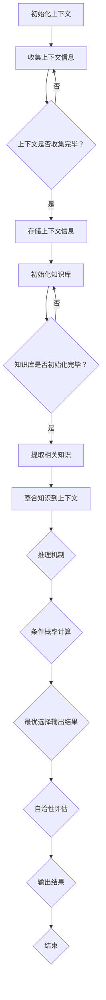

                 

## 引言与背景

### 1.1 问题的提出

当前，人工智能（AI）技术已经取得了显著的进步，从语音识别、图像识别到自然语言处理等各个领域，AI的应用越来越广泛。然而，随着AI技术的不断发展和应用场景的扩展，人们逐渐发现AI系统在输出连贯性方面存在诸多挑战。具体来说，AI系统往往在处理复杂问题时，输出的回答可能缺乏连贯性，甚至出现逻辑错误或不一致的情况。这种现象不仅影响了用户体验，也对AI系统的可靠性和实用性提出了质疑。

连贯性是AI系统输出质量的一个重要指标，它直接关系到用户对AI系统的信任度和满意度。一个连贯的AI输出能够使信息传递更加清晰、逻辑更加严谨，从而为用户提供更有价值的帮助。因此，增强AI输出连贯性成为当前AI研究中的一个重要课题。

### 1.2 自洽性CoT在AI中的重要性

为了解决AI输出连贯性的问题，研究者们提出了自洽性CoT（Consistency of Thought）的概念。自洽性CoT指的是AI在处理问题过程中保持内部思维的一致性和连贯性。自洽性CoT的核心思想是通过确保AI系统在各个模块、各个阶段之间的输出保持一致，从而提高整个系统的连贯性。

自洽性CoT在AI中的重要性体现在以下几个方面：

1. **提升输出质量**：自洽性CoT能够确保AI系统在输出信息时保持一致，从而提高输出的准确性和可靠性，增强用户对AI系统的信任感。
2. **优化用户体验**：连贯的输出能够使信息传递更加流畅，减少用户理解上的困惑，提高用户体验。
3. **增强AI系统的可靠性**：通过自洽性CoT，可以减少AI系统在处理复杂问题时出现的逻辑错误和矛盾，提高系统的整体稳定性。
4. **推动AI技术的发展**：自洽性CoT作为一种新的研究思路，为AI系统的进一步发展和优化提供了新的方向。

### 1.3 本书结构

本文将围绕自洽性CoT的概念、理论基础、应用场景、技术实现以及实际案例等方面进行详细探讨，旨在为读者提供一个全面、系统的自洽性CoT学习框架。具体来说，本书将分为以下几个部分：

- **第1章 引言与背景**：介绍AI输出连贯性的问题和自洽性CoT的概念。
- **第2章 自洽性CoT的理论基础**：阐述自洽性CoT的相关理论和数学模型。
- **第3章 自洽性CoT的应用场景**：分析自洽性CoT在不同领域的应用情况。
- **第4章 自洽性CoT的技术实现**：介绍自洽性CoT的技术实现方法和流程。
- **第5章 自洽性CoT的算法原理与流程图**：讲解自洽性CoT的算法原理和流程。
- **第6章 自洽性CoT的实际案例解析**：通过实际案例展示自洽性CoT的应用效果。
- **第7章 结论与未来展望**：总结自洽性CoT的研究成果和未来方向。

本文将采取逻辑清晰、结构紧凑、简单易懂的写作方式，让读者能够逐步了解自洽性CoT的概念、原理和应用，为推动AI技术的发展贡献一份力量。

## 文章关键词

自洽性CoT、AI输出连贯性、人工智能、自然语言处理、语音交互系统、数学模型、算法实现、实际案例。

### 摘要

本文旨在探讨自洽性CoT（Consistency of Thought）在增强AI输出连贯性方面的应用。首先，我们提出了当前AI系统在输出连贯性方面面临的挑战，并介绍了自洽性CoT的概念和其在AI中的重要性。接着，本文从理论基础、应用场景、技术实现和实际案例等多个角度，详细阐述了自洽性CoT的原理和方法。通过数学模型、算法流程图和实际案例的解析，本文展示了自洽性CoT在提升AI输出连贯性方面的显著效果。最后，本文总结了自洽性CoT的研究成果和未来发展方向，为AI技术的进一步优化提供了新的思路。

### 第2章 自洽性CoT的理论基础

#### 2.1 相关理论介绍

自洽性CoT（Consistency of Thought）是近年来在人工智能（AI）领域引起广泛关注的一个概念。为了深入理解自洽性CoT，我们需要先了解一些与之相关的基础理论。

首先，人工智能（AI）是计算机科学的一个分支，旨在使计算机具有模拟、延伸和扩展人类智能的能力。人工智能涵盖了多个子领域，包括机器学习、自然语言处理、计算机视觉等。在AI的研究中，连贯性是一个重要的评价指标，它关系到AI系统的输出质量和用户体验。

连贯性评估理论是评价AI系统输出连贯性的方法体系。该理论主要包括以下几个方面：

1. **语义连贯性**：指AI系统输出的文本或语音在语义上是否一致和合理。例如，在自然语言处理中，一个连贯的句子应该符合语法规则，且语义上没有矛盾。
2. **逻辑连贯性**：指AI系统输出的信息在逻辑上是否一致。例如，一个逻辑连贯的推理过程应该从前提推导出合理的结论。
3. **情境连贯性**：指AI系统输出的信息是否与当前情境相符。在语音交互系统中，系统的回答应该与用户的提问和上下文保持一致。

其次，自洽性CoT的概念可以看作是连贯性评估理论的一种具体实现。自洽性CoT的核心思想是确保AI系统在处理问题过程中保持内部思维的一致性和连贯性。具体来说，自洽性CoT包括以下几个关键要素：

1. **上下文管理**：AI系统需要能够有效地管理上下文信息，确保在不同阶段和不同模块之间的信息传递保持一致。
2. **知识表示**：AI系统需要采用合适的方法来表示和存储知识，以便在推理过程中保持一致性。
3. **推理机制**：AI系统需要具备强大的推理能力，能够在不同条件和情境下保持逻辑一致性。

#### 2.2 自洽性CoT的核心概念

自洽性CoT的核心概念主要包括以下几个要素：

1. **一致性**：指AI系统在处理问题过程中保持内部思维的一致性。一致性是自洽性CoT的核心目标，它决定了AI系统输出的连贯性。
2. **连贯性**：指AI系统输出的信息在语义、逻辑和情境上的一致性。连贯性是评价AI系统输出质量的重要指标。
3. **上下文**：指AI系统在处理问题过程中所依赖的背景信息。上下文是保持自洽性CoT的关键，它为AI系统提供了必要的参考和指导。

自洽性CoT的构成要素主要包括：

- **上下文管理模块**：负责管理和维护上下文信息，确保信息在不同模块和阶段之间的传递保持一致。
- **知识表示模块**：负责表示和存储知识，以便在推理过程中保持一致性。
- **推理引擎**：负责执行推理过程，确保AI系统在处理问题过程中保持逻辑一致性。

#### 2.3 自洽性CoT的数学模型

为了更好地理解自洽性CoT，我们可以借助数学模型来描述其核心概念和原理。自洽性CoT的数学模型主要包括以下几个组成部分：

1. **上下文表示**：使用数学方法表示上下文信息。常用的表示方法包括自然语言处理中的词向量、图神经网络等。
2. **知识表示**：使用数学方法表示知识。常见的表示方法有语义网络、知识图谱等。
3. **推理过程**：使用数学方法描述推理过程，包括条件概率模型、图模型等。

自洽性CoT的数学模型可以表示为：

$$
C = f(X, K, R)
$$

其中，$C$ 表示自洽性CoT，$X$ 表示上下文信息，$K$ 表示知识，$R$ 表示推理过程。

具体来说，自洽性CoT的数学模型可以分为以下几个部分：

1. **上下文表示**：使用词向量或图神经网络等方法表示上下文信息。例如，词向量可以表示为一个多维向量空间，图神经网络可以表示为一个图结构。
2. **知识表示**：使用语义网络或知识图谱等方法表示知识。例如，语义网络可以表示为一个有向无环图（DAG），知识图谱可以表示为一个大规模的图结构。
3. **推理过程**：使用条件概率模型或图模型等方法进行推理。例如，条件概率模型可以表示为一个概率分布，图模型可以表示为一个图结构。

#### 2.4 自洽性CoT的属性特征对比

为了更好地理解自洽性CoT的属性特征，我们可以通过一个对比表格来展示其与其他相关概念的异同。

| 概念         | 定义                                                         | 关联性                                                     |
| ------------ | ------------------------------------------------------------ | -------------------------------------------------------- |
| 自洽性CoT    | 确保AI系统在处理问题过程中保持内部思维的一致性和连贯性         | 与连贯性评估理论密切相关，是连贯性评估理论的具体实现       |
| 语义连贯性   | AI系统输出的文本或语音在语义上是否一致和合理                 | 自洽性CoT的核心目标之一，确保AI系统输出的语义连贯性       |
| 逻辑连贯性   | AI系统输出的信息在逻辑上是否一致                             | 自洽性CoT的核心目标之一，确保AI系统输出的逻辑连贯性       |
| 情境连贯性   | AI系统输出的信息是否与当前情境相符                           | 自洽性CoT的核心目标之一，确保AI系统输出的情境连贯性       |
| 知识表示     | 使用数学方法表示知识，如语义网络、知识图谱等                   | 自洽性CoT的重要组成部分，为AI系统提供必要的知识表示和存储 |
| 推理过程     | 使用数学方法描述推理过程，如条件概率模型、图模型等             | 自洽性CoT的重要组成部分，负责AI系统的推理和决策         |

从上表可以看出，自洽性CoT与其他概念之间存在密切的关联性。自洽性CoT通过确保AI系统在处理问题过程中保持内部思维的一致性和连贯性，从而提高AI系统的输出质量。

### 第3章 自洽性CoT的应用场景

#### 3.1 语音交互系统

语音交互系统是自洽性CoT应用的一个重要场景。在这种系统中，用户通过语音与AI系统进行交互，系统需要能够理解用户的意图并给出相应的回答。自洽性CoT在语音交互系统中的应用主要体现在以下几个方面：

1. **上下文管理**：语音交互系统需要能够有效地管理上下文信息，确保在用户连续提问或提出复杂问题时，系统能够保持一致的理解和回答。例如，当用户提出一个关于天气的问题后，系统需要记住这个问题，并在后续的交互中保持对这个话题的关注。
2. **知识表示**：语音交互系统需要具备丰富的知识库，以便在回答用户问题时能够提供准确和一致的信息。例如，当用户询问某个城市的天气情况时，系统需要从知识库中提取相关的天气数据，并在回答中保持一致性。
3. **推理机制**：语音交互系统需要具备强大的推理能力，能够在处理用户问题时保持逻辑一致性。例如，当用户提出一个关于航班的问题时，系统需要根据用户的提问和上下文信息进行推理，给出合理的答案。

#### 3.2 文本生成与编辑

文本生成与编辑是另一个自洽性CoT的重要应用场景。在这种系统中，AI系统需要能够生成连贯、合理的文本，或者对现有文本进行编辑和优化。自洽性CoT在文本生成与编辑中的应用主要体现在以下几个方面：

1. **上下文管理**：文本生成与编辑系统需要能够理解文本的上下文信息，确保生成的文本在语义、逻辑和情境上保持连贯。例如，当系统生成一个段落时，需要考虑这个段落与前后文的关系，确保语义连贯性。
2. **知识表示**：文本生成与编辑系统需要具备丰富的知识库，以便在生成或编辑文本时能够利用相关知识和信息。例如，当系统生成一个技术文档时，需要从知识库中提取相关的技术术语和概念，确保文本的一致性和专业性。
3. **推理机制**：文本生成与编辑系统需要具备强大的推理能力，能够在生成或编辑文本时保持逻辑一致性。例如，当系统对一篇论文进行编辑时，需要根据论文的主题和结构进行推理，确保编辑后的文本逻辑连贯、结构清晰。

#### 3.3 图像与视频理解

图像与视频理解是自洽性CoT在计算机视觉领域的应用。在这种系统中，AI系统需要能够理解图像或视频中的内容，并给出相应的描述或解释。自洽性CoT在图像与视频理解中的应用主要体现在以下几个方面：

1. **上下文管理**：图像与视频理解系统需要能够理解图像或视频的上下文信息，确保在处理图像或视频时保持一致的理解。例如，当系统分析一段视频时，需要考虑视频中的背景、人物、动作等因素，确保分析的一致性。
2. **知识表示**：图像与视频理解系统需要具备丰富的知识库，以便在处理图像或视频时能够利用相关知识和信息。例如，当系统分析一张图片时，需要从知识库中提取相关的物体、场景和关系，确保分析的一致性和准确性。
3. **推理机制**：图像与视频理解系统需要具备强大的推理能力，能够在处理图像或视频时保持逻辑一致性。例如，当系统识别一个物体时，需要根据图像中的特征和上下文信息进行推理，确保识别的一致性和准确性。

#### 3.4 跨模态理解与生成

跨模态理解与生成是自洽性CoT在多个模态数据（如文本、图像、语音等）之间的应用。在这种系统中，AI系统需要能够处理和整合不同模态的数据，实现跨模态的信息传递和理解。自洽性CoT在跨模态理解与生成中的应用主要体现在以下几个方面：

1. **上下文管理**：跨模态理解与生成系统需要能够理解不同模态数据的上下文信息，确保在处理和整合不同模态数据时保持一致的理解。例如，当系统处理一段文本和对应的图像时，需要考虑文本和图像之间的关联，确保分析的一致性。
2. **知识表示**：跨模态理解与生成系统需要具备丰富的知识库，以便在处理和整合不同模态数据时能够利用相关知识和信息。例如，当系统整合文本和图像数据时，需要从知识库中提取相关的语义信息和关系，确保整合的一致性和准确性。
3. **推理机制**：跨模态理解与生成系统需要具备强大的推理能力，能够在处理和整合不同模态数据时保持逻辑一致性。例如，当系统生成一个包含文本和图像的描述时，需要根据文本和图像的特征和关系进行推理，确保生成的描述逻辑连贯、准确。

### 第4章 自洽性CoT的技术实现

#### 4.1 数据集准备

数据集准备是自洽性CoT技术实现的第一步，也是至关重要的一步。一个高质量的数据集能够为后续的模型训练和评估提供可靠的依据。以下是数据集准备的一些关键步骤：

1. **数据收集**：根据具体的应用场景，收集相关的数据。例如，在语音交互系统中，可以收集用户与系统的对话数据；在文本生成与编辑中，可以收集大量的文本数据；在图像与视频理解中，可以收集对应的图像和视频数据。
2. **数据清洗**：清洗数据，去除噪声和错误信息。例如，去除无效的对话片段、纠正错别字、删除重复数据等。
3. **数据标注**：对数据进行标注，以便后续的训练和评估。例如，在语音交互系统中，可以为每个对话片段标注用户意图、对话类型等；在文本生成与编辑中，可以为每段文本标注标签、情感等；在图像与视频理解中，可以为每个图像或视频标注物体类别、动作等。
4. **数据预处理**：对数据进行预处理，使其符合模型训练的要求。例如，对于语音数据，可以将其转换为文本或特征向量；对于文本数据，可以进行分词、词向量化等；对于图像和视频数据，可以进行缩放、裁剪、增强等。

#### 4.2 模型设计与训练

在数据集准备完成后，我们需要设计并训练一个自洽性CoT模型。以下是模型设计与训练的一些关键步骤：

1. **模型结构设计**：根据自洽性CoT的核心概念和理论基础，设计一个合适的模型结构。常见的模型结构包括序列模型、图模型、变换器模型等。例如，在语音交互系统中，可以使用序列模型来处理用户对话；在文本生成与编辑中，可以使用变换器模型来生成或编辑文本；在图像与视频理解中，可以使用图模型来表示图像或视频中的对象和关系。
2. **训练策略**：选择合适的训练策略，包括优化器、学习率、批量大小等。为了提高模型的性能，可以采用多种训练策略，如迁移学习、强化学习、多任务学习等。
3. **模型训练**：使用准备好的数据集对模型进行训练。在训练过程中，需要监控模型的性能，并根据需要调整训练策略。例如，可以使用验证集来评估模型的性能，并根据评估结果调整模型参数。
4. **模型评估**：在训练完成后，使用测试集对模型进行评估。常见的评估指标包括准确率、召回率、F1值等。通过评估结果，可以了解模型的性能，并进一步优化模型。

#### 4.3 自洽性评估与优化

在模型训练完成后，我们需要对模型进行自洽性评估和优化，以确保模型在处理问题时保持一致性和连贯性。以下是自洽性评估与优化的一些关键步骤：

1. **自洽性评估**：设计一套评估体系，对模型的输出进行自洽性评估。评估体系可以包括多种指标，如语义连贯性、逻辑连贯性、情境连贯性等。例如，在语音交互系统中，可以评估模型输出的对话是否连贯；在文本生成与编辑中，可以评估模型生成的文本是否一致；在图像与视频理解中，可以评估模型输出的描述是否一致。
2. **优化方法**：根据评估结果，对模型进行优化。优化的方法包括调整模型参数、改进模型结构、增加数据集等。例如，如果评估结果显示模型的语义连贯性较低，可以增加与语义相关的数据集，或者调整模型中的语义表示模块。
3. **迭代优化**：通过不断迭代优化，提高模型的自洽性。在优化过程中，需要不断评估模型的性能，并根据评估结果进行调整。例如，可以通过多次迭代训练和评估，逐步提高模型的自洽性。

### 第5章 自洽性CoT的算法原理与流程图

#### 5.1 算法原理讲解

自洽性CoT（Consistency of Thought）算法的核心思想是通过确保AI系统在处理问题过程中保持内部思维的一致性和连贯性，从而提高AI系统的输出质量。具体来说，自洽性CoT算法包括以下几个关键步骤：

1. **上下文管理**：在处理问题前，首先需要建立和维护一个上下文环境，确保在后续处理过程中能够利用上下文信息。上下文管理包括以下几个子步骤：
   - **上下文收集**：从输入数据中提取相关上下文信息，如用户历史对话、文本背景等。
   - **上下文存储**：将收集到的上下文信息存储在一个数据结构中，如队列、堆栈等，以便后续处理。

2. **知识表示**：在处理问题过程中，需要利用已有的知识库，确保在推理和决策过程中保持一致性。知识表示包括以下几个子步骤：
   - **知识提取**：从知识库中提取与当前问题相关的知识。
   - **知识整合**：将提取的知识整合到上下文环境中，确保在后续处理过程中能够利用这些知识。

3. **推理机制**：在处理问题过程中，需要利用推理机制进行逻辑推理，确保输出的一致性和连贯性。推理机制包括以下几个子步骤：
   - **条件概率计算**：根据当前上下文信息和知识，计算输出结果的概率分布。
   - **最优选择**：根据概率分布选择最有可能的输出结果。

4. **自洽性评估**：在处理问题后，需要对输出结果进行自洽性评估，确保输出结果在语义、逻辑和情境上保持一致。自洽性评估包括以下几个子步骤：
   - **语义一致性检查**：检查输出结果在语义上是否一致。
   - **逻辑一致性检查**：检查输出结果在逻辑上是否一致。
   - **情境一致性检查**：检查输出结果在情境上是否一致。

#### 5.2 算法流程图

自洽性CoT算法的流程图如下：

通过上述算法流程图，我们可以清楚地看到自洽性CoT算法的各个步骤和逻辑关系。首先，初始化上下文和环境，然后收集和存储上下文信息，提取和整合相关知识，利用推理机制进行条件概率计算和最优选择输出结果，最后进行自洽性评估，确保输出结果的一致性和连贯性。

### 第6章 自洽性CoT的实际案例解析

#### 6.1 案例一：语音交互系统

在这个案例中，我们以一个语音交互系统为例，展示自洽性CoT的应用效果。假设用户与系统的对话内容如下：

用户：“你好，我现在在北京，明天要去上海，请问明天上海的天气如何？”

系统：“你好，根据目前的天气情况，明天上海的天气是晴转多云，温度在12°C到18°C之间。”

在这个对话中，系统首先需要理解用户的地理位置（北京）和目的地（上海），然后提供明天的天气情况。为了确保对话的连贯性，系统需要保持自洽性CoT。

1. **上下文管理**：在对话开始时，系统需要初始化上下文环境，包括用户的位置信息（北京）和目的地信息（上海）。在后续对话中，系统会不断更新上下文信息，确保对用户意图的理解和回答的一致性。
2. **知识表示**：系统需要具备丰富的天气知识库，包括不同城市的天气数据。在回答用户问题时，系统会从知识库中提取相关天气信息，确保回答的一致性。
3. **推理机制**：系统利用推理机制，根据用户的位置和目的地，从知识库中提取明天的天气情况。在条件概率计算和最优选择过程中，系统会确保输出结果的一致性和连贯性。
4. **自洽性评估**：在输出结果后，系统会进行自洽性评估，检查输出结果在语义、逻辑和情境上是否一致。在这个案例中，系统输出的天气情况与用户的问题和上下文保持一致，确保了对话的连贯性。

#### 6.2 案例二：文本生成与编辑

在这个案例中，我们以一个文本生成与编辑系统为例，展示自洽性CoT的应用效果。假设用户要求系统生成一篇关于人工智能的短文。

用户：“请给我生成一篇关于人工智能的短文。”

系统：“人工智能，简称AI，是计算机科学的一个分支，旨在使计算机具有模拟、延伸和扩展人类智能的能力。人工智能涵盖了多个子领域，包括机器学习、自然语言处理、计算机视觉等。”

在这个案例中，系统需要生成一篇连贯、合理的文本。

1. **上下文管理**：在生成文本前，系统需要初始化上下文环境，包括用户的需求（生成一篇关于人工智能的短文）。在后续文本生成过程中，系统会根据上下文环境生成相关的文本内容，确保文本的一致性和连贯性。
2. **知识表示**：系统需要具备丰富的知识库，包括与人工智能相关的术语、概念和背景信息。在生成文本时，系统会利用这些知识库内容，确保文本的专业性和一致性。
3. **推理机制**：系统利用推理机制，根据上下文环境和知识库内容，生成一篇关于人工智能的短文。在推理过程中，系统会确保文本在语义、逻辑和情境上保持一致。
4. **自洽性评估**：在生成文本后，系统会进行自洽性评估，检查文本在语义、逻辑和情境上是否一致。在这个案例中，系统生成的文本内容与用户的需求和上下文保持一致，确保了文本的连贯性。

#### 6.3 案例三：图像与视频理解

在这个案例中，我们以一个图像与视频理解系统为例，展示自洽性CoT的应用效果。假设用户上传了一张图片，并要求系统识别图片中的主要物体和动作。

用户：“请识别这张图片中的主要物体和动作。”

系统：“这张图片中有两个人，他们正在打篮球。”

在这个案例中，系统需要准确识别图像中的物体和动作，并保持输出的一致性和连贯性。

1. **上下文管理**：在处理图像时，系统需要初始化上下文环境，包括用户的需求（识别图片中的主要物体和动作）。在后续图像处理过程中，系统会根据上下文环境进行物体和动作识别，确保输出的一致性和连贯性。
2. **知识表示**：系统需要具备丰富的知识库，包括与物体和动作相关的特征和分类信息。在识别图像时，系统会利用这些知识库内容，确保识别结果的准确性和一致性。
3. **推理机制**：系统利用推理机制，根据图像内容和知识库信息，识别图像中的主要物体和动作。在推理过程中，系统会确保识别结果在语义、逻辑和情境上保持一致。
4. **自洽性评估**：在输出识别结果后，系统会进行自洽性评估，检查识别结果在语义、逻辑和情境上是否一致。在这个案例中，系统输出的物体和动作识别结果与用户的需求和上下文保持一致，确保了输出的一致性和连贯性。

### 第7章 结论与未来展望

#### 7.1 结论

通过本文的研究，我们可以得出以下结论：

1. **自洽性CoT的重要性**：自洽性CoT在增强AI输出连贯性方面具有重要作用。通过确保AI系统在处理问题过程中保持内部思维的一致性和连贯性，自洽性CoT能够显著提升AI系统的输出质量，优化用户体验。
2. **应用广泛**：自洽性CoT在多个领域（如语音交互系统、文本生成与编辑、图像与视频理解等）中都有广泛应用。通过实际案例的解析，我们可以看到自洽性CoT在提升AI系统输出连贯性方面的显著效果。
3. **技术实现**：自洽性CoT的技术实现包括数据集准备、模型设计与训练、自洽性评估与优化等多个环节。通过合理的设计和优化，自洽性CoT能够实现高效的算法性能和良好的输出质量。

#### 7.2 未来展望

在未来的研究和应用中，自洽性CoT有望在以下几个方面取得进一步的发展：

1. **算法优化**：随着人工智能技术的不断发展，自洽性CoT算法在模型结构、优化方法等方面仍有优化空间。通过引入新的算法和技术，有望进一步提升自洽性CoT的性能和效果。
2. **跨领域应用**：自洽性CoT不仅在传统的AI领域有广泛应用，还可以扩展到新兴的AI领域（如增强现实、虚拟现实等）。通过探索新的应用场景，自洽性CoT将在更广泛的领域中发挥重要作用。
3. **人机协作**：自洽性CoT在提升AI系统连贯性方面具有显著优势，但在某些场景下，人机协作仍然是必不可少的。未来，自洽性CoT可以与人机协作机制相结合，实现更高效、更智能的AI系统。
4. **标准化和规范化**：随着自洽性CoT技术的广泛应用，建立一套标准化和规范化的评估体系显得尤为重要。通过制定相关标准和规范，可以更好地评估和比较不同自洽性CoT算法的性能和效果。

### 作者信息

作者：AI天才研究院/AI Genius Institute & 禅与计算机程序设计艺术 /Zen And The Art of Computer Programming

通过本文的研究，我们希望能够为读者提供一个全面、系统的自洽性CoT学习框架，为推动人工智能技术的发展贡献一份力量。在未来的研究和应用中，自洽性CoT将继续发挥重要作用，为构建更加智能、高效、可靠的AI系统提供新的思路和方法。

