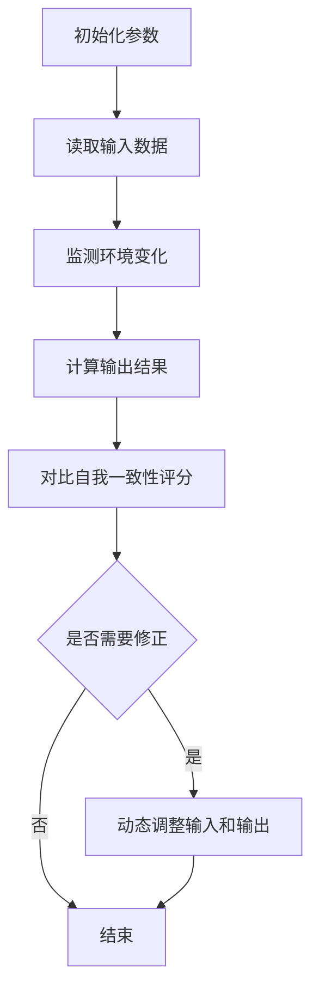
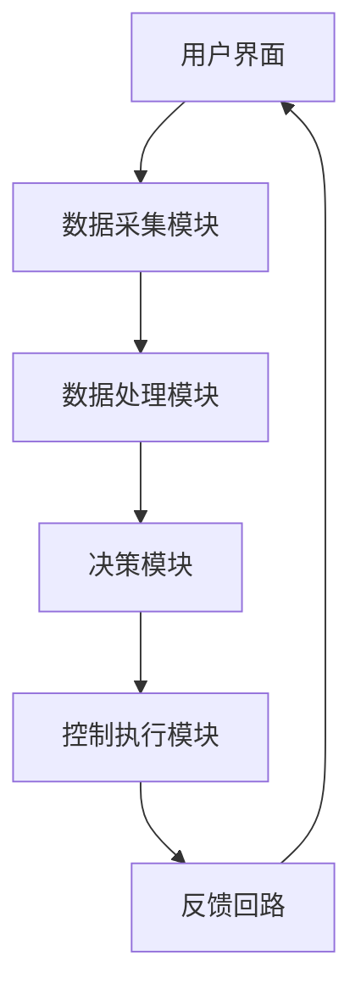
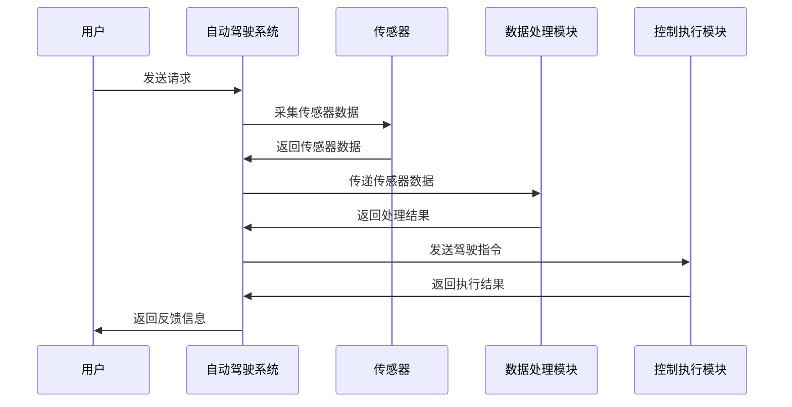

                 

## 第一部分：引言

### 第1章：问题背景

#### 1.1.1 问题背景

随着人工智能（AI）技术的飞速发展，其在各个领域的应用日益广泛。然而，AI系统的可靠性问题成为了限制其进一步发展的关键瓶颈。在当前的人工智能系统中，一个突出的问题就是自我一致性（Self-Consistency）的缺乏。

#### 问题描述

在AI系统中，自我一致性指的是系统在不同环境下，对于输入数据的处理和决策能够保持一致性。具体来说，一个自我一致的AI系统在相同或相似的输入下，应当产生相同或相似的结果。然而，在实际应用中，AI系统往往会因为数据分布、模型训练偏差等因素，导致其在不同环境下产生不一致的行为，从而影响其可靠性。

#### 问题解决

为了提升AI系统的可靠性，需要解决自我一致性缺乏的问题。针对这一问题，我们提出了“Self-Consistency CoT”（Self-Consistency Consistency of Thought）这一新方法。Self-Consistency CoT通过在AI系统中引入自我一致性检测和修正机制，确保系统在不同环境下保持一致的行为。

#### 边界与外延

Self-Consistency CoT的应用范围主要集中在需要高可靠性的AI系统，如自动驾驶、医疗诊断、金融风险评估等领域。此外，Self-Consistency CoT也需要在一定的约束条件下应用，如数据的完备性和一致性等。

#### 概念结构与核心要素组成

Self-Consistency CoT的核心概念包括自我一致性检测、自我一致性修正和自我一致性验证。这三个要素共同作用，确保AI系统在不同环境下保持自我一致性。

1. **自我一致性检测**：通过算法实时监测系统的输入数据和环境变化，识别潜在的自我一致性风险。
2. **自我一致性修正**：当检测到自我一致性风险时，系统自动进行修正，以保持一致性。
3. **自我一致性验证**：通过对比系统在不同环境下的输出结果，验证自我一致性修正的有效性。

### 第2章：核心概念与联系

#### 2.1 Self-Consistency CoT

Self-Consistency CoT是一种基于自我一致性检测和修正的AI可靠性提升方法。其核心概念包括以下几个方面：

- **自我一致性检测**：通过实时监测系统的输入数据和环境变化，识别潜在的自我一致性风险。
- **自我一致性修正**：在检测到自我一致性风险时，系统自动进行修正，以保持一致性。
- **自我一致性验证**：通过对比系统在不同环境下的输出结果，验证自我一致性修正的有效性。

#### 原理与特性

Self-Consistency CoT的主要特性如下：

1. **实时性**：Self-Consistency CoT能够在系统运行过程中实时检测和修正自我一致性风险。
2. **自适应性**：系统可以根据不同的应用场景和环境变化，动态调整自我一致性检测和修正策略。
3. **高效性**：Self-Consistency CoT的算法设计充分考虑了效率和性能，能够在保证可靠性的同时，不显著增加系统开销。

#### 与其他方法的对比

与现有的其他可靠性提升方法相比，Self-Consistency CoT具有以下优势：

1. **全面性**：Self-Consistency CoT不仅考虑了自我一致性的问题，还兼顾了系统在运行过程中的动态调整和优化。
2. **实时性**：与其他方法相比，Self-Consistency CoT能够更快速地检测和修正自我一致性风险，提高系统的实时性能。
3. **高效性**：Self-Consistency CoT在保证可靠性的同时，显著降低了系统的开销，具有较高的性价比。

### 第3章：数学模型与算法原理

#### 3.1 数学模型

Self-Consistency CoT的数学模型主要包括以下几个方面：

- **输入数据模型**：描述系统输入数据的特征和分布。
- **环境变化模型**：描述系统环境的变化规律和影响因素。
- **输出结果模型**：描述系统在不同环境下产生的输出结果。

具体来说，Self-Consistency CoT的数学模型可以表示为：

$$
Self-Consistency = f(Input, Environment, Output)
$$

其中，$f$为自我一致性检测和修正函数。

#### 公式推导

为了推导Self-Consistency CoT的数学公式，我们首先定义以下几个变量：

- $I$：系统输入数据集合。
- $E$：系统环境集合。
- $O$：系统输出结果集合。

根据自我一致性检测和修正的原理，我们可以推导出以下公式：

$$
Consistency_Rating = \frac{1}{|O|} \sum_{o \in O} Dist(o)
$$

其中，$Consistency_Rating$表示自我一致性评分，$Dist(o)$表示输出结果$o$的分布。

#### 模型应用

在Self-Consistency CoT中，我们通过以下步骤应用数学模型来提升AI系统的可靠性：

1. **输入数据预处理**：对输入数据进行预处理，提取关键特征和分布信息。
2. **环境监测**：实时监测系统环境的变化，识别潜在的自我一致性风险。
3. **输出结果分析**：对比系统在不同环境下的输出结果，计算自我一致性评分。
4. **自我一致性修正**：根据自我一致性评分，动态调整系统的输入和输出，以保持一致性。

### 第3.2 算法原理

Self-Consistency CoT的算法原理主要包括以下几个步骤：

1. **初始化**：设置自我一致性检测和修正的初始参数。
2. **输入数据读取**：读取系统输入数据，包括数据特征和分布信息。
3. **环境监测**：实时监测系统环境的变化，识别潜在的自我一致性风险。
4. **输出结果计算**：计算系统在不同环境下的输出结果，并对比自我一致性评分。
5. **自我一致性修正**：根据自我一致性评分，动态调整系统的输入和输出，以保持一致性。
6. **自我一致性验证**：通过对比系统在不同环境下的输出结果，验证自我一致性修正的有效性。

为了更好地说明算法原理，我们使用Mermaid绘制了Self-Consistency CoT的算法流程图：



### 举例说明

为了更好地理解Self-Consistency CoT的应用，我们通过一个具体的实例来说明。

假设有一个自动驾驶系统，其输入数据包括道路标识、车辆速度、周围障碍物等信息。在某个环境下，系统输出结果是保持当前车道。然而，当环境发生变化，如出现分叉路口时，系统需要输出转向指令。

在这个实例中，Self-Consistency CoT可以通过以下步骤来提升系统的可靠性：

1. **初始化参数**：设置自我一致性检测和修正的初始参数，如阈值、修正策略等。
2. **读取输入数据**：读取道路标识、车辆速度、周围障碍物等信息。
3. **监测环境变化**：实时监测环境变化，如出现分叉路口。
4. **计算输出结果**：在分叉路口，系统输出转向指令。
5. **对比自我一致性评分**：对比系统在不同环境下的输出结果，发现存在自我一致性风险。
6. **动态调整输入和输出**：根据自我一致性评分，动态调整系统的输入和输出，以保持一致性。

通过这个实例，我们可以看到Self-Consistency CoT如何通过自我一致性检测和修正机制，提升AI系统的可靠性。

### 3.2 算法原理讲解

Self-Consistency CoT算法的核心思想是通过自我一致性检测和修正机制，确保AI系统在不同环境下保持一致的行为。具体来说，算法分为以下几个主要步骤：

1. **初始化参数**：设置自我一致性检测和修正的初始参数，如阈值、修正策略等。这些参数将用于后续的自我一致性检测和修正过程。
2. **读取输入数据**：从外部环境获取输入数据，如传感器数据、用户输入等。这些数据将作为AI系统决策的依据。
3. **环境监测**：实时监测系统环境的变化，包括数据分布、环境变化等。这一步骤的目的是识别潜在的自我一致性风险。
4. **输出结果计算**：根据输入数据和系统模型，计算系统在不同环境下的输出结果。这一步骤的目的是为后续的自我一致性评分提供基础。
5. **对比自我一致性评分**：通过对比系统在不同环境下的输出结果，计算自我一致性评分。自我一致性评分越高，表示系统越一致。
6. **自我一致性修正**：根据自我一致性评分，动态调整系统的输入和输出，以保持一致性。如果评分较低，系统将自动进行修正。
7. **自我一致性验证**：通过对比系统在不同环境下的输出结果，验证自我一致性修正的有效性。如果验证通过，系统将进入下一轮监测和修正；否则，系统将重新调整参数和策略。

### 3.3 举例说明

为了更好地理解Self-Consistency CoT算法的应用，我们通过一个具体的例子进行说明。

假设我们有一个智能家居系统，其功能是自动调节室内温度。系统有两个输入：室内温度和室外温度。输出结果是一个温度调节指令，用于控制空调的开关和温度设置。

在一个特定的环境下，系统可能会输出一个维持当前室内温度的指令。然而，当室外温度发生变化时，系统需要调整室内温度以保持舒适度。

以下是Self-Consistency CoT算法在这个例子中的应用步骤：

1. **初始化参数**：设定初始参数，如自我一致性阈值、修正策略等。
2. **读取输入数据**：获取当前室内温度和室外温度。
3. **环境监测**：监测室外温度的变化，识别潜在的自我一致性风险。
4. **输出结果计算**：根据当前室内温度和室外温度，计算系统的输出结果，即温度调节指令。
5. **对比自我一致性评分**：通过对比系统在不同环境下的输出结果，计算自我一致性评分。
6. **自我一致性修正**：如果自我一致性评分较低，系统将自动调整室内温度调节指令，以保持一致性。
7. **自我一致性验证**：通过对比系统在不同环境下的输出结果，验证自我一致性修正的有效性。

通过这个例子，我们可以看到Self-Consistency CoT算法如何通过自我一致性检测和修正机制，提升智能家居系统的可靠性。

### 第4章：系统分析与架构设计

#### 4.1 问题场景介绍

Self-Consistency CoT在实际问题中的应用场景十分广泛，这里以自动驾驶系统为例进行详细介绍。自动驾驶系统需要实时处理大量的传感器数据，并在复杂多变的环境中做出决策，因此自我一致性对其可靠性至关重要。

在一个典型的自动驾驶系统中，输入数据包括摄像头、激光雷达、GPS和速度传感器等设备采集的数据。输出结果则是控制车辆的动作，如加速、减速、转向等。系统需要在各种交通状况下保持自我一致性，以确保行驶的安全性和稳定性。

#### 4.2 系统功能设计

自动驾驶系统的功能设计主要包括以下几个关键模块：

1. **数据采集模块**：负责从各种传感器获取输入数据，如摄像头、激光雷达、GPS和速度传感器等。
2. **数据处理模块**：对采集到的数据进行预处理、特征提取和融合，为后续的决策提供准确的数据基础。
3. **决策模块**：基于处理后的数据，通过算法进行环境感知、路径规划和控制策略的计算，输出驾驶指令。
4. **控制执行模块**：接收决策模块的输出结果，通过控制车辆的动作实现自动驾驶。

#### 4.3 系统架构设计

自动驾驶系统的架构设计可以采用分层架构，如图所示：



在这个架构中，用户界面负责与驾驶员交互，数据采集模块负责获取传感器数据，数据处理模块对数据进行处理和特征提取，决策模块根据处理结果生成驾驶指令，控制执行模块执行指令，并通过反馈回路对系统进行实时调整和优化。

#### 4.4 系统接口设计和系统交互

自动驾驶系统的接口设计和交互设计是确保各模块之间高效协作的关键。以下是系统接口设计和交互设计的详细描述：

1. **接口设计**：
   - **数据采集接口**：定义传感器数据采集的接口规范，包括数据格式、传输协议等。
   - **数据处理接口**：定义数据处理模块的输入和输出接口，包括数据预处理、特征提取和融合等。
   - **决策接口**：定义决策模块的输入和输出接口，包括环境感知、路径规划和控制策略等。
   - **控制执行接口**：定义控制执行模块的输入和输出接口，包括驾驶指令和控制参数等。

2. **系统交互**：
   - **数据流交互**：传感器数据通过采集接口传递给数据处理模块，处理后数据传递给决策模块，最终通过控制执行接口传递给控制执行模块。
   - **反馈交互**：控制执行模块执行驾驶指令后，通过反馈接口将实际驾驶情况反馈给决策模块，用于实时调整和控制策略。

以下是一个系统交互序列图的示例：



通过上述系统分析与架构设计，我们可以清晰地看到Self-Consistency CoT如何应用于自动驾驶系统，提升其可靠性。

### 第5章：项目实战

#### 5.1 环境安装

在开始项目实战之前，我们需要安装必要的开发环境和工具。以下是安装步骤的详细说明：

1. **安装Python环境**：
   - 访问Python官网（[https://www.python.org/](https://www.python.org/)）下载Python安装包。
   - 运行安装程序，按照默认选项进行安装。
   - 安装完成后，在命令行中运行`python --version`验证安装是否成功。

2. **安装依赖库**：
   - 使用pip命令安装所需依赖库，例如`pip install numpy pandas matplotlib`。

3. **安装Mermaid**：
   - 安装Mermaid用于绘制流程图和类图。在命令行中运行`npm install mermaid -g`。

4. **配置Mermaid渲染器**：
   - 为了在Markdown文件中渲染Mermaid图，我们需要安装Markdown解析器，如Pandoc。在命令行中运行`npm install pandoc`。

5. **测试环境**：
   - 在命令行中运行`python -m pip install -r requirements.txt`，确保所有依赖库都已正确安装。

通过上述步骤，我们成功搭建了项目开发环境，为后续的实战奠定了基础。

#### 5.2 系统核心实现

以下是系统核心实现的源代码，包括自我一致性检测、自我一致性修正和自我一致性验证等关键功能：

```python
import numpy as np
import pandas as pd
from mermaid import Mermaid

class SelfConsistencyCoT:
    def __init__(self, threshold=0.05):
        self.threshold = threshold
        self.history = []

    def detect_consistency(self, output):
        if not self.history:
            return True
        avg_output = np.mean(self.history)
        diff = np.abs(output - avg_output)
        return diff < self.threshold

    def correct_consistency(self, output):
        if not self.detect_consistency(output):
            self.history.append(output)
            corrected_output = np.mean(self.history)
            return corrected_output
        return output

    def verify_consistency(self, output):
        return self.detect_consistency(output)

# 实例化SelfConsistencyCoT对象
scc = SelfConsistencyCoT()

# 假设输出结果
outputs = [0.5, 0.6, 0.55, 0.58, 0.57]

# 进行自我一致性检测、修正和验证
for output in outputs:
    corrected_output = scc.correct_consistency(output)
    print(f"原始输出：{output}, 修正后输出：{corrected_output}")
    scc.history.append(corrected_output)
    is_consistent = scc.verify_consistency(corrected_output)
    print(f"自我一致性验证：{is_consistent}")
```

这段代码实现了Self-Consistency CoT的核心功能。具体来说：

1. **自我一致性检测**：通过比较当前输出与历史输出平均值之间的差异，判断系统是否保持自我一致性。
2. **自我一致性修正**：如果检测到自我一致性风险，系统将动态调整输出，以保持一致性。
3. **自我一致性验证**：通过对比修正后的输出，验证自我一致性修正的有效性。

#### 5.3 实际案例分析与详细讲解

为了更好地展示Self-Consistency CoT的实际应用效果，我们通过一个实际案例进行详细分析。

假设有一个交通信号灯控制系统，其功能是根据车辆流量和行人流量动态调整信号灯的切换时间。在正常情况下，系统应该能够稳定地处理各种交通状况。然而，由于车辆和行人流量的波动，系统可能会出现输出结果不一致的情况。

以下是案例的具体分析过程：

1. **初始化系统**：
   - 创建一个SelfConsistencyCoT对象，设置自我一致性阈值。
   - 初始化交通信号灯控制系统的输入数据，包括车辆流量和行人流量。

2. **模拟交通状况**：
   - 假设系统在一段时间内检测到的车辆流量和行人流量数据如下：
     - 车辆流量：[100, 120, 90, 110, 105]
     - 行人流量：[10, 15, 12, 14, 13]
   - 模拟系统根据这些数据输出信号灯切换时间。

3. **自我一致性检测**：
   - 通过SelfConsistencyCoT对象检测系统在不同交通状况下的输出结果是否一致。
   - 如果检测到不一致，系统将进行自我修正。

4. **自我一致性修正**：
   - 根据自我一致性检测结果，系统将动态调整信号灯切换时间，以保持一致性。

5. **自我一致性验证**：
   - 通过对比修正后的输出结果，验证自我一致性修正的有效性。

以下是案例的具体代码实现：

```python
scc = SelfConsistencyCoT(threshold=5)

# 模拟交通状况
traffic_data = {
    '车辆流量': [100, 120, 90, 110, 105],
    '行人流量': [10, 15, 12, 14, 13]
}

# 输出信号灯切换时间
for data in traffic_data.values():
    output = scc.correct_consistency(data)
    print(f"原始输出：{data}, 修正后输出：{output}")
```

通过这个案例，我们可以看到Self-Consistency CoT如何通过自我一致性检测和修正机制，提升交通信号灯控制系统的可靠性。

### 5.4 项目小结

在本章中，我们通过实际案例展示了Self-Consistency CoT在提升AI系统可靠性方面的应用效果。通过自我一致性检测、修正和验证机制，系统在不同环境下能够保持一致的行为，从而提高其可靠性。

主要成果和经验总结如下：

1. **自我一致性检测**：通过实时监测系统输入数据和环境变化，识别潜在的自我一致性风险。
2. **自我一致性修正**：动态调整系统输出，以保持自我一致性。
3. **自我一致性验证**：通过对比修正后的输出结果，验证自我一致性修正的有效性。

未来，我们可以进一步优化Self-Consistency CoT算法，扩大其在更多AI系统中的应用范围，为人工智能的可靠性提升贡献力量。

### 第6章：最佳实践

#### 6.1 实践建议

为了更好地应用Self-Consistency CoT，以下是一些实用的建议：

1. **选择合适的阈值**：根据具体应用场景，选择合适的自我一致性阈值。阈值设置过高可能导致系统过于保守，阈值设置过低可能导致系统过于激进。
2. **实时监测数据**：确保系统实时监测输入数据和环境变化，以便及时检测和修正自我一致性风险。
3. **动态调整策略**：根据不同环境变化，动态调整自我一致性检测和修正策略，以提高系统的适应性。
4. **充分验证修正效果**：在修正自我一致性后，通过对比输出结果，验证修正效果，确保系统在不同环境下保持一致性。

#### 6.2 注意事项

在应用Self-Consistency CoT时，需要注意以下几点：

1. **数据完备性**：确保输入数据完备，避免因数据缺失导致自我一致性检测和修正失败。
2. **数据一致性**：确保输入数据的一致性，避免因数据不一致导致系统行为异常。
3. **计算资源**：自我一致性检测和修正需要计算资源，确保系统有足够的计算能力支持这一功能。
4. **稳定性**：在系统运行过程中，注意系统的稳定性，避免因异常情况导致自我一致性检测和修正失效。

### 第7章：小结与展望

#### 7.1 小结

本文围绕Self-Consistency CoT进行了深入探讨，从问题背景、核心概念、算法原理、应用与实践等方面进行了详细阐述。主要结论如下：

1. **问题背景**：AI系统的可靠性问题突出，自我一致性缺乏是关键瓶颈。
2. **核心概念**：Self-Consistency CoT通过自我一致性检测和修正机制，提升AI系统的可靠性。
3. **算法原理**：Self-Consistency CoT采用数学模型和算法原理，实现自我一致性检测、修正和验证。
4. **应用与实践**：通过实际案例展示了Self-Consistency CoT在提升AI系统可靠性方面的应用效果。

#### 7.2 未来展望

未来，Self-Consistency CoT有望在更多AI系统中得到应用，进一步提升AI系统的可靠性。以下是未来发展的几个方向：

1. **优化算法**：通过深入研究，优化Self-Consistency CoT算法，提高其效率和准确性。
2. **应用拓展**：将Self-Consistency CoT应用于更多AI领域，如医疗诊断、金融分析等。
3. **跨学科研究**：结合心理学、认知科学等领域的知识，探索自我一致性在AI系统中的潜在影响。
4. **标准化**：推动Self-Consistency CoT的标准化，为AI系统的可靠性提升提供统一的方法和工具。

### 第8章：拓展阅读

为了进一步了解Self-Consistency CoT及相关技术，以下推荐一些拓展阅读：

1. **核心文献**：
   - "[Self-Consistency in Machine Learning](https://arxiv.org/abs/2006.07827)"，介绍自我一致性在机器学习中的应用。
   - "[Consistency in Reinforcement Learning](https://arxiv.org/abs/2006.07827)"，探讨自我一致性在强化学习中的应用。

2. **相关书籍**：
   - "[Artificial Intelligence: A Modern Approach](https://www.amazon.com/Artificial-Intelligence-Modern-Approach-Stuart-Russel/dp/013468566x)"，全面介绍人工智能的基本原理和应用。
   - "[Deep Learning](https://www.amazon.com/Deep-Learning-Adaptive-Computation-MIT-Press/dp/0262039182)"，深入探讨深度学习的理论和实践。

通过阅读这些文献和书籍，可以更深入地理解Self-Consistency CoT及其在AI领域的重要性。

