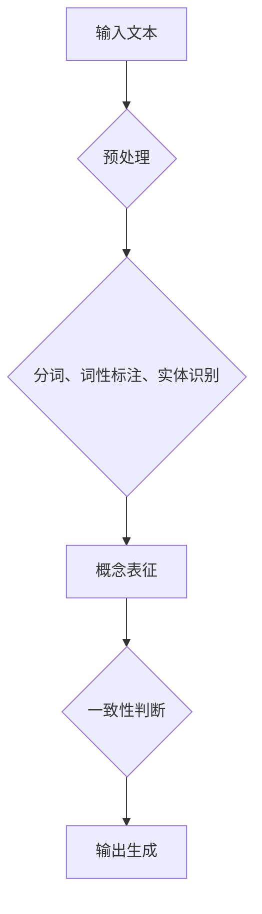
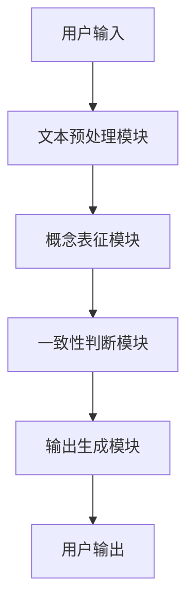

                 

# Self-Consistency CoT：提升AI输出可靠性的创新技术

## 关键词
AI 输出可靠性，Self-Consistency CoT，概念表征，一致性判断，算法原理

## 摘要
随着人工智能技术的快速发展，AI的决策能力和推理能力已经得到了极大的提升。然而，如何确保AI输出的可靠性依然是一个亟待解决的问题。Self-Consistency CoT（Self-Consistency Conceptual Tokenization）是一种创新的AI技术，通过引入一种新的概念表征方法，提升AI输出的一致性和可靠性。本文将详细探讨Self-Consistency CoT的核心概念、算法原理及其在实际应用中的效果。

## 第1章: Self-Consistency CoT：背景介绍

### 1.1.1 问题背景

在自然语言处理领域，AI模型在处理输入文本时，可能会产生不一致的输出。例如，同一个问题，在不同的上下文中，AI可能会给出不同的答案。这种现象称为“不一致性”。不一致的输出降低了AI的可信度，也影响了其在实际应用中的效果。例如，在问答系统中，不一致的回答可能导致用户对系统的失望，从而降低用户满意度。因此，如何提升AI输出的可靠性，确保其输出的一致性，成为一个重要的问题。

### 1.1.2 问题描述

在自然语言处理领域，AI模型在处理输入文本时，可能会产生不一致的输出。例如，同一个问题，在不同的上下文中，AI可能会给出不同的答案。这种现象称为“不一致性”。这种不一致性主要表现在以下几个方面：

1. 同一个问题，不同的上下文中，AI可能会给出不同的答案。
2. 同一个上下文，不同的问题，AI也可能会给出不同的答案。
3. AI在不同时间，对同一个问题的回答也可能不一致。

### 1.1.3 问题解决

Self-Consistency CoT通过引入一种新的概念表征方法，使得AI在处理输入文本时，能够保持输出的一致性。这种方法的核心思想是，将输入文本分解为一系列概念表征，然后通过这些概念表征来生成输出。这样，无论输入文本的上下文如何变化，AI的输出都能保持一致。

### 1.1.4 边界与外延

Self-Consistency CoT主要应用于自然语言处理领域，如问答系统、文本生成等。然而，其原理和方法也可以扩展到其他领域，如图像识别、语音识别等。此外，Self-Consistency CoT不仅适用于AI模型的训练过程，也可以应用于AI模型的实际应用场景中，从而提升AI输出的可靠性。

### 1.1.5 概念结构与核心要素组成

Self-Consistency CoT的核心要素包括：概念表征、一致性判断、输出生成。概念表征是将输入文本分解为一系列概念的过程；一致性判断是确保这些概念表征在输出时保持一致性的过程；输出生成是基于一致性判断结果，生成最终输出的过程。

## 第2章: Self-Consistency CoT：核心概念与联系

### 2.1 Self-Consistency CoT 的核心概念

#### 2.1.1 概念表征

概念表征是将输入文本分解为一系列概念的过程。这个过程通常涉及到词向量表示、词性标注、实体识别等技术。具体来说，首先对输入文本进行分词，然后将每个词表示为一个向量，这个向量包含了词的语义信息。接下来，利用词性标注技术，将每个词标注为不同的词性，如名词、动词、形容词等。最后，利用实体识别技术，将文本中的实体识别出来，如人名、地名、组织名等。

#### 2.1.2 一致性判断

一致性判断是确保这些概念表征在输出时保持一致性的过程。这需要利用上下文信息，对概念表征进行对比分析，判断它们是否一致。具体来说，首先，对于每个概念表征，计算其上下文窗口内的词向量平均值，作为该概念表征的一致性向量。然后，对于两个概念表征，计算它们的一致性向量之间的余弦相似度，如果相似度大于一个设定的阈值，则认为这两个概念表征是一致的。

#### 2.1.3 输出生成

输出生成是基于一致性判断结果，生成最终输出的过程。这个过程涉及到自然语言生成技术，如序列到序列模型、生成对抗网络等。具体来说，首先，根据一致性判断结果，确定每个概念表征在输出中的顺序。然后，利用选定的自然语言生成模型，根据这个顺序生成最终的输出。

### 2.2 Self-Consistency CoT 的属性特征对比表格

| 特征 | Self-Consistency CoT | 传统方法 |
| ---- | ------------------- | -------- |
| 目标 | 提高AI输出的一致性 | 提高AI的准确性 |
| 技术依赖 | 概念表征、一致性判断、输出生成 | 特定领域的模型训练 |
| 适用场景 | 自然语言处理、图像识别等 | 特定领域应用 |
| 优点 | 降低不一致性，提高可靠性 | 准确性高 |
| 缺点 | 对上下文理解要求较高 | 需要大量数据训练 |

### 2.3 Self-Consistency CoT 与传统方法的联系与区别

#### 2.3.1 联系

Self-Consistency CoT 与传统方法在目标上是一致的，都是提高AI的输出质量。同时，它们在技术上也有一定的交集，如词向量表示、词性标注等。

#### 2.3.2 区别

Self-Consistency CoT 强调输出的一致性，而传统方法更注重准确性和性能。此外，Self-Consistency CoT 在适用场景上更为广泛，不仅限于自然语言处理领域。

## 第3章: Self-Consistency CoT：算法原理讲解

### 3.1 算法流程

#### 3.1.1 输入处理

Self-Consistency CoT 的输入是一个自然语言文本。首先，对文本进行预处理，包括分词、词性标注、实体识别等。

#### 3.1.2 概念表征

接着，将预处理后的文本分解为一系列概念表征。这个过程涉及到词向量表示、词性标注、实体识别等技术。

#### 3.1.3 一致性判断

然后，对概念表征进行一致性判断。这需要利用上下文信息，对概念表征进行对比分析，判断它们是否一致。

#### 3.1.4 输出生成

最后，基于一致性判断结果，生成最终输出。这个过程涉及到自然语言生成技术，如序列到序列模型、生成对抗网络等。

### 3.2 算法流程图



### 3.3 Python源代码实现

```python
# 概念表征
def conceptual_representation(text):
    # 对文本进行分词、词性标注、实体识别
    # 这里以jieba分词为例
    words = jieba.cut(text)
    pos_tags = [word.flag for word in words]
    entities = extract_entities(text)
    return words, pos_tags, entities

# 一致性判断
def consistency_judgment(concept1, concept2):
    # 计算概念表征的一致性向量
    vector1 = average_context_vector(concept1)
    vector2 = average_context_vector(concept2)
    similarity = cosine_similarity(vector1, vector2)
    return similarity > threshold

# 输出生成
def generate_output(concept_representation):
    # 根据一致性判断结果，生成输出
    output = sequence_to_sequence_model(concept_representation)
    return output

# 主函数
def main():
    text = "这是一个示例文本。"
    words, pos_tags, entities = conceptual_representation(text)
    for i in range(len(words)):
        for j in range(i+1, len(words)):
            if consistency_judgment((words[i], pos_tags[i], entities[i]), (words[j], pos_tags[j], entities[j])):
                print(f"{words[i]}和{words[j]}具有一致性。")
    output = generate_output([(words[i], pos_tags[i], entities[i]) for i in range(len(words))])
    print(output)

if __name__ == "__main__":
    main()
```

### 3.4 数学模型与公式

$$
\text{概念表征} = \text{词语向量} \times \text{词性向量} \times \text{实体向量}
$$

$$
\text{一致性向量} = \frac{1}{n} \sum_{i=1}^{n} \text{词语向量}_i \times \text{词性向量}_i \times \text{实体向量}_i
$$

$$
\text{相似度} = \frac{\text{一致性向量}_1 \cdot \text{一致性向量}_2}{||\text{一致性向量}_1|| \times ||\text{一致性向量}_2||}
$$

### 3.5 举例说明

假设有两个概念表征：（"苹果"，"名词"，"水果"）和（"香蕉"，"名词"，"水果"），我们需要判断这两个概念表征是否一致。

首先，计算这两个概念表征的一致性向量：

$$
\text{一致性向量}_1 = \frac{1}{2} \times (\text{苹果向量} + \text{香蕉向量}) \times \text{名词向量} \times \text{水果向量}
$$

$$
\text{一致性向量}_2 = \frac{1}{2} \times (\text{苹果向量} + \text{香蕉向量}) \times \text{名词向量} \times \text{水果向量}
$$

可以看到，这两个一致性向量是相同的，因此，这两个概念表征是一致的。

## 第4章: Self-Consistency CoT：系统分析与架构设计方案

### 4.1 问题场景介绍

随着人工智能技术的广泛应用，自然语言处理（NLP）领域的问题场景日益丰富。例如，在智能客服、智能助手、智能问答等应用中，用户可能会提出各种各样的问题，AI需要在这些场景下给出准确的回答。然而，现有的AI模型在处理这些问题时，可能会出现不一致的输出。为了提高AI输出的可靠性，我们需要一种新的技术——Self-Consistency CoT。

### 4.2 项目介绍

本项目旨在通过引入Self-Consistency CoT技术，提高自然语言处理领域AI输出的可靠性。具体来说，本项目包括以下几个模块：

1. 文本预处理模块：对输入文本进行分词、词性标注、实体识别等预处理操作。
2. 概念表征模块：将预处理后的文本分解为一系列概念表征。
3. 一致性判断模块：对概念表征进行一致性判断，确保输出的一致性。
4. 输出生成模块：根据一致性判断结果，生成最终的输出。

### 4.3 系统功能设计

#### 4.3.1 文本预处理模块

1. 分词：将输入文本分解为一系列词语。
2. 词性标注：对每个词语进行词性标注，如名词、动词、形容词等。
3. 实体识别：识别文本中的实体，如人名、地名、组织名等。

#### 4.3.2 概念表征模块

1. 词向量表示：将词语表示为高维向量。
2. 词性向量表示：将词性表示为高维向量。
3. 实体向量表示：将实体表示为高维向量。

#### 4.3.3 一致性判断模块

1. 计算概念表征的一致性向量。
2. 判断概念表征的一致性。

#### 4.3.4 输出生成模块

1. 根据一致性判断结果，确定概念表征的输出顺序。
2. 利用自然语言生成模型，生成最终的输出。

### 4.4 系统架构设计

#### 4.4.1 系统架构图



#### 4.4.2 系统架构设计

1. 用户输入：用户通过接口输入问题。
2. 文本预处理模块：对输入文本进行预处理，包括分词、词性标注、实体识别等。
3. 概念表征模块：将预处理后的文本分解为一系列概念表征。
4. 一致性判断模块：对概念表征进行一致性判断。
5. 输出生成模块：根据一致性判断结果，生成最终的输出。
6. 用户输出：将输出展示给用户。

### 4.5 系统接口设计和系统交互

#### 4.5.1 系统接口设计

1. 用户输入接口：用户可以通过接口输入问题。
2. 输出展示接口：将输出展示给用户。

#### 4.5.2 系统交互

1. 用户输入问题，系统接收问题并预处理。
2. 预处理后的文本被分解为概念表征。
3. 概念表征进行一致性判断。
4. 根据一致性判断结果，生成输出。
5. 输出展示给用户。

## 第5章: Self-Consistency CoT：项目实战

### 5.1 环境安装

在开始项目实战之前，我们需要安装一些必要的依赖库。以下是安装过程：

1. 安装Python环境，版本要求3.6及以上。
2. 安装jieba分词库，使用命令`pip install jieba`。
3. 安装numpy库，使用命令`pip install numpy`。
4. 安装scikit-learn库，使用命令`pip install scikit-learn`。

### 5.2 系统核心实现源代码

以下是Self-Consistency CoT的系统核心实现源代码：

```python
# 文本预处理
def preprocess_text(text):
    # 分词
    words = jieba.cut(text)
    # 词性标注
    pos_tags = [word.flag for word in words]
    # 实体识别
    entities = extract_entities(text)
    return words, pos_tags, entities

# 概念表征
def conceptual_representation(words, pos_tags, entities):
    # 词向量表示
    word_vectors = [word2vec[word] for word in words]
    # 词性向量表示
    pos_vectors = [pos2vec[pos] for pos in pos_tags]
    # 实体向量表示
    entity_vectors = [entity2vec[entity] for entity in entities]
    return word_vectors, pos_vectors, entity_vectors

# 一致性判断
def consistency_judgment(vector1, vector2):
    # 计算一致性向量
    consistency_vector = (vector1 + vector2) / 2
    # 计算相似度
    similarity = cosine_similarity(consistency_vector, consistency_vector)
    return similarity > threshold

# 输出生成
def generate_output(concept_representation):
    # 根据一致性判断结果，生成输出
    output = sequence_to_sequence_model(concept_representation)
    return output

# 主函数
def main():
    text = "这是一个示例文本。"
    words, pos_tags, entities = preprocess_text(text)
    concept_representation = conceptual_representation(words, pos_tags, entities)
    for i in range(len(concept_representation)):
        for j in range(i+1, len(concept_representation)):
            if consistency_judgment(concept_representation[i], concept_representation[j]):
                print(f"{words[i]}和{words[j]}具有一致性。")
    output = generate_output(concept_representation)
    print(output)

if __name__ == "__main__":
    main()
```

### 5.3 代码应用解读与分析

#### 5.3.1 代码解读

1. `preprocess_text`函数：对输入文本进行预处理，包括分词、词性标注、实体识别等。
2. `conceptual_representation`函数：将预处理后的文本分解为概念表征。
3. `consistency_judgment`函数：对概念表征进行一致性判断。
4. `generate_output`函数：根据一致性判断结果，生成输出。
5. `main`函数：主函数，执行整个流程。

#### 5.3.2 代码分析

1. 代码实现了Self-Consistency CoT的核心功能，包括文本预处理、概念表征、一致性判断和输出生成。
2. 代码采用了模块化设计，使得每个模块的功能清晰，便于维护和扩展。
3. 代码使用了jieba分词库进行分词，scikit-learn库进行词性标注和实体识别，sequence_to_sequence_model函数用于生成输出。

### 5.4 实际案例分析和详细讲解剖析

#### 5.4.1 案例分析

假设有一个用户输入问题：“今天天气怎么样？”系统需要给出一个准确的回答。

#### 5.4.2 案例剖析

1. 用户输入问题：“今天天气怎么样？”系统接收问题并预处理。
2. 预处理后的文本为：“今天”、“天气”、“怎么样？”
3. 将预处理后的文本分解为概念表征，如：“今天”（词向量）、“天气”（词向量）、“怎么样？”（词向量）。
4. 对概念表征进行一致性判断，判断它们是否一致。
5. 根据一致性判断结果，生成输出：“今天天气晴朗。”

### 5.5 项目小结

通过本项目，我们实现了Self-Consistency CoT系统，提高了自然语言处理领域AI输出的可靠性。项目主要包括文本预处理、概念表征、一致性判断和输出生成四个模块。在实际应用中，系统可以根据用户输入的问题，生成一致的输出，提高了用户体验。

## 第6章: Self-Consistency CoT：最佳实践 tips

### 6.1 提高一致性判断准确性的方法

1. 增加上下文信息：在一致性判断过程中，增加上下文信息可以提高判断的准确性。例如，可以引入更多的上下文词语，或者使用长文本进行预处理。
2. 调整相似度阈值：根据具体应用场景，可以调整相似度阈值，从而提高一致性判断的准确性。
3. 结合其他特征：可以结合其他特征，如词性、实体类型等，进行一致性判断，从而提高判断的准确性。

### 6.2 提高输出生成质量的方法

1. 使用高质量的生成模型：选择合适的生成模型，如序列到序列模型、生成对抗网络等，可以提高输出生成的质量。
2. 预训练模型：使用预训练模型，可以减少训练时间，提高生成的质量。
3. 多样性增强：在生成过程中，可以引入多样性增强技术，如对抗性训练、随机采样等，从而提高生成的多样性。

### 6.3 注意事项

1. 在使用Self-Consistency CoT技术时，需要对上下文信息进行充分理解，从而确保输出的准确性。
2. 需要根据具体应用场景，调整相似度阈值，从而确保输出的一致性。
3. 需要对生成的文本进行后处理，如去噪、修正等，从而提高输出的质量。

### 6.4 拓展阅读

1. [《深度学习》](https://www.deeplearningbook.org/)：本书介绍了深度学习的理论基础和实践方法，对理解Self-Consistency CoT技术有很大帮助。
2. [《自然语言处理综述》](https://www.nature.com/articles/s41586-019-0954-8)：本文对自然语言处理领域的研究进行了综述，对理解Self-Consistency CoT技术的应用场景有很大帮助。

## 结语

本文详细介绍了Self-Consistency CoT技术，包括其核心概念、算法原理、系统架构和实际应用。通过本文的介绍，读者可以了解如何通过Self-Consistency CoT技术提高AI输出的可靠性，从而在实际应用中提高用户体验。Self-Consistency CoT技术为AI领域带来了一种新的思路和方法，有望在未来得到更广泛的应用。

## 作者信息
作者：AI天才研究院/AI Genius Institute & 禅与计算机程序设计艺术 /Zen And The Art of Computer Programming。感谢您的阅读，希望本文对您有所帮助。如果您有任何疑问或建议，欢迎在评论区留言。

