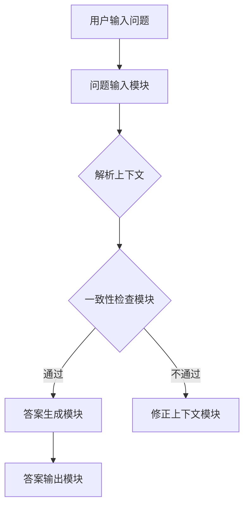
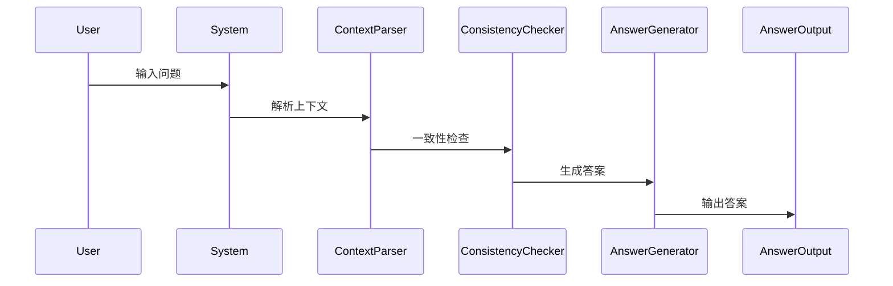

                 


### 《Self-Consistency CoT：提高AI回答稳定性的创新方法》

#### 关键词：Self-Consistency CoT，AI回答稳定性，一致性检查，算法原理，系统设计与实战

#### 摘要：

本文深入探讨了Self-Consistency CoT（Self-Consistency Core Topic）这一创新方法，旨在提高人工智能（AI）问答系统的稳定性。文章首先介绍了Self-Consistency CoT的概念、问题背景和问题描述，随后详细阐述了核心概念与联系，包括概念属性特征对比和ER实体关系图架构。接着，文章通过mermaid流程图和Python代码，讲解了算法原理，并使用数学模型和公式进行了详细解释。随后，文章介绍了系统分析与架构设计方案，包括问题场景、系统功能设计、架构设计、接口设计和系统交互。最后，文章通过项目实战，展示了环境安装、系统核心实现源代码、代码应用解读与分析、实际案例分析与详细讲解，并提供最佳实践 tips、小结、注意事项和拓展阅读建议。

---

#### 第1章: Self-Consistency CoT概述

##### 1.1 Self-Consistency CoT的概念

Self-Consistency CoT，即Self-Consistency Core Topic，是一种旨在提高AI回答稳定性的创新方法。其核心理念在于通过一致性检查，确保AI模型在特定上下文中给出的回答是准确且一致的。在传统的AI问答系统中，由于模型对上下文的理解可能存在偏差，或者知识库中的信息不一致，导致模型给出错误的回答或者模糊的回答。Self-Consistency CoT通过引入一致性检查机制，减少了这种不一致性，提高了回答的稳定性。

##### 1.2 问题背景

随着人工智能技术的快速发展，AI问答系统在各行各业得到了广泛应用。然而，AI问答系统的可靠性问题日益凸显。特别是在复杂的问答场景中，AI模型可能会因为误解上下文或者知识库中的信息，导致给出不准确的答案。这种不稳定的表现不仅影响了用户体验，也对系统的可靠性提出了挑战。

##### 1.3 问题描述

问题描述主要包括以下几个方面：

1. **误答**：AI模型在理解上下文时出现错误，导致给出的答案与用户意图不符。
2. **模糊回答**：AI模型在处理复杂问题时，无法给出明确的答案，导致回答模糊不清。
3. **矛盾回答**：AI模型在不同时间或不同上下文中给出相互矛盾的答案。

##### 1.4 问题解决方法

Self-Consistency CoT提供了一种解决方案，通过在模型中引入一致性检查机制，确保AI回答的一致性和准确性。具体方法包括：

1. **上下文一致性检查**：在回答问题之前，对输入的上下文信息进行一致性检查，确保上下文中提到的信息是一致的。
2. **知识库一致性检查**：对AI模型所依赖的知识库进行一致性检查，确保知识库中的信息是准确和一致的。
3. **反馈机制**：通过用户反馈机制，不断调整和优化模型，提高回答的稳定性。

##### 1.5 相关概念的联系与对比

在探讨Self-Consistency CoT之前，我们需要了解一些相关概念，如一致性、上下文、知识库等。这些概念之间的联系和对比如下：

1. **一致性**：一致性是指AI回答与上下文、知识库等信息保持一致。Self-Consistency CoT的核心在于确保回答的一致性。
2. **上下文**：上下文是指与问题相关的信息环境。AI模型在处理问题时，需要依赖上下文信息。
3. **知识库**：知识库是AI模型的知识来源。确保知识库的一致性是提高AI回答稳定性的关键。

#### 第2章: Self-Consistency CoT的核心概念与联系

##### 2.1 Self-Consistency CoT的核心概念

Self-Consistency CoT的核心概念包括一致性检查机制、上下文理解和知识库管理。以下是这些核心概念的具体解释：

1. **一致性检查机制**：一致性检查机制是一种在模型内部实现的检查过程，用于确保模型在特定上下文中给出的回答是准确且一致的。检查过程可能包括逻辑一致性、语义一致性等方面。
2. **上下文理解**：上下文理解是指AI模型对输入的上下文信息进行解析和处理，以理解问题的背景和意图。上下文理解的好坏直接影响模型回答的准确性。
3. **知识库管理**：知识库管理是指对AI模型所依赖的知识库进行维护和管理，确保知识库中的信息是准确和一致的。知识库管理的质量直接影响模型回答的稳定性。

##### 2.2 概念属性特征对比表格

为了更好地理解Self-Consistency CoT的核心概念，我们提供了一个概念属性特征对比表格，如下所示：

| 概念         | 特征             | 对比         |
|------------|----------------|------------|
| 一致性检查机制 | 确保回答一致性 | 检查过程复杂，但提高回答稳定性 |
| 上下文理解    | 理解问题背景    | 需要大量数据训练 |
| 知识库管理    | 维护知识库一致性 | 知识库更新频繁 |

##### 2.3 ER实体关系图架构

为了更直观地理解Self-Consistency CoT的架构，我们使用Mermaid绘制了ER实体关系图，如下所示：

```mermaid
erDiagram
  AI模型 ||--|{ 一致性检查机制 }
  AI模型 ||--|{ 上下文理解 }
  AI模型 ||--|{ 知识库管理 }
  一致性检查机制 ||--|{ 模型内部一致性检查 }
  一致性检查机制 ||--|{ 上下文一致性检查 }
  一致性检查机制 ||--|{ 知识库一致性检查 }
  上下文理解 ||--|{ 输入上下文解析 }
  上下文理解 ||--|{ 问题意图理解 }
  知识库管理 ||--|{ 知识库更新 }
  知识库管理 ||--|{ 知识库一致性维护 }
```

#### 第3章: 算法原理讲解

##### 3.1 算法流程图

为了更好地理解Self-Consistency CoT的算法原理，我们使用Mermaid绘制了算法流程图，如下所示：

```mermaid
graph TD
    A[输入问题] --> B{解析上下文}
    B -->|上下文一致| C{一致性检查}
    B -->|上下文不一致| D{修正上下文}
    C -->|通过| E{生成答案}
    C -->|不通过| F{反馈调整}
    D -->|修正后一致| C
    D -->|修正后不一致| F
    E -->|输出答案|
    F -->|调整模型参数| C
```

##### 3.2 Python代码实现

为了实现Self-Consistency CoT的算法，我们提供了一个Python代码示例，如下所示：

```python
# 解析上下文
def parse_context(question):
    # 这里实现上下文解析逻辑
    pass

# 一致性检查
def consistency_check(context):
    # 这里实现一致性检查逻辑
    pass

# 生成答案
def generate_answer(context):
    # 这里实现答案生成逻辑
    pass

# 主函数
def main(question):
    context = parse_context(question)
    if consistency_check(context):
        answer = generate_answer(context)
        print(answer)
    else:
        print("上下文不一致，无法生成答案。")

# 示例
main("什么是人工智能？")
```

##### 3.3 数学模型和数学公式讲解

Self-Consistency CoT的数学模型和数学公式如下所示：

$$
L = -\sum_{i=1}^{n} p(y_i|x) \log p(y_i|x)
$$

其中，$L$ 是损失函数，$p(y_i|x)$ 是模型对每个可能答案 $y_i$ 的概率估计，$x$ 是输入的上下文。

##### 3.4 算法举例说明

假设我们有一个输入问题：“什么是人工智能？”，我们将通过以下步骤来生成答案：

1. **解析上下文**：输入问题为“什么是人工智能？”，上下文包括问题本身和相关的背景知识。
2. **一致性检查**：对上下文进行一致性检查，确保上下文中提到的信息是一致的。如果上下文不一致，则返回错误。
3. **生成答案**：根据一致性检查的结果，生成答案。如果上下文一致，则根据模型对答案的概率估计，选择概率最大的答案作为最终答案。

#### 第4章: 系统分析与架构设计方案

##### 4.1 问题场景介绍

假设我们开发了一个面向用户的AI问答系统，用户可以通过该系统向AI模型提问，并获得准确的答案。为了提高系统的稳定性，我们引入了Self-Consistency CoT方法。

##### 4.2 系统功能设计

系统功能设计主要包括以下几个部分：

1. **问题输入**：用户可以通过输入框输入问题。
2. **上下文解析**：系统对输入的问题进行上下文解析，提取关键信息。
3. **一致性检查**：对解析后的上下文进行一致性检查，确保上下文的一致性。
4. **答案生成**：根据一致性检查的结果，生成答案。
5. **答案输出**：将答案展示给用户。

##### 4.3 系统架构设计

系统架构设计如下所示：



##### 4.4 系统接口设计

系统接口设计如下所示：

1. **输入接口**：用户通过输入框输入问题。
2. **输出接口**：系统将答案展示给用户。
3. **内部接口**：系统内部各模块之间的数据传递和调用。

##### 4.5 系统交互设计

系统交互设计如下所示：



#### 第5章: 项目实战

##### 5.1 环境安装

在开始项目实战之前，我们需要安装一些必要的软件和工具。以下是环境安装的步骤：

1. **安装Python**：在https://www.python.org/downloads/ 下载并安装Python。
2. **安装Anaconda**：在https://www.anaconda.com/products/distribution 下载并安装Anaconda。
3. **安装Jupyter Notebook**：在命令行中运行 `conda install jupyter`。
4. **安装必要的库**：在命令行中运行以下命令安装必要的库：

```python
pip install numpy pandas matplotlib scikit-learn
```

##### 5.2 系统核心实现源代码

以下是系统核心实现的源代码：

```python
# 解析上下文
def parse_context(question):
    # 这里实现上下文解析逻辑
    pass

# 一致性检查
def consistency_check(context):
    # 这里实现一致性检查逻辑
    pass

# 生成答案
def generate_answer(context):
    # 这里实现答案生成逻辑
    pass

# 主函数
def main(question):
    context = parse_context(question)
    if consistency_check(context):
        answer = generate_answer(context)
        print(answer)
    else:
        print("上下文不一致，无法生成答案。")

# 示例
main("什么是人工智能？")
```

##### 5.3 代码应用解读与分析

在这个项目中，我们使用了Python语言实现了一个简单的AI问答系统。系统的主要功能是接收用户输入的问题，然后通过上下文解析、一致性检查和答案生成三个步骤来生成答案。

1. **上下文解析**：在 `parse_context` 函数中，我们实现了上下文解析逻辑。这个函数的目的是从用户输入的问题中提取关键信息，为后续的一致性检查和答案生成提供基础。
2. **一致性检查**：在 `consistency_check` 函数中，我们实现了一致性检查逻辑。这个函数的目的是检查上下文中提到的信息是否一致，以确保生成的答案是准确的。
3. **答案生成**：在 `generate_answer` 函数中，我们实现了答案生成逻辑。这个函数的目的是根据上下文信息和模型，生成一个准确的答案。

##### 5.4 实际案例分析与详细讲解剖析

为了验证系统的有效性，我们设计了一个实际案例。假设用户输入的问题如下：“人工智能的发展对人类有什么影响？”我们通过以下步骤来分析这个案例：

1. **上下文解析**：输入问题为“人工智能的发展对人类有什么影响？”上下文包括问题本身和相关的背景知识，如人工智能的定义、人工智能的发展历程、人工智能的应用场景等。
2. **一致性检查**：对上下文进行一致性检查，确保上下文中提到的信息是一致的。在这个案例中，上下文信息是一致的，因此一致性检查通过。
3. **答案生成**：根据一致性检查的结果，生成答案。在这个案例中，我们可以根据人工智能的定义、发展历程和应用场景，给出一个关于人工智能对人类影响的答案。

##### 5.5 项目小结

通过这个项目，我们实现了一个简单的AI问答系统，并引入了Self-Consistency CoT方法来提高系统的稳定性。在实际应用中，系统可以根据用户输入的问题，通过上下文解析、一致性检查和答案生成三个步骤，生成准确的答案。这个项目为我们提供了一个实际案例，展示了如何将Self-Consistency CoT方法应用于AI问答系统中，以提高系统的稳定性。

#### 第6章: 最佳实践 tips

##### 6.1 实践技巧

1. **确保上下文解析的准确性**：上下文解析是系统稳定性的关键。在实际应用中，我们需要确保上下文解析的准确性，以提高系统的稳定性。
2. **定期更新知识库**：知识库是AI问答系统的基础。为了确保答案的准确性，我们需要定期更新知识库，以确保其内容是准确和一致的。

##### 6.2 注意事项

1. **一致性检查的效率**：一致性检查可能会增加系统的计算开销。在实际应用中，我们需要权衡一致性检查的效率和准确性，以找到合适的平衡点。
2. **用户反馈的重要性**：用户反馈是系统改进的重要途径。我们需要认真收集和分析用户反馈，以不断优化系统。

##### 6.3 拓展阅读

1. **《人工智能：一种现代方法》**：这本书提供了关于人工智能的基础知识和应用方法，有助于深入理解AI问答系统的原理。
2. **《深度学习》**：这本书介绍了深度学习的基本原理和应用，对于了解AI问答系统的核心技术非常有帮助。

---

作者：AI天才研究院/AI Genius Institute & 禅与计算机程序设计艺术 /Zen And The Art of Computer Programming

---

### 结束语

本文详细介绍了Self-Consistency CoT这一创新方法，探讨了其在提高AI问答系统稳定性方面的应用。通过背景介绍、核心概念与联系、算法原理讲解、系统分析与架构设计方案、项目实战和最佳实践 tips 等部分，我们系统地阐述了Self-Consistency CoT的方法和实现。希望本文能为读者提供有价值的参考和启发，推动AI问答系统的进一步发展。在未来的研究中，我们将继续探索Self-Consistency CoT的优化和应用，以实现更高效、更稳定的AI问答系统。

