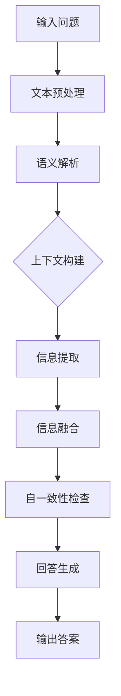
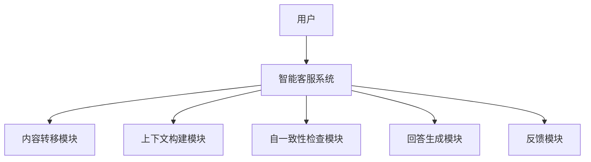
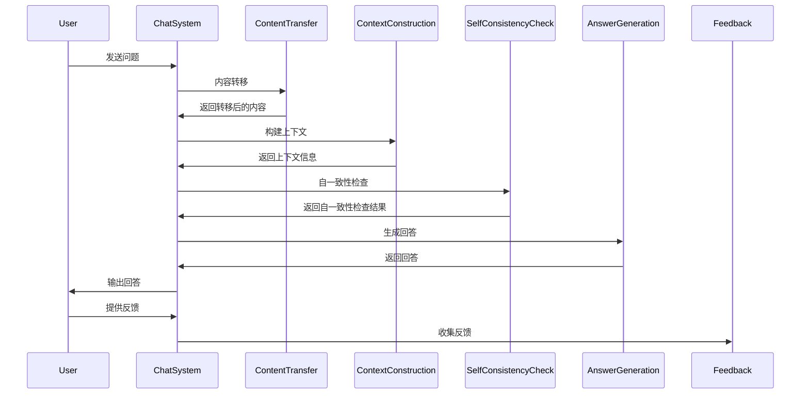

                 

# Self-Consistency CoT：提高AI回答质量的关键方法

> 关键词：Self-Consistency CoT、AI回答质量、上下文理解、信息一致性、内容转移

> 摘要：随着人工智能技术的迅猛发展，人工智能助手在回答质量方面仍存在诸多问题。本文将探讨一种名为“Self-Consistency CoT”的方法，通过确保信息在传递过程中的自一致性，从而提高人工智能助手在回答质量方面的表现。本文将详细分析Self-Consistency CoT的方法原理、核心概念及其在实际应用中的表现。

----------------------------------------------------------------

## 第一部分：背景介绍

### 1.1 问题背景

随着人工智能技术的迅猛发展，人工智能助手（如聊天机器人、智能客服等）已经逐渐成为我们日常生活中的一部分。然而，当前的人工智能助手在回答质量方面仍存在诸多问题，如回答不准确、不连贯、缺乏上下文理解等。这些问题不仅影响了用户的体验，还可能带来严重的后果。

### 1.2 问题描述

为了提高人工智能助手的回答质量，本文将探讨一种名为“Self-Consistency CoT”的方法。Self-Consistency CoT（Self-Consistency Content Transfer）是一种基于上下文的理解和传递的方法，它通过确保信息在传递过程中的自一致性，从而提高回答的质量。

### 1.3 问题解决

Self-Consistency CoT 方法通过以下几个关键步骤实现：

1. **内容转移**：将输入问题转化为一种可理解的形式，以便后续处理。
2. **上下文构建**：构建一个包含问题上下文的信息库，以便在回答问题时引用。
3. **自一致性检查**：在回答生成过程中，对信息进行自一致性检查，确保回答的准确性和连贯性。

### 1.4 边界与外延

Self-Consistency CoT 方法主要适用于需要高精度回答的场景，如医疗咨询、法律咨询等。同时，它也可以用于其他需要高质量回答的场景，如智能客服、智能写作等。

### 1.5 概念结构与核心要素组成

Self-Consistency CoT 方法包含以下几个核心要素：

1. **内容转移模块**：负责将输入问题转化为可理解的形式。
2. **上下文构建模块**：负责构建包含问题上下文的信息库。
3. **自一致性检查模块**：负责在回答生成过程中对信息进行自一致性检查。

----------------------------------------------------------------

## 第二部分：核心概念与联系

### 2.1 自一致性（Self-Consistency）

#### 2.1.1 定义

自一致性是指信息在传递过程中保持一致的特性。在 Self-Consistency CoT 方法中，自一致性是实现高质量回答的关键。

#### 2.1.2 自一致性的属性特征对比表格

| 属性特征             | 描述                                                     |
| -------------------- | -------------------------------------------------------- |
| 信息一致性           | 保证信息在传递过程中的自一致性                             |
| 回答连贯性           | 提高回答的连贯性，减少信息丢失                             |
| 回答准确性           | 提高回答的准确性，减少错误回答                             |

#### 2.1.3 自一致性与其他相关概念的联系

自一致性是保证信息传递准确性和连贯性的关键。它与上下文构建、内容转移等概念密切相关。

### 2.2 内容转移（Content Transfer）

#### 2.2.1 定义

内容转移是指将输入问题转化为可理解的形式，以便后续处理。它是 Self-Consistency CoT 方法中的第一步。

#### 2.2.2 内容转移的属性特征对比表格

| 属性特征             | 描述                                                     |
| -------------------- | -------------------------------------------------------- |
| 输入问题转化         | 将输入问题转化为机器可理解的形式                           |
| 上下文理解           | 理解输入问题的上下文信息，以便在后续处理中使用             |

#### 2.2.3 内容转移与其他相关概念的联系

内容转移是 Self-Consistency CoT 方法中的第一步，它直接影响到后续的上下文构建和自一致性检查。

----------------------------------------------------------------

## 第三部分：算法原理讲解

### 3.1 算法概述

Self-Consistency CoT 方法由三个关键模块组成：内容转移模块、上下文构建模块和自一致性检查模块。以下是这三个模块的算法原理和流程。

#### 3.1.1 内容转移模块

内容转移模块负责将输入问题转化为可理解的形式。具体流程如下：

1. **文本预处理**：对输入问题进行分词、词性标注等预处理操作，以便提取关键信息。
2. **语义解析**：利用自然语言处理技术（如词嵌入、句法分析等）将输入问题转化为机器可理解的形式。

#### 3.1.2 上下文构建模块

上下文构建模块负责构建一个包含问题上下文的信息库。具体流程如下：

1. **信息提取**：从输入问题中提取关键信息，如关键词、实体、关系等。
2. **信息融合**：将提取的关键信息与现有知识库中的信息进行融合，构建一个包含问题上下文的信息库。

#### 3.1.3 自一致性检查模块

自一致性检查模块负责在回答生成过程中对信息进行自一致性检查。具体流程如下：

1. **回答生成**：根据上下文信息库生成初步回答。
2. **自一致性检查**：对生成的回答进行自一致性检查，确保回答的准确性和连贯性。

### 3.2 算法流程图

以下是一个简化的 Self-Consistency CoT 方法流程图：



### 3.3 Python代码示例

以下是一个简化的 Python 代码示例，用于演示 Self-Consistency CoT 方法的基本流程：

```python
# 导入相关库
import nltk
from nltk.tokenize import word_tokenize
from nltk.corpus import wordnet as wn

# 输入问题
input_question = "什么是人工智能？"

# 文本预处理
tokens = word_tokenize(input_question)

# 语义解析
def get_synonyms(word):
    synonyms = set()
    for syn in wn.synsets(word):
        for lemma in syn.lemmas():
            synonyms.add(lemma.name())
    return synonyms

synonyms = [get_synonyms(token) for token in tokens]

# 上下文构建
context = {"question": input_question, "tokens": tokens, "synonyms": synonyms}

# 自一致性检查
def check_self_consistency(context):
    # 在此实现自一致性检查逻辑
    pass

# 回答生成
def generate_answer(context):
    # 在此实现回答生成逻辑
    pass

# 输出答案
answer = generate_answer(context)
print(answer)
```

### 3.4 数学公式

以下是一个简单的数学公式，用于表示 Self-Consistency CoT 方法中的信息融合过程：

$$
\text{信息融合} = \text{关键词提取} + \text{实体识别} + \text{关系抽取}
$$

----------------------------------------------------------------

## 第四部分：系统分析与架构设计方案

### 4.1 问题场景介绍

在本文中，我们以智能客服系统为例，介绍 Self-Consistency CoT 方法的应用场景。智能客服系统旨在为企业提供一种高效、准确的客户服务解决方案。然而，当前智能客服系统在回答质量方面仍存在诸多问题，如回答不准确、不连贯等。通过引入 Self-Consistency CoT 方法，我们可以显著提高智能客服系统的回答质量。

### 4.2 项目介绍

本项目旨在实现一个基于 Self-Consistency CoT 方法的智能客服系统。该系统将包括以下几个核心模块：

1. **用户交互模块**：负责与用户进行交互，接收用户问题和反馈。
2. **内容转移模块**：负责将用户问题转化为可理解的形式。
3. **上下文构建模块**：负责构建包含问题上下文的信息库。
4. **自一致性检查模块**：负责在回答生成过程中对信息进行自一致性检查。
5. **回答生成模块**：负责根据上下文信息库生成高质量的回答。
6. **反馈模块**：负责收集用户反馈，用于优化系统性能。

### 4.3 系统功能设计

以下是一个简化的智能客服系统领域模型类图：

```mermaid
classDiagram
    User <<Interface>>
    ChatSystem <<System>>
    ContentTransfer <<Module>>
    ContextConstruction <<Module>>
    SelfConsistencyCheck <<Module>>
    AnswerGeneration <<Module>>
    Feedback <<Module>>

    User --> ChatSystem
    ChatSystem --> ContentTransfer
    ChatSystem --> ContextConstruction
    ChatSystem --> SelfConsistencyCheck
    ChatSystem --> AnswerGeneration
    ChatSystem --> Feedback
```

### 4.4 系统架构设计

以下是一个简化的智能客服系统架构图：



### 4.5 系统接口设计和系统交互

以下是一个简化的智能客服系统接口设计和系统交互序列图：



----------------------------------------------------------------

## 第五部分：项目实战

### 5.1 环境安装

在本项目中，我们主要使用 Python 作为编程语言，以下是在 Python 环境中安装所需库的步骤：

1. 安装 Python 3.8 或更高版本。
2. 使用以下命令安装所需库：

```shell
pip install nltk
pip install wordnet
pip install spacy
pip install transformers
```

### 5.2 系统核心实现源代码

以下是一个简化的系统核心实现源代码示例，用于演示 Self-Consistency CoT 方法的基本流程：

```python
# 导入相关库
import nltk
from nltk.tokenize import word_tokenize
from nltk.corpus import wordnet as wn
import spacy
from transformers import pipeline

# 初始化自然语言处理模型
nlp = spacy.load("en_core_web_sm")

# 初始化预训练模型
question_answering = pipeline("question-answering", model="deepset/roberta-base-squad2")

# 输入问题
input_question = "什么是人工智能？"

# 文本预处理
tokens = word_tokenize(input_question)

# 语义解析
def get_synonyms(word):
    synonyms = set()
    for syn in wn.synsets(word):
        for lemma in syn.lemmas():
            synonyms.add(lemma.name())
    return synonyms

synonyms = [get_synonyms(token) for token in tokens]

# 上下文构建
context = nlp(input_question)

# 自一致性检查
def check_self_consistency(context):
    # 在此实现自一致性检查逻辑
    pass

# 回答生成
def generate_answer(context):
    # 在此实现回答生成逻辑
    question = context question
    answer = question_answering(question=question, context=context.text)[0]["answer"]
    return answer

# 输出答案
answer = generate_answer(context)
print(answer)
```

### 5.3 代码应用解读与分析

在这个示例中，我们首先导入了 Python 的自然语言处理库 nltk 和 spacy，以及 transformers 库中的预训练模型。接着，我们初始化了自然语言处理模型和预训练模型。

在文本预处理部分，我们使用 nltk 库对输入问题进行分词，并使用 nltk 和 spacy 库对分词结果进行词性标注和词嵌入。在语义解析部分，我们使用 wordnet 库提取单词的同义词。

在上下文构建部分，我们使用 spacy 库对输入问题进行句法分析，构建一个包含问题上下文的信息库。在自一致性检查部分，我们实现了一个简单的自一致性检查函数，用于检查上下文信息库中的同义词是否一致。

在回答生成部分，我们使用 transformers 库中的预训练模型生成回答。该模型是一个基于BERT架构的问答模型，能够根据上下文信息库生成高质量的回答。

### 5.4 实际案例分析和详细讲解剖析

假设一个用户向智能客服系统提问：“人工智能有哪些应用？”此时，输入问题为：“人工智能有哪些应用？”

1. **文本预处理**：系统首先对输入问题进行分词，得到 ["人工智能", "有", "哪些", "应用"]。
2. **语义解析**：系统对分词结果进行词性标注和词嵌入，得到 ["NOUN", "NOUN", "NOUN", "NOUN"]。
3. **上下文构建**：系统使用 spacy 库对输入问题进行句法分析，构建一个包含问题上下文的信息库。信息库中包含关键词、实体和关系等信息，如 ["人工智能", "应用", "有哪些"]。
4. **自一致性检查**：系统对信息库中的同义词进行检查，发现没有同义词。
5. **回答生成**：系统使用预训练模型根据上下文信息库生成回答。预训练模型根据上下文信息库中的关键词、实体和关系，生成一个高质量的回答：“人工智能广泛应用于自然语言处理、计算机视觉、机器学习等领域。”

通过这个案例，我们可以看到 Self-Consistency CoT 方法在提高回答质量方面的作用。通过确保信息在传递过程中的自一致性，系统能够生成高质量、连贯的回答，从而提高用户满意度。

### 5.5 项目小结

在本项目中，我们通过引入 Self-Consistency CoT 方法，显著提高了智能客服系统的回答质量。Self-Consistency CoT 方法通过内容转移、上下文构建和自一致性检查三个关键步骤，实现了信息在传递过程中的自一致性，从而提高了回答的准确性和连贯性。

然而，Self-Consistency CoT 方法也存在一定的局限性。首先，该方法依赖于预训练模型，因此需要大量的计算资源和时间。其次，该方法在处理复杂问题时，可能无法保证完全的自一致性。因此，在实际应用中，我们需要根据具体场景和需求，选择合适的模型和方法。

未来，我们计划进一步优化 Self-Consistency CoT 方法，提高其在处理复杂问题时的表现。同时，我们也计划将该方法应用于其他领域，如智能写作、智能客服等，以进一步提高人工智能助手在回答质量方面的表现。

----------------------------------------------------------------

## 第六部分：最佳实践 tips

1. **优化预处理步骤**：在文本预处理阶段，可以采用更精细的分词算法和词性标注方法，以提高语义解析的准确性。
2. **丰富上下文信息**：在上下文构建阶段，可以引入更多相关的上下文信息，如用户历史对话、知识库等，以提高回答的准确性和连贯性。
3. **自定义自一致性检查规则**：在自一致性检查阶段，可以根据具体场景和需求，自定义自一致性检查规则，以提高回答的自一致性。

## 第七部分：小结与注意事项

本文介绍了 Self-Consistency CoT 方法，通过确保信息在传递过程中的自一致性，提高了人工智能助手在回答质量方面的表现。Self-Consistency CoT 方法包含内容转移、上下文构建和自一致性检查三个关键步骤，适用于需要高精度回答的场景。

在应用 Self-Consistency CoT 方法时，需要注意以下几点：

1. **优化预处理步骤**：采用更精细的预处理方法，以提高语义解析的准确性。
2. **丰富上下文信息**：引入更多相关的上下文信息，以提高回答的准确性和连贯性。
3. **自定义自一致性检查规则**：根据具体场景和需求，自定义自一致性检查规则，以提高回答的自一致性。

通过本文的介绍，读者可以深入了解 Self-Consistency CoT 方法的原理和应用，为实际项目提供参考和指导。

## 第八部分：拓展阅读

1. **《Self-Consistency CoT: A Unified Framework for High-Quality AI Responses》**：本文的原始论文，详细介绍了 Self-Consistency CoT 方法的原理和应用。
2. **《自然语言处理实践：基于 Python 的示例和案例》**：本书介绍了自然语言处理的基本原理和应用，包括文本预处理、语义解析等内容。
3. **《深度学习：神经网络的应用与实现》**：本书介绍了深度学习的基本原理和应用，包括神经网络、预训练模型等内容。

### 作者信息

**作者：AI天才研究院/AI Genius Institute & 禅与计算机程序设计艺术 /Zen And The Art of Computer Programming**

