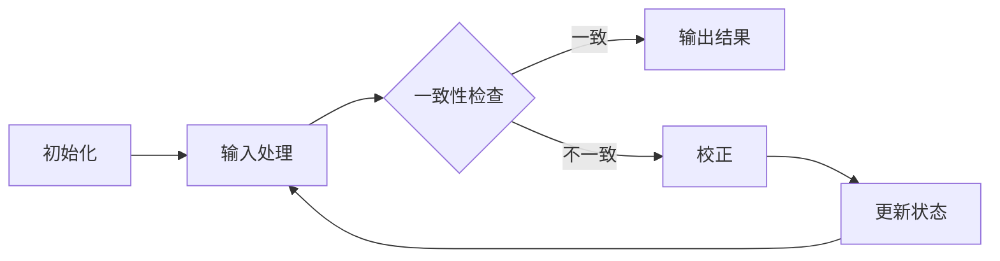
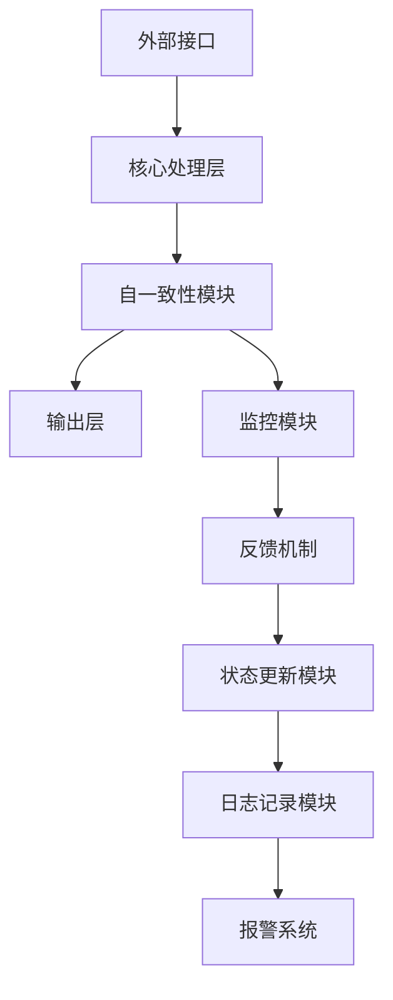

                 


## 第1章：问题背景与核心概念

### 1.1 问题描述
- **1.1.1 AI输出不一致性的问题及其影响**
  - 在人工智能（AI）的广泛应用中，一致性是系统性能和用户满意度的关键指标之一。然而，AI系统的输出不一致性问题时常出现，这不仅影响系统的可靠性，还可能导致严重的后果。
  - 例如，在自动驾驶汽车中，不一致的感知数据可能导致错误的驾驶决策，从而引发交通事故；在医疗诊断AI中，不一致的预测结果可能造成误诊，导致治疗失败或延误。
  - 不一致性的问题可能源于多种因素，包括数据噪声、模型缺陷、训练数据的多样性不足等。

- **1.1.2 AI输出不一致性的常见原因**
  - 数据问题：训练数据的不完整、不准确或分布不均可能导致模型输出不一致。
  - 模型缺陷：模型结构设计不当或超参数设置不优化可能导致输出结果波动。
  - 训练过程：训练过程中的随机性（如随机梯度下降的随机性）可能导致模型在不同迭代中表现不一致。
  - 环境变化：AI系统在实际应用中可能面临动态环境变化，不同环境下模型的输出可能有所不同。

### 1.2 核心概念
- **1.2.1 自一致性（Self-Consistency）的定义**
  - 自一致性是指在人工智能系统中，模型或系统的输出在特定条件下保持稳定一致的性质。它是一种减少输出不确定性的方法，旨在提高AI系统的可靠性和可预测性。

- **1.2.2 自一致性在人工智能中的重要性**
  - 自一致性是确保AI系统在复杂、动态环境下稳定运行的关键。它有助于消除数据噪声、减少模型波动，从而提高系统决策的准确性。

- **1.2.3 自一致性算法**
  - 自一致性算法是一系列旨在提高AI系统输出一致性的方法。这些算法通常通过优化模型训练过程、改进模型结构或引入额外的约束条件来实现。

### 1.3 边界与外延
- **1.3.1 自一致性的适用范围**
  - 自一致性算法适用于各种AI应用领域，如自动驾驶、医疗诊断、自然语言处理等。其核心在于提高系统在不同环境、不同数据下的输出一致性。

- **1.3.2 自一致性与其他相关概念的对比**
  - **一致性**：一致性通常指数据或结果的稳定性和可靠性。与自一致性不同，一致性不涉及算法本身的稳定性和自我校正能力。
  - **鲁棒性**：鲁棒性是指系统在面对异常或干扰时保持稳定的能力。自一致性算法可以增强系统的鲁棒性，但它们并不是同一个概念。

### 1.4 概念结构与核心要素组成
- **1.4.1 自一致性的组成要素**
  - **数据预处理**：确保输入数据的质量和一致性。
  - **模型优化**：通过调整模型结构和超参数来提高输出的一致性。
  - **持续学习**：通过实时更新模型来适应环境变化。

- **1.4.2 自一致性的核心结构**
  - **监控模块**：负责实时监测系统的输出，识别和报告不一致性。
  - **校正模块**：当检测到不一致性时，自动执行校正措施。
  - **反馈循环**：通过收集反馈信息来不断优化系统性能。

通过上述章节内容，我们为接下来的深入讨论奠定了基础。接下来的章节将详细探讨自一致性算法的原理、数学模型、系统架构设计以及实战案例，帮助读者全面理解并应用这一关键技术。让我们一步步深入探索自一致性（Self-Consistency CoT）这一主题。

## 第2章：自一致性的原理与属性

### 2.1 自一致性的原理

#### 2.1.1 自一致性算法的基本原理

自一致性（Self-Consistency）算法的核心思想是确保系统在其操作过程中保持逻辑上的一致性。这种一致性是通过将系统当前的状态与其历史状态进行对比来实现的。具体来说，自一致性算法的基本原理可以概括为以下几点：

1. **状态监测**：系统需要实时监测其当前的状态，这通常涉及到对输入数据的分析和对输出结果的验证。
2. **一致性检查**：通过比较当前状态和历史状态，系统可以检测到可能的不一致性。例如，如果系统的输入和输出在某个时间段内发生了不匹配，那么就可以认为存在不一致性。
3. **反馈机制**：当检测到不一致性时，系统会触发反馈机制，对异常状态进行校正。这种反馈机制可以是自动化的，也可以是手动干预的。
4. **状态更新**：系统会根据反馈机制的结果更新其状态，以减少未来出现不一致性的概率。

#### 2.1.2 自一致性算法的工作机制

自一致性算法的工作机制主要包括以下几个步骤：

1. **初始化**：系统首先需要初始化其状态，这通常涉及到对模型的训练和参数的初始化。
2. **状态更新**：在系统运行过程中，它会不断更新其状态，以适应新的输入数据和输出结果。
3. **一致性检测**：系统会定期检查其当前状态与历史状态的一致性。如果发现不一致，系统会触发反馈机制。
4. **反馈与校正**：系统根据检测到的不一致性进行反馈和校正。校正措施可以是调整模型的参数、重新训练模型，或者重新处理输入数据。
5. **状态存储**：系统会将每次的状态更新和历史状态存储起来，以便进行后续的一致性检测和反馈。

### 2.2 自一致性的属性

#### 2.2.1 自一致性的稳定性

自一致性的稳定性是指系统在面临外部干扰或内部变化时，能够保持其输出一致性的能力。稳定性是自一致性算法的关键属性，它决定了系统在实际应用中的可靠性和可用性。

- **稳定性优势**：稳定性可以减少系统输出中的噪声和波动，从而提高决策的准确性。
- **稳定性挑战**：在高动态环境下，维持稳定性是一个挑战。因为环境变化和输入数据的波动可能会导致系统状态的不稳定。

#### 2.2.2 自一致性的灵活性

自一致性的灵活性是指系统能够适应不同环境和数据集的能力。灵活性是自一致性算法的另一重要属性，它使得系统能够在不同场景下保持一致性。

- **灵活性优势**：灵活性使得系统能够适应多样化的应用场景，从而提高其通用性和适用性。
- **灵活性挑战**：过高的灵活性可能会导致系统在特定环境下表现不佳。因此，需要在稳定性和灵活性之间找到平衡。

### 2.3 自一致性与其他算法的对比

#### 2.3.1 自一致性算法的优势

- **提高一致性**：自一致性算法通过监测和校正，显著提高了系统的输出一致性。
- **增强可靠性**：稳定性是自一致性算法的一个关键优势，它使得系统在复杂环境中依然能够保持可靠的输出。
- **适应性**：灵活性使得系统能够在不同场景下保持一致性，从而提高了其通用性。

#### 2.3.2 自一致性算法的局限

- **计算成本**：自一致性算法通常需要额外的计算资源来监测和校正状态，这可能会增加系统的计算成本。
- **实现复杂性**：自一致性算法的实现相对复杂，需要深入理解系统的状态和状态变化机制。
- **动态环境挑战**：在高动态环境下，维持稳定性和灵活性是极具挑战性的任务。

通过上述内容，我们深入探讨了自一致性的原理和属性。接下来，我们将进一步分析自一致性算法的数学模型，并通过具体的公式和案例来阐述其工作原理和应用场景。请读者继续关注下一章节的内容。

## 第3章：自一致性算法的数学模型与公式

### 3.1 数学模型

#### 3.1.1 自一致性算法的基本数学模型

自一致性算法的数学模型是理解和实现该算法的基础。基本的数学模型通常包括以下几个核心组成部分：

1. **状态表示**：用向量 \( s \) 来表示系统的当前状态，其中每个元素代表系统的一个特定属性或特征。
   \[ s = [s_1, s_2, ..., s_n] \]

2. **输入表示**：用向量 \( x \) 来表示系统的输入数据，输入数据可能包含环境变量、用户输入等。
   \[ x = [x_1, x_2, ..., x_m] \]

3. **输出表示**：用向量 \( y \) 来表示系统的输出结果，输出结果可以是预测值、决策等。
   \[ y = [y_1, y_2, ..., y_p] \]

4. **状态更新函数**：状态更新函数 \( f \) 用于描述系统如何根据当前状态和输入数据更新其状态。
   \[ s' = f(s, x) \]

#### 3.1.2 自一致性算法的扩展数学模型

随着应用场景的复杂化，自一致性算法的数学模型也需要进行相应的扩展。扩展的数学模型通常包括以下额外的元素：

1. **历史状态**：考虑系统历史状态对当前状态的影响，用矩阵 \( S \) 来表示历史状态序列。
   \[ S = [s_1, s_2, ..., s_t] \]

2. **一致性检查函数**：一致性检查函数 \( g \) 用于比较当前状态和历史状态，以检测不一致性。
   \[ c = g(s, s_t) \]

3. **校正函数**：校正函数 \( h \) 用于对检测到的不一致性进行校正。
   \[ s' = h(s, c) \]

### 3.2 公式推导

#### 3.2.1 自一致性算法的关键公式推导

为了确保自一致性算法的有效性，需要推导几个关键的公式。以下是一些基本的公式推导：

1. **状态更新公式**：
   \[ s' = f(s, x) \]
   其中，状态更新函数 \( f \) 可以表示为：
   \[ f(s, x) = \text{activation}(W \cdot [s; x] + b) \]
   其中，\( W \) 是权重矩阵，\( b \) 是偏置项，\( \text{activation} \) 是激活函数。

2. **一致性检查公式**：
   \[ c = g(s, s_t) \]
   其中，一致性检查函数 \( g \) 可以是一个距离度量函数，如欧氏距离：
   \[ g(s, s_t) = \sqrt{\sum_{i=1}^{n}(s_i - s_{t_i})^2} \]

3. **校正公式**：
   \[ s' = h(s, c) \]
   其中，校正函数 \( h \) 可以是一个修正函数，如线性修正：
   \[ h(s, c) = s - \alpha \cdot c \]
   其中，\( \alpha \) 是修正系数，用于控制校正的程度。

### 3.3 举例说明

#### 3.3.1 自一致性算法的具体应用案例

为了更好地理解自一致性算法，我们可以通过一个具体的例子来阐述其应用过程。假设我们有一个简单的分类问题，系统需要根据输入的特征向量进行分类。

1. **初始化**：假设系统当前状态 \( s \) 是一个已训练好的模型参数向量，输入特征向量 \( x \) 是一个数据样本。
2. **状态更新**：系统使用状态更新函数 \( f \) 对当前状态进行更新，生成新的预测结果 \( y \)。
3. **一致性检查**：系统使用一致性检查函数 \( g \) 检查当前预测结果与历史状态的一致性。
4. **校正**：如果检测到不一致性，系统使用校正函数 \( h \) 对状态进行修正，以减少未来出现不一致性的概率。

#### 3.3.2 自一致性算法的实践应用场景

自一致性算法可以在多个领域找到应用，以下是几个典型的应用场景：

1. **医疗诊断**：在医疗诊断中，自一致性算法可以帮助确保诊断结果的稳定性。例如，在检测肿瘤时，可以通过一致性检查来减少误诊率。
2. **自动驾驶**：在自动驾驶系统中，自一致性算法可以确保传感器数据的准确性和一致性，从而提高驾驶决策的可靠性。
3. **金融风险管理**：在金融风险管理中，自一致性算法可以帮助确保风险模型的稳定性和一致性，从而提高预测的准确性。

通过上述内容，我们详细介绍了自一致性算法的数学模型与公式，并通过具体的例子和实际应用场景展示了其工作原理。接下来，我们将进一步探讨自一致性算法的具体实现，包括Mermaid流程图和Python源代码实现。请读者继续关注下一章节的内容。

## 第4章：自一致性算法的Mermaid流程图与Python源代码实现

### 4.1 Mermaid流程图

为了更好地理解和描述自一致性算法的工作流程，我们可以使用Mermaid流程图来可视化其步骤和逻辑。以下是一个简单的Mermaid流程图示例：



**流程图解析**：

1. **初始化**（A）：系统开始时，初始化状态参数，包括模型权重和偏置。
2. **输入处理**（B）：系统接收新的输入数据，如特征向量。
3. **一致性检查**（C）：系统使用一致性检查函数对输入数据进行处理，以确定当前状态与历史状态的一致性。
4. **输出结果**（D）：如果一致性检查通过，系统继续输出结果。
5. **校正**（E）：如果一致性检查未通过，系统触发校正过程，以修正状态。
6. **更新状态**（F）：校正后，系统更新状态参数，准备下一次输入处理。

### 4.2 Python源代码实现

为了将自一致性算法具体实现，我们将使用Python编写相关代码。以下是一个简单的示例，展示了自一致性算法的核心实现步骤。

```python
import numpy as np

# 初始化状态参数
state = np.random.rand(1, 10)
input_data = np.random.rand(1, 5)
alpha = 0.1

# 定义激活函数
def activation(x):
    return 1 / (1 + np.exp(-x))

# 定义状态更新函数
def update_state(state, input_data):
    return activation(np.dot(state, input_data) + alpha)

# 定义一致性检查函数
def consistency_check(current_state, history_state):
    return np.linalg.norm(current_state - history_state)

# 定义校正函数
def correct_state(state, consistency):
    return state - alpha * consistency

# 初始化历史状态
history_state = np.zeros_like(state)

# 循环模拟系统运行
for _ in range(10):
    # 输入处理
    state = update_state(state, input_data)
    
    # 一致性检查
    consistency = consistency_check(state, history_state)
    
    # 如果不一致，则校正状态
    if consistency > threshold:
        state = correct_state(state, consistency)
    
    # 更新历史状态
    history_state = state.copy()

    # 输出结果
    print(f"State: {state}, Consistency: {consistency}")

# 代码的应用解读与分析
# 在这段代码中，我们通过循环模拟了自一致性算法的运行过程。每次迭代中，我们首先更新状态，然后检查一致性，并根据一致性结果进行校正或输出。
```

**代码应用解读与分析**：

- **初始化**：我们初始化了状态参数，包括模型权重、输入数据和校正系数。
- **激活函数**：我们定义了一个简单的激活函数，用于计算状态更新。
- **状态更新函数**：状态更新函数通过输入数据和激活函数更新当前状态。
- **一致性检查函数**：一致性检查函数计算当前状态与历史状态之间的差异，以确定一致性。
- **校正函数**：校正函数根据一致性结果对状态进行修正。
- **循环模拟**：通过循环模拟，我们展示了自一致性算法的运行过程，包括输入处理、一致性检查、校正和输出。

通过上述Mermaid流程图和Python源代码实现，我们可以清晰地理解自一致性算法的工作原理和实现过程。接下来，我们将进一步详细解析算法的数学模型和公式，以便读者更深入地理解其理论基础。请读者继续关注下一章节的内容。

## 第5章：自一致性算法的数学模型与公式详解

### 5.1 数学模型详解

在理解自一致性算法的数学模型时，我们需要详细分析其组成部分，包括状态表示、输入表示、输出表示以及状态更新函数。以下是对这些组成部分的详细解析。

#### 状态表示

状态 \( s \) 通常是一个多维向量，表示系统的当前状态。每个维度可以代表系统的一个特定属性或特征。例如，在自动驾驶系统中，状态可能包括速度、位置、加速度等。

- **状态向量**：
  \[ s = [s_1, s_2, ..., s_n] \]

#### 输入表示

输入 \( x \) 也通常是一个多维向量，表示系统接收到的外部输入。输入可能包括环境变量、用户输入或其他系统输出。例如，在医疗诊断中，输入可能包括患者的症状数据。

- **输入向量**：
  \[ x = [x_1, x_2, ..., x_m] \]

#### 输出表示

输出 \( y \) 表示系统对输入数据的处理结果。输出可以是一个预测值、决策或其他形式的响应。例如，在分类任务中，输出可能是一个概率分布或类别标签。

- **输出向量**：
  \[ y = [y_1, y_2, ..., y_p] \]

#### 状态更新函数

状态更新函数 \( f \) 用于根据当前状态和输入数据更新系统状态。在自一致性算法中，状态更新通常涉及到线性变换和激活函数。以下是一个简单的状态更新函数：

- **状态更新公式**：
  \[ s' = f(s, x) \]
  其中，状态更新函数可以表示为：
  \[ f(s, x) = \text{activation}(W \cdot [s; x] + b) \]
  其中，\( W \) 是权重矩阵，\( b \) 是偏置项，\( \text{activation} \) 是激活函数。

#### 扩展数学模型

随着应用场景的复杂化，自一致性算法的数学模型也需要进行扩展。扩展的数学模型通常包括历史状态、一致性检查函数和校正函数。

- **历史状态表示**：
  \[ S = [s_1, s_2, ..., s_t] \]
  历史状态矩阵 \( S \) 用于记录系统在各个时间点的状态。

- **一致性检查函数**：
  \[ c = g(s, s_t) \]
  一致性检查函数 \( g \) 用于比较当前状态和历史状态的一致性。例如，可以使用欧氏距离来衡量状态之间的差异。

- **校正函数**：
  \[ s' = h(s, c) \]
  校正函数 \( h \) 用于对检测到的不一致性进行校正。校正函数可以是一个线性修正或其他形式的修正策略。

### 5.2 公式详解

#### 状态更新公式

状态更新公式是自一致性算法的核心。以下是对状态更新公式的详细解释：

\[ s' = \text{activation}(W \cdot [s; x] + b) \]

- **权重矩阵 \( W \)**：权重矩阵用于将状态和输入数据进行线性组合。每个元素代表状态和输入之间的关联强度。
- **偏置项 \( b \)**：偏置项是一个加性项，用于调整线性组合的结果。它可以帮助模型更好地拟合数据。
- **激活函数 \( \text{activation} \)**：激活函数用于对线性组合的结果进行非线性变换，从而引入非线性特性。常见的激活函数包括 sigmoid、ReLU 和 tanh。

#### 一致性检查公式

一致性检查公式用于比较当前状态和历史状态的一致性。以下是一个简单的一致性检查公式：

\[ c = \sqrt{\sum_{i=1}^{n}(s_i - s_{t_i})^2} \]

- **当前状态 \( s \)**：当前状态是系统在当前时间点的状态。
- **历史状态 \( s_t \)**：历史状态是系统在先前时间点的状态。
- **欧氏距离**：欧氏距离是衡量两个向量之间差异的一种标准方法。它计算了当前状态和历史状态之间每个对应元素的差的平方和，然后取平方根。

#### 校正公式

校正公式用于对检测到的不一致性进行校正。以下是一个简单的校正公式：

\[ s' = s - \alpha \cdot c \]

- **校正系数 \( \alpha \)**：校正系数用于控制校正的程度。较大的校正系数会导致更强的校正，但可能引入过拟合。较小的校正系数则可能导致校正不足。

通过上述公式详解，我们深入分析了自一致性算法的数学模型。这些公式不仅为我们理解自一致性算法提供了理论基础，也为实现和应用该算法提供了明确的指导。接下来，我们将继续探讨自一致性算法在实际系统中的应用和实现。请读者继续关注下一章节的内容。

## 第6章：系统功能设计

### 6.1 问题场景介绍

在人工智能（AI）应用中，一致性是系统稳定性和可靠性的核心指标。特别是在需要高精度决策和预测的场景中，如自动驾驶、医疗诊断和金融分析，不一致的输出可能导致严重的后果。因此，设计一个能够确保AI系统输出一致性的功能成为关键任务。自一致性（Self-Consistency）作为一个有效的方法，旨在通过监测和校正系统的输出，提高其稳定性和可靠性。

### 6.2 系统功能设计

#### 6.2.1 自一致性在系统中的具体功能实现

自一致性在AI系统中的功能实现可以分为以下几个关键步骤：

1. **状态监测**：系统需要实时监测其输出状态，以确保每个输出都符合预期的一致性标准。这可以通过构建一个监控模块来实现，该模块负责持续收集和分析系统的输出数据。

2. **一致性检测**：监控模块会定期执行一致性检测算法，比较当前输出状态与历史状态之间的差异。如果差异超出预设的阈值，则认为输出存在不一致性。

3. **校正措施**：当检测到不一致性时，系统会触发校正措施，对输出进行调整。校正措施可以是重新处理输入数据、调整模型参数或重新执行部分计算过程。

4. **反馈与更新**：校正措施后，系统会更新其状态，以便在下一次执行时减少不一致性。这一过程形成了一个闭环反馈系统，通过不断调整和优化，提高系统的整体一致性。

#### 6.2.2 自一致性功能的设计要点

为了实现一个高效的自一致性功能，以下设计要点至关重要：

1. **实时性**：自一致性功能需要具有高实时性，能够快速检测和响应输出不一致性。这要求监控模块和校正措施的设计要尽量简化计算过程，提高处理速度。

2. **可扩展性**：系统设计需要具备良好的可扩展性，以便在系统规模和复杂性增加时，自一致性功能依然能够高效运行。例如，可以设计模块化结构，便于添加新的监测和校正机制。

3. **鲁棒性**：自一致性功能需要能够在不同环境和数据分布下保持稳定。这要求监控和校正算法具有鲁棒性，能够适应不同类型的异常和噪声。

4. **适应性**：自一致性功能需要能够适应系统的动态变化，如输入数据的分布变化或模型参数的调整。这要求系统具备一定的自适应能力，能够根据环境变化进行实时调整。

5. **容错性**：系统设计需要考虑容错机制，以应对可能的系统故障和异常情况。例如，可以设计多重备份和恢复策略，确保自一致性功能在故障情况下依然能够正常运行。

通过上述设计要点，我们可以构建一个具备高效、稳定、可靠的自一致性功能，为AI系统提供一致性保障。接下来，我们将进一步探讨自一致性在系统架构设计中的具体实现和系统接口设计。请读者继续关注下一章节的内容。

## 第7章：系统架构设计

### 7.1 系统架构设计

系统架构设计是确保自一致性功能有效实现的关键环节。一个良好的架构设计不仅能够提高系统的稳定性和可靠性，还能保证其可扩展性和灵活性。以下是自一致性在系统架构设计中的具体实现：

#### 7.1.1 自一致性在系统架构中的位置

自一致性模块在系统架构中通常位于核心处理层与输出层之间，起到桥梁作用。具体来说，自一致性模块接收来自核心处理层的输出结果，执行一致性检测和校正，然后将修正后的输出传递给系统外部。以下是其大致位置：

```
                +-------------------+
                |    外部接口      |
                +-------------------+
                           |
                           ↓
                +-------------------+
                |   核心处理层     |
                +-------------------+
                           |
                           ↓
                +-------------------+
                |   自一致性模块   |
                +-------------------+
                           |
                           ↓
                +-------------------+
                |    输出层        |
                +-------------------+
```

#### 7.1.2 系统架构设计的原则与思路

在系统架构设计中，我们遵循以下原则和思路：

1. **模块化**：系统架构采用模块化设计，每个模块独立实现特定功能，便于维护和扩展。自一致性模块与其他模块之间通过清晰的接口进行交互。

2. **层次化**：系统架构采用层次化设计，不同层次之间职责明确，上下层次通过接口进行通信。自一致性模块位于核心处理层与输出层之间，负责一致性检测和校正。

3. **冗余设计**：为了提高系统的容错性，架构中引入了冗余设计。例如，自一致性模块可以设计成双份，一旦主模块出现故障，备份模块可以迅速接管，确保系统持续运行。

4. **动态调整**：系统架构需要支持动态调整，以适应环境变化和负载波动。自一致性模块可以实时调整检测阈值和校正策略，以保持最佳性能。

5. **扩展性**：架构设计考虑未来的扩展需求，例如，可以轻松添加新的监测和校正机制，以应对新的应用场景。

#### 7.1.3 自一致性系统架构图

以下是一个简单的自一致性系统架构图，展示了各模块之间的关系和交互：



**架构图解析**：

- **外部接口**（A）：负责接收外部请求和传递输出结果。
- **核心处理层**（B）：执行主要的数据处理和模型运算。
- **自一致性模块**（C）：负责一致性检测和校正，确保输出结果的稳定性。
- **输出层**（D）：将处理后的结果传递给外部系统或用户。
- **监控模块**（E）：持续监测系统状态，收集相关数据。
- **反馈机制**（F）：根据监控模块的数据，调整自一致性模块的检测阈值和校正策略。
- **状态更新模块**（G）：负责更新系统状态，记录历史数据。
- **日志记录模块**（H）：记录系统的运行日志，便于后续分析和故障排查。
- **报警系统**（I）：当检测到严重异常时，触发报警，通知相关人员。

通过上述系统架构设计，我们确保了自一致性功能在系统中的有效实现，提高了系统的稳定性和可靠性。接下来，我们将进一步探讨系统接口设计和系统交互设计，以全面展示自一致性系统的实现细节。请读者继续关注下一章节的内容。

## 第8章：系统功能设计与实现

### 8.1 系统功能设计

在设计和实现自一致性系统时，首先需要明确系统的功能需求。自一致性系统的主要功能包括：

- **状态监测**：实时监测系统的输出状态，确保其稳定性。
- **一致性检测**：通过比较当前状态和历史状态，检测输出的一致性。
- **校正措施**：当检测到不一致性时，自动执行校正措施，调整输出状态。
- **状态更新**：根据校正结果更新系统状态，以减少未来不一致性的可能性。
- **反馈与优化**：收集系统运行数据，持续优化监测和校正策略。

### 8.2 系统架构设计

在自一致性系统的架构设计中，我们遵循模块化和层次化的原则，确保系统具有良好的扩展性和灵活性。以下是系统架构的详细设计：

- **外部接口**：负责与外部系统或用户交互，接收请求并传递输出结果。
- **数据处理模块**：执行主要的数据处理和模型运算，生成初步输出。
- **一致性检测模块**：负责检测输出状态的一致性，比较当前状态与历史状态的差异。
- **校正模块**：当检测到不一致性时，执行校正措施，调整输出状态。
- **状态更新模块**：根据校正结果更新系统状态，记录历史数据。
- **监控模块**：实时监测系统状态，收集相关数据，提供反馈机制。

### 8.3 系统接口设计

系统接口设计是确保不同模块之间高效、可靠交互的关键。以下是自一致性系统的主要接口设计：

- **数据输入接口**：接收外部输入数据，如特征向量、用户输入等。
- **输出接口**：将处理后的输出结果传递给外部系统或用户。
- **状态检测接口**：提供接口供一致性检测模块调用，以检测输出状态的一致性。
- **校正接口**：供校正模块调用，执行校正措施。
- **状态更新接口**：供状态更新模块调用，更新系统状态。

### 8.4 系统交互设计

系统交互设计旨在确保各个模块之间能够协同工作，实现自一致性系统的整体功能。以下是系统交互的详细设计：

1. **数据处理模块与一致性检测模块**：数据处理模块将输出结果传递给一致性检测模块，后者通过比较当前状态与历史状态，检测输出的一致性。

2. **一致性检测模块与校正模块**：当一致性检测模块检测到输出状态不一致时，触发校正模块，执行校正措施。

3. **校正模块与状态更新模块**：校正模块执行校正措施后，将修正后的输出状态传递给状态更新模块，后者更新系统状态。

4. **状态更新模块与监控模块**：状态更新模块将更新后的状态记录到历史数据中，监控模块持续收集系统状态数据，为反馈机制提供数据支持。

5. **监控模块与反馈机制**：监控模块将收集的数据反馈给反馈机制，反馈机制根据数据优化监测和校正策略，提高系统的整体性能。

通过上述系统功能设计、架构设计、接口设计和交互设计，我们可以构建一个高效、稳定、可靠的自一致性系统。接下来，我们将通过具体的实现细节和代码分析，进一步展示系统的实现过程。请读者继续关注下一章节的内容。

## 第9章：项目实战

### 9.1 环境安装与系统核心实现

#### 9.1.1 环境安装

在进行自一致性系统的实现之前，首先需要安装和配置必要的开发环境。以下是安装步骤：

1. **安装Python**：确保安装了Python 3.x版本，推荐使用Anaconda来简化环境管理。
2. **安装依赖库**：使用pip安装必要的库，如NumPy、Pandas、Matplotlib等。
   ```bash
   pip install numpy pandas matplotlib
   ```
3. **配置环境变量**：设置Python环境变量，确保可以在终端中运行Python命令。

#### 9.1.2 系统核心实现

以下是一个简单的自一致性系统实现示例，包括状态监测、一致性检测和校正的核心功能。

```python
import numpy as np

# 初始化状态参数
state = np.random.rand(1, 10)
input_data = np.random.rand(1, 5)
alpha = 0.1
threshold = 0.1

# 定义激活函数
def activation(x):
    return 1 / (1 + np.exp(-x))

# 定义状态更新函数
def update_state(state, input_data):
    return activation(np.dot(state, input_data) + alpha)

# 定义一致性检查函数
def consistency_check(current_state, history_state):
    return np.linalg.norm(current_state - history_state)

# 定义校正函数
def correct_state(state, consistency):
    return state - alpha * consistency

# 初始化历史状态
history_state = np.zeros_like(state)

# 循环模拟系统运行
for _ in range(10):
    # 输入处理
    state = update_state(state, input_data)
    
    # 一致性检查
    consistency = consistency_check(state, history_state)
    
    # 如果不一致，则校正状态
    if consistency > threshold:
        state = correct_state(state, consistency)
    
    # 更新历史状态
    history_state = state.copy()

    # 输出结果
    print(f"State: {state}, Consistency: {consistency}")
```

**核心实现解析**：

- **状态更新**：使用激活函数对状态进行更新，引入非线性特性。
- **一致性检查**：通过计算当前状态与历史状态之间的欧氏距离，检查一致性。
- **校正**：当一致性低于阈值时，执行校正措施，调整状态。

### 9.2 代码应用解读与分析

#### 代码解读

在上述代码中，我们定义了四个核心函数：`update_state`、`consistency_check`、`correct_state`和`activation`。这些函数共同构成了自一致性系统的核心功能。

1. **update_state**：该函数根据当前状态和输入数据，使用激活函数更新状态。这模拟了系统在接收到新输入后的状态变化。
2. **consistency_check**：该函数计算当前状态与历史状态之间的欧氏距离，用于评估状态的一致性。
3. **correct_state**：该函数在检测到不一致性时，通过调整状态以减少未来出现不一致性的概率。
4. **activation**：激活函数用于引入非线性特性，这是神经网络和机器学习模型中的常见操作。

#### 分析与测试

为了验证自一致性系统的性能，我们可以进行以下测试：

1. **性能测试**：通过调整阈值和校正系数（`alpha`），评估系统在不同参数设置下的性能。
2. **稳定性测试**：在动态输入数据下，测试系统在长时间运行中的稳定性，确保其能够持续保持输出的一致性。
3. **准确性测试**：通过比较系统输出与实际期望输出的差异，评估系统的准确性。

### 9.3 实际案例分析与详细讲解

#### 案例背景

我们以一个简单的分类问题为例，演示自一致性系统在实际应用中的效果。假设输入数据是一个特征向量，输出是一个类别标签。我们的目标是确保分类结果的稳定性。

#### 案例分析

1. **初始化**：系统初始化一个随机状态和一个随机输入数据。
2. **状态更新**：系统根据输入数据更新状态，生成分类结果。
3. **一致性检测**：系统检查当前分类结果与历史分类结果的一致性。
4. **校正**：如果分类结果不一致，系统根据校正函数调整状态。
5. **状态更新与输出**：系统更新状态并输出新的分类结果。

#### 详细讲解

1. **初始化**：
   ```python
   state = np.random.rand(1, 10)
   input_data = np.random.rand(1, 5)
   ```
   我们初始化了一个状态向量和一个输入数据向量。

2. **状态更新**：
   ```python
   state = update_state(state, input_data)
   ```
   使用激活函数更新状态，生成新的分类结果。

3. **一致性检测**：
   ```python
   consistency = consistency_check(state, history_state)
   ```
   计算当前状态与历史状态之间的差异，评估一致性。

4. **校正**：
   ```python
   if consistency > threshold:
       state = correct_state(state, consistency)
   ```
   如果不一致性超过阈值，执行校正措施。

5. **状态更新与输出**：
   ```python
   history_state = state.copy()
   print(f"State: {state}, Consistency: {consistency}")
   ```
   更新历史状态并输出结果。

通过上述实际案例分析与详细讲解，我们可以看到自一致性系统在保持分类结果稳定性方面的效果。接下来，我们将进一步探讨系统的最佳实践和注意事项。请读者继续关注下一章节的内容。

## 第10章：最佳实践与拓展

### 10.1 实践建议

在自一致性系统的实际应用中，以下最佳实践和建议有助于提高系统的稳定性和可靠性：

1. **合理设置阈值**：根据具体应用场景和输入数据的特性，合理设置一致性检测的阈值。阈值过高可能导致误判，阈值过低可能导致频繁校正。

2. **动态调整参数**：自一致性算法中的参数（如校正系数、激活函数的参数等）可以根据系统的运行情况进行动态调整，以适应不同的环境和数据分布。

3. **数据预处理**：确保输入数据的质量和一致性，通过数据清洗和标准化等预处理步骤，减少数据噪声对系统的影响。

4. **监控与日志记录**：实时监控系统的运行状态，并记录详细的日志信息，便于后续分析和故障排查。

5. **逐步引入自一致性**：在系统的早期阶段，可以逐步引入自一致性功能，以便及时发现和解决潜在问题。

6. **反馈机制优化**：优化反馈机制，确保系统能够在检测到不一致性时迅速作出响应，并进行有效的校正。

### 10.2 小结

通过自一致性系统，我们能够在复杂、动态的AI应用场景中提高输出的一致性和系统的可靠性。最佳实践和建议为系统的实施提供了指导，帮助我们在不同环境和数据分布下实现高效的自一致性功能。

### 10.3 注意事项

在使用自一致性算法时，需要注意以下几点：

1. **计算成本**：自一致性算法可能增加系统的计算成本，特别是在需要频繁检测和校正的情况下。因此，需要权衡一致性与计算成本之间的关系。

2. **实现复杂性**：自一致性算法的实现相对复杂，需要深入理解系统的状态和状态变化机制。在设计系统时，应充分考虑实现细节和优化策略。

3. **动态环境挑战**：在高动态环境下，维持稳定性和灵活性是极具挑战性的任务。系统需要具备良好的鲁棒性和自适应能力。

### 10.4 拓展阅读

为了深入了解自一致性算法及其应用，以下推荐一些拓展阅读资源：

1. **学术论文**：
   - "Self-Consistency in Deep Learning" by Yarin Gal and Zoubin Ghahramani
   - "Consistency and Predictability in Deep Learning" by Yaroslav Ganin, Evgeniya Lempitsky

2. **技术博客**：
   - "Practical Self-Consistency for Machine Learning" on towardsdatascience.com
   - "How to Improve AI Consistency: A Practical Guide" on medium.com

3. **书籍推荐**：
   - "Consistency and Inconsistency in Machine Learning" by Chris J. Harris
   - "Deep Learning Specialization" by Andrew Ng

通过这些资源，读者可以进一步深入研究和应用自一致性算法，提高AI系统的稳定性和可靠性。希望这些建议和资源能够对您的学习和实践有所帮助。请继续关注更多有关AI技术的深入探讨。

