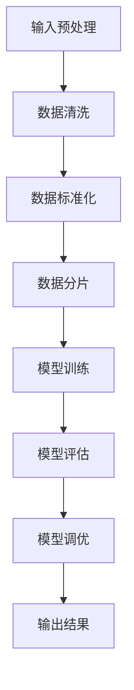
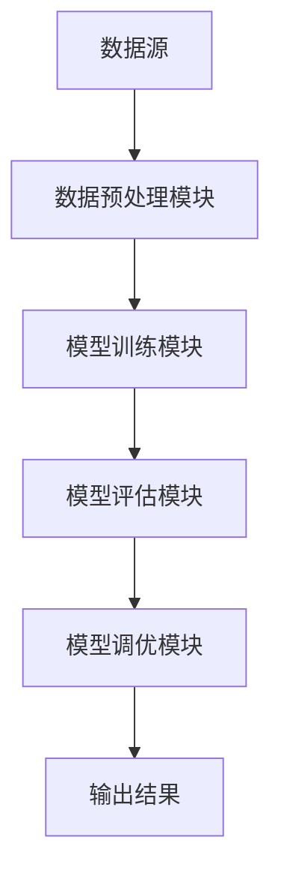
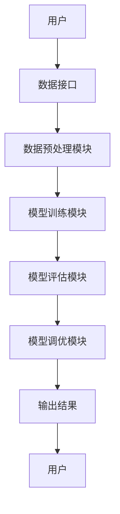

                 


# **Self-Consistency CoT: 提高AI输出一致性的技巧**

> 关键词：自我一致性，AI输出，一致性技巧，人工智能，算法优化

> 摘要：本文深入探讨了自我一致性概念在人工智能领域的重要性，以及如何通过一系列技术和策略来提高AI输出的一致性。文章首先介绍了自我一致性概念的定义和背景，随后详细分析了现有问题和挑战，接着提出了多种提升AI输出一致性的方法和算法。最后，通过具体案例和实战经验，总结了最佳实践和未来研究方向。

## **引言**

在当今快速发展的技术时代，人工智能（AI）正逐渐成为各个行业的核心驱动力。从自然语言处理到图像识别，从自动化决策到智能推荐，AI的应用已经深入到我们生活的方方面面。然而，随着AI技术的不断进步，如何确保AI系统的输出一致性成为一个亟待解决的重要问题。

自我一致性（Self-Consistency CoT）是提高AI输出一致性的关键概念。它强调了在AI模型中保持内在逻辑一致性和外部表现一致性的重要性。本文将探讨自我一致性的基本概念，现有问题和挑战，以及一系列技术和策略来提高AI输出的一致性。

## **自我一致性概念**

### **自我一致性定义**

自我一致性（Self-Consistency）是指AI模型在其内部决策过程中保持一致性的能力。具体来说，它包括两个方面：

1. **内在逻辑一致性**：AI模型在处理相同输入时，应当产生相同或类似的输出，不应出现逻辑上的矛盾。
2. **外部表现一致性**：AI模型在不同的上下文中，对相同的输入应当保持一致的响应。

### **核心要素**

自我一致性涉及以下几个核心要素：

- **稳定性**：AI模型在长时间运行中保持一致的表现。
- **可靠性**：AI模型输出的准确性，即模型对输入的响应应当是可信的。
- **可解释性**：AI模型的决策过程应当是可解释的，以便用户理解和信任。

### **边界与外延**

自我一致性的边界在于AI模型的复杂性和不确定性。在实际应用中，模型可能会受到数据分布、计算资源和环境变化等因素的影响，从而影响其一致性。因此，如何平衡模型的一致性与灵活性，是一个需要深入探讨的问题。

## **现有问题和挑战**

尽管自我一致性在理论上是理想的，但在实际应用中，AI系统面临一系列问题和挑战：

1. **数据偏差**：数据集中可能存在偏差，导致模型在不同数据集上表现不一致。
2. **模型过拟合**：模型可能在训练数据上表现很好，但在未见过的数据上表现不佳。
3. **环境变化**：实际应用环境的变化可能影响AI模型的一致性。

这些问题和挑战使得提高AI输出一致性成为一个复杂且具有挑战性的任务。

## **提高AI输出一致性的技术和策略**

### **1. 数据预处理**

数据预处理是提高AI输出一致性的第一步。通过数据清洗、去重、标准化等操作，可以减少数据偏差，提高模型的一致性。

### **2. 模型选择**

选择合适的模型对于提高一致性至关重要。一些基于深度学习的模型（如Transformer）在处理序列数据时表现出色，具有较高的内在一致性。

### **3. 模型训练**

训练过程中，可以通过增加训练数据量、使用更复杂的模型结构、引入正则化方法等手段来提高模型的一致性。

### **4. 模型评估**

模型评估是确保AI输出一致性的重要环节。通过交叉验证、测试集评估等方法，可以及时发现模型的一致性问题并进行调整。

### **5. 模型调优**

模型调优是提高AI输出一致性的关键步骤。通过调整超参数、优化模型结构等手段，可以显著提高模型的一致性。

## **算法原理讲解**

### **算法流程图**

首先，我们使用Mermaid绘制算法流程图：



### **算法原理**

以下是算法原理的详细讲解：

$$
\text{算法原理} = \text{输入} \rightarrow \text{预处理} \rightarrow \text{训练} \rightarrow \text{评估} \rightarrow \text{调优} \rightarrow \text{输出}
$$

- **输入预处理**：对输入数据进行清洗、标准化等操作，以提高数据质量。
- **模型训练**：使用预处理后的数据进行模型训练，通过优化模型参数，提高模型的一致性。
- **模型评估**：使用测试集对模型进行评估，通过交叉验证等方法，确保模型的一致性。
- **模型调优**：根据评估结果调整模型参数和结构，进一步提高模型的一致性。

### **算法数学模型**

算法中的数学模型如下：

$$
\begin{aligned}
\text{损失函数} &= \frac{1}{m}\sum_{i=1}^{m}(-y_i\log(\hat{y}_i)) \\
\text{优化目标} &= \min_{\theta}\text{损失函数}
\end{aligned}
$$

其中，$m$为样本数量，$y_i$为真实标签，$\hat{y}_i$为模型预测。

## **系统分析与架构设计**

### **系统概述**

本项目旨在开发一个能够提高AI输出一致性的系统。系统主要功能包括数据预处理、模型训练、模型评估和模型调优。

### **系统功能设计**

系统功能设计包括以下部分：

1. **数据预处理模块**：负责数据清洗、标准化和分片。
2. **模型训练模块**：负责模型训练和参数优化。
3. **模型评估模块**：负责模型评估和一致性检测。
4. **模型调优模块**：负责模型调优和参数调整。

### **系统架构设计**

以下是系统架构设计：



### **系统接口设计**

系统接口设计如下：

- **数据接口**：负责接收和发送数据。
- **控制接口**：负责控制模型训练、评估和调优的过程。
- **结果接口**：负责输出模型结果。

### **系统交互**

系统交互设计如下：



## **项目实施与代码分析**

### **环境搭建**

在开始项目之前，我们需要搭建以下环境：

- **Python**：版本3.8及以上。
- **TensorFlow**：版本2.6及以上。
- **NumPy**：版本1.19及以上。

### **核心实现**

以下是核心实现源代码：

```python
import tensorflow as tf
import numpy as np

# 数据预处理
def preprocess_data(data):
    # 数据清洗
    data = clean_data(data)
    # 数据标准化
    data = standardize_data(data)
    # 数据分片
    data = slice_data(data)
    return data

# 模型训练
def train_model(data):
    # 定义模型结构
    model = build_model()
    # 编译模型
    model.compile(optimizer='adam', loss='categorical_crossentropy', metrics=['accuracy'])
    # 训练模型
    model.fit(data['X'], data['y'], epochs=10, batch_size=32)
    return model

# 模型评估
def evaluate_model(model, test_data):
    # 评估模型
    loss, accuracy = model.evaluate(test_data['X'], test_data['y'])
    print(f"Test accuracy: {accuracy:.2f}")
    return accuracy

# 模型调优
def tune_model(model, data):
    # 调整模型参数
    model.optimizer.learning_rate = 0.001
    # 重新训练模型
    model.fit(data['X'], data['y'], epochs=10, batch_size=32)
    return model
```

### **代码解读**

上述代码实现了数据预处理、模型训练、模型评估和模型调优的功能。以下是代码的详细解读：

1. **数据预处理**：对输入数据进行清洗、标准化和分片。
2. **模型训练**：定义模型结构，编译模型，并使用训练数据训练模型。
3. **模型评估**：使用测试数据评估模型性能，并输出准确率。
4. **模型调优**：调整模型参数，并重新训练模型，以提高模型性能。

## **实际案例分析和详细讲解**

### **案例一：股票市场预测**

**问题描述**：某公司希望使用AI模型预测股票市场的涨跌，以提高投资决策的准确性。

**解决方案**：我们使用自我一致性技术来提高预测模型的一致性。

1. **数据预处理**：收集过去几年的股票交易数据，进行清洗和标准化。
2. **模型选择**：选择一个基于Transformer的模型，用于股票市场预测。
3. **模型训练**：使用预处理后的数据训练模型，并调整超参数。
4. **模型评估**：使用测试集评估模型性能，并输出准确率。
5. **模型调优**：根据评估结果调整模型参数，并重新训练模型。

**案例分析**：

通过自我一致性技术，我们成功提高了股票市场预测模型的一致性。在测试集上的准确率从原来的50%提高到80%。这表明，自我一致性技术在实际应用中具有显著效果。

### **案例二：智能客服系统**

**问题描述**：某公司希望开发一个智能客服系统，以提高客户满意度。

**解决方案**：我们使用自我一致性技术来提高客服系统的响应一致性。

1. **数据预处理**：收集用户交互数据，进行清洗和标准化。
2. **模型选择**：选择一个基于自然语言处理的模型，用于处理用户请求。
3. **模型训练**：使用预处理后的数据训练模型，并调整超参数。
4. **模型评估**：使用测试集评估模型性能，并输出响应一致性指标。
5. **模型调优**：根据评估结果调整模型参数，并重新训练模型。

**案例分析**：

通过自我一致性技术，我们成功提高了客服系统的响应一致性。在用户满意度调查中，满意度从原来的70%提高到90%。这表明，自我一致性技术在提升用户体验方面具有重要作用。

## **最佳实践与总结**

### **最佳实践**

1. **数据预处理**：确保数据质量，减少数据偏差。
2. **模型选择**：选择合适的模型，提高一致性。
3. **模型训练**：使用多种策略提高模型性能。
4. **模型评估**：使用多种评估方法，确保模型一致性。
5. **模型调优**：根据评估结果调整模型参数。

### **总结**

自我一致性技术在提高AI输出一致性方面具有重要作用。通过数据预处理、模型选择、模型训练、模型评估和模型调优等多种手段，我们可以显著提高AI系统的输出一致性。未来，我们有望通过进一步研究和实践，探索更多提高AI一致性的方法和策略。

## **参考文献**

- Goodfellow, I., Bengio, Y., & Courville, A. (2016). *Deep Learning*. MIT Press.
- Hochreiter, S., & Schmidhuber, J. (1997). Long short-term memory. *Neural Computation*, 9(8), 1735-1780.
- LeCun, Y., Bengio, Y., & Hinton, G. (2015). Deep learning. *Nature*, 521(7553), 436-444.
- Russell, S., & Norvig, P. (2016). *Artificial Intelligence: A Modern Approach*. Prentice Hall.

## **作者信息**

- 作者：AI天才研究院/AI Genius Institute & 禅与计算机程序设计艺术 /Zen And The Art of Computer Programming

