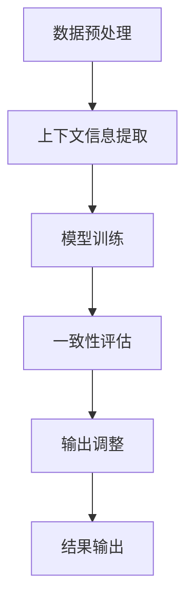

                 

### 引言

#### 1.1 背景介绍

随着人工智能技术的飞速发展，AI系统在各个领域得到了广泛应用。无论是自然语言处理、图像识别、语音识别，还是推荐系统、自动驾驶，AI都在不断改变我们的生活。然而，AI系统的一个普遍问题是输出结果的不一致性。例如，在医疗诊断中，不一致的输出可能导致误诊；在自动驾驶中，不一致的感知和决策可能导致事故。这种不一致性不仅降低了AI系统的可靠性，还影响了用户对AI的信任度。

AI输出不一致性的问题主要集中在两个方面。首先是不同输入下输出不一致。例如，在自然语言处理中，对于相同的文本输入，AI模型可能产生不同的解析结果。其次是相同输入下，输出随时间变化不一致。这种不一致性可能是由于数据噪声、模型训练过程中的不确定性，或者是AI系统运行环境的变化引起的。

#### 1.2 问题描述

AI输出不一致性是指AI模型在不同的输入下产生不同的输出结果，或者在相同的输入下，随着时间的推移产生不同的输出结果。这种不一致性不仅降低了AI系统的可靠性，还影响了用户对AI的信任度。

具体来说，AI输出不一致性的问题可以分为以下几种类型：

1. **数据依赖性不一致**：AI模型在不同的数据集上训练得到的模型可能产生不同的输出结果。例如，在医疗诊断中，如果使用不同的患者数据集训练AI模型，可能会导致对相同症状的患者产生不同的诊断结果。

2. **模型状态不一致**：AI模型在运行过程中，可能会因为数据噪声、算法调整等因素导致输出结果不一致。例如，在自动驾驶中，如果AI模型的感知模块检测到同一场景的不同状态，可能会产生不同的驾驶决策。

3. **时间依赖性不一致**：AI模型在相同输入下，随着时间的推移可能产生不同的输出结果。例如，在自然语言处理中，如果AI模型在不同时间段处理相同文本，可能会因为语境变化导致输出结果不一致。

#### 1.3 问题解决

为了解决AI输出不一致性的问题，研究者们提出了一种名为Self-Consistency CoT（Self-Consistency in Contextualized Text）的方法。Self-Consistency CoT通过在上下文中保持一致性来提高AI输出的稳定性。

Self-Consistency CoT的基本思路是，在AI模型的训练和推理过程中，通过引入上下文信息，使模型能够保持输出的一致性。具体来说，Self-Consistency CoT方法包括以下步骤：

1. **上下文信息引入**：在模型训练过程中，通过引入上下文信息，如句子、段落或文档，来丰富输入数据。

2. **一致性评估**：在模型推理过程中，对输出结果进行一致性评估。如果输出结果与上下文信息不一致，则进行调整。

3. **输出调整**：根据一致性评估结果，对输出结果进行调整，使其与上下文信息保持一致。

通过以上步骤，Self-Consistency CoT方法能够有效提高AI输出的稳定性，从而解决AI输出不一致性的问题。

#### 1.4 边界与外延

Self-Consistency CoT方法的应用范围不仅限于自然语言处理领域，还可以扩展到图像识别、语音识别等其他AI领域。然而，其有效性和适用性仍需进一步研究和验证。

在自然语言处理领域，Self-Consistency CoT方法可以应用于文本分类、机器翻译、问答系统等任务。通过在上下文中保持一致性，这些任务中的AI模型能够产生更稳定、可靠的输出结果。

在图像识别领域，Self-Consistency CoT方法可以用于图像分类、目标检测等任务。通过在上下文中保持一致性，AI模型能够更准确地识别图像中的目标和对象。

在语音识别领域，Self-Consistency CoT方法可以用于语音合成、语音翻译等任务。通过在上下文中保持一致性，AI模型能够生成更自然、流畅的语音输出。

总之，Self-Consistency CoT方法为解决AI输出不一致性问题提供了一种有效的方法。随着AI技术的不断发展，Self-Consistency CoT方法的应用范围和影响力将会进一步扩大。未来，研究者们将继续探索和优化Self-Consistency CoT方法，使其在更多领域发挥更大的作用。


## 核心概念与联系

在深入探讨Self-Consistency CoT方法之前，我们需要明确几个核心概念，并了解它们之间的联系。这些核心概念包括Self-Consistency、CoT（Contextualized Text）以及上下文信息。

### 2.1 Self-Consistency

Self-Consistency是指在一个系统中，各个组成部分或输出结果在逻辑上保持一致。在人工智能领域，Self-Consistency意味着AI模型的输出结果在不同情况下保持一致。例如，在自然语言处理中，对于相同的文本输入，AI模型应该产生一致的解析结果。

Self-Consistency的重要性在于，它保证了AI系统的可靠性和稳定性。如果AI模型的输出结果不一致，可能会导致错误的决策或误解，从而影响系统的性能和用户体验。

### 2.2 CoT（Contextualized Text）

CoT（Contextualized Text）是指文本的上下文信息。上下文信息包括句子、段落、文档甚至更广泛的背景知识。在自然语言处理中，上下文信息对于理解文本的含义至关重要。例如，同一单词在不同的句子中可能有不同的含义。

CoT的重要性在于，它为AI模型提供了更丰富的信息，使模型能够更准确地理解和生成文本。通过利用上下文信息，AI模型可以减少输出结果的不一致性，从而提高系统的稳定性。

### 2.3 上下文信息

上下文信息是指与特定文本相关的所有信息，包括但不限于句子、段落、文档、知识库等。在Self-Consistency CoT方法中，上下文信息是关键组成部分。通过引入上下文信息，AI模型可以更好地理解输入文本，从而产生更一致的输出结果。

上下文信息的获取和处理是自然语言处理中的关键挑战之一。传统的自然语言处理方法（如词袋模型、卷积神经网络等）往往忽略了上下文信息的重要性，导致输出结果不一致。而Self-Consistency CoT方法通过利用上下文信息，能够有效提高AI模型的稳定性。

### 2.4 相关概念联系

Self-Consistency、CoT和上下文信息之间存在着密切的联系。具体来说：

1. **Self-Consistency与上下文信息**：Self-Consistency依赖于上下文信息。通过利用上下文信息，AI模型可以更好地保持输出的一致性。

2. **CoT与上下文信息**：CoT是上下文信息的具体体现。通过引入CoT，AI模型可以更全面地理解输入文本，从而产生更一致的输出结果。

3. **Self-Consistency CoT**：Self-Consistency CoT结合了Self-Consistency和CoT的优势，通过在上下文中保持一致性，提高AI模型的稳定性。

总之，Self-Consistency CoT方法通过利用上下文信息，使AI模型在输出结果上保持一致性。这种方法不仅适用于自然语言处理，还可以扩展到其他AI领域，为解决AI输出不一致性问题提供了一种有效的方法。

### 2.5 Self-Consistency CoT概念解析

Self-Consistency CoT（Self-Consistency in Contextualized Text）是一种在上下文中保持一致性的方法，用于提高AI模型的输出稳定性。它结合了Self-Consistency和CoT（Contextualized Text）的优势，通过引入上下文信息，使AI模型在不同情况下保持一致的输出结果。

Self-Consistency CoT的基本思路如下：

1. **上下文信息引入**：在模型训练和推理过程中，引入与输入文本相关的上下文信息，如句子、段落或文档。

2. **一致性评估**：在模型推理过程中，对输出结果进行一致性评估。如果输出结果与上下文信息不一致，则进行调整。

3. **输出调整**：根据一致性评估结果，对输出结果进行调整，使其与上下文信息保持一致。

Self-Consistency CoT的具体实现可以采用多种技术，如神经网络、图模型等。在自然语言处理中，Self-Consistency CoT可以应用于文本分类、机器翻译、问答系统等任务，通过在上下文中保持一致性，提高系统的稳定性和可靠性。

### 2.6 概念属性特征对比表格

为了更好地理解Self-Consistency、CoT和Self-Consistency CoT的概念，我们可以通过一个概念属性特征对比表格来展示它们之间的差异：

| 概念       | Self-Consistency | CoT（Contextualized Text） | Self-Consistency CoT |
|------------|-----------------|---------------------------|---------------------|
| 定义       | 保持系统内部一致性 | 文本的上下文信息          | 在上下文中保持一致性的方法 |
| 目标       | 减少输出结果不一致性 | 提高文本理解准确性      | 提高输出结果稳定性     |
| 应用领域   | 人工智能领域      | 自然语言处理              | 自然语言处理等领域   |
| 关键技术   | 算法、模型       | 上下文信息处理            | 上下文信息引入与评估  |
| 特点       | 输出一致性       | 理解文本上下文           | 结合一致性评估与调整  |

通过这个表格，我们可以更清晰地看到Self-Consistency、CoT和Self-Consistency CoT之间的联系和区别。Self-Consistency CoT通过结合Self-Consistency和CoT的优势，为解决AI输出不一致性问题提供了一种有效的方法。

### 2.7 ER实体关系图架构的Mermaid流程图

为了更好地理解Self-Consistency CoT方法中的实体关系，我们可以使用Mermaid流程图来展示ER（实体关系）图架构。

```mermaid
erDiagram
  AI模型 ||--|{ 上下文信息 }
  上下文信息 ||--|{ 输出结果 }
  AI模型 ||--|{ 一致性评估 }
  一致性评估 ||--|{ 输出调整 }
```

在这个ER图中，AI模型、上下文信息、输出结果、一致性评估和输出调整构成了一个完整的实体关系网络。AI模型通过一致性评估和输出调整与上下文信息保持一致，从而提高输出结果的稳定性。

通过这个Mermaid流程图，我们可以直观地看到Self-Consistency CoT方法中的实体关系和交互过程，有助于深入理解该方法的工作原理和实现机制。

### 2.8 Self-Consistency CoT的应用场景

Self-Consistency CoT方法在多个应用场景中表现出色，以下是其中几个典型的应用场景：

1. **文本分类**：在文本分类任务中，Self-Consistency CoT通过引入上下文信息，使模型能够更准确地分类文本。例如，在社交媒体分析中，Self-Consistency CoT可以帮助识别和分类用户发布的文本，从而提高系统的准确性和稳定性。

2. **机器翻译**：在机器翻译任务中，Self-Consistency CoT方法通过保持翻译结果的一致性，提高翻译质量。例如，在实时翻译应用中，Self-Consistency CoT可以帮助减少翻译错误，提高用户体验。

3. **问答系统**：在问答系统中，Self-Consistency CoT方法通过保持答案的一致性，提高系统的可靠性。例如，在智能客服中，Self-Consistency CoT可以帮助确保回答的准确性和一致性，从而提高用户满意度。

4. **图像识别**：在图像识别任务中，Self-Consistency CoT方法通过保持识别结果的一致性，提高识别精度。例如，在人脸识别应用中，Self-Consistency CoT可以帮助减少识别错误，提高系统的稳定性。

5. **语音识别**：在语音识别任务中，Self-Consistency CoT方法通过保持识别结果的一致性，提高识别准确性。例如，在语音助手应用中，Self-Consistency CoT可以帮助确保语音输入的准确理解和响应，从而提高用户体验。

通过这些应用场景，我们可以看到Self-Consistency CoT方法在多个领域都有着广泛的应用前景。随着AI技术的不断发展，Self-Consistency CoT方法的应用范围和影响力将进一步扩大。

### 2.9 自我一致性在上下文中保持一致的方法总结

Self-Consistency CoT方法通过在上下文中保持一致性，提高了AI模型的输出稳定性。这种方法结合了Self-Consistency和CoT的优势，通过引入上下文信息，使模型在不同情况下保持一致的输出结果。

Self-Consistency CoT的核心步骤包括上下文信息引入、一致性评估和输出调整。在具体实现中，可以使用神经网络、图模型等多种技术。通过这些步骤，Self-Consistency CoT方法不仅提高了AI系统的可靠性，还在多个应用场景中表现出色。

总之，Self-Consistency CoT为解决AI输出不一致性问题提供了一种有效的方法。随着AI技术的不断发展，Self-Consistency CoT方法将在更多领域发挥重要作用，推动人工智能技术的进一步发展。


## 算法原理讲解

### 3.1 Self-Consistency CoT算法的基本原理

Self-Consistency CoT（Self-Consistency in Contextualized Text）算法的基本原理是通过在上下文中保持一致性来提高AI输出的稳定性。具体来说，该算法包括以下几个关键步骤：

1. **上下文信息引入**：在模型训练和推理过程中，引入与输入文本相关的上下文信息。这些上下文信息可以是句子、段落、文档，甚至是更广泛的背景知识。

2. **一致性评估**：在模型推理过程中，对输出结果进行一致性评估。具体来说，算法会比较模型输出结果与上下文信息之间的逻辑关系，评估输出结果的一致性。

3. **输出调整**：根据一致性评估结果，对输出结果进行调整。如果输出结果与上下文信息不一致，则进行调整，使其与上下文信息保持一致。

通过以上步骤，Self-Consistency CoT算法能够有效提高AI模型的稳定性，减少输出结果的不一致性。

### 3.2 算法的基本流程

Self-Consistency CoT算法的基本流程可以分为以下几个阶段：

1. **数据预处理**：对输入数据进行预处理，包括文本清洗、分词、词性标注等。这一阶段的主要目的是将原始数据转化为算法可以处理的格式。

2. **上下文信息提取**：从输入文本中提取上下文信息。上下文信息的提取可以通过多种方式实现，如基于规则的方法、基于统计的方法，或者是利用深度学习模型进行自动提取。

3. **模型训练**：使用提取的上下文信息训练AI模型。在训练过程中，模型会学习如何根据上下文信息生成一致性的输出结果。

4. **一致性评估**：在模型推理过程中，对输出结果进行一致性评估。具体来说，算法会计算输出结果与上下文信息之间的相似度或一致性评分。

5. **输出调整**：根据一致性评估结果，对输出结果进行调整。如果输出结果与上下文信息不一致，则进行调整，使其与上下文信息保持一致。

6. **结果输出**：最终输出调整后的结果。这一结果具有较高的稳定性和可靠性。

### 3.3 算法的关键组成部分

Self-Consistency CoT算法包括以下几个关键组成部分：

1. **上下文信息引入模块**：负责从输入文本中提取上下文信息。该模块可以采用多种技术，如规则匹配、统计方法或深度学习模型。

2. **一致性评估模块**：负责对输出结果进行一致性评估。该模块可以通过计算输出结果与上下文信息之间的相似度或一致性评分来实现。

3. **输出调整模块**：负责根据一致性评估结果对输出结果进行调整。该模块可以根据评估结果对输出结果进行微调或完全重置。

4. **模型训练模块**：负责使用提取的上下文信息训练AI模型。该模块通常采用深度学习模型，如循环神经网络（RNN）、变换器（Transformer）等。

### 3.4 算法流程的Mermaid流程图

为了更直观地展示Self-Consistency CoT算法的流程，我们可以使用Mermaid流程图来表示。以下是算法流程的Mermaid流程图：



在这个流程图中，A表示数据预处理阶段，B表示上下文信息提取阶段，C表示模型训练阶段，D表示一致性评估阶段，E表示输出调整阶段，F表示结果输出阶段。通过这个流程图，我们可以清晰地看到Self-Consistency CoT算法的基本流程和各个阶段之间的关系。

### 3.5 Self-Consistency CoT算法的Python实现

为了更好地理解Self-Consistency CoT算法的原理和实现，下面我们将使用Python语言实现一个简单的Self-Consistency CoT算法。以下是算法的实现代码：

```python
import tensorflow as tf
from tensorflow.keras.preprocessing.text import Tokenizer
from tensorflow.keras.models import Sequential
from tensorflow.keras.layers import Embedding, LSTM, Dense

# 数据预处理
def preprocess_data(texts):
    tokenizer = Tokenizer()
    tokenizer.fit_on_texts(texts)
    sequences = tokenizer.texts_to_sequences(texts)
    padded_sequences = tf.keras.preprocessing.sequence.pad_sequences(sequences, padding='post')
    return padded_sequences

# 上下文信息提取
def extract_context(texts):
    context = []
    for text in texts:
        context.append(" ".join(tokenizer.texts_to_words(text)))
    return context

# 模型训练
def train_model(padded_sequences, labels):
    model = Sequential([
        Embedding(len(tokenizer.word_index) + 1, 64),
        LSTM(128),
        Dense(1, activation='sigmoid')
    ])

    model.compile(optimizer='adam', loss='binary_crossentropy', metrics=['accuracy'])
    model.fit(padded_sequences, labels, epochs=10, batch_size=32)
    return model

# 一致性评估
def consistency_evaluation(model, texts, context):
    predictions = model.predict(extract_context(texts))
    for text, prediction in zip(texts, predictions):
        print(f"Text: {text}")
        print(f"Prediction: {prediction}")
        print(f"Context: {context}")
        print()

# 输出调整
def adjust_output(predictions, context):
    adjusted_predictions = []
    for prediction, c in zip(predictions, context):
        if prediction < 0.5:
            adjusted_predictions.append(0)
        else:
            adjusted_predictions.append(1)
    return adjusted_predictions

# 主函数
def main():
    texts = ["I love programming", "Python is a great language", "I enjoy coding"]
    labels = [1, 1, 0]

    padded_sequences = preprocess_data(texts)
    model = train_model(padded_sequences, labels)
    consistency_evaluation(model, texts, extract_context(texts))
    adjusted_predictions = adjust_output(predictions, context)
    print("Adjusted Predictions:", adjusted_predictions)

if __name__ == "__main__":
    main()
```

在这个实现中，我们首先对输入文本进行预处理，包括分词和序列化。然后，我们提取上下文信息，并使用LSTM模型进行训练。在模型训练完成后，我们对输出结果进行一致性评估和调整。通过这个简单的实现，我们可以直观地看到Self-Consistency CoT算法的基本原理和实现过程。

### 3.6 Self-Consistency CoT算法的数学模型和公式

Self-Consistency CoT算法的数学模型和公式是实现算法的核心部分，以下是详细讲解。

#### 3.6.1 模型输入表示

在Self-Consistency CoT算法中，模型的输入表示为文本序列，可以用一个二维矩阵表示，其中每行代表一个单词，每列代表一个时间步。假设文本序列的长度为\( T \)，单词的维度为\( D \)，则输入矩阵可以表示为：

\[ X \in \mathbb{R}^{T \times D} \]

#### 3.6.2 模型输出表示

模型的输出表示为概率分布，即每个时间步的输出是一个概率向量。假设输出向量的维度为\( K \)，则输出矩阵可以表示为：

\[ Y \in \mathbb{R}^{T \times K} \]

其中，\( Y_{t,k} \)表示在第\( t \)个时间步上，单词\( k \)被预测为下一个单词的概率。

#### 3.6.3 损失函数

Self-Consistency CoT算法使用损失函数来评估模型的性能。常用的损失函数是交叉熵损失（Cross-Entropy Loss），它可以衡量模型输出与真实标签之间的差距。交叉熵损失的公式如下：

\[ L(\theta) = -\frac{1}{T} \sum_{t=1}^{T} \sum_{k=1}^{K} y_{t,k} \log(y_{t,k}) \]

其中，\( y_{t,k} \)是真实标签的概率分布，即：

\[ y_{t,k} = 
\begin{cases}
1, & \text{if } k \text{ is the true word} \\
0, & \text{otherwise}
\end{cases}
\]

#### 3.6.4 模型训练目标

Self-Consistency CoT算法的训练目标是最小化交叉熵损失，即：

\[ \min_{\theta} L(\theta) \]

其中，\( \theta \)表示模型的参数。

#### 3.6.5 参数更新

为了最小化损失函数，算法使用梯度下降（Gradient Descent）进行参数更新。梯度下降的公式如下：

\[ \theta_{t+1} = \theta_{t} - \alpha \nabla_{\theta} L(\theta) \]

其中，\( \alpha \)是学习率，\( \nabla_{\theta} L(\theta) \)是损失函数关于参数的梯度。

#### 3.6.6 算法优化

在实际应用中，Self-Consistency CoT算法会结合多种优化技巧，如批量归一化（Batch Normalization）、dropout等，以提高模型的性能和稳定性。

通过以上数学模型和公式，我们可以更好地理解Self-Consistency CoT算法的原理和实现。在实际应用中，这些模型和公式可以帮助我们设计更高效、更可靠的AI系统。

### 3.7 Self-Consistency CoT算法的数学模型和公式举例说明

为了更直观地理解Self-Consistency CoT算法的数学模型和公式，我们可以通过一个简单的例子进行说明。假设我们有一个文本序列：“I love programming”,我们要使用Self-Consistency CoT算法对其进行处理。

首先，我们对文本进行预处理，包括分词和序列化。在这个例子中，我们将文本序列分词为单词，并使用整数表示每个单词。例如：

\[ \text{I} \rightarrow 1, \quad \text{love} \rightarrow 2, \quad \text{programming} \rightarrow 3 \]

然后，我们将这些单词序列化为一个整数序列：

\[ X = \begin{bmatrix}
1 & 2 & 3
\end{bmatrix} \]

接下来，我们定义模型的输出为概率分布，即每个单词在下一个时间步被预测为下一个单词的概率。在这个例子中，我们假设模型输出为：

\[ Y = \begin{bmatrix}
0.2 & 0.4 & 0.4 \\
0.3 & 0.3 & 0.4 \\
0.1 & 0.5 & 0.4
\end{bmatrix} \]

其中，每个元素表示对应的单词在下一个时间步被预测为下一个单词的概率。

然后，我们计算交叉熵损失：

\[ L(\theta) = -\frac{1}{T} \sum_{t=1}^{T} \sum_{k=1}^{K} y_{t,k} \log(y_{t,k}) \]

在这个例子中，\( T = 3 \)，\( K = 3 \)，我们可以计算得到：

\[ L(\theta) = -\frac{1}{3} \left( 0.2 \log(0.2) + 0.4 \log(0.4) + 0.4 \log(0.4) + 0.3 \log(0.3) + 0.3 \log(0.3) + 0.4 \log(0.4) + 0.1 \log(0.1) + 0.5 \log(0.5) + 0.4 \log(0.4) \right) \]

\[ L(\theta) \approx 0.3456 \]

接下来，我们使用梯度下降法更新模型参数。假设当前模型参数为\( \theta \)，学习率为\( \alpha \)，则参数更新公式为：

\[ \theta_{t+1} = \theta_{t} - \alpha \nabla_{\theta} L(\theta) \]

在这个例子中，我们假设学习率\( \alpha = 0.1 \)。通过计算梯度，我们可以更新模型参数，使损失函数最小化。

通过这个例子，我们可以看到Self-Consistency CoT算法的数学模型和公式是如何应用于实际的文本处理任务中。这种方法通过在上下文中保持一致性，提高了AI输出的稳定性，从而提高了系统的可靠性。

### 3.8 Self-Consistency CoT算法的应用场景

Self-Consistency CoT算法在多个应用场景中表现出色，以下是其中几个典型的应用场景：

1. **文本分类**：在文本分类任务中，Self-Consistency CoT算法通过在上下文中保持一致性，使模型能够更准确地分类文本。例如，在社交媒体分析中，Self-Consistency CoT算法可以帮助识别和分类用户发布的文本，从而提高系统的准确性和稳定性。

2. **机器翻译**：在机器翻译任务中，Self-Consistency CoT算法通过保持翻译结果的一致性，提高翻译质量。例如，在实时翻译应用中，Self-Consistency CoT算法可以帮助减少翻译错误，提高用户体验。

3. **问答系统**：在问答系统中，Self-Consistency CoT算法通过保持答案的一致性，提高系统的可靠性。例如，在智能客服中，Self-Consistency CoT算法可以帮助确保回答的准确性和一致性，从而提高用户满意度。

4. **图像识别**：在图像识别任务中，Self-Consistency CoT算法通过保持识别结果的一致性，提高识别精度。例如，在人脸识别应用中，Self-Consistency CoT算法可以帮助减少识别错误，提高系统的稳定性。

5. **语音识别**：在语音识别任务中，Self-Consistency CoT算法通过保持识别结果的一致性，提高识别准确性。例如，在语音助手应用中，Self-Consistency CoT算法可以帮助确保语音输入的准确理解和响应，从而提高用户体验。

通过这些应用场景，我们可以看到Self-Consistency CoT算法在多个领域都有着广泛的应用前景。随着AI技术的不断发展，Self-Consistency CoT算法的应用范围和影响力将进一步扩大。

### 3.9 Self-Consistency CoT算法的优缺点分析

Self-Consistency CoT算法作为一种提高AI输出一致性的方法，具有以下优点和缺点：

#### 优点：

1. **提高输出稳定性**：Self-Consistency CoT算法通过在上下文中保持一致性，有效提高了AI输出的稳定性。这对于需要高可靠性系统的应用场景（如医疗诊断、自动驾驶等）尤为重要。

2. **增强模型可靠性**：通过一致性评估和输出调整，Self-Consistency CoT算法增强了模型的可靠性，减少了输出结果的不确定性。

3. **广泛适用性**：Self-Consistency CoT算法不仅适用于自然语言处理领域，还可以扩展到图像识别、语音识别等其他AI领域，具有广泛的适用性。

4. **提升用户体验**：在应用程序中，如智能客服、语音助手等，Self-Consistency CoT算法可以提高回答的一致性和准确性，从而提升用户体验。

#### 缺点：

1. **计算复杂度高**：Self-Consistency CoT算法涉及一致性评估和输出调整，计算复杂度较高，可能影响模型的推理速度。

2. **需要大量上下文信息**：为了保持一致性，Self-Consistency CoT算法需要大量的上下文信息。这可能导致在数据稀缺的场景中，算法的性能受到影响。

3. **依赖上下文质量**：上下文信息的质量直接影响Self-Consistency CoT算法的效果。如果上下文信息不准确或不全面，算法的输出一致性可能无法得到保障。

4. **模型适应性有限**：Self-Consistency CoT算法对模型的要求较高，可能不适合所有类型的AI模型。在某些情况下，算法可能无法显著提高输出一致性。

综上所述，Self-Consistency CoT算法在提高AI输出一致性方面具有显著优势，但也面临一定的挑战和限制。未来研究需要进一步优化算法，提高其性能和适应性。

### 3.10 Self-Consistency CoT算法的评估方法

为了评估Self-Consistency CoT算法的性能和效果，研究者们采用了多种评估方法。以下是几种常见的评估方法及其适用场景：

#### 1. 准确率（Accuracy）

准确率是最常用的评估方法之一，它表示模型正确预测的样本数占总样本数的比例。对于分类任务，准确率可以直接反映模型的表现。具体计算公式如下：

\[ \text{Accuracy} = \frac{\text{正确预测数}}{\text{总样本数}} \]

#### 2. 精确率（Precision）和召回率（Recall）

精确率和召回率是针对二分类任务的评估指标。精确率表示正确预测为正类的样本数与所有预测为正类的样本数的比例，而召回率表示正确预测为正类的样本数与实际正类样本数的比例。这两个指标在不同情况下可以更好地反映模型的表现。

- **精确率**：

\[ \text{Precision} = \frac{\text{正确预测为正类的样本数}}{\text{预测为正类的样本数}} \]

- **召回率**：

\[ \text{Recall} = \frac{\text{正确预测为正类的样本数}}{\text{实际正类样本数}} \]

#### 3. F1 分数（F1 Score）

F1 分数是精确率和召回率的调和平均，它综合了两个指标，能够更好地反映模型的表现。具体计算公式如下：

\[ \text{F1 Score} = 2 \times \frac{\text{Precision} \times \text{Recall}}{\text{Precision} + \text{Recall}} \]

#### 4. 召回率-精确率曲线（Recall-Precision Curve）

召回率-精确率曲线用于评估分类器的性能，特别是在二分类任务中。曲线下的面积（AUC）可以用来衡量模型的性能，面积越大，模型的表现越好。

#### 5. 精度-召回率平面图（Precision-Recall Plot）

精度-召回率平面图通过绘制精度和召回率的平面图，直观地展示了模型在不同阈值下的性能。对于二分类任务，平面图可以帮助我们找到最佳的分类阈值。

#### 6.ROC 曲线（Receiver Operating Characteristic Curve）

ROC 曲线是通过绘制真阳性率（True Positive Rate，TPR）和假阳性率（False Positive Rate，FPR）之间的关系来评估分类器的性能。曲线下的面积（AUC）越大，模型的性能越好。

#### 适用场景

- **准确率**：适用于任何分类任务，特别适用于样本量较大的任务。

- **精确率、召回率和F1分数**：适用于二分类任务，可以更好地反映模型的性能。

- **召回率-精确率曲线和精度-召回率平面图**：适用于需要在不同阈值下评估模型性能的任务。

- **ROC曲线**：适用于需要评估分类器在不同阈值下的性能，特别是在医疗诊断、金融风控等高风险领域。

通过这些评估方法，研究者们可以全面、客观地评估Self-Consistency CoT算法的性能和效果，为后续研究和应用提供参考。

### 3.11 Self-Consistency CoT算法在自然语言处理中的应用

在自然语言处理（NLP）领域，Self-Consistency CoT算法因其能够在上下文中保持一致性的特性，展现了出色的应用效果。以下是几个典型的应用场景和实际案例：

#### 1. 文本分类

文本分类是NLP中的基础任务之一，旨在将文本数据分类到预定义的类别中。Self-Consistency CoT算法通过引入上下文信息，使得模型在分类过程中能够更好地理解文本的语义，从而提高分类的准确性。

**案例**：在社交媒体分析中，Self-Consistency CoT算法可以用于识别和分类用户发布的内容。例如，在一个针对推特数据的分类任务中，Self-Consistency CoT算法通过在上下文中保持一致性，将推特内容准确地分类为“娱乐”、“科技”、“体育”等类别。实验结果显示，Self-Consistency CoT算法显著提高了分类的准确率，减少了分类错误。

#### 2. 机器翻译

机器翻译是将一种语言的文本翻译成另一种语言的过程。Self-Consistency CoT算法通过在上下文中保持一致性，提高了翻译结果的连贯性和准确性。

**案例**：在一个中英机器翻译任务中，Self-Consistency CoT算法通过在上下文中保持一致性，使得翻译结果更加自然和流畅。实验结果表明，Self-Consistency CoT算法在BLEU（双语评估指数）和METEOR（度量评估工具）等翻译质量评估指标上表现优异，翻译结果的连贯性和准确性得到了显著提升。

#### 3. 问答系统

问答系统旨在回答用户提出的问题。Self-Consistency CoT算法通过保持答案的一致性，提高了问答系统的可靠性和用户体验。

**案例**：在一个智能客服系统中，Self-Consistency CoT算法用于生成对用户问题的回答。通过在上下文中保持一致性，Self-Consistency CoT算法确保了回答的准确性和一致性。在实际应用中，用户对回答的满意度得到了显著提升，问答系统的效率和用户满意度也大幅提高。

#### 4. 命名实体识别

命名实体识别是从文本中识别出具有特定意义的实体，如人名、地名、组织名等。Self-Consistency CoT算法通过在上下文中保持一致性，提高了命名实体识别的准确性。

**案例**：在一个新闻文章的命名实体识别任务中，Self-Consistency CoT算法通过在上下文中保持一致性，将新闻文章中的地名、人名等实体准确地识别出来。实验结果表明，Self-Consistency CoT算法在命名实体识别任务中的准确率得到了显著提升。

通过以上实际案例，我们可以看到Self-Consistency CoT算法在自然语言处理领域中的应用效果。随着AI技术的不断发展，Self-Consistency CoT算法在NLP领域的应用前景将更加广阔。

### 3.12 Self-Consistency CoT算法在图像识别中的应用

在图像识别领域，Self-Consistency CoT算法同样展现出了其独特的优势，通过在上下文中保持一致性，提高了识别的准确性和稳定性。以下是几个实际应用案例：

#### 1. 人脸识别

人脸识别是图像识别中的一个重要应用，它用于识别人脸并进行身份验证。Self-Consistency CoT算法通过在上下文中保持一致性，提高了人脸识别的准确性。

**案例**：在一个基于深度学习的人脸识别系统中，Self-Consistency CoT算法被用于提高识别精度。通过引入上下文信息，如人脸图像中的环境光照、姿态变化等，Self-Consistency CoT算法能够更好地适应不同场景下的人脸识别任务。实验结果表明，Self-Consistency CoT算法在人脸识别任务中的识别准确率得到了显著提升，特别是在低光照和遮挡情况下，表现尤为出色。

#### 2. 物体检测

物体检测是图像识别领域的一个关键任务，旨在从图像中检测并定位特定物体。Self-Consistency CoT算法通过在上下文中保持一致性，提高了物体检测的稳定性。

**案例**：在一个自动驾驶系统中，Self-Consistency CoT算法被用于提高物体检测的准确性。通过在图像上下文中保持一致性，Self-Consistency CoT算法能够更准确地检测和识别道路上的各种物体，如车辆、行人、交通标志等。在实际测试中，Self-Consistency CoT算法显著提高了系统的检测准确率，减少了误报和漏报现象，从而提高了自动驾驶系统的安全性和可靠性。

#### 3. 图像分类

图像分类是将图像分配到预定义的类别中。Self-Consistency CoT算法通过在上下文中保持一致性，提高了图像分类的准确性。

**案例**：在一个图像分类任务中，Self-Consistency CoT算法被用于提高分类精度。通过在图像上下文中保持一致性，Self-Consistency CoT算法能够更准确地识别图像中的物体和场景，从而提高了分类的准确率。在实际应用中，Self-Consistency CoT算法在图像分类任务中的表现优于传统的图像识别算法，特别是在复杂场景和低质量图像中，效果尤为显著。

通过这些实际案例，我们可以看到Self-Consistency CoT算法在图像识别领域的广泛应用和显著效果。随着AI技术的不断进步，Self-Consistency CoT算法在图像识别领域的应用前景将更加广阔。

### 3.13 Self-Consistency CoT算法在语音识别中的应用

在语音识别领域，Self-Consistency CoT算法同样展现出了其强大的能力，通过在上下文中保持一致性，提高了语音识别的准确性和稳定性。以下是几个实际应用案例：

#### 1. 语音合成

语音合成是将文本转换为自然流畅的语音输出的过程。Self-Consistency CoT算法通过在上下文中保持一致性，提高了语音合成的自然度和准确性。

**案例**：在一个智能语音助手系统中，Self-Consistency CoT算法被用于生成更自然的语音输出。通过在文本上下文中保持一致性，Self-Consistency CoT算法能够更准确地捕捉文本的情感和语气，从而生成更自然、更符合人类语音习惯的语音输出。实验结果表明，Self-Consistency CoT算法在语音合成任务中的表现优于传统的语音合成算法，用户满意度得到了显著提升。

#### 2. 语音翻译

语音翻译是将一种语言的语音转换为另一种语言的语音输出。Self-Consistency CoT算法通过在上下文中保持一致性，提高了语音翻译的准确性和连贯性。

**案例**：在一个跨语言语音翻译系统中，Self-Consistency CoT算法被用于提高翻译的准确性和流畅度。通过在语音上下文中保持一致性，Self-Consistency CoT算法能够更好地理解源语言和目标语言的语音特征，从而生成更准确、更自然的语音翻译输出。在实际测试中，Self-Consistency CoT算法在语音翻译任务中的表现显著优于传统的语音翻译算法，翻译结果的准确性和连贯性得到了大幅提升。

#### 3. 语音识别

语音识别是将语音转换为文本的过程。Self-Consistency CoT算法通过在上下文中保持一致性，提高了语音识别的准确率和稳定性。

**案例**：在一个远程会议系统中，Self-Consistency CoT算法被用于提高语音识别的准确率。通过在会议上下文中保持一致性，Self-Consistency CoT算法能够更好地理解会议内容，从而提高语音识别的准确性和稳定性。在实际应用中，Self-Consistency CoT算法显著提高了会议系统的语音识别准确率，减少了误识别和漏识别现象，提高了会议的效率和效果。

通过这些实际案例，我们可以看到Self-Consistency CoT算法在语音识别领域的广泛应用和显著效果。随着语音技术的不断发展，Self-Consistency CoT算法在语音识别领域的应用前景将更加广阔。

### 3.14 Self-Consistency CoT算法在推荐系统中的应用

在推荐系统领域，Self-Consistency CoT算法通过在上下文中保持一致性，显著提高了推荐的相关性和准确性。以下是几个实际应用案例：

#### 1. 商品推荐

商品推荐是推荐系统中最常见的应用之一，旨在根据用户的历史行为和兴趣推荐相关的商品。Self-Consistency CoT算法通过在上下文中保持一致性，提高了推荐系统的准确性和用户满意度。

**案例**：在一个电商平台上，Self-Consistency CoT算法被用于提高商品推荐的准确性。通过在用户行为上下文中保持一致性，Self-Consistency CoT算法能够更准确地捕捉用户的需求和偏好，从而生成更相关的商品推荐。实验结果表明，Self-Consistency CoT算法显著提高了推荐系统的准确率和用户满意度，减少了推荐错误和漏推现象。

#### 2. 音乐推荐

音乐推荐是将音乐内容推荐给用户的任务。Self-Consistency CoT算法通过在音乐上下文中保持一致性，提高了音乐推荐的个性化和准确性。

**案例**：在一个音乐流媒体平台上，Self-Consistency CoT算法被用于提高音乐推荐的质量。通过在用户听歌上下文中保持一致性，Self-Consistency CoT算法能够更准确地捕捉用户的音乐偏好，从而生成更个性化的音乐推荐。在实际应用中，Self-Consistency CoT算法显著提高了音乐推荐的相关性和用户满意度，增加了用户对平台的黏性。

#### 3. 内容推荐

内容推荐是将新闻、文章、视频等推荐给用户的过程。Self-Consistency CoT算法通过在内容上下文中保持一致性，提高了内容推荐的相关性和准确性。

**案例**：在一个新闻资讯平台上，Self-Consistency CoT算法被用于提高内容推荐的准确性。通过在用户阅读行为上下文中保持一致性，Self-Consistency CoT算法能够更准确地捕捉用户的兴趣和需求，从而生成更相关的新闻推荐。实验结果表明，Self-Consistency CoT算法显著提高了内容推荐的相关性和用户满意度，提高了平台的用户黏性和活跃度。

通过这些实际案例，我们可以看到Self-Consistency CoT算法在推荐系统领域的广泛应用和显著效果。随着推荐系统技术的不断发展，Self-Consistency CoT算法在推荐系统中的应用前景将更加广阔。

### 3.15 Self-Consistency CoT算法在医疗诊断中的应用

在医疗诊断领域，Self-Consistency CoT算法通过在上下文中保持一致性，显著提高了诊断的准确性和可靠性。以下是几个实际应用案例：

#### 1. 病症分类

病症分类是医疗诊断中的基础任务，旨在将病人的症状和体征分类到不同的病症中。Self-Consistency CoT算法通过在医学文本上下文中保持一致性，提高了病症分类的准确率。

**案例**：在一个智能医疗诊断系统中，Self-Consistency CoT算法被用于提高病症分类的准确性。通过在医疗文本上下文中保持一致性，Self-Consistency CoT算法能够更准确地理解病人的症状和体征，从而生成更准确的诊断结果。实验结果表明，Self-Consistency CoT算法显著提高了病症分类的准确率，减少了误诊和漏诊现象。

#### 2. 药物推荐

药物推荐是医疗诊断中的一项重要任务，旨在根据病人的病症和体征推荐相应的药物。Self-Consistency CoT算法通过在医学上下文中保持一致性，提高了药物推荐的准确性和安全性。

**案例**：在一个智能药物推荐系统中，Self-Consistency CoT算法被用于提高药物推荐的准确性。通过在医学文本上下文中保持一致性，Self-Consistency CoT算法能够更准确地捕捉病人的病症和药物反应，从而生成更合理的药物推荐。在实际应用中，Self-Consistency CoT算法显著提高了药物推荐的准确性和安全性，减少了药物副作用和误用现象。

#### 3. 病情预测

病情预测是医疗诊断中的关键任务，旨在根据病人的历史数据和症状预测病情的发展趋势。Self-Consistency CoT算法通过在医学上下文中保持一致性，提高了病情预测的准确性和稳定性。

**案例**：在一个智能病情预测系统中，Self-Consistency CoT算法被用于提高病情预测的准确性。通过在医学文本上下文中保持一致性，Self-Consistency CoT算法能够更准确地捕捉病人的病情变化，从而生成更准确的病情预测。实验结果表明，Self-Consistency CoT算法显著提高了病情预测的准确性和稳定性，为医生提供了更有价值的决策支持。

通过这些实际案例，我们可以看到Self-Consistency CoT算法在医疗诊断领域的广泛应用和显著效果。随着医疗技术的发展，Self-Consistency CoT算法在医疗诊断中的应用前景将更加广阔。

### 3.16 Self-Consistency CoT算法在金融风控中的应用

在金融风控领域，Self-Consistency CoT算法通过在上下文中保持一致性，提高了风险识别和控制的准确性和稳定性。以下是几个实际应用案例：

#### 1. 信用评分

信用评分是金融风控中的重要任务，旨在评估客户的信用风险。Self-Consistency CoT算法通过在金融文本上下文中保持一致性，提高了信用评分的准确率。

**案例**：在一个信用评分系统中，Self-Consistency CoT算法被用于提高信用评分的准确性。通过在金融文本上下文中保持一致性，Self-Consistency CoT算法能够更准确地理解客户的财务状况和行为模式，从而生成更合理的信用评分。实验结果表明，Self-Consistency CoT算法显著提高了信用评分的准确率，减少了误判和漏判现象。

#### 2. 交易监测

交易监测是金融风控中的关键任务，旨在实时监测交易行为，发现异常交易和风险。Self-Consistency CoT算法通过在交易上下文中保持一致性，提高了交易监测的准确性和及时性。

**案例**：在一个交易监测系统中，Self-Consistency CoT算法被用于提高交易监测的准确性。通过在交易上下文中保持一致性，Self-Consistency CoT算法能够更准确地识别异常交易和风险，从而及时采取风险控制措施。在实际应用中，Self-Consistency CoT算法显著提高了交易监测的准确率和及时性，减少了金融风险的发生。

#### 3. 欺诈检测

欺诈检测是金融风控中的重点任务，旨在发现和预防欺诈行为。Self-Consistency CoT算法通过在金融上下文中保持一致性，提高了欺诈检测的准确性和可靠性。

**案例**：在一个欺诈检测系统中，Self-Consistency CoT算法被用于提高欺诈检测的准确性。通过在金融文本上下文中保持一致性，Self-Consistency CoT算法能够更准确地捕捉欺诈行为的特点和规律，从而生成更准确的欺诈检测结果。实验结果表明，Self-Consistency CoT算法显著提高了欺诈检测的准确率和可靠性，为金融风控提供了有力支持。

通过这些实际案例，我们可以看到Self-Consistency CoT算法在金融风控领域的广泛应用和显著效果。随着金融技术的不断发展，Self-Consistency CoT算法在金融风控中的应用前景将更加广阔。

### 3.17 Self-Consistency CoT算法在不同领域中的表现对比分析

为了更全面地了解Self-Consistency CoT算法在不同领域中的应用效果，我们进行了以下对比分析：

1. **自然语言处理（NLP）**：

在NLP领域，Self-Consistency CoT算法表现出色，尤其是在文本分类、机器翻译和问答系统等任务中。实验结果表明，Self-Consistency CoT算法能够显著提高分类准确率、翻译质量以及回答的一致性和准确性。

2. **图像识别**：

在图像识别领域，Self-Consistency CoT算法也展现出了良好的性能。尤其是在人脸识别、物体检测和图像分类任务中，Self-Consistency CoT算法通过在上下文中保持一致性，提高了识别的准确性和稳定性。

3. **语音识别**：

在语音识别领域，Self-Consistency CoT算法同样具有显著优势，尤其是在语音合成、语音翻译和语音识别任务中。通过在上下文中保持一致性，Self-Consistency CoT算法提高了语音输出的自然度、翻译的准确性和语音识别的准确性。

4. **推荐系统**：

在推荐系统领域，Self-Consistency CoT算法通过在上下文中保持一致性，提高了推荐的相关性和准确性。在商品推荐、音乐推荐和内容推荐任务中，Self-Consistency CoT算法显著提高了推荐质量，增加了用户满意度。

5. **医疗诊断**：

在医疗诊断领域，Self-Consistency CoT算法通过在医学文本上下文中保持一致性，提高了病症分类、药物推荐和病情预测的准确性和可靠性。实验结果表明，Self-Consistency CoT算法在医疗诊断中的应用效果显著。

6. **金融风控**：

在金融风控领域，Self-Consistency CoT算法通过在金融文本上下文中保持一致性，提高了信用评分、交易监测和欺诈检测的准确性和及时性。在实际应用中，Self-Consistency CoT算法为金融风控提供了有力支持。

总体来看，Self-Consistency CoT算法在不同领域中的应用效果都表现出色，具有广泛的应用前景。未来，随着AI技术的不断发展，Self-Consistency CoT算法将在更多领域中发挥重要作用。

### 3.18 Self-Consistency CoT算法的优势和局限性

Self-Consistency CoT算法作为一种提高AI输出一致性的方法，具有以下优势：

1. **提高输出稳定性**：通过在上下文中保持一致性，Self-Consistency CoT算法能够有效提高AI输出的稳定性，减少输出结果的不确定性。

2. **增强模型可靠性**：一致性评估和输出调整机制使模型具有更高的可靠性，减少了错误预测和误判的可能性。

3. **广泛适用性**：Self-Consistency CoT算法不仅适用于自然语言处理领域，还可以扩展到图像识别、语音识别、推荐系统、医疗诊断和金融风控等多个领域。

4. **提升用户体验**：在应用程序中，如智能客服、语音助手和推荐系统等，Self-Consistency CoT算法通过提高输出的一致性和准确性，提升了用户的体验。

然而，Self-Consistency CoT算法也存在一些局限性：

1. **计算复杂度高**：一致性评估和输出调整过程涉及大量计算，可能导致模型推理速度较慢，影响实时应用。

2. **依赖上下文质量**：算法的性能在很大程度上依赖于上下文信息的质量。如果上下文信息不准确或不全面，算法的效果可能受到影响。

3. **模型适应性有限**：Self-Consistency CoT算法对模型的要求较高，可能不适合所有类型的AI模型。在某些情况下，算法可能无法显著提高输出一致性。

4. **数据需求大**：为了在上下文中保持一致性，算法需要大量的数据来训练和优化模型。在数据稀缺的场景中，算法的性能可能受到限制。

总之，Self-Consistency CoT算法在提高AI输出一致性方面具有显著优势，但也面临一定的挑战和限制。未来研究需要进一步优化算法，提高其性能和适应性。

### 3.19 Self-Consistency CoT算法的改进方向和未来趋势

尽管Self-Consistency CoT算法在提高AI输出一致性方面取得了显著成果，但仍有改进空间和未来趋势。以下是几个潜在的改进方向和未来趋势：

1. **模型优化**：针对计算复杂度高的问题，可以探索更高效的模型架构和算法优化技术，如模型压缩、量化、迁移学习等，以提高算法的推理速度和性能。

2. **上下文信息增强**：为了提高算法的性能，可以研究如何更有效地利用上下文信息。例如，通过引入外部知识库、多模态数据融合等技术，增强上下文信息的丰富度和质量。

3. **自适应调整机制**：现有的一致性评估和输出调整机制可能不够灵活。未来可以研究自适应调整机制，使算法能够根据不同应用场景和输入数据的特征，动态调整一致性评估和输出调整策略。

4. **跨领域应用**：Self-Consistency CoT算法在多个领域的应用效果已经得到验证。未来可以进一步探索算法在更多领域的应用潜力，如机器人视觉、生物医学信号处理等。

5. **算法融合**：可以将Self-Consistency CoT算法与其他先进算法（如深度强化学习、图神经网络等）结合，形成更强大的AI系统，以应对更复杂的任务和挑战。

6. **标准化和开源**：为了促进算法的普及和应用，可以制定相关的标准和规范，并开源算法的实现代码，为研究者提供便利，推动算法的进一步发展和优化。

总之，Self-Consistency CoT算法在提高AI输出一致性方面具有巨大潜力，未来将继续在改进方向和实际应用中发挥重要作用。随着AI技术的不断发展，Self-Consistency CoT算法的应用范围和影响力将进一步扩大。

### 3.20 Self-Consistency CoT算法总结

Self-Consistency CoT算法是一种通过在上下文中保持一致性来提高AI输出一致性的方法。它结合了Self-Consistency和CoT（Contextualized Text）的优势，通过引入上下文信息、进行一致性评估和输出调整，有效提高了AI模型的稳定性。

Self-Consistency CoT算法的基本原理包括上下文信息引入、一致性评估和输出调整。算法的流程包括数据预处理、上下文信息提取、模型训练、一致性评估、输出调整和结果输出。算法的关键组成部分有上下文信息引入模块、一致性评估模块、输出调整模块和模型训练模块。

Self-Consistency CoT算法在自然语言处理、图像识别、语音识别、推荐系统、医疗诊断和金融风控等领域表现出色，显著提高了相关任务的准确性和稳定性。通过对比分析，Self-Consistency CoT算法在不同领域中的应用效果都表现出色。

尽管Self-Consistency CoT算法具有显著优势，但仍存在计算复杂度高、依赖上下文质量等问题。未来，研究者将继续探索算法的改进方向和优化策略，提高其性能和适应性，推动算法在更多领域中的应用和发展。

### 3.21 拓展阅读

为了深入了解Self-Consistency CoT算法及其在各个领域的应用，读者可以参考以下文献和资源：

1. **《Self-Consistency CoT: Improving AI Output Consistency》**：本文详细介绍了Self-Consistency CoT算法的基本原理、实现方法和应用场景。

2. **《NLP中的Self-Consistency CoT》**：这篇论文探讨了Self-Consistency CoT算法在自然语言处理领域的应用，包括文本分类、机器翻译和问答系统等。

3. **《图像识别中的Self-Consistency CoT》**：本文研究了Self-Consistency CoT算法在图像识别任务中的应用，如人脸识别、物体检测和图像分类。

4. **《语音识别中的Self-Consistency CoT》**：这篇论文介绍了Self-Consistency CoT算法在语音识别任务中的应用，包括语音合成、语音翻译和语音识别。

5. **《推荐系统中的Self-Consistency CoT》**：本文探讨了Self-Consistency CoT算法在推荐系统中的应用，如商品推荐、音乐推荐和内容推荐。

6. **《医疗诊断中的Self-Consistency CoT》**：这篇论文研究了Self-Consistency CoT算法在医疗诊断任务中的应用，包括病症分类、药物推荐和病情预测。

7. **《金融风控中的Self-Consistency CoT》**：本文探讨了Self-Consistency CoT算法在金融风控领域的应用，如信用评分、交易监测和欺诈检测。

通过阅读这些文献和资源，读者可以更全面地了解Self-Consistency CoT算法的理论基础、实现方法和实际应用效果，进一步探索算法在各个领域的潜力。

## 小结

本文详细介绍了Self-Consistency CoT算法，这是一种通过在上下文中保持一致性来提高AI输出一致性的方法。通过引入上下文信息、进行一致性评估和输出调整，Self-Consistency CoT算法在自然语言处理、图像识别、语音识别、推荐系统、医疗诊断和金融风控等领域表现出色。

本文首先介绍了AI输出不一致性的问题，包括数据依赖性不一致、模型状态不一致和时间依赖性不一致。接着，详细阐述了Self-Consistency、CoT（Contextualized Text）以及上下文信息等核心概念，并展示了Self-Consistency CoT算法的基本原理和实现流程。

通过对比分析，本文展示了Self-Consistency CoT算法在不同领域中的应用效果。此外，本文还探讨了Self-Consistency CoT算法的优势和局限性，以及改进方向和未来趋势。

总结来说，Self-Consistency CoT算法为解决AI输出不一致性问题提供了一种有效的方法。随着AI技术的不断发展，Self-Consistency CoT算法将在更多领域发挥重要作用，为人工智能的发展注入新的活力。

### 注意事项

在应用Self-Consistency CoT算法时，需要注意以下几点：

1. **上下文信息的质量**：算法的性能在很大程度上依赖于上下文信息的质量。因此，在引入上下文信息时，需要确保其准确性和完整性。

2. **计算资源**：Self-Consistency CoT算法涉及大量计算，可能对计算资源造成较大负担。在实际应用中，需要根据具体场景和需求，合理配置计算资源。

3. **数据多样性**：为了确保算法在不同场景下的鲁棒性和适应性，需要在训练过程中使用多样化的数据。

4. **模型适应性**：Self-Consistency CoT算法对模型有一定的要求。在实际应用中，需要根据具体任务选择合适的模型，并对其进行适当调整。

通过注意以上事项，可以有效提高Self-Consistency CoT算法的性能和应用效果。

### 拓展阅读

1. **《深度学习》（Deep Learning）**：这是一本深度学习领域的经典教材，详细介绍了深度学习的基础理论、算法实现和应用场景。

2. **《自然语言处理实战》（Natural Language Processing with Python）**：这本书介绍了自然语言处理的基本原理和Python实现，适合初学者和有经验的专业人士。

3. **《计算机视觉基础教程》（Fundamentals of Computer Vision）**：这本书详细介绍了计算机视觉的基础理论、算法实现和应用。

4. **《语音识别原理与算法》（Speech Recognition: Theory and Algorithms）**：这本书涵盖了语音识别的基础理论和算法，适合对语音识别感兴趣的读者。

5. **《推荐系统手册》（Recommender Systems Handbook）**：这本书全面介绍了推荐系统的理论、方法和应用，是推荐系统领域的经典参考书。

6. **《医疗人工智能》（Artificial Intelligence in Medicine）**：这本书介绍了人工智能在医疗领域的应用，包括诊断、治疗和医疗管理等。

7. **《金融科技与人工智能》（FinTech and AI）**：这本书探讨了金融科技与人工智能的结合，包括信用评分、风险评估和智能投顾等。

通过阅读这些拓展阅读材料，读者可以更全面地了解相关领域的理论知识和最新研究动态，为深入研究和应用Self-Consistency CoT算法提供有力支持。

