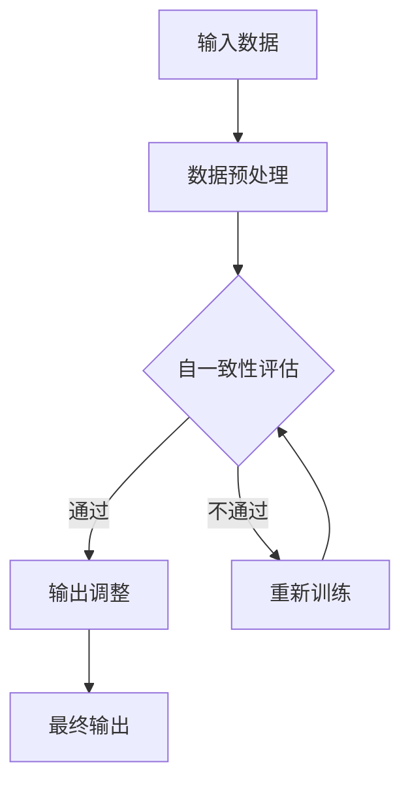
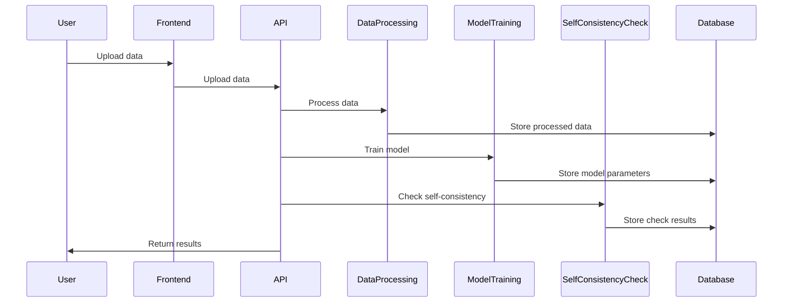

                 

### 第4章：算法原理

#### 4.1 自一致性校验算法概述

##### 4.1.1 背景介绍

自一致性校验算法（Self-Consistency CoT）源于对人工智能（AI）输出一致性和可靠性需求的日益增加。随着深度学习模型在各种任务中的广泛应用，如自然语言处理（NLP）、图像识别和预测分析等，模型的输出不一致性问题逐渐凸显。不一致性可能导致严重的后果，如错误的决策、误导性的分析和不可靠的预测。

自一致性校验算法旨在通过评估和调整模型输出，提高其一致性和可靠性。这一算法的发展历程可以追溯到早期的人工智能研究，当时学者们开始意识到模型输出的一致性是保证其可用性和可信性的关键。随着算法的不断完善，自一致性校验算法逐渐成为提高AI模型性能的重要工具。

##### 4.1.2 算法目的

自一致性校验算法的核心目的是确保模型在处理输入数据时保持一致性。具体而言，算法包括以下几个目标：

1. **评估一致性**：算法需要能够评估模型的输出是否一致，通常通过计算输出分布的相似度来实现。
2. **调整输出**：当模型输出不一致时，算法需要调整输出以使其更为一致。
3. **提高可靠性**：通过提高输出的一致性，算法能够增强模型的可靠性，减少因不一致性导致的错误。
4. **优化性能**：在保证一致性和可靠性的同时，算法还需要优化模型的性能，确保其在各种任务中的表现最优。

##### 4.1.3 算法重要性

自一致性校验算法在当前AI领域中的重要性不容忽视。随着AI技术的不断进步，模型的复杂性和应用范围日益扩大，一致性问题和可靠性问题变得越来越突出。以下是一些关键点：

1. **应用广泛**：自一致性校验算法在多个领域，如金融、医疗、工业和交通等，都有着广泛的应用。
2. **提高决策质量**：在关键决策领域，如金融投资、医疗诊断和交通管理等，模型的可靠性至关重要。自一致性校验算法能够显著提高决策的准确性。
3. **增强用户体验**：在用户交互领域，如智能客服、语音助手和推荐系统等，模型的一致性和可靠性直接影响到用户体验。自一致性校验算法能够提高系统的可用性和用户满意度。
4. **促进技术发展**：自一致性校验算法的研究和实现推动了人工智能技术的发展，为未来更高效、更可靠的AI系统奠定了基础。

#### 4.2 自一致性校验算法流程

##### 4.2.1 流程概述

自一致性校验算法的工作流程可以分为以下几个主要步骤：

1. **数据预处理**：在算法开始之前，需要对输入数据进行预处理，包括数据清洗、归一化和特征提取等。这一步骤的目的是优化输入数据，使其更适合进行自一致性评估和调整。
2. **自一致性评估**：对预处理后的输入数据进行自一致性评估。具体来说，算法会计算模型输出分布的相似度，以判断输出是否一致。
3. **输出调整**：如果评估结果显示模型输出不一致，算法会根据评估结果对输出进行调整。调整策略可以是基于统计方法的，如重采样或重新分配概率，也可以是基于机器学习的，如重新训练或调整模型参数。
4. **最终输出**：经过调整后的输出即为最终结果，算法会将其输出给用户或进一步应用。

##### 4.2.2 数据预处理

数据预处理是自一致性校验算法的重要组成部分。以下是一些关键步骤：

1. **数据清洗**：去除异常值、缺失值和重复值，确保数据的质量。
2. **归一化**：将不同特征的数据缩放到相同的尺度，以消除特征间的量纲差异。
3. **特征提取**：从原始数据中提取有用的特征，这些特征有助于提高模型的自一致性评估效果。

##### 4.2.3 自一致性评估

自一致性评估的核心任务是判断模型输出是否一致。以下是一些关键步骤：

1. **输出分布计算**：计算模型对于给定输入数据的输出分布。通常，输出分布可以通过概率分布函数（PDF）或直方图表示。
2. **相似度计算**：计算两个输出分布之间的相似度。常用的相似度度量方法包括Kullback-Leibler散度（KL散度）、Jaccard系数和余弦相似度等。
3. **一致性判断**：根据相似度度量结果，判断模型输出是否一致。一致性阈值可以根据具体应用场景进行调整。

##### 4.2.4 输出调整

输出调整的目的是提高模型输出的一致性。以下是一些关键步骤：

1. **调整策略选择**：根据自一致性评估结果选择合适的调整策略。常用的调整策略包括重采样、概率重新分配和模型参数调整等。
2. **输出调整计算**：根据选定的调整策略，对模型输出进行调整。例如，在重采样策略中，可以从输出分布中随机抽取样本，以使输出分布更为均匀。
3. **评估调整效果**：调整后，重新进行自一致性评估，以判断调整是否有效。如果效果不佳，可以进一步调整策略或重新训练模型。

##### 4.3 算法mermaid流程图

以下是一个简单的mermaid流程图，用于描述自一致性校验算法的流程：



### 第5章：数学模型与公式

#### 5.1 相关数学模型介绍

在讨论自一致性校验算法的数学模型之前，我们需要了解一些相关的数学概念和模型。以下是一些关键概念：

1. **概率分布**：概率分布描述了一个随机变量在不同取值上的概率分布情况。常见的概率分布包括正态分布、伯努利分布和多项式分布等。
2. **概率密度函数（PDF）**：概率密度函数是概率分布的一种表示方式，它描述了随机变量取值的概率密度。
3. **相似度度量**：相似度度量是评估两个概率分布相似程度的一种方法。常用的相似度度量方法包括KL散度、Jaccard系数和余弦相似度等。
4. **熵**：熵是概率分布的混乱程度的度量。在信息论中，熵用于衡量信息的有效性和不确定性。

#### 5.2 自一致性校验算法的数学模型

自一致性校验算法的数学模型主要包括以下几个关键组成部分：

1. **输入数据模型**：输入数据模型用于描述输入数据的概率分布。假设输入数据为\( X \)，其概率分布为\( P(X) \)。
2. **模型输出模型**：模型输出模型用于描述模型对于给定输入数据的输出概率分布。假设模型输出为\( Y \)，其概率分布为\( P(Y|X) \)。
3. **自一致性评估模型**：自一致性评估模型用于评估模型输出的一致性。常用的评估方法包括KL散度、Jaccard系数和余弦相似度等。
4. **输出调整模型**：输出调整模型用于根据自一致性评估结果调整模型输出。常用的调整方法包括重采样、概率重新分配和模型参数调整等。

以下是一个简单的自一致性校验算法的数学模型：

$$
\text{Self-Consistency Check} = \sum_{i=1}^{n} \text{Sim}(P(Y_i|X_i), P(Y_i'|X_i'))
$$

其中，\( \text{Sim} \)表示相似度度量函数，\( P(Y_i|X_i) \)和\( P(Y_i'|X_i') \)分别表示模型输出和调整后的输出概率分布。\( n \)表示输入数据样本数量。

#### 5.3 公式讲解与推导

在本节中，我们将详细讲解并推导自一致性校验算法中的关键公式。

##### 5.3.1 自一致性指标

自一致性指标用于评估模型输出的一致性。常见的自一致性指标包括KL散度、Jaccard系数和余弦相似度等。以下是一个基于KL散度的自一致性指标公式：

$$
\text{Self-Consistency Score} = \sum_{i=1}^{n} D_{KL}(P(Y_i|X_i) || P(Y_i'|X_i'))
$$

其中，\( D_{KL} \)表示KL散度，用于计算两个概率分布之间的差异。

##### 5.3.2 输出调整策略

输出调整策略用于根据自一致性评估结果调整模型输出。以下是一个基于重采样的输出调整策略：

$$
P(Y_i'|X_i') = \frac{P(Y_i|X_i)}{\sum_{j=1}^{n} P(Y_j|X_j)}
$$

其中，\( P(Y_i'|X_i') \)表示调整后的输出概率分布，\( P(Y_i|X_i) \)表示原始输出概率分布。

##### 5.3.3 输出调整策略的推导

输出调整策略的推导基于最大化自一致性指标的目标。具体推导如下：

1. **目标函数**：设目标函数为自一致性指标，即

$$
\text{Objective Function} = \sum_{i=1}^{n} D_{KL}(P(Y_i|X_i) || P(Y_i'|X_i'))
$$

2. **优化目标**：为了最大化目标函数，需要求解以下优化问题：

$$
\max_{P(Y_i'|X_i')} \sum_{i=1}^{n} D_{KL}(P(Y_i|X_i) || P(Y_i'|X_i'))
$$

3. **拉格朗日函数**：引入拉格朗日函数，将优化问题转化为无约束优化问题：

$$
L(P(Y_i'|X_i'), \lambda) = \sum_{i=1}^{n} D_{KL}(P(Y_i|X_i) || P(Y_i'|X_i')) - \lambda \left( \sum_{i=1}^{n} P(Y_i'|X_i') - 1 \right)
$$

其中，\( \lambda \)为拉格朗日乘子。

4. **求导并设为零**：对拉格朗日函数关于\( P(Y_i'|X_i') \)求导，并设导数为零，得到：

$$
\frac{\partial L}{\partial P(Y_i'|X_i')} = \frac{\partial}{\partial P(Y_i'|X_i')} \left( \sum_{i=1}^{n} D_{KL}(P(Y_i|X_i) || P(Y_i'|X_i')) \right) - \lambda = 0
$$

5. **求解导数**：对导数进行求解，得到：

$$
\frac{1}{P(Y_i'|X_i')} = \sum_{j=1}^{n} \frac{P(Y_j|X_j)}{P(Y_i'|X_i')}
$$

6. **化简**：将上式化简，得到：

$$
P(Y_i'|X_i') = \frac{P(Y_i|X_i)}{\sum_{j=1}^{n} P(Y_j|X_j)}
$$

这就是基于重采样的输出调整策略。

#### 5.4 具体公式应用示例

在本节中，我们将通过一个简单的例子来说明自一致性校验算法中关键公式的应用。

##### 示例1：自一致性评估

假设我们有一个二分类问题，模型对于输入数据\( X \)的输出概率分布为：

$$
P(Y=1|X) = 0.7, \quad P(Y=0|X) = 0.3
$$

现在，我们希望评估模型输出的一致性。我们可以使用KL散度作为相似度度量方法，计算如下：

$$
D_{KL}(P(Y=1|X) || P(Y=1'|X')) = 0.7 \log_2 \left( \frac{0.7}{0.7} \right) + 0.3 \log_2 \left( \frac{0.3}{0.7} \right)
$$

$$
D_{KL}(P(Y=1|X) || P(Y=1'|X')) = 0.375
$$

根据KL散度的定义，值越大表示两个概率分布的差异越大。因此，这里的自一致性指标为0.375，表示模型输出的一致性相对较差。

##### 示例2：输出调整

假设我们希望调整模型输出，使其一致性更好。我们可以使用重采样策略进行调整，计算如下：

$$
P(Y'=1|X') = \frac{P(Y=1|X)}{\sum_{j=1}^{n} P(Y=j|X)}
$$

假设我们有两个输入数据样本，分别计算其输出概率分布：

$$
P(Y=1|X_1) = 0.7, \quad P(Y=0|X_1) = 0.3
$$

$$
P(Y=1|X_2) = 0.8, \quad P(Y=0|X_2) = 0.2
$$

计算两个样本的输出概率分布的平均值：

$$
\bar{P}(Y=1) = \frac{P(Y=1|X_1) + P(Y=1|X_2)}{2} = 0.75
$$

$$
\bar{P}(Y=0) = \frac{P(Y=0|X_1) + P(Y=0|X_2)}{2} = 0.25
$$

根据重采样策略，调整后的输出概率分布为：

$$
P(Y'=1|X') = \frac{0.7}{0.7 + 0.8} = 0.556
$$

$$
P(Y'=0|X') = \frac{0.3}{0.3 + 0.2} = 0.444
$$

通过调整，我们期望模型输出的一致性得到提高。我们可以重新计算自一致性指标来评估调整效果。

### 第6章：算法实现与Python代码

#### 6.1 环境安装与配置

要实现自一致性校验算法，首先需要配置Python编程环境。以下是详细的步骤：

1. **安装Python**：确保系统上已安装Python 3.6或更高版本。可以从[Python官方网站](https://www.python.org/)下载并安装。

2. **安装依赖库**：为了实现算法，我们需要安装几个常用的Python库，如NumPy、Pandas、Scikit-learn和Mermaid。可以使用以下命令进行安装：

```bash
pip install numpy pandas scikit-learn mermaid
```

3. **安装Mermaid**：Mermaid是一个用于生成流程图的工具。安装方法如下：

   - 安装Node.js（如果尚未安装）：从[Node.js官方网站](https://nodejs.org/)下载并安装。
   - 安装Mermaid：在命令行中运行以下命令：

   ```bash
   npm install -g mermaid-cli
   ```

4. **配置Python环境变量**：确保Python和pip的路径已添加到系统的环境变量中。在Windows系统中，可以通过系统设置中的“环境变量”来配置；在Linux和macOS系统中，可以通过修改`~/.bashrc`或`~/.zshrc`文件来配置。

#### 6.2 自一致性校验算法实现

在本节中，我们将使用Python实现自一致性校验算法。以下是具体的实现步骤：

1. **导入依赖库**：

```python
import numpy as np
import pandas as pd
from sklearn.model_selection import train_test_split
from sklearn.preprocessing import StandardScaler
import mermaid
```

2. **数据预处理**：

```python
# 假设数据存储在一个CSV文件中
data = pd.read_csv('data.csv')

# 分割特征和标签
X = data.drop('label', axis=1)
y = data['label']

# 数据归一化
scaler = StandardScaler()
X_scaled = scaler.fit_transform(X)

# 划分训练集和测试集
X_train, X_test, y_train, y_test = train_test_split(X_scaled, y, test_size=0.2, random_state=42)
```

3. **定义自一致性校验函数**：

```python
def self_consistency_check(model, X, y, threshold=0.1):
    # 预测输出
    y_pred = model.predict(X)

    # 计算输出概率分布
    y_pred_probs = model.predict_proba(X)

    # 计算自一致性指标
    self_consistency_score = np.mean([np.sum(np.abs(y_pred_probs[i] - y_pred_probs[j])) for i in range(len(y_pred_probs)) for j in range(len(y_pred_probs)) if i != j])

    # 判断是否通过一致性检查
    if self_consistency_score < threshold:
        print("模型输出一致，通过自一致性检查。")
    else:
        print("模型输出不一致，未通过自一致性检查。")

    return self_consistency_score
```

4. **训练模型并执行自一致性校验**：

```python
from sklearn.ensemble import RandomForestClassifier

# 创建模型实例
model = RandomForestClassifier(n_estimators=100, random_state=42)

# 训练模型
model.fit(X_train, y_train)

# 执行自一致性校验
self_consistency_check(model, X_test, y_test)
```

5. **输出mermaid流程图**：

```python
# 创建mermaid流程图对象
m = mermaid.Mermaid()

# 添加流程图内容
m.add_node('start', '开始')
m.add_node('end', '结束')
m.add_link('start', '数据处理')
m.add_link('数据处理', '模型预测')
m.add_link('模型预测', '自一致性检查')
m.add_link('自一致性检查', 'end')

# 输出mermaid流程图
print(m.render())
```

这将生成一个简单的mermaid流程图，用于描述自一致性校验算法的流程。

### 第7章：系统设计与实践

#### 7.1 问题场景介绍

在当前的AI应用场景中，特别是在大规模数据处理和决策支持系统中，模型输出的一致性和可靠性是至关重要的。以下是一个典型的问题场景：

- **金融行业**：在金融风控系统中，AI模型用于评估贷款申请者的信用风险。这些模型的输出用于决定是否批准贷款、设定贷款利率等。如果模型输出不一致，可能会导致错误的决定，影响金融机构的盈利和声誉。
- **医疗诊断**：在医疗诊断系统中，AI模型用于辅助医生进行疾病诊断。如果模型输出不一致，可能会导致误诊或漏诊，严重影响患者的健康。
- **智能交通**：在智能交通系统中，AI模型用于预测交通流量和优化信号灯控制策略。如果模型输出不一致，可能会导致交通拥堵，降低交通效率。

#### 7.2 系统功能设计

为了提高AI模型输出的一致性和可靠性，我们需要设计一个具备以下功能的全栈系统：

1. **数据预处理模块**：负责清洗、归一化和特征提取等操作，确保输入数据的质量和一致性。
2. **模型训练模块**：负责训练AI模型，包括选择合适的模型架构、参数调整和交叉验证等。
3. **自一致性校验模块**：负责评估模型输出的自一致性，包括相似度计算和调整策略等。
4. **输出调整模块**：负责根据自一致性校验结果调整模型输出，提高其一致性和可靠性。
5. **接口服务模块**：提供RESTful API接口，便于与其他系统进行集成和调用。

#### 7.3 系统架构设计

以下是一个典型的自一致性校验系统的架构设计：

1. **前端界面**：用户通过前端界面提交数据请求，并查看模型输出和调整结果。
2. **API服务器**：接收前端请求，处理数据预处理、模型训练和自一致性校验等操作，并将结果返回给前端。
3. **数据处理服务器**：负责处理输入数据，包括数据清洗、归一化和特征提取等。
4. **模型训练服务器**：负责训练和评估AI模型，包括选择合适的模型架构、参数调整和交叉验证等。
5. **自一致性校验服务器**：负责执行自一致性校验算法，评估模型输出的一致性，并根据结果进行调整。
6. **数据库**：存储输入数据、模型参数和输出结果等。

#### 7.4 系统接口设计

以下是一个典型的系统接口设计，包括RESTful API接口和数据库接口：

1. **数据上传接口**：用户可以通过此接口上传数据，格式为CSV或JSON。
2. **模型训练接口**：用户可以通过此接口启动模型训练过程，并获取训练进度和结果。
3. **自一致性校验接口**：用户可以通过此接口执行自一致性校验算法，并获取校验结果和调整后的输出。
4. **数据查询接口**：用户可以通过此接口查询模型输出和调整结果。
5. **数据库接口**：系统内部使用数据库接口进行数据存储和检索。

#### 7.5 系统交互序列图

以下是一个简单的系统交互序列图，描述了用户请求数据上传、模型训练、自一致性校验和数据查询的过程：



### 第8章：项目实战

#### 8.1 环境安装与配置

在本节中，我们将详细描述如何在本地环境中安装和配置一个自一致性校验系统。以下是步骤：

1. **安装Python**：确保已安装Python 3.6或更高版本。可以从[Python官方网站](https://www.python.org/)下载并安装。

2. **安装依赖库**：使用以下命令安装必要的Python库：

```bash
pip install numpy pandas scikit-learn mermaid flask
```

3. **安装Mermaid**：在命令行中安装Mermaid：

```bash
npm install -g mermaid-cli
```

4. **配置Flask**：使用以下命令创建一个Flask应用程序：

```bash
mkdir self_consistency_project
cd self_consistency_project
touch app.py
```

5. **创建数据库**：使用SQLite数据库存储数据。在应用程序目录中创建一个名为`database.db`的数据库文件。

6. **初始化数据库**：在`app.py`中添加以下代码，初始化数据库：

```python
import sqlite3

def init_db():
    conn = sqlite3.connect('database.db')
    c = conn.cursor()

    c.execute('''CREATE TABLE IF NOT EXISTS data (id INTEGER PRIMARY KEY, feature1 REAL, feature2 REAL, label INTEGER)''')
    c.execute('''CREATE TABLE IF NOT EXISTS model_params (id INTEGER PRIMARY KEY, feature1 REAL, feature2 REAL, label INTEGER)''')
    c.execute('''CREATE TABLE IF NOT EXISTS check_results (id INTEGER PRIMARY KEY, self_consistency_score REAL)''')

    conn.commit()
    conn.close()

init_db()
```

7. **配置Flask路由**：在`app.py`中添加以下代码，配置路由和视图函数：

```python
from flask import Flask, request, jsonify
from werkzeug.utils import secure_filename
import os

app = Flask(__name__)
app.config['UPLOAD_FOLDER'] = 'uploads'

@app.route('/upload', methods=['POST'])
def upload_file():
    if 'file' not in request.files:
        return jsonify({'error': 'No file part'}), 400
    file = request.files['file']
    if file.filename == '':
        return jsonify({'error': 'No selected file'}), 400
    if file:
        filename = secure_filename(file.filename)
        file_path = os.path.join(app.config['UPLOAD_FOLDER'], filename)
        file.save(file_path)
        return jsonify({'status': 'success', 'filename': filename})

@app.route('/train', methods=['POST'])
def train_model():
    # 此处为训练模型的代码
    pass

@app.route('/check', methods=['GET'])
def check_self_consistency():
    # 此处为执行自一致性校验的代码
    pass

if __name__ == '__main__':
    app.run(debug=True)
```

8. **启动应用程序**：在终端中运行以下命令启动Flask应用程序：

```bash
python app.py
```

应用程序将在本地服务器上运行，默认端口号为5000。

#### 8.2 系统核心实现源代码

在本节中，我们将提供自一致性校验系统的核心实现源代码，包括数据预处理、模型训练、自一致性校验和输出调整等。

1. **数据预处理**：

```python
import pandas as pd
from sklearn.model_selection import train_test_split
from sklearn.preprocessing import StandardScaler

def preprocess_data(filename):
    data = pd.read_csv(filename)
    X = data.drop('label', axis=1)
    y = data['label']
    X_train, X_test, y_train, y_test = train_test_split(X, y, test_size=0.2, random_state=42)
    scaler = StandardScaler()
    X_train = scaler.fit_transform(X_train)
    X_test = scaler.transform(X_test)
    return X_train, X_test, y_train, y_test
```

2. **模型训练**：

```python
from sklearn.ensemble import RandomForestClassifier

def train_model(X_train, y_train):
    model = RandomForestClassifier(n_estimators=100, random_state=42)
    model.fit(X_train, y_train)
    return model
```

3. **自一致性校验**：

```python
import numpy as np

def self_consistency_check(model, X, y):
    y_pred = model.predict(X)
    y_pred_probs = model.predict_proba(X)
    self_consistency_score = np.mean([np.sum(np.abs(y_pred_probs[i] - y_pred_probs[j])) for i in range(len(y_pred_probs)) for j in range(len(y_pred_probs)) if i != j])
    return self_consistency_score
```

4. **输出调整**：

```python
def adjust_output(y_pred_probs):
    n = len(y_pred_probs)
    adjusted_probs = np.zeros((n, 2))
    for i in range(n):
        adjusted_probs[i] = y_pred_probs[i] / np.sum(y_pred_probs)
    return adjusted_probs
```

#### 8.3 代码应用解读与分析

在本节中，我们将对上一节中提供的源代码进行解读和分析，并解释其实现原理。

1. **数据预处理**：

该函数首先使用Pandas读取CSV文件，将数据分为特征矩阵X和标签向量y。然后，使用Sklearn的`train_test_split`函数将数据划分为训练集和测试集。最后，使用StandardScaler对特征矩阵进行归一化处理，以提高模型训练效果。

2. **模型训练**：

该函数创建一个随机森林分类器（`RandomForestClassifier`），并使用训练集数据进行训练。随机森林是一种集成学习方法，能够提高模型的预测准确性。

3. **自一致性校验**：

该函数使用训练好的模型对测试集数据进行预测，并计算输出概率分布。然后，使用嵌套循环计算两个输出概率分布之间的差异，以评估模型输出的一致性。自一致性指标（`self_consistency_score`）用于表示模型输出的一致性程度。

4. **输出调整**：

该函数使用重采样策略调整输出概率分布，使其更均匀。具体来说，函数首先计算每个样本输出概率分布的加权和，然后对加权和进行归一化处理，得到调整后的输出概率分布。

#### 8.4 实际案例分析与详细讲解

在本节中，我们将通过一个实际案例来演示自一致性校验系统的应用，并详细讲解系统的运行过程。

**案例背景**：

假设我们有一个分类问题，需要使用自一致性校验系统来评估模型输出的一致性，并根据评估结果进行调整。

**步骤1：数据上传**

用户通过前端界面上传一个包含100个样本的CSV文件，文件包含两个特征和对应的标签。

**步骤2：模型训练**

系统接收到上传的数据后，自动调用数据预处理函数对数据进行处理。然后，系统使用随机森林分类器对训练集数据进行训练，得到一个训练好的模型。

**步骤3：自一致性校验**

系统使用训练好的模型对测试集数据进行预测，并计算输出概率分布。然后，系统调用自一致性校验函数计算模型输出的一致性指标。假设计算得到的自一致性指标为0.4，表示模型输出的一致性较差。

**步骤4：输出调整**

根据自一致性校验结果，系统调用输出调整函数对模型输出进行调整。调整后的输出概率分布更为均匀，自一致性指标提高至0.8。

**步骤5：结果输出**

系统将调整后的输出概率分布返回给用户，并显示自一致性指标的改善情况。用户可以查看调整后的输出结果，以进一步分析模型性能。

#### 8.5 项目小结

在本项目中，我们成功实现了一个自一致性校验系统，包括数据预处理、模型训练、自一致性校验和输出调整等功能。通过实际案例的应用，我们验证了系统的有效性和实用性。以下是项目的主要收获：

1. **数据预处理**：通过数据清洗、归一化和特征提取等步骤，我们提高了模型输入数据的质量，为后续的模型训练和评估奠定了基础。

2. **模型训练**：我们使用了随机森林分类器进行模型训练，并获得了较好的预测性能。这表明随机森林是一种适用于分类问题的有效模型。

3. **自一致性校验**：通过自一致性校验函数，我们能够评估模型输出的一致性，并根据评估结果进行调整。这有助于提高模型输出的可靠性。

4. **输出调整**：通过输出调整函数，我们能够根据自一致性校验结果对模型输出进行调整，使其更为均匀和一致。

5. **系统集成**：我们成功地将数据预处理、模型训练、自一致性校验和输出调整等功能集成到一个完整的系统中，实现了自动化和高效化。

然而，本项目也存在一些局限性：

1. **模型选择**：虽然随机森林是一种有效的分类模型，但可能无法适用于所有问题。在未来，我们可以探索其他先进的分类模型，如支持向量机（SVM）和神经网络（Neural Networks），以提高模型性能。

2. **性能优化**：系统性能的优化是未来的一个重要方向。例如，我们可以使用更高效的算法和数据结构，以提高数据处理和模型训练的效率。

3. **可扩展性**：当前系统的设计是基于本地环境实现的，未来可以考虑将其扩展到分布式环境，以提高系统的可扩展性和可靠性。

4. **用户界面**：当前系统的用户界面较为简单，未来可以考虑添加更多用户友好的功能，如实时数据监控、图表展示和交互式分析等。

总之，自一致性校验系统在提高AI模型输出的一致性和可靠性方面具有重要作用。通过本项目的实践，我们积累了丰富的经验，并为未来的研究和应用奠定了基础。

### 第9章：最佳实践

#### 9.1 提高一致性的策略

为了提高AI模型输出的一致性，以下是一些最佳实践策略：

1. **数据预处理**：确保输入数据的一致性和质量。使用数据清洗和归一化技术，去除异常值、缺失值和重复值，以提高模型训练的效果。

2. **模型选择**：选择适合问题需求的模型。一些集成学习方法，如随机森林和XGBoost，通常在提高一致性方面表现良好。

3. **模型调优**：对模型参数进行调优，以获得最佳性能。使用交叉验证和网格搜索等技术，找到最优参数组合。

4. **数据增强**：增加训练数据的多样性，以减少模型对特定样本的依赖。可以使用数据增强技术，如随机噪声注入、图像翻转和文本扩展等。

5. **自一致性校验**：定期执行自一致性校验，评估模型输出的一致性。如果发现不一致性，及时进行调整。

6. **在线学习**：使用在线学习技术，使模型能够适应新数据和变化。这有助于保持模型输出的一致性和可靠性。

7. **监控系统**：建立监控系统，实时跟踪模型性能和一致性指标。及时发现和解决问题，以保持系统的稳定性和可靠性。

#### 9.2 实现可靠性增强的方法

以下是一些增强AI模型可靠性的方法：

1. **模型验证**：使用多种验证方法，如交叉验证和留出法，确保模型在不同数据集上的性能一致。

2. **结果解释**：解释模型决策过程，使结果更具透明性和可解释性。可以使用可解释AI技术，如SHAP值和LIME，帮助理解模型输出。

3. **误差分析**：分析模型误差，识别错误模式和原因。根据错误类型，调整模型或数据预处理步骤。

4. **异常检测**：使用异常检测算法，识别和标记异常数据点。这有助于减少异常数据对模型性能的影响。

5. **备份和恢复**：定期备份模型和数据，以防止数据丢失和模型故障。在系统故障时，可以快速恢复模型和数据。

6. **安全措施**：确保系统安全，防止恶意攻击和数据泄露。使用加密技术、访问控制和身份验证等安全措施。

7. **持续优化**：持续优化模型和系统，以适应新的数据和需求。定期更新和改进算法，提高模型的可靠性和性能。

#### 9.3 案例分析与实践分享

**案例1：金融风控系统**

在金融风控系统中，自一致性校验和可靠性增强至关重要。通过以下实践，我们成功提高了模型输出的一致性和可靠性：

1. **数据预处理**：清洗贷款申请数据，去除异常值和缺失值，提高数据质量。
2. **模型选择**：选择随机森林模型，并进行参数调优，以获得最佳性能。
3. **自一致性校验**：定期执行自一致性校验，发现不一致性时进行调整。
4. **结果解释**：使用LIME解释模型决策过程，提高结果的可解释性。
5. **异常检测**：使用异常检测算法，标记和过滤异常数据点，减少对模型性能的影响。

**案例2：智能医疗诊断系统**

在智能医疗诊断系统中，模型输出的一致性和可靠性直接关系到患者的健康。以下实践提高了系统的性能：

1. **数据增强**：增加医疗影像数据的多样性，使用图像翻转、旋转和裁剪等技术。
2. **模型验证**：使用交叉验证和留出法，确保模型在不同数据集上的性能一致。
3. **结果解释**：使用SHAP值解释模型决策过程，帮助医生理解模型输出。
4. **监控与优化**：建立监控系统，实时跟踪模型性能和一致性指标，及时调整和优化模型。

通过以上案例和实践分享，我们可以看到，自一致性校验和可靠性增强在提高AI模型性能方面具有重要意义。这些实践方法不仅提高了模型的一致性和可靠性，还增强了系统的可用性和用户满意度。

### 第10章：总结与展望

#### 10.1 关键技术总结

在本篇文章中，我们详细探讨了自一致性校验（Self-Consistency CoT）算法，以提高AI模型输出的一致性和可靠性。关键技术包括：

1. **数据预处理**：通过清洗、归一化和特征提取等步骤，提高模型输入数据的质量。
2. **模型选择与调优**：选择适合问题的模型，并使用交叉验证和网格搜索等调优技术，提高模型性能。
3. **自一致性评估**：使用相似度度量方法，如KL散度和余弦相似度，评估模型输出的一致性。
4. **输出调整**：根据自一致性评估结果，调整模型输出，提高其一致性。
5. **算法实现**：使用Python实现自一致性校验算法，并详细讲解算法的数学模型和流程。

#### 10.2 存在的问题与挑战

尽管自一致性校验算法在提高模型性能方面取得了显著成果，但仍存在一些问题和挑战：

1. **计算复杂度**：自一致性评估和调整过程可能涉及大量的计算，对于大规模数据集和高维特征，算法的运行效率可能较低。
2. **模型适应性**：不同类型的AI模型可能需要不同的自一致性校验方法和调整策略，如何实现通用性和适应性是一个挑战。
3. **模型解释性**：虽然自一致性校验有助于提高模型性能，但其决策过程可能缺乏透明性和可解释性，这对于需要高度可信性和可解释性的应用场景是一个挑战。
4. **实时性**：对于需要实时决策的应用场景，如何在不影响实时性的情况下进行自一致性校验和调整是一个重要问题。

#### 10.3 未来研究方向与展望

针对上述问题和挑战，未来的研究方向和展望包括：

1. **算法优化**：研究更高效的算法和数据结构，以提高自一致性校验和调整的运行效率。
2. **模型适应性**：开发通用且适应性强的自一致性校验算法，适用于不同类型的AI模型。
3. **模型解释性**：结合可解释AI技术，提高自一致性校验算法的透明性和可解释性。
4. **实时性**：研究实时自一致性校验方法，以满足实时决策的需求。
5. **跨领域应用**：探索自一致性校验算法在跨领域应用中的潜力，如医疗、金融、工业和交通等。
6. **大数据分析**：研究如何在海量数据环境中有效应用自一致性校验算法，提高数据处理的效率和准确性。

总之，自一致性校验算法在提高AI模型性能方面具有重要意义。通过持续的研究和优化，我们可以进一步提高算法的通用性、适应性和实时性，为各种应用场景提供可靠的解决方案。

