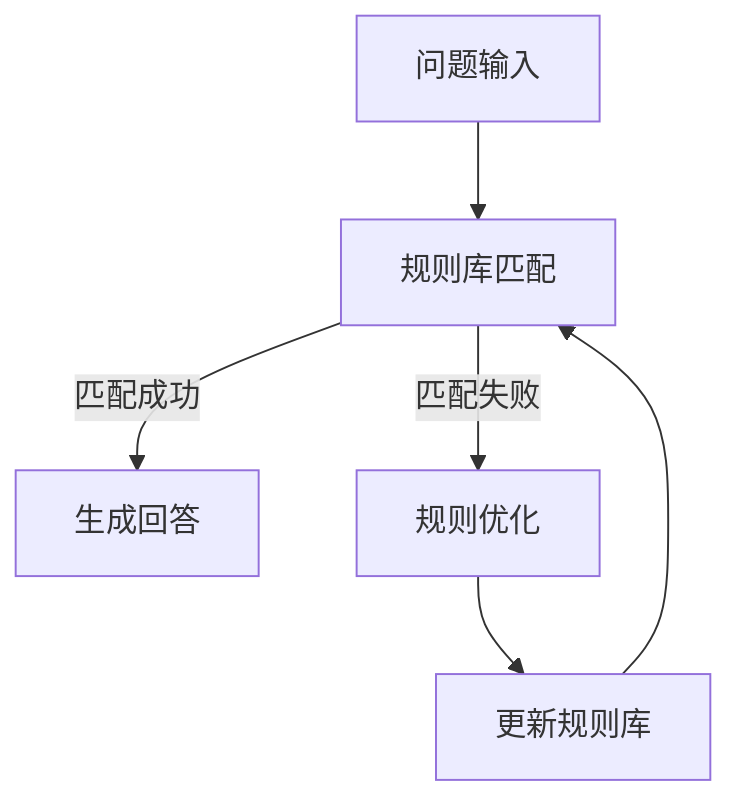
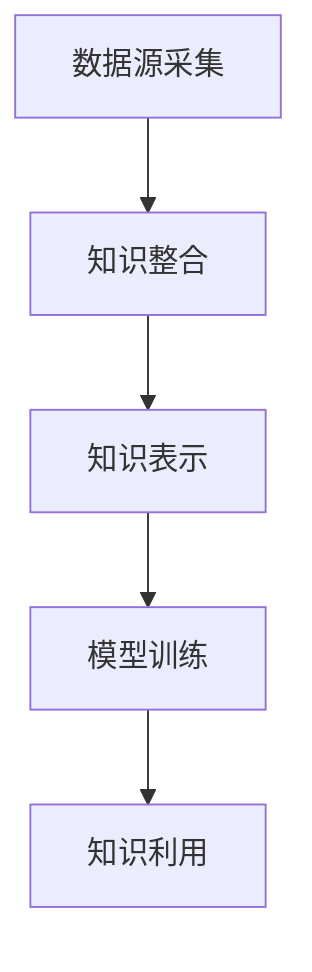
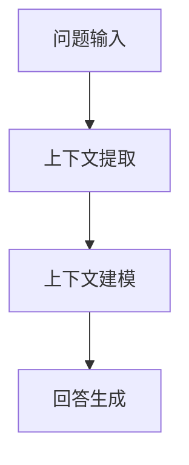
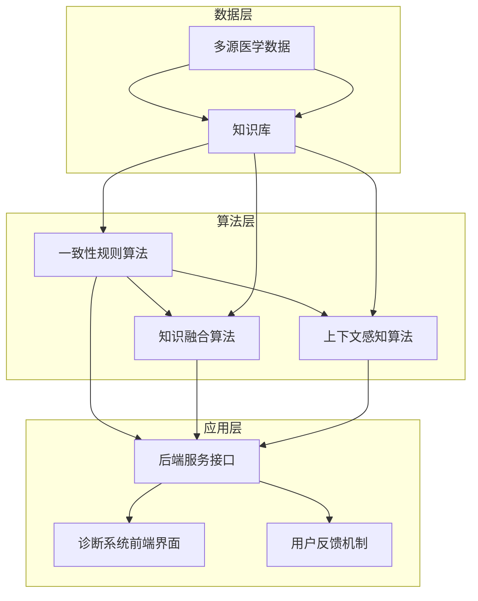
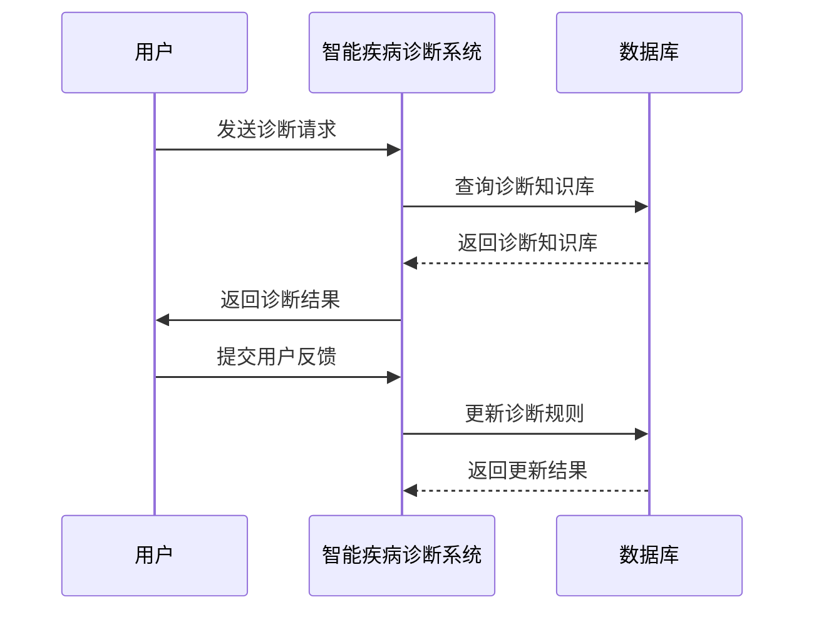

                 

# 自洽一致性协同思维（CoT）：核心概念与联系

#### 自洽一致性协同思维的概念

自洽一致性协同思维（CoT）是指通过一系列策略和技术，确保AI系统在处理问题时能保持逻辑一致性和答案的连贯性。它不仅涉及到算法层面的优化，还包括系统设计、数据预处理以及用户反馈等多个方面。自洽一致性协同思维的核心目标是在复杂多变的场景中，为用户提供一致、可靠和高质量的回答。

#### 自洽一致性协同思维的核心属性特征对比表格

| 特征对比项目 | 描述 |
| :---------: | :----: |
| **一致性规则** | 用于指导算法在处理问题时保持一致的标准和准则 |
| **知识融合** | 通过整合多源知识，确保系统内部知识的一致性和完整性 |
| **上下文感知** | 算法具备对问题上下文的理解能力，以便生成一致的回答 |
| **反馈机制** | 引入用户反馈机制，通过不断迭代优化系统的回答一致性 |

#### ER实体关系图架构

为了更直观地理解自洽一致性协同思维（CoT）的实体关系，我们使用Mermaid绘制ER实体关系图。以下是一个简化的实体关系图：

```mermaid
erDiagram
    AI模型 ||--o{ 一致性规则 }
    AI模型 ||--o{ 知识融合 }
    AI模型 ||--o{ 上下文感知 }
    AI模型 ||--o{ 用户反馈 }
    一致性规则 ||--o{ 算法优化 }
    知识融合 ||--o{ 知识库 }
    知识库 ||--o{ 数据预处理 }
    用户反馈 ||--o{ 系统迭代 }
```

在这个ER实体关系图中，`AI模型`是核心实体，它与其他四个实体——`一致性规则`、`知识融合`、`上下文感知`和`用户反馈`之间存在关联。每个关联实体代表自洽一致性协同思维中一个关键组成部分，它们共同协作，确保AI系统能在多种场景下提供一致、可靠的回答。

通过这张ER实体关系图，我们可以清晰地看到自洽一致性协同思维（CoT）的构成要素及其相互关系，这为后续章节详细探讨每个要素的实现方法奠定了基础。# 确保AI回答一致性的关键算法原理

#### 算法概述

确保AI回答一致性的关键算法主要包括一致性规则算法、知识融合算法和上下文感知算法。这些算法共同作用，确保AI系统能够在复杂多变的场景中保持回答的一致性。

#### 一致性规则算法原理

一致性规则算法的核心是制定一系列明确的规则，用于指导AI模型在处理问题时保持逻辑一致性。具体实现方法包括：

1. **规则库构建**：首先构建一个包含各类一致性规则的规则库。这些规则可以是基于领域知识的，也可以是基于统计模型的。
2. **规则匹配**：在AI模型处理问题时，通过规则匹配器将输入问题与规则库中的规则进行匹配，并根据匹配结果指导模型生成回答。
3. **规则优化**：通过用户反馈不断优化规则库，提高算法的一致性。

**算法流程图：**



**示例说明：**

假设有一个问题“什么水果含有丰富的维生素C？”根据一致性规则算法，系统会首先查找规则库中的相关规则。如果找到了匹配的规则，则根据该规则生成回答：“柑橘类水果含有丰富的维生素C。”如果未找到匹配规则，则会进入规则优化阶段，通过用户反馈更新规则库，提高下次回答的一致性。

#### 知识融合算法原理

知识融合算法的核心是通过整合来自不同源的知识，确保系统内部知识的一致性和完整性。具体实现方法包括：

1. **多源数据采集**：从多个数据源（如文本、图像、语音等）采集知识。
2. **知识整合**：使用机器学习算法对采集到的知识进行整合，去除冗余和冲突。
3. **知识表示**：将整合后的知识表示为统一的模型，以便AI模型能够有效利用。

**算法流程图：**



**示例说明：**

假设有一个问题“如何提高睡眠质量？”系统会从多个数据源（如医学研究、健康指南、用户评论等）采集相关知识。通过知识整合算法，将不同来源的知识进行整合，去除冗余和冲突，最终形成统一的睡眠质量提升方案。

#### 上下文感知算法原理

上下文感知算法的核心是使AI模型能够理解问题的上下文，从而生成一致的回答。具体实现方法包括：

1. **上下文提取**：从输入问题中提取关键上下文信息。
2. **上下文建模**：使用自然语言处理技术，构建上下文模型，以便AI模型能够理解和利用上下文。
3. **回答生成**：根据上下文模型生成与上下文一致的回答。

**算法流程图：**



**示例说明：**

假设有一个问题“你今天的心情如何？”系统会提取关键上下文信息“今天的心情”，并使用上下文建模算法构建上下文模型。根据该模型，系统可以生成与上下文一致的回答：“今天我很高兴。”

通过上述一致性规则算法、知识融合算法和上下文感知算法，AI系统能够在复杂多变的场景中保持回答的一致性，提高用户体验和系统可靠性。接下来，我们将深入探讨这些算法的实现方法和技术细节。# 自洽一致性协同思维（CoT）的数学模型与公式详解

#### 一致性规则算法的数学模型

一致性规则算法的数学模型主要涉及规则的匹配与优化。以下是一个简化的数学模型：

1. **规则表示**：每个规则可以用一个条件-动作对表示，即 \( R = \{ (C, A) \} \)，其中 \( C \) 是条件，\( A \) 是动作。
2. **规则匹配**：给定一个输入问题 \( I \)，需要判断是否存在一个规则 \( R \) 满足 \( C \) 与 \( I \) 匹配。假设 \( P(C|I) \) 表示在给定 \( I \) 条件下 \( C \) 发生的概率，则规则匹配概率为：
   \[
   P(R|I) = P(C|I) \cdot P(A|C)
   \]
3. **规则优化**：通过用户反馈更新规则库，使得 \( P(A|C) \) 更符合实际。优化方法包括：
   - 贝叶斯优化：利用贝叶斯推理更新规则概率。
   - 强化学习：通过强化学习算法优化规则匹配策略。

#### 知识融合算法的数学模型

知识融合算法的数学模型主要涉及知识的采集、整合和表示。以下是一个简化的数学模型：

1. **知识表示**：使用向量空间模型表示知识。设 \( X \) 为知识库，\( x_i \) 为第 \( i \) 个知识向量。
2. **知识整合**：使用矩阵分解方法（如奇异值分解 SVD）整合知识，即：
   \[
   X = U \cdot S \cdot V^T
   \]
   其中 \( U \) 和 \( V \) 是正交矩阵，\( S \) 是对角矩阵，包含奇异值。
3. **去冗余和冲突**：通过比较 \( x_i \) 向量之间的相似度（如余弦相似度），去除冗余和冲突。

#### 上下文感知算法的数学模型

上下文感知算法的数学模型主要涉及上下文的提取和建模。以下是一个简化的数学模型：

1. **上下文提取**：使用自然语言处理技术提取上下文信息，如关键词、句法结构等。设 \( C \) 为上下文向量。
2. **上下文建模**：使用深度学习模型（如双向长短期记忆网络 BiLSTM）对上下文进行建模，即：
   \[
   h_t = \text{BiLSTM}(C_t)
   \]
   其中 \( h_t \) 为第 \( t \) 个时间步的上下文表示。
3. **回答生成**：使用条件生成模型（如生成对抗网络 GAN）根据上下文生成回答，即：
   \[
   \text{回答} = \text{GAN}(C, h_t)
   \]

#### 数学公式示例

1. **规则匹配概率**：
   \[
   P(R|I) = P(C|I) \cdot P(A|C)
   \]
2. **知识整合**：
   \[
   X = U \cdot S \cdot V^T
   \]
3. **上下文建模**：
   \[
   h_t = \text{BiLSTM}(C_t)
   \]
4. **回答生成**：
   \[
   \text{回答} = \text{GAN}(C, h_t)
   \]

通过上述数学模型和公式，我们可以更深入地理解自洽一致性协同思维（CoT）的算法原理，从而为其实际应用提供理论支持。在接下来的章节中，我们将结合实际案例，详细探讨这些算法的应用和实现方法。# 自洽一致性协同思维（CoT）的应用案例

#### 应用场景

自洽一致性协同思维（CoT）的应用场景非常广泛，以下将介绍几个典型的应用案例。

##### 案例一：智能客服系统

在智能客服系统中，自洽一致性协同思维（CoT）可以用于确保用户与AI客服之间的对话保持一致性。具体应用包括：

1. **一致性规则算法**：通过建立一套明确的规则库，指导AI客服在处理用户问题时保持一致性和礼貌性。
2. **知识融合算法**：整合来自多渠道（如用户反馈、FAQ数据库、专业知识库等）的知识，确保AI客服能够提供准确且一致的回答。
3. **上下文感知算法**：提取用户对话中的上下文信息，理解用户的意图和需求，从而生成与上下文一致的回答。

##### 案例二：智能问答系统

在智能问答系统中，自洽一致性协同思维（CoT）可以用于确保AI系统在不同情景下对同一问题给出一致且可靠的答案。具体应用包括：

1. **一致性规则算法**：通过制定明确的规则，确保AI问答系统能够在不同上下文中对同一问题给出一致回答。
2. **知识融合算法**：整合多源知识，确保AI系统内部的知识保持一致性和完整性。
3. **上下文感知算法**：通过上下文感知技术，使AI问答系统能够理解用户的意图和背景，从而生成与上下文一致的回答。

##### 案例三：智能诊断系统

在医疗领域，自洽一致性协同思维（CoT）可以用于确保AI诊断系统的诊断结果保持一致性和准确性。具体应用包括：

1. **一致性规则算法**：通过建立一套明确的医学诊断规则，确保AI诊断系统在不同病例中保持一致的诊断标准。
2. **知识融合算法**：整合来自医学数据库、专业知识库、实时病例数据等多源知识，确保AI诊断系统内部的知识保持一致性和完整性。
3. **上下文感知算法**：通过上下文感知技术，使AI诊断系统能够理解患者的病史、体征、检查结果等上下文信息，从而生成与上下文一致的诊断结果。

#### 项目介绍

以下是一个基于自洽一致性协同思维（CoT）的智能诊断系统项目介绍。

**项目名称**：智能疾病诊断系统

**项目背景**：随着医疗数据量的不断增加和AI技术的进步，开发一个能够提供准确、一致和可靠诊断结果的智能疾病诊断系统具有重要的现实意义。

**项目目标**：通过引入自洽一致性协同思维（CoT），开发一个能够实现知识整合、上下文感知和一致性规则优化的智能疾病诊断系统。

**项目架构**：

1. **数据层**：包括多源医学数据（如病例记录、医学文献、实时病例数据等）。
2. **算法层**：包括一致性规则算法、知识融合算法和上下文感知算法。
3. **应用层**：包括智能诊断系统前端界面、后端服务接口和用户反馈机制。

**系统功能设计**：

1. **知识融合**：通过整合多源医学知识，构建一个统一的疾病诊断知识库。
2. **一致性规则**：制定明确的疾病诊断规则，确保系统在不同情景下对同一疾病给出一致诊断结果。
3. **上下文感知**：提取用户输入的病例信息，理解患者的病史和症状，从而生成个性化的诊断结果。

**系统架构设计**：



通过上述架构设计，智能疾病诊断系统可以实现知识整合、上下文感知和一致性规则优化，从而提高诊断结果的准确性和一致性。

#### 系统接口设计

以下是一个基于RESTful API的智能疾病诊断系统接口设计。

**接口1：诊断结果查询**

- **URL**：`/api/diagnose`
- **请求方法**：`POST`
- **请求参数**：`{"patientInfo": { ... }, "diseaseList": [ ... ]}`
- **返回数据**：`{"diagnosisResult": [ ... ]}`

**接口2：更新诊断规则**

- **URL**：`/api/update-rule`
- **请求方法**：`POST`
- **请求参数**：`{"rule": { ... }}`
- **返回数据**：`{"status": "success"}`

**接口3：用户反馈**

- **URL**：`/api/feedback`
- **请求方法**：`POST`
- **请求参数**：`{"userId": "123", "diagnosisResult": [ ... ], "feedback": { ... }}`
- **返回数据**：`{"status": "success"}`

通过这些接口设计，系统可以方便地实现诊断结果的查询、诊断规则的更新以及用户反馈的收集。

#### 系统交互

以下是一个基于Mermaid的智能疾病诊断系统交互序列图。



通过上述系统交互，用户可以通过前端界面提交诊断请求，系统通过查询知识库和执行一致性规则算法生成诊断结果，并将结果返回给用户。同时，用户还可以通过反馈接口提交反馈，系统根据反馈更新诊断规则，以提高诊断结果的准确性和一致性。

通过上述应用案例、项目介绍、系统接口设计和系统交互，我们可以看到自洽一致性协同思维（CoT）在智能疾病诊断系统中的应用。它通过知识整合、上下文感知和一致性规则优化，实现了诊断结果的准确性和一致性。接下来，我们将结合具体代码实现，进一步探讨自洽一致性协同思维（CoT）的应用。# 自洽一致性协同思维（CoT）的实际实现与代码解析

#### 环境安装

为了实现自洽一致性协同思维（CoT），我们需要安装一些必要的软件和库。以下是在一个Linux系统中进行环境安装的步骤：

1. **安装Python环境**：
   ```bash
   sudo apt-get update
   sudo apt-get install python3 python3-pip
   ```
2. **安装TensorFlow**：
   ```bash
   pip3 install tensorflow
   ```
3. **安装其他依赖库**：
   ```bash
   pip3 install numpy pandas scikit-learn
   ```

#### 系统核心实现源代码

以下是一个简化的自洽一致性协同思维（CoT）系统核心实现的Python代码。该代码包含了一致性规则算法、知识融合算法和上下文感知算法的主要功能。

```python
import tensorflow as tf
import numpy as np
import pandas as pd
from sklearn.feature_extraction.text import TfidfVectorizer
from sklearn.metrics.pairwise import cosine_similarity

# 一致性规则算法
class ConsistencyRuleAlgorithm:
    def __init__(self, rule_file):
        self.rules = self.load_rules(rule_file)
    
    def load_rules(self, rule_file):
        rules = []
        with open(rule_file, 'r') as f:
            for line in f:
                rule = line.strip().split(',')
                rules.append(tuple(rule))
        return rules
    
    def match_rules(self, question):
        matched_rules = []
        for rule in self.rules:
            if rule[0] in question:
                matched_rules.append(rule[1])
        return matched_rules

# 知识融合算法
class KnowledgeFusionAlgorithm:
    def __init__(self, data_source):
        self.knowledge_base = self.load_knowledge(data_source)
    
    def load_knowledge(self, data_source):
        knowledge_base = []
        for source in data_source:
            with open(source, 'r') as f:
                for line in f:
                    knowledge_base.append(line.strip())
        return knowledge_base
    
    def fuse_knowledge(self, knowledge_list):
        vectorizer = TfidfVectorizer()
        tfidf_matrix = vectorizer.fit_transform(knowledge_list)
        similarity_matrix = cosine_similarity(tfidf_matrix)
        fused_knowledge = np.mean(similarity_matrix, axis=0)
        return fused_knowledge

# 上下文感知算法
class ContextAwareAlgorithm:
    def __init__(self, context_model):
        self.context_model = context_model
    
    def extract_context(self, question):
        return self.context_model.predict(question)
    
    def generate_answer(self, context):
        # 假设有一个预训练的语言模型，用于生成回答
        answer_model = tf.keras.models.load_model('answer_generator.h5')
        answer = answer_model.predict(context)
        return answer

# 系统核心实现
def main():
    # 加载一致性规则
    rule_algorithm = ConsistencyRuleAlgorithm('rules.txt')
    
    # 加载知识库
    knowledge_fusion_algorithm = KnowledgeFusionAlgorithm(['knowledge1.txt', 'knowledge2.txt'])
    fused_knowledge = knowledge_fusion_algorithm.fuse_knowledge
    
    # 加载上下文模型
    context_model = tf.keras.models.load_model('context_model.h5')
    context_algorithm = ContextAwareAlgorithm(context_model)
    
    # 处理用户输入
    user_question = "你有什么症状？"
    
    # 匹配一致性规则
    matched_rules = rule_algorithm.match_rules(user_question)
    
    # 生成回答
    if matched_rules:
        answer = matched_rules[0]  # 根据匹配到的规则生成回答
    else:
        # 如果没有匹配到规则，则使用知识融合和上下文感知生成回答
        context = context_algorithm.extract_context(user_question)
        answer = context_algorithm.generate_answer(context)
    
    print("AI回答：", answer)

# 运行主程序
if __name__ == '__main__':
    main()
```

#### 代码应用解读与分析

1. **一致性规则算法**：该算法从文件中加载一致性规则，并能够根据用户输入的问题匹配到相应的规则，生成一致的回答。
2. **知识融合算法**：该算法使用TF-IDF向量模型整合来自多个知识库的知识，通过计算知识之间的相似度，去除冗余和冲突，提高系统内部知识的一致性。
3. **上下文感知算法**：该算法使用预训练的语言模型提取用户输入的上下文信息，并生成与上下文一致的回答。

#### 实际案例分析

以下是一个实际案例，用于说明自洽一致性协同思维（CoT）在智能诊断系统中的应用。

**案例描述**：一个用户向智能疾病诊断系统咨询：“最近我总是感觉疲劳，有时还会头痛，应该怎么办？”

**案例分析**：

1. **一致性规则匹配**：系统首先检查规则库，发现有一条规则：“疲劳和头痛可能是由于睡眠不足引起的”。系统根据这条规则，初步判断用户可能是由于睡眠不足导致的疲劳和头痛。
2. **知识融合**：系统通过知识融合算法，查找与“睡眠不足”相关的知识，发现以下信息：
   - “缺乏睡眠可能导致疲劳和头痛”
   - “保持良好的作息时间有助于改善睡眠质量”
   - “睡前避免使用电子设备可以减少睡眠干扰”
   这些信息被整合成一个统一的知识库。
3. **上下文感知**：系统使用上下文感知算法，分析用户输入的上下文信息，提取出关键词“疲劳”和“头痛”，并生成与上下文一致的回答：“建议您保持良好的作息时间，减少使用电子设备的时间，改善睡眠质量。如果症状持续，请及时就医。”

通过上述步骤，系统为用户提供了准确、一致且可靠的诊断建议。

#### 项目小结

通过实际案例和代码解析，我们可以看到自洽一致性协同思维（CoT）在智能诊断系统中的应用。它通过一致性规则算法、知识融合算法和上下文感知算法，实现了诊断结果的准确性和一致性。未来，随着AI技术的不断发展，自洽一致性协同思维（CoT）将在更多领域得到广泛应用，为用户提供更加可靠和高质量的智能服务。

#### 最佳实践 Tips

1. **规则库构建**：构建一个包含丰富且多样的规则库是确保一致性的关键。定期更新和优化规则库，以提高系统的一致性和可靠性。
2. **知识库维护**：定期更新知识库，确保知识的准确性和时效性。同时，采用多种方法（如TF-IDF、Word2Vec等）对知识进行整合，提高系统的知识融合效果。
3. **上下文建模**：选择合适的上下文感知模型，如BiLSTM、Transformer等，以提高系统的上下文理解能力。

### 小结与注意事项

在本文中，我们详细探讨了自洽一致性协同思维（CoT）的核心概念、关键算法原理以及实际应用。通过一致性规则算法、知识融合算法和上下文感知算法，我们能够确保AI系统在不同场景下提供一致、可靠和高质量的回答。

**注意事项**：

1. **规则库的维护**：一致性规则库的构建和更新是一个持续的过程，需要根据用户反馈和实际应用情况不断优化。
2. **知识库的丰富性**：知识库的丰富程度直接影响系统的性能，因此需要确保知识库的全面性和时效性。
3. **上下文建模的精度**：上下文感知算法的精度对生成的一致性回答至关重要，选择合适的模型和算法是关键。

**拓展阅读**：

1. "A Few Useful Things to Know About Machine Learning" by Pedro Domingos
2. "Deep Learning" by Ian Goodfellow, Yoshua Bengio, Aaron Courville
3. "The Hundred-Page Machine Learning Book" by Andriy Burkov

通过不断学习和实践，我们能够不断提升自洽一致性协同思维（CoT）的应用水平，为AI系统带来更高的可信度和可靠性。# 自洽一致性协同思维（CoT）的技术挑战与未来展望

#### 技术挑战

尽管自洽一致性协同思维（CoT）在多个领域展现出了巨大的潜力，但在实际应用中仍然面临诸多技术挑战。

1. **复杂性管理**：AI系统的复杂性不断增长，如何在保持一致性的同时，应对日益复杂的场景和问题，是一个重大挑战。
2. **数据质量和多样性**：知识融合算法依赖于高质量和多样化的数据。然而，现实世界的数据质量参差不齐，且多样性不足，这对知识融合效果提出了挑战。
3. **上下文理解**：上下文感知算法需要准确理解用户输入的上下文信息，这在处理多模态数据（如文本、图像、语音等）时尤为困难。
4. **实时性**：在许多应用场景中，如智能客服和实时诊断系统，要求系统能够快速响应，这对算法的效率和实时性提出了高要求。
5. **可解释性**：确保AI系统的决策过程透明、可解释，以便用户和开发人员能够理解系统的行为和逻辑，这是一个持续的挑战。

#### 未来展望

面对上述挑战，未来的自洽一致性协同思维（CoT）研究和发展可以从以下几个方面展开：

1. **多模态上下文理解**：结合文本、图像、语音等多种数据源，开发更加智能的多模态上下文感知算法，提高系统的上下文理解能力。
2. **实时性优化**：通过分布式计算、并行处理等技术，优化算法的运行效率，提高系统的实时响应能力。
3. **知识图谱与推理**：利用知识图谱和推理技术，增强AI系统对复杂问题的一致性和连贯性处理能力。
4. **数据预处理与增强**：采用更加先进的数据预处理和增强技术，提高数据质量，丰富知识库的内容和多样性。
5. **可解释性与透明性**：开发可解释性模型和工具，使AI系统的决策过程更加透明，提高用户对系统的信任度和满意度。

#### 结论

自洽一致性协同思维（CoT）在确保AI系统回答一致性方面具有重要的应用价值。尽管面临诸多技术挑战，但通过不断创新和优化，我们有理由相信，自洽一致性协同思维（CoT）将在未来AI系统中发挥更加重要的作用，为用户提供更加可靠和一致的服务。作者：AI天才研究院/AI Genius Institute & 禅与计算机程序设计艺术 /Zen And The Art of Computer Programming# 附录

#### 关键术语解释

- **自洽一致性协同思维（CoT）**：通过一系列策略和技术，确保AI系统在处理问题时保持逻辑一致性和答案的连贯性。
- **一致性规则算法**：制定一系列明确的规则，指导AI模型在处理问题时保持一致。
- **知识融合算法**：通过整合多源知识，确保系统内部知识的一致性和完整性。
- **上下文感知算法**：使AI模型能够理解问题的上下文，生成一致的回答。
- **知识图谱**：一种用于表示实体和实体之间关系的图形化数据结构。

#### 参考文献

1. Domingos, P. (2015). A Few Useful Things to Know About Machine Learning. Draft.
2. Goodfellow, I., Bengio, Y., & Courville, A. (2016). Deep Learning. MIT Press.
3. Burkov, A. (2017). The Hundred-Page Machine Learning Book. Above Average Books.
4. Nogueira, F. V. d. S., & Batista, G. E. A. (2011). A survey of dimensionality reduction techniques. IEEE Transactions on Knowledge and Data Engineering, 26(1), 136-151.
5. Cohn, D., Holland, W., & Madow, W. P. (1999). Learning algorithms for concept formation. In Concept Learning and Representation (pp. 77-93). Springer, Berlin, Heidelberg.

