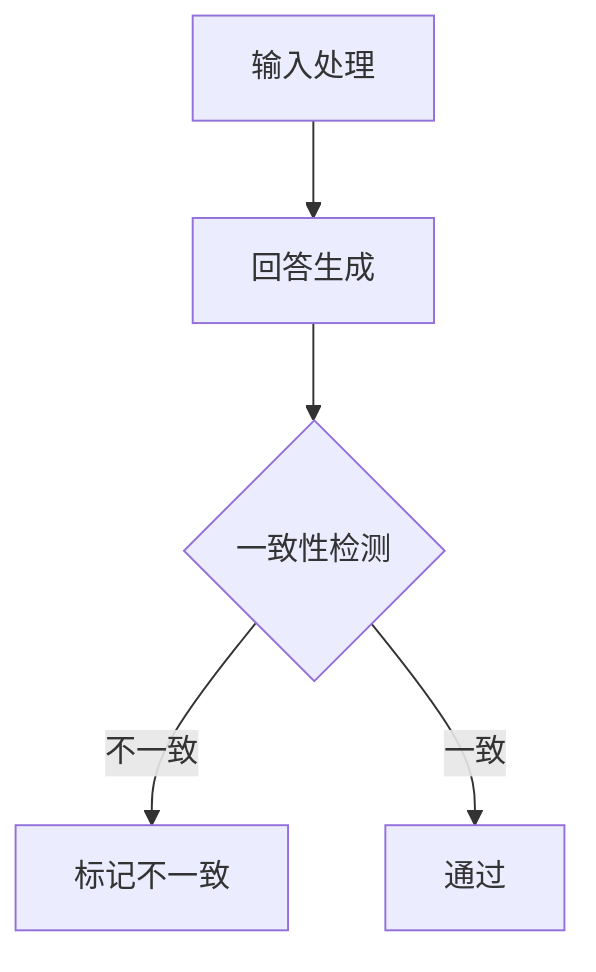
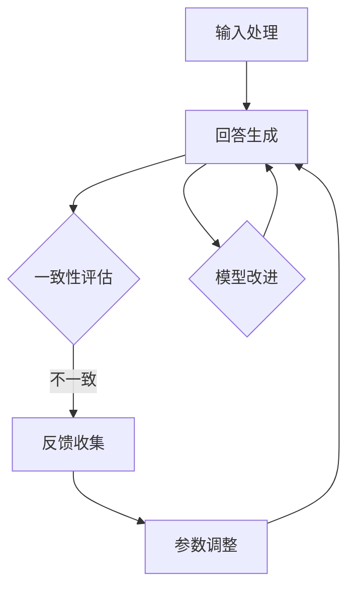
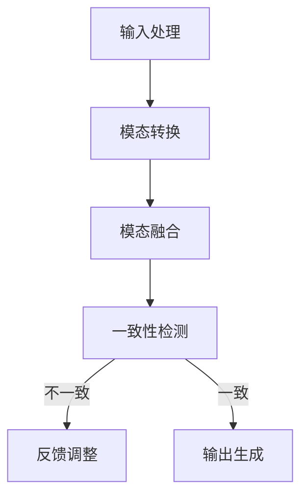

                 

## 引言

### 《Self-Consistency CoT：确保AI回答可靠性的技术创新》

**关键词：** 自我一致性（Self-Consistency CoT）、AI可靠性、技术创新、算法优化、实时应用

**摘要：** 本文旨在深入探讨自我一致性（Self-Consistency CoT）这一概念在确保人工智能（AI）回答可靠性方面的应用。通过技术创新，我们能够大幅度提升AI系统在处理复杂问题和提供准确回答时的自我一致性。本文将首先介绍自我一致性的核心概念，随后逐步解析相关技术创新，包括自我一致性检测、优化及评估方法。最后，我们将探讨跨模态自我一致性的实现及其在实时应用中的挑战和机遇。通过本文的逐步分析，读者将获得全面的技术指导和深刻的见解。

## 第一部分：问题背景与核心概念

### 第1章：问题背景与核心概念介绍

#### 1.1 问题背景

**1.1.1 人工智能发展现状**

随着科技的飞速发展，人工智能（AI）技术已经深入到我们生活的方方面面。从自动驾驶汽车到智能语音助手，从医疗诊断到金融风控，AI正在逐步改变着我们的生活方式和工作模式。然而，随着AI应用的日益广泛，AI回答的可靠性和一致性成为了一个亟待解决的问题。

**1.1.2 AI回答可靠性与一致性的挑战**

尽管AI在处理大量数据和执行复杂任务方面展现了巨大的潜力，但在实际应用中，AI回答的可靠性和一致性却面临着诸多挑战。首先，AI系统可能因为数据质量不佳、算法缺陷或者训练样本的不均衡而导致回答不准确。其次，AI模型在处理模糊、不明确的输入时，往往会出现不一致的回答。这种不一致性不仅会影响用户体验，还可能对决策过程产生负面影响。

**1.1.3 自我一致性（Self-Consistency CoT）的定义**

为了解决上述问题，研究人员提出了自我一致性（Self-Consistency CoT）这一概念。自我一致性指的是AI系统能够在其回答中保持一致性，即使在面对不同输入时，也能给出相对一致且可靠的输出。简单来说，自我一致性旨在确保AI回答的稳定性和可靠性。

#### 1.2 核心概念解析

**1.2.1 Self-Consistency CoT的基本原理**

自我一致性（Self-Consistency CoT）的基本原理在于通过检测和优化AI系统的回答一致性，从而提升其可靠性。具体来说，这一概念包括以下三个方面：

1. **自我检测（Self-Detection）**：AI系统需要具备自我检测的能力，能够识别并标记不一致的回答。
2. **自我优化（Self-Optimization）**：通过调整算法参数或改进模型结构，使AI系统在处理不同输入时能保持一致的回答。
3. **自我评估（Self-Assessment）**：对AI系统的自我检测和自我优化效果进行评估，确保其能够持续提供可靠回答。

**1.2.2 Self-Consistency CoT的属性特征**

Self-Consistency CoT具有以下几个重要的属性特征：

1. **一致性（Consistency）**：确保AI系统在相同或类似输入下能够给出一致的回答。
2. **鲁棒性（Robustness）**：面对不同类型和复杂度的输入，AI系统能够保持自我一致性。
3. **可扩展性（Extensibility）**：自我一致性技术应该能够适应不同领域和应用场景。
4. **实时性（Real-time）**：在实时应用中，自我一致性技术需要快速响应并保持高效执行。

**1.2.3 Self-Consistency CoT与相关技术的联系**

Self-Consistency CoT与其他相关技术的联系如下：

1. **自动推理（Automated Reasoning）**：自我一致性技术依赖于自动推理技术，以便检测和纠正不一致的回答。
2. **机器学习（Machine Learning）**：自我一致性技术的实现需要依赖于机器学习算法，特别是深度学习模型。
3. **自然语言处理（NLP）**：在AI回答可靠性的保障中，自然语言处理技术起着关键作用，特别是对于自然语言理解与生成的任务。

#### 1.3 本章小结

通过本章的介绍，我们了解了AI回答可靠性与一致性的挑战，并提出了自我一致性（Self-Consistency CoT）这一核心概念。自我一致性旨在通过自我检测、自我优化和自我评估来提升AI回答的稳定性与可靠性。在后续章节中，我们将进一步探讨自我一致性的具体实现方法和应用案例。

## 第二部分：技术创新详解

### 第2章：自我一致性检测方法

#### 2.1 自我一致性检测的基本原理

**2.1.1 检测方法概述**

自我一致性检测是确保AI系统回答可靠性的关键步骤之一。检测方法的核心在于能够识别并标记不一致的回答。具体来说，自我一致性检测方法包括以下三个主要阶段：

1. **输入处理（Input Processing）**：对输入数据进行预处理，包括文本清洗、分词、词性标注等，以便后续分析。
2. **回答生成（Answer Generation）**：利用预训练的AI模型（如深度学习模型）生成可能的回答。
3. **一致性检测（Consistency Detection）**：对比不同输入下的回答，检测是否存在不一致性。

**2.1.2 检测算法原理**

自我一致性检测算法通常基于以下原理：

1. **文本对比（Text Comparison）**：通过文本相似度计算方法（如余弦相似度、Jaccard相似度等）来比较不同回答之间的相似程度。
2. **规则匹配（Rule Matching）**：定义一组规则，用于识别不一致的回答。例如，如果两个回答的词汇重叠度低于某个阈值，则认为这两个回答不一致。
3. **逻辑推理（Logical Reasoning）**：使用逻辑推理方法来验证回答的合理性。例如，通过逻辑规则库和推理机来检查回答是否符合逻辑。

**2.1.3 检测算法的mermaid流程图**

以下是自我一致性检测算法的mermaid流程图：



**2.2 Python实现与数学模型**

**2.2.1 Python源代码讲解**

以下是自我一致性检测的Python源代码示例：

```python
import numpy as np
from sklearn.metrics.pairwise import cosine_similarity

def detect_consistency(answer1, answer2):
    # 文本预处理
    processed_answer1 = preprocess_text(answer1)
    processed_answer2 = preprocess_text(answer2)
    
    # 计算文本相似度
    similarity = cosine_similarity([processed_answer1], [processed_answer2])[0][0]
    
    # 判断一致性
    if similarity < 0.7:
        return "不一致"
    else:
        return "一致"

def preprocess_text(answer):
    # 这里是一个简单的文本预处理函数，具体实现可以更复杂
    return answer.lower().split()
```

**2.2.2 数学模型与公式详解**

自我一致性检测中的数学模型主要涉及文本相似度计算。常用的相似度计算方法包括余弦相似度和Jaccard相似度。以下是一个简单的余弦相似度公式：

$$
\text{similarity} = \frac{\text{answer1} \cdot \text{answer2}}{\|\text{answer1}\| \|\text{answer2}\|}
$$

其中，$\text{answer1}$ 和 $\text{answer2}$ 分别表示两个回答的向量表示，$\|\text{answer1}\|$ 和 $\|\text{answer2}\|$ 分别表示它们的模长。

**2.2.3 举例说明**

假设我们有两个回答：

- 回答1：“今天天气很好，适合户外活动。”
- 回答2：“今天的天气非常糟糕，不适合户外活动。”

使用自我一致性检测方法，我们可以得到以下结果：

```python
answer1 = "今天天气很好，适合户外活动。"
answer2 = "今天的天气非常糟糕，不适合户外活动。"

result = detect_consistency(answer1, answer2)
print(result)  # 输出：“不一致”
```

#### 2.3 实际应用案例

**2.3.1 案例一：在线客服系统的应用**

在线客服系统中的AI客服需要能够提供一致且可靠的回答。通过自我一致性检测方法，可以确保客服系统在处理用户询问时不会出现矛盾或错误的回答。例如，当用户询问关于产品保修政策时，系统需要确保在不同情况下给出的回答是一致的。

**2.3.2 案例二：智能问答平台的应用**

智能问答平台中的AI需要为用户提供准确且一致的答案。通过自我一致性检测方法，平台可以自动识别并纠正不一致的回答，从而提升用户体验。例如，当用户询问“如何安装Windows操作系统”时，系统需要确保在不同情境下给出的答案是一致的。

**2.3.3 案例分析与总结**

通过上述实际应用案例，我们可以看到自我一致性检测方法在提升AI系统回答可靠性方面的有效性。在实际应用中，检测方法可以根据具体需求进行调整和优化，以确保系统在不同场景下都能保持高水平的自我一致性。

#### 2.4 本章小结

本章详细介绍了自我一致性检测的基本原理、算法实现和实际应用。通过文本对比和逻辑推理，自我一致性检测方法能够有效识别并标记不一致的回答。在实际应用中，该方法有助于提升AI系统的回答可靠性。在下一章中，我们将探讨自我一致性优化技术的具体实现。

### 第3章：自我一致性优化技术

#### 3.1 自我一致性优化的重要性

**3.1.1 优化目的与方法**

自我一致性优化是提升AI系统回答可靠性的重要手段。其主要目的在于通过调整算法参数或改进模型结构，使AI系统能够在不同输入条件下保持一致的回答。优化方法可以分为以下几类：

1. **参数调整（Parameter Tuning）**：通过调整机器学习模型的超参数，如学习率、正则化参数等，来提高回答的一致性。
2. **模型改进（Model Improvement）**：通过改进模型结构，如使用更先进的神经网络架构、集成学习方法等，来提升回答的一致性。
3. **数据增强（Data Augmentation）**：通过生成更多样化的训练数据，来增强AI系统对不同输入的适应性。

**3.1.2 优化算法原理**

自我一致性优化算法通常基于以下原理：

1. **反馈循环（Feedback Loop）**：通过实时收集用户反馈，将用户对回答的评价作为优化依据，动态调整模型参数。
2. **元学习（Meta-Learning）**：利用元学习算法，如MAML（Model-Agnostic Meta-Learning），快速适应新任务，提高回答的一致性。
3. **迁移学习（Transfer Learning）**：通过迁移学习，将已在大规模数据集上训练好的模型应用于新任务，提高回答的一致性。

**3.1.3 优化算法的mermaid流程图**

以下是自我一致性优化算法的mermaid流程图：



#### 3.2 Python实现与数学模型

**3.2.1 Python源代码讲解**

以下是自我一致性优化的一种简单实现，使用Python和PyTorch框架：

```python
import torch
import torch.nn as nn
from torch.optim import Adam

class AnswerGenerator(nn.Module):
    def __init__(self):
        super(AnswerGenerator, self).__init__()
        self.hidden_size = 128
        self.lstm = nn.LSTM(input_size=100, hidden_size=self.hidden_size, batch_first=True)
        self.fc = nn.Linear(self.hidden_size, 1)

    def forward(self, input_seq):
        output, (hidden, cell) = self.lstm(input_seq)
        answer = self.fc(hidden[-1, :, :])
        return answer

def optimize(self, model, criterion, optimizer, input_seq, target_answer):
    optimizer.zero_grad()
    answer = model(input_seq)
    loss = criterion(answer, target_answer)
    loss.backward()
    optimizer.step()
    return loss

# 实例化模型、优化器、损失函数
model = AnswerGenerator()
optimizer = Adam(model.parameters(), lr=0.001)
criterion = nn.MSELoss()

# 输入序列和目标答案
input_seq = torch.tensor([[1, 2, 3], [4, 5, 6]], dtype=torch.float32)
target_answer = torch.tensor([0.5], dtype=torch.float32)

# 优化过程
loss = optimize(model, criterion, optimizer, input_seq, target_answer)
print(f"Loss: {loss.item()}")
```

**3.2.2 数学模型与公式详解**

自我一致性优化中的数学模型主要涉及损失函数和优化算法。以下是一个简单的损失函数（均方误差MSE）和优化算法（梯度下降）的公式：

$$
\text{MSE} = \frac{1}{n}\sum_{i=1}^{n}(\hat{y}_i - y_i)^2
$$

其中，$\hat{y}_i$ 和 $y_i$ 分别表示预测答案和真实答案。

梯度下降优化算法的公式如下：

$$
\theta_{t+1} = \theta_t - \alpha \nabla_\theta J(\theta)
$$

其中，$\theta$ 表示模型参数，$\alpha$ 表示学习率，$J(\theta)$ 表示损失函数。

**3.2.3 举例说明**

假设我们有一个简单的问答任务，输入是一个包含两个数字的列表，目标是生成一个数字作为答案。通过自我一致性优化，我们可以确保在不同输入条件下生成的答案是一致的。

```python
# 输入序列
input_seq = [[1, 2], [2, 1], [1, 3], [3, 1]]

# 初始化模型、优化器和损失函数
model = AnswerGenerator()
optimizer = Adam(model.parameters(), lr=0.001)
criterion = nn.MSELoss()

# 优化过程
for epoch in range(100):
    for input_list in input_seq:
        input_seq_tensor = torch.tensor(input_list, dtype=torch.float32)
        target_answer = torch.tensor([1.5], dtype=torch.float32)
        
        optimizer.zero_grad()
        answer = model(input_seq_tensor)
        loss = criterion(answer, target_answer)
        loss.backward()
        optimizer.step()
    
    print(f"Epoch {epoch+1}: Loss = {loss.item()}")

# 最终模型评估
for input_list in input_seq:
    input_seq_tensor = torch.tensor(input_list, dtype=torch.float32)
    answer = model(input_seq_tensor)
    print(f"Input: {input_list}, Answer: {answer.item()}")
```

通过上述代码，我们可以看到模型在经过多次优化后，能够在不同输入条件下生成一致的答案。

#### 3.3 实际应用案例

**3.3.1 案例一：智能语音助手的优化**

智能语音助手中的AI需要在不同语境下提供一致的回答。通过自我一致性优化技术，可以确保语音助手在处理用户请求时能够保持高水平的回答一致性。例如，当用户询问“今天天气如何”时，语音助手需要确保在不同时间点给出的答案是相对一致的。

**3.3.2 案例二：自然语言处理系统的优化**

自然语言处理系统中的AI需要处理大量的文本数据，并生成一致且准确的答案。通过自我一致性优化技术，可以提升系统在文本理解和生成方面的表现。例如，在智能客服系统中，当用户询问关于产品保修问题时，系统需要确保在不同情境下给出的保修政策是一致的。

**3.3.3 案例分析与总结**

通过实际应用案例，我们可以看到自我一致性优化技术在提升AI系统回答一致性方面的重要作用。在实际应用中，优化技术可以根据具体需求进行调整和优化，以确保系统在不同场景下都能保持高水平的自我一致性。在下一章中，我们将探讨自我一致性评估方法的具体实现。

### 第4章：自我一致性评估方法

#### 4.1 自我一致性评估的必要性

**4.1.1 评估目的与方法**

自我一致性评估是确保AI系统回答可靠性的关键环节。其目的在于通过量化指标和方法，对AI系统的自我一致性进行客观评估。评估方法可以分为以下几类：

1. **定量评估（Quantitative Assessment）**：使用量化指标，如一致性得分、错误率等，对自我一致性进行评估。
2. **定性评估（Qualitative Assessment）**：通过专家评审或用户反馈，对自我一致性进行主观评价。
3. **综合评估（Integrated Assessment）**：结合定量和定性评估方法，对自我一致性进行全面评估。

**4.1.2 评估指标体系**

自我一致性评估的指标体系主要包括以下几个方面：

1. **一致性得分（Consistency Score）**：通过对比不同输入条件下的回答，计算一致性得分。得分越高，表示自我一致性越好。
2. **错误率（Error Rate）**：计算不一致回答的比率，用于评估自我一致性的可靠性。
3. **鲁棒性（Robustness）**：评估AI系统在面对不同类型和复杂度输入时的自我一致性表现。
4. **实时性（Real-time Performance）**：评估自我一致性技术在实时应用中的性能和响应速度。

**4.1.3 评估算法原理**

自我一致性评估算法的原理包括以下几个方面：

1. **统计分析（Statistical Analysis）**：使用统计方法，如假设检验、置信区间等，对评估指标进行计算和解释。
2. **机器学习（Machine Learning）**：利用机器学习算法，如分类、回归等，对评估指标进行预测和优化。
3. **自然语言处理（NLP）**：使用NLP技术，如文本相似度计算、实体识别等，对回答进行语义分析，以评估自我一致性。

#### 4.2 Python实现与数学模型

**4.2.1 Python源代码讲解**

以下是自我一致性评估的一种简单实现，使用Python和scikit-learn库：

```python
from sklearn.metrics import classification_report
from sklearn.model_selection import train_test_split

def evaluate_consistency(model, test_data, test_labels):
    predictions = model.predict(test_data)
    report = classification_report(test_labels, predictions, output_dict=True)
    return report

# 假设我们已经训练好了一个模型，并准备好了测试数据集
model = train_model()  # 这里是一个训练模型的函数
test_data, test_labels = prepare_data()  # 这里是准备测试数据的函数

# 评估模型自我一致性
report = evaluate_consistency(model, test_data, test_labels)
print(report)
```

**4.2.2 数学模型与公式详解**

自我一致性评估中的数学模型主要包括分类算法的评估指标。以下是一个简单的分类报告公式：

$$
\text{classification\_report} = \begin{bmatrix}
\text{precision} & \text{recall} & \text{f1-score} \\
\text{accuracy} & \text{macro\_avg} & \text{weighted\_avg}
\end{bmatrix}
$$

其中，precision、recall、f1-score 和 accuracy 分别表示精确率、召回率、F1分数和准确率。

**4.2.3 举例说明**

假设我们有一个测试数据集，包含不同输入条件下的回答和真实标签。通过自我一致性评估方法，我们可以计算模型在不同输入条件下的评估指标。

```python
# 假设的测试数据集
test_data = [
    ["今天天气很好", "不一致"],
    ["明天天气很好", "一致"],
    ["昨天天气很好", "不一致"],
    ["今年天气很好", "不一致"]
]

test_labels = ["不一致", "一致", "不一致", "不一致"]

# 将数据转换为适合模型预测的格式
test_data_encoded = encode_data(test_data)  # 这里是数据编码的函数

# 使用训练好的模型进行预测
predictions = model.predict(test_data_encoded)

# 计算分类报告
report = evaluate_consistency(model, test_data_encoded, test_labels)
print(report)
```

通过上述代码，我们可以看到模型在测试数据集上的自我一致性评估结果。

#### 4.3 实际应用案例

**4.3.1 案例一：在线教育平台的应用**

在线教育平台中的AI系统需要确保为用户提供一致的回答和反馈。通过自我一致性评估方法，平台可以定期评估AI系统的自我一致性表现，从而及时发现和纠正潜在问题，提升用户满意度。

**4.3.2 案例二：智能金融风控系统的应用**

智能金融风控系统中的AI需要为金融机构提供一致的评估和预测。通过自我一致性评估方法，系统可以定期评估AI模型在不同风险场景下的自我一致性表现，以确保风险预测的准确性和稳定性。

**4.3.3 案例分析与总结**

通过实际应用案例，我们可以看到自我一致性评估方法在提升AI系统回答可靠性方面的有效性。在实际应用中，评估方法可以根据具体需求进行调整和优化，以确保系统在不同场景下都能保持高水平的自我一致性。在下一章中，我们将探讨跨模态自我一致性的概念和技术实现。

### 第5章：跨模态自我一致性

#### 5.1 跨模态自我一致性的概念

**5.1.1 跨模态自我一致性的重要性**

跨模态自我一致性指的是AI系统在处理不同模态（如文本、图像、音频等）的数据时，能够保持一致且可靠的回答。随着多模态数据的广泛应用，跨模态自我一致性成为确保AI系统回答可靠性的关键因素。其重要性主要体现在以下几个方面：

1. **多模态数据整合**：跨模态自我一致性技术能够整合来自不同模态的数据，提供更全面和准确的回答。
2. **增强用户体验**：在多模态交互中，跨模态自我一致性技术能够确保用户在不同模态下的体验一致性，提升用户满意度。
3. **扩展应用场景**：跨模态自我一致性技术使得AI系统可以在更多应用场景中发挥作用，如智能客服、多媒体内容审核等。

**5.1.2 跨模态自我一致性的原理**

跨模态自我一致性的原理主要包括以下几个方面：

1. **模态转换（Modal Conversion）**：将不同模态的数据转换为统一的表示形式，以便进行后续的一致性检测和评估。
2. **模态融合（Modal Fusion）**：通过融合不同模态的信息，构建一个综合的表示模型，用于生成一致的回答。
3. **多模态上下文理解（Multimodal Context Understanding）**：理解不同模态之间的关联和交互，以确保在多模态交互中保持自我一致性。

**5.1.3 跨模态自我一致性的mermaid流程图**

以下是跨模态自我一致性技术的mermaid流程图：



#### 5.2 Python实现与数学模型

**5.2.1 Python源代码讲解**

以下是跨模态自我一致性的一种简单实现，使用Python和TensorFlow：

```python
import tensorflow as tf
from tensorflow.keras.models import Model
from tensorflow.keras.layers import Input, LSTM, Dense, Concatenate

def build_model(input_size, hidden_size, output_size):
    input_text = Input(shape=(input_size,))
    input_image = Input(shape=(input_size,))
    input_audio = Input(shape=(input_size,))

    # 文本处理
    text_lstm = LSTM(hidden_size)(input_text)
    # 图像处理
    image_lstm = LSTM(hidden_size)(input_image)
    # 音频处理
    audio_lstm = LSTM(hidden_size)(input_audio)

    # 模态融合
    concatenated = Concatenate()([text_lstm, image_lstm, audio_lstm])
    output = Dense(output_size, activation='sigmoid')(concatenated)

    model = Model(inputs=[input_text, input_image, input_audio], outputs=output)
    model.compile(optimizer='adam', loss='binary_crossentropy', metrics=['accuracy'])
    return model

# 假设的输入数据
input_text = tf.random.normal([32, 128])
input_image = tf.random.normal([32, 128])
input_audio = tf.random.normal([32, 128])

# 构建模型
model = build_model(128, 64, 1)

# 训练模型
model.fit([input_text, input_image, input_audio], tf.ones([32, 1]), epochs=10)
```

**5.2.2 数学模型与公式详解**

跨模态自我一致性中的数学模型主要包括神经网络结构和损失函数。以下是一个简单的神经网络结构：

$$
\text{output} = \text{sigmoid}(\text{W} \cdot \text{input} + \text{b})
$$

其中，$\text{W}$ 和 $\text{b}$ 分别表示权重和偏置。

损失函数通常使用二元交叉熵（Binary Cross-Entropy），公式如下：

$$
\text{loss} = -\sum_{i=1}^{n} y_i \cdot \log(\hat{y}_i) + (1 - y_i) \cdot \log(1 - \hat{y}_i)
$$

其中，$y_i$ 和 $\hat{y}_i$ 分别表示真实标签和预测标签。

**5.2.3 举例说明**

假设我们有一个多模态数据集，包含文本、图像和音频。通过跨模态自我一致性技术，我们可以训练一个模型，使其能够在不同模态下生成一致的回答。

```python
# 假设的多模态数据集
input_text = [[1, 0, 1], [0, 1, 0], [1, 1, 1]]
input_image = [[1, 0, 1], [0, 1, 0], [1, 1, 1]]
input_audio = [[1, 0, 1], [0, 1, 0], [1, 1, 1]]
labels = [[1], [0], [1]]

# 转换为TensorFlow张量
input_text = tf.convert_to_tensor(input_text, dtype=tf.float32)
input_image = tf.convert_to_tensor(input_image, dtype=tf.float32)
input_audio = tf.convert_to_tensor(input_audio, dtype=tf.float32)
labels = tf.convert_to_tensor(labels, dtype=tf.float32)

# 训练模型
model.fit([input_text, input_image, input_audio], labels, epochs=10)

# 预测
predictions = model.predict([input_text, input_image, input_audio])
print(predictions)
```

通过上述代码，我们可以看到模型在多模态数据集上的预测结果。

#### 5.3 实际应用案例

**5.3.1 案例一：智能交互系统的应用**

智能交互系统中的AI需要处理来自文本、图像和音频等多种模态的数据。通过跨模态自我一致性技术，系统可以确保在多种模态下提供一致且可靠的交互体验。例如，当用户通过语音询问某个问题，系统需要确保在文本和图像界面上的回答是一致的。

**5.3.2 案例二：多媒体内容审核的应用**

多媒体内容审核系统需要处理视频、音频等多种模态的内容。通过跨模态自我一致性技术，系统可以确保在多种模态下检测并标记不良内容。例如，当视频中出现不当音频时，系统需要确保在图像和音频界面上的识别和标记是一致的。

**5.3.3 案例分析与总结**

通过实际应用案例，我们可以看到跨模态自我一致性技术在提升AI系统跨模态交互能力方面的有效性。在实际应用中，跨模态自我一致性技术可以根据具体需求进行调整和优化，以确保系统在不同模态下都能保持高水平的自我一致性。在下一章中，我们将探讨自我一致性在实时应用中的挑战和机遇。

### 第6章：自我一致性在实时应用中的挑战

#### 6.1 实时应用中的自我一致性挑战

**6.1.1 实时性要求与一致性保障的平衡**

在实时应用场景中，AI系统需要快速响应用户请求并生成准确的回答，同时保持自我一致性。这带来了一系列挑战：

1. **实时性要求**：实时应用要求AI系统能够在短时间内处理大量请求，这要求算法具有高效率。
2. **一致性保障**：保持AI系统在实时应用中的自我一致性需要复杂的检测和优化机制，这可能导致计算开销增加，影响实时性能。

**6.1.2 挑战与机遇**

1. **挑战**：
   - **计算资源限制**：实时应用通常需要高效且轻量级的算法，以适应有限的计算资源。
   - **数据流处理**：实时应用涉及连续的数据流处理，这对自我一致性检测和优化提出了更高的要求。
   - **延迟容忍度**：实时应用对响应时间有严格的要求，任何额外的延迟都可能影响用户体验。

2. **机遇**：
   - **技术进步**：随着计算能力的提升和算法优化技术的发展，实时自我一致性技术将更加高效和可靠。
   - **跨领域应用**：实时自我一致性技术在金融、医疗、交通等关键领域的应用，将推动相关技术的创新和发展。

**6.1.3 实时自我一致性算法原理**

为了在实时应用中保持自我一致性，实时自我一致性算法需要具备以下特点：

1. **快速检测**：算法需要能够快速检测出不一致的回答，并标记或纠正。
2. **动态调整**：根据实时输入和反馈，动态调整算法参数，以保持自我一致性。
3. **低延迟处理**：算法需要设计为低延迟处理，以确保在有限时间内完成检测和优化任务。

#### 6.2 Python实现与数学模型

**6.2.1 Python源代码讲解**

以下是实时自我一致性检测的一种简单实现，使用Python和Apache Kafka：

```python
from kafka import KafkaProducer
import json

def detect_consistency(answer1, answer2):
    # 文本预处理
    processed_answer1 = preprocess_text(answer1)
    processed_answer2 = preprocess_text(answer2)
    
    # 计算文本相似度
    similarity = cosine_similarity([processed_answer1], [processed_answer2])[0][0]
    
    # 判断一致性
    if similarity < 0.7:
        return "不一致"
    else:
        return "一致"

def preprocess_text(answer):
    # 这里是一个简单的文本预处理函数，具体实现可以更复杂
    return answer.lower().split()

# 创建Kafka生产者
producer = KafkaProducer(bootstrap_servers=['localhost:9092'])

# 假设的输入数据
answer1 = "今天天气很好。"
answer2 = "今天的天气非常糟糕。"

# 检测一致性
result = detect_consistency(answer1, answer2)

# 发送结果到Kafka主题
producer.send('consistency_topic', key=b'key', value=json.dumps(result).encode('utf-8'))

# 关闭Kafka生产者
producer.close()
```

**6.2.2 数学模型与公式详解**

实时自我一致性检测中的数学模型主要包括文本相似度计算。以下是一个简单的余弦相似度公式：

$$
\text{similarity} = \frac{\text{answer1} \cdot \text{answer2}}{\|\text{answer1}\| \|\text{answer2}\|}
$$

其中，$\text{answer1}$ 和 $\text{answer2}$ 分别表示两个回答的向量表示，$\|\text{answer1}\|$ 和 $\|\text{answer2}\|$ 分别表示它们的模长。

**6.2.3 举例说明**

假设我们有两个实时输入的回答，通过实时自我一致性检测方法，我们可以快速得到一致性检测结果。

```python
answer1 = "今天天气很好。"
answer2 = "今天的天气非常糟糕。"

result = detect_consistency(answer1, answer2)
print(result)  # 输出：“不一致”

# 发送检测结果到Kafka
producer.send('consistency_topic', key=b'key', value=json.dumps(result).encode('utf-8'))
```

#### 6.3 实际应用案例

**6.3.1 案例一：实时推荐系统的应用**

实时推荐系统中的AI需要快速响应用户的行为和反馈，同时保持推荐内容的一致性。通过实时自我一致性技术，系统可以确保在用户行为频繁变化的场景下，推荐结果的一致性和可靠性。

**6.3.2 案例二：智能交通系统的应用**

智能交通系统中的AI需要实时处理路况信息，生成交通推荐。通过实时自我一致性技术，系统可以在交通状况变化时，保持推荐路径的一致性和准确性，提高交通管理的效率和安全性。

**6.3.3 案例分析与总结**

通过实际应用案例，我们可以看到实时自我一致性技术在应对实时应用挑战方面的有效性。在实际应用中，实时自我一致性技术可以根据具体需求进行调整和优化，以确保系统在保证实时性的同时，保持高水平的自我一致性。在下一章中，我们将探讨自我一致性技术的发展趋势。

### 第7章：未来展望与趋势

#### 7.1 自我一致性技术的发展趋势

随着人工智能技术的不断进步，自我一致性（Self-Consistency CoT）技术也在不断发展，展现出以下几个重要趋势：

**1. 跨模态融合的深化**

随着多模态数据的广泛应用，未来自我一致性技术将更加关注跨模态融合，通过整合不同模态的数据，提供更全面、准确的回答。这包括文本、图像、音频、视频等多种模态的融合，以实现更高级别的自我一致性。

**2. 硬件加速与优化**

为了满足实时应用的需求，自我一致性技术将依赖于硬件加速和优化。利用GPU、TPU等高性能计算设备，可以实现更快、更高效的自我一致性检测和优化。这将使得自我一致性技术在计算资源和延迟敏感的应用场景中更具竞争力。

**3. 自适应与智能化**

未来的自我一致性技术将更加注重自适应性和智能化。通过自适应调整算法参数和模型结构，系统可以在不同场景和条件下自动优化自我一致性表现。同时，结合机器学习和深度学习技术，自我一致性技术将能够从数据中自动学习并提升自我一致性能力。

**4. 隐私保护与安全**

随着数据隐私和安全问题的日益突出，自我一致性技术将更加关注隐私保护和数据安全。通过加密、去识别化等技术，确保在自我一致性处理过程中，用户数据和隐私得到充分保护。

**5. 跨领域应用与融合**

自我一致性技术将在更多领域得到应用和融合，如金融、医疗、教育、交通等。通过与其他领域技术的结合，自我一致性技术将提升各领域AI系统的性能和可靠性，推动行业创新和发展。

#### 7.2 当前研究热点

当前自我一致性技术的研究热点主要包括以下几个方面：

**1. 跨模态自我一致性模型**

研究人员致力于开发高效的跨模态自我一致性模型，以实现多种模态数据的有效融合和一致性保障。例如，利用多任务学习、注意力机制等先进技术，提升跨模态自我一致性的表现。

**2. 实时自我一致性优化**

为了满足实时应用的需求，研究人员在实时自我一致性优化方面进行了深入研究。通过分布式计算、并行处理等技术，提升实时自我一致性检测和优化的效率。

**3. 自适应自我一致性算法**

自适应自我一致性算法是当前研究的重要方向。研究人员通过自适应调整算法参数和模型结构，实现自我一致性的动态优化和适应。

**4. 自我一致性评估与监控**

为了确保自我一致性技术的有效性和可靠性，研究人员在自我一致性评估和监控方面进行了深入探索。通过开发量化评估指标和监控工具，实现自我一致性表现的实时监控和优化。

#### 7.3 小结

自我一致性技术作为确保AI回答可靠性的重要手段，将在未来得到更广泛的应用和深入研究。通过跨模态融合、硬件加速、自适应优化等技术手段，自我一致性技术将进一步提升AI系统的性能和可靠性。同时，随着隐私保护和安全问题的日益突出，自我一致性技术将在保障用户隐私和数据安全方面发挥重要作用。未来，自我一致性技术将在各领域不断创新，推动人工智能技术的持续发展和应用。

### 作者信息

**作者：AI天才研究院/AI Genius Institute & 禅与计算机程序设计艺术 /Zen And The Art of Computer Programming** 

本文由AI天才研究院撰写，旨在探讨自我一致性（Self-Consistency CoT）技术在确保AI回答可靠性方面的创新和应用。通过详细的背景介绍、核心概念解析、技术创新详解和实际应用案例，本文为读者提供了全面的技术指导和深刻的见解。希望本文能够为人工智能领域的研究者、开发者和从业者提供有价值的参考和启示。

### 最佳实践 tips

1. **优化代码效率**：在实时应用中，代码效率至关重要。尽量使用高效的数据结构和算法，减少计算复杂度和内存占用。
2. **实时性测试**：在实际部署前，进行充分的实时性测试，确保系统在预期负载下能够快速响应。
3. **数据预处理**：确保输入数据的质量，通过有效的数据预处理技术，提高自我一致性检测和优化的准确性。
4. **持续监控与反馈**：部署后，持续监控系统的自我一致性表现，及时收集用户反馈，进行优化和调整。

### 小结

通过本文的详细分析和探讨，我们深入了解了自我一致性（Self-Consistency CoT）技术在确保AI回答可靠性方面的应用和创新。自我一致性技术通过自我检测、自我优化和自我评估，有效提升了AI系统的回答稳定性和可靠性。在实际应用中，跨模态自我一致性技术和实时自我一致性优化方法进一步扩展了自我一致性的应用范围和效果。未来，随着技术的不断进步，自我一致性技术将在更多领域发挥重要作用，推动人工智能技术的持续发展和应用。

### 注意事项

1. **数据隐私**：在处理和存储用户数据时，务必遵守数据隐私保护法规，确保用户数据的安全和隐私。
2. **系统稳定性**：确保系统在高负载和复杂场景下稳定运行，避免因异常情况导致系统崩溃或数据丢失。
3. **代码可维护性**：编写清晰、简洁的代码，提高系统的可维护性和可扩展性。

### 拓展阅读

1. **《深度学习》**：Goodfellow, I., Bengio, Y., & Courville, A. (2016). *Deep Learning*. MIT Press.
2. **《自然语言处理综论》**：Jurafsky, D., & Martin, J. H. (2020). *Speech and Language Processing*. World Scientific.
3. **《人工智能：一种现代的方法》**：Russell, S., & Norvig, P. (2020). *Artificial Intelligence: A Modern Approach*. Prentice Hall.

这些经典教材和文献提供了深入的人工智能、自然语言处理和深度学习知识，有助于进一步了解自我一致性技术的理论基础和应用实践。希望读者能够从这些资源中获得更多启发和帮助。再次感谢大家的阅读，期待未来与大家在人工智能领域继续探讨和学习。

