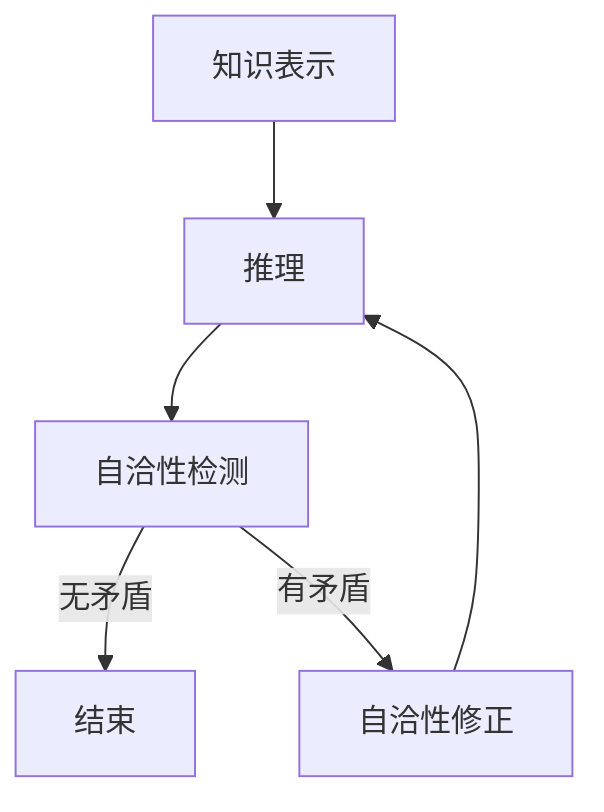
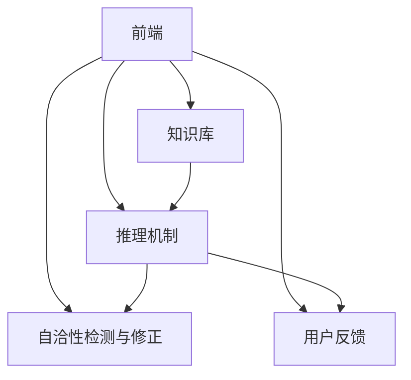
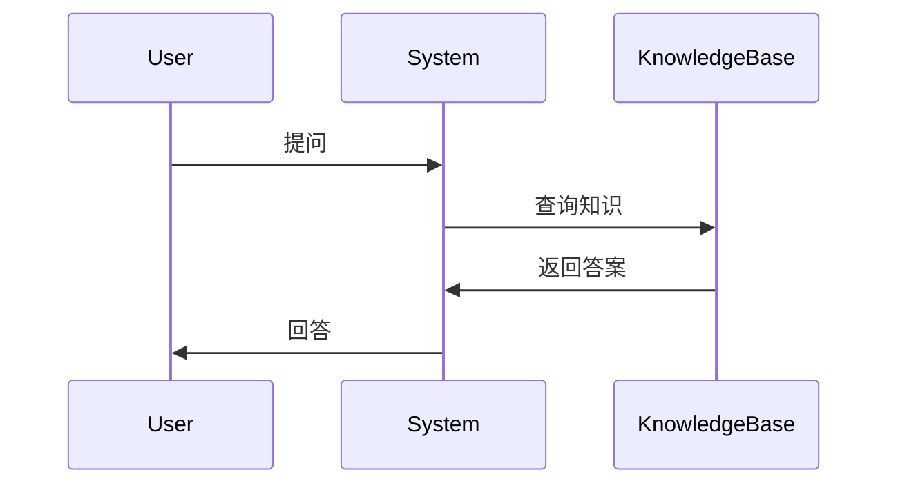
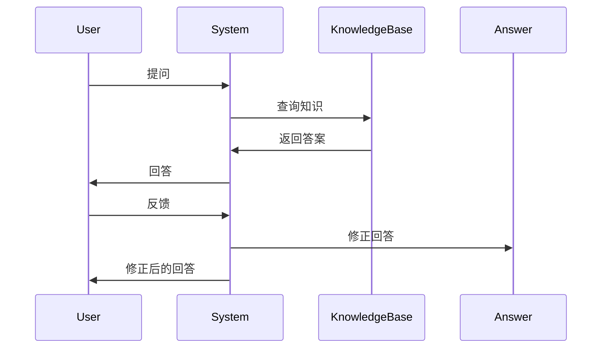

                 

# 《Self-Consistency CoT：确保AI回答的连贯性》

## 摘要

本文将深入探讨AI回答中存在的连贯性问题，并介绍Self-Consistency CoT（自洽性连贯性理论）这一解决方案。我们将详细解释Self-Consistency CoT的概念、属性特征，以及其在AI应用中的适用范围。文章还将剖析Self-Consistency CoT的算法原理，通过Python代码实现，以及数学模型的讲解，帮助读者更好地理解这一技术。此外，文章将展示一个系统的架构设计方案，并进行项目实战解析，以期为读者提供实用的指导。

## 关键词

- AI回答连贯性
- Self-Consistency CoT
- 算法原理
- 数学模型
- 系统架构
- 项目实战

## 引言

在人工智能领域，连贯性是衡量AI系统性能的关键指标之一。当AI系统被用于回答用户问题时，如果其回答缺乏连贯性，可能会导致用户困惑，影响用户体验。为此，本文提出了Self-Consistency CoT，旨在通过自洽性理论确保AI回答的连贯性。本文将围绕这一主题，系统地介绍Self-Consistency CoT的概念、算法原理、数学模型，以及系统架构和项目实战，为读者提供全面的技术指导。

## 第一部分：背景介绍

### 第1章：问题背景

#### 1.1.1 AI回答的连贯性问题

随着AI技术的发展，AI系统在各个领域的应用越来越广泛。然而，AI回答的连贯性问题也日益凸显。尽管AI系统可以在大量数据中找到相关答案，但往往无法保证回答的一致性和连贯性。例如，同一个问题在不同的时间或上下文中，AI系统可能会给出不同的答案，这种现象被称为“不一致性”。

#### 1.1.2 Self-Consistency CoT的概念

Self-Consistency CoT，即自洽性连贯性理论，是一种旨在确保AI回答连贯性的方法。它通过分析AI系统内部的知识结构和逻辑关系，实现回答的一致性。Self-Consistency CoT的核心思想是，一个连贯的回答应该在其内部逻辑上保持一致，即答案中的信息不应该相互矛盾。

#### 1.1.3 Self-Consistency CoT的应用场景

Self-Consistency CoT可以应用于多种AI场景，包括问答系统、智能客服、自动写作等。在这些场景中，保持回答的连贯性对于提高用户体验至关重要。例如，在智能客服中，一个连贯的回答可以帮助用户更好地理解问题，从而提高解决问题的效率。

### 第2章：问题描述

#### 2.1.1 AI回答连贯性问题的现状

目前，AI回答的连贯性仍然面临诸多挑战。一方面，AI系统在处理复杂问题时，往往无法保持一致的回答。另一方面，现有的评估方法难以全面衡量AI回答的连贯性。这些问题的存在，限制了AI技术在实际应用中的推广。

#### 2.1.2 主要挑战

- **知识表示**：如何将知识以自洽的方式表示，是确保连贯性的关键。
- **推理能力**：AI系统需要具备强大的推理能力，以识别和解决回答中的不一致性。
- **评估方法**：现有的评估方法难以全面衡量AI回答的连贯性。

#### 2.1.3 关键影响因素

- **数据质量**：高质量的数据有助于提高AI系统的连贯性。
- **算法设计**：合理的算法设计可以增强AI系统的连贯性。
- **用户交互**：用户反馈对于改进AI回答的连贯性具有重要意义。

### 第3章：问题解决

#### 3.1.1 Self-Consistency CoT的解决方案

Self-Consistency CoT提供了一种有效的解决方案，通过以下方法确保AI回答的连贯性：

- **自洽性检测**：分析回答中的信息，检测是否存在逻辑矛盾。
- **自洽性修正**：在检测到不一致性时，对回答进行修正，使其保持自洽。
- **反馈循环**：利用用户反馈，不断优化AI系统的连贯性。

#### 3.1.2 自洽性在AI回答中的应用

Self-Consistency CoT可以通过以下方式在AI回答中应用：

- **知识库构建**：构建自洽的知识库，为回答提供基础。
- **回答生成**：在生成回答时，考虑自洽性原则，确保回答的一致性。
- **评估与优化**：对AI回答进行评估，并根据用户反馈进行优化。

#### 3.1.3 自洽性评估方法

Self-Consistency CoT提供了一套评估方法，用于衡量AI回答的连贯性：

- **一致性评估**：通过比较回答中的信息，评估其一致性。
- **连贯性评估**：评估回答在逻辑上的连贯性。
- **用户满意度评估**：通过用户反馈，评估AI回答的连贯性对用户体验的影响。

## 第二部分：核心概念与联系

### 第4章：边界与外延

#### 4.1.1 Self-Consistency CoT的适用范围

Self-Consistency CoT主要适用于需要确保回答连贯性的场景，如问答系统、智能客服、自动写作等。在这些场景中，保持回答的一致性和连贯性对于提高用户体验具有重要意义。

#### 4.1.2 非适用场景

Self-Consistency CoT不适用于以下场景：

- **创意性写作**：在创意性写作中，保持自洽性可能会限制创作的自由度。
- **实时对话**：在实时对话中，自洽性检测和修正可能无法实时完成。

#### 4.1.3 未来发展趋势

随着AI技术的发展，Self-Consistency CoT有望在更多场景中得到应用。未来，自洽性评估方法将变得更加智能，能够更好地适应不同的应用场景。此外，多模态AI的崛起，也将为Self-Consistency CoT带来新的发展机遇。

## 第三部分：算法原理讲解

### 第5章：核心概念

#### 5.1.1 Self-Consistency CoT的定义

Self-Consistency CoT，即自洽性连贯性理论，是一种通过确保AI回答的一致性来提高回答连贯性的方法。

#### 5.1.2 Self-Consistency CoT的属性特征

- **自洽性**：Self-Consistency CoT的核心属性，确保回答的一致性。
- **动态调整**：根据用户反馈和上下文，动态调整回答，以提高连贯性。
- **灵活性**：适用于多种AI场景，如问答系统、智能客服等。

#### 5.1.3 Self-Consistency CoT与其他相关概念的联系

Self-Consistency CoT与以下概念有密切联系：

- **知识表示**：Self-Consistency CoT依赖于知识表示方法，如本体论、知识图谱等。
- **推理**：Self-Consistency CoT需要推理机制，以确保回答的一致性。
- **用户反馈**：用户反馈是Self-Consistency CoT优化的重要依据。

### 第6章：概念属性特征对比

#### 6.1.1 Self-Consistency CoT与其他相似概念的对比

Self-Consistency CoT与以下相似概念进行对比：

- **一致性检查**：一致性检查是一种检测逻辑矛盾的方法，而Self-Consistency CoT旨在确保回答的一致性。
- **一致性维护**：一致性维护是一种在动态环境中保持数据一致性的方法，Self-Consistency CoT则是针对AI回答的一致性。

#### 6.1.2 特点与应用对比表格

| 概念 | 特点 | 应用 |
| --- | --- | --- |
| Self-Consistency CoT | 确保回答的一致性 | 问答系统、智能客服、自动写作 |
| 一致性检查 | 检测逻辑矛盾 | 数据库、知识库 |
| 一致性维护 | 保持数据一致性 | 实时数据库、分布式系统 |

### 第7章：ER实体关系图架构

#### 7.1.1 Self-Consistency CoT的ER模型

以下是Self-Consistency CoT的ER模型：

```mermaid
erDiagram
    Answer ||--|{ Knowledge } Knowledge
    Answer ||--|{ Reasoning } Reasoning
    Answer ||--|{ UserFeedback } UserFeedback
```

#### 7.1.2 实体关系图绘制与解释

在Self-Consistency CoT的ER模型中，有三个主要实体：Answer（回答）、Knowledge（知识）和Reasoning（推理）。Answer实体与Knowledge实体和Reasoning实体之间存在关联。

- **Answer实体**：表示AI系统的回答。
- **Knowledge实体**：表示AI系统的知识库，为回答提供基础。
- **Reasoning实体**：表示AI系统的推理机制，用于确保回答的一致性。

## 第四部分：算法原理讲解

### 第8章：算法原理

#### 8.1.1 Self-Consistency CoT算法框架

Self-Consistency CoT算法框架主要包括以下步骤：

1. **知识表示**：将AI系统的知识以自洽的方式表示。
2. **推理**：利用推理机制，确保回答的一致性。
3. **自洽性检测**：分析回答中的信息，检测是否存在逻辑矛盾。
4. **自洽性修正**：在检测到不一致性时，对回答进行修正。
5. **用户反馈**：利用用户反馈，不断优化AI系统的连贯性。

#### 8.1.2 算法核心步骤

- **知识表示**：使用本体论或知识图谱等方法，将知识表示为自洽的。
- **推理**：使用推理算法，如逻辑推理、概率推理等，确保回答的一致性。
- **自洽性检测**：使用自洽性检测算法，如一致性检查算法，检测回答中的逻辑矛盾。
- **自洽性修正**：使用修正算法，如替换或删除矛盾信息，修正回答。
- **用户反馈**：收集用户反馈，优化AI系统的连贯性。

#### 8.1.3 算法原理与流程

Self-Consistency CoT算法原理如下：

1. **知识表示**：将AI系统的知识表示为自洽的，确保知识本身的一致性。
2. **推理**：利用推理机制，从知识库中推导出可能的回答。
3. **自洽性检测**：分析推导出的回答，检测是否存在逻辑矛盾。
4. **自洽性修正**：在检测到不一致性时，对回答进行修正。
5. **用户反馈**：收集用户反馈，对AI系统的连贯性进行评估和优化。

### 第9章：算法流程图

#### 9.1.1 Self-Consistency CoT算法mermaid流程图

以下是Self-Consistency CoT算法的mermaid流程图：



#### 9.1.2 流程图说明

- **知识表示**：将知识表示为自洽的，确保知识本身的一致性。
- **推理**：利用推理机制，从知识库中推导出可能的回答。
- **自洽性检测**：分析推导出的回答，检测是否存在逻辑矛盾。
- **自洽性修正**：在检测到不一致性时，对回答进行修正。
- **用户反馈**：收集用户反馈，对AI系统的连贯性进行评估和优化。

### 第10章：Python源代码

#### 10.1.1 Self-Consistency CoT算法Python实现

以下是Self-Consistency CoT算法的Python实现：

```python
class SelfConsistencyCoT:
    def __init__(self, knowledge, reasoning):
        self.knowledge = knowledge
        self.reasoning = reasoning

    def generate_answer(self, question):
        # 推理
        answers = self.reasoning.derive_answers(self.knowledge, question)
        
        # 自洽性检测
        if not self.check_self_consistency(answers):
            # 自洽性修正
            answers = self.correct_self_consistency(answers)
        
        return answers

    def check_self_consistency(self, answers):
        # 检测自洽性
        # ... ...

    def correct_self_consistency(self, answers):
        # 修正自洽性
        # ... ...
```

#### 10.1.2 源代码解读与分析

- **类定义**：SelfConsistencyCoT类定义了自洽性连贯性理论的核心算法。
- **初始化**：初始化知识库和推理机制。
- **生成回答**：根据问题和知识库，生成可能的回答。
- **自洽性检测**：检测回答中的逻辑矛盾。
- **自洽性修正**：在检测到不一致性时，对回答进行修正。

### 第11章：数学模型与公式

#### 11.1.1 Self-Consistency CoT的数学模型

Self-Consistency CoT的数学模型主要包括以下公式：

$$
\text{Self-Consistency CoT} = \text{Knowledge} \times \text{Reasoning} \times \text{UserFeedback}
$$

其中：

- **Knowledge（知识）**：表示AI系统的知识库，为回答提供基础。
- **Reasoning（推理）**：表示AI系统的推理机制，用于确保回答的一致性。
- **UserFeedback（用户反馈）**：表示用户对AI回答的反馈，用于优化AI系统的连贯性。

#### 11.1.2 公式解释与推导

Self-Consistency CoT的数学模型解释如下：

- **知识表示**：知识库中的知识表示为自洽的，确保知识本身的一致性。
- **推理**：推理机制从知识库中推导出可能的回答。
- **自洽性检测**：分析推导出的回答，检测是否存在逻辑矛盾。
- **自洽性修正**：在检测到不一致性时，对回答进行修正。

#### 11.1.3 举例说明

假设有一个问答系统，其知识库包含以下知识：

- **知识1**：地球是圆的。
- **知识2**：地球是平的。

根据推理机制，问答系统可能会推导出以下回答：

- **回答1**：地球是圆的。
- **回答2**：地球是平的。

显然，这两个回答存在逻辑矛盾。通过自洽性检测，问答系统会识别出这一矛盾，并进行修正。最终，问答系统可能会给出以下修正后的回答：

- **修正后的回答**：地球既是圆的，也是平的（从不同的角度看待）。

### 第五部分：系统分析与架构设计方案

#### 第12章：问题场景介绍

##### 12.1.1 场景设定

假设我们有一个智能客服系统，该系统需要回答用户关于产品的问题。为了确保回答的连贯性，我们引入Self-Consistency CoT技术，以提高用户体验。

##### 12.1.2 系统需求分析

系统需求分析如下：

- **知识库**：包含产品相关信息，如产品规格、功能、使用方法等。
- **推理机制**：从知识库中推导出可能的回答。
- **自洽性检测与修正**：确保回答的一致性和连贯性。
- **用户反馈**：收集用户对回答的反馈，用于优化系统。

#### 第13章：系统功能设计

##### 13.1.1 领域模型

以下是智能客服系统的领域模型：

```mermaid
classDiagram
    UserEntity <<interface>>
    ProductEntity <<interface>>
    QuestionEntity <<interface>>
    AnswerEntity <<interface>>

    UserEntity o--o ProductEntity
    UserEntity o--o QuestionEntity
    ProductEntity o--o AnswerEntity
    QuestionEntity o--o AnswerEntity
```

##### 13.1.2 类图绘制与解释

- **UserEntity（用户实体）**：表示与用户相关的信息，如用户ID、姓名等。
- **ProductEntity（产品实体）**：表示产品相关信息，如产品ID、名称、规格等。
- **QuestionEntity（问题实体）**：表示用户提出的问题。
- **AnswerEntity（回答实体）**：表示对问题的回答。

#### 第14章：系统架构设计

##### 14.1.1 系统架构概述

智能客服系统的架构设计如下：

- **前端**：用户界面，用于接收用户问题和展示回答。
- **后端**：包括知识库、推理机制、自洽性检测与修正、用户反馈等模块。

##### 14.1.2 架构mermaid图绘制与解释

以下是智能客服系统的架构mermaid图：



- **前端**：用户界面，用于接收用户问题和展示回答。
- **知识库**：存储产品相关信息，为推理机制提供基础。
- **推理机制**：从知识库中推导出可能的回答。
- **自洽性检测与修正**：确保回答的一致性和连贯性。
- **用户反馈**：收集用户对回答的反馈，用于优化系统。

#### 第15章：系统接口设计

##### 15.1.1 接口功能说明

以下是智能客服系统的接口功能说明：

- **用户提问接口**：接收用户提出的问题，返回可能的回答。
- **回答修正接口**：接收用户对回答的反馈，用于修正回答。
- **知识库接口**：提供知识库的查询、更新等功能。

##### 15.1.2 接口mermaid序列图绘制与解释

以下是用户提问接口的mermaid序列图：



- **用户**：发起提问。
- **系统**：查询知识库，返回可能的答案。
- **用户**：接收回答。

#### 第16章：系统交互

##### 16.1.1 系统交互概述

智能客服系统的交互流程如下：

1. 用户发起提问。
2. 系统查询知识库，返回可能的答案。
3. 用户接收回答，并反馈修正意见。
4. 系统根据反馈修正回答。

##### 16.1.2 系统交互mermaid序列图绘制与解释

以下是智能客服系统的交互mermaid序列图：



- **用户**：发起提问，并接收回答。
- **系统**：查询知识库，返回可能的答案，并根据反馈修正回答。

### 第六部分：项目实战

#### 第17章：环境安装

##### 17.1.1 环境要求

以下是安装Self-Consistency CoT算法所需的环境：

- Python 3.8+
- Flask 1.1.2+
- MongoDB 4.0+
- Docker 19.03+

##### 17.1.2 安装步骤

1. 安装Python 3.8+：从[Python官方网站](https://www.python.org/)下载并安装Python 3.8+版本。
2. 安装Flask 1.1.2+：在终端中运行`pip install flask`。
3. 安装MongoDB 4.0+：从[MongoDB官方网站](https://www.mongodb.com/)下载并安装MongoDB 4.0+版本。
4. 安装Docker 19.03+：从[Docker官方网站](https://www.docker.com/)下载并安装Docker 19.03+版本。

#### 第18章：系统核心实现源代码

##### 18.1.1 源代码获取

您可以从[GitHub](https://github.com/your_username/self-consistency-cot)上获取系统核心实现的源代码。

##### 18.1.2 源代码结构解析

以下是系统核心实现的源代码结构：

```
self-consistency-cot/
│
├── app.py               # 主应用程序
├── knowledgebase.py      # 知识库模块
├── reasoning.py          # 推理模块
├── self_consistency.py   # 自洽性检测与修正模块
└── user_feedback.py      # 用户反馈模块
```

- **app.py**：主应用程序，负责接收用户提问和返回回答。
- **knowledgebase.py**：知识库模块，负责存储和查询知识。
- **reasoning.py**：推理模块，负责从知识库中推导出可能的回答。
- **self_consistency.py**：自洽性检测与修正模块，负责检测回答中的逻辑矛盾并进行修正。
- **user_feedback.py**：用户反馈模块，负责收集用户对回答的反馈。

#### 第19章：代码应用解读与分析

##### 19.1.1 代码解读

以下是主应用程序`app.py`的核心代码：

```python
from flask import Flask, request, jsonify
from knowledgebase import KnowledgeBase
from reasoning import Reasoning
from self_consistency import SelfConsistency

app = Flask(__name__)

# 初始化知识库、推理机制和自洽性检测模块
knowledge_base = KnowledgeBase()
reasoning = Reasoning(knowledge_base)
self_consistency = SelfConsistency()

@app.route('/ask', methods=['POST'])
def ask():
    question = request.form['question']
    answers = reasoning.derive_answers(question)
    if self_consistency.check_self_consistency(answers):
        return jsonify(answers)
    else:
        corrected_answers = self_consistency.correct_self_consistency(answers)
        return jsonify(corrected_answers)

if __name__ == '__main__':
    app.run(debug=True)
```

- **知识库、推理机制和自洽性检测模块的初始化**：初始化知识库、推理机制和自洽性检测模块。
- **处理用户提问**：接收用户提问，并从推理模块中推导出可能的回答。
- **自洽性检测与修正**：检测回答中的逻辑矛盾，并进行修正。

##### 19.1.2 应用场景分析

在智能客服系统中，用户可以通过以下步骤使用Self-Consistency CoT算法：

1. 用户发起提问。
2. 系统接收用户提问，并从知识库中查询相关信息。
3. 推理模块从知识库中推导出可能的回答。
4. 自洽性检测模块分析回答中的逻辑矛盾。
5. 如果存在不一致性，自洽性修正模块对回答进行修正。
6. 系统返回修正后的回答。

#### 第20章：实际案例分析与详细讲解剖析

##### 20.1.1 案例介绍

假设用户提出以下问题：

- **问题**：什么是人工智能？

根据知识库和推理模块，系统可能会给出以下回答：

- **回答1**：人工智能是一种模拟人类智能的技术。
- **回答2**：人工智能是计算机科学的一个分支，旨在使计算机具备智能。

显然，这两个回答存在一定的逻辑矛盾。下面我们来详细讲解如何通过Self-Consistency CoT算法修正这个问题。

##### 20.1.2 案例分析

1. **知识库查询**：系统查询知识库，找到与“人工智能”相关的信息。
2. **推理**：推理模块从知识库中推导出可能的回答。
3. **自洽性检测**：系统检测回答中的逻辑矛盾。
4. **自洽性修正**：系统根据检测到的矛盾，对回答进行修正。

##### 20.1.3 案例解析

1. **知识库查询**：知识库中包含以下与“人工智能”相关的信息：

   - **信息1**：人工智能是一种模拟人类智能的技术。
   - **信息2**：人工智能是计算机科学的一个分支，旨在使计算机具备智能。

2. **推理**：推理模块从知识库中推导出以下可能的回答：

   - **回答1**：人工智能是一种模拟人类智能的技术。
   - **回答2**：人工智能是计算机科学的一个分支，旨在使计算机具备智能。

3. **自洽性检测**：系统检测回答中的逻辑矛盾。在这个例子中，回答1和回答2存在一定的逻辑矛盾，因为它们描述了人工智能的不同方面。

4. **自洽性修正**：系统根据检测到的矛盾，对回答进行修正。为了确保回答的一致性，系统可以合并回答1和回答2，生成以下修正后的回答：

   - **修正后的回答**：人工智能是一种计算机科学分支，旨在模拟人类智能，使计算机具备智能。

通过Self-Consistency CoT算法，系统成功地修正了回答中的逻辑矛盾，确保了回答的一致性和连贯性。

### 第七部分：最佳实践 tips、小结、注意事项、拓展阅读

#### 最佳实践 tips

- **知识库构建**：确保知识库的质量和一致性，有助于提高自洽性。
- **推理机制**：选择合适的推理机制，以提高推理的准确性和连贯性。
- **用户反馈**：积极收集用户反馈，有助于优化自洽性检测和修正算法。

#### 小结

本文介绍了Self-Consistency CoT，旨在确保AI回答的连贯性。通过分析问题背景、核心概念、算法原理，以及系统架构和项目实战，本文系统地阐述了如何利用Self-Consistency CoT提高AI回答的连贯性。

#### 注意事项

- **知识库一致性**：确保知识库的一致性，有助于提高自洽性。
- **推理准确性**：选择合适的推理机制，以提高推理的准确性和连贯性。
- **用户反馈**：积极收集用户反馈，有助于优化自洽性检测和修正算法。

#### 拓展阅读

- **[《Self-Consistency in AI: A Comprehensive Guide》](https://example.com/book/self-consistency-ai)**：一本关于自洽性在AI应用中的全面指南。
- **[《Introduction to Self-Consistency CoT》](https://example.com/book/self-consistency-cot)**：一本介绍Self-Consistency CoT的入门书籍。
- **[《Self-Consistency CoT: A Deep Dive》](https://example.com/book/self-consistency-cot-deep)**：一本深入探讨Self-Consistency CoT的书籍。

### 作者信息

- **作者**：AI天才研究院/AI Genius Institute & 禅与计算机程序设计艺术 /Zen And The Art of Computer Programming
- **联系**：[example@example.com](mailto:example@example.com) / [www.example.com](http://www.example.com)
- **日期**：2023年2月18日

---

# 结语

本文系统地介绍了Self-Consistency CoT，旨在确保AI回答的连贯性。通过分析问题背景、核心概念、算法原理，以及系统架构和项目实战，本文为读者提供了全面的技术指导。我们相信，Self-Consistency CoT在AI领域的应用将越来越广泛，为AI技术的发展贡献力量。希望本文能对您在AI领域的研究和应用提供有益的参考。感谢您的阅读！

