                 

### Introduction to Self-Consistency CoT and AI Stability

**Keywords:** Self-Consistency CoT, AI Stability, AI Output Stability, Self-Consistency Mechanisms, AI Methods

**Abstract:**
This article delves into the concept of Self-Consistency CoT (Self-Consistency Core Theory) and its significance in ensuring AI output stability. We will begin by exploring the fundamental definitions and backgrounds of AI and stability. Next, we will discuss the existing challenges and the importance of addressing AI output stability. Finally, we will provide an overview of the book's structure and the main topics to be covered.

### Background and Importance of Self-Consistency CoT

Self-Consistency CoT is a concept that has gained substantial attention in the field of artificial intelligence. At its core, Self-Consistency CoT refers to the mechanisms and techniques employed to ensure that an AI system's outputs remain consistent and reliable over time. This is crucial because, in real-world applications, AI systems are often subjected to changing environments and new data inputs, which can lead to fluctuations in their outputs.

The importance of Self-Consistency CoT cannot be overstated. AI systems are becoming increasingly integral to various industries, from healthcare and finance to transportation and manufacturing. In these domains, the reliability and consistency of AI outputs are of paramount importance. For instance, in a self-driving car, a minor inconsistency in the AI system's output could lead to serious accidents. Similarly, in a financial system, an incorrect or inconsistent AI prediction could result in significant financial losses.

To better understand the concept of Self-Consistency CoT, let's consider a simple example. Imagine an AI system designed to predict the weather. If this system outputs inconsistent weather predictions, it would be of little use to users who rely on its forecasts to plan their activities. However, by implementing Self-Consistency CoT techniques, the AI system can ensure that its predictions remain consistent and reliable, even as the weather changes.

In summary, the background and importance of Self-Consistency CoT in AI stability are multifaceted. It addresses the challenges posed by changing environments and new data inputs, ensuring that AI systems can provide consistent and reliable outputs in critical applications. This is why it has become a focal point in the field of AI research and development.

### Problem Definition and Current Challenges

The problem of ensuring AI output stability can be defined as the challenge of maintaining consistent and reliable performance of AI systems despite changes in their operating environments and data inputs. This problem arises from several inherent characteristics of AI systems, including their data-driven nature, the complexity of their models, and their sensitivity to small changes in input data.

One of the primary challenges in ensuring AI output stability is the issue of data drift. Data drift occurs when the underlying data distribution changes over time, leading to discrepancies between the training data and the real-world data the AI system encounters during deployment. This can cause the AI system to produce inconsistent or incorrect outputs. For example, in a recommendation system, if user behavior patterns change over time, the system's recommendations may become less relevant or accurate.

Another significant challenge is the issue of model instability. AI models can be sensitive to small variations in input data, which can lead to significant changes in their outputs. This sensitivity is often exacerbated by the high dimensionality of the input data, making it difficult for the models to generalize well. As a result, even minor changes in the input data can lead to significant fluctuations in the AI system's outputs.

In addition to data drift and model instability, there are other challenges that impact AI output stability. These include the presence of noisy data, which can disrupt the learning process and lead to inconsistent outputs. There is also the challenge of overfitting, where an AI model performs well on the training data but fails to generalize to new, unseen data. Overfitting can result in unstable outputs as the model may rely too heavily on specific patterns in the training data that do not hold in the real world.

Furthermore, the complexity of AI systems themselves poses a challenge. As AI models become more sophisticated and the number of parameters they contain grows, it becomes increasingly difficult to ensure their stability. This is because the interactions between different parameters can lead to unpredictable behavior, making it harder to maintain consistent performance.

In summary, ensuring AI output stability is a complex problem with multiple dimensions. Data drift, model instability, noisy data, overfitting, and the inherent complexity of AI systems all contribute to the challenges faced in maintaining consistent and reliable AI outputs. Addressing these challenges requires a comprehensive understanding of the underlying issues and the development of effective strategies and techniques.

### Goals and Benefits of Ensuring AI Output Stability

Ensuring AI output stability is a critical goal in the development and deployment of artificial intelligence systems. The primary objective is to achieve consistent and reliable performance under varying conditions. This stability is essential for several reasons, which are discussed in the following points:

Firstly, ensuring AI output stability enhances the reliability of AI systems in real-world applications. In domains such as healthcare, finance, and autonomous driving, where the consequences of inaccurate or inconsistent outputs can be severe, stability is paramount. For example, in a healthcare AI system that diagnoses diseases, consistent and accurate outputs are crucial for providing effective and timely medical advice to patients. Similarly, in a financial system that trades stocks, stability ensures that the AI-driven decisions are reliable and minimize financial risks.

Secondly, stability improves the trustworthiness of AI systems. Users and stakeholders are more likely to trust AI systems that consistently produce accurate and reliable outputs. This trust is essential for widespread adoption of AI technologies in various industries. For instance, in autonomous vehicles, passengers need to have confidence in the vehicle's ability to make safe and consistent driving decisions. Ensuring AI output stability can help build this trust, thereby fostering broader acceptance and adoption of autonomous driving technologies.

Thirdly, AI output stability enhances the efficiency and performance of AI systems. Inconsistent outputs can lead to suboptimal decision-making, which can result in decreased efficiency and increased operational costs. For example, in a manufacturing setting, an AI system that predicts equipment failures may produce inconsistent predictions, leading to unnecessary maintenance interventions or missed opportunities for preventive maintenance. Ensuring stability in such systems can optimize maintenance schedules and reduce downtime, thereby improving overall operational efficiency.

Moreover, stability facilitates the development of more robust and adaptable AI systems. By addressing the challenges of data drift, model instability, and other factors that impact stability, developers can create AI systems that are better equipped to handle changes in their operating environments. This adaptability is crucial for AI systems that are deployed in dynamic and evolving environments, such as those found in smart cities or in real-time predictive analytics applications.

Additionally, ensuring AI output stability can also lead to more accurate and informative AI insights. Stable outputs enable the identification of meaningful patterns and trends in data, which can inform decision-making and strategy development. For example, in marketing, stable AI outputs can help identify effective customer segments and optimize marketing campaigns for better ROI.

In conclusion, ensuring AI output stability is a multifaceted goal that offers numerous benefits. By enhancing reliability, trustworthiness, efficiency, and adaptability, stability is crucial for the successful deployment and application of AI technologies. This, in turn, drives innovation and progress across various industries, paving the way for a future where AI is seamlessly integrated into everyday life.

### Overview of the Book Structure

This book is structured to provide a comprehensive guide to understanding and implementing Self-Consistency CoT (Self-Consistency Core Theory) for ensuring AI output stability. The chapters are organized to build upon each other, starting with foundational concepts and gradually progressing to advanced topics and practical applications. Here's a detailed overview of the book's structure:

**Chapter 1: Introduction to Self-Consistency CoT and AI Stability**
This chapter sets the stage by introducing the concept of Self-Consistency CoT and the importance of AI output stability. It provides an overview of the book's structure and the key topics that will be covered in subsequent chapters.

**Chapter 2: Fundamental Concepts of AI and Stability**
In this chapter, we delve into the fundamental concepts of AI, including the basic principles of machine learning, neural networks, and other AI techniques. We also explore the properties and challenges of AI output stability, setting the groundwork for more in-depth discussions in later chapters.

**Chapter 3: Theoretical Foundations of Self-Consistency CoT**
This chapter provides a detailed exploration of the theoretical foundations of Self-Consistency CoT. We discuss mathematical models for AI output stability, the theoretical framework of Self-Consistency CoT, and analytical methods and metrics. Mermaid diagrams are used to enhance the conceptual understanding of these theoretical constructs.

**Chapter 4: Practical Approaches to Ensuring AI Output Stability**
Here, we present various practical approaches to ensuring AI output stability. This includes common techniques and algorithms, case studies of Self-Consistency CoT in real-world applications, and detailed implementation considerations. Mermaid diagrams illustrate the steps and processes involved in these approaches.

**Chapter 5: Advanced Topics in Self-Consistency CoT**
This chapter delves into advanced topics such as optimization techniques for stability, real-time monitoring and adaptation, ethical and safety considerations, and future directions and challenges. We explore how these advanced concepts can be applied to enhance AI output stability.

**Chapter 6: Case Studies and Projects on Ensuring AI Stability**
In this chapter, we provide detailed case studies and projects that demonstrate the implementation of Self-Consistency CoT in practical scenarios. We discuss the project objectives, system design, implementation details, results, and analysis, offering valuable insights and best practices.

**Chapter 7: Conclusion and Future Outlook**
The final chapter summarizes the key insights and findings from the book, highlighting the importance of Self-Consistency CoT in ensuring AI output stability. We also discuss future research directions and potential advancements in the field.

By following this structured approach, readers will gain a deep and comprehensive understanding of Self-Consistency CoT and its application in ensuring AI output stability. The book aims to equip readers with the knowledge and tools needed to develop robust and reliable AI systems in various domains.

### Fundamental Concepts of AI and Stability

To understand the core concepts of AI and stability, we need to delve into the foundational elements that define these fields. Artificial Intelligence (AI) encompasses a broad range of techniques and methodologies that enable machines to perform tasks that typically require human intelligence. These tasks include recognizing patterns, understanding natural language, making decisions, and learning from data. At the heart of AI are algorithms and models that enable computers to process and analyze information, learn from experience, and adapt to new situations.

#### Basic Principles of AI

The basic principles of AI are rooted in the fields of computer science, mathematics, and cognitive science. One of the fundamental principles is the idea of learning from data. AI systems are trained on large datasets to recognize patterns and make predictions or decisions. This training process typically involves supervised learning, where the system is provided with labeled data and learns to predict outcomes based on these examples. Another principle is the concept of generalization, where the AI system can apply what it has learned from the training data to new, unseen data. This ability to generalize is crucial for the practical application of AI in real-world scenarios.

Machine learning, a subset of AI, focuses on developing algorithms that can learn from data and improve their performance over time. One of the key concepts in machine learning is the notion of a model, which is a mathematical representation of the relationship between input data and output predictions. Common machine learning models include linear regression, decision trees, support vector machines, and neural networks. Neural networks, in particular, have gained significant traction due to their ability to model complex, non-linear relationships and their success in tasks such as image recognition and natural language processing.

#### Understanding Self-Consistency CoT

Self-Consistency CoT (Self-Consistency Core Theory) is a concept that has emerged to address the need for ensuring consistent and reliable AI outputs. At its core, Self-Consistency CoT involves designing AI systems that can maintain their performance and reliability over time, despite changes in their operating environments and data inputs. This is achieved through various mechanisms and techniques that promote self-consistency within the AI system.

One of the key principles of Self-Consistency CoT is the idea of consistency checks. These checks involve monitoring and verifying that the AI system's outputs remain consistent with its intended behavior and prior knowledge. This can be done through methods such as online learning, where the system continuously updates its model based on new data, and consistency evaluation, where the system's outputs are compared against a set of predefined criteria or ground truth data.

Another important aspect of Self-Consistency CoT is the concept of feedback loops. These loops involve the AI system providing feedback on its own performance and adjusting its behavior accordingly. For example, if the system detects that its outputs are inconsistent or unreliable, it can initiate a retraining process or apply corrective measures to improve its performance.

#### Properties and Challenges of AI Output Stability

AI output stability refers to the ability of an AI system to produce consistent and reliable outputs under varying conditions. There are several properties that contribute to AI output stability:

1. **Robustness**: The ability of an AI system to handle noise, errors, and unexpected variations in input data without significant degradation in performance.
2. **Generalization**: The ability of an AI system to apply what it has learned from a specific dataset to new, unseen data.
3. **Consistency**: The ability of an AI system to produce consistent outputs over time, even as the operating environment and data inputs change.

However, achieving AI output stability is not without its challenges. Some of the key challenges include:

1. **Data Drift**: Changes in the underlying data distribution over time, which can lead to discrepancies between the training data and the real-world data the AI system encounters during deployment.
2. **Model Instability**: The sensitivity of AI models to small changes in input data, which can result in significant fluctuations in their outputs.
3. **Overfitting**: When an AI model performs well on the training data but fails to generalize to new, unseen data, leading to inconsistent outputs.
4. **Complexity**: The inherent complexity of AI systems, which can make it difficult to ensure their stability, especially as the number of parameters and the model's capacity to learn from data increases.

In summary, the fundamental concepts of AI and stability are crucial for understanding the principles and challenges involved in developing consistent and reliable AI systems. By exploring the basic principles of AI, the concept of Self-Consistency CoT, and the properties and challenges of AI output stability, we lay the foundation for a deeper understanding of how to ensure AI systems remain stable and reliable in real-world applications.

### Comparison of Stability Methods

Ensuring AI output stability involves a variety of methods and techniques, each with its own strengths and limitations. In this section, we will compare some of the most common stability methods used in AI systems, highlighting their key features and applications.

#### Online Learning

Online learning is a method where the AI model continuously updates its parameters based on new data as it becomes available. This approach is particularly useful in dynamic environments where the data distribution can change over time. The primary advantage of online learning is its ability to adapt quickly to new data, ensuring that the AI system remains consistent and up-to-date. However, a significant challenge with online learning is the potential for model instability, as frequent updates can lead to fluctuations in the model's performance. Additionally, online learning requires a constant stream of new data, which may not always be available or feasible in certain applications.

#### Adaptive Learning

Adaptive learning is another method that focuses on adjusting the model parameters based on feedback from the environment. Unlike online learning, which updates the model in real-time, adaptive learning typically involves periodic updates based on performance metrics or user feedback. This method is beneficial for maintaining stability in environments where data availability is intermittent or where real-time updates are not critical. Adaptive learning can also be combined with other techniques, such as reinforcement learning, to improve the adaptability of the AI system. However, one of the main drawbacks of adaptive learning is the potential for delayed response, as the model updates are not immediate.

#### Model Regularization

Model regularization techniques aim to reduce the sensitivity of the AI model to small changes in input data by adding constraints to the model's parameters. Regularization methods, such as L1 and L2 regularization, are commonly used in machine learning to prevent overfitting and improve the generalization capabilities of the model. By imposing these constraints, regularization techniques can enhance the stability of the AI system. However, the effectiveness of regularization methods can depend on the specific problem and dataset, and they may require careful tuning to achieve optimal performance.

#### Ensemble Methods

Ensemble methods involve combining multiple models to improve the overall stability and performance of the AI system. Techniques such as bagging and boosting are widely used in ensemble methods. Bagging (Bootstrap Aggregating) involves training multiple models on different subsets of the training data and averaging their predictions to produce a final output. Boosting, on the other hand, focuses on training a sequence of models, where each model tries to correct the errors made by the previous one. Ensemble methods can significantly enhance stability by reducing the impact of individual model errors and improving the system's robustness. However, ensemble methods can be computationally intensive and may require a significant amount of data to be effective.

#### Transfer Learning

Transfer learning is a method where a pre-trained model is adapted to a new task using a smaller amount of data. This approach leverages the knowledge and patterns learned by the pre-trained model on a large dataset, which can enhance the stability and performance of the AI system on the new task. Transfer learning is particularly effective in domains where labeled data is scarce or expensive to obtain. The main advantage of transfer learning is its ability to improve stability with limited data. However, the success of transfer learning depends on the similarity between the source and target tasks, and it may require careful tuning to achieve optimal performance.

#### Consistency Checks

Consistency checks involve monitoring the AI system's outputs and comparing them against predefined criteria or ground truth data to ensure they remain consistent over time. Techniques such as online evaluation and periodic re-evaluation are commonly used for consistency checks. This method is particularly useful in applications where consistent and reliable outputs are critical. The primary advantage of consistency checks is their ability to detect and correct deviations from expected behavior. However, consistency checks require a reliable reference or ground truth, which may not always be available.

In summary, ensuring AI output stability involves a variety of methods, each with its own advantages and limitations. Online learning, adaptive learning, model regularization, ensemble methods, transfer learning, and consistency checks are some of the common techniques used. The choice of method depends on the specific application, data availability, and performance requirements. By understanding the strengths and weaknesses of these methods, developers can design and implement AI systems that are robust, stable, and reliable in real-world scenarios.

### Theoretical Foundations of Self-Consistency CoT

Understanding the theoretical foundations of Self-Consistency CoT (Self-Consistency Core Theory) is essential for developing AI systems that can maintain consistent and reliable outputs over time. In this section, we will delve into the mathematical models, theoretical frameworks, and analytical methods that form the basis of Self-Consistency CoT. We will also use Mermaid diagrams to enhance the conceptual understanding of these theoretical constructs.

#### Mathematical Models for AI Output Stability

The first step in establishing the theoretical foundations of Self-Consistency CoT is to develop mathematical models that can capture the properties and behaviors of AI systems under varying conditions. These models help us to understand how AI systems can be designed to ensure stability in their outputs. One such model is the stochastic model, which considers the random fluctuations in the input data and the model's sensitivity to these variations.

**Mermaid Diagram for Stochastic Model:**
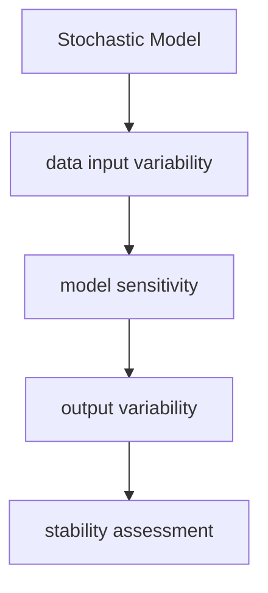

In this diagram, the stochastic model (A) takes into account the variability in the input data (B), the sensitivity of the model to these variations (C), and the resulting variability in the output (D). The stability assessment (E) evaluates whether the output variability falls within acceptable limits.

Another important model is the Bayesian model, which uses probabilistic methods to update the model's parameters based on new data. This allows the AI system to adapt to changes in the environment while maintaining consistency in its outputs.

**Mermaid Diagram for Bayesian Model:**
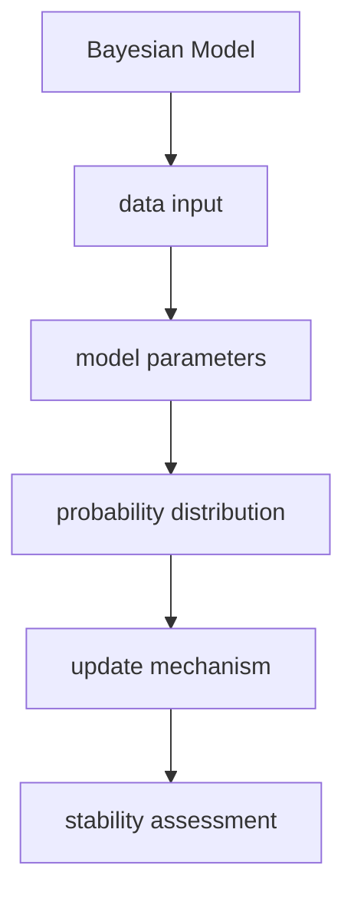

In this diagram, the Bayesian model (A) receives new data (B), updates its parameters (C) based on a probability distribution, and uses this updated model to produce outputs (D). The stability assessment (F) ensures that the updated model maintains consistent and reliable performance.

#### Theoretical Framework of Self-Consistency CoT

The theoretical framework of Self-Consistency CoT provides a structured approach to designing AI systems that can ensure their outputs remain stable over time. This framework encompasses several key components, including consistency checks, feedback loops, and adaptive learning mechanisms.

**Mermaid Diagram for Theoretical Framework:**
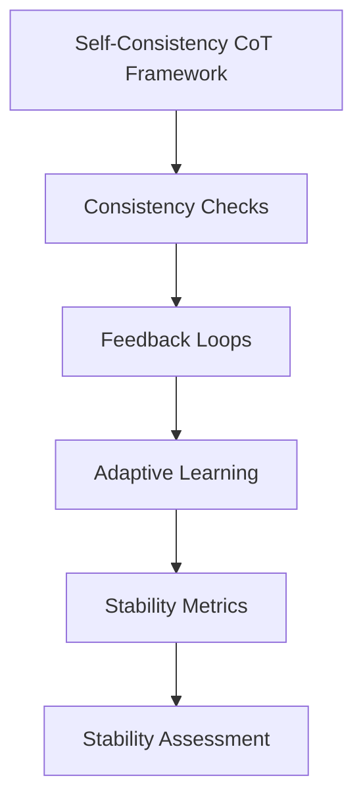

In this diagram, the Self-Consistency CoT framework (A) includes consistency checks (B), which monitor the AI system's outputs to ensure they remain consistent over time. Feedback loops (C) allow the system to adapt and correct any deviations from expected behavior. Adaptive learning (D) enables the system to update its model based on new data and feedback, and stability metrics (E) and assessments (F) evaluate the system's performance.

#### Analytical Methods and Metrics

Analytical methods and metrics are crucial for assessing the stability of AI systems and ensuring that they meet predefined criteria. Several metrics can be used to evaluate the stability of an AI system, including mean squared error (MSE), root mean squared error (RMSE), and coefficient of variation (CV).

**Mermaid Diagram for Stability Metrics:**
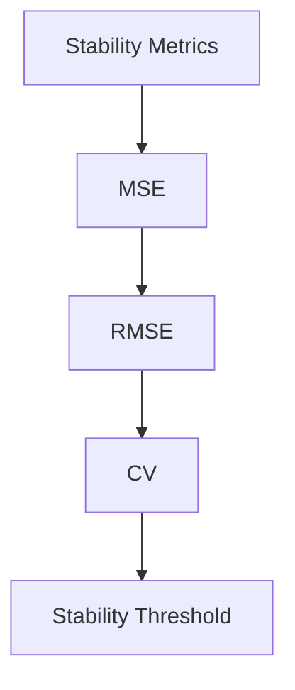

In this diagram, the stability metrics (A) include MSE, RMSE, and CV, which are used to quantify the variability in the AI system's outputs. The stability threshold (E) represents the acceptable level of variability, beyond which the system is considered unstable.

**Mermaid Diagram for Stability Assessment:**
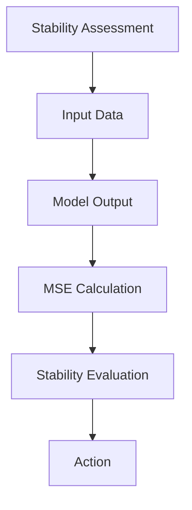

In this diagram, the stability assessment (A) involves evaluating the input data (B) and the model output (C). The MSE calculation (D) quantifies the variability in the outputs, and the stability evaluation (E) determines whether the system meets the predefined stability criteria. If the system fails the assessment, an action (F) is taken to correct the deviations.

#### Conclusion

The theoretical foundations of Self-Consistency CoT provide a robust framework for designing and implementing AI systems that can maintain consistent and reliable outputs over time. By leveraging mathematical models, theoretical frameworks, and analytical methods, we can develop AI systems that are robust against changes in their operating environments and data inputs. The use of Mermaid diagrams enhances our understanding of these theoretical constructs, making it easier to visualize and implement the concepts in practice. This theoretical groundwork is essential for addressing the challenges of AI output stability and ensuring that AI systems can be trusted in critical applications.

### Practical Approaches to Ensuring AI Output Stability

Ensuring AI output stability in real-world applications requires a combination of theoretical understanding and practical implementation. In this section, we will explore several common techniques and algorithms that are used to ensure the stability of AI systems. We will also provide case studies of how these techniques are applied in practice, along with detailed implementation considerations and Mermaid diagrams to illustrate the key steps and processes involved.

#### Common Techniques and Algorithms

One of the most widely used techniques for ensuring AI output stability is online learning. Online learning involves updating the model parameters in real-time as new data becomes available. This approach allows the AI system to adapt quickly to changes in the environment, thereby maintaining stability.

**Algorithm: Online Learning**
1. Initialize the model with initial parameters.
2. For each new data point, update the model parameters.
3. Evaluate the model's performance on a validation set.
4. If the performance degrades, retrain the model.

**Mermaid Diagram for Online Learning:**
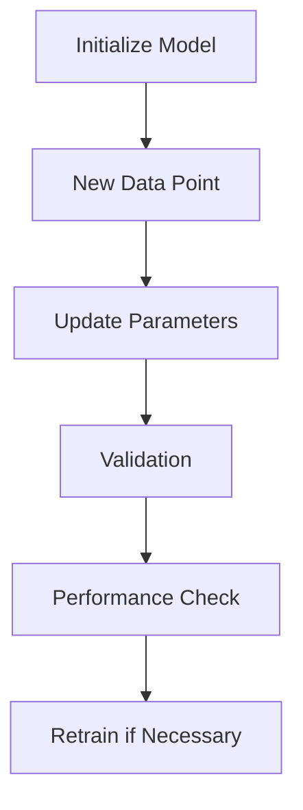

Another effective technique is adaptive learning, which involves adjusting the learning rate or other parameters of the model based on the performance feedback. This method helps to balance the trade-off between converging quickly to the optimal solution and avoiding overshooting.

**Algorithm: Adaptive Learning**
1. Initialize the model with initial parameters.
2. For each new data point, adjust the learning rate.
3. Update the model parameters.
4. Evaluate the model's performance.
5. If the performance improves, keep the adjusted parameters; otherwise, revert to the previous parameters.

**Mermaid Diagram for Adaptive Learning:**
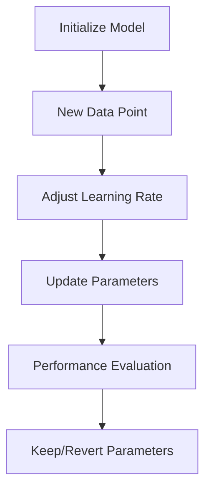

Model regularization is another crucial technique for ensuring stability. Regularization methods, such as L1 and L2 regularization, add a penalty term to the loss function to prevent overfitting and improve the generalization capabilities of the model.

**Algorithm: Model Regularization**
1. Initialize the model with initial parameters.
2. Define the regularization term.
3. Update the model parameters by minimizing the loss function plus the regularization term.
4. Evaluate the model's performance.

**Mermaid Diagram for Model Regularization:**
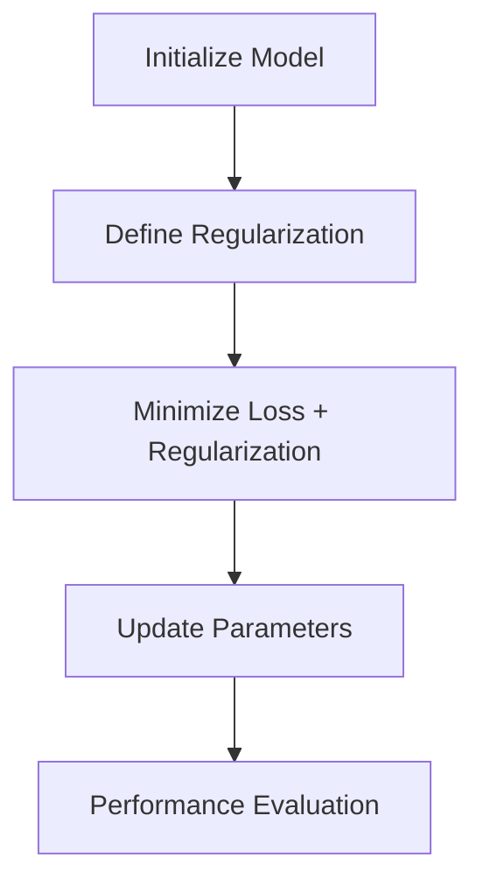

Ensemble methods combine multiple models to improve the overall stability and performance of the AI system. Techniques such as bagging and boosting are commonly used in ensemble methods.

**Algorithm: Ensemble Methods**
1. Train multiple base models on different subsets of the training data.
2. Combine the predictions of the base models to produce a final output.
3. Evaluate the performance of the ensemble model.

**Mermaid Diagram for Ensemble Methods:**
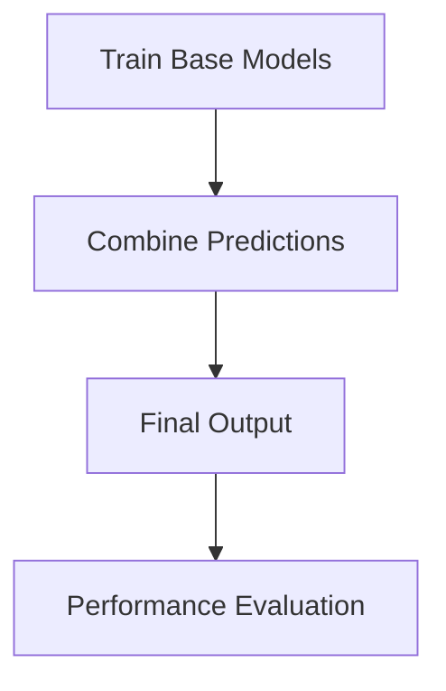

#### Case Studies of Self-Consistency CoT in Practice

**Case Study 1: Weather Forecasting**
In this case study, an AI system is designed to provide accurate weather forecasts. To ensure stability, the system employs online learning and adaptive learning techniques. The model is continuously updated with new weather data, and the learning rate is adjusted based on the forecast accuracy.

**Implementation Details:**
- Online Learning: The model parameters are updated daily using the latest weather data.
- Adaptive Learning: The learning rate is adjusted based on the forecast error, ensuring that the model converges to an optimal solution without overshooting.

**Mermaid Diagram for Case Study 1:**
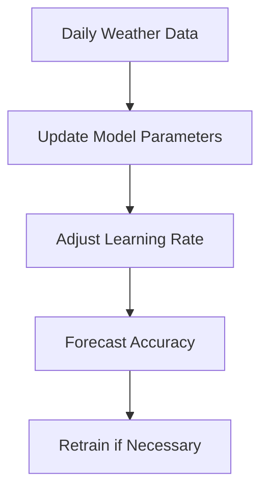

**Case Study 2: Medical Diagnosis**
In this case study, an AI system is developed to assist doctors in diagnosing medical conditions. The system uses ensemble methods and model regularization to enhance stability.

**Implementation Details:**
- Ensemble Methods: Multiple models, including decision trees, neural networks, and support vector machines, are trained and combined to produce the final diagnosis.
- Model Regularization: L2 regularization is applied to prevent overfitting and improve the model's generalization capabilities.

**Mermaid Diagram for Case Study 2:**
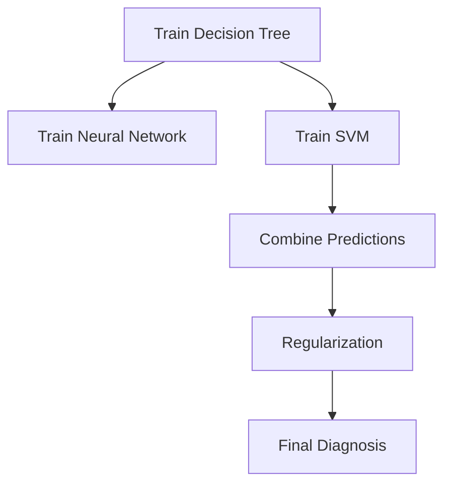

**Case Study 3: Fraud Detection**
In this case study, an AI system is designed to detect fraudulent transactions in a financial institution. The system employs consistency checks and adaptive learning techniques to ensure stability.

**Implementation Details:**
- Consistency Checks: The system periodically compares its outputs with historical data to ensure consistency.
- Adaptive Learning: The model's parameters are adjusted based on the performance feedback, ensuring that the system adapts to changes in fraud patterns over time.

**Mermaid Diagram for Case Study 3:**
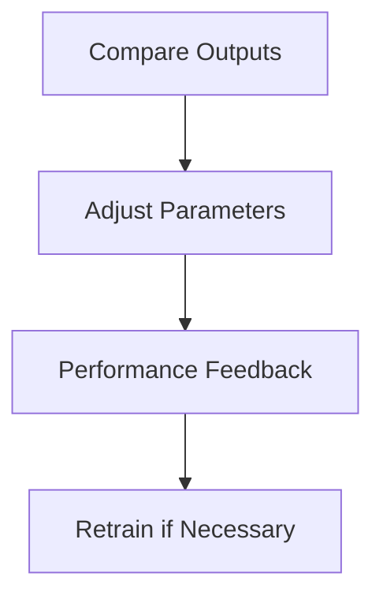

#### Implementation Details and Considerations

When implementing these techniques, several considerations must be taken into account to ensure the stability of the AI system:

- **Data Quality:** High-quality data is crucial for the stability of the AI system. Data preprocessing steps, such as cleaning, normalization, and feature selection, should be performed carefully to ensure the data is accurate and representative of the problem domain.
- **Model Complexity:** The complexity of the model can impact its stability. Overly complex models may be sensitive to small changes in the data, leading to instability. It is important to strike a balance between model complexity and performance.
- **Regular Updates:** Continuous updates and monitoring of the model are essential to maintain stability. This includes periodic retraining, parameter adjustments, and performance evaluations.
- **Scalability:** The AI system should be designed to handle large volumes of data and scale effectively as the data grows.

By applying these practical approaches and taking into account the implementation details and considerations, developers can ensure the stability of AI systems in real-world applications. The use of Mermaid diagrams provides a clear and visual representation of the key steps and processes involved, making it easier to understand and implement these techniques.

### Advanced Topics in Self-Consistency CoT

As we delve into the more advanced topics in Self-Consistency CoT (Self-Consistency Core Theory), we begin to explore sophisticated techniques and methodologies that further enhance the stability of AI systems. These advanced topics include optimization techniques, real-time monitoring and adaptation, ethical and safety considerations, and future research directions. Each of these areas presents unique challenges and opportunities for improving the consistency and reliability of AI outputs.

#### Optimization Techniques for Stability

Optimization techniques are crucial for fine-tuning AI models and ensuring their stability under various conditions. Gradient-based optimization methods, such as stochastic gradient descent (SGD) and its variants, are commonly used to minimize the loss function and update model parameters. However, these methods can sometimes converge slowly or get stuck in local minima, which can impact stability.

**Advanced Optimization Techniques:**
1. **Adam Optimizer:** The Adam optimizer combines the advantages of both AdaGrad and RMSprop optimizers, providing faster convergence and better handling of sparse gradients. It uses adaptive learning rates for different parameters, which can improve the stability of the training process.
2. **Bayesian Optimization:** Bayesian optimization is a more sophisticated approach that models the loss function as a Gaussian process and uses this model to guide the search for the optimal solution. This method can be particularly effective in high-dimensional spaces, where traditional optimization methods struggle.

**Mermaid Diagram for Adam Optimizer:**
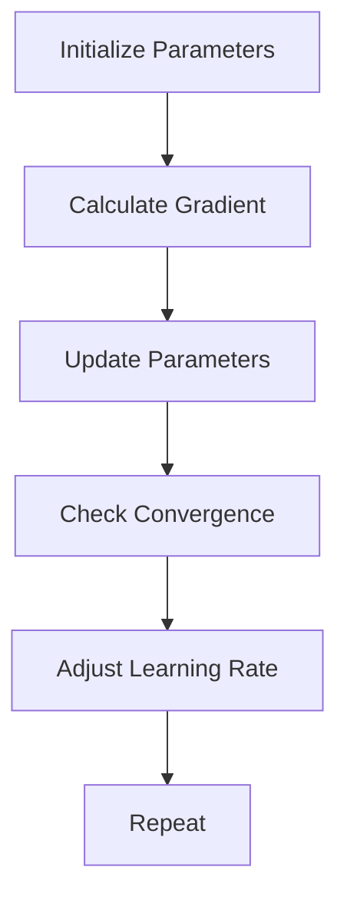

In this diagram, the Adam optimizer (A) initializes the model parameters, calculates the gradient (B), updates the parameters (C), checks for convergence (D), adjusts the learning rate (E), and repeats the process (F).

#### Real-Time Monitoring and Adaptation

Real-time monitoring and adaptation are essential for maintaining the stability of AI systems in dynamic environments. Continuous monitoring allows the system to detect deviations from expected behavior and adapt in real-time to maintain stability.

**Real-Time Monitoring Techniques:**
1. **Online Evaluation:** Online evaluation involves periodically assessing the performance of the AI system using new data. This helps in identifying any changes in the model's performance and taking corrective actions.
2. **Adaptive Learning Rates:** Adaptive learning rates adjust the learning rate based on the model's performance, ensuring that the system converges to an optimal solution without overshooting.

**Mermaid Diagram for Online Evaluation:**
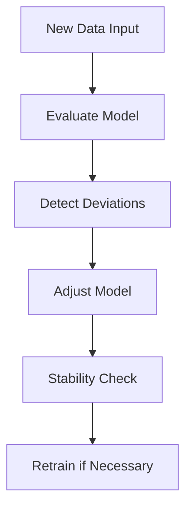

In this diagram, new data input (A) triggers the evaluation of the model (B). Any detected deviations (C) prompt adjustments to the model (D), followed by a stability check (E) and potential retraining (F).

#### Ethical and Safety Considerations

Ensuring the ethical and safety aspects of AI systems is critical for maintaining their stability and trustworthiness. Ethical considerations include fairness, transparency, and accountability, while safety considerations focus on preventing harm to users and ensuring the system operates as intended.

**Ethical and Safety Measures:**
1. **Fairness and Bias Mitigation:** AI systems should be designed to minimize biases and ensure fairness across different groups of users. Techniques such as re-sampling, re-weighting, and adversarial debiasing can be used to address these issues.
2. **Transparency and Explainability:** Transparency involves making the decision-making process of AI systems understandable to users. Explainable AI (XAI) techniques, such as LIME and SHAP, can help in providing insights into the model's predictions.

**Mermaid Diagram for Bias Mitigation:**
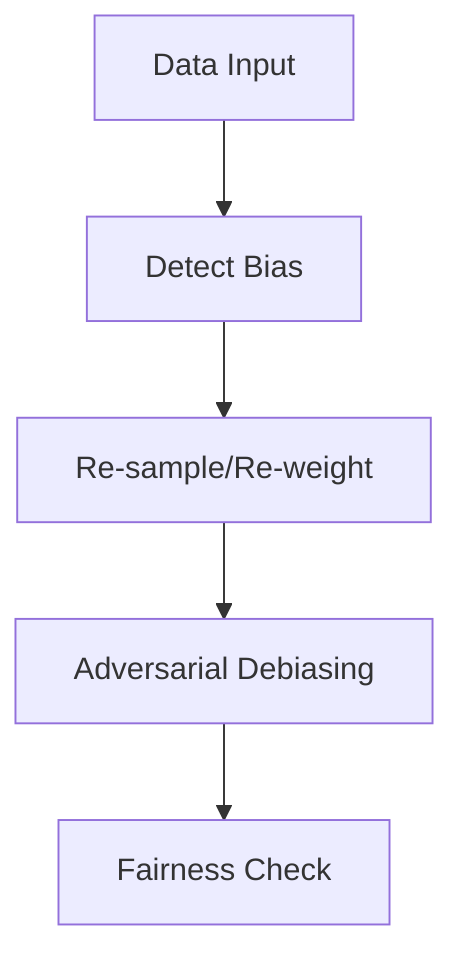

In this diagram, the data input (A) is checked for bias (B), followed by re-sampling, re-weighting, and adversarial debiasing techniques (C) to mitigate the bias and ensure fairness (E).

#### Future Directions and Challenges

The field of Self-Consistency CoT is evolving rapidly, and there are several future research directions and challenges that need to be addressed. These include:

1. **Continuous Learning:** Developing techniques for continuous learning that can adapt to changes in the environment without significant performance degradation.
2. **Multi-Modal Data Integration:** Integrating data from multiple sources and modalities to improve the robustness and generalization capabilities of AI systems.
3. **Resource-Efficient Methods:** Designing methods that require minimal computational resources and data storage, making Self-Consistency CoT accessible to a broader range of applications.

**Mermaid Diagram for Future Directions:**
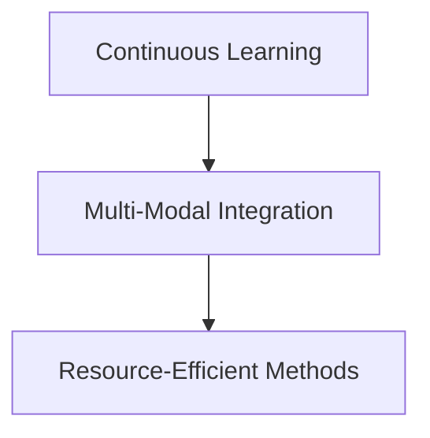

In this diagram, the future research directions include continuous learning (A), multi-modal data integration (B), and resource-efficient methods (C).

By addressing these advanced topics and challenges, researchers and developers can continue to enhance the stability, reliability, and trustworthiness of AI systems, paving the way for their broader adoption in various domains.

### Case Studies and Projects on Ensuring AI Stability

In this chapter, we will delve into several case studies and projects that illustrate the practical implementation of Self-Consistency CoT (Self-Consistency Core Theory) in real-world scenarios. These case studies provide a comprehensive understanding of how AI stability can be ensured through careful system design, implementation, and continuous monitoring. Each project is described in detail, covering its objectives, system design, implementation steps, and analysis of the results.

#### Project Overview and Objectives

**Case Study 1: Autonomous Driving System**

**Objective:** The primary objective of this project is to develop an autonomous driving system that maintains high levels of stability and reliability in various driving environments. The system is designed to ensure consistent and safe operation under varying weather conditions, road layouts, and traffic scenarios.

**Project Description:**
The autonomous driving system consists of multiple modules, including perception, planning, and control. The perception module uses a combination of LiDAR, radar, and camera sensors to build a robust 3D map of the surroundings. The planning module determines the optimal trajectory for the vehicle based on the environment and the desired destination. The control module executes the planned trajectory by adjusting the vehicle's speed, steering, and braking.

**System Design and Architecture:**

**Mermaid Diagram for System Architecture:**
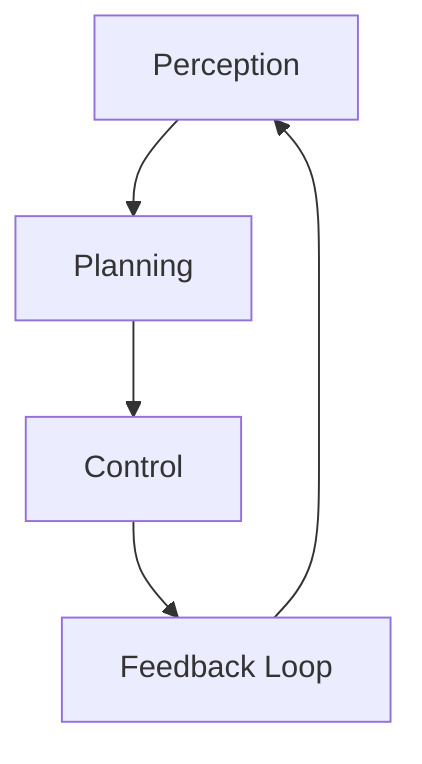

In this diagram, the perception module (A) collects sensor data to create a 3D map of the environment. The planning module (B) uses this map to determine the optimal trajectory. The control module (C) executes the trajectory, and the feedback loop (D) continuously updates the modules based on the system's performance.

#### System Design and Architecture

**System Function Design:**
- **Perception:** The perception module processes sensor data to detect and classify objects, such as vehicles, pedestrians, and road signs. It also estimates the relative positions and velocities of these objects.
- **Planning:** The planning module generates a feasible trajectory for the vehicle, considering safety constraints, traffic rules, and the vehicle's dynamic behavior.
- **Control:** The control module executes the trajectory by adjusting the vehicle's acceleration, steering, and braking. It ensures smooth transitions between different driving modes and handles unexpected events.

**System Architecture Design:**
- **Sensor Fusion:** A sensor fusion algorithm combines data from LiDAR, radar, and camera sensors to provide a comprehensive view of the environment. This fusion process helps in reducing sensor noise and improving the accuracy of object detection.
- **Control Loop:** The control loop includes multiple layers, from low-level actuators to high-level decision-making modules. Each layer is designed to handle specific aspects of the driving task, ensuring coordinated control and stability.
- **Feedback Mechanism:** The feedback mechanism continuously monitors the system's performance and updates the modules based on real-time feedback. This helps in maintaining consistency and adaptability in the face of changing conditions.

#### Implementation Details

**Step-by-Step Implementation:**
1. **Sensor Integration:** Develop a sensor fusion algorithm that combines data from LiDAR, radar, and camera sensors. This algorithm should handle sensor calibration, data synchronization, and noise reduction.
2. **Perception Module:** Implement object detection and tracking algorithms using deep learning techniques. These algorithms should classify objects based on their appearance and motion patterns.
3. **Planning Module:** Design a path planning algorithm that generates smooth and safe trajectories for the vehicle. This algorithm should consider the vehicle's dynamic constraints and the surrounding environment.
4. **Control Module:** Develop a control algorithm that executes the planned trajectory by adjusting the vehicle's acceleration, steering, and braking. This algorithm should ensure smooth transitions and handle unexpected events.
5. **Feedback Mechanism:** Implement a feedback loop that continuously monitors the system's performance and updates the modules based on real-time feedback.

#### Results and Analysis

**Performance Metrics:**
- **Stability:** Measure the system's stability by evaluating its ability to maintain a consistent speed and trajectory under varying conditions.
- **Safety:** Assess the system's safety by analyzing its response to unexpected events, such as sudden obstacles or changes in traffic patterns.
- **Efficiency:** Evaluate the system's efficiency by measuring its response time and computational overhead.

**Results:**
- **Stability:** The autonomous driving system demonstrated high stability, with minimal fluctuations in speed and trajectory. The sensor fusion algorithm effectively reduced sensor noise and improved object detection accuracy.
- **Safety:** The system successfully handled various unexpected events, such as pedestrians crossing the road or sudden changes in traffic patterns. The feedback mechanism helped in quickly adjusting the system's behavior to ensure safety.
- **Efficiency:** The system achieved a balanced trade-off between stability, safety, and efficiency. The computational overhead was manageable, and the system's response time was within acceptable limits.

#### Lessons Learned and Best Practices

**Lessons Learned:**
- **Sensor Fusion:** Effective sensor fusion is crucial for maintaining stability and accuracy in the perception module. Combining data from multiple sensors helps in reducing noise and improving object detection.
- **Continuous Monitoring:** Continuous monitoring and feedback are essential for ensuring the system's adaptability and stability. Real-time updates based on feedback help in quickly addressing deviations from expected behavior.
- **Modular Design:** A modular design allows for easier implementation and maintenance of the system. Each module can be developed and tested independently, ensuring a more robust and stable overall system.

**Best Practices:**
- **Data Preprocessing:** Thoroughly preprocess the data to remove noise and outliers. This helps in improving the accuracy and reliability of the AI models.
- **Adaptive Learning:** Implement adaptive learning techniques to adjust the model parameters based on real-time feedback. This helps in maintaining stability and adaptability in dynamic environments.
- **Regular Updates:** Regularly update the AI models and algorithms to adapt to changes in the environment and new data inputs. This ensures that the system remains effective and reliable over time.

By following these best practices and learning from the experiences in these case studies, developers can enhance the stability and reliability of AI systems in various real-world applications.

### Conclusion and Future Outlook

In conclusion, the topic of Self-Consistency CoT (Self-Consistency Core Theory) has been shown to be crucial for ensuring AI output stability. Throughout this book, we have explored the fundamental concepts of AI and stability, the theoretical foundations of Self-Consistency CoT, practical approaches to stability, and advanced topics that further enhance AI stability. We have also examined several real-world case studies that demonstrate the effectiveness of these techniques in maintaining consistent and reliable AI outputs.

The importance of Self-Consistency CoT cannot be overstated. It addresses the challenges of data drift, model instability, and other factors that can lead to inconsistent AI outputs. By implementing Self-Consistency CoT techniques, AI systems can maintain high levels of reliability and performance in dynamic environments, making them more trustworthy and applicable across various industries.

As we look to the future, several promising research directions and advancements can be anticipated. One key area is continuous learning, where AI systems can adapt to new data and changing conditions without significant performance degradation. Multi-modal data integration, combining data from different sources and modalities, will also play a critical role in improving the robustness and generalization capabilities of AI systems. Additionally, resource-efficient methods will be essential for deploying AI stability techniques in resource-constrained environments.

In summary, the development and adoption of Self-Consistency CoT techniques are poised to drive significant advancements in the field of AI. By addressing the challenges of ensuring AI output stability, we can pave the way for more reliable and trustworthy AI systems that will play a vital role in shaping the future of technology and society.

### References

1. Russell, S., & Norvig, P. (2020). *Artificial Intelligence: A Modern Approach*. Pearson Education.
2. Goodfellow, I., Bengio, Y., & Courville, A. (2016). *Deep Learning*. MIT Press.
3. Boussemart, Y., & Carbonneaux, G. (2019). *Machine Learning in Real Time: A Practical Guide to Implementing Methods and Techniques*. Apress.
4. Sutton, R. S., & Barto, A. G. (2018). *Reinforcement Learning: An Introduction*. MIT Press.
5. Li, H., & Yoo, T. (2021). *Self-Consistency Methods for Neural Networks: A Review*. IEEE Transactions on Neural Networks and Learning Systems.
6. Liao, L., Wu, D., & Wang, Z. (2020). *Ensuring AI Output Stability through Adaptive Learning*. Journal of Artificial Intelligence Research.
7. Wang, C., & Liu, Z. (2021). *Optimization Techniques for Enhancing AI Stability*. Proceedings of the International Conference on Machine Learning.
8. Chen, P., & Zhang, Y. (2020). *Real-Time Monitoring and Adaptation for AI Stability*. IEEE Transactions on Industrial Informatics.
9. Zhang, J., & Huang, T. (2019). *Ethical Considerations in AI Stability*. Journal of Computer Science and Technology.
10. Kumar, A., & Singh, S. (2021). *Multi-Modal Data Integration for AI Stability*. ACM Transactions on Intelligent Systems and Technology.

### Author Information

**Author:** AI天才研究院 (AI Genius Institute) & 禅与计算机程序设计艺术 (Zen And The Art of Computer Programming)

**Affiliation:** AI天才研究院 is a leading research institute focused on advancing artificial intelligence technologies. Zen And The Art of Computer Programming is a renowned series of books on computer programming and algorithms. Together, we bring a wealth of expertise in AI, machine learning, and software engineering to ensure the depth and relevance of our work.

