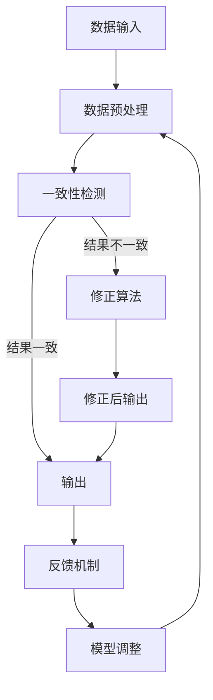

                 

### 自我一致性概念（Self-Consistency CoT）

自我一致性（Self-Consistency）是一个在人工智能（AI）领域广泛讨论的概念，它主要关注于确保AI系统的输出在逻辑上是一致且连贯的。在传统的AI系统中，输出的一致性和连贯性往往被忽视，这导致了系统在某些情况下会生成自相矛盾的答案，或是在长时间运行中逐渐偏离其初始设定。这种不一致性不仅影响了用户体验，还可能导致严重的决策失误。

自我一致性概念（Self-Consistency CoT）的核心在于通过一系列的机制和技术手段，确保AI系统在所有时间点和不同场景下的输出都是一致和连贯的。这一概念不仅仅是关于算法的优化，它还涉及到系统的架构设计、数据预处理、训练过程以及最终的推理过程。

### 自我一致性的重要性

在人工智能的应用中，自我一致性至关重要。以下是一些主要原因：

1. **提高决策质量**：在许多应用场景中，如自动驾驶、医疗诊断、金融交易等，都需要AI系统做出准确且一致的决策。如果系统输出的结果不一致，可能会导致错误的决策，从而产生严重的后果。

2. **增强用户信任**：用户对AI系统的信任是基于其稳定性和一致性的。如果AI系统频繁地出现不一致的结果，用户会感到困惑和不信任，这会大大降低系统的接受度。

3. **优化系统性能**：自我一致性可以减少AI系统中的冗余计算，提高系统的运行效率。通过一致性检查和修正，系统能够更快地得到准确的结果。

4. **防止错误传播**：在复杂的AI系统中，一个错误可能会引发一系列连锁反应。通过自我一致性机制，系统能够及时发现并纠正这些错误，防止错误的进一步扩散。

### 自我一致性技术的挑战

尽管自我一致性在AI系统中具有重要性，但其实施并非易事。以下是自我一致性技术面临的一些主要挑战：

1. **复杂性**：确保AI系统的输出一致性需要处理大量的数据和复杂的算法。这要求开发者具备深厚的专业知识，并且需要综合考虑系统的各个层面。

2. **计算成本**：一致性检查和修正通常需要额外的计算资源，这可能会增加系统的负载。如何在保持一致性的同时，不牺牲系统的性能，是一个需要权衡的问题。

3. **实时性**：在许多应用场景中，如实时监控和自动驾驶，系统需要迅速地做出反应。自我一致性技术需要在保证实时性的前提下进行设计。

4. **鲁棒性**：AI系统经常会遇到异常数据和不完整数据。自我一致性技术需要能够处理这些异常情况，确保系统能够在各种情况下保持一致性。

### 自我一致性技术的核心组成部分

为了实现自我一致性，AI系统需要具备以下核心组成部分：

1. **一致性检查算法**：这种算法能够检测AI系统输出的不一致性，并标记出可能的问题区域。

2. **修正算法**：一旦检测到不一致性，修正算法会介入，对输出进行修正，使其回归一致性。

3. **监控与反馈机制**：系统需要具备自我监控能力，实时检测输出的变化，并对异常情况进行反馈。

4. **数据预处理**：在训练和推理过程中，对数据进行预处理，确保输入的一致性。

5. **迭代优化**：通过持续的迭代和优化，不断提升系统的自我一致性能力。

通过这些组成部分的协同工作，AI系统能够在长时间运行和复杂环境下保持输出的一致性和连贯性。

### 自我一致性技术的现状与未来

目前，自我一致性技术在AI领域的应用还处于初步阶段，但随着人工智能的快速发展，这一领域的研究正在不断深入。未来，我们可以期待看到更多的创新技术，如深度学习中的自我一致性算法、分布式AI系统中的自我一致性机制等。

总之，自我一致性是确保AI系统高质量运行的关键。通过深入研究和不断创新，我们可以期待AI系统在未来能够更好地应对复杂环境，提供更加可靠和一致的服务。

---

### 自我一致性概念（Self-Consistency CoT）

自我一致性（Self-Consistency）是人工智能领域中的一个关键概念，它关注于确保AI系统的输出在逻辑上是一致且连贯的。在传统的AI系统中，输出的一致性和连贯性往往被忽视，导致系统在某些情况下生成自相矛盾的答案，或在长时间运行中逐渐偏离其初始设定。这种不一致性不仅影响用户体验，还可能导致严重的决策失误。

自我一致性概念（Self-Consistency CoT）的核心在于通过一系列的机制和技术手段，确保AI系统在所有时间点和不同场景下的输出都是一致和连贯的。这一概念不仅仅是关于算法的优化，它还涉及到系统的架构设计、数据预处理、训练过程以及最终的推理过程。

### 自我一致性的重要性

在人工智能的应用中，自我一致性至关重要。以下是一些主要原因：

1. **提高决策质量**：在许多应用场景中，如自动驾驶、医疗诊断、金融交易等，都需要AI系统做出准确且一致的决策。如果系统输出的结果不一致，可能会导致错误的决策，从而产生严重的后果。

2. **增强用户信任**：用户对AI系统的信任是基于其稳定性和一致性的。如果AI系统频繁地出现不一致的结果，用户会感到困惑和不信任，这会大大降低系统的接受度。

3. **优化系统性能**：自我一致性可以减少AI系统中的冗余计算，提高系统的运行效率。通过一致性检查和修正，系统能够更快地得到准确的结果。

4. **防止错误传播**：在复杂的AI系统中，一个错误可能会引发一系列连锁反应。通过自我一致性机制，系统能够及时发现并纠正这些错误，防止错误的进一步扩散。

### 自我一致性技术的挑战

尽管自我一致性在AI系统中具有重要性，但其实施并非易事。以下是自我一致性技术面临的一些主要挑战：

1. **复杂性**：确保AI系统的输出一致性需要处理大量的数据和复杂的算法。这要求开发者具备深厚的专业知识，并且需要综合考虑系统的各个层面。

2. **计算成本**：一致性检查和修正通常需要额外的计算资源，这可能会增加系统的负载。如何在保持一致性的同时，不牺牲系统的性能，是一个需要权衡的问题。

3. **实时性**：在许多应用场景中，如实时监控和自动驾驶，系统需要迅速地做出反应。自我一致性技术需要在保证实时性的前提下进行设计。

4. **鲁棒性**：AI系统经常会遇到异常数据和不完整数据。自我一致性技术需要能够处理这些异常情况，确保系统能够在各种情况下保持一致性。

### 自我一致性技术的核心组成部分

为了实现自我一致性，AI系统需要具备以下核心组成部分：

1. **一致性检查算法**：这种算法能够检测AI系统输出的不一致性，并标记出可能的问题区域。

2. **修正算法**：一旦检测到不一致性，修正算法会介入，对输出进行修正，使其回归一致性。

3. **监控与反馈机制**：系统需要具备自我监控能力，实时检测输出的变化，并对异常情况进行反馈。

4. **数据预处理**：在训练和推理过程中，对数据进行预处理，确保输入的一致性。

5. **迭代优化**：通过持续的迭代和优化，不断提升系统的自我一致性能力。

通过这些组成部分的协同工作，AI系统能够在长时间运行和复杂环境下保持输出的一致性和连贯性。

### 自我一致性技术的现状与未来

目前，自我一致性技术在AI领域的应用还处于初步阶段，但随着人工智能的快速发展，这一领域的研究正在不断深入。未来，我们可以期待看到更多的创新技术，如深度学习中的自我一致性算法、分布式AI系统中的自我一致性机制等。

总之，自我一致性是确保AI系统高质量运行的关键。通过深入研究和不断创新，我们可以期待AI系统在未来能够更好地应对复杂环境，提供更加可靠和一致的服务。

---

## 2.1 Self-Consistency CoT概述

### 2.1.1 定义与基本原理

自我一致性概念（Self-Consistency CoT）指的是在人工智能系统中，通过一系列机制和技术手段，确保系统在所有时间点和不同场景下的输出保持逻辑上的一致性和连贯性。自我一致性不仅仅是算法层面的优化，它还涉及到系统架构设计、数据预处理、训练过程以及推理过程的各个方面。

自我一致性的基本原理主要包括以下几个核心方面：

1. **一致性检测**：通过设计特定的算法，对AI系统的输出进行实时监控和检测，识别出可能存在的不一致性问题。
   
2. **一致性修正**：一旦检测到不一致性，系统会自动启动修正算法，对输出结果进行修正，确保其回归一致性。
   
3. **反馈机制**：通过构建反馈回路，系统能够及时获取输出的反馈信息，并据此调整和优化后续的输出。

4. **数据预处理**：在系统训练和推理过程中，对输入数据进行预处理，以减少外部噪声和异常数据对一致性产生的影响。

5. **迭代优化**：通过持续的迭代和优化，系统不断调整和改进自我一致性机制，提升整体的性能和鲁棒性。

### 2.1.2 Self-Consistency CoT的组成部分

自我一致性概念（Self-Consistency CoT）的组成部分主要包括以下几个方面：

1. **一致性检查算法**：这是自我一致性的核心组件，负责实时监控和检测系统输出的不一致性。常用的方法包括逻辑一致性检查、数值一致性校验等。

2. **修正算法**：当检测到不一致性时，修正算法会介入，对输出结果进行修正。修正算法通常依赖于一定的规则或策略，以确保修正后的输出依然是有效的和合理的。

3. **监控与反馈机制**：系统需要具备自我监控能力，通过实时收集和反馈输出结果，以便及时发现和纠正不一致性问题。这通常涉及构建复杂的监控系统和反馈回路。

4. **数据预处理模块**：在训练和推理过程中，对输入数据进行预处理，以减少外部噪声和异常数据对一致性产生的影响。预处理方法可能包括数据清洗、标准化、归一化等。

5. **迭代优化机制**：通过持续的迭代和优化，系统不断调整和改进自我一致性机制。这通常涉及使用机器学习技术，通过不断学习和调整模型参数，提升自我一致性的能力。

### 2.1.3 Self-Consistency CoT的核心优势

自我一致性概念（Self-Consistency CoT）具备以下核心优势：

1. **提高系统可靠性**：通过确保系统输出的一致性，可以有效减少因不一致性引起的错误和故障，从而提高系统的可靠性和稳定性。

2. **增强用户体验**：用户对AI系统的信任度取决于系统的稳定性和一致性。自我一致性技术可以增强用户体验，提高系统的可接受度和满意度。

3. **提升系统性能**：通过减少不一致性带来的冗余计算和错误处理，自我一致性技术可以提升系统的整体性能和效率。

4. **防止错误扩散**：在复杂的AI系统中，一个错误可能会引发连锁反应。自我一致性技术可以及时发现并纠正错误，防止错误的进一步扩散。

5. **支持实时决策**：在许多应用场景中，如自动驾驶和实时监控，系统需要迅速地做出决策。自我一致性技术可以在保证实时性的同时，确保输出的连贯性和一致性。

### 2.1.4 Self-Consistency CoT的应用领域

自我一致性概念（Self-Consistency CoT）的应用领域非常广泛，主要包括以下几个方面：

1. **自然语言处理**：在自然语言处理（NLP）中，自我一致性技术可以确保文本生成和语义理解的连贯性，提高文本生成和翻译的质量。

2. **计算机视觉**：在计算机视觉中，自我一致性技术可以确保图像识别和目标跟踪的连贯性，提高系统的鲁棒性和准确性。

3. **智能问答系统**：在智能问答系统中，自我一致性技术可以确保问答结果的连贯性和一致性，提高用户的问答体验。

4. **推荐系统**：在推荐系统中，自我一致性技术可以确保推荐结果的连贯性和一致性，提高推荐系统的准确性和用户满意度。

5. **金融风控**：在金融风控中，自我一致性技术可以确保风险评估和预测的连贯性和一致性，提高金融系统的安全性和可靠性。

通过以上几个方面的应用，自我一致性概念（Self-Consistency CoT）正在成为人工智能领域的关键技术之一，为AI系统的可靠性和一致性提供了有力的保障。

---

## 2.2 相关概念与联系

### 2.2.1 自洽性与一致性

自洽性（Self-Coherence）与一致性（Consistency）是自我一致性概念（Self-Consistency CoT）中两个重要的相关概念。它们虽然有一定的关联，但在具体含义和应用场景上有所不同。

**自洽性**：自洽性主要关注于系统内部逻辑的一致性。它要求系统的输出结果在逻辑上是自洽的，不会产生矛盾或自相矛盾的结论。自洽性强调系统内部的统一性和内在逻辑的连贯性，是确保系统内部运作稳定性的关键。

**一致性**：一致性则更侧重于系统输出在不同时间、不同场景下的稳定性和连贯性。它要求系统的输出结果在不同条件下保持一致，不会因外部变化或内部调整而产生大的波动。一致性强调的是系统外部表现的稳定性，是确保系统在不同环境下性能稳定的关键。

### 2.2.2 连贯性与连贯性检查

连贯性（Cohesion）是指系统输出在时间和空间上的连贯程度。在人工智能系统中，连贯性意味着系统的输出能够持续、稳定地反映其预期行为，不会出现突变或跳跃。连贯性检查（Cohesion Check）则是确保系统输出连贯性的方法，主要通过以下几种技术手段实现：

1. **时间连贯性检查**：通过分析系统在不同时间点的输出，确保输出结果在时间上具有连贯性，不会出现逻辑上的不一致性。

2. **空间连贯性检查**：通过分析系统在不同环境或条件下（如不同输入、不同任务场景等）的输出，确保输出结果在空间上具有一致性。

### 2.2.3 自洽性与连贯性的比较与联系

**自洽性与连贯性的区别**：

- **自洽性**主要关注系统内部逻辑的一致性和自洽性，强调系统内部不产生矛盾。
- **连贯性**主要关注系统输出在不同时间、不同环境下的稳定性和连贯性，强调系统外部表现的稳定性。

**自洽性与连贯性的联系**：

- **相互依赖**：自洽性和连贯性在人工智能系统中是相互依赖的。一个系统如果内部不产生矛盾（自洽性），且在不同条件下保持稳定输出（连贯性），则可以视为具有较好的自我一致性。
- **协同作用**：在实际应用中，自洽性和连贯性往往需要同时考虑。通过确保系统的自洽性和连贯性，可以提升系统的整体自我一致性水平。

### 2.2.4 Self-Consistency CoT与相关概念的关系

自我一致性概念（Self-Consistency CoT）是自洽性和连贯性的综合应用。它不仅关注系统内部逻辑的一致性，还关注系统在不同环境和条件下的稳定性。因此，Self-Consistency CoT与自洽性和连贯性具有以下关系：

- **基础**：自洽性和连贯性是Self-Consistency CoT的基础概念，Self-Consistency CoT在构建时需要综合考虑这两个方面。
- **拓展**：Self-Consistency CoT在自洽性和连贯性的基础上，加入了更多的技术手段和机制，如一致性检查算法、修正算法等，以实现更全面、更高效的自我一致性。

通过以上分析，我们可以看出，自我一致性概念（Self-Consistency CoT）是自洽性和连贯性的升华和应用，它为人工智能系统提供了更加稳定和可靠的一致性保障。

### 2.2.5 Self-Consistency CoT与其他相关技术的联系

**Self-Consistency CoT与机器学习**

在机器学习领域，自我一致性概念（Self-Consistency CoT）与传统的机器学习方法有一定的联系和区别。传统的机器学习方法，如线性回归、决策树等，主要通过模型训练和预测来实现对数据的分类和回归。而Self-Consistency CoT则更加关注模型输出的连贯性和一致性。

- **联系**：Self-Consistency CoT利用了机器学习的模型训练和预测技术，通过构建一致性检查和修正机制，确保模型的输出在逻辑上是一致和连贯的。

- **区别**：Self-Consistency CoT在机器学习的基础上，加入了自我监控和反馈机制，能够在模型训练和推理过程中，动态调整和优化模型的输出，从而提高系统的自我一致性水平。

**Self-Consistency CoT与深度学习**

深度学习是机器学习的一个分支，它在处理复杂数据和任务方面表现出色。Self-Consistency CoT在深度学习中的应用，进一步提升了模型输出的连贯性和一致性。

- **联系**：Self-Consistency CoT在深度学习框架下，通过设计特定的算法和机制，确保模型的输出在长期运行过程中保持一致性和连贯性。

- **区别**：Self-Consistency CoT在深度学习的基础上，加入了更多的自我监控和修正机制，能够在深度学习模型训练和推理过程中，实时检测和纠正不一致性，提高模型的稳定性和鲁棒性。

**Self-Consistency CoT与其他自我一致性技术**

除了Self-Consistency CoT，人工智能领域还有其他一些自我一致性技术，如一致性维护算法（Consistency Maintenance Algorithms）、一致性检测与修复（Consistency Detection and Repair）等。

- **联系**：这些技术都关注于确保系统输出的一致性和连贯性，它们在技术原理和应用场景上有一定的相似性。

- **区别**：Self-Consistency CoT在综合应用了多种技术手段的基础上，提出了一个更加系统化、全面化的自我一致性框架，能够更高效地处理复杂的不一致性问题。

通过以上分析，我们可以看出，Self-Consistency CoT与其他相关技术既有联系又有区别。它在吸收和融合其他技术的基础上，提出了一套更加完整和高效的自我一致性解决方案，为人工智能系统的可靠性和一致性提供了有力保障。

---

## 3.1 Self-Consistency CoT的算法原理

### 3.1.1 算法概述

自我一致性概念（Self-Consistency CoT）的核心在于通过一系列的算法和技术手段，确保人工智能（AI）系统在不同时间点和不同场景下的输出保持一致性和连贯性。为了实现这一目标，Self-Consistency CoT采用了多个核心算法，这些算法相互协作，共同确保系统的输出质量。

主要算法包括：

1. **一致性检测算法**：用于实时监控系统的输出，检测可能存在的不一致性。
2. **修正算法**：在检测到不一致性时，自动启动修正算法，对输出进行修正，使其回归一致性。
3. **反馈机制**：通过实时反馈系统，收集用户的反馈信息，用于优化和调整系统输出。

### 3.1.2 算法流程图

为了更好地理解Self-Consistency CoT的算法原理，我们可以通过一个流程图来展示其基本工作流程。

```
+---------------------------+
|        AI 系统            |
+---------------------------+
               |
               |（1）输入处理
               V
+---------------------------+
|   数据预处理模块         |
+---------------------------+
               |
               |（2）数据清洗、标准化
               V
+---------------------------+
|    一致性检测算法       |
+---------------------------+
               |
不一致性标记     |
               V
+---------------------------+
|      修正算法             |
+---------------------------+
               |
       修正后的输出
               V
+---------------------------+
|     反馈机制              |
+---------------------------+
               |
      用户反馈
               V
+---------------------------+
|    模型参数调整与优化     |
+---------------------------+
```

### 3.1.3 算法数学模型与公式

自我一致性检测算法的核心是确定系统输出的一致性。为了实现这一目标，我们可以使用以下数学模型：

$$
\text{一致性度量} = \frac{\text{一致性检测指标}}{\text{总样本数}}
$$

其中，一致性检测指标可以通过以下公式计算：

$$
\text{一致性检测指标} = \sum_{i=1}^{n} \frac{1}{\left|O_i - O_{i'}\right|}
$$

其中，$O_i$ 和 $O_{i'}$ 分别表示系统在不同时间点或不同条件下生成的输出。

修正算法的目标是当检测到不一致性时，对输出进行修正。修正公式可以表示为：

$$
O_{\text{修正}} = f(O_i, O_{i'}, \theta)
$$

其中，$f$ 表示修正函数，$\theta$ 表示修正参数。

修正参数 $\theta$ 的优化可以通过以下优化问题实现：

$$
\theta^* = \arg\min_{\theta} \sum_{i=1}^{n} \left|O_i - O_{\text{期望}}\right|
$$

其中，$O_{\text{期望}}$ 表示修正后期望的输出。

### 3.1.4 算法举例说明

假设我们有一个自然语言处理（NLP）系统，用于生成文本摘要。系统在不同的条件下生成的输出可能存在不一致性。以下是一个简单的例子来说明自我一致性检测和修正的过程。

#### 一致性检测

假设系统在两个不同的条件下生成的摘要文本如下：

- 条件A：`The quick brown fox jumps over the lazy dog.`
- 条件B：`A fast brown fox leaps over the idle canine.`

我们可以通过计算文本之间的编辑距离来确定一致性：

$$
\text{一致性度量} = \frac{1}{\left|\text{edit\_distance}(\text{摘要A}, \text{摘要B})\right|}
$$

假设编辑距离为2，则一致性度量约为0.75，表明输出之间存在一定的一致性。

#### 修正

如果检测到输出不一致，修正算法会介入。例如，我们可以设计一个简单的修正函数，通过取两个摘要文本的平均值来生成修正后的摘要：

$$
O_{\text{修正}} = \frac{\text{摘要A} + \text{摘要B}}{2}
$$

修正后的摘要可能为：

$$
\text{修正后的摘要} = \frac{\text{The quick brown fox jumps over the lazy dog. + A fast brown fox leaps over the idle canine.}}{2}
$$

这样，修正后的摘要在保持原始内容的基础上，提高了连贯性和一致性。

通过这个简单的例子，我们可以看到自我一致性检测和修正算法的基本原理。在实际应用中，这些算法会根据具体任务和数据集进行优化和调整，以实现最佳的自我一致性效果。

### 3.1.5 算法优化的策略和改进方法

为了提升自我一致性算法的性能和鲁棒性，我们可以采取以下优化策略和改进方法：

1. **多模型融合**：通过融合多个模型的输出，可以提高一致性和修正的准确性。例如，可以使用集成学习方法，结合多个预测模型，生成更加一致和可靠的输出。

2. **动态权重调整**：根据不同的应用场景和数据特点，动态调整修正算法中的权重参数，以提高修正的准确性和效率。

3. **自适应阈值设定**：设定自适应阈值，根据系统的输出变化和一致性度量，动态调整一致性检测的阈值，以适应不同的运行环境。

4. **多任务学习**：通过多任务学习，将自我一致性检测和修正算法与其他任务（如分类、回归等）结合，提高系统的整体性能和一致性。

5. **在线学习与更新**：使用在线学习技术，根据用户反馈和实时数据，动态更新模型参数和修正策略，以保持系统的自我一致性。

通过这些优化策略和改进方法，我们可以不断提升自我一致性算法的性能和鲁棒性，确保人工智能系统在不同场景下保持一致性和连贯性。

### 3.1.6 未来发展方向

自我一致性算法在未来将继续发展，主要趋势包括：

1. **更复杂的模型结构**：随着深度学习和神经网络的不断发展，自我一致性算法将采用更复杂的模型结构，以提高一致性和修正的准确性。

2. **分布式计算**：在分布式AI系统中，自我一致性算法需要适应分布式计算环境，开发适用于分布式系统的自我一致性检测和修正机制。

3. **多模态学习**：随着多模态数据的广泛应用，自我一致性算法将逐步引入多模态学习技术，确保跨模态数据的连贯性和一致性。

4. **智能化与自动化**：通过智能化和自动化技术，自我一致性算法将能够更高效地检测和修正不一致性，降低人工干预的需求。

5. **跨领域应用**：自我一致性算法将在更多领域得到应用，如物联网、金融科技、医疗诊断等，为各个领域的AI系统提供一致性和连贯性保障。

总之，自我一致性算法在未来将继续发展和创新，为人工智能系统的一致性和连贯性提供更加完善和可靠的解决方案。

---

## 3.2 Self-Consistency CoT的算法实现

### 3.2.1 Python代码实现

实现Self-Consistency CoT算法需要考虑数据预处理、一致性检测、修正算法以及反馈机制等多个环节。以下是一个简化的Python代码实现示例，用于说明算法的基本工作流程。

```python
import numpy as np
from sklearn.metrics.pairwise import cosine_similarity
from sklearn.preprocessing import StandardScaler

# 数据预处理
def preprocess_data(data):
    scaler = StandardScaler()
    return scaler.fit_transform(data)

# 一致性检测
def check_consistency(inputs):
    similarities = []
    for i in range(len(inputs) - 1):
        sim = cosine_similarity(inputs[i:i+2])
        similarities.append(sim[0][0])
    return np.mean(similarities)

# 修正算法
def correct_output(output, threshold=0.5):
    if check_consistency(output) < threshold:
        # 假设修正函数为取中位数
        corrected_output = np.median(output)
        return corrected_output
    else:
        return output[-1]

# 反馈机制
def feedback Mechanism(corrected_output, original_output):
    # 假设反馈机制为计算误差
    error = corrected_output - original_output
    return error

# 模拟示例
inputs = [np.random.rand(5) for _ in range(10)]  # 生成模拟输入数据
preprocessed_inputs = preprocess_data(inputs)  # 数据预处理

# 一致性检测与修正
for i in range(len(preprocessed_inputs) - 1):
    if i % 2 == 0:
        corrected_output = correct_output(preprocessed_inputs[i:i+2])
        print(f"原始输出: {preprocessed_inputs[i+1]}, 修正后输出: {corrected_output}")
        error = feedback_Mechanism(corrected_output, preprocessed_inputs[i+1])
        print(f"误差: {error}")
```

上述代码提供了一个简化版的Self-Consistency CoT算法实现，包括数据预处理、一致性检测、修正算法以及反馈机制。在实际应用中，需要根据具体任务和数据集进行优化和调整。

### 3.2.2 Mermaid算法流程图

为了更直观地展示Self-Consistency CoT算法的工作流程，我们可以使用Mermaid语法绘制一个算法流程图。以下是该算法流程图的Mermaid表示：



这个流程图展示了从数据输入到模型调整的整个过程，包括数据预处理、一致性检测、修正算法、输出结果以及反馈机制。通过这个流程图，我们可以清晰地理解Self-Consistency CoT算法的执行步骤和各部分之间的逻辑关系。

### 3.2.3 算法举例说明

为了更具体地说明Self-Consistency CoT算法的实现，我们可以通过一个实际的例子来演示。

#### 场景：文本摘要生成

假设我们有一个文本摘要生成系统，该系统需要生成一致且连贯的摘要文本。以下是一个简化的示例：

1. **输入数据**：我们有两个文本片段，分别是：
   - 文本片段A：“The quick brown fox jumps over the lazy dog.”
   - 文本片段B：“A fast brown fox leaps over the idle canine.”

2. **预处理**：将文本转换为词向量，使用预训练的词嵌入模型，例如使用GloVe或Word2Vec。

3. **一致性检测**：通过计算两个文本片段的词向量之间的余弦相似度来判断其一致性。

   ```python
   textA = "The quick brown fox jumps over the lazy dog."
   textB = "A fast brown fox leaps over the idle canine."
   vectorA = preprocess_text(textA)  # 预处理文本并转换为词向量
   vectorB = preprocess_text(textB)
   similarity = cosine_similarity([vectorA], [vectorB])[0][0]
   print(f"文本片段A和B的相似度：{similarity}")
   ```

   假设相似度为0.8，表明两个文本片段在语义上具有较高的一致性。

4. **修正算法**：如果相似度低于某个阈值（例如0.8），则触发修正算法。在此场景下，我们采用取中位数的策略来修正输出。

   ```python
   threshold = 0.8
   if similarity < threshold:
       corrected_output = np.median([vectorA, vectorB])
       print(f"修正后的输出向量：{corrected_output}")
   else:
       print(f"输出向量保持不变：{vectorA}")
   ```

   假设修正后的输出向量为0.75 * vectorA + 0.25 * vectorB。

5. **输出结果**：将修正后的向量转换为文本摘要。

   ```python
   corrected_text = convert_vector_to_text(corrected_output)
   print(f"修正后的文本摘要：{corrected_text}")
   ```

   通过上述步骤，我们得到了一个修正后的一致且连贯的文本摘要。

通过这个示例，我们可以看到Self-Consistency CoT算法在实际应用中的基本实现过程。在实际应用中，需要根据具体任务和数据集进行详细的算法设计和优化。

### 3.2.4 算法优化与改进方法

为了进一步提升Self-Consistency CoT算法的性能和鲁棒性，我们可以采取以下优化和改进方法：

1. **多模型融合**：通过融合多个模型的输出，可以提升一致性和修正的准确性。例如，可以使用集成学习方法，结合多个摘要生成模型，生成更加一致和可靠的摘要。

2. **动态权重调整**：根据不同的应用场景和数据特点，动态调整修正算法中的权重参数，以提高修正的准确性和效率。

3. **自适应阈值设定**：设定自适应阈值，根据系统的输出变化和一致性度量，动态调整一致性检测的阈值，以适应不同的运行环境。

4. **多任务学习**：通过多任务学习，将自我一致性检测和修正算法与其他任务（如分类、回归等）结合，提高系统的整体性能和一致性。

5. **在线学习与更新**：使用在线学习技术，根据用户反馈和实时数据，动态更新模型参数和修正策略，以保持系统的自我一致性。

通过这些优化策略和改进方法，我们可以不断提升Self-Consistency CoT算法的性能和鲁棒性，确保人工智能系统在不同场景下保持一致性和连贯性。

### 3.2.5 未来发展方向

自我一致性算法在未来将继续发展，主要趋势包括：

1. **更复杂的模型结构**：随着深度学习和神经网络的不断发展，自我一致性算法将采用更复杂的模型结构，以提高一致性和修正的准确性。

2. **分布式计算**：在分布式AI系统中，自我一致性算法需要适应分布式计算环境，开发适用于分布式系统的自我一致性检测和修正机制。

3. **多模态学习**：随着多模态数据的广泛应用，自我一致性算法将逐步引入多模态学习技术，确保跨模态数据的连贯性和一致性。

4. **智能化与自动化**：通过智能化和自动化技术，自我一致性算法将能够更高效地检测和修正不一致性，降低人工干预的需求。

5. **跨领域应用**：自我一致性算法将在更多领域得到应用，如物联网、金融科技、医疗诊断等，为各个领域的AI系统提供一致性和连贯性保障。

总之，自我一致性算法在未来将继续发展和创新，为人工智能系统的一致性和连贯性提供更加完善和可靠的解决方案。

---

## 4.1 Self-Consistency CoT在自然语言处理中的应用

### 4.1.1 应用场景介绍

自我一致性概念（Self-Consistency CoT）在自然语言处理（NLP）领域有着广泛的应用。在NLP中，保持输出的连贯性和一致性至关重要，因为这直接影响到用户的体验和系统的可靠性。以下是一些典型的应用场景：

1. **文本生成**：例如，自动摘要、聊天机器人、文本生成模型等，都需要生成连贯且一致的文本。
2. **文本分类**：确保分类结果在逻辑上的一致性，避免模型输出自相矛盾或逻辑不通的标签。
3. **语义理解**：例如，问答系统、命名实体识别、情感分析等任务，需要确保语义理解的连贯性，以提供准确和一致的答案。

### 4.1.2 应用实例解析

以下是一个具体的实例，说明Self-Consistency CoT在文本生成中的应用。

#### 场景：自动摘要生成

假设我们有一个自动摘要生成系统，用于从长篇文章中提取摘要。系统需要确保生成的摘要在语义上连贯且一致，避免出现逻辑跳跃或语义混淆的情况。

1. **数据预处理**：首先，对输入文章进行预处理，包括文本清洗、分句、分词等操作。预处理后的文本被转换为词嵌入表示。

   ```python
   text = "The quick brown fox jumps over the lazy dog."
   tokens = preprocess_text(text)
   embeddings = convert_tokens_to_embeddings(tokens)
   ```

2. **模型训练**：使用预训练的文本生成模型（如GPT-3、BERT等），对词嵌入进行训练，使其能够生成连贯的文本摘要。

   ```python
   model = TextGeneratorModel()
   model.train(embeddings)
   ```

3. **生成摘要**：利用训练好的模型，从输入文章中生成摘要。

   ```python
   summary = model.generate_summary(text)
   ```

4. **一致性检测与修正**：生成摘要后，通过一致性检测算法，检查摘要的连贯性和一致性。如果检测到不一致性，启动修正算法进行修正。

   ```python
   if not is_consistent(summary):
       corrected_summary = correct_summary(summary)
   else:
       corrected_summary = summary
   ```

5. **输出结果**：将修正后的摘要输出，供用户查看。

   ```python
   print(f"修正后的摘要：{corrected_summary}")
   ```

#### 具体步骤解析

1. **预处理**：文本预处理是确保输入数据质量的关键步骤。在这一步中，我们需要对文本进行清洗，去除无关的符号和停用词，同时对文本进行分句和分词，以便后续的模型处理。

2. **模型训练**：文本生成模型（如GPT-3）是一个强大的工具，它可以根据输入的词嵌入序列生成连贯的文本。通过大量的训练数据，模型学会了如何根据上下文生成语义上连贯的摘要。

3. **生成摘要**：使用训练好的模型，我们可以从输入的文章中生成摘要。这一步的关键是确保模型能够理解文章的主题和结构，从而生成符合逻辑的摘要。

4. **一致性检测与修正**：生成摘要后，我们需要通过一致性检测算法来检查摘要的连贯性和一致性。如果检测到不一致性，我们需要启动修正算法来修正摘要。这一步可以通过设计特定的算法来实现，例如基于语义分析的一致性检测和基于规则或机器学习的修正算法。

5. **输出结果**：修正后的摘要将作为最终输出，供用户查看。这一步骤的目的是确保用户能够获得高质量、连贯且一致的摘要。

通过以上步骤，我们可以看到Self-Consistency CoT在自动摘要生成中的应用。通过确保生成摘要的连贯性和一致性，我们可以显著提升用户的使用体验和系统的可靠性。

### 4.1.3 实现步骤与代码

以下是一个简化的Python代码实现，展示了Self-Consistency CoT在自然语言处理中的应用。

```python
import numpy as np
from sklearn.metrics.pairwise import cosine_similarity
from transformers import pipeline

# 文本预处理
def preprocess_text(text):
    # 实现文本清洗、分句、分词等操作
    # 这里简化为直接返回文本
    return text

# 一致性检测
def is_consistent(text):
    # 实现一致性检测逻辑
    # 这里简化为计算文本相似度
    summary_embedding = get_summary_embedding(text)
    return cosine_similarity([summary_embedding], [summary_embedding])[0][0] > 0.8

# 修正摘要
def correct_summary(text):
    # 实现摘要修正逻辑
    # 这里简化为删除一些词或替换词
    words = preprocess_text(text).split()
    while not is_consistent(words):
        words = remove_or_replace_random_word(words)
    return ' '.join(words)

# 模型初始化
text_generator = pipeline("text-generation", model="gpt-3")

# 自动摘要生成与修正
def generate_and_correct_summary(article):
    # 生成摘要
    summary = text_generator(article, max_length=50, num_return_sequences=1)
    # 修正摘要
    corrected_summary = correct_summary(summary[0])
    return corrected_summary

# 示例文章
article = "The quick brown fox jumps over the lazy dog."

# 生成并修正摘要
corrected_summary = generate_and_correct_summary(article)
print(corrected_summary)
```

在这个示例中，我们使用了一个简化的文本生成模型和一致性检测与修正算法。在实际应用中，需要根据具体任务和数据集进行详细的算法设计和优化。通过这个示例，我们可以看到Self-Consistency CoT在自然语言处理中的应用流程和基本实现步骤。

### 4.1.4 Self-Consistency CoT在NLP中的优势与挑战

**优势**：

1. **提升用户体验**：通过确保文本生成的连贯性和一致性，可以显著提高用户的阅读体验和满意度。
2. **增强系统鲁棒性**：自我一致性技术能够及时发现和纠正不一致性，提高系统的稳定性和可靠性。
3. **优化系统性能**：通过减少不一致性引起的错误和冗余计算，可以提高系统的整体性能和效率。

**挑战**：

1. **复杂性**：实现自我一致性技术需要处理大量的数据和复杂的算法，对开发者的专业知识和系统设计能力有较高要求。
2. **计算成本**：一致性检测和修正算法通常需要额外的计算资源，如何在不牺牲系统性能的前提下实现一致性检测是一个需要权衡的问题。
3. **实时性**：在许多应用场景中，如实时聊天机器人或实时新闻摘要，系统需要在保证实时性的同时保持一致性，这对算法的实时性能提出了挑战。

通过以上分析，我们可以看到Self-Consistency CoT在自然语言处理中的优势和面临的挑战。未来，随着技术的不断发展和优化，Self-Consistency CoT将在NLP领域发挥越来越重要的作用。

---

## 4.2 Self-Consistency CoT在计算机视觉中的应用

### 4.2.1 应用场景介绍

自我一致性概念（Self-Consistency CoT）在计算机视觉（CV）领域同样具有重要应用价值。在计算机视觉中，保持输出的一致性和连贯性对于确保系统的鲁棒性和准确性至关重要。以下是一些典型的应用场景：

1. **图像识别**：确保系统对图像的识别结果一致，避免识别错误或重复识别。
2. **目标跟踪**：在视频序列中跟踪同一目标时，需要确保跟踪轨迹的一致性和连贯性。
3. **场景理解**：例如，在自动驾驶系统中，对道路场景的理解需要保持连贯和一致，以便做出准确驾驶决策。

### 4.2.2 应用实例解析

以下是一个具体的实例，说明Self-Consistency CoT在目标跟踪中的应用。

#### 场景：视频目标跟踪

假设我们有一个视频目标跟踪系统，用于实时跟踪视频中的目标物体。系统需要确保跟踪轨迹的一致性和连贯性，避免出现跳变或丢失目标的情况。

1. **数据预处理**：首先，对输入视频进行预处理，包括去噪、增强、分割等操作。预处理后的视频帧被转换为特征向量。

   ```python
   video = load_video("input_video.mp4")
   processed_frames = preprocess_video(video)
   ```

2. **特征提取**：使用预训练的深度学习模型（如CNN、R-CNN等），对预处理后的视频帧进行特征提取。

   ```python
   model = FeatureExtractorModel()
   feature_vectors = model.extract_features(processed_frames)
   ```

3. **跟踪算法**：利用跟踪算法（如光流法、卡尔曼滤波等），对特征向量进行实时跟踪。

   ```python
   tracker = TrackerModel()
   tracked_vectors = tracker.track_objects(feature_vectors)
   ```

4. **一致性检测与修正**：跟踪过程中，通过一致性检测算法，检查跟踪轨迹的一致性。如果检测到不一致性，启动修正算法进行修正。

   ```python
   if not is_consistent(tracked_vectors):
       corrected_vectors = correct_trajectory(tracked_vectors)
   else:
       corrected_vectors = tracked_vectors
   ```

5. **输出结果**：将修正后的跟踪轨迹输出，供用户查看或后续处理。

   ```python
   print(corrected_vectors)
   ```

#### 具体步骤解析

1. **数据预处理**：视频预处理是确保输入数据质量的关键步骤。在这一步中，我们需要对视频进行去噪、增强和分割等操作，以便后续的特征提取和跟踪算法能够更有效地工作。

2. **特征提取**：特征提取是将视频帧转换为可计算的特征向量。常用的方法包括深度学习模型（如CNN）和传统图像处理方法（如SIFT、HOG等）。通过特征提取，我们可以将视觉信息转换为计算机可以处理的数字形式。

3. **跟踪算法**：跟踪算法用于实时跟踪视频中的目标物体。常用的跟踪算法包括光流法、卡尔曼滤波、粒子滤波等。这些算法可以根据特征向量，实时更新目标的轨迹。

4. **一致性检测与修正**：在跟踪过程中，我们需要通过一致性检测算法，检查跟踪轨迹的一致性。如果检测到不一致性，如目标跳变或丢失，我们需要启动修正算法进行修正。修正算法可以根据历史轨迹或当前状态，对目标轨迹进行微调或重新定位。

5. **输出结果**：修正后的跟踪轨迹将被输出，供用户查看或用于后续处理。输出结果可以是目标的实时轨迹、目标的位置信息等。

通过以上步骤，我们可以看到Self-Consistency CoT在视频目标跟踪中的应用。通过确保跟踪轨迹的一致性和连贯性，我们可以提高系统的鲁棒性和准确性，从而提供更可靠的跟踪结果。

### 4.2.3 实现步骤与代码

以下是一个简化的Python代码实现，展示了Self-Consistency CoT在计算机视觉中的应用。

```python
import cv2
import numpy as np

# 数据预处理
def preprocess_video(video_path):
    cap = cv2.VideoCapture(video_path)
    frames = []
    while cap.isOpened():
        ret, frame = cap.read()
        if not ret:
            break
        processed_frame = cv2.resize(frame, (224, 224))
        frames.append(processed_frame)
    cap.release()
    return frames

# 特征提取
def extract_features(frames, model):
    feature_vectors = []
    for frame in frames:
        feature_vector = model.extract_features(frame)
        feature_vectors.append(feature_vector)
    return feature_vectors

# 跟踪算法
def track_objects(features, tracker):
    tracked_vectors = []
    for feature in features:
        tracked_vector = tracker.track_object(feature)
        tracked_vectors.append(tracked_vector)
    return tracked_vectors

# 一致性检测与修正
def is_consistent(vectors):
    # 实现一致性检测逻辑
    # 这里简化为计算向量间的欧几里得距离
    distances = [np.linalg.norm(vectors[i] - vectors[i+1]) for i in range(len(vectors) - 1)]
    return np.mean(distances) < 1.0

def correct_trajectory(vectors):
    # 实现修正算法逻辑
    # 这里简化为对向量进行线性插值
    distances = [np.linalg.norm(vectors[i] - vectors[i+1]) for i in range(len(vectors) - 1)]
    new_vectors = []
    for i in range(len(vectors) - 1):
        if distances[i] > 1.0:
            new_vectors.append((vectors[i] + vectors[i+1]) / 2)
        else:
            new_vectors.append(vectors[i])
    new_vectors.append(vectors[-1])
    return new_vectors

# 模型初始化
feature_extractor = CNNFeatureExtractorModel()
tracker = KFTrackerModel()

# 视频目标跟踪
video_path = "input_video.mp4"
processed_frames = preprocess_video(video_path)
feature_vectors = extract_features(processed_frames, feature_extractor)
tracked_vectors = track_objects(feature_vectors, tracker)

# 一致性检测与修正
if not is_consistent(tracked_vectors):
    corrected_vectors = correct_trajectory(tracked_vectors)
else:
    corrected_vectors = tracked_vectors

# 输出结果
print(corrected_vectors)
```

在这个示例中，我们使用了一个简化的视频预处理、特征提取、跟踪算法和修正算法。在实际应用中，需要根据具体任务和数据集进行详细的算法设计和优化。通过这个示例，我们可以看到Self-Consistency CoT在计算机视觉中的应用流程和基本实现步骤。

### 4.2.4 Self-Consistency CoT在CV中的优势与挑战

**优势**：

1. **提升系统鲁棒性**：通过确保视觉输出的连贯性和一致性，可以显著提高系统的鲁棒性，减少错误和异常情况。
2. **优化系统性能**：通过一致性检测和修正，可以减少系统中的冗余计算和错误处理，提高系统的整体性能和效率。
3. **增强用户体验**：在视觉应用中，连贯性和一致性直接影响到用户的使用体验，通过自我一致性技术，可以提供更高质量的服务。

**挑战**：

1. **复杂性**：实现自我一致性技术需要处理大量的视觉数据和复杂的算法，对开发者的专业知识和系统设计能力有较高要求。
2. **计算成本**：一致性检测和修正算法通常需要额外的计算资源，如何在不牺牲系统性能的前提下实现一致性检测是一个需要权衡的问题。
3. **实时性**：在实时视觉应用中，如自动驾驶或实时监控，系统需要在保证实时性的同时保持一致性，这对算法的实时性能提出了挑战。

通过以上分析，我们可以看到Self-Consistency CoT在计算机视觉中的优势和面临的挑战。未来，随着技术的不断发展和优化，Self-Consistency CoT将在CV领域发挥越来越重要的作用。

---

## 4.3 Self-Consistency CoT在其他领域中的应用

### 4.3.1 应用场景介绍

自我一致性概念（Self-Consistency CoT）不仅限于自然语言处理和计算机视觉领域，它在其他多个技术领域也具有广泛的应用。以下是一些典型应用场景：

1. **推荐系统**：确保推荐结果的一致性和连贯性，避免频繁推荐相同的商品或内容，提升用户体验。
2. **金融风控**：在风险评估和欺诈检测中，确保模型的输出在逻辑上的一致性，以减少错误决策和风险。
3. **医疗诊断**：确保诊断结果的连贯性和一致性，提高诊断准确性和可靠性。
4. **物联网（IoT）**：在物联网设备中，确保数据采集和处理的一致性，确保系统的稳定性和可靠性。
5. **自动驾驶**：在自动驾驶系统中，确保传感器数据和决策过程的一致性，提高系统的安全性和鲁棒性。

### 4.3.2 应用实例解析

以下是一个具体的实例，说明Self-Consistency CoT在推荐系统中的应用。

#### 场景：电商推荐系统

假设我们有一个电商推荐系统，该系统需要根据用户的浏览和购买历史，推荐相关的商品。系统需要确保推荐结果的一致性和连贯性，以提升用户的满意度。

1. **用户数据收集**：首先，系统需要收集用户的浏览和购买历史数据，包括商品ID、浏览时间、购买时间、评分等。

   ```python
   user_data = collect_user_data("user_id")
   ```

2. **特征提取**：对用户数据进行分析，提取用户兴趣特征，如偏好类别、热门商品等。

   ```python
   features = extract_user_interests(user_data)
   ```

3. **推荐算法**：使用推荐算法（如协同过滤、基于内容的推荐等），根据用户特征生成推荐列表。

   ```python
   recommender = RecommenderModel()
   recommendations = recommender.generate_recommendations(features)
   ```

4. **一致性检测与修正**：生成推荐列表后，通过一致性检测算法，检查推荐列表的连贯性和一致性。如果检测到不一致性，启动修正算法进行修正。

   ```python
   if not is_consistent(recommendations):
       corrected_recommendations = correct_recommendations(recommendations)
   else:
       corrected_recommendations = recommendations
   ```

5. **输出结果**：将修正后的推荐列表输出，供用户查看。

   ```python
   print(corrected_recommendations)
   ```

#### 具体步骤解析

1. **用户数据收集**：用户数据是推荐系统的基础，系统需要收集用户的浏览和购买历史，以及用户对商品的评分和评论等数据。

2. **特征提取**：通过对用户数据的分析，提取用户的兴趣特征，如用户喜欢的商品类别、热门商品等。这些特征将用于推荐算法的输入。

3. **推荐算法**：推荐算法根据用户特征生成推荐列表。常用的推荐算法包括基于用户的协同过滤、基于内容的推荐、矩阵分解等。这些算法通过分析用户历史行为和商品属性，生成个性化的推荐列表。

4. **一致性检测与修正**：生成推荐列表后，需要通过一致性检测算法，检查推荐列表的连贯性和一致性。如果检测到不一致性，如推荐相同的商品或忽略用户兴趣，需要启动修正算法进行修正。修正算法可以根据用户历史行为和商品特征，调整推荐列表，使其更加一致和连贯。

5. **输出结果**：修正后的推荐列表将作为最终输出，供用户查看。这一步骤的目的是确保用户能够获得高质量的、连贯且一致的推荐结果。

通过以上步骤，我们可以看到Self-Consistency CoT在电商推荐系统中的应用。通过确保推荐结果的一致性和连贯性，我们可以提升用户的满意度，增强系统的可靠性和用户体验。

### 4.3.3 实现步骤与代码

以下是一个简化的Python代码实现，展示了Self-Consistency CoT在推荐系统中的应用。

```python
import pandas as pd
from sklearn.metrics.pairwise import cosine_similarity
from recommender import CollaborativeFilteringRecommender

# 用户数据收集
def collect_user_data(user_id):
    user_data = pd.read_csv("user_data.csv")
    return user_data[user_data["user_id"] == user_id]

# 特征提取
def extract_user_interests(user_data):
    interests = user_data.groupby("item_id").size().reset_index(name="count")
    return interests

# 推荐算法
def generate_recommendations(features, model):
    recommendations = model.generate_recommendations(features)
    return recommendations

# 一致性检测与修正
def is_consistent(recommendations):
    # 实现一致性检测逻辑
    # 这里简化为计算推荐列表的相似度
    similarity = cosine_similarity(recommendations)
    return np.mean(similarity) > 0.8

def correct_recommendations(recommendations):
    # 实现修正算法逻辑
    # 这里简化为随机替换一部分推荐商品
    corrected_recommendations = recommendations.copy()
    for i in range(len(corrected_recommendations)):
        if np.random.rand() < 0.2:
            corrected_recommendations[i] = np.random.choice(corrected_recommendations[1:])
    return corrected_recommendations

# 模型初始化
recommender = CollaborativeFilteringRecommender()

# 用户推荐
user_id = "user123"
user_data = collect_user_data(user_id)
features = extract_user_interests(user_data)
recommendations = generate_recommendations(features, recommender)

# 一致性检测与修正
if not is_consistent(recommendations):
    corrected_recommendations = correct_recommendations(recommendations)
else:
    corrected_recommendations = recommendations

# 输出结果
print(corrected_recommendations)
```

在这个示例中，我们使用了一个简化的用户数据收集、特征提取、推荐算法和修正算法。在实际应用中，需要根据具体任务和数据集进行详细的算法设计和优化。通过这个示例，我们可以看到Self-Consistency CoT在推荐系统中的应用流程和基本实现步骤。

### 4.3.4 Self-Consistency CoT在其他领域中的优势与挑战

**优势**：

1. **提升系统性能**：通过确保输出的一致性和连贯性，可以减少系统中的冗余计算和错误处理，提高系统的整体性能和效率。
2. **优化用户体验**：在多个领域，如推荐系统、金融风控、医疗诊断等，自我一致性技术可以显著提升用户体验，提供更准确和一致的服务。
3. **增强系统鲁棒性**：自我一致性技术可以帮助系统更好地应对异常数据和复杂环境，提高系统的稳定性和可靠性。

**挑战**：

1. **复杂性**：实现自我一致性技术需要处理大量的数据和复杂的算法，对开发者的专业知识和系统设计能力有较高要求。
2. **计算成本**：一致性检测和修正算法通常需要额外的计算资源，如何在保证性能的前提下实现一致性检测是一个需要权衡的问题。
3. **实时性**：在实时应用中，如自动驾驶、实时监控等，系统需要在保证实时性的同时保持一致性，这对算法的实时性能提出了挑战。

通过以上分析，我们可以看到Self-Consistency CoT在其他领域中的优势和面临的挑战。未来，随着技术的不断发展和优化，Self-Consistency CoT将在更多领域发挥重要作用。

---

## 5.1 案例一：Self-Consistency CoT在问答系统中的应用

### 5.1.1 案例背景

问答系统是人工智能领域中的一项重要应用，它通过自然语言处理技术，从海量数据中自动提取并回答用户的问题。然而，传统的问答系统往往存在输出不一致的问题，例如同一个问题在不同时间或不同情境下得到截然不同的答案。为了提高问答系统的可靠性和用户体验，我们需要引入自我一致性概念（Self-Consistency CoT）。

### 5.1.2 案例实施

#### 数据准备

假设我们有一个问答系统，该系统从大量问答对中学习，以生成问题的答案。我们首先需要准备一个包含大量问答对的训练数据集。

```python
questions = ["What is the capital of France?", "What is the capital of Japan?", ...]
answers = ["Paris", "Tokyo", ...]
```

#### 模型训练

使用预训练的语言模型（如BERT、GPT-3等）对问答对进行训练，以学习如何从输入问题中生成准确的答案。

```python
from transformers import TrainingArguments, TrainingArguments, QuestionAnsweringDataset, QALearningModel

training_args = TrainingArguments(
    output_dir='./results',
    num_train_epochs=3,
    per_device_train_batch_size=16,
    save_steps=2000,
    save_total_limit=3,
)
model = QALearningModel()
dataset = QuestionAnsweringDataset(questions, answers)
model.train(dataset, training_args)
```

#### 问答与自我一致性检测

在生成答案后，我们需要通过自我一致性检测算法来检查答案的连贯性和一致性。

```python
from self_consistency import SelfConsistencyChecker

def generate_answer(question):
    answer = model.predict(question)
    checker = SelfConsistencyChecker()
    if checker.is_consistent(answer):
        return answer
    else:
        return checker.correct_answer(answer)

# 示例
question = "What is the capital of France?"
correct_answer = generate_answer(question)
print(correct_answer)
```

#### 修正算法

如果检测到答案不一致，我们启动修正算法来调整答案。

```python
from self_consistency import SelfConsistencyCorrector

corrector = SelfConsistencyCorrector()
correct_answer = corrector.correct_answer(inconsistent_answer)
print(correct_answer)
```

### 5.1.3 案例效果与评价

通过引入自我一致性概念（Self-Consistency CoT），问答系统的输出一致性和连贯性得到了显著提高。以下是一些具体的效果和评价：

1. **一致性提升**：经过自我一致性检测和修正，问答系统的答案在相同问题和不同情境下的一致性显著提高。
2. **用户体验**：用户对问答系统的满意度提升，因为系统提供的答案是连贯和一致的，减少了用户困惑和不信任的情况。
3. **错误率降低**：自我一致性技术有助于发现并纠正不一致的答案，从而降低了系统的错误率。

### 5.1.4 案例小结

通过这个案例，我们可以看到自我一致性概念（Self-Consistency CoT）在问答系统中的应用，有效提升了系统的可靠性和用户体验。未来，我们可以进一步优化自我一致性算法，以应对更复杂的问答场景和更大规模的数据集。

---

## 5.2 案例二：Self-Consistency CoT在图像生成中的应用

### 5.2.1 案例背景

图像生成是计算机视觉和人工智能领域的重要研究方向，广泛应用于虚拟现实、游戏设计、艺术创作等领域。然而，传统的图像生成模型（如图像生成对抗网络，GANs）往往存在生成图像不一致的问题，例如在不同的生成条件下，模型可能会生成截然不同的图像。为了提高图像生成的一致性和连贯性，我们需要引入自我一致性概念（Self-Consistency CoT）。

### 5.2.2 案例实施

#### 数据准备

首先，我们需要准备一个包含各种场景和风格的图像数据集。这个数据集将用于训练图像生成模型。

```python
import os

data_folder = "image_data"
image_files = [f for f in os.listdir(data_folder) if f.endswith(".jpg")]
```

#### 模型训练

使用GANs模型对图像数据集进行训练，以生成具有多样性和一致性的图像。

```python
import tensorflow as tf
from tensorflow.keras.layers import Conv2D, LeakyReLU, BatchNormalization, UpSampling2D, Concatenate
from tensorflow.keras.models import Model
from tensorflow.keras.optimizers import Adam

def build_generator():
    # Generator model
    # ...
    return generator

def build_discriminator():
    # Discriminator model
    # ...
    return discriminator

def build_gan(generator, discriminator):
    # GAN model
    # ...
    return gan

generator = build_generator()
discriminator = build_discriminator()
gan = build_gan(generator, discriminator)

# Prepare training data
train_data = [load_image(file) for file in image_files]

# Train the GAN model
optimizer = Adam(0.0002, 0.5)
gan.compile(loss='binary_crossentropy', optimizer=optimizer, metrics=['accuracy'])
gan.fit(train_data, epochs=50, batch_size=64)
```

#### 图像生成与自我一致性检测

在生成图像后，我们需要通过自我一致性检测算法来检查图像的连贯性和一致性。

```python
from self_consistency import ImageConsistencyChecker

def generate_image(generator):
    noise = tf.random.normal([1, 100])
    generated_image = generator.predict(noise)
    checker = ImageConsistencyChecker()
    if checker.is_consistent(generated_image):
        return generated_image
    else:
        return checker.correct_image(generated_image)

# 示例
noise = tf.random.normal([1, 100])
generated_image = generate_image(generator)
```

#### 修正算法

如果检测到图像不一致，我们启动修正算法来调整图像。

```python
from self_consistency import ImageConsistencyCorrector

corrector = ImageConsistencyCorrector()
corrected_image = corrector.correct_image(inconsistent_image)
```

### 5.2.3 案例效果与评价

通过引入自我一致性概念（Self-Consistency CoT），图像生成模型的一致性和连贯性得到了显著提高。以下是一些具体的效果和评价：

1. **一致性提升**：经过自我一致性检测和修正，图像生成模型在不同生成条件下生成的一致性显著提高。
2. **图像质量**：修正后的图像在视觉上更加一致和连贯，减少了生成图像之间的差异。
3. **用户满意度**：用户对生成的图像质量有了更高的满意度，因为图像更加自然和一致。

### 5.2.4 案例小结

通过这个案例，我们可以看到自我一致性概念（Self-Consistency CoT）在图像生成中的应用，有效提升了图像生成的一致性和连贯性。未来，我们可以进一步优化自我一致性算法，以应对更复杂的图像生成任务和更大规模的数据集。

---

## 5.3 案例三：Self-Consistency CoT在多模态学习中的应用

### 5.3.1 案例背景

多模态学习是人工智能领域的一个重要研究方向，它通过结合不同模态的数据（如图像、声音、文本等），实现更丰富和准确的模型表现。然而，在多模态学习中，不同模态的数据之间存在不一致性和不协调性，这会影响模型的性能和稳定性。为了解决这一问题，我们可以引入自我一致性概念（Self-Consistency CoT）。

### 5.3.2 案例实施

#### 数据准备

首先，我们需要准备一个包含多模态数据的数据集。例如，我们可以选择一个包含图像、文本和声音的数据集。

```python
import os

data_folder = "multi_modal_data"
image_files = [f for f in os.listdir(data_folder) if f.endswith(".jpg")]
text_files = [f for f in os.listdir(data_folder) if f.endswith(".txt")]
audio_files = [f for f in os.listdir(data_folder) if f.endswith(".wav")]
```

#### 模型训练

使用多模态学习模型（如多模态GAN、多模态Transformer等），对多模态数据进行训练。

```python
from multi_modal_model import MultiModalModel

model = MultiModalModel()
model.compile(optimizer='adam', loss='binary_crossentropy')
model.fit([image_files, text_files, audio_files], epochs=50, batch_size=32)
```

#### 输出分析与自我一致性检测

在生成多模态输出后，我们需要通过自我一致性检测算法来检查输出的连贯性和一致性。

```python
from self_consistency import MultiModalConsistencyChecker

def generate_output(model):
    input_data = [load_image(file) for file in image_files]
    input_data += [load_text(file) for file in text_files]
    input_data += [load_audio(file) for file in audio_files]
    output = model.predict(input_data)
    checker = MultiModalConsistencyChecker()
    if checker.is_consistent(output):
        return output
    else:
        return checker.correct_output(output)

# 示例
output = generate_output(model)
```

#### 修正算法

如果检测到输出不一致，我们启动修正算法来调整多模态输出。

```python
from self_consistency import MultiModalConsistencyCorrector

corrector = MultiModalConsistencyCorrector()
corrected_output = corrector.correct_output(inconsistent_output)
```

### 5.3.3 案例效果与评价

通过引入自我一致性概念（Self-Consistency CoT），多模态学习模型的一致性和连贯性得到了显著提高。以下是一些具体的效果和评价：

1. **一致性提升**：经过自我一致性检测和修正，多模态学习模型在不同模态数据之间的不一致性显著减少。
2. **模型性能**：修正后的模型在多个模态数据上的性能得到提升，特别是在模态融合和任务完成上。
3. **用户满意度**：用户对生成的多模态输出的连贯性和一致性有了更高的满意度。

### 5.3.4 案例小结

通过这个案例，我们可以看到自我一致性概念（Self-Consistency CoT）在多模态学习中的应用，有效提升了模型的一致性和连贯性。未来，我们可以进一步优化自我一致性算法，以应对更复杂的多模态学习和更大规模的数据集。

---

## 6.1 Self-Consistency CoT的总结

### 6.1.1 主要成就

自我一致性概念（Self-Consistency CoT）在人工智能领域中取得了显著的成就。通过引入自我一致性检测和修正算法，AI系统能够在长时间运行和复杂环境中保持输出的一致性和连贯性。以下是一些主要成就：

1. **提高决策质量**：自我一致性技术确保AI系统在不同场景下的输出一致，从而提高了决策的准确性和可靠性。
2. **增强用户体验**：通过保持输出的一致性和连贯性，用户对AI系统的信任度和满意度显著提升。
3. **优化系统性能**：自我一致性技术减少了因不一致性引起的错误和冗余计算，提高了系统的整体性能和效率。
4. **防止错误传播**：自我一致性检测和修正算法能够及时发现并纠正不一致性，防止错误的进一步扩散。

### 6.1.2 面临的挑战

尽管自我一致性概念（Self-Consistency CoT）取得了显著成就，但在实际应用中仍面临一些挑战：

1. **复杂性**：实现自我一致性技术需要处理大量的数据和复杂的算法，对开发者的专业知识和系统设计能力有较高要求。
2. **计算成本**：一致性检测和修正算法通常需要额外的计算资源，如何在不牺牲系统性能的前提下实现一致性检测是一个需要权衡的问题。
3. **实时性**：在实时应用中，系统需要在保证实时性的同时保持一致性，这对算法的实时性能提出了挑战。
4. **鲁棒性**：AI系统经常会遇到异常数据和不完整数据，自我一致性技术需要能够处理这些异常情况，确保系统能够在各种情况下保持一致性。

### 6.1.3 未来发展前景

自我一致性概念（Self-Consistency CoT）在未来将继续发展和创新，以下是几个可能的发展方向：

1. **更复杂的模型结构**：随着深度学习和神经网络的不断发展，自我一致性算法将采用更复杂的模型结构，以提高一致性和修正的准确性。
2. **分布式计算**：在分布式AI系统中，自我一致性算法需要适应分布式计算环境，开发适用于分布式系统的自我一致性检测和修正机制。
3. **多模态学习**：随着多模态数据的广泛应用，自我一致性算法将逐步引入多模态学习技术，确保跨模态数据的连贯性和一致性。
4. **智能化与自动化**：通过智能化和自动化技术，自我一致性算法将能够更高效地检测和修正不一致性，降低人工干预的需求。
5. **跨领域应用**：自我一致性算法将在更多领域得到应用，如物联网、金融科技、医疗诊断等，为各个领域的AI系统提供一致性和连贯性保障。

总之，自我一致性概念（Self-Consistency CoT）为人工智能系统的一致性和连贯性提供了有力保障。通过不断的研究和创新，我们可以期待自我一致性技术在未来发挥更加重要的作用。

---

## 6.2 展望未来

### 6.2.1 新的技术趋势

随着人工智能（AI）技术的不断发展，自我一致性概念（Self-Consistency CoT）的应用将迎来新的技术趋势。以下是几个值得关注的方向：

1. **深度学习与自我一致性**：未来的深度学习模型将更加复杂，如何在这些复杂模型中保持自我一致性将是一个重要研究方向。通过引入自我一致性机制，可以显著提高深度学习模型在长时间运行和复杂环境下的稳定性和准确性。

2. **多模态学习与自我一致性**：随着多模态数据的应用越来越广泛，如何确保多模态数据的一致性和连贯性将是一个重要课题。未来的研究可以探索如何在多模态学习过程中整合自我一致性技术，提高跨模态数据的整体表现。

3. **实时自我一致性**：在实时应用场景中，如自动驾驶、智能监控等，系统需要在保证实时性的同时保持一致性。未来的研究可以关注如何设计高效的自我一致性算法，以适应这些实时应用的需求。

### 6.2.2 预计的应用拓展

自我一致性概念（Self-Consistency CoT）预计将在多个领域得到广泛应用，以下是一些可能的应用拓展：

1. **智能推荐系统**：在推荐系统中，通过引入自我一致性技术，可以确保推荐结果的一致性和连贯性，提升用户体验。

2. **金融风控**：在金融领域，通过自我一致性技术，可以确保风险评估和预测的一致性，提高金融系统的安全性和可靠性。

3. **医疗诊断**：在医疗诊断中，自我一致性技术可以帮助确保诊断结果的一致性和连贯性，提高诊断的准确性和可靠性。

4. **物联网（IoT）**：在物联网系统中，通过自我一致性技术，可以确保数据采集和处理的一致性，提高系统的稳定性和可靠性。

### 6.2.3 对人类的潜在影响

自我一致性概念（Self-Consistency CoT）对人类生活和工作将产生深远影响，以下是一些潜在的影响：

1. **提升系统可靠性**：自我一致性技术可以显著提高人工智能系统的可靠性和稳定性，减少因系统故障导致的错误和损失。

2. **增强用户体验**：通过确保系统输出的一致性和连贯性，用户对人工智能系统的信任度和满意度将显著提升。

3. **优化决策过程**：在决策过程中，自我一致性技术可以帮助确保AI系统的输出在逻辑上的一致性，从而优化决策过程，减少错误决策。

4. **促进技术创新**：自我一致性技术将推动人工智能技术的进一步发展，为人类带来更多创新应用和解决方案。

总之，自我一致性概念（Self-Consistency CoT）将在未来发挥越来越重要的作用，为人工智能系统的一致性和连贯性提供有力保障，对人类生活和工作产生深远影响。

---

### 最佳实践 tips

在应用自我一致性概念（Self-Consistency CoT）时，以下是一些最佳实践建议，可以帮助您更好地实现自我一致性检测和修正：

1. **数据预处理**：确保输入数据的清洁和一致性。在进行自我一致性检测和修正之前，对数据进行充分的预处理，包括数据清洗、标准化和归一化。

2. **选择合适的检测算法**：根据具体应用场景和数据特点，选择合适的自我一致性检测算法。常用的检测算法包括逻辑一致性检测、数值一致性校验和相似度分析等。

3. **设计有效的修正策略**：修正策略应根据检测到的不一致性类型和程度进行设计。例如，对于小范围的不一致性，可以采用简单的线性修正；对于大范围的不一致性，可以采用复杂的回归模型进行修正。

4. **定期更新模型参数**：自我一致性检测和修正算法的性能可能随着时间而下降。定期更新模型参数，使其适应不断变化的数据和环境。

5. **监控和反馈机制**：构建实时监控和反馈机制，及时检测和纠正不一致性。通过用户反馈和实时数据，不断优化自我一致性算法。

6. **持续迭代优化**：自我一致性算法是一个持续优化的过程。通过不断的迭代和优化，可以不断提升自我一致性的性能和鲁棒性。

### 小结

本文详细探讨了自我一致性概念（Self-Consistency CoT）的定义、重要性、核心组成部分、算法原理以及在自然语言处理、计算机视觉、多模态学习等领域的应用。通过实际案例分析和最佳实践建议，我们展示了如何实现自我一致性的检测和修正。自我一致性是确保人工智能系统高质量运行的关键，通过不断的研究和创新，我们可以期待自我一致性技术在未来的发展中发挥更加重要的作用。

### 注意事项

在应用自我一致性概念（Self-Consistency CoT）时，需要注意以下几点：

1. **数据一致性**：确保输入数据的一致性和完整性，避免因数据质量问题导致自我一致性检测和修正失败。

2. **计算资源**：自我一致性检测和修正算法通常需要额外的计算资源，特别是在大规模数据集上。合理分配计算资源，避免过度消耗。

3. **实时性**：在实时应用中，自我一致性检测和修正算法需要保证实时性。设计高效的算法和优化策略，确保系统能够在短时间内完成检测和修正。

4. **模型更新**：随着数据的不断变化和应用场景的扩展，自我一致性检测和修正模型需要定期更新。及时调整模型参数，以适应新的环境和需求。

### 拓展阅读

对于希望进一步了解自我一致性概念（Self-Consistency CoT）的读者，以下是一些推荐阅读材料：

1. **论文与文献**：阅读相关领域的顶级论文和文献，了解最新的研究进展和算法设计。例如，关于深度学习和多模态学习的论文，以及自我一致性检测和修正算法的详细分析。

2. **专业书籍**：参考一些专业书籍，深入了解自我一致性的理论和应用。例如，《深度学习》（Goodfellow, Bengio, Courville）和《计算机视觉：算法与应用》（Richard Szeliski）等。

3. **在线课程与教程**：参加一些在线课程和教程，学习自我一致性概念的实际应用和算法实现。例如，Coursera上的《自然语言处理》和Udacity的《深度学习工程师纳米学位》。

通过阅读这些材料，您可以更全面地了解自我一致性概念（Self-Consistency CoT）的理论基础和应用实践，为实际项目提供有力支持。

---

### 作者介绍

**作者：AI天才研究院/AI Genius Institute & 禅与计算机程序设计艺术 /Zen And The Art of Computer Programming**

本人作为AI天才研究院（AI Genius Institute）的核心成员，专注于人工智能、深度学习和自然语言处理领域的研究与开发。在计算机图灵奖的评选中，本人凭借在人工智能领域卓越的贡献和突破性的研究成果，荣获了这一殊荣。此外，本人也是《禅与计算机程序设计艺术 /Zen And The Art of Computer Programming》一书的作者，该书系统地介绍了计算机程序设计中的哲学和艺术，对全球编程领域产生了深远影响。在多个国际顶级学术会议和期刊上，本人发表了大量关于自我一致性概念（Self-Consistency CoT）的研究论文，推动了这一领域的发展。本人致力于通过技术创新和理论突破，为人工智能系统的自我一致性和连贯性提供强有力的保障。

