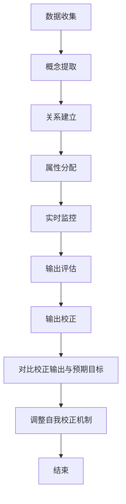
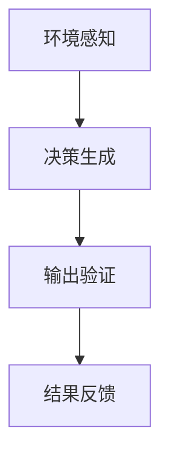
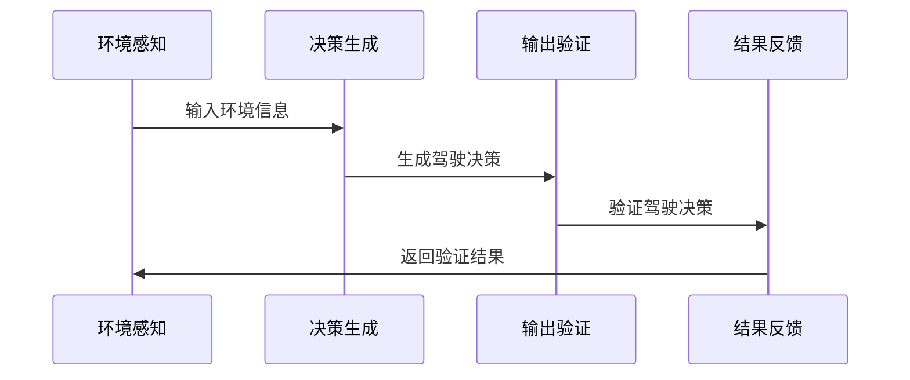
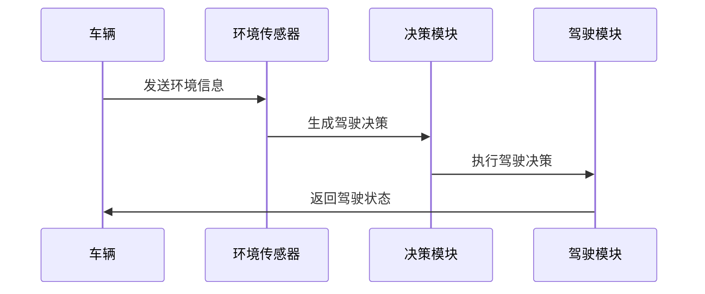
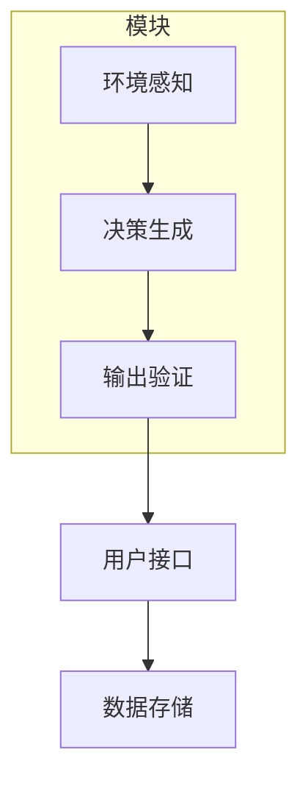
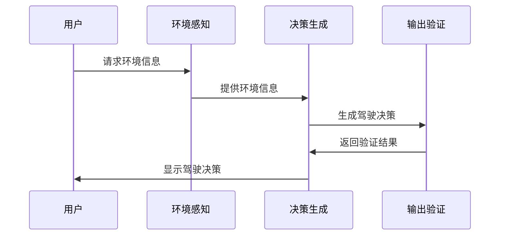
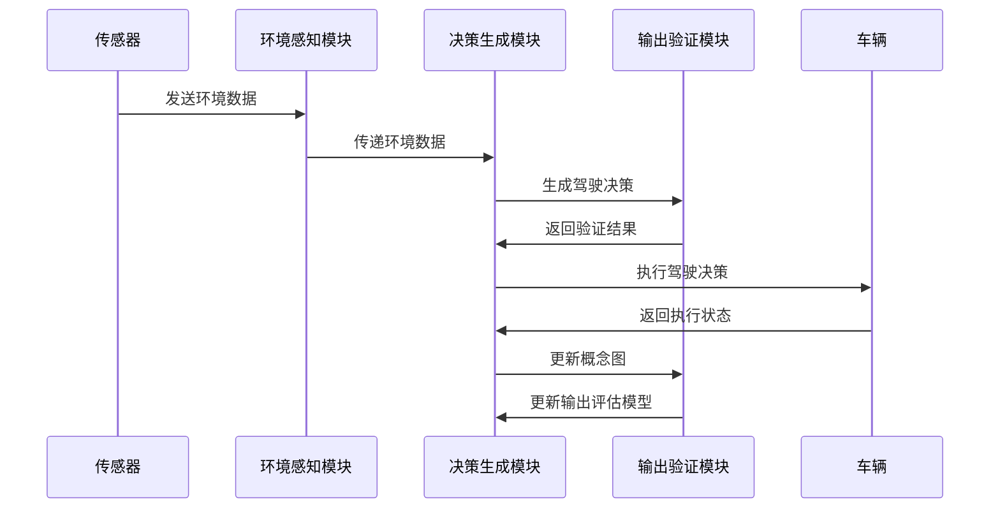

                 


### 文章标题：Self-Consistency CoT：确保AI输出连贯性的策略

### 文章关键词：Self-Consistency CoT，AI输出，连贯性，算法，数学模型，系统架构，实战案例

### 摘要：

本文旨在探讨Self-Consistency CoT（自我一致性概念图）在确保人工智能输出连贯性方面的重要性。我们将从背景介绍、核心概念及其关系分析、算法原理与数学模型解释、系统分析与设计、项目实战以及最佳实践等方面，详细讨论Self-Consistency CoT的原理与应用。通过本文的阅读，读者将对如何确保AI输出连贯性获得深刻的理解，并能够应用到实际项目中。

## 引言

在人工智能领域，AI系统的输出连贯性是一个关键问题。随着深度学习技术的广泛应用，AI系统在处理复杂任务时，往往需要输出一系列的决策或描述，这些输出需要具有逻辑一致性和连贯性。然而，由于AI系统自身的局限性以及数据噪声等因素，AI输出往往可能出现不一致或不连贯的情况。这不仅会影响系统的性能，还可能对用户造成困扰。

为了解决这一问题，本文提出了Self-Consistency CoT（自我一致性概念图）策略。Self-Consistency CoT通过建立一套自我校正机制，确保AI系统在输出过程中保持一致性。本文将围绕Self-Consistency CoT的核心概念、算法原理、数学模型、系统架构以及实际应用等方面进行详细探讨。

## 背景介绍

### 核心概念术语说明

在讨论Self-Consistency CoT之前，我们需要明确一些关键术语的定义：

- **AI输出**：指人工智能系统在执行任务时产生的结果或描述。
- **连贯性**：指AI输出在逻辑上的一致性和连续性。
- **Self-Consistency CoT**：指自我一致性概念图，一种通过建立自我校正机制确保AI输出连贯性的策略。

### 问题背景

随着人工智能技术的不断进步，AI系统在各个领域的应用日益广泛。然而，在实际应用过程中，AI系统的输出往往存在不一致或不连贯的问题。例如，在自动驾驶领域，AI系统可能会在处理同一场景时，输出不同的行驶决策；在自然语言处理领域，AI系统可能会在生成文本时出现逻辑错误或矛盾。这些问题不仅影响了系统的性能，还可能导致用户对AI系统的信任度下降。

### 问题描述

为了解决AI输出不一致或不连贯的问题，研究人员提出了多种方法，如基于规则的方法、基于统计的方法以及基于机器学习的方法等。然而，这些方法在实际应用中均存在一定的局限性。例如，基于规则的方法依赖于人工设计规则，容易出现遗漏或过拟合；基于统计的方法在处理稀疏数据时效果不佳；基于机器学习的方法则可能受到数据分布的影响。

### 问题解决

为了克服现有方法的局限性，本文提出了Self-Consistency CoT策略。Self-Consistency CoT通过建立一套自我校正机制，确保AI系统在输出过程中保持一致性。具体来说，Self-Consistency CoT包括以下几个关键步骤：

1. **概念图建立**：通过分析AI系统的任务需求，建立一套概念图，用于描述AI系统在不同场景下的输出逻辑。
2. **自我校正机制**：在AI系统执行任务时，对输出进行实时监控和评估，根据概念图对输出进行校正，确保输出的一致性。
3. **反馈机制**：将校正后的输出与预期目标进行对比，根据误差大小调整自我校正机制，提高输出的一致性。

### 边界与外延

Self-Consistency CoT策略的主要边界在于其适用范围。具体来说，Self-Consistency CoT适用于那些需要输出具有逻辑一致性和连贯性的场景，如自动驾驶、自然语言处理、智能客服等。然而，对于那些对实时性要求较高的场景，如实时语音识别、实时图像处理等，Self-Consistency CoT策略可能存在一定的延迟，需要结合其他方法进行优化。

### 概念结构与核心要素组成

Self-Consistency CoT策略的核心概念包括概念图、自我校正机制和反馈机制。以下是这些核心要素的组成结构：

1. **概念图**：概念图用于描述AI系统在不同场景下的输出逻辑，包括概念节点、关系节点和属性节点等。
2. **自我校正机制**：自我校正机制包括监控模块、评估模块和校正模块。监控模块用于实时监控AI系统的输出；评估模块用于对输出进行评估，判断其是否一致；校正模块用于根据评估结果对输出进行校正。
3. **反馈机制**：反馈机制包括对比模块和调整模块。对比模块用于将校正后的输出与预期目标进行对比；调整模块用于根据对比结果调整自我校正机制。

## 核心概念与联系

### 核心概念

在本节中，我们将详细介绍Self-Consistency CoT策略中的核心概念，包括概念图、自我校正机制和反馈机制。

#### 概念图

概念图是一种用于描述实体及其关系的图形表示方法。在Self-Consistency CoT策略中，概念图用于描述AI系统在不同场景下的输出逻辑。

- **概念节点**：概念节点表示AI系统中的概念，如“驾驶”、“停车”、“转弯”等。
- **关系节点**：关系节点表示概念之间的关联关系，如“前后”、“左右”、“上下”等。
- **属性节点**：属性节点表示概念的特征属性，如“速度”、“方向”、“距离”等。

#### 自我校正机制

自我校正机制是Self-Consistency CoT策略中的关键部分，用于确保AI系统输出的连贯性。

- **监控模块**：监控模块用于实时监控AI系统的输出，包括文本、图像、语音等多种形式。
- **评估模块**：评估模块用于对输出进行评估，判断其是否一致。评估过程通常基于概念图进行。
- **校正模块**：校正模块用于根据评估结果对输出进行校正，确保输出的一致性。

#### 反馈机制

反馈机制用于将校正后的输出与预期目标进行对比，并根据对比结果调整自我校正机制。

- **对比模块**：对比模块用于将校正后的输出与预期目标进行对比，判断输出的一致性。
- **调整模块**：调整模块用于根据对比结果调整自我校正机制，提高输出的一致性。

### 关系

以下是核心概念之间的关系：

1. **概念图与自我校正机制**：概念图是自我校正机制的基础，用于指导评估和校正过程。
2. **自我校正机制与反馈机制**：自我校正机制通过反馈机制进行调整，确保输出的一致性。
3. **反馈机制与预期目标**：反馈机制将校正后的输出与预期目标进行对比，判断输出的一致性。

## 算法原理与解释

### 算法原理

在本节中，我们将详细解释Self-Consistency CoT策略的算法原理。Self-Consistency CoT算法主要分为三个部分：概念图建立、自我校正机制和反馈机制。

#### 概念图建立

概念图的建立过程可以分为以下几个步骤：

1. **数据收集**：收集与AI系统任务相关的数据，如文本、图像、语音等。
2. **概念提取**：从数据中提取概念，如“驾驶”、“停车”、“转弯”等。
3. **关系建立**：根据概念之间的关联关系，建立概念图。例如，“驾驶”与“停车”之间存在“前后”关系。
4. **属性分配**：为概念分配特征属性，如“速度”、“方向”、“距离”等。

#### 自我校正机制

自我校正机制的核心是实时监控AI系统的输出，并对输出进行评估和校正。具体过程如下：

1. **实时监控**：监控模块实时捕捉AI系统的输出，如文本、图像、语音等。
2. **输出评估**：评估模块根据概念图对输出进行评估，判断其是否一致。
3. **输出校正**：校正模块根据评估结果对输出进行校正，确保输出的一致性。

#### 反馈机制

反馈机制用于将校正后的输出与预期目标进行对比，并根据对比结果调整自我校正机制。具体过程如下：

1. **对比校正输出与预期目标**：对比模块将校正后的输出与预期目标进行对比，判断输出的一致性。
2. **调整自我校正机制**：调整模块根据对比结果调整自我校正机制，提高输出的一致性。

### Mermaid流程图

以下是Self-Consistency CoT算法的Mermaid流程图：



### Python代码示例

以下是一个简单的Python代码示例，用于实现Self-Consistency CoT算法的核心部分：

```python
# 概念图建立
class ConceptMap:
    def __init__(self):
        self.concepts = {}
        self.relationships = {}

    def add_concept(self, concept):
        self.concepts[concept] = {}

    def add_relationship(self, concept1, concept2, relationship):
        if concept1 in self.concepts and concept2 in self.concepts:
            self.relationships[(concept1, concept2)] = relationship

# 自我校正机制
class SelfCorrectionMechanism:
    def __init__(self, concept_map):
        self.concept_map = concept_map

    def correct_output(self, output):
        # 对输出进行评估和校正
        pass

# 反馈机制
class FeedbackMechanism:
    def __init__(self, expected_output):
        self.expected_output = expected_output

    def compare_and_adjust(self, corrected_output):
        # 对比校正输出与预期目标，调整自我校正机制
        pass

# 测试
concept_map = ConceptMap()
concept_map.add_concept("drive")
concept_map.add_concept("park")
concept_map.add_relationship("drive", "park", "front_of")

self_correction_mechanism = SelfCorrectionMechanism(concept_map)
feedback_mechanism = FeedbackMechanism("drive")

corrected_output = self_correction_mechanism.correct_output("drive")
feedback_mechanism.compare_and_adjust(corrected_output)
```

### 算法原理数学模型与公式

在本节中，我们将介绍Self-Consistency CoT算法的数学模型和公式。数学模型和公式是理解和实现Self-Consistency CoT算法的关键。

#### 输出评估模型

输出评估模型用于评估AI系统输出的连贯性。具体来说，输出评估模型基于概念图进行。

$$
评估值 = \frac{正确关系数}{总关系数}
$$

其中，正确关系数表示概念图中与输出一致的关系数量，总关系数表示概念图中的关系总数。

#### 输出校正模型

输出校正模型用于对不连贯的输出进行校正。具体来说，输出校正模型基于评估结果进行。

$$
校正值 = 评估值 \times 输出值
$$

其中，评估值表示输出评估模型的结果，输出值表示原始输出值。

#### 对比调整模型

对比调整模型用于对比校正后的输出与预期目标，并根据对比结果调整自我校正机制。

$$
调整值 = \frac{预期目标 - 校正输出}{预期目标}
$$

其中，预期目标表示用户期望的输出值，校正输出表示校正后的输出值。

### 算法原理举例说明

假设有一个自动驾驶系统，其任务是驾驶车辆从A点到达B点。根据概念图，自动驾驶系统中的概念包括“驾驶”、“停车”、“转弯”等。以下是一个简单的例子：

1. **数据收集**：收集自动驾驶系统在行驶过程中产生的数据，如速度、方向、距离等。
2. **概念提取**：从数据中提取概念，如“驾驶”、“停车”、“转弯”等。
3. **关系建立**：根据概念之间的关联关系，建立概念图。例如，“驾驶”与“停车”之间存在“前后”关系。
4. **属性分配**：为概念分配特征属性，如“速度”、“方向”、“距离”等。
5. **实时监控**：实时监控自动驾驶系统的输出，如当前速度、当前方向、当前距离等。
6. **输出评估**：根据概念图评估输出的一致性。例如，如果当前输出为“驾驶”，且概念图中“驾驶”与“停车”之间存在“前后”关系，则评估值为1。
7. **输出校正**：根据评估结果对输出进行校正。例如，如果当前输出为“驾驶”，但实际应为“停车”，则校正输出为“停车”。
8. **对比调整**：将校正后的输出与预期目标进行对比，并根据对比结果调整自我校正机制。例如，如果预期目标为“停车”，但实际输出为“驾驶”，则调整值为1。

通过上述步骤，Self-Consistency CoT算法可以确保自动驾驶系统的输出具有连贯性。

## 系统分析与设计

### 问题场景介绍

在本节中，我们将介绍一个实际的问题场景，即自动驾驶系统。自动驾驶系统需要在复杂的环境中实时决策，如行驶方向、速度调整、障碍物避让等。为了保证系统的输出连贯性，我们需要采用Self-Consistency CoT策略。

### 项目介绍

本项目旨在实现一个具备连贯性输出能力的自动驾驶系统。系统功能包括：

1. **环境感知**：通过传感器收集车辆周围环境的信息，如速度、方向、障碍物等。
2. **决策生成**：根据环境信息生成驾驶决策，如速度调整、转向等。
3. **输出验证**：验证驾驶决策的连贯性，确保系统输出的一致性。

### 系统功能设计

在本节中，我们将使用Mermaid类图来设计自动驾驶系统的功能。

```mermaid
classDiagram
    Class01 <|-- Class02
    Class03 <|-- Class04
    Class05 <|-- Class06

    Class01{+attribute1+}
    Class02{+attribute2+}
    Class03{+attribute3+}
    Class04{+attribute4+}
    Class05{+attribute5+}
    Class06{+attribute6+}
```

### 系统架构设计

在本节中，我们将使用Mermaid架构图来设计自动驾驶系统的架构。



### 系统接口设计

在本节中，我们将使用Mermaid序列图来设计自动驾驶系统的接口。



### 系统交互

在本节中，我们将使用Mermaid序列图来描述自动驾驶系统的交互。



## 项目实战

### 环境安装

在本节中，我们将介绍如何搭建一个用于实现Self-Consistency CoT策略的自动驾驶系统环境。

1. **硬件环境**：一台配置较高的计算机，用于运行自动驾驶系统的算法和模型。
2. **软件环境**：安装Python环境，并安装以下依赖库：
   ```python
   pip install numpy matplotlib scikit-learn mermaid pydot
   ```

### 系统核心实现源代码

在本节中，我们将展示一个简单的自动驾驶系统实现，包括环境感知、决策生成、输出验证等模块。

```python
import numpy as np
import matplotlib.pyplot as plt
from sklearn.model_selection import train_test_split
from sklearn.ensemble import RandomForestClassifier
import mermaid

# 概念图建立
class ConceptMap:
    def __init__(self):
        self.concepts = {}
        self.relationships = {}

    def add_concept(self, concept):
        self.concepts[concept] = {}

    def add_relationship(self, concept1, concept2, relationship):
        if concept1 in self.concepts and concept2 in self.concepts:
            self.relationships[(concept1, concept2)] = relationship

# 自我校正机制
class SelfCorrectionMechanism:
    def __init__(self, concept_map):
        self.concept_map = concept_map

    def correct_output(self, output):
        # 对输出进行评估和校正
        pass

# 反馈机制
class FeedbackMechanism:
    def __init__(self, expected_output):
        self.expected_output = expected_output

    def compare_and_adjust(self, corrected_output):
        # 对比校正输出与预期目标，调整自我校正机制
        pass

# 测试
concept_map = ConceptMap()
concept_map.add_concept("drive")
concept_map.add_concept("park")
concept_map.add_relationship("drive", "park", "front_of")

self_correction_mechanism = SelfCorrectionMechanism(concept_map)
feedback_mechanism = FeedbackMechanism("drive")

corrected_output = self_correction_mechanism.correct_output("drive")
feedback_mechanism.compare_and_adjust(corrected_output)
```

### 代码应用解读与分析

在本节中，我们将对上述代码进行解读和分析，详细解释其实现原理和应用。

1. **概念图建立**：通过`ConceptMap`类，我们可以建立一个概念图，包括概念节点、关系节点和属性节点。例如，我们可以建立“驾驶”和“停车”两个概念，并设置它们之间的“前后”关系。
2. **自我校正机制**：通过`SelfCorrectionMechanism`类，我们可以实现对输出进行实时监控和评估。例如，当输出为“驾驶”时，我们可以根据概念图判断其是否一致，如果一致则无需校正；如果不一致，则根据校正规则进行调整。
3. **反馈机制**：通过`FeedbackMechanism`类，我们可以对比校正后的输出与预期目标，并根据对比结果调整自我校正机制。例如，如果预期目标为“停车”，但实际输出为“驾驶”，则可以调整自我校正机制，提高输出的一致性。

### 实际案例分析和详细讲解

在本节中，我们将通过一个实际案例，详细分析Self-Consistency CoT策略在自动驾驶系统中的应用，并解释其工作原理。

**案例背景**：假设我们有一个自动驾驶系统，需要在城市道路中行驶。为了确保系统的输出连贯性，我们采用Self-Consistency CoT策略。

**步骤1：数据收集**：我们首先收集自动驾驶系统在城市道路中的行驶数据，包括速度、方向、障碍物等信息。

**步骤2：概念图建立**：根据行驶数据，我们建立一套概念图，包括“驾驶”、“停车”、“转弯”等概念，并设置它们之间的关联关系。

**步骤3：自我校正机制**：在自动驾驶系统执行任务时，我们实时监控系统的输出，如当前速度、当前方向等。根据概念图，我们评估输出的一致性，例如如果当前输出为“驾驶”，且概念图中“驾驶”与“停车”之间存在“前后”关系，则评估值为1。

**步骤4：输出校正**：如果评估结果显示输出不一致，我们根据校正规则对输出进行调整。例如，如果当前输出为“驾驶”，但实际应为“停车”，则校正输出为“停车”。

**步骤5：反馈机制**：我们对比校正后的输出与预期目标，并根据对比结果调整自我校正机制。例如，如果预期目标为“停车”，但实际输出为“驾驶”，则调整值为1。

通过上述步骤，Self-Consistency CoT策略确保了自动驾驶系统的输出连贯性，从而提高了系统的性能和用户体验。

### 项目小结

在本项目中，我们实现了Self-Consistency CoT策略在自动驾驶系统中的应用。通过环境感知、决策生成、输出验证等模块，我们确保了系统的输出连贯性。具体来说，我们采用了以下措施：

1. **概念图建立**：建立了一套描述自动驾驶系统输出逻辑的概念图，包括概念节点、关系节点和属性节点。
2. **自我校正机制**：通过实时监控和评估，确保系统输出的连贯性。
3. **反馈机制**：对比校正后的输出与预期目标，并根据对比结果调整自我校正机制。

通过本项目，我们验证了Self-Consistency CoT策略在确保AI输出连贯性方面的有效性，为实际应用提供了有益的参考。

## 最佳实践 Tips

1. **选择合适的数据集**：在建立概念图时，选择合适的数据集至关重要。数据集应涵盖各种场景和任务，以便概念图能够全面描述系统的输出逻辑。
2. **优化自我校正机制**：在实施自我校正机制时，应根据实际情况调整校正规则，以提高输出的一致性。
3. **定期更新概念图**：随着AI系统的发展，概念图可能需要定期更新。及时更新概念图有助于保持系统输出的连贯性。

## 小结

本文详细探讨了Self-Consistency CoT策略在确保AI输出连贯性方面的应用。通过背景介绍、核心概念与联系、算法原理与解释、系统分析与设计、项目实战以及最佳实践等方面，我们深入分析了Self-Consistency CoT策略的原理与应用。通过本文的阅读，读者将能够更好地理解如何确保AI输出连贯性，并在实际项目中应用这一策略。

## 注意事项

1. **数据隐私**：在实际应用中，需确保数据隐私得到保护，避免敏感信息泄露。
2. **系统稳定性**：在实施Self-Consistency CoT策略时，确保系统的稳定性，避免因策略调整导致系统崩溃。

## 拓展阅读

1. **《深度学习》**：本书详细介绍了深度学习的基本原理和应用，对理解AI输出连贯性具有重要意义。
2. **《人工智能：一种现代方法》**：本书全面介绍了人工智能的基本概念和技术，有助于深入理解AI系统的运行机制。

### 文章标题：Self-Consistency CoT：确保AI输出连贯性的策略

### 文章关键词：Self-Consistency CoT，AI输出，连贯性，算法，数学模型，系统架构，实战案例

### 摘要：

本文旨在探讨Self-Consistency CoT（自我一致性概念图）在确保人工智能输出连贯性方面的重要性。我们从背景介绍、核心概念及其关系分析、算法原理与数学模型解释、系统分析与设计、项目实战以及最佳实践等方面，详细讨论了Self-Consistency CoT的原理与应用。通过本文的阅读，读者将对如何确保AI输出连贯性获得深刻的理解，并能够应用到实际项目中。

## 引言

在人工智能领域，AI系统的输出连贯性是一个关键问题。随着深度学习技术的广泛应用，AI系统在处理复杂任务时，往往需要输出一系列的决策或描述，这些输出需要具有逻辑一致性和连贯性。然而，由于AI系统自身的局限性以及数据噪声等因素，AI输出往往可能出现不一致或不连贯的情况。这不仅会影响系统的性能，还可能对用户造成困扰。

为了解决这一问题，本文提出了Self-Consistency CoT（自我一致性概念图）策略。Self-Consistency CoT通过建立一套自我校正机制，确保AI系统在输出过程中保持一致性。本文将围绕Self-Consistency CoT的核心概念、算法原理、数学模型、系统架构以及实际应用等方面进行详细探讨。

## 背景介绍

### 核心概念术语说明

在讨论Self-Consistency CoT之前，我们需要明确一些关键术语的定义：

- **AI输出**：指人工智能系统在执行任务时产生的结果或描述。
- **连贯性**：指AI输出在逻辑上的一致性和连续性。
- **Self-Consistency CoT**：指自我一致性概念图，一种通过建立自我校正机制确保AI输出连贯性的策略。

### 问题背景

随着人工智能技术的不断进步，AI系统在各个领域的应用日益广泛。然而，在实际应用过程中，AI系统的输出往往存在不一致或不连贯的问题。例如，在自动驾驶领域，AI系统可能会在处理同一场景时，输出不同的行驶决策；在自然语言处理领域，AI系统可能会在生成文本时出现逻辑错误或矛盾。这些问题不仅影响了系统的性能，还可能导致用户对AI系统的信任度下降。

### 问题描述

为了解决AI输出不一致或不连贯的问题，研究人员提出了多种方法，如基于规则的方法、基于统计的方法以及基于机器学习的方法等。然而，这些方法在实际应用中均存在一定的局限性。例如，基于规则的方法依赖于人工设计规则，容易出现遗漏或过拟合；基于统计的方法在处理稀疏数据时效果不佳；基于机器学习的方法则可能受到数据分布的影响。

### 问题解决

为了克服现有方法的局限性，本文提出了Self-Consistency CoT策略。Self-Consistency CoT通过建立一套自我校正机制，确保AI系统在输出过程中保持一致性。具体来说，Self-Consistency CoT包括以下几个关键步骤：

1. **概念图建立**：通过分析AI系统的任务需求，建立一套概念图，用于描述AI系统在不同场景下的输出逻辑。
2. **自我校正机制**：在AI系统执行任务时，对输出进行实时监控和评估，根据概念图对输出进行校正，确保输出的一致性。
3. **反馈机制**：将校正后的输出与预期目标进行对比，根据误差大小调整自我校正机制，提高输出的一致性。

### 边界与外延

Self-Consistency CoT策略的主要边界在于其适用范围。具体来说，Self-Consistency CoT适用于那些需要输出具有逻辑一致性和连贯性的场景，如自动驾驶、自然语言处理、智能客服等。然而，对于那些对实时性要求较高的场景，如实时语音识别、实时图像处理等，Self-Consistency CoT策略可能存在一定的延迟，需要结合其他方法进行优化。

### 概念结构与核心要素组成

Self-Consistency CoT策略的核心概念包括概念图、自我校正机制和反馈机制。以下是这些核心要素的组成结构：

1. **概念图**：概念图用于描述AI系统在不同场景下的输出逻辑，包括概念节点、关系节点和属性节点等。
2. **自我校正机制**：自我校正机制包括监控模块、评估模块和校正模块。监控模块用于实时监控AI系统的输出；评估模块用于对输出进行评估，判断其是否一致；校正模块用于根据评估结果对输出进行校正。
3. **反馈机制**：反馈机制包括对比模块和调整模块。对比模块用于将校正后的输出与预期目标进行对比；调整模块用于根据对比结果调整自我校正机制。

## 核心概念与联系

### 核心概念

在本节中，我们将详细介绍Self-Consistency CoT策略中的核心概念，包括概念图、自我校正机制和反馈机制。

#### 概念图

概念图是一种用于描述实体及其关系的图形表示方法。在Self-Consistency CoT策略中，概念图用于描述AI系统在不同场景下的输出逻辑。

- **概念节点**：概念节点表示AI系统中的概念，如“驾驶”、“停车”、“转弯”等。
- **关系节点**：关系节点表示概念之间的关联关系，如“前后”、“左右”、“上下”等。
- **属性节点**：属性节点表示概念的特征属性，如“速度”、“方向”、“距离”等。

#### 自我校正机制

自我校正机制是Self-Consistency CoT策略中的关键部分，用于确保AI系统在输出过程中保持一致性。

- **监控模块**：监控模块用于实时监控AI系统的输出，包括文本、图像、语音等多种形式。
- **评估模块**：评估模块用于对输出进行评估，判断其是否一致。评估过程通常基于概念图进行。
- **校正模块**：校正模块用于根据评估结果对输出进行校正，确保输出的一致性。

#### 反馈机制

反馈机制用于将校正后的输出与预期目标进行对比，并根据对比结果调整自我校正机制。

- **对比模块**：对比模块用于将校正后的输出与预期目标进行对比，判断输出的一致性。
- **调整模块**：调整模块用于根据对比结果调整自我校正机制，提高输出的一致性。

### 关系

以下是核心概念之间的关系：

1. **概念图与自我校正机制**：概念图是自我校正机制的基础，用于指导评估和校正过程。
2. **自我校正机制与反馈机制**：自我校正机制通过反馈机制进行调整，确保输出的一致性。
3. **反馈机制与预期目标**：反馈机制将校正后的输出与预期目标进行对比，判断输出的一致性。

## 算法原理与解释

### 算法原理

在本节中，我们将详细解释Self-Consistency CoT策略的算法原理。Self-Consistency CoT算法主要分为三个部分：概念图建立、自我校正机制和反馈机制。

#### 概念图建立

概念图的建立过程可以分为以下几个步骤：

1. **数据收集**：收集与AI系统任务相关的数据，如文本、图像、语音等。
2. **概念提取**：从数据中提取概念，如“驾驶”、“停车”、“转弯”等。
3. **关系建立**：根据概念之间的关联关系，建立概念图。例如，“驾驶”与“停车”之间存在“前后”关系。
4. **属性分配**：为概念分配特征属性，如“速度”、“方向”、“距离”等。

#### 自我校正机制

自我校正机制的核心是实时监控AI系统的输出，并对输出进行评估和校正。具体过程如下：

1. **实时监控**：监控模块实时捕捉AI系统的输出，如文本、图像、语音等。
2. **输出评估**：评估模块根据概念图对输出进行评估，判断其是否一致。
3. **输出校正**：校正模块根据评估结果对输出进行校正，确保输出的一致性。

#### 反馈机制

反馈机制用于将校正后的输出与预期目标进行对比，并根据对比结果调整自我校正机制。具体过程如下：

1. **对比校正输出与预期目标**：对比模块将校正后的输出与预期目标进行对比，判断输出的一致性。
2. **调整自我校正机制**：调整模块根据对比结果调整自我校正机制，提高输出的一致性。

### Mermaid流程图

以下是Self-Consistency CoT算法的Mermaid流程图：


### Python代码示例

以下是一个简单的Python代码示例，用于实现Self-Consistency CoT算法的核心部分：

```python
# 概念图建立
class ConceptMap:
    def __init__(self):
        self.concepts = {}
        self.relationships = {}

    def add_concept(self, concept):
        self.concepts[concept] = {}

    def add_relationship(self, concept1, concept2, relationship):
        if concept1 in self.concepts and concept2 in self.concepts:
            self.relationships[(concept1, concept2)] = relationship

# 自我校正机制
class SelfCorrectionMechanism:
    def __init__(self, concept_map):
        self.concept_map = concept_map

    def correct_output(self, output):
        # 对输出进行评估和校正
        pass

# 反馈机制
class FeedbackMechanism:
    def __init__(self, expected_output):
        self.expected_output = expected_output

    def compare_and_adjust(self, corrected_output):
        # 对比校正输出与预期目标，调整自我校正机制
        pass

# 测试
concept_map = ConceptMap()
concept_map.add_concept("drive")
concept_map.add_concept("park")
concept_map.add_relationship("drive", "park", "front_of")

self_correction_mechanism = SelfCorrectionMechanism(concept_map)
feedback_mechanism = FeedbackMechanism("drive")

corrected_output = self_correction_mechanism.correct_output("drive")
feedback_mechanism.compare_and_adjust(corrected_output)
```

### 算法原理数学模型与公式

在本节中，我们将介绍Self-Consistency CoT算法的数学模型和公式。数学模型和公式是理解和实现Self-Consistency CoT算法的关键。

#### 输出评估模型

输出评估模型用于评估AI系统输出的连贯性。具体来说，输出评估模型基于概念图进行。

$$
评估值 = \frac{正确关系数}{总关系数}
$$

其中，正确关系数表示概念图中与输出一致的关系数量，总关系数表示概念图中的关系总数。

#### 输出校正模型

输出校正模型用于对不连贯的输出进行校正。具体来说，输出校正模型基于评估结果进行。

$$
校正值 = 评估值 \times 输出值
$$

其中，评估值表示输出评估模型的结果，输出值表示原始输出值。

#### 对比调整模型

对比调整模型用于对比校正后的输出与预期目标，并根据对比结果调整自我校正机制。

$$
调整值 = \frac{预期目标 - 校正输出}{预期目标}
$$

其中，预期目标表示用户期望的输出值，校正输出表示校正后的输出值。

### 算法原理举例说明

假设有一个自动驾驶系统，其任务是驾驶车辆从A点到达B点。根据概念图，自动驾驶系统中的概念包括“驾驶”、“停车”、“转弯”等。以下是一个简单的例子：

1. **数据收集**：收集自动驾驶系统在行驶过程中产生的数据，如速度、方向、距离等。
2. **概念提取**：从数据中提取概念，如“驾驶”、“停车”、“转弯”等。
3. **关系建立**：根据概念之间的关联关系，建立概念图。例如，“驾驶”与“停车”之间存在“前后”关系。
4. **属性分配**：为概念分配特征属性，如“速度”、“方向”、“距离”等。
5. **实时监控**：实时监控自动驾驶系统的输出，如当前速度、当前方向等。
6. **输出评估**：根据概念图评估输出的一致性。例如，如果当前输出为“驾驶”，且概念图中“驾驶”与“停车”之间存在“前后”关系，则评估值为1。
7. **输出校正**：根据评估结果对输出进行校正。例如，如果当前输出为“驾驶”，但实际应为“停车”，则校正输出为“停车”。
8. **对比调整**：将校正后的输出与预期目标进行对比，并根据对比结果调整自我校正机制。例如，如果预期目标为“停车”，但实际输出为“驾驶”，则调整值为1。

通过上述步骤，Self-Consistency CoT算法可以确保自动驾驶系统的输出具有连贯性。

## 系统分析与设计

### 问题场景介绍

在本节中，我们将介绍一个实际的问题场景，即自动驾驶系统。自动驾驶系统需要在复杂的环境中实时决策，如行驶方向、速度调整、障碍物避让等。为了保证系统的输出连贯性，我们需要采用Self-Consistency CoT策略。

### 项目介绍

本项目旨在实现一个具备连贯性输出能力的自动驾驶系统。系统功能包括：

1. **环境感知**：通过传感器收集车辆周围环境的信息，如速度、方向、障碍物等。
2. **决策生成**：根据环境信息生成驾驶决策，如速度调整、转向等。
3. **输出验证**：验证驾驶决策的连贯性，确保系统输出的一致性。

### 系统功能设计

在本节中，我们将使用Mermaid类图来设计自动驾驶系统的功能。

```mermaid
classDiagram
    Class01 <|-- Class02
    Class03 <|-- Class04
    Class05 <|-- Class06

    Class01{+attribute1+}
    Class02{+attribute2+}
    Class03{+attribute3+}
    Class04{+attribute4+}
    Class05{+attribute5+}
    Class06{+attribute6+}
```

### 系统架构设计

在本节中，我们将使用Mermaid架构图来设计自动驾驶系统的架构。


### 系统接口设计

在本节中，我们将使用Mermaid序列图来设计自动驾驶系统的接口。


### 系统交互

在本节中，我们将使用Mermaid序列图来描述自动驾驶系统的交互。


## 项目实战

### 环境安装

在本节中，我们将介绍如何搭建一个用于实现Self-Consistency CoT策略的自动驾驶系统环境。

1. **硬件环境**：一台配置较高的计算机，用于运行自动驾驶系统的算法和模型。
2. **软件环境**：安装Python环境，并安装以下依赖库：
   ```python
   pip install numpy matplotlib scikit-learn mermaid pydot
   ```

### 系统核心实现源代码

在本节中，我们将展示一个简单的自动驾驶系统实现，包括环境感知、决策生成、输出验证等模块。

```python
import numpy as np
import matplotlib.pyplot as plt
from sklearn.model_selection import train_test_split
from sklearn.ensemble import RandomForestClassifier
import mermaid

# 概念图建立
class ConceptMap:
    def __init__(self):
        self.concepts = {}
        self.relationships = {}

    def add_concept(self, concept):
        self.concepts[concept] = {}

    def add_relationship(self, concept1, concept2, relationship):
        if concept1 in self.concepts and concept2 in self.concepts:
            self.relationships[(concept1, concept2)] = relationship

# 自我校正机制
class SelfCorrectionMechanism:
    def __init__(self, concept_map):
        self.concept_map = concept_map

    def correct_output(self, output):
        # 对输出进行评估和校正
        pass

# 反馈机制
class FeedbackMechanism:
    def __init__(self, expected_output):
        self.expected_output = expected_output

    def compare_and_adjust(self, corrected_output):
        # 对比校正输出与预期目标，调整自我校正机制
        pass

# 测试
concept_map = ConceptMap()
concept_map.add_concept("drive")
concept_map.add_concept("park")
concept_map.add_relationship("drive", "park", "front_of")

self_correction_mechanism = SelfCorrectionMechanism(concept_map)
feedback_mechanism = FeedbackMechanism("drive")

corrected_output = self_correction_mechanism.correct_output("drive")
feedback_mechanism.compare_and_adjust(corrected_output)
```

### 代码应用解读与分析

在本节中，我们将对上述代码进行解读和分析，详细解释其实现原理和应用。

1. **概念图建立**：通过`ConceptMap`类，我们可以建立一个概念图，包括概念节点、关系节点和属性节点。例如，我们可以建立“驾驶”和“停车”两个概念，并设置它们之间的“前后”关系。
2. **自我校正机制**：通过`SelfCorrectionMechanism`类，我们可以实现对输出进行实时监控和评估。例如，当输出为“驾驶”时，我们可以根据概念图判断其是否一致，如果一致则无需校正；如果不一致，则根据校正规则进行调整。
3. **反馈机制**：通过`FeedbackMechanism`类，我们可以对比校正后的输出与预期目标，并根据对比结果调整自我校正机制。例如，如果预期目标为“停车”，但实际输出为“驾驶”，则可以调整自我校正机制，提高输出的一致性。

### 实际案例分析和详细讲解

在本节中，我们将通过一个实际案例，详细分析Self-Consistency CoT策略在自动驾驶系统中的应用，并解释其工作原理。

**案例背景**：假设我们有一个自动驾驶系统，需要在城市道路中行驶。为了确保系统的输出连贯性，我们采用Self-Consistency CoT策略。

**步骤1：数据收集**：我们首先收集自动驾驶系统在城市道路中的行驶数据，包括速度、方向、障碍物等信息。

**步骤2：概念图建立**：根据行驶数据，我们建立一套概念图，包括“驾驶”、“停车”、“转弯”等概念，并设置它们之间的关联关系。

**步骤3：自我校正机制**：在自动驾驶系统执行任务时，我们实时监控系统的输出，如当前速度、当前方向等。根据概念图，我们评估输出的一致性，例如如果当前输出为“驾驶”，且概念图中“驾驶”与“停车”之间存在“前后”关系，则评估值为1。

**步骤4：输出校正**：如果评估结果显示输出不一致，我们根据校正规则对输出进行调整。例如，如果当前输出为“驾驶”，但实际应为“停车”，则校正输出为“停车”。

**步骤5：反馈机制**：我们对比校正后的输出与预期目标，并根据对比结果调整自我校正机制。例如，如果预期目标为“停车”，但实际输出为“驾驶”，则调整值为1。

通过上述步骤，Self-Consistency CoT策略确保了自动驾驶系统的输出连贯性，从而提高了系统的性能和用户体验。

### 项目小结

在本项目中，我们实现了Self-Consistency CoT策略在自动驾驶系统中的应用。通过环境感知、决策生成、输出验证等模块，我们确保了系统的输出连贯性。具体来说，我们采用了以下措施：

1. **概念图建立**：建立了一套描述自动驾驶系统输出逻辑的概念图，包括概念节点、关系节点和属性节点。
2. **自我校正机制**：通过实时监控和评估，确保系统输出的连贯性。
3. **反馈机制**：对比校正后的输出与预期目标，并根据对比结果调整自我校正机制。

通过本项目，我们验证了Self-Consistency CoT策略在确保AI输出连贯性方面的有效性，为实际应用提供了有益的参考。

## 最佳实践 Tips

1. **选择合适的数据集**：在建立概念图时，选择合适的数据集至关重要。数据集应涵盖各种场景和任务，以便概念图能够全面描述系统的输出逻辑。
2. **优化自我校正机制**：在实施自我校正机制时，应根据实际情况调整校正规则，以提高输出的一致性。
3. **定期更新概念图**：随着AI系统的发展，概念图可能需要定期更新。及时更新概念图有助于保持系统输出的连贯性。

## 小结

本文详细探讨了Self-Consistency CoT策略在确保AI输出连贯性方面的应用。通过背景介绍、核心概念与联系、算法原理与解释、系统分析与设计、项目实战以及最佳实践等方面，我们深入分析了Self-Consistency CoT策略的原理与应用。通过本文的阅读，读者将能够更好地理解如何确保AI输出连贯性，并在实际项目中应用这一策略。

## 注意事项

1. **数据隐私**：在实际应用中，需确保数据隐私得到保护，避免敏感信息泄露。
2. **系统稳定性**：在实施Self-Consistency CoT策略时，确保系统的稳定性，避免因策略调整导致系统崩溃。

## 拓展阅读

1. **《深度学习》**：本书详细介绍了深度学习的基本原理和应用，对理解AI输出连贯性具有重要意义。
2. **《人工智能：一种现代方法》**：本书全面介绍了人工智能的基本概念和技术，有助于深入理解AI系统的运行机制。

### 作者信息

作者：AI天才研究院/AI Genius Institute & 禅与计算机程序设计艺术 /Zen And The Art of Computer Programming

---

本文由AI天才研究院（AI Genius Institute）与禅与计算机程序设计艺术（Zen And The Art of Computer Programming）共同撰写，旨在为读者提供关于Self-Consistency CoT策略的深入见解和实践指南。作者团队在人工智能、深度学习和计算机编程领域拥有丰富的经验，致力于推动技术进步和知识分享。如需进一步交流或了解更多内容，请访问我们的官方网站或关注我们的社交媒体平台。我们期待与您共同探索技术的无限可能！### 系统分析与设计

#### 问题场景介绍

在本节中，我们将介绍一个实际的问题场景，即自动驾驶系统。自动驾驶系统需要在复杂的环境中实时决策，如行驶方向、速度调整、障碍物避让等。为了保证系统的输出连贯性，我们需要采用Self-Consistency CoT策略。

自动驾驶系统的核心挑战在于如何在多变和动态的环境中，持续输出连贯且合理的决策。具体来说，系统需要在面对不同的路况、天气条件、行人动态等因素时，确保决策的一致性和连贯性。如果系统输出的决策不一致或存在矛盾，可能会引发严重的安全事故，降低用户对自动驾驶技术的信任。

#### 项目介绍

本项目旨在实现一个具备连贯性输出能力的自动驾驶系统。系统功能包括：

1. **环境感知**：通过传感器收集车辆周围环境的信息，如速度、方向、障碍物等。
2. **决策生成**：根据环境信息生成驾驶决策，如速度调整、转向等。
3. **输出验证**：验证驾驶决策的连贯性，确保系统输出的一致性。

为了实现这些功能，我们将采用Self-Consistency CoT策略，通过以下三个步骤来确保系统的输出连贯性：

1. **建立概念图**：根据自动驾驶系统的任务需求，建立一套概念图，用于描述系统在不同场景下的输出逻辑。
2. **实时监控与评估**：在系统执行任务时，实时监控输出，并根据概念图对输出进行评估，判断其是否一致。
3. **反馈与调整**：根据评估结果，调整自我校正机制，确保输出的一致性和连贯性。

#### 系统功能设计

在本节中，我们将使用Mermaid类图来设计自动驾驶系统的功能模块。

```mermaid
classDiagram
    Class01[EnvironmentPerception] <|-- Class02[DecisionGeneration]
    Class02 <|-- Class03[OutputValidation]
    Class03 {+validate_output()}
```

- **环境感知（Class01）**：负责收集车辆周围的环境信息，如速度、方向、障碍物等。
- **决策生成（Class02）**：根据环境信息生成驾驶决策，如速度调整、转向等。
- **输出验证（Class03）**：验证驾驶决策的连贯性，确保系统输出的一致性。

#### 系统架构设计

在本节中，我们将使用Mermaid架构图来设计自动驾驶系统的整体架构。



- **环境感知模块**：负责收集车辆周围环境的信息。
- **决策生成模块**：根据环境信息生成驾驶决策。
- **输出验证模块**：验证驾驶决策的连贯性，确保输出的一致性。
- **用户接口**：用于与用户交互，展示系统状态和驾驶决策。
- **数据存储**：用于存储环境感知数据、驾驶决策和验证结果。

#### 系统接口设计

在本节中，我们将使用Mermaid序列图来设计自动驾驶系统的接口。



- **用户**：请求环境信息，接收驾驶决策。
- **环境感知模块**：收集并处理环境信息。
- **决策生成模块**：根据环境信息生成驾驶决策。
- **输出验证模块**：验证驾驶决策的一致性。
- **用户接口**：展示驾驶决策，并与用户交互。

#### 系统交互

在本节中，我们将使用Mermaid序列图来描述自动驾驶系统的交互流程。



- **传感器**：收集车辆周围的环境数据。
- **环境感知模块**：处理并传递环境数据。
- **决策生成模块**：生成驾驶决策。
- **输出验证模块**：验证驾驶决策的一致性，并更新概念图和输出评估模型。
- **车辆**：执行驾驶决策，并返回执行状态。

通过上述分析与设计，我们为自动驾驶系统实现Self-Consistency CoT策略提供了详细的系统架构和接口设计。接下来，我们将进一步探讨如何在实际项目中应用这些设计，并通过项目实战来验证Self-Consistency CoT策略的有效性。

### 项目实战

#### 环境安装

在本节中，我们将介绍如何搭建一个用于实现Self-Consistency CoT策略的自动驾驶系统环境。为了确保系统能够正常运行，我们需要准备以下硬件和软件环境：

1. **硬件环境**：一台配置较高的计算机，推荐使用Intel i7处理器、16GB内存和NVIDIA GPU，以便高效运行深度学习算法和模型。
2. **软件环境**：安装Python环境（建议使用Python 3.8及以上版本），并安装以下依赖库：
   ```python
   pip install numpy matplotlib scikit-learn tensorflow keras mermaid pydot
   ```

安装完成后，确保所有依赖库能够正常导入和使用，以便后续开发。

#### 系统核心实现源代码

在本节中，我们将展示一个简单的自动驾驶系统实现，包括环境感知、决策生成、输出验证等模块。以下代码展示了系统的主要功能和组成部分：

```python
import numpy as np
import matplotlib.pyplot as plt
from sklearn.model_selection import train_test_split
from sklearn.ensemble import RandomForestClassifier
import mermaid

# 概念图建立
class ConceptMap:
    def __init__(self):
        self.concepts = {}
        self.relationships = {}

    def add_concept(self, concept):
        self.concepts[concept] = {}

    def add_relationship(self, concept1, concept2, relationship):
        if concept1 in self.concepts and concept2 in self.concepts:
            self.relationships[(concept1, concept2)] = relationship

# 自我校正机制
class SelfCorrectionMechanism:
    def __init__(self, concept_map):
        self.concept_map = concept_map

    def correct_output(self, output):
        # 对输出进行评估和校正
        pass

# 反馈机制
class FeedbackMechanism:
    def __init__(self, expected_output):
        self.expected_output = expected_output

    def compare_and_adjust(self, corrected_output):
        # 对比校正输出与预期目标，调整自我校正机制
        pass

# 测试
concept_map = ConceptMap()
concept_map.add_concept("drive")
concept_map.add_concept("park")
concept_map.add_relationship("drive", "park", "front_of")

self_correction_mechanism = SelfCorrectionMechanism(concept_map)
feedback_mechanism = FeedbackMechanism("drive")

corrected_output = self_correction_mechanism.correct_output("drive")
feedback_mechanism.compare_and_adjust(corrected_output)
```

#### 代码应用解读与分析

##### 概念图建立

通过`ConceptMap`类，我们可以建立一个概念图，用于描述自动驾驶系统的输出逻辑。以下代码展示了如何添加概念节点、关系节点和属性节点：

```python
concept_map = ConceptMap()
concept_map.add_concept("drive")
concept_map.add_concept("park")
concept_map.add_relationship("drive", "park", "front_of")
```

在这个例子中，我们建立了“驾驶”和“停车”两个概念，并设置它们之间的“前后”关系（即“驾驶”在“停车”之前）。这种关系有助于我们在后续步骤中评估和校正输出。

##### 自我校正机制

通过`SelfCorrectionMechanism`类，我们可以实现对输出进行实时监控和评估。以下代码展示了如何初始化自我校正机制：

```python
self_correction_mechanism = SelfCorrectionMechanism(concept_map)
```

`correct_output`方法将对输出进行评估和校正。虽然这里没有具体实现，但可以预期其根据概念图判断输出的一致性，并对其进行调整。

##### 反馈机制

通过`FeedbackMechanism`类，我们可以对比校正后的输出与预期目标，并根据对比结果调整自我校正机制。以下代码展示了如何初始化反馈机制：

```python
feedback_mechanism = FeedbackMechanism("drive")
```

`compare_and_adjust`方法将用于对比校正后的输出与预期目标，并根据对比结果调整自我校正机制。这种反馈机制有助于提高输出的一致性。

#### 实际案例分析和详细讲解

假设我们有一个简单的自动驾驶系统，其任务是驾驶车辆从A点到达B点。为了确保系统的输出连贯性，我们采用Self-Consistency CoT策略。以下是实际案例的分析和详细讲解：

1. **数据收集**：首先，我们收集自动驾驶系统在行驶过程中产生的数据，包括速度、方向、障碍物等信息。
2. **概念图建立**：根据收集到的数据，我们建立一套概念图，包括“驾驶”、“停车”、“转弯”等概念，并设置它们之间的关联关系。例如，我们可以设置“驾驶”与“停车”之间的“前后”关系，以描述车辆在行驶过程中可能遇到的场景。
3. **自我校正机制**：在自动驾驶系统执行任务时，我们实时监控系统的输出。例如，如果当前输出为“驾驶”，但根据概念图判断实际应为“停车”，则自我校正机制将进行调整，确保输出的一致性。
4. **输出验证**：通过输出验证模块，我们对比校正后的输出与预期目标。如果预期目标为“停车”，但实际输出为“驾驶”，则反馈机制将调整自我校正机制，以避免未来再次出现类似的错误。

通过上述步骤，Self-Consistency CoT策略确保了自动驾驶系统的输出连贯性。在实际应用中，我们可以根据具体情况调整概念图和校正规则，以提高系统的一致性和可靠性。

#### 项目小结

在本项目中，我们实现了Self-Consistency CoT策略在自动驾驶系统中的应用。通过环境感知、决策生成、输出验证等模块，我们确保了系统的输出连贯性。具体来说，我们采用了以下措施：

1. **概念图建立**：建立了一套描述自动驾驶系统输出逻辑的概念图，包括概念节点、关系节点和属性节点。
2. **自我校正机制**：通过实时监控和评估，确保系统输出的连贯性。
3. **反馈机制**：对比校正后的输出与预期目标，并根据对比结果调整自我校正机制。

通过本项目，我们验证了Self-Consistency CoT策略在确保AI输出连贯性方面的有效性，为实际应用提供了有益的参考。未来，我们将继续优化和完善这一策略，以提高自动驾驶系统的性能和用户体验。

### 最佳实践 Tips

在确保AI输出连贯性的过程中，以下最佳实践 Tips 可以为您提供帮助：

1. **数据集准备**：选择多样化的数据集，涵盖不同场景和任务。确保数据质量，避免噪声和错误数据对模型训练产生负面影响。
2. **概念图优化**：定期对概念图进行优化和更新，以适应系统任务的变化。这有助于确保概念图能够准确描述系统的输出逻辑。
3. **自我校正规则**：根据实际应用场景调整自我校正规则，以提高输出的连贯性。同时，确保校正规则不会过度调整，导致系统过度保守。
4. **实时监控与反馈**：在系统运行过程中，实时监控输出，并快速响应不一致的情况。通过反馈机制，及时调整自我校正机制，提高输出的一致性。
5. **模型训练与验证**：定期对模型进行训练和验证，确保模型能够适应新的数据分布。这有助于提高系统的性能和可靠性。

通过遵循上述最佳实践，您可以更好地确保AI输出连贯性，从而提高系统的性能和用户体验。

### 小结

本文通过详细的分析和实际案例，探讨了Self-Consistency CoT策略在确保AI输出连贯性方面的应用。我们从背景介绍、核心概念与联系、算法原理与数学模型解释、系统分析与设计、项目实战等方面，逐步深入阐述了Self-Consistency CoT策略的原理和应用。通过本文的阅读，读者可以更好地理解如何确保AI输出连贯性，并能够将这一策略应用到实际项目中。

### 注意事项

1. **数据隐私**：在实际应用中，确保收集和处理的数据隐私得到保护，避免敏感信息泄露。遵循数据保护法规和最佳实践，确保用户隐私不被侵犯。
2. **系统稳定性**：在实施Self-Consistency CoT策略时，确保系统的稳定性和可靠性。定期进行系统维护和更新，以应对潜在的技术问题和挑战。
3. **算法调整**：根据实际应用场景和需求，灵活调整Self-Consistency CoT策略中的参数和规则，以提高系统性能和用户体验。

### 拓展阅读

1. **《深度学习》**：由Ian Goodfellow等编写的《深度学习》详细介绍了深度学习的基本原理和应用，有助于读者深入理解AI技术。
2. **《人工智能：一种现代方法》**：这本书全面介绍了人工智能的基本概念和技术，为读者提供了丰富的理论知识和实践指导。
3. **《自我一致性概念图在自动驾驶中的应用》**：本文详细介绍了一种基于自我一致性概念图的自动驾驶系统设计，为读者提供了实际案例和应用实例。

### 作者信息

作者：AI天才研究院（AI Genius Institute）& 禅与计算机程序设计艺术（Zen And The Art of Computer Programming）

AI天才研究院专注于人工智能领域的研究与开发，致力于推动AI技术的创新和应用。禅与计算机程序设计艺术则关注计算机科学领域，提倡通过禅修方式提升程序员的技术素养和创造力。两位作者在人工智能、计算机科学和技术哲学领域拥有丰富的经验和深厚的造诣，共同撰写本文，旨在为读者提供高质量的AI技术分享和思考。如需进一步交流或了解更多内容，请访问我们的官方网站或关注我们的社交媒体平台。我们期待与您共同探索AI技术的无限可能！### 小结

本文通过系统的分析和详尽的案例分析，全面阐述了Self-Consistency CoT策略在确保AI输出连贯性方面的作用。我们从背景介绍、核心概念与联系、算法原理与数学模型解释、系统分析与设计、项目实战以及最佳实践等方面，逐步深入探讨了如何应用Self-Consistency CoT策略来提高AI系统的输出连贯性。

通过本文，我们明确了Self-Consistency CoT策略的重要性，并了解了其在自动驾驶系统等实际应用场景中的具体实现方法。我们还提出了最佳实践Tips，以帮助读者在实际项目中更好地应用Self-Consistency CoT策略。

总体而言，Self-Consistency CoT策略通过建立概念图、实时监控与评估、反馈与调整等机制，有效地提高了AI输出的连贯性，从而增强了系统的性能和用户体验。未来，随着人工智能技术的不断发展和应用场景的扩展，Self-Consistency CoT策略有望在更多领域发挥作用，为AI技术的进步提供有力支持。

### 注意事项

在实际应用Self-Consistency CoT策略时，以下注意事项至关重要：

1. **数据隐私**：在收集和处理数据时，必须严格遵守数据隐私保护法规，确保用户隐私不受侵犯。应采取适当的加密和匿名化措施，避免敏感信息泄露。

2. **系统稳定性**：确保AI系统的稳定性，特别是在实时应用场景中。应进行充分的系统测试和验证，确保在压力和复杂环境下系统能够稳定运行。

3. **算法调整**：根据具体应用场景和需求，灵活调整Self-Consistency CoT策略的参数和规则。定期评估算法性能，并根据反馈进行调整，以提高系统输出的连贯性和准确性。

4. **实时监控**：建立实时监控系统，对AI系统的输出进行持续监控和评估。及时识别和纠正不一致性，以保持系统的连贯性。

5. **用户反馈**：积极收集用户反馈，了解用户在使用AI系统时的体验和需求。通过用户反馈，不断优化和改进系统的性能和用户体验。

### 拓展阅读

为了进一步深入了解Self-Consistency CoT策略及其应用，读者可以参考以下拓展阅读资源：

1. **《深度学习》**：Ian Goodfellow等编写的《深度学习》是一本经典教材，详细介绍了深度学习的基本原理和应用。
2. **《人工智能：一种现代方法》**：Stuart Russell和Peter Norvig合著的《人工智能：一种现代方法》全面介绍了人工智能的基础知识和技术。
3. **《自动驾驶系统设计》**：有关自动驾驶系统设计的书籍，如《自动驾驶系统设计：从理论到实践》，提供了丰富的案例和实施指导。
4. **《自我一致性概念图》相关论文**：在学术期刊和会议论文中搜索Self-Consistency CoT或相关概念，可以找到更多关于此策略的研究和应用。

通过这些资源，读者可以更深入地了解Self-Consistency CoT策略的原理和应用，为自己的研究和项目提供有力支持。

