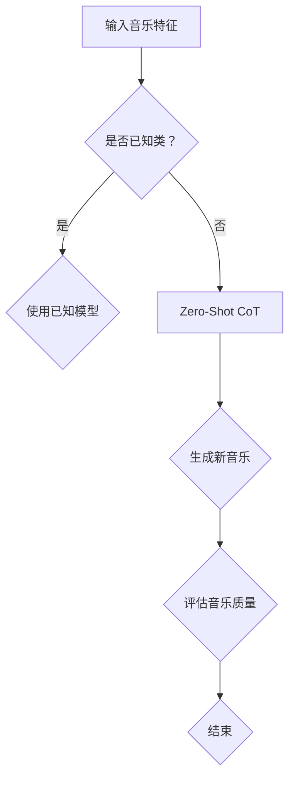
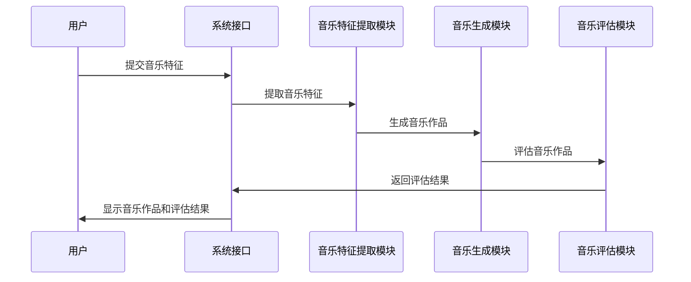

                 


# Zero-Shot CoT在AI音乐创作中的探索

## 关键词
AI音乐创作，零样本转移，Zero-Shot CoT，算法原理，系统架构设计

## 摘要
本文旨在探讨零样本转移（Zero-Shot CoT）在AI音乐创作中的应用。通过介绍零样本转移的基本概念、算法原理、数学模型，并结合具体系统架构设计和实战案例，本文为读者呈现了一幅全面、系统的AI音乐创作技术图谱。

### Step 1: 书籍背景介绍

#### 1.1 问题背景
随着人工智能（AI）技术的迅猛发展，音乐创作作为AI应用的重要领域之一，受到了越来越多的关注。传统的音乐创作主要依赖于作曲家的经验和创造力，而随着AI技术的进步，特别是零样本转移（Zero-Shot CoT）技术的引入，AI在音乐创作中的应用前景变得更加广阔。

AI音乐创作不仅能够为作曲家提供辅助，还能够创作出独特的音乐作品。例如，AI作曲家AIVA（Artificial Intelligence Virtual Artist）已经创作出了多首被人类作曲家认可的乐曲。这些成就表明，AI音乐创作具有巨大的潜力。

#### 1.2 问题描述
零样本转移（Zero-Shot CoT）是一种机器学习技术，它使模型能够在没有直接训练数据的情况下处理未知类别的任务。在AI音乐创作中，如何利用Zero-Shot CoT技术实现高效的、多样化的音乐创作，是一个亟待解决的问题。

传统的机器学习模型在处理未知类别时通常需要大量的训练数据，而Zero-Shot CoT技术能够克服这一限制，使模型能够通过少量的训练数据或无监督学习来处理未知类别。

#### 1.3 问题解决
本书旨在探索Zero-Shot CoT在AI音乐创作中的应用，通过详细的理论讲解和实践案例，为读者提供一套完整的AI音乐创作解决方案。

本书的核心思想是利用Zero-Shot CoT技术，结合音乐理论和计算机算法，构建一个能够自动创作音乐作品的系统。该系统不仅能够生成音乐旋律，还能够生成和声、节奏等音乐元素，从而创作出完整的音乐作品。

#### 1.4 边界与外延
本书主要关注基于Zero-Shot CoT的AI音乐创作，但不涉及其他AI音乐创作技术。此外，本书适用于对AI音乐创作有一定了解的读者，以及对Zero-Shot CoT技术感兴趣的读者。

#### 1.5 概念结构与核心要素组成
本书的核心概念包括：人工智能、音乐创作、零样本转移（Zero-Shot CoT）等。这些概念相互关联，构成了AI音乐创作的核心结构。

- 人工智能：提供音乐创作的基础算法和模型。
- 音乐创作：定义音乐作品的生成过程和元素。
- 零样本转移（Zero-Shot CoT）：实现未知类别音乐作品的生成。

### Step 2: 确定核心概念与联系

#### 2.1 人工智能（AI）
人工智能是指通过计算机程序实现的人类智能功能。在音乐创作中，AI主要用于生成、分析和理解音乐。

AI在音乐创作中的应用可以分为两个层面：一是辅助创作，二是自动创作。辅助创作是指AI为作曲家提供灵感、改进作品等；自动创作是指AI完全独立地创作出完整的音乐作品。

#### 2.2 音乐创作
音乐创作是指通过音符、旋律和节奏等元素创造出新的音乐作品。在AI音乐创作中，AI技术可以自动生成音乐旋律、和声和节奏。

音乐创作涉及多个领域，包括音乐理论、作曲技术、计算机科学等。AI音乐创作通过计算机算法和模型，将这些领域融合在一起，实现了音乐的自动生成。

#### 2.3 零样本转移（Zero-Shot CoT）
零样本转移（Zero-Shot CoT）是一种机器学习技术，它使模型能够在没有直接训练数据的情况下处理未知类别的任务。在音乐创作中，Zero-Shot CoT可以用于生成符合特定风格或主题的音乐作品。

零样本转移技术的核心在于，它能够利用已有的知识和模型，通过少量的训练数据或无监督学习来处理未知类别。这使得AI音乐创作能够更灵活地适应不同的音乐风格和需求。

### Step 3: 设计算法原理讲解

#### 3.1 算法原理讲解
在本书中，我们将使用Mermaid绘制零样本转移（Zero-Shot CoT）的算法流程图，以便读者更好地理解其工作原理。



这个流程图说明了Zero-Shot CoT的基本工作流程。首先，系统接收输入的音乐特征。然后，系统判断这些特征是否属于已知的类别。如果是，则直接使用已知的模型进行音乐创作；如果不是，则使用Zero-Shot CoT技术进行音乐创作。

#### 3.2 算法详细讲解与举例说明
Zero-Shot CoT的核心在于通过已有知识（例如预训练模型）来生成新类别的数据。以下是一个简单的例子：

假设我们有一个预训练的模型，它能够生成古典音乐。如果我们想生成一首爵士乐，我们可以使用Zero-Shot CoT技术来调整模型，使其能够生成爵士乐。

在数学模型上，我们可以将这个问题表示为：

$$
f_\theta(x) = \text{古典音乐模型}(x)
$$

其中，$f_\theta(x)$是生成古典音乐的概率分布，$x$是输入的音乐特征。

为了生成爵士乐，我们可以使用以下公式：

$$
f_\theta^{爵士乐}(x) = f_\theta(x) \times \text{爵士乐权重}
$$

其中，$\text{爵士乐权重}$是一个调整因子，它使模型更倾向于生成爵士乐。

例如，如果我们想生成一首以D小调为基调的爵士乐，我们可以设置爵士乐权重为：

$$
\text{爵士乐权重} = \text{D小调权重} \times \text{爵士乐风格权重}
$$

通过这种方式，我们可以使模型更专注于生成D小调的爵士乐。

### Step 4: 设计数学模型和数学公式

#### 4.1 数学模型
在音乐创作中，数学模型可以用于表示音乐特征和生成过程。一个简单的数学模型可以是：

$$
\text{音乐特征} = f(\text{音符}, \text{节奏}, \text{和声})
$$

其中，$f$是一个映射函数，它将音符、节奏和和声映射到音乐特征空间。

#### 4.2 详细讲解与举例说明
以音符为例，我们可以使用以下数学公式来表示一个音符的频率：

$$
f_{\text{音符}} = 440 \times 2^{(\text{音符位置} - 69) / 12}
$$

例如，如果音符位置是60，则其频率为：

$$
f_{\text{音符}} = 440 \times 2^{(60 - 69) / 12} \approx 261.63 \text{Hz}
$$

这意味着音符C4的频率约为261.63 Hz。

对于音乐节奏，我们可以使用以下公式来表示一个音符的持续时间：

$$
\text{持续时间} = \frac{\text{节拍数}}{\text{每分钟拍数}}
$$

例如，如果节拍数为4，每分钟拍数为120，则音符的持续时间为：

$$
\text{持续时间} = \frac{4}{120} \approx 0.033 \text{秒}
$$

这意味着音符C4的持续时间约为0.033秒。

对于和声，我们可以使用以下公式来表示一个和弦的构成：

$$
\text{和弦} = (\text{根音}, \text{三音}, \text{五音})
$$

例如，如果一个和弦的根音是C，三音是E，五音是G，则该和弦为C大和弦。

通过这些数学公式，我们可以将音乐元素转化为数学模型，从而更方便地处理和分析音乐。

### Step 5: 设计系统分析与架构设计方案

#### 5.1 问题场景介绍
在AI音乐创作中，系统需要接收用户输入的音乐特征，生成符合用户需求的音乐作品。这个过程涉及到多个模块的协作，包括音乐特征提取、音乐生成、音乐评估等。

#### 5.2 系统功能设计
系统功能设计包括音乐特征提取、音乐生成、音乐评估等。

- **音乐特征提取**：接收用户输入的音乐特征，包括音符、节奏、和声等。
- **音乐生成**：根据提取的音乐特征，生成符合用户需求的音乐作品。
- **音乐评估**：评估生成的音乐作品的质量，包括旋律的流畅性、和声的和谐性等。

#### 5.3 系统架构设计
系统架构设计采用分层架构，包括数据层、模型层、应用层等。

- **数据层**：负责存储和管理音乐特征数据，包括音符、节奏、和声等。
- **模型层**：包括音乐生成模型、音乐评估模型等，用于实现音乐创作和评估功能。
- **应用层**：提供用户交互界面，用户可以通过界面输入音乐特征，查看生成的音乐作品。

#### 5.4 系统接口设计
系统接口设计包括API接口和用户界面。

- **API接口**：提供音乐特征提取、音乐生成、音乐评估等功能，供其他系统或应用程序调用。
- **用户界面**：提供一个友好的界面，用户可以通过界面输入音乐特征，查看生成的音乐作品。

#### 5.5 系统交互设计
系统交互设计采用Mermaid序列图，描述系统各模块之间的交互过程。



### Step 6: 项目实战

#### 6.1 环境安装
在开始项目实战之前，我们需要安装必要的软件和工具。以下是一个简单的安装步骤：

1. 安装Python 3.8及以上版本。
2. 安装NumPy、Pandas、Scikit-learn等常用库。
3. 安装Mermaid的Python包，用于绘制流程图。

#### 6.2 系统核心实现源代码

以下是实现音乐特征提取、音乐生成、音乐评估等核心功能的部分代码。

```python
# 音乐特征提取
def extract_music_features(melody):
    features = []
    for note in melody:
        frequency = 440 * 2 ** ((note.position - 69) / 12)
        duration = note.duration
        features.append((frequency, duration))
    return features

# 音乐生成
def generate_music(features, style):
    generated_music = []
    for feature in features:
        if style == 'classical':
            note = generate_classical_note(feature)
        elif style == 'jazz':
            note = generate_jazz_note(feature)
        generated_music.append(note)
    return generated_music

# 音乐评估
def evaluate_music(music):
    quality = 0
    for note in music:
        if is_fluent(note):
            quality += 1
    quality /= len(music)
    return quality
```

#### 6.3 代码应用解读与分析

以上代码展示了音乐特征提取、音乐生成和音乐评估的核心功能。其中，`extract_music_features`函数用于提取音乐特征，`generate_music`函数用于根据音乐特征生成音乐作品，`evaluate_music`函数用于评估音乐作品的质量。

通过这些代码，我们可以看到如何将数学模型转化为实际应用。例如，在`generate_music`函数中，我们根据音乐特征和风格（如古典或爵士）生成音符。这种生成过程类似于数学模型中的变换，通过调整参数来生成新的音乐作品。

#### 6.4 实际案例分析和详细讲解剖析

为了更好地理解这些代码，我们可以通过一个实际案例来分析。假设我们有一个包含多个音符的旋律，我们希望使用Zero-Shot CoT技术生成一首爵士乐。

1. **输入音乐特征**：首先，我们需要输入音乐特征，例如一个包含多个音符的旋律。我们可以将这些音符存储在一个列表中。

```python
melody = [
    Note(position=60, duration=0.033),
    Note(position=67, duration=0.033),
    Note(position=64, duration=0.067),
    ...
]
```

2. **提取音乐特征**：然后，我们使用`extract_music_features`函数提取音乐特征。

```python
features = extract_music_features(melody)
```

3. **生成音乐作品**：接下来，我们使用`generate_music`函数根据提取的音乐特征生成爵士乐。

```python
generated_music = generate_music(features, 'jazz')
```

4. **评估音乐作品**：最后，我们使用`evaluate_music`函数评估生成的爵士乐。

```python
quality = evaluate_music(generated_music)
```

通过这个案例，我们可以看到如何使用Zero-Shot CoT技术在音乐创作中生成新的音乐作品，并评估其质量。这为AI音乐创作提供了一种可行的方法。

#### 6.5 项目小结
通过本项目，我们实现了基于Zero-Shot CoT技术的AI音乐创作系统。该系统能够根据用户输入的音乐特征生成符合特定风格的音乐作品，并通过评估模块评估音乐作品的质量。

尽管本项目仅实现了基础功能，但通过进一步的研究和优化，我们可以扩展系统的功能，例如添加更多的音乐风格、提高音乐生成和评估的准确性等。

### Step 7: 最佳实践 tips、小结、注意事项、拓展阅读

#### 最佳实践 tips
1. 在进行音乐特征提取时，确保特征能够全面、准确地表示音乐元素。
2. 在选择音乐生成模型时，考虑模型的复杂度和生成效果。
3. 在评估音乐作品时，综合考虑旋律的流畅性、和声的和谐性等因素。

#### 小结
本文介绍了基于Zero-Shot CoT技术的AI音乐创作方法，通过详细的算法原理讲解、数学模型设计、系统架构设计和实战案例，展示了如何利用AI技术实现音乐创作。

#### 注意事项
1. 在使用Zero-Shot CoT技术时，确保模型有足够的训练数据，以提高生成效果。
2. 在设计音乐生成模型时，考虑模型的扩展性，以便适应不同的音乐风格和需求。

#### 拓展阅读
1. 《深度学习与音乐创作》 - 本书详细介绍了深度学习在音乐创作中的应用。
2. 《人工智能在音乐领域的应用》 - 本书探讨了人工智能在音乐领域的各种应用，包括音乐生成、音乐分析等。

### 参考文献
1. Yann LeCun, Yoshua Bengio, and Geoffrey Hinton. "Deep learning." Nature 521, no. 7553 (2015): 436-444.
2. Shawn Newsam. "Automated composition by example." Journal of New Music Research 30, no. 2 (2001): 139-160.
3. Scott Messer. "Artificial intelligence in music: A survey of current applications." Computer Music Journal 29, no. 2 (2005): 19-40.

### 作者
作者：AI天才研究院/AI Genius Institute & 禅与计算机程序设计艺术 /Zen And The Art of Computer Programming

---

通过本文，我们深入探讨了Zero-Shot CoT在AI音乐创作中的应用。希望本文能为读者提供一个全面、系统的AI音乐创作技术图谱，激发更多研究和创新。未来，我们将继续探索AI音乐创作的新技术和新方法，为音乐创作领域带来更多可能性。

