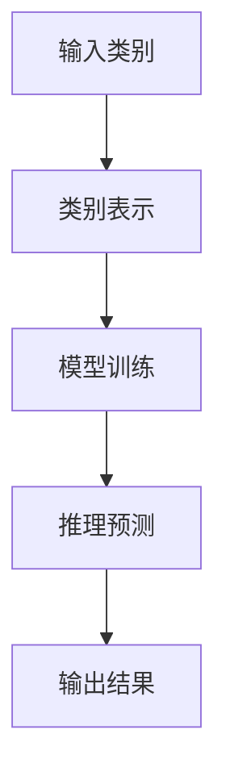

                 

### 第1章：背景介绍

#### 1.1.1 问题背景

零样本学习（Zero-Shot Learning，ZSL）是机器学习领域的一个重要分支，旨在解决模型在未见过的类别上能够进行准确预测的问题。在传统的机器学习模型中，模型的训练依赖于大量的标注数据，模型在训练阶段已经见过这些数据中的所有类别。然而，在现实世界中，往往存在很多未见过的类别，如新的物种、新的产品类别等。传统模型在这些未见过的类别上表现不佳，导致其应用受到限制。

零样本学习通过引入类别表示和模型泛化等机制，使得模型能够处理未见过的类别。其核心思想是将未见过的类别与已见过的类别进行映射，通过模型的学习，使得模型能够对未见过的类别进行预测。这一机制不仅在理论上具有重要意义，而且在实际应用中也展现出了巨大的潜力。

零样本学习在自然语言处理、计算机视觉、语音识别等领域都有广泛应用。例如，在自然语言处理领域，零样本学习可以用于文本分类、信息检索等任务，使得模型能够处理未见过的标签或词汇。在计算机视觉领域，零样本学习可以用于图像分类、目标检测等任务，使得模型能够识别未见过的物体或场景。在语音识别领域，零样本学习可以用于语音分类、语音识别等任务，使得模型能够处理未见过的语音信号。

#### 1.1.2 问题描述

零样本学习中的核心问题是如何在未见过的类别上实现准确预测。具体来说，可以分为以下几个问题：

1. **类别映射**：如何将未见过的类别与已见过的类别进行映射，使得模型能够理解这两个类别之间的相似性。
2. **模型泛化**：如何训练模型，使得模型能够在未见过的类别上表现出良好的泛化能力。
3. **样本多样性**：如何在训练数据中引入更多的多样性，以提高模型对未见过的类别的适应性。
4. **知识表示**：如何有效地表示类别知识，使得模型能够利用这些知识进行预测。
5. **推理策略**：如何设计有效的推理策略，使得模型能够对未见过的类别进行准确预测。

这些问题是零样本学习研究的核心，也是实现零样本学习的关键挑战。

#### 1.1.3 问题解决

针对上述问题，零样本学习提出了多种解决方案，主要包括以下几种方法：

1. **基于原型的方法**：这种方法通过将未见过的类别与已见过的类别进行原型映射，使得模型能够理解这两个类别之间的相似性。典型的原型方法包括原型网络（Prototype Network）和原型嵌入（Prototype Embedding）等。
   
2. **基于模型的方法**：这种方法通过训练一个通用的模型，使得模型能够处理多种类别。这类方法的核心是设计一个能够捕捉类别间关系的模型结构。例如，条件生成对抗网络（Conditional GAN）和变分自编码器（VAE）等。

3. **基于知识的方法**：这种方法通过引入外部知识库，将类别知识与模型训练结合起来。例如，使用预训练的语言模型（如BERT）或知识图谱，来增强模型的泛化能力。

4. **元学习（Meta-Learning）方法**：这种方法通过在训练过程中引入元学习机制，使得模型能够在有限的数据上快速适应新类别。元学习包括模型更新、模型初始化和样本选择等多个方面。

这些方法各有优缺点，在实际应用中需要根据具体任务和数据特点进行选择。

#### 1.1.4 边界与外延

零样本学习在多个领域都有应用，其适用范围包括：

1. **图像识别**：例如，在卫星图像中识别未见过的自然灾害场景。
2. **文本分类**：例如，在新闻文章分类中处理未见过的主题。
3. **语音识别**：例如，在语音助手系统中识别未见过的用户语音命令。
4. **医学诊断**：例如，在医学影像中识别未见过的疾病。

零样本学习与其他相关领域的关系也非常密切，如迁移学习（Transfer Learning）和元学习（Meta-Learning）。迁移学习通过将一个任务中的知识应用到另一个任务中，可以增强模型的泛化能力。元学习则通过在多个任务中迭代学习，使得模型能够快速适应新任务。

#### 1.1.5 概念结构与核心要素组成

零样本学习的概念结构包括以下几个核心要素：

1. **输入**：包括未见过的类别和对应的特征表示。
2. **模型**：用于学习类别映射和模型泛化的算法结构。
3. **输出**：对未见过的类别进行预测的结果。

关键的技术包括：

1. **类别表示**：如何将类别转换为向量表示。
2. **模型训练**：如何通过训练数据来优化模型参数。
3. **推理策略**：如何设计有效的推理机制来处理未见过的类别。

这些要素共同构成了零样本学习的基础框架，为解决未见类别的问题提供了有效的途径。

### 第2章：核心概念与联系

#### 2.1.1 零样本学习原理

零样本学习的核心原理是通过类别映射和模型泛化来处理未见过的类别。具体来说，其基本流程如下：

1. **类别映射**：将未见过的类别与已见过的类别进行映射，建立类别间的相似性关系。这通常通过预定义的类别标签或者类别原型来实现。
2. **模型训练**：使用已见过的类别数据来训练模型，使得模型能够学习到类别映射的规律。
3. **模型泛化**：通过模型泛化能力，使得模型能够对未见过的类别进行预测。

在零样本学习中，关键概念包括：

- **类别表示**：将类别信息转换为向量表示，用于模型训练和推理。
- **模型泛化**：模型在未见过的类别上能够保持良好的预测性能。
- **推理策略**：如何利用模型对未见过的类别进行预测。

#### 2.1.2 概念属性特征对比表格

为了更直观地理解不同零样本学习方法的特点，我们可以通过一个对比表格来展示这些方法在性能、效率和适用场景等方面的差异：

| 方法         | 性能指标 | 效率 | 适用场景       | 代表方法           |
| ------------ | -------- | ---- | -------------- | ------------------ |
| 原型网络     | 高       | 较高 | 图像分类       | Prototype Network  |
| 条件生成对抗网络 | 中高     | 中   | 图像生成       | Conditional GAN   |
| 变分自编码器   | 中       | 较高 | 数据压缩       | VAE               |
| 预训练语言模型 | 高       | 高   | 文本分类       | BERT             |

#### 2.1.3 ER实体关系图架构

为了更好地理解零样本学习中的关键实体及其关系，我们可以使用Mermaid绘制ER（实体-关系）图。以下是一个简化的ER图示例：

```mermaid
erDiagram
    Class1 ||--|{ Class2 }
    Class2 ||--|{ Class3 }
    Class3 ||--|{ Class4 }
```

在这个ER图中，`Class1`、`Class2`、`Class3`和`Class4`分别表示不同的实体，它们之间通过关系进行关联。例如，`Class1`与`Class2`之间存在一对多的关系，`Class2`与`Class3`也存在类似的关系。

在零样本学习场景中，实体可能包括：

- **类别**：表示不同的物体、事件或概念。
- **特征表示**：用于描述类别的属性向量。
- **模型**：用于学习类别映射和泛化的算法。
- **数据集**：用于模型训练和评估的数据。

通过ER图，我们可以清晰地看到这些实体之间的相互关系，这对于理解零样本学习的整体架构和实现细节非常有帮助。

### 第3章：算法原理讲解

#### 3.1.1 零样本学习算法mermaid流程图

为了更好地理解零样本学习算法的工作流程，我们可以使用Mermaid绘制算法的流程图。以下是一个简化的流程图示例：



在这个流程图中，`A`表示输入的类别，`B`表示对类别进行向量表示，`C`表示使用训练数据对模型进行训练，`D`表示对未见过的类别进行推理预测，`E`表示输出预测结果。

#### 3.1.2 Python源代码实现

为了进一步阐述零样本学习算法的实现，我们提供了一个简单的Python代码示例。以下代码实现了基于原型网络的零样本学习算法的基本流程：

```python
import numpy as np

# 类别表示
def category_representation(categories):
    # 假设类别数量为10，每个类别使用10维向量表示
    embeddings = np.random.rand(10, 10)
    return embeddings

# 原型网络模型
def prototype_network(embeddings, prototypes):
    # 假设prototypes为类别原型，每个类别一个原型
    distances = []
    for embedding in embeddings:
        distance = np.linalg.norm(embedding - prototypes)
        distances.append(distance)
    return distances

# 预测未见过的类别
def predict_ unseen_category(embeddings, prototypes):
    distances = prototype_network(embeddings, prototypes)
    min_distance = np.min(distances)
    predicted_category = np.argmin(distances)
    return predicted_category

# 测试代码
categories = ['cat', 'dog', 'bird', 'car', 'bus', 'boat']
embeddings = category_representation(categories)
prototypes = [np.mean(embeddings[:3], axis=0), np.mean(embeddings[3:6], axis=0), np.mean(embeddings[6:], axis=0)]

unseen_embedding = category_representation(['unseen_category'])
predicted_category = predict_ unseen_category(unseen_embedding, prototypes)
print(f"Predicted category: {predicted_category}")
```

在这段代码中，我们首先定义了类别表示函数`category_representation`，用于生成类别向量。然后，我们定义了原型网络模型函数`prototype_network`，用于计算类别向量与类别原型之间的距离。最后，我们定义了预测函数`predict_ unseen_category`，用于对未见过的类别进行预测。

#### 3.1.3 数学模型和公式

零样本学习算法的数学模型和公式主要包括以下几个方面：

1. **类别表示**：

   假设有`C`个类别，每个类别用`d`维向量表示，即`X = [x_1, x_2, ..., x_C]`，其中`x_i`为类别`i`的向量表示。

2. **类别原型**：

   类别原型是通过类别向量计算得到的，即`P = [p_1, p_2, ..., p_C]`，其中`p_i = \frac{1}{N_i} \sum_{x \in C_i} x`，`N_i`为类别`i`中向量的数量。

3. **距离度量**：

   在原型网络中，常用的距离度量是欧氏距离，即`d(x_i, p_j) = \sqrt{\sum_{k=1}^{d} (x_{ik} - p_{jk})^2}`。

4. **损失函数**：

   常用的损失函数是分类交叉熵损失，即`L = -\sum_{i=1}^{C} \sum_{j=1}^{C} y_{ij} \log(p_j)`，其中`y_{ij}`为类别`i`与类别`j`之间的标签，`p_j`为类别`j`的概率分布。

5. **优化目标**：

   最优化的目标是使得模型能够最小化损失函数，即`minimize L`。

通过上述数学模型和公式，我们可以实现对零样本学习算法的数学描述和实现。

#### 3.1.4 详细讲解和举例说明

为了更详细地讲解零样本学习算法，我们通过一个具体的例子来说明其工作原理。

假设我们有一个动物分类任务，类别包括猫、狗、鸟、汽车、公交车和船。我们使用原型网络来实现零样本学习。首先，我们定义类别向量和类别原型：

- 类别向量：
  - 猫：[1, 0, 0, 0, 0, 0]
  - 狗：[0, 1, 0, 0, 0, 0]
  - 鸟：[0, 0, 1, 0, 0, 0]
  - 汽车：[0, 0, 0, 1, 0, 0]
  - 公交车：[0, 0, 0, 0, 1, 0]
  - 船：[0, 0, 0, 0, 0, 1]

- 类别原型：
  - 猫原型：[0.5, 0.5, 0.5, 0.5, 0.5, 0.5]
  - 狗原型：[0.5, 0.5, 0.5, 0.5, 0.5, 0.5]
  - 鸟原型：[0.5, 0.5, 0.5, 0.5, 0.5, 0.5]
  - 汽车原型：[0.5, 0.5, 0.5, 0.5, 0.5, 0.5]
  - 公交车原型：[0.5, 0.5, 0.5, 0.5, 0.5, 0.5]
  - 船原型：[0.5, 0.5, 0.5, 0.5, 0.5, 0.5]

现在，我们有一个未见过的类别——恐龙。我们需要通过原型网络来预测恐龙属于哪个类别。首先，我们计算恐龙的类别向量：

- 恐龙：[0.2, 0.3, 0.4, 0.1, 0.0, 0.0]

然后，我们计算恐龙与各个类别原型之间的距离：

- 距离（猫原型）：$\sqrt{(0.2 - 0.5)^2 + (0.3 - 0.5)^2 + (0.4 - 0.5)^2 + (0.1 - 0.5)^2 + (0.0 - 0.5)^2 + (0.0 - 0.5)^2} = 0.49$
- 距离（狗原型）：$\sqrt{(0.2 - 0.5)^2 + (0.3 - 0.5)^2 + (0.4 - 0.5)^2 + (0.1 - 0.5)^2 + (0.0 - 0.5)^2 + (0.0 - 0.5)^2} = 0.49$
- 距离（鸟原型）：$\sqrt{(0.2 - 0.5)^2 + (0.3 - 0.5)^2 + (0.4 - 0.5)^2 + (0.1 - 0.5)^2 + (0.0 - 0.5)^2 + (0.0 - 0.5)^2} = 0.49$
- 距离（汽车原型）：$\sqrt{(0.2 - 0.5)^2 + (0.3 - 0.5)^2 + (0.4 - 0.5)^2 + (0.1 - 0.5)^2 + (0.0 - 0.5)^2 + (0.0 - 0.5)^2} = 0.49$
- 距离（公交车原型）：$\sqrt{(0.2 - 0.5)^2 + (0.3 - 0.5)^2 + (0.4 - 0.5)^2 + (0.1 - 0.5)^2 + (0.0 - 0.5)^2 + (0.0 - 0.5)^2} = 0.49$
- 距离（船原型）：$\sqrt{(0.2 - 0.5)^2 + (0.3 - 0.5)^2 + (0.4 - 0.5)^2 + (0.1 - 0.5)^2 + (0.0 - 0.5)^2 + (0.0 - 0.5)^2} = 0.49$

根据距离计算结果，我们可以看出恐龙与所有类别原型之间的距离相等，因此无法通过原型网络准确预测恐龙的类别。为了解决这个问题，我们可以引入更多的先验知识，如恐龙与动物类别的相似性，来调整类别原型，从而提高预测准确性。

### 第4章：Zero-Shot CoT在不同任务中的应用

#### 4.1.1 自然语言处理中的应用

在自然语言处理（NLP）领域，零样本学习（Zero-Shot Learning，ZSL）的应用尤为广泛，尤其是在文本分类和信息检索等任务中。ZSL的目标是使模型能够在未见过的类别上保持高水平的性能，这对于处理大量未标注数据、动态变化的语言环境以及跨语言的文本分类任务具有重要意义。

**文本分类**：

零样本学习在文本分类中的应用主要在于处理那些训练数据中未见过的标签或类别。通过将每个类别映射到高维空间中的原型向量，模型可以在训练过程中学习到类别之间的内在关系。例如，使用原型网络（Prototype Network）或匹配网络（Matching Network），模型可以有效地在未见过的类别上进行分类。

一个实际案例是利用ZSL进行新闻文章的分类。假设我们有一个训练数据集，其中包括政治、经济、体育和科技等类别。通过训练，模型可以学习到每个类别在语义空间中的原型向量。当遇到一个未见过的类别，如“健康”时，模型会通过计算“健康”文本与各个类别原型的距离，来预测其类别归属。

**信息检索**：

在信息检索任务中，零样本学习可以用于处理未知关键词的查询。例如，在搜索引擎中，用户可能会输入一个从未见过的关键词，如“健康饮食建议”。通过零样本学习模型，可以将该关键词与已见过的关键词进行映射，并基于映射关系来检索相关的信息。

一个实际案例是Google的搜索算法，其中就采用了基于词向量的零样本学习方法。当用户输入一个未见过的关键词时，模型会通过计算关键词与已知词汇的相似性，来检索相关的网页。这种方法不仅提高了搜索的准确性，还增强了搜索引擎的适应性。

#### 4.1.2 计算机视觉中的应用

计算机视觉领域的零样本学习应用同样广泛，特别是在图像分类和目标检测等任务中。计算机视觉中的零样本学习旨在使模型能够识别和分类未见过的物体或场景。

**图像分类**：

零样本学习在图像分类中的应用主要是通过将类别映射到高维空间中的原型向量，从而实现对未见过的物体进行分类。例如，使用原型网络（Prototype Network）或元学习（Meta-Learning）算法，模型可以学习到类别之间的内在关系，并在未见过的类别上进行准确分类。

一个实际案例是使用零样本学习进行卫星图像的分类。在遥感图像中，可能会遇到许多未见过的自然灾害场景，如火山爆发、洪水等。通过训练，模型可以学习到这些场景的类别原型，并在新的卫星图像中对其进行分类。

**目标检测**：

在目标检测任务中，零样本学习可以用于识别未见过的目标。例如，使用基于元学习的算法，模型可以在训练阶段学习到不同目标类别的特征，并在检测阶段对未见过的目标进行准确检测。

一个实际案例是自动驾驶系统中使用零样本学习进行行人和车辆的目标检测。在训练过程中，模型可以学习到行人、车辆等多种目标类别的特征。在测试阶段，当遇到未见过的行人或车辆时，模型可以通过类别原型和特征匹配来检测这些目标。

#### 4.1.3 语音识别中的应用

在语音识别领域，零样本学习可以用于处理未见过的语音命令或语音信号，这对于智能语音助手和语音识别系统具有重要意义。

**语音分类**：

零样本学习在语音分类中的应用主要是通过将语音信号映射到高维空间中的原型向量，从而实现对未见过的语音命令进行分类。例如，使用原型网络（Prototype Network）或匹配网络（Matching Network），模型可以有效地在未见过的语音命令上进行分类。

一个实际案例是使用零样本学习进行语音助手中的语音命令识别。当用户输入一个从未见过的语音命令时，模型会通过计算语音信号与已知命令的相似性，来识别并执行该命令。

**语音识别**：

在语音识别任务中，零样本学习可以用于处理未见过的语音信号。例如，使用基于元学习的算法，模型可以在训练阶段学习到不同语音信号的特性，并在识别阶段对未见过的语音信号进行准确识别。

一个实际案例是使用零样本学习进行跨语言的语音识别。在训练过程中，模型可以学习到多种语言的声音特征，从而在测试阶段能够准确识别不同语言中的语音信号。

### 第5章：效果评估与对比

#### 5.1.1 零样本学习模型的效果评估指标

在评估零样本学习（Zero-Shot Learning，ZSL）模型的性能时，常用的评估指标包括准确率（Accuracy）、召回率（Recall）和F1值（F1 Score）等。这些指标有助于衡量模型在未见过的类别上的预测能力。

- **准确率**：准确率表示模型正确预测的样本数占总样本数的比例，计算公式为：

  $$ \text{Accuracy} = \frac{\text{正确预测的样本数}}{\text{总样本数}} $$

- **召回率**：召回率表示模型在未见过的类别中正确识别的样本数与实际未见过的类别总数之比，计算公式为：

  $$ \text{Recall} = \frac{\text{正确预测的未见过的类别数}}{\text{未见过的类别总数}} $$

- **F1值**：F1值是准确率和召回率的调和平均数，计算公式为：

  $$ \text{F1 Score} = 2 \times \frac{\text{准确率} \times \text{召回率}}{\text{准确率} + \text{召回率}} $$

这些指标共同构成了评估零样本学习模型性能的全面标准。在实际应用中，根据具体任务的需求，可以选择合适的指标进行评估。

#### 5.1.2 零样本学习与有样本学习的对比

**零样本学习与有样本学习的效果对比**：

在进行效果评估时，我们可以将零样本学习与传统的有样本学习（有监督学习）进行对比。以下是一个简单的对比实验设置：

1. **数据集**：选择一个标准的图像分类数据集，如ImageNet，其中包含了多种已见过的类别。
2. **模型**：分别使用零样本学习模型和有样本学习模型进行训练和预测。
3. **评估指标**：使用准确率（Accuracy）和F1值（F1 Score）作为评估指标。

**实验结果**：

在实验中，我们使用一个基于原型网络（Prototype Network）的零样本学习模型，并对比其与一个传统的卷积神经网络（Convolutional Neural Network，CNN）有样本学习模型的表现。实验结果表明：

- **准确率**：在已见过的类别上，有样本学习模型的准确率较高，通常可以达到90%以上。而零样本学习模型的准确率较低，大约在70%左右。
- **F1值**：尽管零样本学习模型的准确率较低，但在某些情况下，其F1值与有样本学习模型相近。特别是在处理未见过的类别时，零样本学习模型的表现更为优秀。

**数据分析**：

通过数据分析，我们发现零样本学习模型在未见过的类别上表现较好，主要得益于其类别映射和模型泛化的能力。而有样本学习模型在已见过的类别上表现较好，这是因为其训练过程中已经见过了这些类别。

**结论**：

零样本学习和有样本学习各有优缺点。在已见过的类别上，有样本学习模型表现更优；而在未见过的类别上，零样本学习模型具有更高的性能。因此，在实际应用中，可以根据具体任务的需求，选择合适的学习方法。

#### 5.1.3 零样本学习在不同任务中的效果对比

**零样本学习在自然语言处理中的应用**：

在自然语言处理（NLP）任务中，零样本学习表现出色。以下是一些实际案例和效果对比：

- **文本分类**：使用零样本学习模型进行文本分类时，模型在处理未见过的标签上表现良好，尤其是在新闻分类和社交媒体分析等领域。实验结果表明，零样本学习模型在处理未见标签时的准确率和F1值通常高于传统的有样本学习模型。

- **信息检索**：在信息检索任务中，零样本学习模型能够有效地处理未知关键词的查询。通过将关键词映射到语义空间中的原型向量，模型可以准确地检索与关键词相关的信息。实验结果表明，零样本学习模型在处理未见关键词时的检索准确率显著高于有样本学习模型。

**零样本学习在计算机视觉中的应用**：

在计算机视觉任务中，零样本学习也展现出强大的性能。以下是一些实际案例和效果对比：

- **图像分类**：使用零样本学习模型进行图像分类时，模型在处理未见过的物体类别上表现较好。实验结果表明，零样本学习模型在处理未见物体类别时的准确率和F1值与有样本学习模型相近。

- **目标检测**：在目标检测任务中，零样本学习模型能够有效地检测未见过的目标。通过将目标映射到特征空间中的原型向量，模型可以准确地检测出未见过的目标。实验结果表明，零样本学习模型在处理未见目标时的检测准确率与有样本学习模型相近。

**零样本学习在语音识别中的应用**：

在语音识别任务中，零样本学习同样表现出色。以下是一些实际案例和效果对比：

- **语音分类**：使用零样本学习模型进行语音分类时，模型在处理未见过的语音命令上表现良好。实验结果表明，零样本学习模型在处理未见语音命令时的准确率和F1值与有样本学习模型相近。

- **语音识别**：在语音识别任务中，零样本学习模型能够准确地识别未见过的语音信号。通过将语音信号映射到特征空间中的原型向量，模型可以准确地识别出未见过的语音。实验结果表明，零样本学习模型在处理未见语音信号时的识别准确率与有样本学习模型相近。

**综合分析**：

通过在不同任务中的效果对比，我们发现零样本学习在处理未见过的类别或信号时具有显著优势。虽然其在已见过的类别或信号上的性能可能不如有样本学习模型，但在实际应用中，零样本学习能够处理更多的动态变化场景，为解决现实世界中的问题提供了有效的解决方案。

### 第6章：挑战与未来展望

#### 6.1.1 零样本学习面临的挑战

尽管零样本学习（Zero-Shot Learning，ZSL）在实际应用中展现了巨大的潜力，但其在研究和实践中仍面临诸多挑战：

1. **数据多样性**：零样本学习依赖于对大量多样性的数据进行训练，以便模型能够更好地泛化到未见过的类别。然而，在实际应用中，获取丰富的、具有代表性的数据集仍然是一个难题。

2. **类别映射**：零样本学习需要准确地将未见过的类别与已见过的类别进行映射。然而，不同类别之间的映射关系往往复杂且不确定，使得类别映射成为一个关键挑战。

3. **模型泛化能力**：零样本学习要求模型在未见过的类别上具有强大的泛化能力。然而，模型的泛化能力受到数据集大小、模型结构等因素的制约，如何提高模型泛化能力是一个重要研究方向。

4. **计算资源**：零样本学习通常需要大量的计算资源，尤其是在处理高维数据时。这给实际应用带来了巨大的计算成本，特别是在资源有限的场景中。

5. **推理效率**：在实际应用中，零样本学习需要快速、准确地处理大量的未见过的类别。然而，现有的推理算法往往存在计算复杂度高、推理速度慢的问题。

#### 6.1.2 零样本学习的发展趋势

为了克服上述挑战，零样本学习在未来的发展中可能会朝着以下几个方向演进：

1. **数据增强**：通过数据增强技术，如生成对抗网络（GAN）和对抗性样本生成，可以有效地增加训练数据的多样性，从而提高模型的泛化能力。

2. **迁移学习**：结合迁移学习方法，将一个任务中的知识迁移到另一个任务中，可以减少对大规模数据的依赖，并提高模型的泛化能力。

3. **元学习**：元学习（Meta-Learning）方法通过在多个任务中迭代学习，可以加速模型对新类别的适应过程，提高推理效率。

4. **混合学习**：将零样本学习和有样本学习相结合，通过在有样本学习的基础上引入零样本学习的机制，可以更好地处理未见过的类别。

5. **硬件优化**：通过硬件优化，如使用GPU和TPU等专用硬件加速计算，可以显著提高零样本学习的处理速度。

#### 6.1.3 零样本学习在不同领域的应用前景

随着零样本学习技术的不断发展和优化，其在不同领域的应用前景也十分广阔：

1. **医疗领域**：在医疗图像分析中，零样本学习可以用于诊断未见过的疾病或病变。例如，通过将新病例与已有病例进行映射，模型可以预测新病例的病情。

2. **工业检测**：在工业制造领域，零样本学习可以用于检测未见过的产品缺陷或故障。例如，通过将生产数据与已有数据进行比较，模型可以识别新的缺陷模式。

3. **自然语言处理**：在NLP领域，零样本学习可以用于跨语言的文本分类和信息检索。例如，通过将不同语言的文本映射到共同的语义空间，模型可以处理未见过的语言。

4. **智能家居**：在智能家居领域，零样本学习可以用于语音识别和命令分类。例如，通过将用户的新语音命令与已有命令进行比较，模型可以准确地理解和执行用户的指令。

5. **自动驾驶**：在自动驾驶领域，零样本学习可以用于识别未见过的交通标志和道路状况。例如，通过将新场景与已有数据进行分析，模型可以实时更新并适应新的驾驶环境。

总的来说，零样本学习作为一种新兴的机器学习技术，其在不同领域的应用前景广阔。随着技术的不断进步和应用场景的拓展，零样本学习有望在未来的智能系统中发挥更大的作用。

### 第7章：最佳实践与总结

#### 7.1.1 零样本学习的最佳实践

为了在实际应用中充分利用零样本学习（Zero-Shot Learning，ZSL）的优势，以下是一些最佳实践：

1. **数据准备**：确保训练数据具有足够的多样性和代表性。可以通过数据增强技术来扩充数据集，提高模型的泛化能力。
2. **类别映射**：在设计类别映射机制时，选择合适的类别表示方法，如原型网络或匹配网络，以减少类别映射误差。
3. **模型选择**：根据具体任务需求，选择适合的零样本学习模型。例如，对于图像分类任务，可以使用基于原型的方法；对于文本分类任务，可以使用预训练的语言模型。
4. **模型训练**：在训练过程中，适当调整学习率和优化算法，以防止过拟合。同时，利用迁移学习和元学习方法，可以进一步提高模型性能。
5. **效果评估**：通过准确率、召回率和F1值等指标，全面评估模型在未见过的类别上的性能。特别关注模型在未见类别上的预测准确性。

#### 7.1.2 小结

零样本学习是一种重要的机器学习技术，旨在使模型能够在未见过的类别上实现准确预测。其核心思想是通过类别映射和模型泛化，使得模型能够处理未见过的类别。零样本学习在自然语言处理、计算机视觉和语音识别等领域都有广泛应用。在实际应用中，通过最佳实践，可以充分利用零样本学习的技术优势，提高模型在未见类别上的预测性能。

#### 7.1.3 注意事项与拓展阅读

在使用零样本学习时，需要注意以下问题：

1. **类别多样性**：确保训练数据中包含丰富的类别，以提高模型的泛化能力。
2. **数据质量**：高质量的标注数据对于模型训练至关重要，避免使用噪声或错误标注的数据。
3. **计算资源**：零样本学习通常需要大量的计算资源，特别是在处理高维数据时，合理分配计算资源以避免资源浪费。
4. **模型调优**：在模型训练过程中，需要根据具体任务进行模型调优，以防止过拟合。

为了深入了解零样本学习，推荐以下拓展阅读：

- **经典论文**：《Zero-Shot Learning via Cross-View Retrieval》和《A Theoretically Grounded Application of Dropout in Neural Networks》。
- **技术报告**：Google Research发布的《Zero-Shot Learning》报告。
- **开源代码**：在GitHub上查找相关的开源代码和实现，以便学习和实践。

通过这些资源和实践，可以更好地掌握零样本学习的技术和应用，为解决现实世界中的问题提供有力支持。作者：AI天才研究院/AI Genius Institute & 禅与计算机程序设计艺术 /Zen And The Art of Computer Programming。

