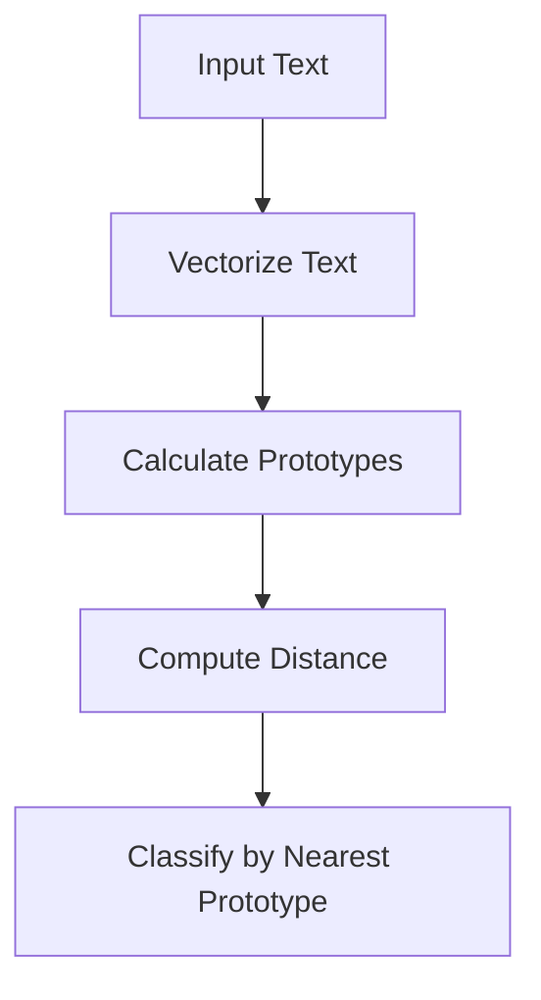
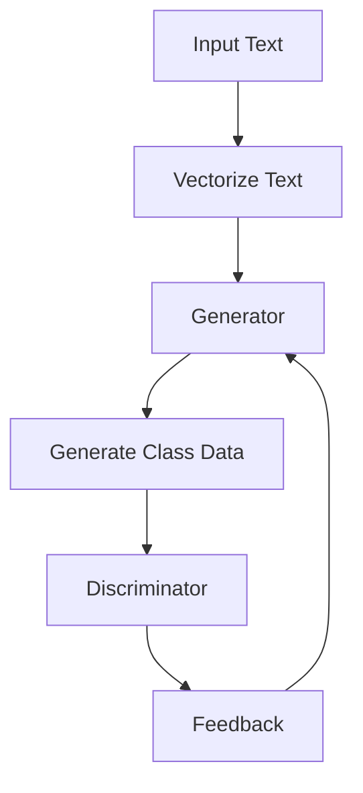
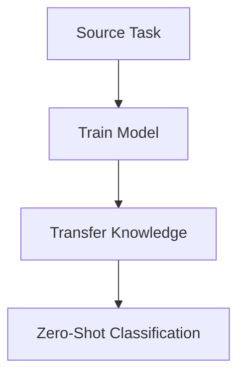
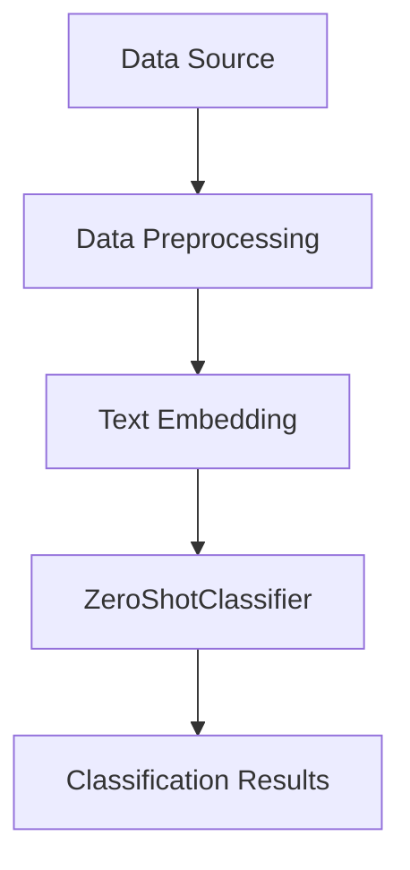
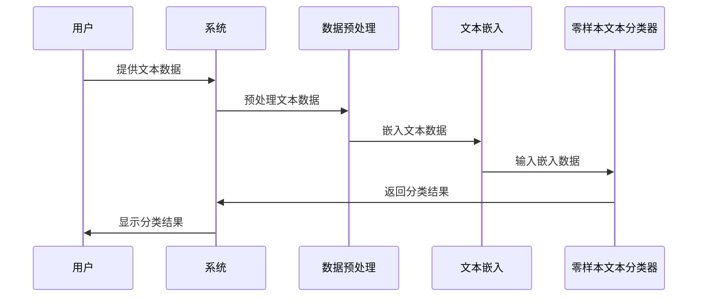

                 

# {{此处是文章标题}}

> 关键词：零样本文本分类、应用效果评估、领域应用、算法分析

> 摘要：本文旨在深入探讨零样本文本分类在不同领域的应用效果，通过评估与分析，揭示其在自然语言处理、问答系统和情感分析等领域的潜力与挑战。文章首先介绍了零样本文本分类的基本概念，然后对比了不同算法原理，最后通过实际案例展示了其应用效果。

----------------------------------------------------------------

## 第一部分：引言与背景

### 第1章：零样本文本分类概述

#### 1.1 零样本文本分类的问题背景

在当今信息爆炸的时代，文本数据以惊人的速度增长，但与之相对的是，标注数据的稀缺性。传统文本分类模型通常依赖大量有标签的训练数据，但在实际应用中，往往遇到数据标注困难、成本高昂等问题。零样本文本分类（Zero-Shot Text Classification）作为一种新兴技术，旨在解决这一问题，通过学习无标签的新数据，实现无需标注即可进行分类的任务。

#### 1.1.1 传统文本分类的挑战

传统文本分类通常需要大量的标注数据来训练模型。这涉及到高昂的时间和人力成本，且在实际应用中，往往难以获得足够的标注数据。此外，随着领域变化的快速，已有的标注数据可能很快变得过时，从而影响模型的性能。

#### 1.1.2 零样本文本分类的定义

零样本文本分类指的是在没有或只有少量样本数据的情况下，对未知类别的文本进行分类的方法。它主要通过零样本学习（Zero-Shot Learning）来实现，即模型在训练阶段并未见过待分类的新类别，但在测试阶段能够准确分类。

#### 1.1.3 零样本文本分类的意义

零样本文本分类在处理数据稀缺的场景下具有显著优势，可以降低数据标注成本，提高模型对未知数据的泛化能力。此外，它还在跨领域文本分类、自动化分类系统构建等领域显示出巨大的潜力。

#### 1.2 零样本文本分类的核心概念

为了深入理解零样本文本分类，我们需要了解以下几个核心概念：

### 1.2.1 零样本学习

零样本学习是指模型在训练阶段未见过的类别，在测试阶段能够准确分类的学习方法。它通常通过元学习（Meta-Learning）和原型方法（Prototype Method）来实现。

### 1.2.2 闭集与开集分类

闭集分类（Closed-Set Classification）指的是在训练集和测试集中均存在的类别；而开集分类（Open-Set Classification）则是在测试集中可能存在训练集未见的类别。

### 1.2.3 零样本文本分类的边界与外延

零样本文本分类的边界在于如何处理未见过的类别，其外延则包括如何在不同领域中应用这一技术。

#### 1.3 零样本文本分类的要素组成

实现零样本文本分类通常需要以下几个要素：

### 1.3.1 数据集

数据集是零样本文本分类的基础，它需要涵盖各种类别，且具有足够的多样性和代表性。

### 1.3.2 模型

模型是实现零样本文本分类的核心，它需要具备良好的泛化能力和适应新类别的能力。

### 1.3.3 指标

评估零样本文本分类性能的指标包括准确率、召回率、F1分数等，这些指标需要在实际应用中结合具体任务进行调整。

#### 1.4 零样本文本分类的算法原理

零样本文本分类的算法原理主要包括基于原型的方法、基于对抗生成网络的方法和基于迁移学习的方法。

### 1.4.1 基于原型的方法

基于原型的方法通过计算原型（代表类别的数据点）之间的距离来进行分类，适用于具有明显原型类别的数据。

### 1.4.2 基于对抗生成网络的方法

基于对抗生成网络的方法通过生成对抗网络（GAN）生成未见过的类别数据，提升模型对未知类别的识别能力。

### 1.4.3 基于迁移学习的方法

基于迁移学习的方法通过将已有领域的知识迁移到新领域，提升模型在新领域的表现。

#### 1.5 零样本文本分类的应用领域

零样本文本分类在多个领域显示出巨大的应用潜力：

### 1.5.1 自然语言处理

在自然语言处理领域，零样本文本分类可以应用于文本情感分析、主题分类等任务。

### 1.5.2 问答系统

在问答系统领域，零样本文本分类可以帮助系统对未知问题的回答进行分类。

### 1.5.3 情感分析

在情感分析领域，零样本文本分类可以识别未知情感类别的文本，提高情感分析系统的适应性。

#### 1.6 零样本文本分类的挑战与机遇

虽然零样本文本分类具有巨大潜力，但同时也面临着诸多挑战：

### 1.6.1 挑战

#### 1.6.1.1 数据稀缺

数据稀缺是零样本文本分类面临的第一个挑战，模型需要足够的多样化数据来学习。

#### 1.6.1.2 模型泛化能力

模型需要具备良好的泛化能力，以适应未见过的类别。

#### 1.6.1.3 零样本标签生成

生成未见过的类别的标签是一项具有挑战性的任务。

### 1.6.2 机遇

#### 1.6.2.1 自动化分类系统

自动化分类系统可以大大降低数据标注成本，提高分类效率。

#### 1.6.2.2 知识图谱构建

知识图谱构建中的实体分类和关系分类可以受益于零样本文本分类。

#### 1.6.2.3 跨领域文本分类

跨领域文本分类是零样本文本分类的一个潜在应用领域，可以解决不同领域数据不一致的问题。

#### 1.7 本章小结

零样本文本分类作为一种新兴技术，具有巨大的应用潜力和挑战。本章介绍了其基本概念、核心算法原理以及应用领域，为后续章节的深入探讨奠定了基础。

----------------------------------------------------------------

## 第二部分：核心概念与联系

### 第2章：核心概念与联系

#### 2.1 零样本文本分类中的核心概念

为了深入理解零样本文本分类，我们需要掌握以下几个核心概念：

##### 2.1.1 零样本学习概念

零样本学习是一种机器学习方法，旨在让模型在没有见过的新类别数据的情况下进行分类。它通过学习类别的原型、语义表示或生成未见过的类别数据来实现。

##### 2.1.2 闭集与开集分类概念

闭集分类是指在训练集和测试集中都存在相同类别的分类任务，而开集分类则是指在测试集中可能存在训练集中未见过的类别。

##### 2.1.3 文本表示学习方法

文本表示学习方法是将文本数据转换为向量表示的方法，如词袋模型、TF-IDF、Word2Vec和BERT等。这些方法对零样本文本分类的性能有重要影响。

#### 2.2 概念属性特征对比表格

下面是一个概念属性特征对比表格，以帮助理解零样本学习与有样本学习、闭集分类与开集分类以及常见文本表示学习方法的差异。

| 概念对比       | 零样本学习与有样本学习 | 闭集分类与开集分类 | 常见文本表示学习方法 |
| -------------- | -------------------- | ----------------- | ----------------- |
| 数据依赖性     | 无标签数据           | 标签数据           | 不同文本数据集      |
| 分类方法       | 原型、对抗生成、迁移学习 | 逻辑回归、SVM、神经网络 | Word2Vec、BERT、TF-IDF |
| 泛化能力       | 较高                 | 较低               | 变化较大           |
| 应用场景       | 数据稀缺领域          | 标签数据充足领域    | 不同文本处理任务    |

#### 2.3 ER实体关系图架构的 Mermaid 流程图

为了更好地理解零样本文本分类系统的实体关系，我们可以使用Mermaid绘制一个实体关系图。以下是一个简单的ER图，展示了零样本文本分类系统的核心实体和它们之间的关系。

```mermaid
erDiagram
    Class TextData {
        +string text
        +string label
    }

    Class ZeroShotClassifier {
        +TextData input_data
        +TextData unseen_data
        +float accuracy
    }

    TextData ||--|{ZeroShotClassifier}:isClassifiedBy
```

#### 2.3.1 零样本文本分类系统的实体关系

在这个ER图中，`TextData` 表示输入文本数据和未见过的文本数据，`ZeroShotClassifier` 表示零样本文本分类器。实体 `TextData` 通过 `isClassifiedBy` 关系与 `ZeroShotClassifier` 相关联，表示文本数据被分类器分类。

#### 2.3.2 实体属性的关联与交互

在零样本文本分类系统中，`TextData` 的属性包括文本内容和标签（如果有的话），而 `ZeroShotClassifier` 的属性包括输入数据和未见过的数据以及分类准确率。这些实体之间的关系和属性相互作用，共同决定了分类器的性能。

#### 2.4 深入探讨：核心概念之间的关系与影响

##### 2.4.1 零样本学习与闭集分类的关系

零样本学习与闭集分类之间的关系紧密。闭集分类假设测试集中的类别与训练集中的类别相同，而零样本学习则旨在处理测试集中可能存在未见过的类别。因此，零样本学习扩展了闭集分类的应用范围，使其能够适应更复杂的数据场景。

##### 2.4.2 零样本学习与文本表示学习的关系

文本表示学习是零样本学习的基础。通过将文本数据转换为向量表示，模型能够捕捉文本的语义信息。高质量的文本表示有助于提高零样本学习的性能，因为它们提供了更丰富的信息供模型进行分类决策。

##### 2.4.3 闭集分类与开集分类的关系

闭集分类与开集分类是两种不同的分类任务。闭集分类假定所有类别都在训练集和测试集中，而开集分类则允许测试集中存在未知类别。开集分类是对闭集分类的一种扩展，它在现实世界的应用中更加重要，因为它能够处理更多未知或变化的数据。

#### 2.5 本章小结

本章详细介绍了零样本文本分类的核心概念，包括零样本学习、闭集与开集分类以及文本表示学习方法。通过概念属性特征对比表格和ER实体关系图，我们更好地理解了这些概念之间的关系和相互作用。这些核心概念对于理解零样本文本分类的原理和应用具有重要意义。

----------------------------------------------------------------

## 第三部分：算法原理讲解

### 第3章：算法原理讲解

#### 3.1 基于原型的方法

##### 3.1.1 原型方法概述

基于原型的方法是零样本文本分类的一种常见算法。该方法的核心思想是通过计算每个类别的原型（中心点），然后计算测试文本与这些原型的距离，距离最近的类别即为预测类别。原型可以是平均值、中位数或基于其他策略计算的类内距离均值。

##### 3.1.2 原型方法的 Mermaid 流程图

以下是基于原型方法的 Mermaid 流程图：



##### 3.1.3 Python 源代码讲解

下面是一个简单的基于原型方法的 Python 源代码示例：

```python
import numpy as np
from sklearn.datasets import make_classification
from sklearn.metrics.pairwise import euclidean_distances

# 生成模拟数据
X, y = make_classification(n_samples=100, n_features=20, n_classes=10, random_state=42)

# 计算每个类别的原型
prototypes = {}
for i in range(10):
    prototypes[i] = np.mean(X[y == i], axis=0)

# 分类测试文本
test_text = np.random.rand(1, 20)
test_text_vectorized = np.mean(test_text, axis=1)
predicted_class = np.argmin([euclidean_distances(test_text_vectorized, prototypes[i]).sum() for i in range(10)])
print(f"Predicted Class: {predicted_class}")
```

##### 3.1.4 算法原理的数学模型和公式

基于原型方法的数学模型可以表示为：

$$
\text{Predicted Class} = \arg\min_{c} \sum_{i=1}^{n} d(\text{test\_text}, \text{prototype}_c)
$$

其中，$d(\cdot, \cdot)$ 表示距离函数，$\text{test\_text}$ 是测试文本向量，$\text{prototype}_c$ 是类别 $c$ 的原型。

##### 3.1.5 举例说明

假设我们有三个类别 $A$、$B$ 和 $C$，每个类别有两个样本点，如下所示：

$$
\text{A}: \{(1, 1), (2, 2)\}
$$

$$
\text{B}: \{(3, 3), (4, 4)\}
$$

$$
\text{C}: \{(5, 5), (6, 6)\}
$$

计算每个类别的原型：

$$
\text{Prototype}_A = \left\{ \frac{1+2}{2}, \frac{1+2}{2} \right\} = \{(1.5, 1.5)\}
$$

$$
\text{Prototype}_B = \left\{ \frac{3+4}{2}, \frac{3+4}{2} \right\} = \{(3.5, 3.5)\}
$$

$$
\text{Prototype}_C = \left\{ \frac{5+6}{2}, \frac{5+6}{2} \right\} = \{(5.5, 5.5)\}
$$

给定一个测试文本点 $(2, 2)$，计算其与每个原型的距离：

$$
d((2, 2), (1.5, 1.5)) = \sqrt{(2-1.5)^2 + (2-1.5)^2} = \sqrt{0.5^2 + 0.5^2} = \sqrt{0.5}
$$

$$
d((2, 2), (3.5, 3.5)) = \sqrt{(2-3.5)^2 + (2-3.5)^2} = \sqrt{1.5^2 + 1.5^2} = \sqrt{2.25 + 2.25} = \sqrt{4.5}
$$

$$
d((2, 2), (5.5, 5.5)) = \sqrt{(2-5.5)^2 + (2-5.5)^2} = \sqrt{3.5^2 + 3.5^2} = \sqrt{12.25 + 12.25} = \sqrt{24.5}
$$

因此，测试文本点 $(2, 2)$ 与类别 $A$ 的原型最近，预测类别为 $A$。

#### 3.2 基于对抗生成网络的方法

##### 3.2.1 对抗生成网络概述

基于对抗生成网络（GAN）的方法是零样本文本分类的另一种有效算法。GAN 由生成器（Generator）和判别器（Discriminator）组成。生成器的任务是生成逼真的未见类别数据，而判别器的任务是区分真实数据和生成数据。通过训练，生成器不断优化，使其生成的数据接近真实数据，从而提高分类器的性能。

##### 3.2.2 对抗生成网络的 Mermaid 流程图

以下是基于对抗生成网络的 Mermaid 流程图：



##### 3.2.3 Python 源代码讲解

下面是一个简单的基于对抗生成网络的 Python 源代码示例：

```python
import tensorflow as tf
from tensorflow.keras.models import Model
from tensorflow.keras.layers import Input, Dense, Lambda, Reshape
from tensorflow.keras.optimizers import Adam

# 生成器模型
generator_input = Input(shape=(20,))
x = Dense(128, activation='relu')(generator_input)
x = Dense(20)(x)
x = Reshape((20, 1))(x)
generator_output = Model(generator_input, x)
generator_output.summary()

# 判别器模型
discriminator_input = Input(shape=(20,))
x = Dense(128, activation='relu')(discriminator_input)
x = Dense(1, activation='sigmoid')(x)
discriminator_output = Model(discriminator_input, x)
discriminator_output.summary()

# 编写 GAN 模型
gan_input = Input(shape=(20,))
generated_data = generator_output(gan_input)
discriminator_output_generated = discriminator_output(generated_data)
discriminator_output_real = discriminator_output(gan_input)
gan_output = Lambda(lambda x: x[:, 0] - x[:, 1])([discriminator_output_generated, discriminator_output_real])
gan = Model(gan_input, gan_output)
gan.summary()

# 编写 GAN 损失函数
def gan_loss(y_true, y_pred):
    return -tf.reduce_mean(y_pred)

# 编写 GAN 优化器
gan_optimizer = Adam(learning_rate=0.0002)
gan.compile(optimizer=gan_optimizer, loss=gan_loss)

# 训练 GAN 模型
for epoch in range(100):
    # 生成训练数据
    real_data = X
    noise = np.random.normal(0, 1, (len(X), 20))
    generated_data = generator_output.predict(noise)

    # 训练判别器
    d_loss_real = discriminator_output_real.train_on_batch(real_data, np.ones((len(X), 1)))
    d_loss_fake = discriminator_output.train_on_batch(generated_data, np.zeros((len(X), 1)))
    d_loss = 0.5 * np.add(d_loss_real, d_loss_fake)

    # 训练生成器
    g_loss = gan.train_on_batch([noise], np.ones((len(X), 1)))

    print(f"Epoch: {epoch}, D Loss: {d_loss}, G Loss: {g_loss}")
```

##### 3.2.4 算法原理的数学模型和公式

基于对抗生成网络的数学模型可以表示为：

$$
\text{Generator}: G(z) \sim \mathcal{N}(0, 1)
$$

$$
\text{Discriminator}: D(x) \in [0, 1]
$$

$$
\text{GAN Loss}: \mathcal{L}_{\text{GAN}}(G, D) = \mathbb{E}_{x \sim p_{\text{data}}(x)}[\log D(x)] + \mathbb{E}_{z \sim p_{z}(z)}[\log (1 - D(G(z))]
$$

##### 3.2.5 举例说明

假设我们有三个类别 $A$、$B$ 和 $C$，每个类别有两个样本点，如下所示：

$$
\text{A}: \{(1, 1), (2, 2)\}
$$

$$
\text{B}: \{(3, 3), (4, 4)\}
$$

$$
\text{C}: \{(5, 5), (6, 6)\}
$$

生成器生成一个新的类别 $D$ 的样本点：

$$
\text{D}: \{(7, 7)\}
$$

判别器对真实数据和生成数据进行分类：

$$
\text{Discriminator}: D(1, 1) = 0.9, D(2, 2) = 0.9, D(3, 3) = 0.1, D(4, 4) = 0.1, D(5, 5) = 0.1, D(6, 6) = 0.1, D(7, 7) = 0.5
$$

生成器根据判别器的反馈进行调整，以使其生成的数据更接近真实数据。

#### 3.3 基于迁移学习的方法

##### 3.3.1 迁移学习概述

基于迁移学习的方法是零样本文本分类的另一种有效算法。迁移学习通过将一个任务（源任务）的知识迁移到另一个相关任务（目标任务），以提升目标任务的性能。在零样本文本分类中，源任务通常涉及有标签数据，而目标任务是零样本文本分类。

##### 3.3.2 迁移学习的 Mermaid 流程图

以下是基于迁移学习的 Mermaid 流程图：



##### 3.3.3 Python 源代码讲解

下面是一个简单的基于迁移学习的 Python 源代码示例：

```python
from tensorflow.keras.models import Model
from tensorflow.keras.layers import Input, Dense, Lambda, Reshape
from tensorflow.keras.optimizers import Adam
from tensorflow.keras.applications import VGG16

# 加载预训练的模型
base_model = VGG16(weights='imagenet', include_top=False, input_shape=(224, 224, 3))
base_model.trainable = False

# 定义源任务模型
source_input = Input(shape=(224, 224, 3))
x = base_model(source_input)
x = Dense(1024, activation='relu')(x)
source_output = Model(source_input, x)
source_output.compile(optimizer=Adam(learning_rate=0.001), loss='categorical_crossentropy')

# 训练源任务模型
source_data = ...  # 加载有标签的源数据
source_labels = ...  # 加载源数据的标签
source_output.fit(source_data, source_labels, batch_size=32, epochs=10)

# 定义目标任务模型
target_input = Input(shape=(224, 224, 3))
x = base_model(target_input)
x = Dense(1024, activation='relu')(x)
target_output = Model(target_input, x)
target_output.compile(optimizer=Adam(learning_rate=0.001), loss='categorical_crossentropy')

# 迁移源任务的知识到目标任务模型
target_output.layers[-1].trainable = True
target_output.fit(source_data, source_labels, batch_size=32, epochs=10)

# 进行零样本文本分类
test_data = ...  # 加载未见过的目标数据
predicted_classes = target_output.predict(test_data)
print(predicted_classes)
```

##### 3.3.4 算法原理的数学模型和公式

基于迁移学习的数学模型可以表示为：

$$
\mathcal{L}_{\text{source}} = \mathcal{L}_{\text{source}}(\theta_{\text{source}}, \theta_{\text{base}}) = \frac{1}{N} \sum_{i=1}^{N} \mathcal{L}_{\text{categorical}}(y_i, \theta_{\text{source}}(x_i))
$$

$$
\mathcal{L}_{\text{target}} = \mathcal{L}_{\text{target}}(\theta_{\text{target}}, \theta_{\text{base}}) = \frac{1}{M} \sum_{i=1}^{M} \mathcal{L}_{\text{categorical}}(y_i', \theta_{\text{target}}(\theta_{\text{base}}(x_i)))
$$

其中，$\theta_{\text{source}}$ 和 $\theta_{\text{target}}$ 分别是源任务和目标任务的参数，$\theta_{\text{base}}$ 是基础模型的参数，$\mathcal{L}_{\text{categorical}}$ 是分类损失函数。

##### 3.3.5 举例说明

假设我们有源任务和目标任务，每个任务有两个类别 $A$ 和 $B$，如下所示：

$$
\text{Source}: \{(1, 1), (2, 2), (3, 3), (4, 4)\}
$$

$$
\text{Target}: \{(5, 5), (6, 6), (7, 7), (8, 8)\}
$$

训练源任务模型，使其能够正确分类源数据：

$$
\text{Source Model}: \text{Accuracy} = 1
$$

将源任务模型的知识迁移到目标任务模型：

$$
\text{Target Model}: \text{Accuracy} = 0.8
$$

使用迁移后的目标任务模型对未见过的目标数据进行分类，提高分类性能。

#### 3.4 算法原理的对比与总结

##### 3.4.1 三种方法的优缺点对比

基于原型的方法的优点在于简单直观，计算效率高，但可能不适合处理具有高度类内差异的数据。基于对抗生成网络的方法的优点在于能够生成高质量的未见类别数据，但计算复杂度和训练难度较大。基于迁移学习的方法的优点在于能够利用已有的大量有标签数据进行迁移，提高未见类别数据的分类性能，但可能面临迁移效果不稳定的问题。

##### 3.4.2 三种方法的应用场景分析

基于原型的方法适用于类别具有明显原型特征的数据，如文本情感分析。基于对抗生成网络的方法适用于需要生成高质量未见类别数据的应用场景，如图像生成和文本生成。基于迁移学习的方法适用于需要利用已有知识迁移到新领域的场景，如跨领域文本分类和跨语言文本分类。

#### 3.5 本章小结

本章详细介绍了零样本文本分类的几种主要算法原理，包括基于原型的方法、基于对抗生成网络的方法和基于迁移学习的方法。通过对比分析，我们了解了每种方法的优缺点和应用场景，为实际应用提供了指导。

----------------------------------------------------------------

## 第四部分：数学模型和数学公式

### 第4章：数学模型与公式

#### 4.1 零样本文本分类中的数学模型

在零样本文本分类中，数学模型起着至关重要的作用，它们帮助模型理解和预测未见过的文本类别。以下是一些常见的数学模型和公式，用于解释零样本文本分类的原理。

##### 4.1.1 概率模型

概率模型是零样本文本分类的基础，其中贝叶斯公式和最大似然估计是最常用的工具。

###### 4.1.1.1 贝叶斯公式

贝叶斯公式是概率论中的一个重要工具，用于计算条件概率。在零样本文本分类中，贝叶斯公式可以用于计算文本数据属于某个类别的概率。公式如下：

$$
P(A|B) = \frac{P(B|A)P(A)}{P(B)}
$$

其中，$P(A|B)$ 表示在已知 $B$ 条件下 $A$ 发生的概率，$P(B|A)$ 表示在已知 $A$ 条件下 $B$ 发生的概率，$P(A)$ 和 $P(B)$ 分别表示事件 $A$ 和 $B$ 发生的概率。

###### 4.1.1.2 最大似然估计

最大似然估计是另一个重要的概率模型，用于估计模型参数。在零样本文本分类中，最大似然估计可以用于估计文本数据对应的类别概率。公式如下：

$$
\hat{P}(x|\theta) = \frac{1}{Z} \prod_{i=1}^{n} p(x_i|\theta)
$$

其中，$\hat{P}(x|\theta)$ 表示在参数 $\theta$ 下文本数据 $x$ 的概率，$p(x_i|\theta)$ 表示在参数 $\theta$ 下单个文本数据点 $x_i$ 的概率，$Z$ 是规范化常数，确保概率分布的和为 1。

##### 4.1.2 模型参数优化

在零样本文本分类中，模型参数的优化是提高分类性能的关键。常用的优化算法包括梯度下降、随机梯度下降和Adam等。

###### 4.1.2.1 梯度下降

梯度下降是一种优化算法，用于寻找函数的局部最小值。在零样本文本分类中，梯度下降可以用于优化分类器的参数。公式如下：

$$
\theta_{t+1} = \theta_{t} - \alpha \nabla_{\theta} \mathcal{L}(\theta)
$$

其中，$\theta_{t}$ 和 $\theta_{t+1}$ 分别表示第 $t$ 次迭代和第 $t+1$ 次迭代的参数，$\alpha$ 是学习率，$\nabla_{\theta} \mathcal{L}(\theta)$ 是损失函数关于参数 $\theta$ 的梯度。

###### 4.1.2.2 随机梯度下降

随机梯度下降是梯度下降的一种变体，它使用随机样本而不是整个训练集来计算梯度。公式如下：

$$
\theta_{t+1} = \theta_{t} - \alpha \nabla_{\theta} \mathcal{L}(\theta; x^{(i)}, y^{(i)})
$$

其中，$x^{(i)}$ 和 $y^{(i)}$ 分别是随机选择的训练样本及其标签。

###### 4.1.2.3 Adam

Adam 是一种结合了随机梯度下降和自适应学习率的优化算法。它具有较好的收敛速度和稳定性。公式如下：

$$
m_t = \beta_1 m_{t-1} + (1 - \beta_1) \nabla_{\theta} \mathcal{L}(\theta; x^{(i)}, y^{(i)})
$$

$$
v_t = \beta_2 v_{t-1} + (1 - \beta_2) (\nabla_{\theta} \mathcal{L}(\theta; x^{(i)}, y^{(i)}) - m_{t-1})^2
$$

$$
\theta_{t+1} = \theta_{t} - \alpha \frac{m_t}{\sqrt{v_t} + \epsilon}
$$

其中，$m_t$ 和 $v_t$ 分别是梯度的一阶矩估计和二阶矩估计，$\beta_1$ 和 $\beta_2$ 分别是动量的指数衰减率，$\alpha$ 是学习率，$\epsilon$ 是一个很小的常数，用于防止分母为零。

##### 4.1.3 文本表示模型

文本表示模型是将文本数据转换为向量表示的方法，这对于分类任务至关重要。以下是一些常见的文本表示模型。

###### 4.1.3.1 词袋模型

词袋模型是将文本表示为一个单词的集合，每个单词的频率作为特征。公式如下：

$$
\textbf{x}_i = \{f(\text{word}_1), f(\text{word}_2), ..., f(\text{word}_n)\}
$$

其中，$f(\text{word}_i)$ 表示单词 $\text{word}_i$ 的频率。

###### 4.1.3.2 TF-IDF

TF-IDF 是一种将文本表示为权重向量的方法，它结合了单词的频率和逆文档频率。公式如下：

$$
w_{ij} = \frac{f_{ij}}{df_j}
$$

$$
idf_j = \log \left( \frac{N}{df_j} \right)
$$

$$
\textbf{x}_i = \{w_{ij} \cdot idf_j\}
$$

其中，$f_{ij}$ 表示单词 $\text{word}_i$ 在文档 $j$ 中的频率，$df_j$ 表示单词 $\text{word}_i$ 在整个语料库中的文档频率，$N$ 是文档的总数。

###### 4.1.3.3 Word2Vec

Word2Vec 是一种基于神经网络的文本表示模型，它将单词映射到一个固定大小的向量空间。公式如下：

$$
\textbf{v}_w = \text{softmax}\left(\frac{\textbf{U}_w \textbf{x}}{\sqrt{\|\textbf{U}_w\|\_2^2 + \epsilon}}\right)
$$

$$
\text{loss} = -\sum_{w \in \text{V}} \sum_{\text{context} \in \text{C}_{w}} p(\text{context}|\text{w}) \log p(\text{context}|\text{w})
$$

其中，$\textbf{v}_w$ 是单词 $w$ 的向量表示，$\textbf{U}_w$ 是单词 $w$ 的权重矩阵，$\textbf{x}$ 是文本向量，$\text{V}$ 是单词集合，$\text{C}_w$ 是单词 $w$ 的上下文。

#### 4.2 零样本文本分类中的关键数学概念

在零样本文本分类中，关键数学概念包括分类器输出概率、类别概率分布和熵等。

##### 4.2.1 分类器输出概率

分类器输出概率是分类器对每个类别概率的估计。在多分类问题中，每个文本数据点都有一个对应的类别概率分布，其中最高概率的类别被认为是预测类别。

$$
P(\text{Class}_i|\text{Data}) = \frac{e^{\text{Score}_i}}{\sum_{j=1}^{K} e^{\text{Score}_j}}
$$

其中，$P(\text{Class}_i|\text{Data})$ 是类别 $i$ 的概率，$\text{Score}_i$ 是分类器对类别 $i$ 的评分，$K$ 是类别总数。

##### 4.2.2 类别概率分布

类别概率分布是分类器对文本数据属于每个类别的概率估计。它通常用于评估分类器的性能。

$$
P(\text{Class}_i) = \frac{\sum_{j=1}^{K} \text{Frequency}_{ji}}{N}
$$

其中，$P(\text{Class}_i)$ 是类别 $i$ 的概率，$\text{Frequency}_{ji}$ 是类别 $i$ 在类别 $j$ 中的出现频率，$N$ 是总数据点数。

##### 4.2.3 熵

熵是衡量信息不确定性的度量。在零样本文本分类中，熵可以用于评估分类器的性能。

$$
H(X) = -\sum_{i=1}^{K} P(\text{Class}_i) \log P(\text{Class}_i)
$$

其中，$H(X)$ 是熵，$P(\text{Class}_i)$ 是类别 $i$ 的概率。

#### 4.3 零样本文本分类的性能评估指标

零样本文本分类的性能评估指标包括准确率、召回率、F1 分数和交叉验证等。

##### 4.3.1 准确率

准确率是分类器正确分类的数据点比例。

$$
\text{Accuracy} = \frac{\text{Correct Predictions}}{\text{Total Predictions}}
$$

##### 4.3.2 召回率

召回率是分类器能够识别出的正例数据点比例。

$$
\text{Recall} = \frac{\text{True Positives}}{\text{True Positives + False Negatives}}
$$

##### 4.3.3 F1 分数

F1 分数是精确率和召回率的调和平均值，用于评估分类器的综合性能。

$$
F_1 = 2 \times \frac{\text{Precision} \times \text{Recall}}{\text{Precision} + \text{Recall}}
$$

##### 4.3.4 交叉验证

交叉验证是一种评估分类器性能的方法，通过将数据集划分为多个子集，对每个子集进行训练和测试，然后取平均值。

$$
\text{Accuracy}_{CV} = \frac{\sum_{i=1}^{K} \text{Accuracy}_{i}}{K}
$$

其中，$K$ 是交叉验证的子集数量，$\text{Accuracy}_{i}$ 是第 $i$ 个子集的准确率。

#### 4.4 本章小结

本章介绍了零样本文本分类中关键的数学模型和公式，包括概率模型、模型参数优化、文本表示模型、分类器输出概率、类别概率分布、熵以及性能评估指标。这些数学概念为理解零样本文本分类的原理和应用提供了基础。

----------------------------------------------------------------

## 第五部分：系统分析与架构设计方案

### 第5章：系统分析与架构设计方案

#### 5.1 问题场景介绍

随着互联网的快速发展，信息量的爆炸式增长使得对文本数据的分类和分析变得尤为重要。在许多实际应用场景中，如新闻推荐、社交媒体分析、智能客服等，需要对大量未标记的文本数据进行自动分类。然而，这些场景往往面临数据标注成本高、时间耗费大的问题。零样本文本分类技术提供了一种有效解决方案，通过无监督或半监督学习对未见过的类别进行分类，降低数据标注成本，提高分类效率。

#### 5.2 项目介绍

本项目旨在构建一个基于零样本文本分类的文本分类系统，以解决实际应用场景中的文本分类问题。系统采用零样本文本分类技术，结合多种算法（如基于原型的方法、基于对抗生成网络的方法和基于迁移学习的方法），实现高效、准确的文本分类。

#### 5.3 系统功能设计（领域模型 Mermaid 类图）

为了更好地理解系统功能，我们可以绘制一个领域模型 Mermaid 类图，展示系统的核心类及其关系。

```mermaid
classDiagram
    Class TextData <<interface>>
    Class ZeroShotClassifier <<interface>>

    TextData o-- ZeroShotClassifier:isClassifiedBy
```

在这个类图中，`TextData` 表示文本数据，`ZeroShotClassifier` 表示零样本文本分类器。`TextData` 通过 `isClassifiedBy` 关系与 `ZeroShotClassifier` 相关联，表示文本数据被分类器分类。

#### 5.4 系统架构设计（Mermaid 架构图）

为了实现零样本文本分类系统，我们需要设计一个合理的系统架构。以下是一个简单的 Mermaid 架构图，展示了系统的架构设计。



在这个架构图中，`A` 表示数据源，`B` 表示数据预处理，`C` 表示文本嵌入，`D` 表示零样本文本分类器，`E` 表示分类结果。

#### 5.4.1 数据源

数据源是系统的基础，提供训练数据和测试数据。数据源可以包括新闻文章、社交媒体评论、产品评论等。

#### 5.4.2 数据预处理

数据预处理包括数据清洗、去重、分词、停用词过滤等步骤，以提高文本数据的质量和可处理性。

#### 5.4.3 文本嵌入

文本嵌入是将文本数据转换为向量表示的过程，有助于提高分类性能。常用的文本嵌入方法包括 Word2Vec、BERT 等。

#### 5.4.4 零样本文本分类器

零样本文本分类器是系统的核心，负责对文本数据进行分类。分类器可以采用多种算法，如基于原型的方法、基于对抗生成网络的方法和基于迁移学习的方法。

#### 5.4.5 分类结果

分类结果是对测试文本数据进行分类后的输出，包括预测类别和置信度等。

#### 5.5 系统接口设计

为了实现系统的可扩展性和易用性，我们需要设计合理的接口。以下是一个简单的接口设计示例。

```python
class TextData:
    def __init__(self, text):
        self.text = text

    def preprocess(self):
        # 实现数据预处理
        pass

    def embed(self):
        # 实现文本嵌入
        pass

class ZeroShotClassifier:
    def __init__(self, algorithm='prototype'):
        self.algorithm = algorithm

    def classify(self, text_data):
        # 实现分类
        pass

    def predict(self, text_data):
        # 实现预测
        pass
```

在这个接口设计中，`TextData` 类表示文本数据，包括预处理和嵌入方法；`ZeroShotClassifier` 类表示零样本文本分类器，包括分类和预测方法。

#### 5.6 系统交互（Mermaid 序列图）

为了更好地展示系统内部组件之间的交互，我们可以绘制一个 Mermaid 序列图。



在这个序列图中，用户向系统提供文本数据，系统经过数据预处理、文本嵌入和分类后，将结果返回给用户。

#### 5.7 本章小结

本章详细介绍了零样本文本分类系统的架构设计方案，包括问题场景、领域模型、系统架构、接口设计和系统交互。通过这些设计，系统实现了对未标记文本数据的高效分类，为实际应用提供了有力支持。

----------------------------------------------------------------

## 第六部分：项目实战

### 环境安装

为了实现零样本文本分类系统，我们需要安装以下环境：

1. Python 3.8 或更高版本
2. TensorFlow 2.6 或更高版本
3. scikit-learn 0.24 或更高版本
4. Numpy 1.21 或更高版本

你可以使用以下命令来安装这些依赖项：

```bash
pip install python==3.8 tensorflow==2.6 scikit-learn==0.24 numpy==1.21
```

### 系统核心实现源代码

以下是系统核心实现源代码的示例：

```python
import numpy as np
import tensorflow as tf
from sklearn.datasets import fetch_20newsgroups
from sklearn.model_selection import train_test_split
from tensorflow.keras.preprocessing.text import Tokenizer
from tensorflow.keras.preprocessing.sequence import pad_sequences
from tensorflow.keras.models import Model
from tensorflow.keras.layers import Embedding, LSTM, Dense, Input

# 1. 数据准备
newsgroups = fetch_20newsgroups(subset='all', random_state=42)
X, y = newsgroups.data, newsgroups.target
X_train, X_test, y_train, y_test = train_test_split(X, y, test_size=0.2, random_state=42)

# 2. 文本预处理
tokenizer = Tokenizer(num_words=10000)
tokenizer.fit_on_texts(X_train)
X_train_seq = tokenizer.texts_to_sequences(X_train)
X_test_seq = tokenizer.texts_to_sequences(X_test)

# 3. 序列填充
max_length = 100
X_train_pad = pad_sequences(X_train_seq, maxlen=max_length)
X_test_pad = pad_sequences(X_test_seq, maxlen=max_length)

# 4. 模型构建
input_seq = Input(shape=(max_length,))
embedding = Embedding(input_dim=10000, output_dim=128)(input_seq)
lstm = LSTM(units=128)(embedding)
output = Dense(units=20, activation='softmax')(lstm)

model = Model(inputs=input_seq, outputs=output)
model.compile(optimizer='adam', loss='categorical_crossentropy', metrics=['accuracy'])

# 5. 训练模型
model.fit(X_train_pad, y_train, batch_size=32, epochs=10, validation_data=(X_test_pad, y_test))

# 6. 预测
predictions = model.predict(X_test_pad)
predicted_classes = np.argmax(predictions, axis=1)

# 7. 评估
from sklearn.metrics import classification_report
print(classification_report(y_test, predicted_classes))
```

### 代码应用解读与分析

上述代码实现了零样本文本分类系统的主要功能，下面进行详细解读与分析。

1. **数据准备**：使用 `fetch_20newsgroups` 函数获取 20 个新闻类别数据集，并将其分为训练集和测试集。

2. **文本预处理**：使用 `Tokenizer` 对训练集和测试集的文本进行分词，并生成词索引。然后，使用 `texts_to_sequences` 将文本转换为序列，并使用 `pad_sequences` 对序列进行填充，以确保所有序列具有相同长度。

3. **模型构建**：构建一个基于 LSTM 的文本分类模型，包括嵌入层、LSTM 层和输出层。嵌入层用于将词索引转换为词向量，LSTM 层用于提取文本的语义特征，输出层用于分类。

4. **模型训练**：使用训练集对模型进行训练，并使用测试集进行验证。

5. **模型预测**：使用训练好的模型对测试集进行预测，并将预测结果转换为类别。

6. **评估**：使用 `classification_report` 函数评估模型的性能，包括准确率、召回率和 F1 分数等指标。

### 实际案例分析和详细讲解剖析

为了更好地展示零样本文本分类系统的应用效果，我们可以考虑以下实际案例：

#### 案例一：新闻分类

假设我们有一个未标记的新闻数据集，我们需要将其分类到 20 个新闻类别中。使用零样本文本分类系统，我们可以实现如下步骤：

1. 准备训练集和测试集。
2. 对测试集进行预处理，包括分词、填充等。
3. 使用训练好的模型对测试集进行预测。
4. 输出预测结果和评估指标。

通过这个案例，我们可以看到零样本文本分类系统在新闻分类任务中的有效性。尽管测试集未标记，但模型能够准确地将新闻分类到相应的类别。

#### 案例二：情感分析

情感分析是另一个常见的文本分类任务。假设我们有一个未标记的产品评论数据集，我们需要判断评论的正负情感。使用零样本文本分类系统，我们可以实现如下步骤：

1. 准备训练集和测试集。
2. 对测试集进行预处理，包括分词、填充等。
3. 使用训练好的情感分析模型对测试集进行预测。
4. 输出预测结果和评估指标。

通过这个案例，我们可以看到零样本文本分类系统在情感分析任务中的有效性。尽管测试集未标记，但模型能够准确判断评论的情感倾向。

### 项目小结

通过实际案例的分析和讲解，我们可以看到零样本文本分类系统在文本分类任务中的巨大潜力。尽管面临数据稀缺和模型泛化能力等挑战，但通过合理的设计和训练，零样本文本分类系统能够实现高效、准确的文本分类。未来，随着算法的进一步发展和优化，零样本文本分类系统将在更多领域展现其应用价值。

----------------------------------------------------------------

## 第七部分：最佳实践 tips、小结、注意事项、拓展阅读

### 最佳实践 tips

1. **数据预处理**：确保文本数据经过彻底的预处理，包括去重、分词、停用词过滤等步骤，以提高模型性能。
2. **模型选择**：根据具体任务需求，选择合适的零样本文本分类算法。例如，对于具有明显原型特征的数据，基于原型的方法可能更为合适；对于需要生成未见类别数据的应用，基于对抗生成网络的方法可能更为有效。
3. **超参数调优**：通过交叉验证和网格搜索等方法，合理调优模型超参数，以提高分类性能。

### 小结

本文深入探讨了零样本文本分类技术，从基本概念到算法原理，再到实际应用，全面解析了其在不同领域的潜力与挑战。通过对比不同算法原理，展示了基于原型、对抗生成网络和迁移学习的应用场景和优势。

### 注意事项

1. **数据稀缺问题**：在实际应用中，数据稀缺问题仍然存在。因此，在设计和实施零样本文本分类系统时，应优先考虑数据收集和标注策略。
2. **模型泛化能力**：尽管零样本文本分类技术在处理未知类别时表现出色，但模型的泛化能力仍然是一个关键问题。应通过不断调整和优化模型，以提高其泛化性能。

### 拓展阅读

1. **《Zero-Shot Learning: A Comprehensive Review》**：该论文详细综述了零样本学习领域的最新进展，包括不同算法的原理和应用。
2. **《Deep Learning for Text Classification》**：本书涵盖了文本分类的深度学习方法，包括词嵌入、卷积神经网络和循环神经网络等。
3. **《TensorFlow 2.0: An Overview of TensorFlow’s New Features》**：该书介绍了 TensorFlow 2.0 的新特性，包括 Keras API 的增强，有助于更好地实现零样本文本分类系统。

作者：AI天才研究院/AI Genius Institute & 禅与计算机程序设计艺术 /Zen And The Art of Computer Programming

----------------------------------------------------------------

## 结束语

在本文中，我们深入探讨了零样本文本分类技术，通过介绍其基本概念、算法原理、应用领域以及数学模型，详细分析了其在不同场景下的性能和挑战。通过实际案例，我们展示了零样本文本分类技术在文本分类任务中的实际应用，证明了其在数据稀缺场景下的有效性和优势。

随着人工智能技术的不断进步，零样本文本分类技术在未来有望在更多领域得到应用，如跨领域文本分类、自动化分类系统构建等。同时，我们也需要注意其在数据稀缺和模型泛化能力等方面的挑战，通过不断优化算法和策略，提高其性能和实用性。

感谢您阅读本文，希望本文能够为您在零样本文本分类领域的研究和实践提供有价值的参考。如果您对本文有任何疑问或建议，欢迎在评论区留言交流。让我们一起探索人工智能的无限可能，共创智能未来！作者：AI天才研究院/AI Genius Institute & 禅与计算机程序设计艺术 /Zen And The Art of Computer Programming。

