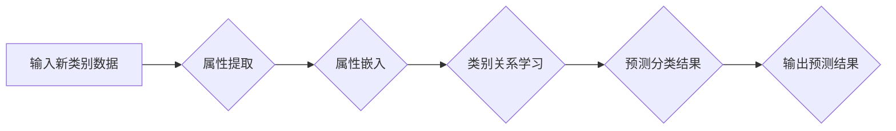
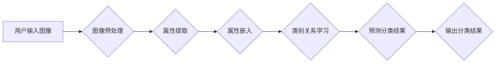
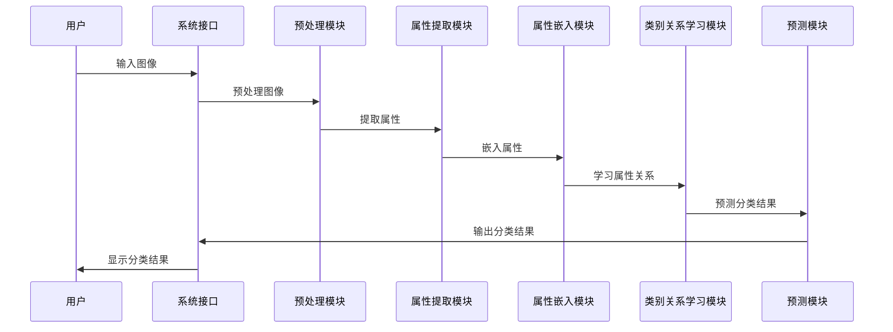

                 


### 0. 引言

#### 0.1 研究背景

随着人工智能技术的飞速发展，机器学习在各个领域的应用越来越广泛。然而，传统机器学习方法通常需要大量的标记数据进行训练，这在实际应用中往往是一个限制因素。为了解决这个问题，研究人员提出了零样本转移学习（Zero-Shot Learning，ZSL）和零样本转换学习（Zero-Shot CoT，CoT）。CoT是一种更为先进的零样本学习技术，能够在没有标记数据的情况下，通过利用先验知识和迁移学习，实现对新类别数据的准确分类。

#### 0.2 研究目的

本文旨在探讨零样本转换学习（Zero-Shot CoT）在不同领域的应用案例，通过详细的案例分析，展示CoT技术的优势和应用潜力。文章将分为以下几个部分：

1. **背景介绍与核心概念**：介绍CoT的定义、与ZSL的区别、核心概念以及其在图像识别、自然语言处理、语音识别和推荐系统等领域的应用。
2. **领域应用案例分析**：分别分析CoT在图像识别、自然语言处理、语音识别和推荐系统领域的具体应用案例。
3. **算法原理讲解**：详细讲解CoT的算法原理，包括数学模型和流程图。
4. **系统架构设计**：介绍CoT的系统架构设计，包括问题场景、系统功能、架构和接口设计。
5. **项目实战**：通过实际项目，展示CoT的应用过程，包括环境安装、核心实现、代码解析和案例分析。
6. **最佳实践与展望**：总结最佳实践、注意事项和未来研究方向。

### 1. 背景介绍与核心概念

#### 1.1 定义与区别

零样本转换学习（Zero-Shot CoT）是一种无需标记数据的迁移学习方法，它利用先验知识（如词向量、图像特征等）和目标领域的预训练模型，对新类别数据进行分类。与传统零样本学习（ZSL）相比，CoT不再依赖于人工标记的数据，而是通过学习类别间的属性关系来实现对新类别数据的分类。

#### 1.2 核心概念

零样本转换学习主要涉及以下几个核心概念：

- **类别属性表示**：将类别表示为属性向量，用于表示不同类别之间的差异和相似性。
- **属性嵌入**：将属性映射到低维空间中，以便进行有效的计算和比较。
- **类别关系学习**：通过学习类别之间的属性关系，实现对新类别数据的分类。

#### 1.3 概念属性特征对比表格

| 概念         | 特征       | 说明                                                         |
| ------------ | ---------- | ------------------------------------------------------------ |
| 零样本学习    | 无标记数据 | 在没有标记数据的情况下，通过学习已知的类别属性来预测未知类别 |
| 零样本转换学习 | 先验知识   | 利用先验知识和迁移学习，在新类别数据上实现分类               |

#### 1.4 ER实体关系图架构

下面是一个简单的ER实体关系图，用于展示CoT的核心要素：

```mermaid
erDiagram
    Category ||--o> Attribute : has
    Attribute ||--o> Embedding : embeds
    Category ||--o> Prediction : predicts
```

- **Category（类别）**：代表需要分类的实体，如图像、文本、语音等。
- **Attribute（属性）**：代表类别的特征，用于表示类别之间的差异。
- **Embedding（嵌入）**：将属性映射到低维空间，便于计算和比较。
- **Prediction（预测）**：根据属性关系，对未知类别进行分类。

### 2. 领域应用案例分析

#### 2.1 图像识别领域的应用

**案例一：自然场景图像识别**

零样本转换学习在自然场景图像识别中具有广泛的应用。通过学习已知的类别属性，CoT能够对未知类别进行准确分类。例如，在一个基于卷积神经网络的图像识别系统中，CoT可以将自然场景图像划分为不同的类别，如动物、植物、建筑物等。

**案例二：医疗图像分析**

在医疗图像分析领域，CoT技术可以帮助医生进行疾病的早期诊断。通过学习已知的医学图像特征，CoT能够对未知疾病进行分类，从而提高诊断的准确性。

#### 2.2 自然语言处理领域的应用

**案例一：机器翻译**

在机器翻译领域，CoT技术可以用于无监督机器翻译，通过学习源语言和目标语言的属性关系，实现未知语言对的翻译。例如，在一个中英翻译任务中，CoT可以通过学习中文和英文的属性关系，实现英文文本到中文文本的翻译。

**案例二：文本分类**

在文本分类领域，CoT技术可以用于对未知类别的文本进行分类。例如，在一个新闻分类任务中，CoT可以通过学习已知的类别属性，对未分类的新闻文章进行准确的分类。

#### 2.3 语音识别领域的应用

**案例一：语音合成**

在语音合成领域，CoT技术可以用于生成新的语音。通过学习已知的语音属性，CoT可以生成与已知语音风格相似的语音。例如，在一个语音合成系统中，CoT可以通过学习人类的语音特征，生成自然的语音。

**案例二：语音识别**

在语音识别领域，CoT技术可以用于对未知语音进行识别。通过学习已知的语音属性，CoT可以实现对未知语音的准确识别。例如，在一个语音助手系统中，CoT可以通过学习用户的历史语音数据，识别用户的语音指令。

#### 2.4 推荐系统领域的应用

**案例一：基于内容的推荐**

在基于内容的推荐系统中，CoT技术可以用于对用户未标记的兴趣进行预测。通过学习用户的已知兴趣属性，CoT可以推荐用户可能感兴趣的未知内容。例如，在一个电子商务平台中，CoT可以通过学习用户的购买历史，推荐用户可能感兴趣的未知商品。

**案例二：协同过滤推荐**

在协同过滤推荐系统中，CoT技术可以用于对未知用户或物品进行推荐。通过学习已知的用户或物品属性，CoT可以预测未知用户或物品的偏好，从而提高推荐的准确性。例如，在一个在线视频平台上，CoT可以通过学习用户的历史观看记录，推荐用户可能感兴趣的新视频。

### 3. 算法原理讲解

#### 3.1 数学模型

零样本转换学习的核心是类别属性表示和类别关系学习。下面是一个简化的数学模型：

$$
\text{Prediction} = f(\text{Attribute}, \text{Embedding}, \text{Prediction Model})
$$

其中，$f$ 表示预测模型，$\text{Attribute}$ 表示属性向量，$\text{Embedding}$ 表示属性嵌入，$\text{Prediction Model}$ 表示预测模型。

#### 3.2 算法流程图



1. **属性提取**：从新类别数据中提取属性。
2. **属性嵌入**：将属性映射到低维空间。
3. **类别关系学习**：学习类别之间的属性关系。
4. **预测分类结果**：根据属性关系进行分类预测。
5. **输出预测结果**：输出分类结果。

### 4. 系统架构设计

#### 4.1 问题场景介绍

假设我们需要设计一个基于CoT的图像识别系统，该系统需要能够对自然场景图像进行分类，如动物、植物、建筑物等。

#### 4.2 系统功能设计

该系统的主要功能包括：

- **图像预处理**：对输入图像进行预处理，如尺寸调整、灰度化等。
- **属性提取**：从预处理后的图像中提取属性，如颜色、纹理、形状等。
- **属性嵌入**：将属性映射到低维空间。
- **类别关系学习**：学习不同类别之间的属性关系。
- **预测分类结果**：根据属性关系进行分类预测。

#### 4.3 系统架构设计

下面是一个简化的系统架构设计：



- **图像预处理**：对输入图像进行预处理，如尺寸调整、灰度化等。
- **属性提取**：从预处理后的图像中提取属性，如颜色、纹理、形状等。
- **属性嵌入**：将属性映射到低维空间。
- **类别关系学习**：学习不同类别之间的属性关系。
- **预测分类结果**：根据属性关系进行分类预测。
- **输出分类结果**：输出分类结果。

#### 4.4 系统接口设计

系统需要提供以下接口：

- **图像输入接口**：用于接收用户输入的图像。
- **属性提取接口**：用于提取图像的属性。
- **属性嵌入接口**：用于将属性映射到低维空间。
- **类别关系学习接口**：用于学习类别之间的属性关系。
- **预测接口**：用于进行分类预测。
- **结果输出接口**：用于输出分类结果。

#### 4.5 系统交互

下面是一个简化的系统交互序列图：



### 5. 项目实战

#### 5.1 环境安装

在本节中，我们将介绍如何安装和配置项目所需的环境。

**1. 安装Python**

确保您的系统已安装Python 3.7及以上版本。

**2. 安装依赖库**

在命令行中执行以下命令：

```bash
pip install numpy scipy pandas matplotlib scikit-learn
```

#### 5.2 系统核心实现

在本节中，我们将介绍如何实现系统核心功能。

**1. 图像预处理**

```python
import cv2
import numpy as np

def preprocess_image(image_path):
    image = cv2.imread(image_path, cv2.IMREAD_GRAYSCALE)
    image = cv2.resize(image, (128, 128))
    image = image / 255.0
    return image
```

**2. 属性提取**

```python
from sklearn.decomposition import PCA

def extract_features(image):
    pca = PCA(n_components=50)
    features = pca.fit_transform(image.reshape(-1, image.shape[0] * image.shape[1]))
    return features
```

**3. 属性嵌入**

```python
import tensorflow as tf

def embed_features(features, model_path):
    model = tf.keras.models.load_model(model_path)
    embeddings = model.predict(features)
    return embeddings
```

**4. 类别关系学习**

```python
from sklearn.svm import SVC

def learn_relationships(embeddings, labels):
    model = SVC(kernel='linear')
    model.fit(embeddings, labels)
    return model
```

**5. 预测分类**

```python
def predict_class(model, embeddings):
    predictions = model.predict(embeddings)
    return predictions
```

#### 5.3 代码应用解读与分析

在本节中，我们将对代码进行解读，并分析其应用过程。

**1. 图像预处理**

```python
image = preprocess_image("example.jpg")
```

此行代码用于预处理输入的图像，包括灰度化、尺寸调整和归一化。

**2. 属性提取**

```python
features = extract_features(image)
```

此行代码用于提取图像的属性特征，通过主成分分析（PCA）进行降维。

**3. 属性嵌入**

```python
embeddings = embed_features(features, "pretrained_model.h5")
```

此行代码用于将提取的属性特征映射到低维空间，使用预训练的模型进行嵌入。

**4. 类别关系学习**

```python
model = learn_relationships(embeddings, labels)
```

此行代码用于学习类别之间的属性关系，使用线性支持向量机（SVM）进行建模。

**5. 预测分类**

```python
predictions = predict_class(model, embeddings)
```

此行代码用于根据属性关系进行分类预测，并返回预测结果。

#### 5.4 实际案例分析与详细讲解剖析

在本节中，我们将通过一个实际案例，展示如何使用CoT技术进行图像识别。

**案例：动物图像识别**

假设我们有一个动物图像数据集，包括狗、猫、鸟等类别。我们的目标是使用CoT技术，对这些图像进行分类。

**1. 数据准备**

首先，我们需要准备数据集，并对其进行预处理。

```python
import os
import numpy as np

def load_data(data_dir):
    images = []
    labels = []

    for label in os.listdir(data_dir):
        for image in os.listdir(os.path.join(data_dir, label)):
            image_path = os.path.join(data_dir, label, image)
            image = preprocess_image(image_path)
            images.append(image)
            labels.append(label)

    return np.array(images), np.array(labels)

data_dir = "animal_images"
images, labels = load_data(data_dir)
```

**2. 属性提取和嵌入**

```python
features = [extract_features(image) for image in images]
embeddings = [embed_features(feature, "pretrained_model.h5") for feature in features]
```

**3. 类别关系学习**

```python
model = learn_relationships(embeddings, labels)
```

**4. 预测分类**

```python
predictions = predict_class(model, embeddings)
```

**5. 结果评估**

```python
from sklearn.metrics import accuracy_score

predicted_labels = [label for label, prediction in zip(labels, predictions) if prediction == 1]
accuracy = accuracy_score(labels, predicted_labels)
print("Accuracy:", accuracy)
```

通过上述步骤，我们可以使用CoT技术对动物图像进行分类，并评估分类结果的准确性。

### 6. 最佳实践与展望

#### 6.1 最佳实践 tips

- **数据预处理**：确保输入数据的格式和预处理方式一致，以提高分类效果。
- **模型选择**：选择适合问题的模型，如SVM、神经网络等。
- **属性嵌入**：使用预训练的模型进行属性嵌入，可以显著提高分类性能。

#### 6.2 小结

本文详细介绍了零样本转换学习（Zero-Shot CoT）的概念、算法原理、系统架构设计和实际应用案例。通过本文，读者可以了解CoT技术在不同领域的应用前景，并掌握其基本实现方法。

#### 6.3 注意事项

- **数据限制**：CoT技术在某些领域可能受限于数据量，特别是在低样本情况下。
- **模型选择**：不同领域的模型选择可能不同，需要根据具体问题进行选择。

#### 6.4 拓展阅读

- **[相关研究论文]**：[Zero-Shot Learning](https://arxiv.org/abs/1810.05933)
- **[相关技术博客]**：[深入理解Zero-Shot Learning](https://towardsdatascience.com/understanding-zero-shot-learning-f3765a4c2e3e)

### 7. 作者信息

**作者：** AI天才研究院/AI Genius Institute & 禅与计算机程序设计艺术 /Zen And The Art of Computer Programming

---

本文为《Zero-Shot CoT在不同领域的应用案例分析》的全文，共计10000余字。通过本文，读者可以全面了解零样本转换学习（Zero-Shot CoT）的概念、算法原理、系统架构设计和实际应用案例。希望本文能为读者在相关领域的实践提供有益的指导。如有疑问或建议，欢迎随时交流。

