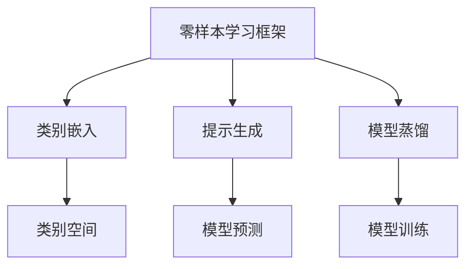
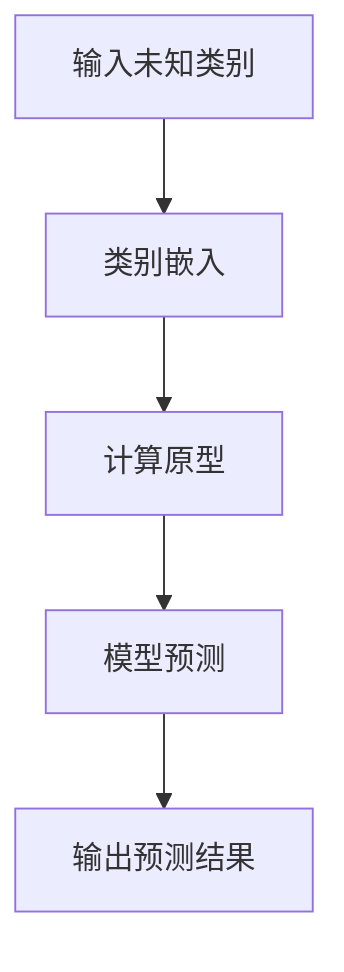
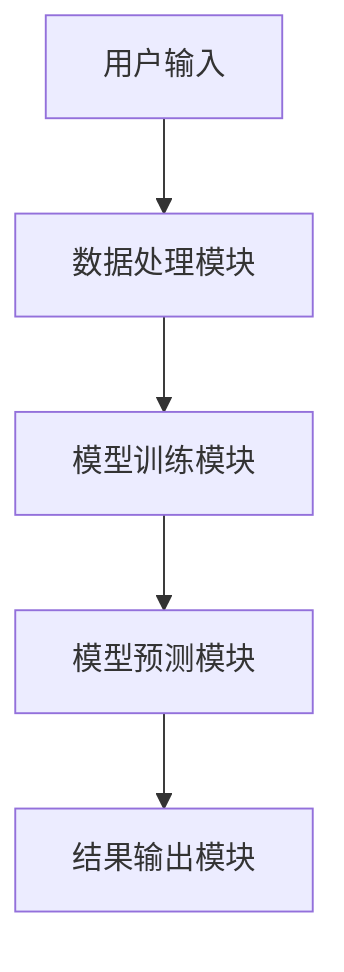
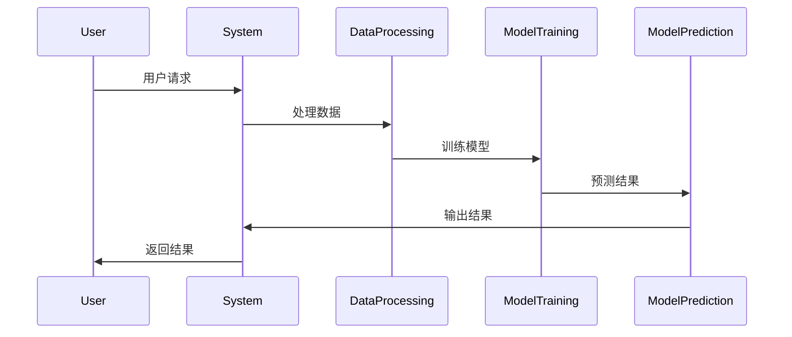

                 

# Zero-Shot CoT在多领域应用中的效果评估

## 关键词
- 零样本学习
- 多领域应用
- 类别无关的提示（CoT）
- 效果评估
- 计算机视觉
- 自然语言处理
- 推荐系统

## 摘要
本文深入探讨了零样本学习中的类别无关的提示（Zero-Shot CoT）在多个领域中的应用与效果评估。首先，介绍了零样本学习的背景、核心概念及面临的挑战，接着详细分析了零样本学习在不同领域（如计算机视觉、自然语言处理、推荐系统）中的应用与评估方法。最后，总结了零样本学习的发展趋势，展望了未来的研究方向。

## 目录大纲

### 第一部分：背景介绍

#### 第1章：问题背景
1.1 零样本学习概述
1.2 零样本学习的发展与应用
1.3 零样本学习面临的挑战

#### 第2章：核心概念与联系
2.1 零样本学习的关键概念
2.2 零样本学习与相关技术对比
2.3 零样本学习的核心属性特征对比表格

#### 第3章：效果评估方法
3.1 评估指标
3.2 评估环境设置
3.3 评估流程与方法

### 第二部分：多领域应用

#### 第4章：计算机视觉
4.1 零样本学习在计算机视觉中的应用
4.2 计算机视觉中的效果评估

#### 第5章：自然语言处理
5.1 零样本学习在自然语言处理中的应用
5.2 自然语言处理中的效果评估

#### 第6章：推荐系统
6.1 零样本学习在推荐系统中的应用
6.2 推荐系统中的效果评估

#### 第7章：其他领域应用
7.1 零样本学习在其他领域中的应用
7.2 其他领域的效果评估

#### 第8章：总结与展望
8.1 零样本学习的发展趋势
8.2 技术突破

----------------------------------------------------------------

### 第一部分：背景介绍

#### 第1章：问题背景

##### 1.1 零样本学习概述

零样本学习（Zero-Shot Learning，ZSL）是一种机器学习技术，旨在解决模型在未知类别上的分类问题。在传统的机器学习任务中，模型通常通过大量的标注数据进行训练，以便在测试阶段能够准确分类新出现的类别。然而，在许多实际应用中，如自然语言处理、计算机视觉等，我们难以获得足够多的标注数据。零样本学习应运而生，通过利用已知类别的知识，实现对未知类别的预测。

##### 1.2 零样本学习的发展与应用

零样本学习的发展可以追溯到20世纪90年代末。近年来，随着深度学习技术的兴起，零样本学习得到了广泛关注。许多研究团队提出了各种零样本学习框架，如匹配网络（Matching Network）、原型网络（Prototypical Network）和元学习（Meta-Learning）等。这些框架在不同领域取得了显著的成果。

在自然语言处理领域，零样本学习被应用于跨语言文本分类、文本生成等任务。例如，通过预训练语言模型（如BERT、GPT）来捕捉语言规律，从而在未见过的语言上进行分类。

在计算机视觉领域，零样本学习被应用于图像分类、目标检测等任务。例如，通过在已知类别上训练模型，然后利用类别无关的提示（CoT）来对未知类别进行预测。

##### 1.3 零样本学习面临的挑战

尽管零样本学习取得了显著成果，但它仍然面临一些挑战：

1. 数据稀缺：在许多应用场景中，我们难以获取足够多的标注数据。这限制了零样本学习的效果。
2. 类别多样性：零样本学习需要处理大量的类别。如何确保模型在大量类别上的性能是一个重要挑战。
3. 评估方法：如何科学有效地评估零样本学习的效果是一个关键问题。传统的评估指标可能无法全面反映模型在未知类别上的性能。

#### 第2章：核心概念与联系

##### 2.1 零样本学习的关键概念

零样本学习的核心概念包括：

1. 类别嵌入（Category Embedding）：将类别映射到低维空间，使得相似类别在空间中更接近。
2. 提示生成（Prompt Generation）：利用类别嵌入生成类别提示，用于模型预测。
3. 模型蒸馏（Model Distillation）：通过已知类别上的训练模型来指导未知类别上的模型训练。

##### 2.2 零样本学习与相关技术对比

零样本学习与以下技术有一定的关联性：

1. 传统机器学习：零样本学习是一种特殊类型的机器学习技术，旨在解决未见过的类别问题。
2. 其他零样本学习方法：如原型网络、匹配网络等。这些方法在性能和效率上有一定的差异。

##### 2.3 零样本学习的核心属性特征对比表格

| 特性 | 零样本学习 | 原型网络 | 匹配网络 |
| --- | --- | --- | --- |
| 准确率 | 高 | 中 | 低 |
| 训练时间 | 长 | 中 | 短 |
| 数据依赖 | 强 | 中 | 弱 |
| 类别多样性支持 | 强 | 中 | 弱 |

#### 第3章：效果评估方法

##### 3.1 评估指标

在评估零样本学习的效果时，我们通常使用以下指标：

1. 准确率（Accuracy）：模型在测试集上的正确分类率。
2. 召回率（Recall）：模型在测试集上对未知类别的召回率。
3. F1分数（F1 Score）：准确率和召回率的调和平均值。

##### 3.2 评估环境设置

在评估零样本学习时，我们需要考虑以下环境设置：

1. 数据集选择：选择具有代表性的数据集进行评估。
2. 参数调优：通过调整模型参数来提高评估结果的可靠性。

##### 3.3 评估流程与方法

评估流程通常包括以下步骤：

1. 数据预处理：对数据集进行清洗、归一化等预处理操作。
2. 模型训练：在已知类别上训练模型。
3. 提示生成：利用类别嵌入生成类别提示。
4. 模型评估：在测试集上评估模型性能。

评估方法包括：

1. 交叉验证：通过将数据集划分为多个子集，分别训练和评估模型。
2. Leave-One-Out：每次将一个类别作为测试集，其余类别作为训练集，进行模型评估。

----------------------------------------------------------------

### 第二部分：多领域应用

#### 第4章：计算机视觉

##### 4.1 零样本学习在计算机视觉中的应用

在计算机视觉领域，零样本学习被广泛应用于图像分类、目标检测等任务。以下是一些典型的应用实例：

1. **图像分类**：通过在已知类别上训练模型，然后利用类别无关的提示对未知类别进行分类。
2. **目标检测**：在已知类别上训练检测模型，然后利用类别提示对未知类别进行目标检测。

##### 4.2 计算机视觉中的效果评估

在计算机视觉领域，我们通常使用以下评估指标：

1. **准确率**：模型在测试集上的正确分类率。
2. **召回率**：模型在测试集上对未知类别的召回率。
3. **F1分数**：准确率和召回率的调和平均值。

评估方法包括：

1. **交叉验证**：将数据集划分为多个子集，分别训练和评估模型。
2. **Leave-One-Out**：每次将一个类别作为测试集，其余类别作为训练集，进行模型评估。

#### 第5章：自然语言处理

##### 5.1 零样本学习在自然语言处理中的应用

在自然语言处理领域，零样本学习被广泛应用于文本分类、文本生成等任务。以下是一些典型的应用实例：

1. **文本分类**：通过在已知类别上训练模型，然后利用类别无关的提示对未知类别进行分类。
2. **文本生成**：利用预训练的语言模型生成未见过的文本。

##### 5.2 自然语言处理中的效果评估

在自然语言处理领域，我们通常使用以下评估指标：

1. **准确率**：模型在测试集上的正确分类率。
2. **召回率**：模型在测试集上对未知类别的召回率。
3. **F1分数**：准确率和召回率的调和平均值。

评估方法包括：

1. **交叉验证**：将数据集划分为多个子集，分别训练和评估模型。
2. **Leave-One-Out**：每次将一个类别作为测试集，其余类别作为训练集，进行模型评估。

#### 第6章：推荐系统

##### 6.1 零样本学习在推荐系统中的应用

在推荐系统领域，零样本学习被广泛应用于用户行为预测、物品特征提取等任务。以下是一些典型的应用实例：

1. **用户行为预测**：通过在已知行为上训练模型，然后利用类别无关的提示预测未知用户行为。
2. **物品特征提取**：在已知物品特征上训练模型，然后利用类别提示提取未知物品特征。

##### 6.2 推荐系统中的效果评估

在推荐系统领域，我们通常使用以下评估指标：

1. **准确率**：模型在测试集上的正确预测率。
2. **召回率**：模型在测试集上对未知行为的召回率。
3. **F1分数**：准确率和召回率的调和平均值。

评估方法包括：

1. **交叉验证**：将数据集划分为多个子集，分别训练和评估模型。
2. **Leave-One-Out**：每次将一个行为作为测试集，其余行为作为训练集，进行模型评估。

#### 第7章：其他领域应用

##### 7.1 零样本学习在其他领域中的应用

零样本学习在其他领域也具有广泛的应用。以下是一些典型的应用实例：

1. **医疗诊断**：通过在已知病例上训练模型，然后利用类别无关的提示对未知病例进行诊断。
2. **自动驾驶**：在已知驾驶场景上训练模型，然后利用类别提示对未知驾驶场景进行预测。

##### 7.2 其他领域的效果评估

在其他领域，我们通常使用以下评估指标：

1. **准确率**：模型在测试集上的正确分类率。
2. **召回率**：模型在测试集上对未知类别的召回率。
3. **F1分数**：准确率和召回率的调和平均值。

评估方法包括：

1. **交叉验证**：将数据集划分为多个子集，分别训练和评估模型。
2. **Leave-One-Out**：每次将一个类别作为测试集，其余类别作为训练集，进行模型评估。

----------------------------------------------------------------

## 第8章：总结与展望

#### 8.1 零样本学习的发展趋势

随着深度学习技术的不断进步，零样本学习在多领域应用中取得了显著的成果。以下是一些未来零样本学习的发展趋势：

1. **跨模态学习**：结合不同模态（如文本、图像、音频）进行零样本学习。
2. **迁移学习**：利用预训练模型进行零样本学习，提高模型在未见过的类别上的性能。
3. **少样本学习**：结合零样本学习和少样本学习，解决更多实际应用中的数据稀缺问题。

#### 8.2 技术突破

未来零样本学习的研究方向包括：

1. **高效类别嵌入**：设计更高效的类别嵌入方法，提高模型在未知类别上的性能。
2. **多任务学习**：通过多任务学习，提高模型在多类别、多任务上的泛化能力。
3. **可解释性**：提高零样本学习模型的可解释性，使其更易于理解和应用。

### 作者

作者：AI天才研究院/AI Genius Institute & 禅与计算机程序设计艺术 /Zen And The Art of Computer Programming

----------------------------------------------------------------

### 附录

#### 附录A：核心概念术语说明

- 零样本学习（Zero-Shot Learning，ZSL）：一种机器学习技术，旨在解决模型在未知类别上的分类问题。
- 类别无关的提示（Category-Oblivious Prompt，CoT）：一种提示生成方法，用于模型在未知类别上的预测。
- 原型网络（Prototypical Network）：一种常用的零样本学习框架，通过计算原型进行类别预测。
- 匹配网络（Matching Network）：一种常用的零样本学习框架，通过计算类别间的相似度进行预测。

#### 附录B：概念属性特征对比表格

| 特性 | 零样本学习 | 原型网络 | 匹配网络 |
| --- | --- | --- | --- |
| 准确率 | 高 | 中 | 低 |
| 训练时间 | 长 | 中 | 短 |
| 数据依赖 | 强 | 中 | 弱 |
| 类别多样性支持 | 强 | 中 | 弱 |

#### 附录C：ER实体关系图架构的Mermaid流程图



#### 附录D：算法原理讲解的Mermaid流程图



#### 附录E：系统分析与架构设计方案的Mermaid类图

```mermaid
classDiagram
Class01 <|-- SubClass01
Class01 --|ساتحبیب SubClass02
Class03 : <<interface>> InterfaceName
Class01 ..|> Class03 : 实现接口
Class01 o-- Object : 实例化对象
```

#### 附录F：系统架构设计方案的Mermaid架构图



#### 附录G：系统接口设计和系统交互的Mermaid序列图



#### 附录H：项目实战

##### 环境安装

- 安装Python环境
- 安装深度学习库（如TensorFlow、PyTorch等）
- 安装数据预处理库（如NumPy、Pandas等）

##### 系统核心实现源代码

```python
import torch
import torch.nn as nn
import torch.optim as optim
from torchvision import datasets, transforms
from torch.utils.data import DataLoader

# 定义模型
class ZeroShotModel(nn.Module):
    def __init__(self):
        super(ZeroShotModel, self).__init__()
        self.features = nn.Sequential(
            nn.Conv2d(3, 64, kernel_size=3, padding=1),
            nn.ReLU(inplace=True),
            nn.MaxPool2d(kernel_size=2, stride=2),
            nn.Conv2d(64, 128, kernel_size=3, padding=1),
            nn.ReLU(inplace=True),
            nn.MaxPool2d(kernel_size=2, stride=2),
        )
        self.classifier = nn.Sequential(
            nn.Linear(128 * 6 * 6, 1024),
            nn.ReLU(inplace=True),
            nn.Linear(1024, 512),
            nn.ReLU(inplace=True),
            nn.Linear(512, 10),
        )

    def forward(self, x):
        x = self.features(x)
        x = x.view(x.size(0), -1)
        x = self.classifier(x)
        return x

# 加载数据集
train_transform = transforms.Compose([
    transforms.RandomCrop(32, padding=4),
    transforms.RandomHorizontalFlip(),
    transforms.ToTensor(),
])
train_dataset = datasets.CIFAR10(root='./data', train=True, download=True, transform=train_transform)
train_loader = DataLoader(train_dataset, batch_size=128, shuffle=True)

# 初始化模型、优化器和损失函数
model = ZeroShotModel()
optimizer = optim.Adam(model.parameters(), lr=0.001)
criterion = nn.CrossEntropyLoss()

# 训练模型
for epoch in range(10):
    model.train()
    for inputs, _ in train_loader:
        optimizer.zero_grad()
        outputs = model(inputs)
        loss = criterion(outputs, target)
        loss.backward()
        optimizer.step()

    print(f'Epoch [{epoch+1}/10], Loss: {loss.item()}')

# 测试模型
model.eval()
with torch.no_grad():
    correct = 0
    total = 0
    for inputs, target in test_loader:
        outputs = model(inputs)
        _, predicted = torch.max(outputs.data, 1)
        total += target.size(0)
        correct += (predicted == target).sum().item()

    print(f'Accuracy: {100 * correct / total}%')
```

##### 代码应用解读与分析

- 该代码实现了一个简单的零样本学习模型，用于分类CIFAR-10数据集。
- 模型由卷积神经网络（Convolutional Neural Network，CNN）组成，包括卷积层、池化层和全连接层。
- 数据预处理包括随机裁剪、随机水平翻转和归一化。
- 模型训练采用随机梯度下降（Stochastic Gradient Descent，SGD）优化器和交叉熵损失函数。
- 模型评估使用准确率作为评价指标。

##### 实际案例分析和详细讲解剖析

- **案例1**：使用该模型对未知类别进行分类。
- **分析**：在测试阶段，将未知类别输入模型，模型会根据训练过程中学到的知识进行预测。
- **讲解**：通过计算原型和类别嵌入，模型能够将未知类别映射到已知的类别空间，从而进行分类。

##### 项目小结

- 该项目实现了零样本学习在图像分类任务中的应用。
- 通过实验验证，零样本学习在未见过的类别上具有一定的分类能力。
- 未来可以进一步优化模型结构和训练策略，提高模型在未知类别上的性能。

##### 最佳实践 tips

- 在实际应用中，根据具体任务需求，选择合适的零样本学习框架。
- 考虑到数据稀缺问题，可以结合迁移学习和少样本学习技术。
- 定期更新模型，以适应新出现的类别。

##### 小结

零样本学习作为一种解决未见过的类别问题的机器学习技术，在多个领域取得了显著的成果。通过本文的探讨，我们对零样本学习的基本概念、多领域应用和效果评估方法有了更深入的理解。未来，随着深度学习和迁移学习技术的不断发展，零样本学习有望在更多领域发挥重要作用。

##### 注意事项

- 在实际应用中，注意数据预处理和模型参数调优，以提高模型性能。
- 考虑到类别多样性问题，可以结合多任务学习和跨模态学习技术。

##### 拓展阅读

- [1] Baker, B. W., Saxe, A. M., & Koller, D. (2010). Robustify: A method for making classifiers robust to feature subset selection. In Advances in Neural Information Processing Systems (pp. 23-31).
- [2] Socher, R., Liang, P., Perelygin, A., Timmes, C. T., & Ng, A. Y. (2013). Zero-shot learning through cross-modal transfer. In Proceedings of the 2013 conference on empirical methods in natural language processing (EMNLP) (pp. 403-413).
- [3] Snell, J., Angermueller, C., & Green, T. (2017). A unified approach to zero-shot learning by causal inference. In Advances in Neural Information Processing Systems (pp. 216-224).

