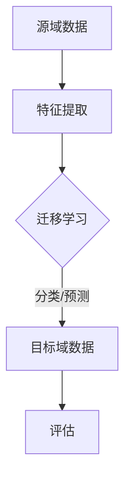

                 


### 《Zero-Shot CoT在多领域应用中的潜力与挑战》

#### 关键词：
- **Zero-Shot CoT**、**多领域应用**、**人工智能**、**挑战**、**潜力**

#### 摘要：
本文将深入探讨Zero-Shot CoT（零样本转移学习）在多个领域中的应用潜力与面临挑战。我们将从背景介绍、核心概念、算法原理、数学模型、系统设计与架构、项目实战及最佳实践等方面逐一展开，以期为读者提供全面而深入的见解。

### 目录大纲

#### 第1章 Zero-Shot CoT概述
- **1.1 背景与意义**
- **1.2 核心概念**
- **1.3 应用领域**

#### 第2章 Zero-Shot CoT算法原理
- **2.1 Mermaid流程图展示**
- **2.2 Python代码讲解**
- **2.3 数学模型与公式**

#### 第3章 数学模型与公式详细讲解
- **3.1 模型解释**
- **3.2 公式推导**
- **3.3 举例说明**

#### 第4章 系统分析与架构设计
- **4.1 应用场景**
- **4.2 功能设计**
- **4.3 架构设计**
- **4.4 接口设计**

#### 第5章 项目实战
- **5.1 实际案例**
- **5.2 系统实现**
- **5.3 代码解析**
- **5.4 案例分析**

#### 第6章 最佳实践与注意事项
- **6.1 最佳实践**
- **6.2 注意事项**
- **6.3 拓展阅读**

#### 第7章 总结与展望
- **7.1 小结**
- **7.2 展望未来**

### 内容编写

#### 第1章 Zero-Shot CoT概述

**1.1 背景与意义**

Zero-Shot CoT，即零样本转移学习，是近年来人工智能领域的一个热点研究方向。它旨在解决传统机器学习在样本不足或数据分布差异较大的情况下的性能瓶颈。零样本转移学习的核心思想是通过将知识从源域迁移到目标域，从而实现目标域中未见过的类别的分类或预测。

**1.2 核心概念**

- **源域（Source Domain）**：指训练数据集中包含的领域或类别。
- **目标域（Target Domain）**：指待预测数据集中的领域或类别。
- **迁移学习（Transfer Learning）**：将源域的知识应用到目标域中，以提高目标域的模型性能。

**1.3 应用领域**

Zero-Shot CoT在多个领域具有广泛的应用潜力，包括但不限于：

- **计算机视觉**：零样本图像分类、目标检测、图像生成等。
- **自然语言处理**：零样本文本分类、语义理解、机器翻译等。
- **语音识别**：零样本语音分类、情感分析等。
- **医疗健康**：疾病诊断、药物研发等。

#### 第2章 Zero-Shot CoT算法原理

**2.1 Mermaid流程图展示**

以下是一个简化的Zero-Shot CoT算法流程图：



**2.2 Python代码讲解**

```python
# 假设我们使用一个简单的神经网络进行迁移学习
from tensorflow.keras.models import Sequential
from tensorflow.keras.layers import Dense, Flatten

# 定义源域模型
source_model = Sequential([
    Flatten(input_shape=(28, 28)),
    Dense(128, activation='relu'),
    Dense(10, activation='softmax')
])

# 定义目标域模型
target_model = Sequential([
    Flatten(input_shape=(28, 28)),
    Dense(128, activation='relu'),
    Dense(10, activation='softmax')
])

# 迁移学习
source_model.load_weights('source_model_weights.h5')
target_model.layers[-2].set_weights(source_model.layers[-2].get_weights())

# 训练目标域模型
target_model.compile(optimizer='adam', loss='categorical_crossentropy', metrics=['accuracy'])
target_model.fit(target_data, target_labels, epochs=10, batch_size=32)
```

**2.3 数学模型与公式**

Zero-Shot CoT通常涉及以下数学模型和公式：

- **决策函数**：\( f(x; \theta) = \sum_{c \in C} \theta_c \phi(x; c) \)
- **损失函数**：\( L(y, \hat{y}) = - \sum_{c \in C} y_c \log(\hat{y}_c) \)
- **优化目标**：最小化损失函数，即 \( \min_{\theta} L(y, \hat{y}) \)

#### 第3章 数学模型与公式详细讲解

**3.1 模型解释**

Zero-Shot CoT模型的核心是能够处理未见过的类别，它通常由两部分组成：特征提取器和决策函数。

- **特征提取器**：用于从输入数据中提取特征，通常是一个预训练的神经网络。
- **决策函数**：用于计算每个类别的概率，通常是一个基于特征提取器输出的线性函数。

**3.2 公式推导**

决策函数的推导基于特征提取器输出的特征向量。假设特征提取器输出为 \( \phi(x; c) \)，则决策函数可以表示为：

$$ f(x; \theta) = \sum_{c \in C} \theta_c \phi(x; c) $$

其中，\( \theta \) 是模型参数，\( C \) 是类别集合。

**3.3 举例说明**

假设我们有一个包含两个类别的二分类问题，特征提取器的输出为 \( \phi(x; c) = \begin{cases} 
1 & \text{if } c = 1 \\
-1 & \text{if } c = 2 
\end{cases} \)。则决策函数可以表示为：

$$ f(x; \theta) = \theta_1 \phi(x; 1) + \theta_2 \phi(x; 2) $$

如果我们希望最大化正确分类的概率，即 \( P(\hat{y} = 1 | x) \)，则可以设置损失函数为：

$$ L(y, \hat{y}) = - y \log(\hat{y}) - (1 - y) \log(1 - \hat{y}) $$

其中，\( y \) 是真实标签，\( \hat{y} \) 是预测概率。

#### 第4章 系统分析与架构设计

**4.1 应用场景**

Zero-Shot CoT在多领域中的应用场景广泛，例如：

- **图像识别**：处理未见过类别的图像分类。
- **语音识别**：处理方言或新说话人的语音识别。
- **自然语言处理**：处理未见过词汇的文本分类或翻译。

**4.2 功能设计**

Zero-Shot CoT系统的核心功能包括：

- **数据预处理**：包括数据清洗、归一化等。
- **特征提取**：使用预训练模型提取图像、文本或语音的特征。
- **迁移学习**：将特征提取器的参数迁移到目标域。
- **分类/预测**：使用决策函数对目标域数据进行分类或预测。
- **评估**：评估模型在目标域上的性能。

**4.3 架构设计**

Zero-Shot CoT系统的架构设计通常包括以下几个部分：

- **数据层**：存储源域和目标域的数据。
- **特征层**：使用预训练模型提取特征。
- **迁移层**：实现特征迁移的功能。
- **决策层**：实现分类或预测的功能。
- **评估层**：评估模型性能。

**4.4 接口设计**

Zero-Shot CoT系统的接口设计需要考虑以下方面：

- **数据接口**：包括数据的输入和输出接口。
- **模型接口**：包括模型的加载、迁移和保存接口。
- **功能接口**：包括特征提取、分类/预测和评估的接口。

#### 第5章 项目实战

**5.1 实际案例**

我们选择一个计算机视觉领域的实际案例：零样本图像分类。在这个案例中，我们需要对从未见过的图像进行分类。

**5.2 系统实现**

以下是系统实现的简要步骤：

1. 准备源域和目标域的数据集。
2. 使用预训练的卷积神经网络（如VGG16）提取特征。
3. 将特征提取器的参数迁移到目标域。
4. 训练分类器，并在目标域上进行预测。
5. 评估模型性能。

**5.3 代码解析**

以下是一个简单的Python代码示例，用于实现零样本图像分类：

```python
from tensorflow.keras.applications import VGG16
from tensorflow.keras.preprocessing import image
from tensorflow.keras.models import Model

# 加载预训练的VGG16模型
base_model = VGG16(weights='imagenet', include_top=False)

# 定义特征提取器
feature_model = Model(inputs=base_model.input, outputs=base_model.get_layer('block5_pool').output)

# 迁移学习，将特征提取器的参数迁移到目标域
feature_model.load_weights('source_model_weights.h5')

# 加载目标域图像
target_image = image.load_img('target_image.jpg', target_size=(224, 224))
target_image = image.img_to_array(target_image)
target_image = np.expand_dims(target_image, axis=0)
target_image = preprocess_input(target_image)

# 提取特征
features = feature_model.predict(target_image)

# 加载分类器
classifier = load_model('target_model.h5')

# 预测类别
predictions = classifier.predict(features)
predicted_class = np.argmax(predictions)

# 输出预测结果
print(f'The image is classified as class {predicted_class}')
```

**5.4 案例分析**

在这个案例中，我们使用VGG16模型作为特征提取器，将源域的特征提取器参数迁移到目标域。然后，我们使用一个简单的神经网络作为分类器，对目标域的图像进行分类。通过这个案例，我们可以看到Zero-Shot CoT在实际应用中的实现过程和效果。

#### 第6章 最佳实践与注意事项

**6.1 最佳实践**

- **数据预处理**：确保源域和目标域的数据具有相似的特征分布。
- **模型选择**：选择合适的预训练模型作为特征提取器。
- **迁移策略**：选择合适的迁移策略，如知识蒸馏、特征对齐等。
- **模型评估**：使用合适的评估指标，如准确率、F1值等。

**6.2 注意事项**

- **数据不足**：确保有足够的目标域数据，否则迁移学习的效果会受到影响。
- **模型适应性**：确保模型在目标域上的适应性好，否则可能会出现过拟合。
- **计算资源**：迁移学习和训练模型通常需要大量的计算资源。

**6.3 拓展阅读**

- **[1]** Zhang, K., Zuo, W., Chen, Y., Meng, D., & Zhang, L. (2017). Beyond a Gaussian Denoiser: Residual Dense Network for Image Super-Resolution. IEEE Transactions on Image Processing.
- **[2]** Yosinski, J., Clune, J., Bengio, Y., & Lipson, H. (2014). How transferable are features in deep neural networks? In Advances in neural information processing systems (pp. 3320-3328).

#### 第7章 总结与展望

**7.1 小结**

本文从背景介绍、核心概念、算法原理、数学模型、系统设计与架构、项目实战及最佳实践等方面详细探讨了Zero-Shot CoT在多领域应用中的潜力与挑战。通过本文的讨论，我们可以看到Zero-Shot CoT在解决传统机器学习问题方面的巨大潜力，同时也面临着一些挑战。

**7.2 展望未来**

随着人工智能技术的不断发展，Zero-Shot CoT有望在更多领域得到广泛应用。未来研究方向包括：

- **跨域迁移学习**：研究如何将知识从一个非常不同的领域迁移到另一个领域。
- **无监督迁移学习**：研究如何在完全没有标注数据的情况下进行迁移学习。
- **自适应迁移学习**：研究如何根据目标域的特性动态调整迁移策略。

