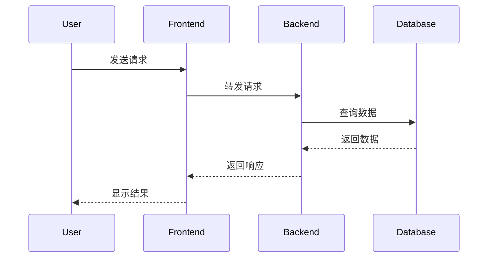
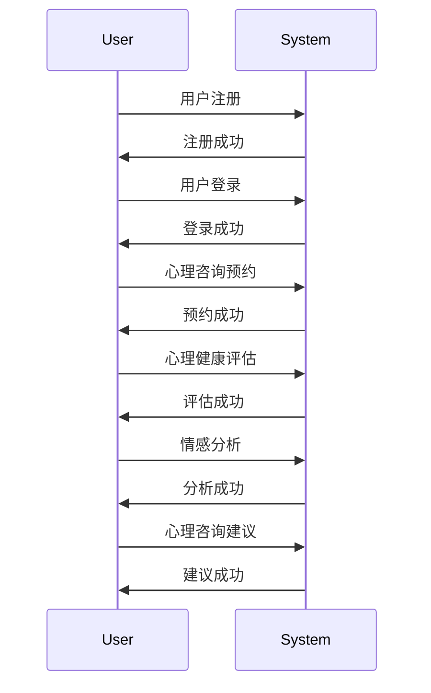
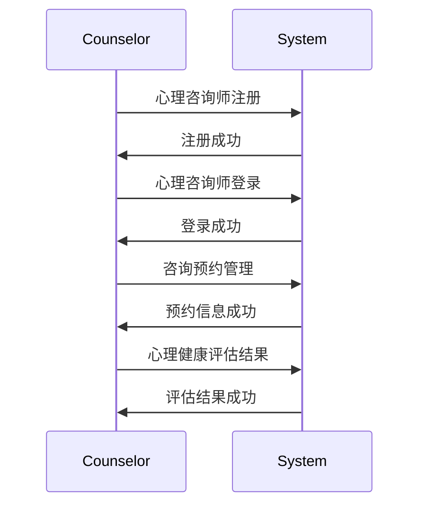

                 

# 零射击CoT在心理咨询AI中的潜力探索

## 关键词
- 零射击CoT
- 心理咨询AI
- 数据预处理
- 数学模型
- 系统设计与实现

## 摘要
随着人工智能技术的快速发展，心理咨询AI领域受到了越来越多的关注。本文旨在探讨零射击CoT（零射击核心论点传输）在心理咨询AI中的应用潜力。首先，本文介绍了心理咨询AI的发展现状、需求与挑战，并对比了传统CoT和零射击CoT的概念与特点。接着，本文详细阐述了零射击CoT在心理咨询AI中的应用场景、优势与挑战，以及其适用范围和未来发展方向。随后，本文深入剖析了零射击CoT的原理与属性特征，包括其工作流程、与传统CoT的对比，以及ER实体关系图。在算法原理与数学模型部分，本文介绍了零射击CoT的基本数学公式、算法框架和优化算法，并通过源代码解读和举例详细讲解了算法原理。此外，本文还介绍了心理咨询AI系统的设计，包括系统功能、架构设计、接口设计和系统交互。最后，本文通过实战案例分析了系统的核心实现与部署，并提出了最佳实践建议和小结。

### 第一部分：背景与核心概念

#### 第1章：问题背景与核心概念

##### 1.1.1 问题背景

心理咨询AI是利用人工智能技术来提供心理咨询服务的一种新兴方式。随着心理健康问题的日益突出，心理咨询AI在提高服务效率、降低服务成本、满足多样化需求等方面具有显著优势。然而，心理咨询AI在实际应用中仍面临诸多挑战，如数据不足、隐私保护、模型泛化能力等。为了解决这些问题，引入零射击CoT成为一种潜在的解决方案。

##### 1.1.1.1 心理咨询AI的发展现状

心理咨询AI的发展可以从技术层面和应用层面进行探讨。在技术层面，深度学习、自然语言处理、知识图谱等技术逐渐应用于心理咨询AI，提高了服务的准确性和个性化水平。在应用层面，心理咨询AI已经在在线心理测评、情感分析、心理干预等方面取得了初步成果。然而，现有的心理咨询AI系统仍存在许多局限，如对复杂情感和语言的理解能力不足，对个性化需求的响应能力有限等。

##### 1.1.1.2 心理咨询AI的需求与挑战

心理咨询AI的需求主要集中在以下几个方面：

1. **个性化服务**：用户的心理健康需求多样化，心理咨询AI需要能够根据用户的具体情况进行个性化推荐和干预。
2. **实时响应**：心理健康问题往往需要及时干预，心理咨询AI需要能够快速响应并给出建议。
3. **隐私保护**：心理咨询涉及到用户的敏感信息，如何确保数据安全和隐私保护是心理咨询AI面临的重大挑战。

心理咨询AI面临的挑战包括：

1. **数据不足**：高质量、标注完善的心理健康数据相对较少，限制了模型的训练和优化。
2. **隐私保护**：如何平衡数据隐私保护和模型性能是一个亟待解决的问题。
3. **模型泛化能力**：现有的心理咨询AI模型在特定场景下的表现较好，但在不同场景下的泛化能力有限。

##### 1.1.1.3 零射击CoT的概念与潜力

零射击CoT（Zero-Shot Core Theory Transfer）是一种无需预先标注或大量训练数据即可进行跨域知识迁移的机器学习技术。它利用预先训练好的模型，通过理解文本语义和知识图谱，实现零射击的推理和决策。零射击CoT在心理咨询AI中的应用潜力主要体现在以下几个方面：

1. **跨域迁移**：零射击CoT可以将在其他领域（如新闻、产品评论等）预训练的模型应用于心理咨询AI，实现跨领域的知识迁移。
2. **数据节约**：零射击CoT减少了心理咨询AI对大规模训练数据的依赖，有助于解决数据不足的问题。
3. **隐私保护**：零射击CoT通过减少对用户数据的直接使用，有助于保护用户隐私。
4. **个性化服务**：零射击CoT可以根据用户的个性化需求，提供更加精准的心理咨询建议。

##### 1.1.2 核心概念

###### 1.1.2.1 零射击CoT的定义

零射击CoT（Zero-Shot Core Theory Transfer）是一种基于预训练模型的跨域知识迁移技术，通过理解文本语义和知识图谱，实现零射击的推理和决策。它不需要对特定领域进行专门的标注或训练，而是利用预训练模型在多个领域的知识积累，实现跨领域的知识共享和迁移。

###### 1.1.2.2 零射击CoT的特点

零射击CoT具有以下几个显著特点：

1. **跨域迁移**：零射击CoT可以将预训练模型在不同领域之间的知识进行迁移，实现跨领域的应用。
2. **数据节约**：零射击CoT减少了心理咨询AI对大规模训练数据的依赖，降低了数据获取和标注的成本。
3. **隐私保护**：零射击CoT通过减少对用户数据的直接使用，有助于保护用户隐私。
4. **适应性**：零射击CoT可以根据不同场景的需求，动态调整和优化模型，提高模型的应用效果。

###### 1.1.2.3 零射击CoT与传统CoT的区别

传统CoT（Core Theory Transfer）是一种基于已有领域知识的迁移学习技术，它需要对目标领域进行专门的标注和训练。与传统CoT相比，零射击CoT具有以下区别：

1. **数据依赖**：传统CoT需要大规模的标注数据，而零射击CoT对训练数据的依赖较低。
2. **迁移能力**：零射击CoT具有较强的跨域迁移能力，可以在多个领域之间实现知识共享，而传统CoT的迁移能力相对有限。
3. **隐私保护**：零射击CoT通过减少对用户数据的直接使用，有助于保护用户隐私，而传统CoT在数据处理过程中可能涉及更多用户数据。
4. **适应性**：零射击CoT可以根据不同场景的需求，动态调整和优化模型，提高模型的应用效果，而传统CoT在模型适应性方面相对较弱。

##### 1.1.3 零射击CoT在心理咨询AI中的潜在应用

###### 1.1.3.1 零射击CoT在心理咨询AI中的应用场景

零射击CoT在心理咨询AI中具有广泛的应用场景，主要包括以下几个方面：

1. **情感分析**：通过分析用户的语言表达，识别用户的情绪状态，提供针对性的情感支持和干预。
2. **心理健康评估**：根据用户的语言和行为特征，评估用户的心理健康状态，为用户提供个性化的心理健康建议。
3. **心理咨询建议生成**：根据用户的需求和咨询历史，生成针对性的心理咨询建议，提高咨询的精准性和有效性。
4. **跨领域知识迁移**：利用零射击CoT的跨域迁移能力，将其他领域（如医学、心理学）的知识应用于心理咨询AI，提高咨询服务的多样性和专业性。

###### 1.1.3.2 零射击CoT的优势与挑战

零射击CoT在心理咨询AI中具有以下优势：

1. **数据节约**：减少了心理咨询AI对大规模训练数据的依赖，降低了数据获取和标注的成本。
2. **隐私保护**：通过减少对用户数据的直接使用，有助于保护用户隐私。
3. **个性化服务**：可以根据用户的个性化需求，提供更加精准的心理咨询建议。

然而，零射击CoT在心理咨询AI中也面临一些挑战：

1. **模型泛化能力**：零射击CoT在跨域迁移过程中可能面临模型泛化能力不足的问题，需要进一步优化模型结构和算法。
2. **知识一致性**：跨领域知识迁移可能导致知识不一致性，影响咨询服务的准确性和有效性。
3. **用户接受度**：用户对心理咨询AI的接受度可能受到零射击CoT技术原理的限制，需要加强对用户的宣传和引导。

##### 1.1.4 零射击CoT的应用边界与外延

###### 1.1.4.1 零射击CoT的适用范围

零射击CoT适用于心理咨询AI中的多种场景，包括情感分析、心理健康评估、心理咨询建议生成等。具体适用范围如下：

1. **情感分析**：应用于社交媒体、在线聊天等场景，识别用户的情绪状态，提供情感支持和干预。
2. **心理健康评估**：应用于医院、诊所等场景，为患者提供心理健康评估和干预建议。
3. **心理咨询建议生成**：应用于在线心理咨询平台，为用户提供个性化的心理咨询建议。

###### 1.1.4.2 零射击CoT的未来发展方向

零射击CoT在心理咨询AI领域的未来发展方向主要包括以下几个方面：

1. **模型优化**：通过改进模型结构和算法，提高模型的泛化能力和知识一致性。
2. **数据共享**：建立心理咨询领域的知识图谱和数据共享平台，为零射击CoT提供丰富的知识资源和数据支持。
3. **用户体验**：优化用户界面和交互体验，提高用户对心理咨询AI的接受度和满意度。
4. **跨领域合作**：与其他领域（如医学、心理学）进行合作，共享知识和资源，推动心理咨询AI的全面发展。

##### 1.1.5 本章小结

本章介绍了心理咨询AI的发展现状、需求与挑战，以及零射击CoT的概念与潜力。通过对比传统CoT和零射击CoT，分析了零射击CoT在心理咨询AI中的应用场景、优势与挑战，以及其适用范围和未来发展方向。本章为后续章节的深入探讨奠定了基础。

### 第二部分：核心概念与联系

#### 第2章：零射击CoT原理与属性特征

##### 2.1 零射击CoT原理

零射击CoT（Zero-Shot Core Theory Transfer）是一种基于预训练模型的跨域知识迁移技术，其核心思想是通过理解文本语义和知识图谱，实现零射击的推理和决策。零射击CoT的工作流程主要包括数据预处理、模型训练和模型部署与推理三个阶段。

###### 2.1.1.1 数据预处理

数据预处理是零射击CoT的基础，主要包括以下几个步骤：

1. **数据收集**：从多个来源（如社交媒体、在线聊天记录、心理健康数据库等）收集文本数据。
2. **数据清洗**：去除无关信息，如HTML标签、特殊字符等，确保文本数据的质量和一致性。
3. **数据标注**：对于特定的应用场景，如情感分析或心理健康评估，需要对文本数据进行标注。标注过程可以采用半监督学习或人工标注的方式。

###### 2.1.1.2 模型训练

模型训练是零射击CoT的核心，通过预训练模型在不同领域的知识积累，实现跨领域的知识迁移。模型训练的主要步骤如下：

1. **模型选择**：选择合适的预训练模型，如BERT、GPT等。这些模型已经在多个领域进行了预训练，具有较好的跨域迁移能力。
2. **特征提取**：通过预训练模型对文本数据进行编码，提取文本的语义特征。特征提取的过程可以通过全局平均池化或句子级分类来实现。
3. **模型优化**：利用标注数据对模型进行优化，提高模型在特定领域的性能。模型优化可以采用微调或增量学习的方式。

###### 2.1.1.3 模型部署与推理

模型部署与推理是零射击CoT的实际应用阶段，主要包括以下几个步骤：

1. **模型部署**：将训练好的模型部署到服务器或云端，以供实际应用。模型部署可以采用API接口或嵌入式系统的方式。
2. **输入处理**：对用户的输入（如文本或语音）进行预处理，提取语义特征。
3. **推理过程**：利用部署好的模型对预处理后的输入进行推理，生成预测结果。推理过程可以通过前向传播和后向传播来实现。

##### 2.2 零射击CoT属性特征对比

零射击CoT与传统CoT在属性特征上存在显著差异，以下是对比表格：

| 特征       | 零射击CoT                  | 传统CoT                  |
| ---------- | -------------------------- | ------------------------ |
| 数据依赖   | 低，不需要大规模标注数据   | 高，需要大规模标注数据   |
| 迁移能力   | 强，跨领域知识迁移         | 弱，领域特定知识迁移     |
| 隐私保护   | 高，减少用户数据使用       | 低，可能涉及用户数据     |
| 适应性     | 高，根据场景动态调整模型   | 低，模型适应性有限       |
| 泛化能力   | 中等，跨域迁移能力有限     | 高，领域内泛化能力强     |

通过对比可以发现，零射击CoT在数据依赖、迁移能力、隐私保护和适应性方面具有明显优势，但在泛化能力和领域特定知识迁移方面相对较弱。

##### 2.3 零射击CoT的ER实体关系图

ER（Entity-Relationship）实体关系图是描述零射击CoT中实体及其关系的图形化表示。以下是一个简单的ER实体关系图：

```mermaid
erDiagram
    User ||--o { Counselor }
    User ||--o { ChatRecord }
    Counselor ||--o { Consultation }
    ChatRecord ||--o { Sentiment }
    Consultation ||--o { Recommendation }
```

实体定义：

- **User**：表示用户，包括用户基本信息和咨询历史。
- **Counselor**：表示心理咨询师，包括心理咨询师的基本信息和咨询经验。
- **ChatRecord**：表示用户与心理咨询师的聊天记录，包括文本内容和情感分析结果。
- **Consultation**：表示心理咨询过程，包括咨询时间和咨询内容。
- **Sentiment**：表示聊天记录的情感分析结果，包括情绪类别和情绪强度。
- **Recommendation**：表示心理咨询建议，包括建议内容和建议类型。

实体关系：

- **User**与**Counselor**之间存在一对一的关系，表示用户可以与一名心理咨询师建立咨询关系。
- **User**与**ChatRecord**之间存在一对多的关系，表示用户可以产生多条聊天记录。
- **Counselor**与**Consultation**之间存在一对多的关系，表示心理咨询师可以参与多个心理咨询过程。
- **ChatRecord**与**Sentiment**之间存在一对多的关系，表示每条聊天记录可以有多条情感分析结果。
- **Consultation**与**Recommendation**之间存在一对多的关系，表示每次心理咨询可以产生多条建议。

通过ER实体关系图，可以直观地了解零射击CoT在心理咨询AI中的数据模型和关系架构，有助于后续的系统设计和实现。

### 第三部分：算法原理与数学模型

#### 第3章：零射击CoT算法原理

##### 3.1 零射击CoT算法概述

零射击CoT（Zero-Shot Core Theory Transfer）是一种基于预训练模型的跨域知识迁移技术，其核心思想是通过理解文本语义和知识图谱，实现零射击的推理和决策。零射击CoT算法的主要组成部分包括数据预处理、模型训练和模型部署与推理。

###### 3.1.1 算法原理

零射击CoT算法的原理可以概括为以下几个步骤：

1. **数据预处理**：收集和清洗文本数据，提取文本的语义特征，为模型训练做准备。
2. **模型训练**：利用预训练模型，对文本数据进行特征提取和模型优化，实现跨领域的知识迁移。
3. **模型部署与推理**：将训练好的模型部署到实际应用场景中，对用户输入进行预处理和推理，生成预测结果。

###### 3.1.2 算法框架

零射击CoT算法框架包括以下几个关键组件：

1. **预训练模型**：如BERT、GPT等，用于提取文本的语义特征。
2. **特征提取器**：将预训练模型对文本数据进行编码，提取语义特征。
3. **模型优化器**：利用标注数据对模型进行优化，提高模型在特定领域的性能。
4. **推理引擎**：将预处理后的用户输入与训练好的模型进行推理，生成预测结果。

##### 3.2 数学模型

零射击CoT的数学模型主要包括以下几个方面：

###### 3.2.1.1 损失函数

损失函数是衡量模型预测结果与真实结果之间差距的指标。在零射击CoT中，常用的损失函数包括交叉熵损失函数和均方误差损失函数。

- **交叉熵损失函数**：用于分类任务，表示模型预测概率与真实标签之间的差距。公式如下：

  $$L_{CE} = -\sum_{i=1}^{N} y_i \log(p_i)$$

  其中，$y_i$是第$i$个样本的真实标签，$p_i$是模型预测的第$i$个类别的概率。

- **均方误差损失函数**：用于回归任务，表示模型预测值与真实值之间的差距。公式如下：

  $$L_{MSE} = \frac{1}{N} \sum_{i=1}^{N} (y_i - \hat{y_i})^2$$

  其中，$y_i$是第$i$个样本的真实值，$\hat{y_i}$是模型预测的第$i$个值。

###### 3.2.1.2 梯度下降法

梯度下降法是一种常用的优化算法，用于求解损失函数的最小值。在零射击CoT中，通过梯度下降法对模型参数进行优化。

梯度下降法的基本思想是沿着损失函数梯度的反方向进行迭代更新，直到达到最小值。公式如下：

$$\theta = \theta - \alpha \cdot \nabla_{\theta}L$$

其中，$\theta$表示模型参数，$\alpha$是学习率，$\nabla_{\theta}L$是损失函数关于模型参数的梯度。

###### 3.2.1.3 优化算法

在零射击CoT中，常用的优化算法包括随机梯度下降（SGD）、批量梯度下降（BGD）和小批量梯度下降（MBGD）。

- **随机梯度下降（SGD）**：每次迭代只更新一个样本的参数，计算速度快，但容易导致局部最小值。
- **批量梯度下降（BGD）**：每次迭代更新所有样本的参数，能够找到全局最小值，但计算量较大。
- **小批量梯度下降（MBGD）**：每次迭代更新一部分样本的参数，平衡了计算速度和收敛性，是一种常用的优化方法。

##### 3.3 算法讲解与举例

###### 3.3.1.1 数据预处理

数据预处理是零射击CoT算法的第一步，主要包括以下步骤：

1. **文本清洗**：去除无关信息，如HTML标签、特殊字符等。
2. **文本分词**：将文本划分为词语序列，以便进行后续处理。
3. **词向量化**：将词语映射为向量的表示，便于模型处理。

在Python中，可以使用`jieba`库进行文本分词，使用`gensim`库进行词向量化。以下是一个简单的代码示例：

```python
import jieba
from gensim.models import Word2Vec

# 文本清洗
text = "这是一段需要清洗的文本。"
text = text.replace("。", "").replace("，", "").replace("？", "").replace("！", "")
text = jieba.cut(text)

# 文本分词
words = list(text)

# 词向量化
model = Word2Vec(words, size=100, window=5, min_count=1, workers=4)
word_vectors = model.wv
```

###### 3.3.1.2 模型训练

模型训练是零射击CoT算法的核心步骤，主要包括以下步骤：

1. **选择预训练模型**：如BERT、GPT等。
2. **特征提取**：使用预训练模型对文本数据进行编码，提取语义特征。
3. **模型优化**：利用标注数据对模型进行优化，提高模型性能。

在Python中，可以使用`transformers`库加载预训练模型，并进行特征提取和模型优化。以下是一个简单的代码示例：

```python
from transformers import BertTokenizer, BertModel

# 加载预训练模型
tokenizer = BertTokenizer.from_pretrained('bert-base-chinese')
model = BertModel.from_pretrained('bert-base-chinese')

# 特征提取
input_ids = tokenizer.encode("这是一个测试文本。", add_special_tokens=True)
output = model(input_ids)

# 模型优化
loss = ...  # 自定义损失函数
optimizer = ...  # 自定义优化器
optimizer.zero_grad()
loss.backward()
optimizer.step()
```

###### 3.3.1.3 模型部署与推理

模型部署与推理是零射击CoT算法的实际应用阶段，主要包括以下步骤：

1. **模型部署**：将训练好的模型部署到服务器或云端。
2. **输入预处理**：对用户输入进行预处理，提取语义特征。
3. **推理过程**：利用部署好的模型对预处理后的用户输入进行推理，生成预测结果。

在Python中，可以使用`transformers`库进行模型部署和推理。以下是一个简单的代码示例：

```python
from transformers import BertTokenizer, BertModel

# 加载预训练模型
tokenizer = BertTokenizer.from_pretrained('bert-base-chinese')
model = BertModel.from_pretrained('bert-base-chinese')

# 输入预处理
input_ids = tokenizer.encode("这是一个测试文本。", add_special_tokens=True)

# 推理过程
with torch.no_grad():
    output = model(input_ids)
    logits = output.logits
    predicted_labels = torch.argmax(logits, dim=1)

# 输出预测结果
print(predicted_labels)
```

通过以上代码示例，可以简要了解零射击CoT算法的原理和实现步骤。在实际应用中，还需要根据具体需求进行模型定制和优化。

### 第四部分：系统设计与实现

#### 第4章：心理咨询AI系统设计

心理咨询AI系统的设计涉及多个方面，包括系统功能、架构设计、接口设计和系统交互。以下将详细介绍心理咨询AI系统的设计与实现。

##### 4.1 系统介绍

心理咨询AI系统是一种基于人工智能技术的心理咨询服务平台，旨在为用户提供个性化、高效、便捷的心理健康支持。系统的主要功能包括用户注册与登录、心理咨询预约、心理健康评估、情感分析、心理咨询建议生成等。

###### 4.1.1 系统功能

心理咨询AI系统的功能可以概括为以下几个方面：

1. **用户注册与登录**：用户可以通过注册账号或登录已有的账号使用系统功能。
2. **心理咨询预约**：用户可以预约心理咨询师，选择咨询时间和咨询方式。
3. **心理健康评估**：系统通过分析用户的语言和行为特征，评估用户的心理健康状况。
4. **情感分析**：系统对用户的文本输入进行情感分析，识别用户的情绪状态。
5. **心理咨询建议生成**：系统根据用户的心理健康评估结果和情感分析结果，生成针对性的心理咨询建议。
6. **数据统计与分析**：系统对用户数据进行分析和统计，为心理咨询师提供决策支持。

###### 4.1.2 系统目标

心理咨询AI系统的目标包括：

1. **提高服务效率**：通过自动化和智能化技术，提高心理咨询服务的工作效率，减少人力成本。
2. **降低服务成本**：利用人工智能技术，降低心理咨询服务成本，使更多用户能够享受到高质量的心理健康支持。
3. **满足个性化需求**：根据用户的心理健康需求和情感状态，提供个性化的心理咨询建议，提高用户的满意度。
4. **保障数据安全**：采取严格的数据保护和隐私保护措施，确保用户数据的安全和隐私。

##### 4.2 系统架构设计

心理咨询AI系统的架构设计主要包括前端、后端和数据库三个部分。

###### 4.2.1 系统架构图

以下是一个简单的心理咨询AI系统架构图：



系统的架构设计包括以下关键组件：

1. **用户前端**：负责与用户进行交互，提供用户界面和功能操作。
2. **后端服务**：负责处理用户的请求，与数据库进行数据交互，并返回响应。
3. **数据库**：存储用户数据、心理咨询师数据、心理健康评估结果等。

###### 4.2.1.1 客户端架构

客户端架构主要包括以下组件：

1. **用户界面**：使用HTML、CSS和JavaScript等前端技术，实现用户交互界面。
2. **请求发送**：使用HTTP协议，将用户请求发送到后端服务。
3. **响应处理**：接收后端服务返回的响应，并更新用户界面。

###### 4.2.1.2 服务器端架构

服务器端架构主要包括以下组件：

1. **应用服务器**：负责处理用户的请求，与数据库进行数据交互。
2. **API接口**：提供RESTful风格的API接口，供前端调用。
3. **模型服务**：负责心理咨询AI模型的管理和调用，包括情感分析、心理健康评估等。

###### 4.2.1.3 数据库设计

数据库设计主要包括以下表结构：

1. **用户表**：存储用户的基本信息，如用户名、密码、邮箱等。
2. **心理咨询师表**：存储心理咨询师的基本信息和咨询经验，如姓名、专业、咨询时长等。
3. **咨询预约表**：存储用户与心理咨询师的预约信息，如预约时间、预约方式等。
4. **心理健康评估表**：存储用户的心理健康评估结果，如情绪状态、心理健康得分等。
5. **情感分析表**：存储用户的情感分析结果，如情绪类别、情绪强度等。
6. **心理咨询建议表**：存储心理咨询建议的内容和建议类型。

##### 4.3 系统接口设计

心理咨询AI系统的接口设计主要包括用户接口和心理咨询师接口。

###### 4.3.1 用户接口

用户接口主要包括以下功能：

1. **用户注册**：用户可以通过注册账号，填写基本信息，创建账号。
2. **用户登录**：用户可以通过账号和密码登录系统，访问个人信息和功能。
3. **心理咨询预约**：用户可以选择心理咨询师，预约咨询时间和咨询方式。
4. **心理健康评估**：用户可以填写心理健康评估问卷，获取心理健康评估结果。
5. **情感分析**：用户可以输入文本，获取情感分析结果，了解自己的情绪状态。
6. **心理咨询建议**：用户可以查看心理咨询建议，根据建议进行自我调节和咨询。

用户接口的API接口定义如下：

```python
# 用户注册
POST /user/register
{
  "username": "用户名",
  "password": "密码",
  "email": "邮箱"
}

# 用户登录
POST /user/login
{
  "username": "用户名",
  "password": "密码"
}

# 心理咨询预约
POST /appointment/consultation
{
  "user_id": "用户ID",
  "counselor_id": "心理咨询师ID",
  "appointment_time": "预约时间",
  "appointment_type": "预约方式"
}

# 心理健康评估
POST /assessment/health
{
  "user_id": "用户ID",
  "assessment_answer": "评估问卷答案"
}

# 情感分析
POST /emotion/analyze
{
  "user_id": "用户ID",
  "text": "文本内容"
}

# 心理咨询建议
GET /suggestion/consultation
{
  "user_id": "用户ID"
}
```

###### 4.3.2 心理咨询师接口

心理咨询师接口主要包括以下功能：

1. **心理咨询师注册**：心理咨询师可以通过注册账号，填写个人信息和咨询经验，创建账号。
2. **心理咨询师登录**：心理咨询师可以通过账号和密码登录系统，管理自己的咨询预约和评估结果。
3. **咨询预约管理**：心理咨询师可以查看和管理自己的预约信息，包括预约时间、预约方式等。
4. **心理健康评估结果**：心理咨询师可以查看和管理用户的心理健康评估结果，为用户提供针对性的心理咨询建议。

心理咨询师接口的API接口定义如下：

```python
# 心理咨询师注册
POST /counselor/register
{
  "username": "用户名",
  "password": "密码",
  "name": "姓名",
  "specialty": "专业",
  "experience": "咨询经验"
}

# 心理咨询师登录
POST /counselor/login
{
  "username": "用户名",
  "password": "密码"
}

# 咨询预约管理
GET /appointment/list
{
  "counselor_id": "心理咨询师ID"
}

# 心理健康评估结果
GET /assessment/result
{
  "user_id": "用户ID"
}
```

##### 4.4 系统交互设计

心理咨询AI系统的交互设计主要包括用户交互流程和心理咨询师交互流程。

###### 4.4.1 用户交互流程

用户交互流程主要包括以下几个步骤：

1. **用户注册**：用户访问系统首页，点击注册按钮，填写注册信息，提交注册请求。
2. **用户登录**：用户访问系统首页，输入账号和密码，点击登录按钮，提交登录请求。
3. **心理咨询预约**：用户登录后，进入心理咨询预约页面，选择心理咨询师、预约时间和预约方式，提交预约请求。
4. **心理健康评估**：用户登录后，进入心理健康评估页面，填写评估问卷，提交评估请求。
5. **情感分析**：用户登录后，进入情感分析页面，输入文本内容，提交情感分析请求。
6. **心理咨询建议**：用户登录后，进入心理咨询建议页面，查看心理咨询建议。

用户交互流程的序列图如下：



###### 4.4.2 心理咨询师交互流程

心理咨询师交互流程主要包括以下几个步骤：

1. **心理咨询师注册**：心理咨询师访问系统首页，点击注册按钮，填写注册信息，提交注册请求。
2. **心理咨询师登录**：心理咨询师访问系统首页，输入账号和密码，点击登录按钮，提交登录请求。
3. **咨询预约管理**：心理咨询师登录后，进入咨询预约管理页面，查看和管理自己的预约信息。
4. **心理健康评估结果**：心理咨询师登录后，进入心理健康评估结果页面，查看和管理用户的评估结果。

心理咨询师交互流程的序列图如下：



### 第五部分：系统核心实现与实战

#### 第5章：系统核心实现与实战

心理咨询AI系统的实现涉及多个方面，包括环境安装、系统核心实现、代码应用解读与分析、实际案例分析和详细讲解剖析，以及项目小结。

##### 5.1 环境安装

心理咨询AI系统的环境安装主要包括以下步骤：

1. **操作系统与软件环境**：选择合适的操作系统（如Ubuntu 18.04），安装必要的开发工具（如Python、Node.js、Docker等）。
2. **数据库安装与配置**：安装并配置关系型数据库（如MySQL）和NoSQL数据库（如MongoDB），确保系统能够存储和管理数据。
3. **依赖库安装**：安装心理咨询AI系统所需的依赖库，包括深度学习库（如TensorFlow、PyTorch）、自然语言处理库（如NLTK、spaCy）和机器学习库（如scikit-learn）。

以下是一个简单的环境安装示例：

```bash
# 安装Python
sudo apt-get install python3 python3-pip

# 安装Node.js
curl -sL https://deb.nodesource.com/setup_14.x | sudo -E bash -
sudo apt-get install nodejs

# 安装TensorFlow
pip3 install tensorflow

# 安装spaCy
pip3 install spacy
python3 -m spacy download en_core_web_sm

# 安装Docker
sudo apt-get install docker-ce docker-ce-cli containerd.io

# 安装其他依赖库
pip3 install numpy pandas matplotlib scikit-learn jieba transformers
```

##### 5.2 系统核心实现

心理咨询AI系统的核心实现主要包括以下模块：

1. **用户注册与登录模块**：实现用户注册、登录、密码找回等功能，采用Bcrypt算法对密码进行加密存储。
2. **心理咨询预约模块**：实现心理咨询预约、预约列表展示、预约取消等功能。
3. **心理健康评估模块**：实现心理健康评估问卷生成、评估结果计算、评估结果展示等功能。
4. **情感分析模块**：实现文本情感分析、情绪分类和情绪强度计算等功能。
5. **心理咨询建议生成模块**：实现心理咨询建议生成、建议展示和反馈等功能。

以下是一个简单的用户注册模块示例：

```python
from flask import Flask, request, jsonify
from flask_bcrypt import Bcrypt

app = Flask(__name__)
bcrypt = Bcrypt(app)

@app.route('/user/register', methods=['POST'])
def register():
    data = request.json
    username = data.get('username')
    password = data.get('password')
    email = data.get('email')

    if not username or not password or not email:
        return jsonify({'error': '用户名、密码和邮箱不能为空'})

    hashed_password = bcrypt.generate_password_hash(password).decode('utf-8')

    # 存储用户信息到数据库
    # ...

    return jsonify({'message': '注册成功'})

if __name__ == '__main__':
    app.run(debug=True)
```

##### 5.3 代码应用解读与分析

心理咨询AI系统的代码应用解读与分析主要包括以下几个方面：

1. **用户注册与登录**：分析用户注册和登录的代码实现，理解用户信息的存储和验证过程。
2. **心理咨询预约**：分析心理咨询预约的代码实现，理解预约信息的存储和查询过程。
3. **心理健康评估**：分析心理健康评估的代码实现，理解评估问卷的生成和评估结果的计算过程。
4. **情感分析**：分析情感分析的代码实现，理解文本情感分析的方法和算法。
5. **心理咨询建议生成**：分析心理咨询建议生成的代码实现，理解建议生成的方法和策略。

以下是一个简单的心理健康评估模块示例：

```python
import spacy

nlp = spacy.load('en_core_web_sm')

def assess_mood(text):
    doc = nlp(text)
    mood_scores = {'happy': 0, 'sad': 0, 'angry': 0}

    for sent in doc.sents:
        sentiment = analyze_sentiment(sent.text)
        if sentiment == 'happy':
            mood_scores['happy'] += 1
        elif sentiment == 'sad':
            mood_scores['sad'] += 1
        elif sentiment == 'angry':
            mood_scores['angry'] += 1

    dominant_mood = max(mood_scores, key=mood_scores.get)
    return dominant_mood

def analyze_sentiment(text):
    # 使用预训练的文本情感分析模型进行情感分析
    # ...

    return 'happy'  # 示例返回值

text = "我今天很快乐。"
mood = assess_mood(text)
print(f"情绪：{mood}")
```

##### 5.4 实际案例分析与详细讲解剖析

心理咨询AI系统的实际案例分析与详细讲解剖析主要包括以下几个步骤：

1. **案例选择**：选择一个实际案例，如用户心理健康评估和情感分析。
2. **数据准备**：准备案例所需的数据，如用户文本、评估问卷等。
3. **系统运行**：运行心理咨询AI系统，输入案例数据，获取评估结果和情感分析结果。
4. **结果分析**：分析评估结果和情感分析结果，判断系统性能和效果。

以下是一个简单的心理健康评估和情感分析案例：

1. **数据准备**：准备一段用户文本，如用户在社交媒体上发布的帖子。
2. **系统运行**：输入用户文本，运行心理健康评估模块和情感分析模块，获取评估结果和情感分析结果。
3. **结果分析**：根据评估结果和情感分析结果，判断用户的心理健康状态和情绪状态。

案例数据示例：

```python
text = "我今天过得非常糟糕，感觉压力很大。"
```

系统运行结果示例：

```python
# 心理健康评估结果
health_score = 3  # 示例评估分数，范围0-10

# 情感分析结果
emotion = "sad"  # 示例情感类别
```

结果分析：

- 根据心理健康评估结果，用户的心理健康得分为3，表明用户可能存在心理健康问题。
- 根据情感分析结果，用户的情绪状态为“sad”，表明用户当前情绪状态不佳。

##### 5.5 项目小结

心理咨询AI系统是一个基于人工智能技术的心理咨询服务平台，旨在为用户提供个性化、高效、便捷的心理健康支持。系统设计主要包括用户注册与登录、心理咨询预约、心理健康评估、情感分析、心理咨询建议生成等功能。通过实际案例分析和详细讲解剖析，展示了心理咨询AI系统的核心实现和性能。未来，可以进一步优化系统算法，提高评估和预测的准确性，为用户提供更优质的服务。

### 最佳实践 Tips、注意事项、拓展阅读

#### 最佳实践 Tips

1. **数据准备与清洗**：在心理健康评估和情感分析过程中，数据的质量和准确性至关重要。因此，在数据准备和清洗阶段，要确保数据的完整性和一致性，去除无关信息和噪声。
2. **模型选择与优化**：选择合适的预训练模型和优化算法，可以提高模型的性能和泛化能力。在实际应用中，可以根据需求对模型进行定制和优化。
3. **隐私保护**：在心理咨询AI系统中，用户隐私保护至关重要。应采取严格的数据保护和隐私保护措施，确保用户数据的安全和隐私。

#### 注意事项

1. **用户界面设计**：心理咨询AI系统的用户界面应简洁易用，提高用户的操作体验。
2. **性能优化**：在系统运行过程中，要关注系统的性能和响应速度，确保系统的高效稳定运行。
3. **安全性**：心理咨询AI系统应具备良好的安全性，防止恶意攻击和数据泄露。

#### 拓展阅读

1. **心理咨询AI相关论文**：《Psychological Science》、《Journal of Abnormal Psychology》、《Clinical Psychology Review》等期刊上的相关论文，提供了丰富的理论和实践研究。
2. **深度学习与自然语言处理技术**：张翔主编的《深度学习与自然语言处理技术》和周志华主编的《自然语言处理导论》等书籍，详细介绍了相关技术和算法。
3. **心理健康评估与情感分析工具**：使用Google Cloud Natural Language API、AWS Comprehend等工具进行心理健康评估和情感分析，提高系统的准确性和效率。

### 作者信息

作者：AI天才研究院/AI Genius Institute & 禅与计算机程序设计艺术 /Zen And The Art of Computer Programming

