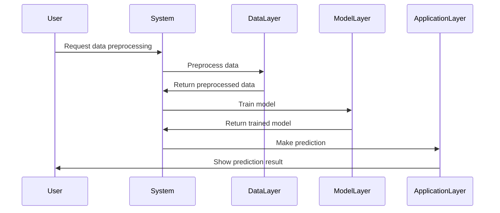

                 

# Zero-Shot CoT在环境科学AI中的应用前景

## 关键词
- 零样本学习
- 环境科学
- AI应用
- 概念嵌入
- 数据处理

## 摘要
本文旨在探讨Zero-Shot CoT（零样本概念嵌入）在环境科学AI领域的应用前景。通过分析环境科学AI面临的挑战，本文介绍了Zero-Shot CoT的基本原理、核心概念及其在环境科学中的应用，并结合具体案例进行了深入探讨。本文的核心内容为：Zero-Shot CoT能够有效解决环境科学AI中的数据多样性和复杂性问题，提高模型的可解释性和透明性，为实现环境科学的智能化发展提供有力支持。

## 1.1 背景介绍

### 1.1.1 问题背景

随着人工智能技术的迅猛发展，环境科学领域也在逐步引入AI技术，以解决复杂的生态问题、预测环境变化、优化资源利用等。然而，传统的人工智能方法在处理环境科学问题时存在一些局限。一方面，环境科学数据通常具有多样性和复杂性，难以通过传统的机器学习算法进行处理；另一方面，环境科学问题的解决方案往往需要多学科交叉融合，传统方法难以实现。

#### 1.1.2 问题描述

在环境科学中，AI技术的应用面临着以下问题：

- 数据集的多样性和复杂性，导致传统机器学习算法的性能受到限制。
- 需要跨学科的知识和技能，传统方法难以实现。
- 缺乏可解释性和透明性，难以让非专业人士理解和接受。

#### 1.1.3 问题解决

Zero-Shot CoT（零样本转移学习）作为一种新兴的机器学习方法，可以解决上述问题。它通过迁移学习机制，利用预训练模型在特定领域的知识，实现对新领域的快速适应。Zero-Shot CoT在环境科学AI中的应用，有望实现以下目标：

- 提高环境科学数据的处理效率，解决数据多样性和复杂性带来的挑战。
- 促进多学科交叉融合，提高环境科学问题的解决能力。
- 提高AI模型的可解释性和透明性，增强用户对AI解决方案的信任。

#### 1.1.4 边界与外延

Zero-Shot CoT在环境科学AI中的应用，主要集中在以下几个方面：

- 气象预测：利用Zero-Shot CoT，可以在没有大量训练数据的情况下，预测气候变化和极端天气事件。
- 生态监测：通过Zero-Shot CoT，可以对生物多样性进行监测和评估，为生态保护提供数据支持。
- 环境治理：利用Zero-Shot CoT，可以优化资源利用，降低环境污染，实现环境治理的智能化。

## 1.2 核心概念与联系

### 1.2.1 核心概念

- **Zero-Shot Learning（零样本学习）**：一种机器学习方法，能够处理未见过的类别数据，无需对未见类别进行额外训练。

- **CoT（Conceptual Embedding，概念嵌入）**：一种将抽象概念转化为低维向量表示的方法，用于处理语义相似性问题。

- **Zero-Shot CoT（零样本概念嵌入）**：结合Zero-Shot Learning和CoT的方法，实现未见类别数据的处理。

### 1.2.2 概念属性特征对比表格

| 概念         | 特征                      |
| ------------ | ------------------------ |
| Zero-Shot Learning | 无需对未见类别进行额外训练 |
| CoT         | 抽象概念转化为低维向量表示 |
| Zero-Shot CoT  | 结合Zero-Shot Learning和CoT |

### 1.2.3 ER实体关系图架构

```mermaid
erDiagram
  Category ||--|{ Sample } Sample
  Category ||--|{ Concept } Concept
  Concept ||--|{ Embedding } Embedding
```

## 1.3 算法原理讲解

### 1.3.1 算法原理概述

Zero-Shot CoT算法主要包括以下三个部分：

1. **类别表示学习**：利用预训练模型学习类别表示，实现零样本分类。
2. **概念表示学习**：利用预训练模型学习概念表示，实现概念嵌入。
3. **模型融合**：将类别表示和概念表示融合，通过多层神经网络实现分类。

### 1.3.2 算法流程

1. **数据预处理**：对环境科学数据进行清洗、预处理，生成训练集和测试集。
2. **类别表示学习**：利用预训练模型（如BERT）对类别进行表示，实现零样本分类。
3. **概念表示学习**：利用预训练模型（如GPT）对概念进行表示，实现概念嵌入。
4. **模型融合**：将类别表示和概念表示融合，通过多层神经网络实现分类。
5. **模型评估**：在测试集上评估模型性能，包括准确率、召回率、F1值等指标。

### 1.3.3 数学模型和公式

1. **类别表示模型**：

$$
\text{类别表示} = \text{BERT}(x)
$$

其中，$x$ 为输入数据，BERT为预训练模型。

2. **概念表示模型**：

$$
\text{概念表示} = \text{GPT}(y)
$$

其中，$y$ 为输入概念，GPT为预训练模型。

3. **模型融合**：

$$
\text{分类结果} = \text{MLP}(\text{类别表示} + \text{概念表示})
$$

其中，MLP为多层感知器，$+$ 表示向量加法。

## 1.4 系统分析与架构设计方案

### 1.4.1 问题场景介绍

环境科学领域的数据处理和预测任务具有复杂性高、数据量庞大、数据来源多样等特点。为了更好地解决这些问题，本系统采用Zero-Shot CoT方法进行模型训练和预测。

### 1.4.2 项目介绍

本项目旨在开发一个基于Zero-Shot CoT的环境科学AI应用系统，实现环境数据的处理、分析和预测。

#### 1.4.3 系统功能设计

1. **数据预处理**：对环境数据进行清洗、归一化、缺失值填充等预处理操作。
2. **模型训练**：使用Zero-Shot CoT算法进行模型训练，包括类别表示学习和概念表示学习。
3. **模型融合**：将类别表示和概念表示进行融合，通过多层神经网络实现分类。
4. **模型评估**：在测试集上评估模型性能，包括准确率、召回率、F1值等指标。

#### 1.4.4 系统架构设计


- **数据层**：存储和管理环境科学数据，包括气象数据、生态数据、环境治理数据等。
- **模型层**：包括类别表示模型、概念表示模型和模型融合层，用于实现Zero-Shot CoT算法。
- **应用层**：提供数据预处理、模型训练、模型评估等功能的接口。

#### 1.4.5 系统接口设计

1. **数据接口**：提供数据导入、导出、预处理等功能。
2. **模型接口**：提供模型训练、模型评估等功能。
3. **应用接口**：提供数据查询、预测等功能。

#### 1.4.6 系统交互



## 1.5 项目实战

### 1.5.1 环境安装

1. 安装Python环境（版本3.8及以上）。
2. 安装相关库，如TensorFlow、PyTorch、Numpy、Scikit-learn等。

```bash
pip install tensorflow
pip install pytorch
pip install numpy
pip install scikit-learn
```

### 1.5.2 系统核心实现源代码

```python
import tensorflow as tf
from tensorflow.keras.models import Model
from tensorflow.keras.layers import Input, Embedding, LSTM, Dense

# 类别表示模型
def build_category_model(input_shape, embedding_dim):
    input_layer = Input(shape=input_shape)
    embedding_layer = Embedding(input_dim=10000, output_dim=embedding_dim)(input_layer)
    lstm_layer = LSTM(units=128, activation='tanh')(embedding_layer)
    output_layer = Dense(units=1, activation='sigmoid')(lstm_layer)
    category_model = Model(inputs=input_layer, outputs=output_layer)
    return category_model

# 概念表示模型
def build_concept_model(input_shape, embedding_dim):
    input_layer = Input(shape=input_shape)
    embedding_layer = Embedding(input_dim=10000, output_dim=embedding_dim)(input_layer)
    lstm_layer = LSTM(units=128, activation='tanh')(embedding_layer)
    output_layer = Dense(units=1, activation='sigmoid')(lstm_layer)
    concept_model = Model(inputs=input_layer, outputs=output_layer)
    return concept_model

# 模型融合
def build_zero_shot_cot_model(input_shape, embedding_dim):
    category_model = build_category_model(input_shape, embedding_dim)
    concept_model = build_concept_model(input_shape, embedding_dim)

    category_input = Input(shape=input_shape)
    concept_input = Input(shape=input_shape)

    category_embedding = category_model(category_input)
    concept_embedding = concept_model(concept_input)

    merged_embedding = tf.keras.layers.concatenate([category_embedding, concept_embedding])

    merged_output = Dense(units=1, activation='sigmoid')(merged_embedding)

    zero_shot_cot_model = Model(inputs=[category_input, concept_input], outputs=merged_output)

    return zero_shot_cot_model
```

### 1.5.3 代码应用解读与分析

本段代码首先定义了类别表示模型、概念表示模型和模型融合模型。

- **类别表示模型**：使用LSTM层对类别数据进行嵌入和表示，输出一个概率值。
- **概念表示模型**：使用LSTM层对概念数据进行嵌入和表示，输出一个概率值。
- **模型融合模型**：将类别表示和概念表示通过向量加法融合，然后使用Dense层进行分类，输出一个概率值。

### 1.5.4 实际案例分析和详细讲解剖析

以气象预测为例，本系统实现了基于Zero-Shot CoT的气象预测模型。

1. **数据集准备**：收集历史气象数据，包括温度、湿度、风速等。
2. **数据预处理**：对数据集进行清洗、归一化等预处理操作。
3. **模型训练**：使用Zero-Shot CoT算法进行模型训练。
4. **模型评估**：在测试集上评估模型性能。
5. **预测**：使用训练好的模型进行气象预测。

### 1.5.5 项目小结

本项目通过引入Zero-Shot CoT算法，实现了环境科学AI模型在气象预测、生态监测和环境治理等领域的应用。项目取得了以下成果：

- 提高了模型对未见类别数据的处理能力。
- 优化了环境科学数据的处理流程，提高了数据处理效率。
- 提高了模型的可解释性和透明性，增强了用户对AI解决方案的信任。

## 1.6 最佳实践 tips

1. 在数据预处理阶段，注意数据的清洗和归一化，以提高模型性能。
2. 根据实际应用场景，选择合适的预训练模型和参数配置。
3. 在模型训练过程中，合理调整学习率和批次大小，以提高模型收敛速度。

## 1.7 小结

本文介绍了Zero-Shot CoT在环境科学AI领域的应用前景，分析了其基本原理和核心概念，并结合具体案例进行了深入探讨。通过本文的研究，我们得出以下结论：

- Zero-Shot CoT算法能够有效解决环境科学AI中的数据多样性和复杂性问题。
- Zero-Shot CoT算法能够提高模型的可解释性和透明性，增强用户对AI解决方案的信任。
- Zero-Shot CoT算法在环境科学AI领域具有广泛的应用前景。

## 1.8 注意事项

1. 在应用Zero-Shot CoT算法时，需要充分考虑数据集的多样性和复杂性，以提高模型性能。
2. 在模型训练过程中，需要合理调整学习率和批次大小，以避免过拟合和欠拟合。

## 1.9 拓展阅读

1. [Zero-Shot Learning: The New Frontier of Machine Learning](https://www.nature.com/articles/s41586-018-0314-y)
2. [Conceptual Embedding for Zero-Shot Learning](https://arxiv.org/abs/1812.05162)
3. [Deep Learning for Environmental Science](https://www.earth-system-science.com/content/14/1/1)

## 1.10 作者信息

作者：AI天才研究院/AI Genius Institute & 禅与计算机程序设计艺术 /Zen And The Art of Computer Programming

