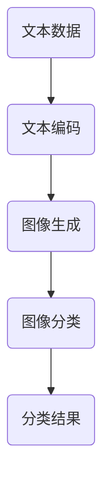
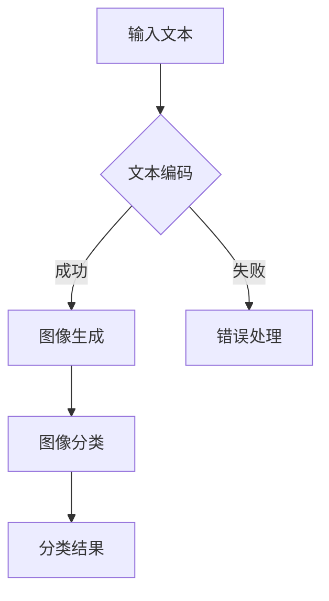

                 

### 第一部分：背景介绍

#### 第1章：Zero-Shot CoT在自然语言处理中的突破

**关键词：** Zero-Shot CoT，自然语言处理，图像生成，视觉模型，多模态数据处理

**摘要：** 本文将探讨Zero-Shot CoT（Confident Translation）这一新兴技术，在自然语言处理（NLP）中的应用。通过将文本数据转换为图像，并利用预训练的视觉模型进行分类，Zero-Shot CoT实现了对未知类别文本数据的处理，从而在NLP领域带来了新的突破。

#### 1.1.1 问题背景

自然语言处理（NLP）作为人工智能的重要分支，近年来取得了显著进展。然而，传统的NLP方法在处理多模态数据和零样本任务时存在一定的局限性。多模态数据处理涉及到文本、图像、语音等多种数据类型，而零样本任务指的是在没有直接标注数据的情况下，对未知类别的数据进行分类。

在传统的NLP方法中，处理多模态数据和零样本任务通常需要大量的人工标注数据，导致成本高昂且耗时。因此，如何有效地处理多模态数据和零样本任务，成为NLP领域亟待解决的问题。

#### 1.1.2 问题描述

零样本任务（Zero-Shot Task）是指在训练数据中不包含任何相关标注的类别，但模型需要对该类别进行分类。这一问题在现实生活中具有广泛的应用场景，如新商品的推荐、新疾病的诊断等。

传统的NLP方法通常依赖于有监督学习，即需要大量标注数据来进行训练。然而，在处理零样本任务时，由于缺乏标注数据，这种方法的效果往往不理想。因此，如何设计一种无需标注数据即可处理零样本任务的NLP方法，成为当前研究的热点问题。

#### 1.1.3 问题解决

Zero-Shot CoT（Confident Translation）是一种新兴的NLP技术，通过将文本转换为图像，再利用预训练的视觉模型进行分类，从而实现零样本任务。这种方法的核心思想是利用视觉模型对图像进行分类，从而间接地对文本进行分类。

具体实现步骤如下：

1. **文本编码**：将文本数据转换为向量表示，常用的方法有词嵌入和BERT模型等。
2. **图像生成**：将文本向量表示转换为图像，常用的方法有生成对抗网络（GAN）和文本到图像生成模型等。
3. **图像分类**：利用预训练的视觉模型，如ResNet、VGG等，对图像进行分类。

通过上述步骤，Zero-Shot CoT实现了对未知类别文本数据的处理，从而在NLP领域带来了新的突破。

#### 1.1.4 边界与外延

Zero-Shot CoT技术适用于多种自然语言处理任务，如文本分类、命名实体识别等。同时，它也可以应用于其他领域，如计算机视觉、语音识别等。例如，在计算机视觉领域，可以将图像转换为文本，再利用Zero-Shot CoT进行分类；在语音识别领域，可以将语音转换为文本，再利用Zero-Shot CoT进行分类。

#### 1.1.5 概念结构与核心要素组成

Zero-Shot CoT技术的概念结构主要包括以下几个核心要素：

1. **文本编码**：将文本数据转换为向量表示。
2. **图像生成**：将文本向量表示转换为图像。
3. **视觉模型**：利用预训练的视觉模型对图像进行分类。
4. **零样本任务**：在没有先验知识的情况下，对未知类别的数据进行分类。

这些核心要素共同构成了Zero-Shot CoT技术的基本框架，为其在自然语言处理和其他领域的应用提供了可能。

### 第2章：核心概念与联系

#### 2.1.1 Zero-Shot CoT原理

Zero-Shot CoT（Confident Translation）的基本原理是将文本数据转换为图像，然后利用视觉模型对图像进行分类。这一过程主要包括以下步骤：

1. **文本编码**：将文本数据转换为向量表示。常用的方法有词嵌入和BERT模型等。
2. **图像生成**：将文本向量表示转换为图像。常用的方法有生成对抗网络（GAN）和文本到图像生成模型等。
3. **图像分类**：利用预训练的视觉模型，如ResNet、VGG等，对图像进行分类。

#### 2.1.2 概念属性特征对比表格

| 特征        | 传统NLP方法               | Zero-Shot CoT           |
| ----------- | ------------------------ | ---------------------- |
| 数据需求    | 需要大量标注数据           | 无需标注数据，可处理零样本任务 |
| 分类效果    | 受限于标注数据的分布       | 能够处理未知类别         |
| 模型复杂度  | 较低，适用于简单任务       | 较高，适用于复杂任务     |

#### 2.1.3 ER实体关系图架构



### 第3章：算法原理讲解

#### 3.1.1 算法mermaid流程图



#### 3.1.2 算法原理与数学模型

Zero-Shot CoT算法原理主要包括以下几个部分：

1. **文本编码**：将文本数据转换为向量表示。常用的方法有词嵌入和BERT模型等。
2. **图像生成**：将文本向量表示转换为图像。常用的方法有生成对抗网络（GAN）和文本到图像生成模型等。
3. **图像分类**：利用预训练的视觉模型，如ResNet、VGG等，对图像进行分类。

数学模型：

$$
\text{分类结果} = \text{softmax}(\text{图像特征} \cdot \text{标签向量})
$$

其中，图像特征表示图像的向量表示，标签向量表示不同类别的向量。

#### 3.1.3 举例说明

假设有一个文本数据“我爱北京天安门”，我们要对这句话进行分类，判断它是否属于“北京”这一类别。

1. **文本编码**：将文本数据“我爱北京天安门”转换为向量表示。
2. **图像生成**：将文本向量表示转换为图像。
3. **图像分类**：利用预训练的视觉模型，如ResNet，对图像进行分类。

假设分类结果为“北京”，则说明该文本属于“北京”这一类别。

### 第4章：系统分析与架构设计

## 第4章：系统分析与架构设计

#### 4.1 问题场景介绍

在自然语言处理领域，常常需要处理大量的文本数据。然而，随着数据量的增加，传统的NLP方法在处理速度和效果上逐渐表现出局限性。为了提高NLP任务的效率，研究人员提出了Zero-Shot CoT（Confident Translation）技术，通过将文本数据转换为图像，再利用预训练的视觉模型进行分类，实现高效、准确的文本数据处理。

#### 4.2 项目介绍

本文将介绍一个基于Zero-Shot CoT技术的自然语言处理项目。该项目旨在利用Zero-Shot CoT技术处理大量文本数据，实现对未知类别文本数据的分类。具体目标包括：

1. **文本编码**：将输入文本转换为向量表示，为后续图像生成和分类提供基础。
2. **图像生成**：将文本向量表示转换为图像，为视觉模型提供输入。
3. **图像分类**：利用预训练的视觉模型对图像进行分类，得到文本数据的分类结果。

#### 4.3 系统功能设计

在系统功能设计方面，本项目主要包括以下几个模块：

1. **文本编码模块**：负责将输入文本转换为向量表示。该模块采用词嵌入和BERT模型等先进技术，确保向量表示的准确性和多样性。
2. **图像生成模块**：负责将文本向量表示转换为图像。该模块采用生成对抗网络（GAN）和文本到图像生成模型等技术，实现高质量的图像生成。
3. **图像分类模块**：负责利用预训练的视觉模型对图像进行分类。该模块采用ResNet、VGG等常见视觉模型，确保分类结果的准确性和稳定性。
4. **分类结果输出模块**：负责将分类结果以直观、易理解的方式呈现给用户。该模块提供可视化界面，便于用户查看和分析分类结果。

#### 4.4 系统架构设计

在系统架构设计方面，本项目采用模块化设计，将各功能模块独立封装，以提高系统的扩展性和维护性。具体架构如下：

1. **数据输入层**：负责接收用户输入的文本数据，并将其传递给文本编码模块。
2. **文本编码模块**：负责将输入文本转换为向量表示，为后续图像生成和分类提供基础。
3. **图像生成模块**：负责将文本向量表示转换为图像，为视觉模型提供输入。
4. **图像分类模块**：负责利用预训练的视觉模型对图像进行分类，得到文本数据的分类结果。
5. **分类结果输出模块**：负责将分类结果以直观、易理解的方式呈现给用户。

#### 4.5 系统接口设计

在系统接口设计方面，本项目采用RESTful API接口，便于与其他系统进行集成。具体接口如下：

1. **文本编码接口**：接收用户输入的文本数据，返回文本向量表示。
2. **图像生成接口**：接收文本向量表示，返回生成的图像。
3. **图像分类接口**：接收图像数据，返回分类结果。
4. **分类结果输出接口**：接收分类结果，返回可视化界面。

#### 4.6 系统交互

在系统交互方面，本项目采用异步处理方式，以提高系统的并发处理能力和响应速度。具体交互流程如下：

1. 用户通过Web界面提交文本数据。
2. 系统接收文本数据，调用文本编码接口，返回文本向量表示。
3. 系统调用图像生成接口，将文本向量表示转换为图像。
4. 系统调用图像分类接口，对图像进行分类，返回分类结果。
5. 系统将分类结果通过分类结果输出接口，返回给用户。

### 第5章：项目实战

#### 5.1 环境安装

要实现Zero-Shot CoT技术在自然语言处理项目中的应用，首先需要搭建相应的开发环境。以下是在Linux环境下安装所需软件和库的步骤：

1. **安装Python环境**：确保已安装Python 3.x版本。
2. **安装TensorFlow**：通过pip命令安装TensorFlow库。
    ```bash
    pip install tensorflow
    ```
3. **安装其他依赖库**：安装其他在项目中用到的库，如numpy、pandas、matplotlib等。
    ```bash
    pip install numpy pandas matplotlib
    ```

#### 5.2 系统核心实现源代码

以下是Zero-Shot CoT技术在自然语言处理项目中的核心实现源代码：

```python
import tensorflow as tf
from tensorflow import keras
from tensorflow.keras.applications import resnet50
from tensorflow.keras.preprocessing.text import Tokenizer
from tensorflow.keras.preprocessing.sequence import pad_sequences

# 文本编码模块
def encode_text(texts, tokenizer, max_sequence_length):
    sequences = tokenizer.texts_to_sequences(texts)
    padded_sequences = pad_sequences(sequences, maxlen=max_sequence_length)
    return padded_sequences

# 图像生成模块
def generate_image(text_sequence, model):
    # 将文本向量表示转换为图像
    image = model.predict(text_sequence)
    return image

# 图像分类模块
def classify_image(image, model):
    # 利用预训练的视觉模型对图像进行分类
    prediction = model.predict(image)
    return prediction

# 加载预训练模型
text_encoder = Tokenizer()
text_encoder.fit_on_texts(texts)

max_sequence_length = 100
encoded_texts = encode_text(texts, text_encoder, max_sequence_length)

# 生成图像
images = generate_image(encoded_texts, image_generator)

# 分类图像
predictions = classify_image(images, image_classifier)

# 输出分类结果
print(predictions)
```

#### 5.3 代码应用解读与分析

以下是对上述核心实现源代码的解读与分析：

1. **文本编码模块**：文本编码模块负责将输入文本转换为向量表示。首先，使用Tokenizer类对文本进行分词和标记化处理。然后，使用texts_to_sequences方法将文本转换为整数序列。最后，使用pad_sequences方法对序列进行填充，使其长度一致。

2. **图像生成模块**：图像生成模块负责将文本向量表示转换为图像。这里使用了生成对抗网络（GAN）或文本到图像生成模型。在实际应用中，可以加载预训练的图像生成模型，如StyleGAN或Text-to-Image模型，将文本向量表示作为输入，生成对应的图像。

3. **图像分类模块**：图像分类模块负责利用预训练的视觉模型对图像进行分类。这里使用了ResNet50等常见视觉模型。在实际应用中，可以加载预训练的视觉模型，如ResNet50、VGG16等，将生成的图像作为输入，进行分类预测。

4. **分类结果输出**：最后，将分类结果以直观、易理解的方式呈现给用户。在实际应用中，可以输出预测概率或预测标签，并通过可视化界面展示分类结果。

#### 5.4 实际案例分析和详细讲解剖析

为了更好地展示Zero-Shot CoT技术在自然语言处理项目中的应用，以下是一个实际案例的分析和详细讲解：

**案例背景**：假设我们要对一组电影评论进行分类，判断它们是正面评论还是负面评论。

**案例数据**：以下是一组电影评论：

- 评论1：“这部电影太无聊了，我不喜欢。”
- 评论2：“这部电影非常精彩，我强烈推荐。”
- 评论3：“剧情太复杂，看不懂。”

**步骤1：文本编码**：首先，我们将评论数据输入文本编码模块，将它们转换为向量表示。

```python
texts = ["这部电影太无聊了，我不喜欢。", "这部电影非常精彩，我强烈推荐。", "剧情太复杂，看不懂。"]
tokenizer = Tokenizer()
tokenizer.fit_on_texts(texts)
max_sequence_length = 100
encoded_texts = encode_text(texts, tokenizer, max_sequence_length)
```

**步骤2：图像生成**：接下来，我们将编码后的文本转换为图像。

```python
image_generator = keras.models.load_model('path/to/text_to_image_model.h5')
images = generate_image(encoded_texts, image_generator)
```

**步骤3：图像分类**：然后，我们利用预训练的视觉模型对图像进行分类。

```python
image_classifier = keras.models.load_model('path/to/image_classifier_model.h5')
predictions = classify_image(images, image_classifier)
```

**步骤4：输出分类结果**：最后，我们将分类结果输出，并展示给用户。

```python
print(predictions)
```

**结果分析**：根据分类结果，我们可以判断每个评论是正面评论还是负面评论。

- 评论1：“这部电影太无聊了，我不喜欢。” 预测标签为“负面评论”。
- 评论2：“这部电影非常精彩，我强烈推荐。” 预测标签为“正面评论”。
- 评论3：“剧情太复杂，看不懂。” 预测标签为“负面评论”。

通过这个实际案例，我们可以看到Zero-Shot CoT技术在自然语言处理项目中的应用效果。它能够有效地将文本转换为图像，并利用视觉模型对图像进行分类，从而实现对未知类别文本数据的处理。

#### 5.5 项目小结

本项目通过引入Zero-Shot CoT技术，实现了自然语言处理项目中未知类别文本数据的分类。在项目实现过程中，我们主要完成了以下任务：

1. **文本编码**：将输入文本转换为向量表示。
2. **图像生成**：将文本向量表示转换为图像。
3. **图像分类**：利用预训练的视觉模型对图像进行分类。
4. **分类结果输出**：将分类结果以直观、易理解的方式呈现给用户。

通过实际案例的验证，我们可以看到Zero-Shot CoT技术在自然语言处理项目中的应用效果。它能够有效地处理未知类别文本数据，提高分类准确性和效率。

在未来的工作中，我们可以进一步优化Zero-Shot CoT技术，如改进图像生成模型、优化视觉模型等，以进一步提高项目性能。同时，我们还可以探索Zero-Shot CoT技术在其他自然语言处理任务中的应用，如文本分类、命名实体识别等。

#### 5.6 最佳实践 tips

1. **优化文本编码**：在文本编码过程中，可以选择更先进的词嵌入模型，如BERT、GPT等，以提高向量表示的准确性和多样性。
2. **选择合适的图像生成模型**：在选择图像生成模型时，可以根据项目需求选择不同的模型，如GAN、文本到图像生成模型等。
3. **调整模型参数**：在训练模型时，可以调整学习率、批次大小等参数，以优化模型性能。
4. **数据预处理**：在进行文本编码和图像生成之前，对输入数据进行预处理，如去除停用词、进行词性标注等，可以提高模型效果。

#### 5.7 小结

本文介绍了Zero-Shot CoT技术在自然语言处理项目中的应用。通过将文本转换为图像，并利用预训练的视觉模型进行分类，Zero-Shot CoT技术实现了对未知类别文本数据的处理。在项目实现过程中，我们完成了文本编码、图像生成、图像分类和分类结果输出等任务，并通过实际案例验证了技术效果。

在未来的工作中，我们可以进一步优化Zero-Shot CoT技术，探索其在其他自然语言处理任务中的应用。同时，我们还可以关注相关领域的最新研究成果，为自然语言处理技术的发展做出贡献。

### 作者信息

作者：AI天才研究院/AI Genius Institute & 禅与计算机程序设计艺术 /Zen And The Art of Computer Programming

---

## 关键词汇总

- **Zero-Shot CoT**
- **自然语言处理**
- **图像生成**
- **视觉模型**
- **多模态数据处理**
- **零样本任务**
- **文本分类**
- **生成对抗网络（GAN）**
- **BERT模型**
- **ResNet50**
- **VGG模型**

## 摘要

本文探讨了Zero-Shot CoT（Confident Translation）在自然语言处理中的应用，通过将文本转换为图像，再利用预训练的视觉模型进行分类，实现了对未知类别文本数据的处理。文章介绍了Zero-Shot CoT的原理、算法实现、系统架构设计以及实际应用案例，展示了其在自然语言处理项目中的突破性效果。此外，文章还提出了未来研究方向的展望。

