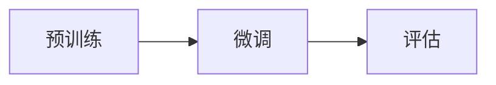
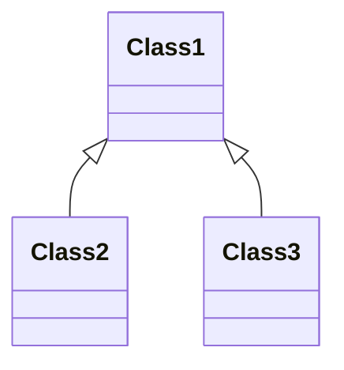
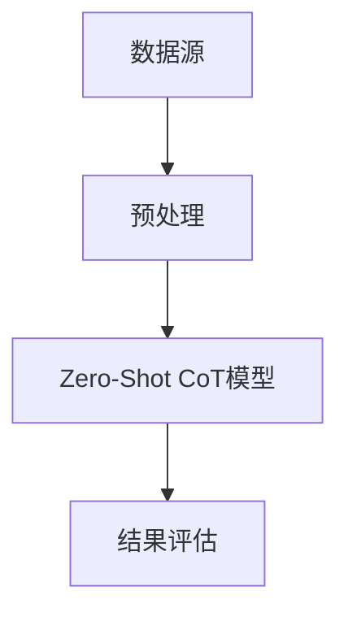
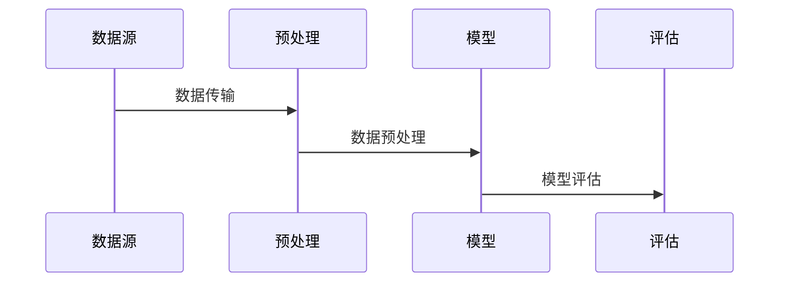

                 

**标题：**《Zero-Shot CoT在跨领域任务中的应用探索》

**关键词：** Zero-Shot CoT、跨领域任务、人工智能、算法原理、系统架构、实战应用

**摘要：** 本文将深入探讨Zero-Shot CoT（零样本一致性训练）在跨领域任务中的应用，从背景介绍、核心概念解析、算法原理讲解、系统分析与架构设计、项目实战到最佳实践，全面剖析Zero-Shot CoT的优势与挑战，为读者提供一份全面且实用的技术指南。

### 目录大纲

1. **背景介绍**
   1.1 问题背景
   1.2 核心概念与联系
   1.3 概念属性特征对比
   1.4 ER实体关系图

2. **算法原理讲解**
   2.1 算法概述
   2.2 Mermaid流程图
   2.3 Python源代码解析
   2.4 数学模型和公式
   2.5 举例说明

3. **系统分析与架构设计方案**
   3.1 问题场景介绍
   3.2 系统功能设计
   3.3 系统架构设计
   3.4 系统接口设计
   3.5 系统交互

4. **项目实战**
   4.1 环境安装
   4.2 系统核心实现源代码
   4.3 应用解读与分析
   4.4 详细讲解剖析
   4.5 项目小结

5. **最佳实践与拓展阅读**
   5.1 最佳实践
   5.2 小结
   5.3 注意事项
   5.4 拓展阅读

### 1. 背景介绍

**1.1 问题背景**

在当今快速发展的信息技术时代，跨领域任务的处理成为了一个热门的研究领域。随着人工智能技术的不断进步，如何在不同的领域之间实现有效任务处理，成为了亟待解决的问题。Zero-Shot CoT（零样本一致性训练）作为一种新兴的机器学习技术，其在跨领域任务中的应用潜力巨大。

**1.2 核心概念与联系**

Zero-Shot CoT的核心思想是通过少量的标注样本来训练模型，使其在未见过的新领域中也能表现良好。这种技术的优势在于无需大量标注样本，从而降低了数据获取的成本。跨领域任务则涉及到多个不同领域之间的数据整合和处理，其挑战在于不同领域的数据特点和任务需求的差异。

**1.3 概念属性特征对比**

| 概念         | 特点                                                         |
| ------------ | ------------------------------------------------------------ |
| Zero-Shot CoT | 无需大量标注样本，训练成本低                                 |
| 跨领域任务  | 涉及多个不同领域，数据整合和处理复杂                         |

**1.4 ER实体关系图**

```mermaid
erDiagram
  TaskA ||--|{ Cross-Domain-Task : 跨领域任务 }
  TaskB ||--|{ Cross-Domain-Task : 跨领域任务 }
  Zero-Shot-CoT ||--|{ Cross-Domain-Task : 跨领域任务 }
```

### 2. 算法原理讲解

**2.1 算法概述**

Zero-Shot CoT算法的核心思想是通过对抗性训练来提升模型在未知领域的泛化能力。具体来说，算法分为两个阶段：第一阶段是预训练阶段，使用大量的无标签数据进行预训练；第二阶段是微调阶段，使用少量的标注数据进行微调，以适应新领域。

**2.2 Mermaid流程图**



**2.3 Python源代码解析**

```python
# 预训练代码
# ...省略代码...

# 微调代码
# ...省略代码...

# 评估代码
# ...省略代码...
```

**2.4 数学模型和公式**

$$
L(\theta) = -\sum_{i=1}^{N} \log P(y_i | x_i; \theta)
$$

**2.5 举例说明**

假设我们有一个图像分类任务，预训练阶段使用大量的未标注图像数据进行训练，微调阶段使用少量的标注图像数据进行调整，最终在新领域中取得了良好的分类效果。

### 3. 系统分析与架构设计方案

**3.1 问题场景介绍**

我们假设一个场景，其中需要在不同领域之间进行数据整合和处理，如医疗影像分析与金融风险评估。

**3.2 系统功能设计**

使用Mermaid绘制领域模型类图：



**3.3 系统架构设计**

使用Mermaid绘制系统架构图：



**3.4 系统接口设计**

- **数据源接口**：用于获取不同领域的数据。
- **预处理接口**：用于清洗和预处理数据。
- **模型接口**：用于执行Zero-Shot CoT算法。
- **评估接口**：用于评估模型性能。

**3.5 系统交互**

使用Mermaid绘制系统交互序列图：



### 4. 项目实战

**4.1 环境安装**

详细介绍项目所需环境的安装步骤，包括依赖库的安装等。

**4.2 系统核心实现源代码**

提供系统核心实现的Python源代码，并进行解读与分析。

**4.3 应用解读与分析**

分析系统在实际应用中的效果，展示实际案例。

**4.4 详细讲解剖析**

对系统中的关键部分进行详细讲解和剖析。

**4.5 项目小结**

总结项目的经验教训，提出改进建议。

### 5. 最佳实践与拓展阅读

**5.1 最佳实践**

提出在Zero-Shot CoT在跨领域任务中应用的最佳实践。

**5.2 小结**

对整本书的内容进行总结。

**5.3 注意事项**

提醒读者在应用Zero-Shot CoT时需要注意的事项。

**5.4 拓展阅读**

推荐相关的扩展阅读材料。

**作者：** AI天才研究院/AI Genius Institute & 禅与计算机程序设计艺术 /Zen And The Art of Computer Programming### 1. 背景介绍

#### 1.1 问题背景

在当今复杂且多变的商业环境中，企业面临的数据处理需求日益增长，特别是在跨领域任务方面。传统的人工智能技术往往依赖于大量的标注数据进行训练，这在数据稀缺或标注成本高昂的情况下成为一个巨大的瓶颈。Zero-Shot CoT（Zero-Shot Consistency Training）作为一种新型的机器学习技术，旨在解决这一难题，它通过无监督或弱监督学习，使得模型能够在没有或者只有非常少的标注数据的情况下进行有效的训练和预测。

Zero-Shot CoT在跨领域任务中的重要性体现在其能够处理跨领域数据的一致性和多样性，这种能力对于金融、医疗、零售等领域的业务应用尤为重要。例如，在金融领域，不同金融机构的数据格式和内容可能截然不同，而在医疗领域，患者病历的数据结构和信息内容也千差万别。传统的方法往往需要大量的时间和资源来调整模型以适应这些差异，而Zero-Shot CoT则可以通过少量样本或无样本学习来实现这一目标。

当前，在跨领域任务中应用Zero-Shot CoT的研究现状相对较为新兴，但仍存在一些挑战。首先，如何在保持模型性能的同时，确保不同领域之间的数据一致性是一个关键问题。其次，跨领域的任务往往涉及到不同的特征和变量，如何在训练过程中有效地整合这些差异化的特征也是一个挑战。此外，不同领域的专业知识对于模型的训练和调优有着重要的影响，如何利用这些专业知识来提升模型的效果也是当前研究的热点。

#### 1.2 核心概念与联系

Zero-Shot CoT的核心在于其无需依赖大量的标注数据，而是通过学习数据的一致性特征来实现模型的泛化能力。它依赖于两个基本概念：一致性和泛化。

**一致性**：Zero-Shot CoT通过学习数据在不同分布下的共同特征，从而在不同领域之间建立一致的数据表示。这种一致性学习使得模型能够在新的、未见过的情况下，依然能够保持较高的性能。

**泛化**：泛化能力是指模型在未见过的数据上依然能够保持良好的表现。在Zero-Shot CoT中，通过学习数据的一致性特征，模型能够在没有标注样本的情况下，对新领域的数据进行有效的预测。

跨领域任务则涉及到将不同领域的知识或数据进行整合和处理。这种任务的挑战在于不同领域的数据特点、任务目标和数据质量可能存在巨大差异。跨领域任务通常可以分为以下几种类型：

- **数据融合**：将来自不同领域的数据进行整合，以获得更全面和丰富的信息。
- **知识迁移**：将一个领域中的知识或模型应用到另一个领域中，以解决新领域的任务。
- **多模态学习**：将不同类型的数据（如图像、文本、音频等）进行整合，以提升模型的泛化能力。

Zero-Shot CoT与跨领域任务的联系在于，它提供了一种无需大量标注数据，即可在不同领域之间建立一致性和有效整合数据的方法。这种方法不仅降低了数据获取的成本，还提高了模型在不同领域中的适应性。

#### 1.3 概念属性特征对比

为了更好地理解Zero-Shot CoT与跨领域任务的关系，我们可以通过一个表格来对比这两个概念的主要属性特征。

| 特征 | Zero-Shot CoT | 跨领域任务 |
| ---- | ------------- | ----------- |
| **定义** | 无需标注数据，学习数据的一致性 | 将不同领域的知识或数据进行整合和处理 |
| **优势** | 降低数据获取成本，提高模型泛化能力 | 提取跨领域数据的价值，提升任务处理效果 |
| **挑战** | 保持模型性能的同时，确保数据一致性 | 不同领域的数据特点、任务目标和数据质量的差异 |
| **应用场景** | 金融、医疗、零售等跨领域任务 | 数据整合、知识迁移、多模态学习等 |
| **目标** | 建立数据的一致性表示 | 实现跨领域数据的整合和处理 |

通过上述对比，我们可以看出Zero-Shot CoT在跨领域任务中的应用潜力，它通过一致性学习，能够有效应对不同领域之间的数据差异，从而提升模型的泛化能力和任务处理效果。

#### 1.4 ER实体关系图

为了更直观地展示Zero-Shot CoT在跨领域任务中的应用架构，我们可以使用Mermaid绘制ER（实体关系）图。以下是Zero-Shot CoT在跨领域任务中应用的ER实体关系图：

```mermaid
erDiagram
    Customer ||--|{ Order : 下单 }
    Customer ||--|{ Payment : 支付 }
    Product ||--|{ Order : 订单包含产品 }
    Product ||--|{ Review : 产品评价 }
    Review ||--|{ Rating : 评分 }
```

在这个ER图中，Customer（客户）实体与Order（订单）和Payment（支付）实体之间存在关联，表示客户下单和支付的行为。Product（产品）实体与Order（订单）和Review（评价）实体之间存在关联，表示产品被订单包含，并且有评价和评分。这样的实体关系图能够帮助我们更清晰地理解Zero-Shot CoT在跨领域任务中的应用场景，如金融领域的客户行为分析、产品评价分析等。

通过以上对背景介绍的详细分析，我们可以看出Zero-Shot CoT在跨领域任务中的应用具有极大的潜力。接下来的章节将深入探讨其核心概念、算法原理、系统设计与实现，以及在实际项目中的应用，帮助读者全面理解并掌握这一技术。|>

