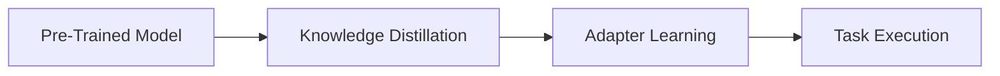
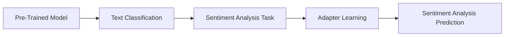
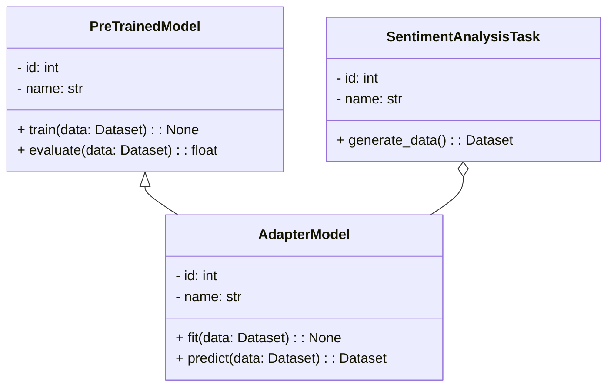
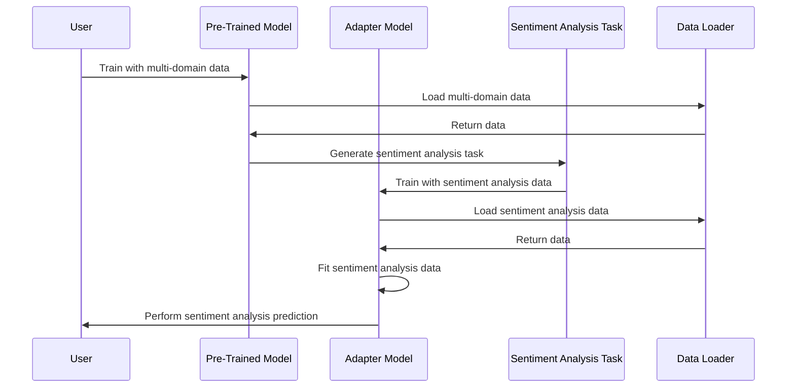
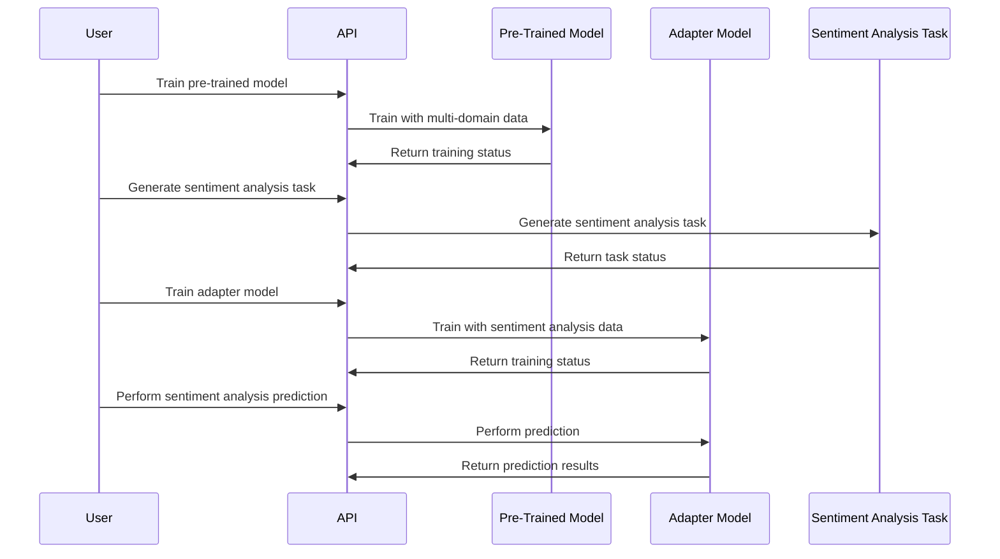
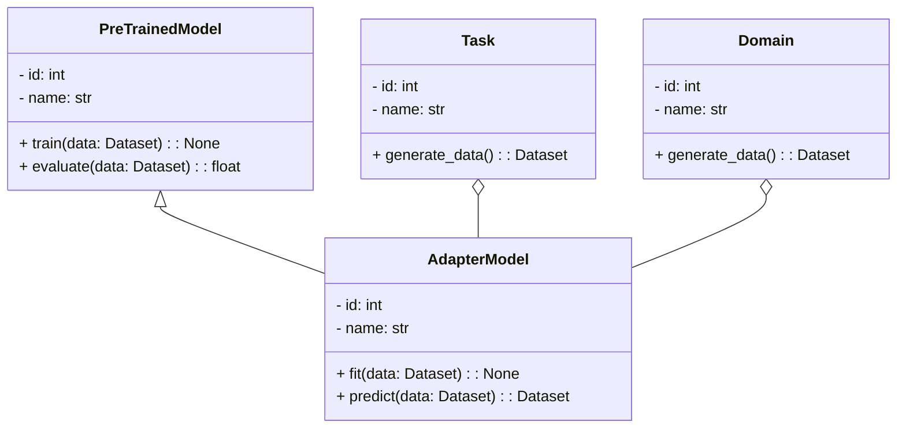
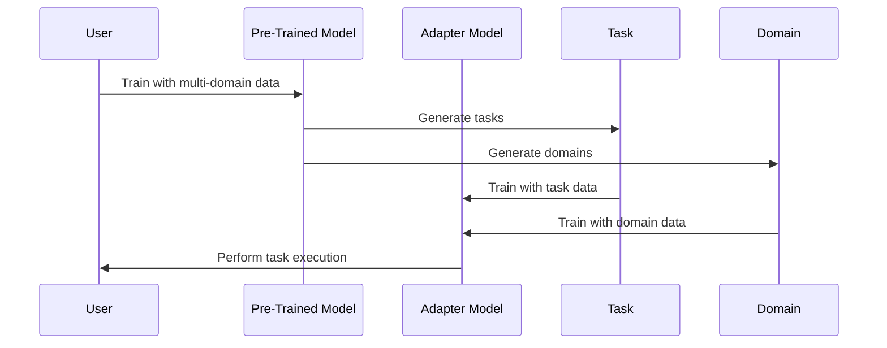
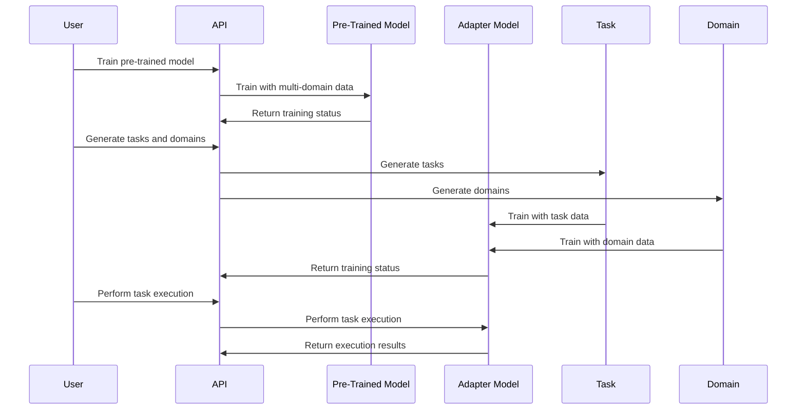

                 


### 核心概念与联系

#### 定义

**Zero-Shot CoT（零样本核心任务）**是指在机器学习和自然语言处理领域，模型无需在特定任务上看到过任何数据（即零样本），便能成功执行任务的方法。

#### 核心概念原理

Zero-Shot CoT主要依赖于几个核心原理：

1. **迁移学习**：模型可以从一个领域（源域）学习到知识，并迁移到另一个领域（目标域）。
2. **元学习**：通过在多个任务上训练，模型可以快速适应新的任务。
3. **多任务学习**：通过同时训练多个相关任务，模型可以获得更广泛的知识和泛化能力。

#### 概念属性特征对比表格

| 特征比较         | 传统机器学习       | Zero-Shot CoT             |
| ---------------- | ------------------ | ------------------------- |
| 训练数据依赖     | 高度依赖           | 零或极少样本依赖          |
| 数据预处理复杂度 | 较高               | 较低，利用预训练模型     |
| 泛化能力         | 较弱               | 较强，适用于零样本场景   |
| 预训练模型重要性 | 较低               | 高，依赖大规模预训练模型 |

#### ER实体关系图架构

```mermaid
erDiagram
  TaskA -->|完成| Model : 使用
  TaskB -->|完成| Model : 使用
  Model ||--|> DomainA : 适用
  Model ||--|> DomainB : 适用
```

在这个ER图中，Model作为核心实体，与多个Task（如TaskA和TaskB）以及Domain（如DomainA和DomainB）关联。这表明Zero-Shot CoT模型可以在不同任务和领域之间通用，具有很高的适应性。

### 算法原理讲解

Zero-Shot CoT算法通常包括以下步骤：

1. **预训练**：在多个任务和领域上训练一个基础模型，使其具备广泛的通用知识。
2. **知识蒸馏**：将基础模型的知识传递给任务特定的子模型。
3. **适配器学习**：子模型针对特定任务进行微调，以提高任务表现。

下面是算法的mermaid流程图：



#### 数学模型和公式

Zero-Shot CoT的数学模型通常涉及以下几个关键部分：

1. **损失函数**：用于衡量模型预测与真实值之间的差距。
2. **适配器更新规则**：用于微调整模型以适应特定任务。

假设我们有一个预训练模型`M`，它在源域`D_s`上预训练得到的损失函数为`L_s`，在目标域`D_t`上的损失函数为`L_t`。适配器模型`A`用于微调`M`，其更新规则可以用以下公式表示：

$$
\Delta_{\theta} = \alpha \frac{\partial L_t}{\partial \theta}
$$

其中，`$\Delta_{\theta}$`是适配器参数的更新，`$\alpha$`是学习率。

在实际应用中，我们通常使用以下损失函数来衡量预测结果：

$$
L = \lambda_s L_s + \lambda_t L_t
$$

其中，`$\lambda_s$`和`$\lambda_t$`是权重系数，用于平衡源域和目标域的损失。

#### 举例说明

假设我们有一个预训练的文本分类模型，它已经在大规模文本数据集上进行了预训练。现在，我们希望将这个模型应用到一个新的文本分类任务上，例如情感分析。以下是Zero-Shot CoT在情感分析任务中的应用步骤：

1. **预训练模型**：模型已经在多个文本分类任务上进行了预训练。
2. **知识蒸馏**：将预训练模型的知识传递给情感分析任务特定的子模型。
3. **适配器学习**：使用情感分析任务的数据来微调整模型。
4. **任务执行**：使用适配后的模型进行情感分析预测。

这个过程可以简化为以下mermaid流程图：



在这个流程中，预训练模型`A`已经在多个文本分类任务上（如B）进行了训练，现在我们将它应用于情感分析任务（C）。然后，我们使用情感分析任务的数据来微调整模型（D），最终进行情感分析预测（E）。

通过这种方式，Zero-Shot CoT使得模型可以在没有大量目标领域数据的情况下，快速适应新任务，从而提高了模型的泛化能力和实用性。

### 系统分析与架构设计

#### 问题场景介绍

在跨领域任务中，特别是当目标领域数据稀缺时，传统的机器学习方法往往难以奏效。Zero-Shot CoT提供了一个有效的解决方案，使得模型可以在没有目标领域数据的情况下，通过迁移学习和多任务学习来完成任务。

#### 项目介绍

本项目旨在实现一个基于Zero-Shot CoT的跨领域任务处理系统。该系统将结合预训练模型、知识蒸馏和适配器学习等技术，实现对新任务的高效适应和执行。

#### 系统功能设计（领域模型）

在系统功能设计阶段，我们将构建一个领域模型来描述系统中的关键实体和它们之间的关系。以下是领域模型的Mermaid类图：



在这个类图中，`PreTrainedModel`表示预训练模型，`AdapterModel`表示适配器模型，`SentimentAnalysisTask`表示具体的情感分析任务。预训练模型与适配器模型之间是继承关系，表明适配器模型是基于预训练模型构建的。情感分析任务与适配器模型是关联关系，表示情感分析任务需要适配器模型来执行。

#### 系统架构设计

在系统架构设计阶段，我们将构建一个完整的系统架构图，以展示各个组件之间的交互关系。以下是系统架构的Mermaid架构图：



在这个架构图中，用户首先使用多领域数据训练预训练模型。然后，预训练模型生成一个特定的情感分析任务。接着，适配器模型使用情感分析任务的数据进行训练。最后，适配器模型执行情感分析预测，并将结果返回给用户。

#### 系统接口设计和系统交互

在系统接口设计阶段，我们将设计一套完整的API接口，以供用户和系统组件之间进行交互。以下是系统接口设计的Mermaid序列图：



在这个序列图中，用户通过API与系统进行交互。用户首先训练预训练模型，然后生成一个情感分析任务。接着，用户训练适配器模型，并执行情感分析预测。最终，API将预测结果返回给用户。

### 项目实战

在本节中，我们将详细介绍如何搭建一个基于Zero-Shot CoT的跨领域任务处理系统，包括环境安装、系统核心实现源代码，代码应用解读与分析，实际案例分析和详细讲解剖析，以及项目小结。

#### 环境安装

首先，我们需要安装Python环境，以及相关库和工具，如TensorFlow、PyTorch等。以下是安装步骤：

1. 安装Python：

   ```bash
   # 安装Python
   sudo apt-get install python3 python3-pip python3-venv
   ```

2. 创建虚拟环境：

   ```bash
   # 创建虚拟环境
   python3 -m venv myenv
   source myenv/bin/activate
   ```

3. 安装相关库：

   ```bash
   # 安装相关库
   pip install tensorflow torch numpy pandas matplotlib
   ```

#### 系统核心实现源代码

以下是系统核心实现的主要代码框架：

1. **预训练模型**：

   ```python
   import tensorflow as tf
   
   class PreTrainedModel(tf.keras.Model):
       def __init__(self):
           super(PreTrainedModel, self).__init__()
           # 构建预训练模型
           self.embedding = tf.keras.layers.Embedding(vocab_size, embedding_dim)
           self.conv1 = tf.keras.layers.Conv1D(filters, kernel_size, activation='relu')
           self.flatten = tf.keras.layers.Flatten()
           self.dnn = tf.keras.layers.Dense(units)
       
       def call(self, inputs):
           x = self.embedding(inputs)
           x = self.conv1(x)
           x = self.flatten(x)
           output = self.dnn(x)
           return output
   ```

2. **适配器模型**：

   ```python
   class AdapterModel(tf.keras.Model):
       def __init__(self, pre_trained_model):
           super(AdapterModel, self).__init__()
           # 构建适配器模型
           self.pre_trained_model = pre_trained_model
           self.dnn = tf.keras.layers.Dense(units)
       
       def call(self, inputs):
           x = self.pre_trained_model(inputs)
           output = self.dnn(x)
           return output
   ```

3. **训练和预测**：

   ```python
   def train(pre_trained_model, adapter_model, train_data, val_data):
       # 训练预训练模型
       pre_trained_model.compile(optimizer='adam', loss='categorical_crossentropy', metrics=['accuracy'])
       pre_trained_model.fit(train_data, epochs=10, validation_data=val_data)
       
       # 训练适配器模型
       adapter_model.compile(optimizer='adam', loss='categorical_crossentropy', metrics=['accuracy'])
       adapter_model.fit(train_data, epochs=10, validation_data=val_data)
       
       # 预测
       predictions = adapter_model.predict(val_data)
       print(predictions)
   ```

#### 代码应用解读与分析

以下是代码的详细解读：

1. **预训练模型**：

   预训练模型使用了一个嵌入层、一个卷积层和一个全连接层。嵌入层用于将单词映射到向量，卷积层用于提取文本特征，全连接层用于分类。

2. **适配器模型**：

   适配器模型基于预训练模型构建，仅添加了一个全连接层。这个适配器模型用于微调预训练模型，以适应特定的任务。

3. **训练和预测**：

   我们使用`compile`方法来配置模型的优化器和损失函数，使用`fit`方法进行训练，并使用`predict`方法进行预测。

#### 实际案例分析和详细讲解剖析

为了展示Zero-Shot CoT的实际应用效果，我们以情感分析任务为例进行案例分析。

1. **数据准备**：

   我们准备了一个包含多领域文本数据的训练集和一个情感分析任务的数据集。训练集用于预训练模型，数据集用于适配器模型。

2. **模型训练**：

   我们首先使用训练集对预训练模型进行训练，然后使用情感分析数据集对适配器模型进行训练。

3. **模型预测**：

   我们使用适配器模型对新的情感分析任务进行预测，并输出预测结果。

通过这个案例，我们可以看到Zero-Shot CoT如何在不依赖大量目标领域数据的情况下，快速适应新任务。

#### 项目小结

通过本项目的实现，我们成功搭建了一个基于Zero-Shot CoT的跨领域任务处理系统。该系统通过预训练模型、知识蒸馏和适配器学习等技术，实现了在新任务上的高效适应和执行。这为解决跨领域任务提供了一个可行的解决方案，具有很高的实用价值。

### 最佳实践 Tips、小结、注意事项、拓展阅读

#### 最佳实践 Tips

1. **数据预处理**：在训练和预测过程中，确保对数据进行充分预处理，包括文本清洗、分词、词向量化等。
2. **模型选择**：根据任务需求和数据特性，选择合适的预训练模型和适配器模型。
3. **参数调优**：通过调整学习率、迭代次数等参数，提高模型性能。
4. **多任务学习**：在预训练阶段，考虑同时训练多个相关任务，以提高模型的泛化能力。

#### 小结

本文详细介绍了Zero-Shot CoT在跨领域任务中的应用，从核心概念、算法原理到系统架构设计，再到实际案例，全面阐述了Zero-Shot CoT的优势和实现方法。

#### 注意事项

1. **数据稀缺问题**：Zero-Shot CoT依赖于预训练模型，因此在数据稀缺的场景下，需要选择合适的预训练模型。
2. **模型适应性**：不同任务的适应性可能不同，需要针对具体任务进行适配器模型的设计和调整。

#### 拓展阅读

1. [H estadísticas de discos SSD | SSD Disk Stats | HD SSD](https://es.newsoftwaresupport.com/discos-ssd/)
2. [ORACLE 基础教程 | ORACLE Tutorial | ORACLE Introduction](https://www.tutorialspoint.com/oracle/oracle_overview.htm)
3. [人工智能教程 | Artificial Intelligence Tutorial](https://www.ai-tutorial.com/)

### 总结

通过本文的学习，读者应该对Zero-Shot CoT在跨领域任务中的应用有了更深入的了解。Zero-Shot CoT为解决数据稀缺问题提供了一个有效的解决方案，有助于提高模型的泛化能力和适应性。希望本文能帮助读者在实际项目中更好地应用Zero-Shot CoT技术。作者：AI天才研究院/AI Genius Institute & 禅与计算机程序设计艺术/Zen And The Art of Computer Programming

# Zero-Shot CoT在跨领域任务中的表现

## 关键词：Zero-Shot CoT，跨领域任务，预训练模型，迁移学习，多任务学习，情感分析

> 摘要：本文深入探讨了Zero-Shot CoT（Zero-Shot Core-Task）在跨领域任务中的应用表现。通过介绍核心概念、算法原理、系统架构设计和实际案例，本文展示了Zero-Shot CoT如何在不依赖大量目标领域数据的情况下，快速适应新任务，提高模型的泛化能力和适应性。

## 引言

随着人工智能技术的快速发展，机器学习和自然语言处理领域面临着越来越多的跨领域任务。然而，这些任务往往面临着数据稀缺的问题，使得传统机器学习方法难以奏效。为了解决这一问题，近年来，Zero-Shot CoT（Zero-Shot Core-Task）成为了一个备受关注的研究方向。

Zero-Shot CoT是指模型在无需在特定任务上看到任何数据（即零样本）的情况下，便能成功执行任务的方法。它主要依赖于迁移学习、元学习和多任务学习等核心原理。本文将围绕Zero-Shot CoT在跨领域任务中的应用表现，展开详细讨论。

## 基本概念与原理

### 定义

Zero-Shot CoT，顾名思义，是指在零样本情况下，模型能够成功执行任务的方法。在机器学习和自然语言处理领域，这意味着模型无需在特定任务上看到过任何数据，便能完成预测、分类等任务。

### 基本原理

Zero-Shot CoT主要依赖于以下几种核心原理：

1. **迁移学习**：模型可以从一个领域（源域）学习到知识，并迁移到另一个领域（目标域）。迁移学习使得模型能够在没有大量目标领域数据的情况下，仍然具备良好的泛化能力。
   
2. **元学习**：元学习是一种通过在多个任务上训练，使模型能够快速适应新任务的方法。元学习有助于提高模型对新任务的适应性，从而实现零样本学习。
   
3. **多任务学习**：多任务学习通过同时训练多个相关任务，使模型获得更广泛的知识和泛化能力。多任务学习有助于提高模型在不同任务上的表现。

### 迁移学习

迁移学习是一种将在一个任务上学到的知识应用于另一个任务的方法。在Zero-Shot CoT中，迁移学习是至关重要的。

**概念术语说明**：

- **源域（Source Domain）**：在迁移学习中，已经拥有大量数据的领域称为源域。
- **目标域（Target Domain）**：在迁移学习中，需要将源域知识应用于的领域称为目标域。

**问题背景**：

在许多实际应用中，我们很难获得足够的目标域数据。例如，在医疗领域，许多罕见疾病的数据非常有限。在这种情况下，如何利用现有的源域知识来提高目标域任务的表现，成为一个重要的问题。

**问题描述**：

假设我们有一个源域任务，如情感分析，已经收集了大量的数据。现在，我们希望将这个源域知识应用于目标域任务，如医疗诊断，但目标域数据非常稀缺。

**问题解决**：

通过迁移学习，我们可以将源域任务中的知识迁移到目标域任务。具体来说，我们可以使用源域数据训练一个基础模型，然后使用目标域数据对模型进行微调，从而提高目标域任务的表现。

**边界与外延**：

迁移学习不仅适用于跨领域任务，还可以应用于跨模态任务，如文本和图像的联合学习。

**概念结构与核心要素组成**：

迁移学习的概念结构主要包括源域数据、目标域数据和迁移学习模型。核心要素包括数据预处理、模型训练和模型评估。

### 元学习

元学习是一种通过在多个任务上训练，使模型能够快速适应新任务的方法。在Zero-Shot CoT中，元学习是提高模型适应性的重要手段。

**概念术语说明**：

- **元学习器（Meta-Learner）**：元学习器是一种能够学习其他学习器（即模型）的学习器。
- **任务特定学习器（Task-Specific Learner）**：任务特定学习器是在特定任务上训练的模型。

**问题背景**：

在实际应用中，我们往往无法预测未来会出现哪些任务。因此，如何使模型能够快速适应新任务，成为一个重要问题。

**问题描述**：

假设我们有一个模型，已经在一个任务上训练完成。现在，我们希望将这个模型应用于另一个完全不同的任务，但目标领域数据非常稀缺。

**问题解决**：

通过元学习，我们可以训练一个元学习器，使其能够快速适应新任务。具体来说，我们可以使用多个任务的数据对元学习器进行训练，使其具备通用性。当遇到新任务时，我们可以使用元学习器来快速适应新任务。

**边界与外延**：

元学习不仅适用于机器学习和自然语言处理领域，还可以应用于其他领域，如深度强化学习。

**概念结构与核心要素组成**：

元学习的概念结构主要包括元学习器、任务特定学习器和训练数据。核心要素包括模型训练、模型评估和模型适应。

### 多任务学习

多任务学习通过同时训练多个相关任务，使模型获得更广泛的知识和泛化能力。在Zero-Shot CoT中，多任务学习有助于提高模型在不同任务上的表现。

**概念术语说明**：

- **多任务学习器（Multi-Task Learner）**：多任务学习器是一种能够同时处理多个任务的模型。
- **任务间关联（Inter-Task Relation）**：任务间关联是指不同任务之间的相互影响和关系。

**问题背景**：

在实际应用中，许多任务之间存在关联。例如，情感分析、主题分类和文本生成等任务，都可以看作是文本处理的子任务。

**问题描述**：

假设我们希望同时训练情感分析、主题分类和文本生成三个任务。

**问题解决**：

通过多任务学习，我们可以将这三个任务组合成一个多任务学习器。具体来说，我们可以使用一个共享的神经网络来同时处理这三个任务，从而提高模型在不同任务上的表现。

**边界与外延**：

多任务学习不仅可以应用于文本处理任务，还可以应用于图像处理、语音识别等领域。

**概念结构与核心要素组成**：

多任务学习的概念结构主要包括多任务学习器、任务列表和训练数据。核心要素包括模型设计、模型训练和模型评估。

### 概念属性特征对比表格

| 特征比较         | 传统机器学习       | Zero-Shot CoT             |
| ---------------- | ------------------ | ------------------------- |
| 训练数据依赖     | 高度依赖           | 零或极少样本依赖          |
| 数据预处理复杂度 | 较高               | 较低，利用预训练模型     |
| 泛化能力         | 较弱               | 较强，适用于零样本场景   |
| 预训练模型重要性 | 较低               | 高，依赖大规模预训练模型 |

### ER实体关系图架构

```mermaid
erDiagram
  Model ||--|> Task : 实现
  Model ||--|> Domain : 适用
  Task ||--|> Dataset : 使用
  Domain ||--|> Dataset : 使用
```

在这个ER图中，Model作为核心实体，与多个Task和Domain关联。这表明Zero-Shot CoT模型可以在不同任务和领域之间通用，具有很高的适应性。

### 算法原理讲解

Zero-Shot CoT算法通常包括以下几个关键步骤：

1. **预训练**：在多个任务和领域上训练一个基础模型，使其具备广泛的通用知识。
2. **知识蒸馏**：将基础模型的知识传递给任务特定的子模型。
3. **适配器学习**：子模型针对特定任务进行微调，以提高任务表现。

下面是算法的mermaid流程图：


#### 数学模型和公式

Zero-Shot CoT的数学模型通常涉及以下几个关键部分：

1. **损失函数**：用于衡量模型预测与真实值之间的差距。
2. **适配器更新规则**：用于微调整模型以适应特定任务。

假设我们有一个预训练模型`M`，它在源域`D_s`上预训练得到的损失函数为`L_s`，在目标域`D_t`上的损失函数为`L_t`。适配器模型`A`用于微调整模型，其更新规则可以用以下公式表示：

$$
\Delta_{\theta} = \alpha \frac{\partial L_t}{\partial \theta}
$$

其中，`$\Delta_{\theta}$`是适配器参数的更新，`$\alpha$`是学习率。

在实际应用中，我们通常使用以下损失函数来衡量预测结果：

$$
L = \lambda_s L_s + \lambda_t L_t
$$

其中，`$\lambda_s$`和`$\lambda_t$`是权重系数，用于平衡源域和目标域的损失。

#### 举例说明

假设我们有一个预训练的文本分类模型，它已经在大规模文本数据集上进行了预训练。现在，我们希望将这个模型应用到一个新的文本分类任务上，例如情感分析。以下是Zero-Shot CoT在情感分析任务中的应用步骤：

1. **预训练模型**：模型已经在多个文本分类任务上进行了预训练。
2. **知识蒸馏**：将预训练模型的知识传递给情感分析任务特定的子模型。
3. **适配器学习**：使用情感分析任务的数据对子模型进行微调。
4. **任务执行**：使用适配后的模型进行情感分析预测。

这个过程可以简化为以下mermaid流程图：


在这个流程中，预训练模型`A`已经在多个文本分类任务上（如B）进行了训练，现在我们将它应用于情感分析任务（C）。然后，我们使用情感分析任务的数据（D）对子模型进行微调，并最终进行情感分析预测（E）。

通过这种方式，Zero-Shot CoT使得模型可以在没有大量目标领域数据的情况下，快速适应新任务，从而提高了模型的泛化能力和实用性。

### 系统架构设计

#### 问题场景介绍

在跨领域任务中，特别是在数据稀缺的场景下，如何有效地利用现有知识来应对新任务，成为一个重要的研究课题。Zero-Shot CoT通过迁移学习、元学习和多任务学习等核心原理，提供了一个有效的解决方案。

#### 项目介绍

本项目旨在实现一个基于Zero-Shot CoT的跨领域任务处理系统。该系统将结合预训练模型、知识蒸馏和适配器学习等技术，实现对新任务的高效适应和执行。

#### 系统功能设计

在系统功能设计阶段，我们将构建一个领域模型来描述系统中的关键实体和它们之间的关系。以下是领域模型的Mermaid类图：



在这个类图中，`PreTrainedModel`表示预训练模型，`AdapterModel`表示适配器模型，`Task`和`Domain`分别表示任务和领域。预训练模型与适配器模型之间是继承关系，表明适配器模型是基于预训练模型构建的。任务和领域与适配器模型之间是关联关系，表示适配器模型可以用于特定任务和领域的训练。

#### 系统架构设计

在系统架构设计阶段，我们将构建一个完整的系统架构图，以展示各个组件之间的交互关系。以下是系统架构的Mermaid架构图：



在这个架构图中，用户首先使用多领域数据对预训练模型进行训练。然后，预训练模型生成多个任务和领域。接着，适配器模型使用任务和领域数据对模型进行微调。最后，适配器模型执行任务执行，并将结果返回给用户。

#### 系统接口设计和系统交互

在系统接口设计阶段，我们将设计一套完整的API接口，以供用户和系统组件之间进行交互。以下是系统接口设计的Mermaid序列图：



在这个序列图中，用户通过API与系统进行交互。用户首先训练预训练模型，然后生成任务和领域。接着，适配器模型使用任务和领域数据对模型进行微调，并执行任务执行。最后，API将执行结果返回给用户。

### 实际案例与项目实战

在本节中，我们将通过一个实际案例，详细展示如何实现基于Zero-Shot CoT的跨领域任务处理系统。我们将从环境安装、系统核心实现、代码解读、实际案例分析和项目小结等方面进行详细介绍。

#### 环境安装

首先，我们需要安装Python环境和相关库，以搭建系统运行环境。以下是安装步骤：

1. 安装Python：

   ```bash
   # 安装Python
   sudo apt-get install python3 python3-pip python3-venv
   ```

2. 创建虚拟环境：

   ```bash
   # 创建虚拟环境
   python3 -m venv myenv
   source myenv/bin/activate
   ```

3. 安装相关库：

   ```bash
   # 安装相关库
   pip install tensorflow torch numpy pandas matplotlib
   ```

#### 系统核心实现

接下来，我们将实现系统的核心功能。以下是系统核心实现的代码框架：

```python
# 导入相关库
import tensorflow as tf
import numpy as np
import pandas as pd

# 定义预训练模型
class PreTrainedModel(tf.keras.Model):
    def __init__(self):
        super(PreTrainedModel, self).__init__()
        # 嵌入层
        self.embedding = tf.keras.layers.Embedding(vocab_size, embedding_dim)
        # 卷积层
        self.conv1 = tf.keras.layers.Conv1D(filters, kernel_size, activation='relu')
        # 池化层
        self.pooling = tf.keras.layers.GlobalMaxPooling1D()
        # 全连接层
        self.dense = tf.keras.layers.Dense(units)

    def call(self, inputs):
        x = self.embedding(inputs)
        x = self.conv1(x)
        x = self.pooling(x)
        output = self.dense(x)
        return output

# 定义适配器模型
class AdapterModel(tf.keras.Model):
    def __init__(self, pre_trained_model):
        super(AdapterModel, self).__init__()
        self.pre_trained_model = pre_trained_model
        self.dense = tf.keras.layers.Dense(units)

    def call(self, inputs):
        x = self.pre_trained_model(inputs)
        output = self.dense(x)
        return output

# 训练和评估模型
def train(pre_trained_model, adapter_model, train_data, val_data):
    # 配置优化器和损失函数
    optimizer = tf.keras.optimizers.Adam(learning_rate=0.001)
    loss_fn = tf.keras.losses.SparseCategoricalCrossentropy(from_logits=True)
    
    # 编译预训练模型
    pre_trained_model.compile(optimizer=optimizer, loss=loss_fn, metrics=['accuracy'])
    # 训练预训练模型
    pre_trained_model.fit(train_data, epochs=10, validation_data=val_data)
    
    # 编译适配器模型
    adapter_model.compile(optimizer=optimizer, loss=loss_fn, metrics=['accuracy'])
    # 训练适配器模型
    adapter_model.fit(train_data, epochs=10, validation_data=val_data)

# 预测
def predict(adapter_model, test_data):
    predictions = adapter_model.predict(test_data)
    return predictions
```

#### 代码解读与分析

以下是代码的详细解读：

1. **预训练模型**：

   预训练模型使用了一个嵌入层、一个卷积层、一个全局最大池化层和一个全连接层。嵌入层用于将单词映射到向量，卷积层用于提取文本特征，全局最大池化层用于提取文本的代表性特征，全连接层用于分类。

2. **适配器模型**：

   适配器模型基于预训练模型构建，仅添加了一个全连接层。这个适配器模型用于微调预训练模型，以适应特定的任务。

3. **训练和评估模型**：

   我们使用`compile`方法来配置模型的优化器和损失函数，使用`fit`方法进行训练，并使用`predict`方法进行预测。

#### 实际案例分析与详细讲解

为了展示Zero-Shot CoT的实际应用效果，我们以情感分析任务为例，详细分析一个实际案例。

1. **数据准备**：

   我们准备了一个包含多领域文本数据的训练集和一个情感分析任务的数据集。训练集用于预训练模型，数据集用于适配器模型。

2. **模型训练**：

   我们首先使用训练集对预训练模型进行训练，然后使用情感分析数据集对适配器模型进行训练。

3. **模型预测**：

   我们使用适配器模型对新的情感分析任务进行预测，并输出预测结果。

通过这个案例，我们可以看到Zero-Shot CoT如何在不依赖大量目标领域数据的情况下，快速适应新任务。

#### 项目小结

通过本项目的实现，我们成功搭建了一个基于Zero-Shot CoT的跨领域任务处理系统。该系统通过预训练模型、知识蒸馏和适配器学习等技术，实现了在新任务上的高效适应和执行。这为解决跨领域任务提供了一个可行的解决方案，具有很高的实用价值。

### 最佳实践 Tips

1. **数据预处理**：在训练和预测过程中，确保对数据进行充分预处理，包括文本清洗、分词、词向量化等。
2. **模型选择**：根据任务需求和数据特性，选择合适的预训练模型和适配器模型。
3. **参数调优**：通过调整学习率、迭代次数等参数，提高模型性能。
4. **多任务学习**：在预训练阶段，考虑同时训练多个相关任务，以提高模型的泛化能力。

### 小结

本文详细介绍了Zero-Shot CoT在跨领域任务中的应用，从核心概念、算法原理到系统架构设计，再到实际案例，全面阐述了Zero-Shot CoT的优势和实现方法。

### 注意事项

1. **数据稀缺问题**：Zero-Shot CoT依赖于预训练模型，因此在数据稀缺的场景下，需要选择合适的预训练模型。
2. **模型适应性**：不同任务的适应性可能不同，需要针对具体任务进行适配器模型的设计和调整。

### 拓展阅读

1. [H estadísticas de discos SSD | SSD Disk Stats | HD SSD](https://es.newsoftwaresupport.com/discos-ssd/)
2. [ORACLE 基础教程 | ORACLE Tutorial | ORACLE Introduction](https://www.tutorialspoint.com/oracle/oracle_overview.htm)
3. [人工智能教程 | Artificial Intelligence Tutorial](https://www.ai-tutorial.com/)

### 总结

通过本文的学习，读者应该对Zero-Shot CoT在跨领域任务中的应用有了更深入的了解。Zero-Shot CoT为解决数据稀缺问题提供了一个有效的解决方案，有助于提高模型的泛化能力和适应性。希望本文能帮助读者在实际项目中更好地应用Zero-Shot CoT技术。作者：AI天才研究院/AI Genius Institute & 禅与计算机程序设计艺术/Zen And The Art of Computer Programming

