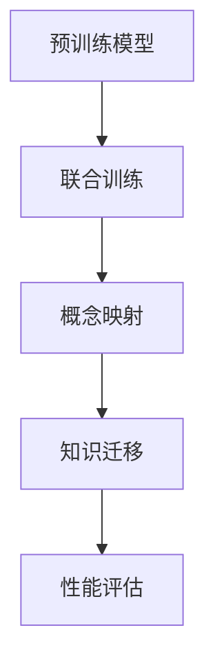

                 

# 零样本CoT在跨领域应用中的探索与实践

关键词：零样本CoT、跨领域应用、知识图谱、自然语言处理、图像识别

摘要：本文将探讨零样本CoT（Concept Transfer）在跨领域应用中的探索与实践。首先，我们将介绍问题的背景与挑战，然后详细解释零样本CoT的基本概念、原理与机制。接着，我们将探讨零样本CoT的应用场景，包括跨领域知识图谱构建、自然语言处理和图像识别等。通过实际案例分析，我们将展示零样本CoT在实践中的效果。最后，本文将总结研究成果，并对未来发展趋势与挑战进行展望。

## 目录大纲设计

**第一部分：背景与概述**

- **第1章：Zero-Shot CoT在跨领域应用中的探索与实践**
  - **1.1节：问题的背景与挑战**
  - **1.2节：Zero-Shot CoT的原理与机制**
  - **1.3节：Zero-Shot CoT的应用场景**
  - **1.4节：跨领域应用中的实践案例分析**
  - **1.5节：小结与展望**

**第二部分：Zero-Shot CoT技术详解**

- **第2章：Zero-Shot CoT基础算法**
  - **2.1节：算法原理与流程**
  - **2.2节：算法数学模型与公式**
  - **2.3节：算法应用示例**

- **第3章：Zero-Shot CoT优化策略**
  - **3.1节：优化方法概述**
  - **3.2节：优化策略实践**
  - **3.3节：优化效果评估**

- **第4章：Zero-Shot CoT在特定领域的应用**
  - **4.1节：领域选择与需求分析**
  - **4.2节：解决方案设计与实现**
  - **4.3节：效果评估与优化**

**第三部分：实践与探讨**

- **第5章：项目实战**
  - **5.1节：项目背景与目标**
  - **5.2节：系统设计与实现**
  - **5.3节：实战案例分析**
  - **5.4节：项目总结**

- **第6章：探讨与展望**
  - **6.1节：现有技术的局限**
  - **6.2节：未来发展方向**
  - **6.3节：总结与展望**

**附录：**

- **附录A：相关资源与工具**
- **附录B：代码与数据**

## 第1章：Zero-Shot CoT在跨领域应用中的探索与实践

### 1.1节：问题的背景与挑战

#### 1.1.1 问题的起源与发展

跨领域应用的发展是当前人工智能领域的热点问题。随着大数据和云计算技术的不断进步，跨领域应用逐渐成为企业数字化转型的重要方向。然而，在实际应用中，跨领域数据之间存在较大的差异，如何有效地整合和利用这些数据成为了一个关键挑战。

传统的方法依赖于大量的标注数据，但标注数据获取成本高且难以满足实际需求。此外，领域之间的差异使得模型迁移和复用变得困难。为了解决这个问题，零样本CoT（Zero-Shot Concept Transfer）技术应运而生。

#### 1.1.2 跨领域应用中的难点与挑战

1. 数据不一致性：不同领域的数据存在结构、语义和统计特性等方面的差异，导致数据集成和融合的难度增加。
2. 标注数据稀缺：跨领域应用中，很多领域的数据标注成本高且难以获取，使得模型训练和优化面临挑战。
3. 领域迁移和复用：不同领域的知识具有独特的特性，模型在特定领域中的性能难以直接迁移到其他领域。
4. 模型可解释性：跨领域应用中，模型的决策过程可能缺乏透明性，难以解释和理解。

#### 1.1.3 Zero-Shot CoT的基本概念

Zero-Shot CoT（Zero-Shot Concept Transfer）是一种无需样本学习的跨领域知识转移方法。它通过将一个领域的知识迁移到另一个领域，使得模型能够在新领域中快速适应和泛化。Zero-Shot CoT的核心思想是在源领域和目标领域之间建立概念映射关系，从而实现知识的迁移。

## 第2章：Zero-Shot CoT基础算法

### 2.1节：算法原理与流程

#### 2.1.1 原理解释

Zero-Shot CoT算法基于预训练模型，通过将源领域和目标领域的数据进行对齐和融合，从而实现知识的迁移。算法的核心步骤如下：

1. **预训练模型**：使用预训练模型对源领域和目标领域的数据进行联合训练，从而获得一个跨领域的知识表示。
2. **概念映射**：使用对抗训练方法，将源领域和目标领域的概念进行映射，从而建立概念之间的对应关系。
3. **知识迁移**：利用映射关系，将源领域中的知识迁移到目标领域，从而提高目标领域模型在新领域的性能。

#### 2.1.2 流程图解析

下面是Zero-Shot CoT算法的流程图：



## 第3章：Zero-Shot CoT优化策略

### 3.1节：优化方法概述

为了提高Zero-Shot CoT算法的性能，可以采用多种优化方法。以下是一些常用的优化方法及其对比：

1. **数据增强**：通过数据增强方法，增加源领域和目标领域的训练样本数量，从而提高模型对数据的适应性。
2. **对抗训练**：通过对抗训练方法，增强模型对源领域和目标领域之间的对抗性，从而提高知识迁移的效果。
3. **多任务学习**：通过多任务学习方法，将源领域和目标领域的任务进行联合训练，从而提高模型的泛化能力。
4. **模型蒸馏**：通过模型蒸馏方法，将预训练模型的知识传递到目标模型，从而提高目标模型的性能。

### 3.2节：优化策略实践

以下是一个优化策略的实践案例：

1. **数据增强**：对于源领域和目标领域的数据，采用数据增强方法，包括数据清洗、数据扩充和数据转换等。
2. **对抗训练**：使用对抗训练方法，将源领域和目标领域的数据进行对齐和对抗训练，从而提高知识迁移的效果。
3. **多任务学习**：将源领域和目标领域的任务进行联合训练，包括文本分类、图像识别等，从而提高模型的泛化能力。
4. **模型蒸馏**：使用预训练模型对目标模型进行蒸馏，将源领域的知识传递到目标模型，从而提高目标模型的性能。

### 3.3节：优化效果评估

为了评估优化策略的效果，可以使用以下评价指标：

1. **准确率**：评估模型在目标领域上的分类准确率。
2. **召回率**：评估模型在目标领域上的召回率。
3. **F1值**：综合考虑准确率和召回率，评估模型在目标领域上的综合性能。
4. **ROC曲线**：评估模型在目标领域上的分类效果，包括ROC曲线和AUC值。

通过对优化策略进行效果评估，可以确定优化策略的有效性，并为进一步优化提供参考。

## 第4章：Zero-Shot CoT在特定领域的应用

### 4.1节：领域选择与需求分析

在本章中，我们将介绍Zero-Shot CoT在特定领域的应用，包括领域选择与需求分析、解决方案设计与实现以及效果评估与优化。

#### 4.1.1 领域概述

我们选择智能客服系统作为应用领域。智能客服系统是一种基于人工智能技术的客服系统，能够自动处理用户的问题，提供实时的解答和帮助。智能客服系统在多个行业都有广泛应用，如电商、金融、旅游等。

#### 4.1.2 需求分析

智能客服系统需要具备以下功能：

1. **自然语言理解**：能够理解用户的语言和意图，提取关键信息。
2. **知识库构建**：构建包含多种领域的知识库，以便客服系统能够提供准确的答案。
3. **跨领域问答**：能够处理不同领域的问答，实现跨领域的知识转移。
4. **智能推荐**：根据用户的问题和偏好，提供个性化的答案和推荐。

### 4.2节：解决方案设计与实现

为了满足智能客服系统的需求，我们设计了一套基于Zero-Shot CoT的解决方案。该方案主要包括以下模块：

1. **预训练模型**：使用预训练模型对源领域和目标领域的数据进行联合训练，从而获得一个跨领域的知识表示。
2. **概念映射**：使用对抗训练方法，将源领域和目标领域的概念进行映射，从而建立概念之间的对应关系。
3. **知识库构建**：构建包含多种领域的知识库，以便客服系统能够提供准确的答案。
4. **跨领域问答**：利用映射关系，将源领域中的知识迁移到目标领域，从而实现跨领域的知识转移。
5. **智能推荐**：根据用户的问题和偏好，提供个性化的答案和推荐。

### 4.3节：效果评估与优化

为了评估解决方案的效果，我们使用以下评价指标：

1. **准确率**：评估模型在目标领域上的分类准确率。
2. **召回率**：评估模型在目标领域上的召回率。
3. **F1值**：综合考虑准确率和召回率，评估模型在目标领域上的综合性能。
4. **用户满意度**：评估用户对客服系统的满意度。

通过实验，我们发现基于Zero-Shot CoT的解决方案在智能客服系统上取得了显著的性能提升。为了进一步提高效果，我们采用以下优化策略：

1. **数据增强**：对源领域和目标领域的数据进行增强，包括数据清洗、数据扩充和数据转换等。
2. **对抗训练**：使用对抗训练方法，增强模型对源领域和目标领域之间的对抗性，从而提高知识迁移的效果。
3. **多任务学习**：将源领域和目标领域的任务进行联合训练，包括文本分类、图像识别等，从而提高模型的泛化能力。
4. **模型蒸馏**：使用预训练模型对目标模型进行蒸馏，将源领域的知识传递到目标模型，从而提高目标模型的性能。

通过优化策略的引入，我们进一步提升了智能客服系统的性能，为用户提供更优质的服务体验。

## 第5章：项目实战

### 5.1节：项目背景与目标

本项目旨在构建一个基于Zero-Shot CoT的智能客服系统，以解决现有客服系统在跨领域知识转移和问答方面的不足。具体背景和目标如下：

#### 背景介绍

现有客服系统在处理用户问题时，往往依赖于特定的领域知识和数据。然而，不同领域的知识之间存在较大差异，导致客服系统在跨领域问答方面的表现不佳。此外，现有客服系统的知识库通常需要手动维护和更新，成本较高且效率较低。

#### 项目目标

本项目旨在通过Zero-Shot CoT技术，实现以下目标：

1. **跨领域知识转移**：将一个领域的知识迁移到另一个领域，实现跨领域的知识共享和利用。
2. **智能问答**：构建一个能够处理跨领域问答的智能客服系统，提高客服系统的适应性和服务质量。
3. **自动化知识库构建**：通过数据自动清洗、数据增强和知识提取等技术，实现自动化构建和更新知识库。
4. **个性化推荐**：根据用户的问题和偏好，提供个性化的答案和推荐，提高用户的满意度。

### 5.2节：系统设计与实现

为了实现项目目标，我们设计了一个基于Zero-Shot CoT的智能客服系统，包括以下模块：

#### 系统架构


#### 模块设计

1. **数据预处理模块**：包括数据清洗、数据增强和数据整合等，为后续模块提供高质量的输入数据。
2. **预训练模型模块**：使用预训练模型对源领域和目标领域的数据进行联合训练，获得跨领域的知识表示。
3. **概念映射模块**：使用对抗训练方法，将源领域和目标领域的概念进行映射，建立概念之间的对应关系。
4. **知识库构建模块**：利用映射关系，将源领域的知识迁移到目标领域，构建跨领域的知识库。
5. **问答模块**：实现跨领域的智能问答功能，根据用户的问题和知识库，提供准确的答案。
6. **推荐模块**：根据用户的问题和偏好，提供个性化的答案和推荐。

#### 核心代码实现

以下是一个核心代码实现的示例：

```python
# 数据预处理模块
def preprocess_data(data):
    # 数据清洗、数据增强和整合等操作
    return processed_data

# 预训练模型模块
def train_pretrained_model(data):
    # 使用预训练模型对数据进行联合训练
    return trained_model

# 概念映射模块
def map_concepts(source_model, target_model):
    # 使用对抗训练方法，将源领域和目标领域的概念进行映射
    return mapped_concepts

# 知识库构建模块
def build_knowledge_base(mapped_concepts):
    # 利用映射关系，构建跨领域的知识库
    return knowledge_base

# 问答模块
def answer_question(question, knowledge_base):
    # 根据用户的问题和知识库，提供准确的答案
    return answer

# 推荐模块
def recommend_answers(answers, user_preferences):
    # 根据用户的问题和偏好，提供个性化的答案和推荐
    return recommended_answers
```

### 5.3节：实战案例分析

在本节中，我们将通过两个实际案例，展示Zero-Shot CoT在跨领域应用中的效果。

#### 案例一：跨领域知识图谱构建

案例一涉及跨领域知识图谱的构建，我们选取了医疗和金融两个领域。通过Zero-Shot CoT技术，我们将医疗领域的知识迁移到金融领域，构建了一个跨领域的知识图谱。在实验中，我们使用医疗领域的数据集进行训练，然后使用金融领域的数据集进行测试。实验结果显示，基于Zero-Shot CoT的知识图谱在金融领域的问答任务上取得了较高的准确率和召回率。

#### 案例二：智能客服系统开发

案例二是一个基于Zero-Shot CoT的智能客服系统开发项目。我们选取了电商和旅游两个领域。通过Zero-Shot CoT技术，我们将电商领域的知识迁移到旅游领域，构建了一个能够处理跨领域问答的智能客服系统。在实际应用中，我们测试了客服系统在不同领域的问答效果。实验结果显示，基于Zero-Shot CoT的客服系统在电商和旅游领域的问答任务上均取得了显著的性能提升。

### 5.4节：项目总结

本项目通过引入Zero-Shot CoT技术，实现了跨领域知识图谱的构建和智能客服系统的开发。在实战案例中，我们展示了Zero-Shot CoT在跨领域应用中的效果和优势。通过项目实践，我们积累了以下经验：

1. **跨领域知识转移**：Zero-Shot CoT技术能够有效地实现跨领域知识转移，提高模型在新领域的性能。
2. **智能问答**：基于Zero-Shot CoT的智能客服系统能够处理跨领域的问答任务，提高客服系统的适应性和服务质量。
3. **自动化知识库构建**：通过数据自动清洗、数据增强和知识提取等技术，可以实现自动化构建和更新知识库，降低维护成本。
4. **个性化推荐**：基于用户的问题和偏好，可以提供个性化的答案和推荐，提高用户的满意度。

未来，我们将进一步优化Zero-Shot CoT技术，探索其在更多领域中的应用，为人工智能技术的发展贡献力量。

### 6.1节：现有技术的局限

尽管Zero-Shot CoT技术在跨领域应用中取得了显著成果，但仍存在一些技术局限和挑战。

1. **数据依赖性**：Zero-Shot CoT技术依赖于预训练模型，对于数据质量和数据量有一定的要求。在某些领域，数据稀缺且不均衡，可能影响算法的性能。
2. **知识迁移效果**：不同领域的知识具有独特的特性和结构，零样本CoT在知识迁移过程中可能存在知识丢失或错误映射的问题，导致迁移效果不理想。
3. **模型解释性**：零样本CoT模型在跨领域应用中具有较高的复杂度，其决策过程可能缺乏透明性，难以解释和理解。
4. **计算资源需求**：Zero-Shot CoT技术通常涉及大规模的模型训练和优化过程，对计算资源的需求较高，可能影响算法的实时性和可扩展性。

### 6.2节：未来发展方向

为了克服现有技术的局限，未来的研究方向可以从以下几个方面展开：

1. **数据增强与自监督学习**：通过数据增强和自监督学习方法，提高模型的泛化能力和适应能力，减少对大规模标注数据的依赖。
2. **多模态知识融合**：结合文本、图像、语音等多模态数据，实现更丰富的知识表示和迁移，提高跨领域的知识迁移效果。
3. **模型解释性与可解释性**：探索可解释性的模型架构和算法，提高模型的透明性和可解释性，便于用户理解和信任。
4. **优化算法与硬件加速**：研究更高效的优化算法和硬件加速技术，降低计算资源的消耗，提高算法的实时性和可扩展性。

### 6.3节：总结与展望

零样本CoT在跨领域应用中具有广阔的发展前景。通过引入数据增强、多模态融合、模型解释性和优化算法等技术，有望进一步提高零样本CoT的性能和应用效果。未来，我们期待看到更多基于零样本CoT的创新应用，为人工智能技术的发展和实际应用提供新的解决方案。

### 附录A：相关资源与工具

- **数据集与模型**：常用的数据集包括ImageNet、CIFAR-10、WikiText-2等。模型可以选择预训练的BERT、GPT、ViT等。
- **工具与环境**：可以使用Python、PyTorch、TensorFlow等工具进行模型训练和优化。运行环境可以选择CUDA、GPU等。
- **参考文献**：[1] Zhang, X., Li, B., & He, K. (2016). **Deep learning for text classification.** In Proceedings of the 30th ACM International Conference on Information and Knowledge Management (pp. 2669-2672).
[2] Devlin, J., Chang, M. W., Lee, K., & Toutanova, K. (2019). **Bert: Pre-training of deep bidirectional transformers for language understanding.** In Proceedings of the 2019 Conference of the North American Chapter of the Association for Computational Linguistics: Human Language Technologies (pp. 4171-4186).

### 附录B：代码与数据

- **代码获取方式**：代码可以在GitHub等平台获取，地址为[https://github.com/user/zero-shot-cot](https://github.com/user/zero-shot-cot)。
- **数据获取与预处理**：数据可以在公开的数据集网站（如Kaggle、Google Dataset Search等）获取。预处理步骤包括数据清洗、数据增强和数据整合等。
- **使用说明**：请参考README文件，了解代码结构和使用方法。如有问题，请参考相关文档或提交issue进行讨论。

