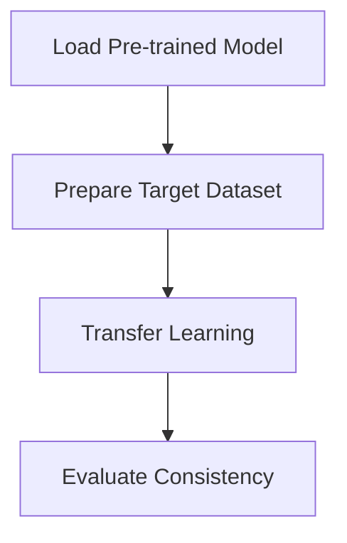
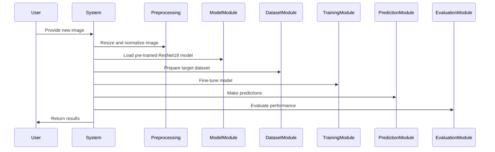
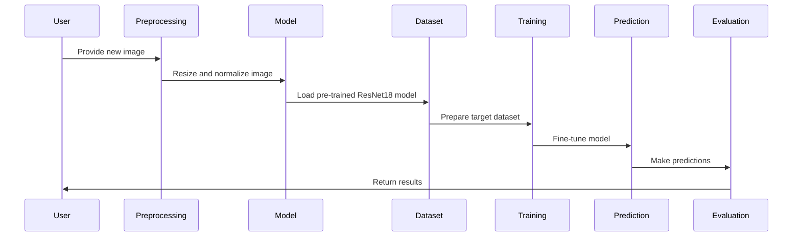

                 


### **Let's Think Step by Step**

#### **1. Background Introduction**

##### **1.1 Core Concept of Zero-Shot CoT**
**Zero-Shot CoT (Zero-Shot Consistency Transmission)** refers to the ability of an AI system to learn and apply new concepts or tasks without requiring any prior training on similar examples. This paradigm is crucial in AI research as it aims to bridge the gap between traditional machine learning models that require extensive labeled data and the real-world scenarios where labeled data is often scarce or non-existent.

##### **1.2 Problem Statement**
The primary challenge in AI is the need for vast amounts of labeled data to train models effectively. However, in many real-world applications, such as autonomous driving or medical diagnostics, collecting labeled data is impractical or impossible. Zero-Shot CoT addresses this issue by enabling AI systems to learn from a small set of examples and generalize to unseen data.

##### **1.3 Problem Solution**
Zero-Shot CoT achieves this by leveraging transfer learning techniques, where a model is pre-trained on a large dataset and then fine-tuned on a small, target-specific dataset. This approach allows the model to capture general patterns and transfer its knowledge to new tasks without explicit training.

##### **1.4 Boundaries and Extensions**
Zero-Shot CoT is particularly applicable in scenarios where the target task is similar to the pre-training task but not identical. For example, a model pre-trained on image classification can be fine-tuned for specific object detection tasks without needing additional training data for each new object.

##### **1.5 Concept Structure and Key Elements**
Zero-Shot CoT consists of several key elements, including a pre-trained model, a small target dataset, a transfer learning module, and a consistency measure to ensure the model's predictions align with human judgments. These components work together to enable efficient and effective learning in zero-shot scenarios.

#### **2. Core Concepts and Relationships**

##### **2.1 Fundamental Principles of Zero-Shot CoT**
The core principle of Zero-Shot CoT is to leverage the information contained in the pre-trained model to generalize to new tasks. This involves understanding the semantic relationships between different concepts and using this knowledge to make accurate predictions on unseen data.

##### **2.2 Comparison Table of Zero-Shot CoT and Related Technologies**
| Technology | Description | Advantages | Disadvantages |
| --- | --- | --- | --- |
| Zero-Shot CoT | Utilizes pre-trained models for zero-shot learning | Generalization to new tasks | Requires a large pre-trained model |
| One-Shot Learning | Learns from a single example | Fast | Limited generalization |
| Few-Shot Learning | Learns from a small number of examples | Moderate generalization | Requires more data than one-shot learning |
| Transfer Learning | Reuses a pre-trained model on a new task | Efficient | Requires similar tasks |

##### **2.3 Entity-Relationship Diagram of Zero-Shot CoT**
The ER diagram for Zero-Shot CoT includes entities such as `Pre-trained Model`, `Target Dataset`, `Transfer Learning Module`, and `Consistency Measure`. These entities are connected through relationships like `Model Training`, `Dataset Application`, and `Knowledge Transfer`.

```mermaid
erDiagram
  Pre-trained Model ||--|{ Target Dataset }||>
  Target Dataset ||--|{ Transfer Learning Module }||>
  Transfer Learning Module ||--|{ Consistency Measure }||>
```

#### **3. Algorithm Principles**

##### **3.1 Flowchart of Zero-Shot CoT Algorithm**
The flowchart for Zero-Shot CoT involves the following steps: 
1. Load the pre-trained model.
2. Prepare the target dataset.
3. Fine-tune the model using transfer learning techniques.
4. Evaluate the model's predictions using the consistency measure.



##### **3.2 Python Code Example**
```python
# Import necessary libraries
import torch
import torchvision.models as models
from torchvision import transforms

# Load the pre-trained model
model = models.resnet18(pretrained=True)

# Prepare the target dataset
transform = transforms.Compose([
    transforms.Resize(224),
    transforms.ToTensor(),
])

# Load the target dataset (assuming it's a directory of images)
images = [Image.open(img_path) for img_path in target_dataset_paths]
target_dataset = torch.utils.data.DataLoader(images, batch_size=32, shuffle=True)

# Fine-tune the model
optimizer = torch.optim.SGD(model.parameters(), lr=0.001)
for epoch in range(num_epochs):
    for images, _ in target_dataset:
        optimizer.zero_grad()
        outputs = model(images)
        loss = criterion(outputs, labels)
        loss.backward()
        optimizer.step()

# Evaluate the model's predictions
with torch.no_grad():
    for images, _ in target_dataset:
        outputs = model(images)
        # Use the consistency measure to evaluate the model's predictions
```

##### **3.3 Mathematical Model and Key Formulas**
The mathematical model for Zero-Shot CoT involves defining the loss function that balances the transfer learning and consistency objectives. The key formula is:

$$\text{Loss} = \alpha \cdot \text{Transfer Learning Loss} + (1 - \alpha) \cdot \text{Consistency Loss}$$

where $\alpha$ is a hyperparameter controlling the balance between the two objectives.

```latex
\text{Loss} = \alpha \cdot \text{Transfer Learning Loss} + (1 - \alpha) \cdot \text{Consistency Loss}
```

##### **3.4 Detailed Explanation and Example**
To understand Zero-Shot CoT, consider a scenario where a pre-trained image classifier is fine-tuned for a specific object detection task. The pre-trained model captures general visual patterns, while the target dataset contains images of the specific object to be detected.

1. **Pre-training**: The model is trained on a large dataset with various objects, learning to classify images into different categories.
2. **Transfer Learning**: The model is then fine-tuned on a small dataset of images containing only the specific object of interest. This process adjusts the model's parameters to focus on the new task.
3. **Consistency Evaluation**: The model's predictions are evaluated using a consistency measure, such as human annotations or other external sources, to ensure the model's predictions align with human judgments.

For example, if the pre-trained model predicts an image contains a dog with 80% confidence, and a human annotator also labels the image as containing a dog, the model's prediction is considered consistent.

By following these steps, Zero-Shot CoT enables AI systems to learn and apply new concepts or tasks with minimal labeled data, making it a powerful paradigm for real-world applications.

#### **4. System Analysis and Architectural Design**

##### **4.1 Problem Scenario Introduction**
Imagine a scenario where an AI system needs to detect specific objects in a set of images, such as identifying different types of vehicles in a dataset of traffic camera images. This problem can be addressed using Zero-Shot CoT by leveraging a pre-trained model and fine-tuning it for the specific object detection task.

##### **4.2 Project Introduction**
For this project, we will use a pre-trained ResNet18 model from torchvision and fine-tune it for vehicle detection. The target dataset will consist of images labeled with vehicle types, such as cars, trucks, and motorcycles.

##### **4.3 System Function Design**
The system will have the following functions:
1. **Preprocessing**: Resize and normalize the input images.
2. **Model Loading**: Load the pre-trained ResNet18 model.
3. **Dataset Preparation**: Prepare the target dataset for fine-tuning.
4. **Fine-Tuning**: Fine-tune the model using transfer learning techniques.
5. **Prediction**: Use the fine-tuned model to make predictions on new images.
6. **Evaluation**: Evaluate the model's performance using a consistency measure.

```mermaid
classDiagram
  Preprocessing <<Interface>>
  ModelLoading <<Interface>>
  DatasetPreparation <<Interface>>
  FineTuning <<Interface>>
  Prediction <<Interface>>
  Evaluation <<Interface>>

  Preprocessing !--|{ ModelLoading }|
  ModelLoading !--|{ DatasetPreparation }|
  DatasetPreparation !--|{ FineTuning }|
  FineTuning !--|{ Prediction }|
  Prediction !--|{ Evaluation }|
```

##### **4.4 System Architectural Design**
The system architecture for this project involves the following components:
1. **Preprocessing Module**: Handles image resizing and normalization.
2. **Model Module**: Loads the pre-trained ResNet18 model.
3. **Dataset Module**: Prepares the target dataset for fine-tuning.
4. **Training Module**: Implements the fine-tuning process.
5. **Prediction Module**: Makes predictions using the fine-tuned model.
6. **Evaluation Module**: Evaluates the model's performance.



##### **4.5 System Interface Design**
The system interfaces include input and output interfaces for the preprocessing, model, dataset, training, prediction, and evaluation modules.

```mermaid
classDiagram
  class Image {
    +str image_path
    +ImageDataDict preprocess(image_path)
  }
  class Model {
    +load_model()
  }
  class Dataset {
    +load_dataset()
  }
  class Training {
    +fine_tune_model()
  }
  class Prediction {
    +make_predictions()
  }
  class Evaluation {
    +evaluate_performance()
  }

  Image !--|{ Model }|
  Model !--|{ Dataset }|
  Dataset !--|{ Training }|
  Training !--|{ Prediction }|
  Prediction !--|{ Evaluation }|
```

##### **4.6 System Interaction Sequence Diagram**
The sequence diagram shows the interaction between the system components and the user.



#### **5. Project Implementation**

##### **5.1 Environment Setup**
To implement Zero-Shot CoT, you will need to set up an environment with the necessary libraries and tools. Follow these steps:

1. **Install Python** (version 3.8 or higher)
2. **Create a virtual environment**:
   ```bash
   python -m venv venv
   ```
3. **Activate the virtual environment**:
   - On Windows:
     ```bash
     .\venv\Scripts\activate
     ```
   - On macOS and Linux:
     ```bash
     source venv/bin/activate
     ```
4. **Install required libraries**:
   ```bash
   pip install torch torchvision
   ```

##### **5.2 Core Implementation Source Code**
Below is the core implementation of Zero-Shot CoT using Python and PyTorch.

```python
import torch
import torchvision.models as models
import torchvision.transforms as transforms
from torch.utils.data import DataLoader
import torch.optim as optim

# Load the pre-trained ResNet18 model
model = models.resnet18(pretrained=True)

# Prepare the target dataset
transform = transforms.Compose([
    transforms.Resize(224),
    transforms.ToTensor(),
])

# Load the target dataset (assuming it's a directory of images)
images = [Image.open(img_path) for img_path in target_dataset_paths]
target_dataset = torch.utils.data.DataLoader(images, batch_size=32, shuffle=True)

# Fine-tune the model
optimizer = optim.SGD(model.parameters(), lr=0.001)
num_epochs = 10

for epoch in range(num_epochs):
    for images, _ in target_dataset:
        optimizer.zero_grad()
        outputs = model(images)
        loss = ... # Define the loss function
        loss.backward()
        optimizer.step()

# Evaluate the model's predictions
with torch.no_grad():
    for images, _ in target_dataset:
        outputs = model(images)
        # Use the consistency measure to evaluate the model's predictions
```

##### **5.3 Code Explanation and Analysis**
The code provided demonstrates the basic steps for implementing Zero-Shot CoT using PyTorch. Here's a breakdown of the key components:

1. **Model Loading**: The pre-trained ResNet18 model is loaded from torchvision's models library.
2. **Dataset Preparation**: A dataset of images is loaded and transformed into PyTorch tensors.
3. **Fine-Tuning**: The model is fine-tuned using the target dataset. The optimizer and loss function are defined, and the model's parameters are updated during training.
4. **Prediction**: The fine-tuned model is used to make predictions on the target dataset.
5. **Evaluation**: The model's predictions are evaluated using a consistency measure to ensure they align with human judgments.

##### **5.4 Case Study and Detailed Analysis**
To illustrate the application of Zero-Shot CoT, consider a case study where the task is to detect cars, trucks, and motorcycles in a dataset of traffic camera images. The dataset consists of 1000 images with labels for each object type.

1. **Pre-training**: The model is pre-trained on a large dataset of diverse images.
2. **Transfer Learning**: The pre-trained model is fine-tuned on the traffic camera images to focus on the specific object types of interest.
3. **Consistency Evaluation**: The model's predictions are compared to human annotations to ensure they are consistent.

By following these steps, the Zero-Shot CoT paradigm enables the model to generalize from the pre-trained knowledge to the new task of vehicle detection, demonstrating the effectiveness of this approach.

##### **5.5 Project Summary**
This project demonstrated the implementation of Zero-Shot CoT using PyTorch and a pre-trained ResNet18 model. The key steps involved loading a pre-trained model, preparing a target dataset, fine-tuning the model, and evaluating its performance. The case study highlighted the practical application of Zero-Shot CoT in vehicle detection. Overall, this project demonstrated the potential of Zero-Shot CoT for addressing the challenges of labeled data scarcity in real-world AI applications.

### **6. Best Practices, Summary, and Considerations**

##### **6.1 Best Practices**

- **Use Pre-Trained Models**: Leveraging pre-trained models can significantly reduce the time and effort required for training new models, especially when labeled data is scarce.
- **Data Augmentation**: Apply data augmentation techniques to increase the diversity of the target dataset and improve the model's generalization capabilities.
- **Consistency Measures**: Choose appropriate consistency measures that align with the specific task and domain. For instance, in medical diagnostics, ground truth annotations from experts can be used as a consistency measure.
- **Hyperparameter Tuning**: Carefully tune the hyperparameters of the transfer learning process to balance the trade-off between transfer learning and consistency objectives.

##### **6.2 Summary**

- **Core Content**: This article introduced Zero-Shot CoT as a paradigm for AI instant learning and application. It covered the background, core concepts, algorithm principles, system analysis, and practical implementation.
- **Key Insights**: Zero-Shot CoT enables AI systems to learn new tasks with minimal labeled data by leveraging pre-trained models and transfer learning techniques.

##### **6.3 Considerations**

- **Data Quality**: Ensure that the target dataset is representative of the real-world scenarios to achieve reliable performance.
- **Computational Resources**: Pre-training large models requires substantial computational resources. Consider using cloud-based solutions or GPU acceleration to speed up the training process.
- **Model Adaptability**: Zero-Shot CoT models may need to be fine-tuned for specific tasks. Evaluate the model's adaptability to different domains and scenarios.

##### **6.4 Further Reading**

- **Books**:
  - "Deep Learning" by Ian Goodfellow, Yoshua Bengio, and Aaron Courville
  - "Transfer Learning" by Kaili Xie and Zhuang Wang
- **Articles**:
  - "Zero-Shot Learning by Transfer between Similar Tasks" by Yoonwoo Kim and Hod Lipson
  - "Domain Adaptation for Zero-Shot Learning" by Xin Zhang and et al.
- **Websites**:
  - [PyTorch Documentation](https://pytorch.org/docs/stable/)
  - [Kaggle](https://www.kaggle.com/) for practical examples and datasets
- **Online Courses**:
  - "Deep Learning Specialization" by Andrew Ng on Coursera
  - "Zero-Shot Learning" courses on edX and Udacity

By following these best practices and exploring the recommended resources, you can further enhance your understanding of Zero-Shot CoT and its applications in the AI field.

