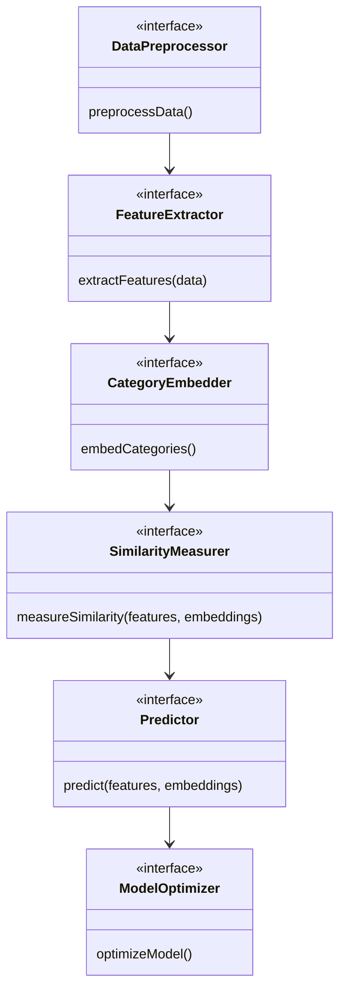
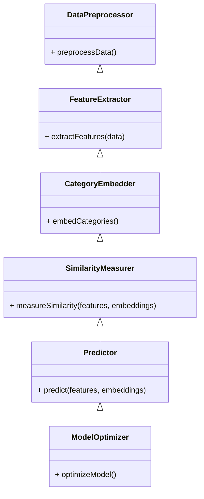
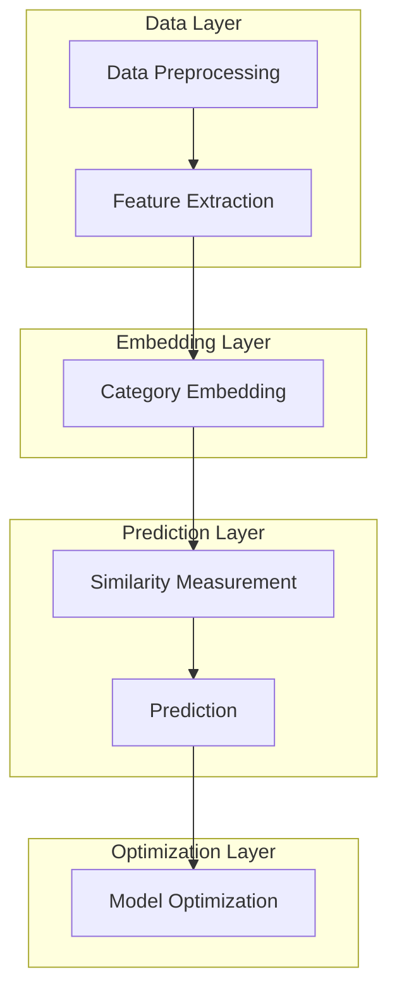
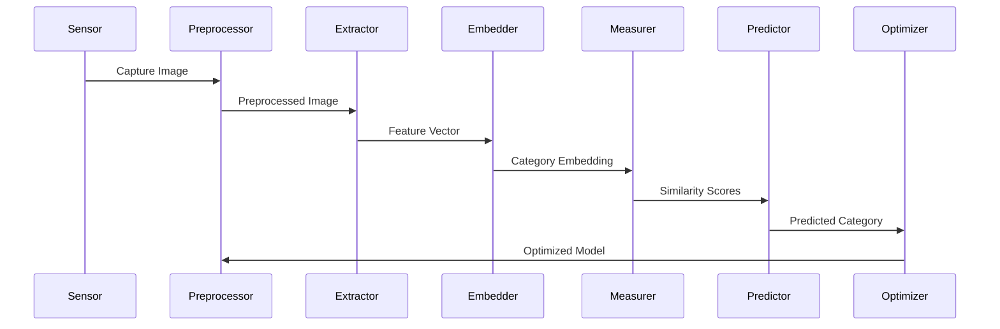
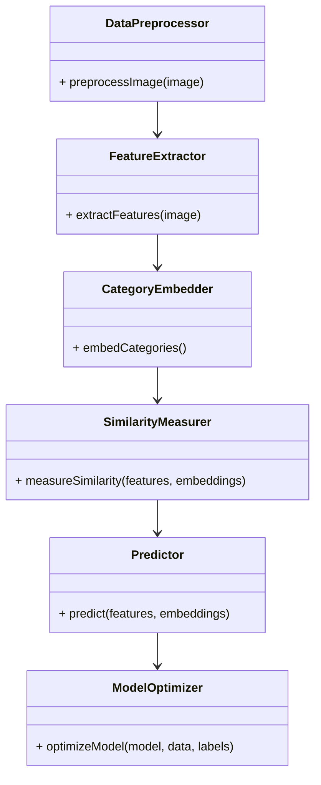
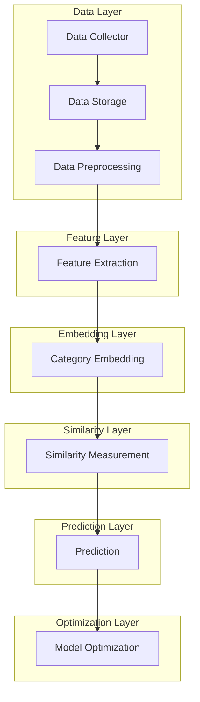

                 


### 第一步：构思文章框架

在撰写这篇文章之前，我们需要先构思出文章的整体框架，以确保文章的逻辑性和条理性。这篇文章将分为六个部分，分别是：

1. **背景介绍**：介绍零样本学习（Zero-Shot Learning，ZSL）的背景、问题和现有解决方案。
2. **核心概念与原理**：详细讲解零样本学习的核心概念和原理，包括相似性度量技术和图神经网络。
3. **算法原理与实现**：介绍零样本学习的算法原理，使用mermaid画出流程图，并使用Python代码进行解释。
4. **应用案例与实战**：通过实际案例展示零样本学习的应用，并进行分析和讲解。
5. **系统架构与设计**：介绍零样本学习系统的架构设计，包括系统功能设计、系统架构设计、系统接口设计和系统交互设计。
6. **最佳实践与总结**：总结零样本学习的最佳实践，并对未来发展趋势进行展望。

### 第二步：撰写背景介绍部分

**1.1 问题背景**

- **问题来源**：随着人工智能技术的不断发展，计算机视觉、自然语言处理等领域对数据的需求越来越大。然而，数据获取往往是一个复杂且成本高昂的过程。这就催生了零样本学习的研究，它可以在没有或只有少量标注数据的情况下进行学习。
- **问题定义**：零样本学习旨在使机器学习模型能够处理未见过的类别，即在没有训练数据的情况下，能够对新类别进行预测。
- **解决方案概述**：现有零样本学习的研究主要集中在利用先验知识、迁移学习和基于模型的元学习等方法。

**1.2 问题描述**

- **传统方法局限性**：传统的机器学习方法在处理未见类别时存在局限性，难以在多样性和复杂性的环境中表现。
- **零样本学习挑战**：零样本学习面临的主要挑战包括如何有效地利用先验知识、如何度量相似性和如何适应新类别。
- **研究现状与问题**：虽然已有一些研究成果，但零样本学习在性能、效率和泛化能力上仍存在许多问题。

**1.3 问题解决**

- **零样本学习定义**：零样本学习是一种机器学习方法，它允许模型在没有直接监督数据的情况下对未知类别进行预测。
- **零样本学习优势**：零样本学习能够减少对大规模标注数据的依赖，提高模型在现实世界中的适应性。
- **技术发展路径**：零样本学习的发展路径包括改进相似性度量、探索新的模型架构和优化训练策略。

### 第三步：撰写核心概念与原理部分

**2.1 零样本学习原理**

- **2.1.1 零样本学习基础**：介绍零样本学习的定义、基本概念和常见类型。
- **2.1.2 零样本学习分类**：根据学习方法的不同，将零样本学习分为基于原型、基于嵌入和基于模型的方法。
- **2.1.3 零样本学习算法架构**：分析零样本学习算法的一般架构，包括特征提取、相似性度量、预测和模型优化。

**2.2 相似性度量技术**

- **2.2.1 相似性度量基础**：介绍相似性度量的基本概念、方法和作用。
- **2.2.2 常见相似性度量方法**：讨论基于距离、基于概率和基于信息论的各种相似性度量方法。
- **2.2.3 相似性度量在零样本学习中的应用**：阐述相似性度量在零样本学习中的作用和实现方法。

**2.3 图神经网络**

- **2.3.1 图神经网络基本概念**：介绍图神经网络的基本概念、特点和适用范围。
- **2.3.2 图神经网络在零样本学习中的应用**：讨论图神经网络在零样本学习中的应用场景和优势。
- **2.3.3 图神经网络与其他技术的融合**：分析图神经网络与其他人工智能技术的融合方式，如与深度学习和迁移学习的结合。

### 第四步：撰写算法原理与实现部分

**3.1 算法原理讲解**

- **3.1.1 零样本学习算法概述**：介绍零样本学习算法的基本原理和分类。
- **3.1.2 零样本学习算法流程**：阐述零样本学习算法的一般流程，包括特征提取、模型训练、预测和评估。
- **3.1.3 零样本学习算法数学模型**：使用mermaid画出算法流程图，并使用Python代码进行详细解释。

**3.2 实现与代码示例**

- **3.2.1 环境准备**：介绍所需的编程环境和工具。
- **3.2.2 核心代码实现**：提供零样本学习算法的核心代码示例。
- **3.2.3 代码解读与分析**：对核心代码进行解读和分析，解释算法的实现细节。

**3.3 数学模型与公式**

- **3.3.1 数学模型介绍**：介绍零样本学习算法的数学模型，包括损失函数、优化目标和训练过程。
- **3.3.2 数学公式解释**：解释数学模型中的关键公式和参数。
- **3.3.3 举例说明**：通过具体例子说明数学模型的应用和计算过程。

### 第五步：撰写应用案例与实战部分

**4.1 应用案例介绍**

- **4.1.1 零样本学习应用领域案例**：介绍零样本学习在计算机视觉、自然语言处理和其他领域的应用案例。
- **4.1.2 案例分析**：对选定的应用案例进行详细分析，包括数据集、模型选择、实验设计和结果评估。
- **4.1.3 案例实现细节**：介绍案例的实现细节，包括数据处理、模型训练和预测。

**4.2 项目实战**

- **4.2.1 项目背景与目标**：介绍项目的背景、目标和预期成果。
- **4.2.2 系统设计与实现**：阐述项目的系统设计和实现过程，包括数据预处理、模型选择、训练和评估。
- **4.2.3 项目总结**：总结项目的主要成果、经验教训和未来改进方向。

### 第六步：撰写系统架构与设计部分

**5.1 系统功能设计**

- **5.1.1 领域模型介绍**：介绍系统的领域模型，包括关键概念和实体关系。
- **5.1.2 类图设计**：使用Mermaid绘制系统的类图，展示实体和关系。

**5.2 系统架构设计**

- **5.2.1 系统架构概述**：介绍系统的总体架构，包括主要组件和交互方式。
- **5.2.2 架构设计要点**：讨论系统架构设计的关键要点和设计原则。
- **5.2.3 系统架构图展示**：使用Mermaid绘制系统的架构图。

**5.3 系统接口设计**

- **5.3.1 接口设计原则**：介绍系统接口设计的基本原则和规范。
- **5.3.2 接口实现细节**：详细描述系统接口的实现细节，包括接口参数、数据格式和调用方法。
- **5.3.3 接口调用示例**：提供接口调用的示例代码，展示如何使用接口进行操作。

**5.4 系统交互设计**

- **5.4.1 交互流程设计**：设计系统的交互流程，包括用户操作、系统响应和数据流动。
- **5.4.2 交互设计细节**：详细描述交互设计中的细节，如用户界面、交互方式和反馈机制。
- **5.4.3 交互序列图展示**：使用Mermaid绘制系统的交互序列图，展示用户与系统之间的交互过程。

### 第七步：撰写最佳实践与总结部分

**6.1 最佳实践**

- **6.1.1 零样本学习应用建议**：提供零样本学习在实际应用中的建议和最佳实践。
- **6.1.2 技术实施注意事项**：讨论在实施零样本学习技术时需要注意的问题和挑战。
- **6.1.3 未来发展趋势**：展望零样本学习技术的发展趋势和潜在方向。

**6.2 小结**

- **6.2.1 全书总结**：对文章的主要内容进行总结，强调核心概念和关键点。
- **6.2.2 核心概念与关键点回顾**：回顾文章中提到的核心概念和关键点，确保读者能够理解。
- **6.2.3 研究与拓展方向**：提出进一步研究的方向和拓展可能性。

### 结尾

在文章的末尾，我们将附上参考文献，以感谢那些为我们提供知识和技术支持的专家学者。同时，我们将提供作者信息，包括作者姓名、所属机构以及相关的联系方式，以方便读者进一步交流和沟通。

通过这样的步骤，我们可以确保文章的逻辑清晰、内容详实，并且能够吸引读者的兴趣。接下来，我们将逐一填充每个部分的内容，完成这篇关于零样本学习的技术博客文章。 ## 第一部分：背景介绍

### 1.1 问题背景

在当今快速发展的信息技术时代，人工智能（AI）已经成为推动各行各业进步的重要力量。从计算机视觉到自然语言处理，再到语音识别和自动驾驶，AI的应用范围越来越广泛。然而，AI的发展也面临着一系列挑战，其中之一便是数据获取和处理的问题。

首先，让我们看看数据获取的困难。高质量、大规模的数据集是训练高效AI模型的基础。然而，数据的收集和标注往往需要大量的人力和时间，尤其是在领域特定数据稀缺的情况下。例如，医学图像的标注需要专业知识，而交通场景视频数据的标注则需要丰富的经验。这种高成本和高复杂度的数据获取过程，限制了AI技术的发展和应用。

其次，数据的多样性也是一个挑战。现实世界中的数据不仅量大，而且种类繁多。不同的应用场景需要不同类型的数据，例如，医疗诊断可能需要患者的历史记录和基因数据，而自动驾驶可能需要大量的交通视频和传感器数据。这种数据多样性要求AI模型具有广泛的适应性，以便在不同场景下都能表现优异。

针对这些问题，研究人员提出了零样本学习（Zero-Shot Learning，ZSL）这一概念。零样本学习旨在使机器学习模型能够在没有或只有少量标注数据的情况下，对未见过的类别进行预测。这一研究方向的提出，主要源于以下几个背景：

1. **数据稀缺**：许多领域（如医学、天文学）由于数据获取难度大，难以收集到足够的数据进行模型训练。零样本学习可以减少对大规模标注数据的依赖，从而在这些领域中应用。

2. **新类别识别**：在某些应用中，需要模型能够快速适应新的类别。例如，在自动驾驶系统中，车辆需要能够识别各种新型车辆和交通标志。零样本学习可以帮助模型在新类别出现时快速适应。

3. **迁移学习**：迁移学习是一种将一个任务学习到的知识应用到另一个相关任务中的方法。零样本学习可以作为迁移学习的一种特殊形式，利用已有知识来解决新问题。

4. **领域泛化**：零样本学习有助于提高模型的泛化能力，使其在不同领域和任务中都能表现良好。

综上所述，零样本学习的研究不仅有助于解决数据获取和处理的问题，还可以推动AI技术的进步和应用。接下来，我们将进一步探讨零样本学习的定义、核心问题和现有解决方案。

### 1.2 问题描述

#### 1.2.1 传统方法局限性

在传统的机器学习方法中，模型的训练和预测通常依赖于大量的标注数据。这种方法虽然能够在某些领域（如图像分类和语音识别）中取得显著的成果，但也存在明显的局限性。首先，传统方法在处理未见类别时效果不佳。当模型面对未在训练数据中出现的类别时，其预测性能通常会大幅下降，因为模型无法利用已有的知识进行有效推断。

其次，传统方法对数据的依赖性较强。大规模的标注数据不仅成本高昂，而且难以获取。在一些特定领域，如医学影像和天文学，数据的获取和处理过程极为复杂，这使得传统方法在这些领域中的应用受到很大限制。此外，传统方法在处理高维度数据时也面临计算效率的挑战，这进一步限制了其应用范围。

另外，传统方法在处理多样化数据时表现不佳。现实世界中的数据种类繁多，包括不同类型、不同来源和不同格式的数据。传统方法往往需要针对不同类型的数据进行专门的设计和优化，这增加了模型的复杂度和开发难度。而在零样本学习场景中，模型需要具备较强的泛化能力，能够处理各种未知类别和未知数据类型。

#### 1.2.2 零样本学习挑战

零样本学习的目标是在没有或只有少量标注数据的情况下，对未见过的类别进行预测。这一目标虽然看似简单，但实际上面临着诸多挑战。

1. **类别分布不平衡**：在零样本学习场景中，通常存在大量未见过的类别，而标注数据集中的类别分布往往是不平衡的。这导致模型在训练过程中难以充分利用已有数据，从而影响预测性能。

2. **先验知识利用**：零样本学习依赖于先验知识，如词向量、概念图谱和领域知识等。如何有效地利用这些先验知识，并在模型中融合这些信息，是一个关键问题。

3. **相似性度量**：在零样本学习中，模型需要根据特征相似性来对新类别进行预测。如何选择和设计合适的相似性度量方法，使得模型能够在未知类别中准确地进行预测，是一个重要的挑战。

4. **模型泛化能力**：零样本学习模型需要在多种不同领域和任务中表现良好。这要求模型具有强大的泛化能力，能够在未见过的类别和数据上实现准确的预测。

5. **计算效率**：零样本学习通常涉及复杂的特征提取和相似性计算，这可能导致计算效率较低。如何在保证预测准确性的同时，提高计算效率，是一个亟待解决的问题。

#### 1.2.3 研究现状与问题

尽管零样本学习领域已经取得了一些显著成果，但仍存在许多问题需要解决。

1. **性能提升**：现有零样本学习方法在性能上仍有很大提升空间。尤其是在处理高维度数据和多类别问题时，模型的预测性能有待进一步提高。

2. **泛化能力**：虽然零样本学习模型在一些特定领域取得了较好的效果，但其在实际应用中的泛化能力仍然有限。如何设计具有更强泛化能力的模型，是一个重要的研究方向。

3. **效率优化**：零样本学习通常涉及大量的计算，这使得模型在实时应用中面临效率问题。如何优化算法，提高计算效率，是一个关键问题。

4. **应用领域拓展**：零样本学习在计算机视觉和自然语言处理等领域取得了较好的应用成果，但在其他领域（如生物信息学和化学）中的应用仍有待进一步探索。

5. **理论和实践的结合**：零样本学习的研究需要更好地结合理论和实践，通过深入的理论研究指导实践，同时通过实践验证和优化理论。

总之，零样本学习作为一个充满潜力的研究方向，虽然在理论和技术上取得了一些进展，但仍面临着许多挑战。未来，需要进一步研究如何提高零样本学习的性能、泛化能力和计算效率，并将其应用于更广泛的领域。这不仅有助于推动人工智能技术的发展，还可以解决许多现实世界中的问题。

### 1.3 问题解决

#### 1.3.1 零样本学习定义

零样本学习（Zero-Shot Learning，ZSL）是一种机器学习方法，旨在使模型在没有或只有少量标注数据的情况下，能够对未见过的类别进行预测。与传统的有监督学习和迁移学习不同，零样本学习不依赖于大量标注数据，而是利用先验知识和模型内嵌入的特征表示来进行预测。

在零样本学习场景中，模型需要根据已有类别和特征表示，推断新类别和样本之间的相似性。这种能力使得零样本学习在数据稀缺和标注困难的环境中特别有用。例如，在医学影像诊断中，零样本学习可以帮助医生对新病种进行快速识别；在自动驾驶中，它可以使得车辆对新出现的交通标志和车辆类型具备识别能力。

#### 1.3.2 零样本学习优势

零样本学习具有多方面的优势，使其在多种应用场景中表现出独特的价值：

1. **减少数据依赖**：传统机器学习模型需要大量标注数据来训练，这在数据稀缺或标注成本高昂的领域中难以实现。零样本学习通过减少对标注数据的依赖，降低了数据获取的成本，提高了模型的应用范围。

2. **增强泛化能力**：零样本学习模型通过利用先验知识和类别之间的内在联系，能够更好地适应新类别和未知环境，从而提高模型的泛化能力。

3. **灵活性**：零样本学习模型可以快速适应新的任务和数据类型，无需重新训练或调整模型结构。这种灵活性使得零样本学习在动态变化的场景中具有很高的应用价值。

4. **领域特定知识融合**：零样本学习可以通过集成领域特定知识（如词向量、概念图谱等），提高模型在特定领域中的预测准确性。

5. **实时预测能力**：零样本学习模型通常具有较低的复杂度，能够实现实时预测。这使得零样本学习在需要快速响应的实时系统中，如智能监控、实时语音识别等，具有显著的应用潜力。

#### 1.3.3 技术发展路径

零样本学习技术的发展路径可以从以下几个方面进行探讨：

1. **改进相似性度量方法**：相似性度量是零样本学习中的核心问题，通过改进相似性度量方法，可以提高模型在未知类别中的预测准确性。例如，利用词嵌入技术、图神经网络等，可以增强类别之间的语义关联。

2. **多模态学习**：多模态学习是零样本学习的一个重要研究方向，旨在同时处理多种类型的数据（如文本、图像、声音等）。通过融合多模态数据，可以进一步提高模型对未见类别和未知数据的识别能力。

3. **迁移学习与元学习**：迁移学习和元学习是零样本学习的重要补充技术。通过迁移学习，可以将已有模型的知识应用于新任务中，而元学习则可以通过多个任务的训练来提高模型的泛化能力。

4. **动态更新与适应性**：零样本学习模型需要具备动态更新和适应新类别的能力。通过持续学习和模型更新，可以使得模型在面临新任务和新环境时，依然能够保持较高的预测性能。

5. **理论与实践结合**：在零样本学习的研究中，需要更好地结合理论和方法，通过深入的理论研究指导实际应用，并通过实际应用来验证和优化理论。

总之，零样本学习作为一种新兴的机器学习方法，具有广泛的应用前景和巨大的发展潜力。通过不断改进技术、拓展应用领域和加强理论与实践的结合，零样本学习有望在未来的发展中发挥更加重要的作用。

#### 1.4 边界与外延

零样本学习（Zero-Shot Learning，ZSL）作为一种新兴的机器学习方法，虽然具有广泛的应用前景和显著的性能优势，但在实际应用中仍存在一定的边界和局限性。理解这些边界与外延，有助于我们更有效地利用零样本学习技术，并在实际项目中做出更合理的决策。

**1.4.1 零样本学习应用领域**

零样本学习在多个领域展现了其独特的价值，具体应用领域包括但不限于：

1. **计算机视觉**：在图像分类和物体识别任务中，零样本学习可以用于识别未见过的类别，尤其是在数据稀缺或标注困难的场景中。例如，无人机监控系统中，零样本学习可以帮助识别未标记的威胁目标。

2. **自然语言处理**：在文本分类和情感分析中，零样本学习可以应用于处理未标注或未分类的文本数据，如社交媒体分析和舆情监控。

3. **医疗诊断**：在医学影像分析中，零样本学习可以用于对新病种的快速识别和诊断，例如，在缺乏标注数据的条件下，零样本学习可以帮助医生识别新的病理表现。

4. **自动驾驶**：自动驾驶系统中，零样本学习可以用于识别未知车辆、道路标志和行人，提高车辆对动态环境的适应能力。

5. **生物信息学**：在基因数据分析中，零样本学习可以用于识别新的基因功能关联，帮助研究人员发现潜在的疾病标志物。

**1.4.2 关联技术**

零样本学习与多种关联技术相结合，可以进一步提升其性能和应用范围。以下是一些关键技术：

1. **迁移学习**：迁移学习可以将已有模型的知识应用于新任务，从而减少对标注数据的依赖。零样本学习和迁移学习的结合，可以在少量标注数据下实现更准确的预测。

2. **元学习**：元学习通过在多个任务上训练，提高模型对未见任务的泛化能力。与零样本学习结合，元学习可以增强模型对新类别和未知数据的适应性。

3. **多模态学习**：多模态学习通过融合不同类型的数据（如图像、文本、声音等），可以提供更丰富的特征信息，从而提高模型的预测准确性。零样本学习与多模态学习的结合，尤其适用于处理复杂且多样性的数据。

4. **对抗学习**：对抗学习通过生成对抗网络（GAN）等技术，可以增强模型对未见数据的鲁棒性。零样本学习与对抗学习的结合，可以使得模型在面对数据噪声和异常值时，依然保持较高的预测性能。

**1.4.3 研究价值与展望**

零样本学习具有重要的研究价值和广阔的展望：

1. **理论价值**：零样本学习为机器学习理论提供了新的研究方向，如类别嵌入、特征表示和相似性度量等。通过深入研究这些理论问题，可以进一步推动机器学习领域的发展。

2. **应用前景**：随着数据获取和处理技术的不断进步，零样本学习在更多实际应用场景中的价值将得到进一步体现。特别是在数据稀缺或标注困难的环境中，零样本学习具有广泛的应用潜力。

3. **技术挑战**：尽管零样本学习已经取得了一些显著成果，但仍存在许多技术挑战，如提高模型性能、优化计算效率和增强泛化能力等。未来，这些挑战将成为研究的重点方向。

4. **跨学科融合**：零样本学习与其他领域（如计算机视觉、自然语言处理、生物信息学等）的交叉融合，有望产生新的突破和进展。这种跨学科的合作将为人工智能技术的发展注入新的动力。

总之，零样本学习作为一种具有广泛应用前景的技术，不仅为解决数据获取和处理问题提供了新的思路，也为推动人工智能技术的发展注入了新的活力。随着研究的不断深入和技术的发展，零样本学习将在更多领域发挥重要作用，为解决现实世界中的复杂问题提供强有力的支持。

## 第二部分：核心概念与原理

### 2.1 零样本学习原理

#### 2.1.1 零样本学习基础

零样本学习（Zero-Shot Learning，ZSL）是一种机器学习方法，旨在使模型能够在没有或只有少量标注数据的情况下，对未见过的类别进行预测。这种方法的提出主要是为了解决传统机器学习方法在数据稀缺和标注困难场景中的局限性。

在传统机器学习场景中，模型的训练依赖于大量的标注数据。这些数据通常包含每个样本的标签，用于指导模型的训练过程。然而，在实际应用中，标注数据往往难以获取。例如，在医学影像诊断中，标注数据需要由专业医生进行，这不仅耗时耗力，而且成本高昂。而在自动驾驶领域，交通标志和车辆类型的标注同样面临类似的问题。

为了解决这一挑战，零样本学习提出了一种不需要大量标注数据的方法。其核心思想是利用先验知识和类别之间的内在联系，对未见过的类别进行预测。这种方法不仅能够减少对标注数据的依赖，还能够提高模型在未见类别中的泛化能力。

#### 2.1.2 零样本学习分类

根据学习方法的不同，零样本学习可以分为以下几种类型：

1. **基于原型的方法**：这种方法通过将未见类别与训练类别进行对比，利用训练类别中的原型来预测未见类别。具体来说，模型会学习一个或多个训练类别的高维嵌入向量，并将其作为原型。在预测阶段，模型会计算未见类别与原型之间的距离，选择距离最小的原型作为预测类别。

2. **基于嵌入的方法**：这种方法通过将每个类别映射到一个低维空间中的嵌入向量，并在该空间中进行类别预测。这种方法的优点是能够更好地捕捉类别之间的相似性关系。常见的嵌入方法包括基于聚类和基于优化的方法。

3. **基于模型的方法**：这种方法通过训练一个多类分类器，使得分类器能够直接对未见类别进行预测。这种方法的优点是能够利用模型的复杂性和先验知识，从而提高预测性能。常见的模型包括深度神经网络和图神经网络。

#### 2.1.3 零样本学习算法架构

零样本学习算法的一般架构包括以下几个关键步骤：

1. **特征提取**：首先，从输入数据中提取特征。这些特征可以是原始数据的表示，如图像的像素值或文本的词向量，也可以是经过预处理后的高维特征。

2. **类别嵌入**：将每个类别映射到一个低维空间中的嵌入向量。这一步骤是零样本学习算法的核心，因为嵌入向量将用于后续的预测。

3. **相似性度量**：计算输入数据与类别嵌入向量之间的相似性。相似性度量方法有多种，如基于距离的度量、基于概率的度量等。

4. **预测**：根据相似性度量结果，选择最相似的类别作为预测结果。在多类分类中，通常选择相似性最高的类别；在二分类中，则选择相似性超过某个阈值的类别。

5. **模型优化**：通过调整模型参数，优化预测性能。常见的优化方法包括梯度下降和随机梯度下降。

#### 2.1.4 零样本学习的优势与应用

零样本学习的优势主要体现在以下几个方面：

1. **减少数据依赖**：零样本学习不需要大量标注数据，从而减少了数据获取和处理成本。

2. **增强泛化能力**：零样本学习模型能够利用先验知识和类别之间的内在联系，提高对未见类别的泛化能力。

3. **灵活性**：零样本学习模型可以快速适应新类别和任务，无需重新训练或调整模型结构。

4. **领域特定知识融合**：零样本学习可以通过融合领域特定知识，提高模型在特定领域中的预测准确性。

零样本学习在多个领域都有广泛的应用，包括但不限于：

- **计算机视觉**：用于图像分类和物体识别，特别是在数据稀缺或标注困难的场景中。
- **自然语言处理**：用于文本分类和情感分析，可以处理未标注或未分类的文本数据。
- **医疗诊断**：用于医学影像分析，可以对新病种进行快速识别和诊断。
- **自动驾驶**：用于车辆和交通标志识别，提高车辆对动态环境的适应能力。

总之，零样本学习作为一种具有广泛应用前景的技术，通过减少对标注数据的依赖、增强泛化能力和灵活性，为解决现实世界中的复杂问题提供了新的思路和解决方案。

### 2.2 相似性度量技术

#### 2.2.1 相似性度量基础

相似性度量（Similarity Measurement）是机器学习中一个重要的概念，尤其在零样本学习中，相似性度量的选择和实现直接影响到模型的预测性能。相似性度量方法旨在计算两个对象之间的相似程度，通常用于距离计算、聚类分析、分类任务等。

相似性度量方法的基础是距离函数（Distance Function），距离函数可以量化两个样本之间的差异。常见的距离函数包括欧几里得距离（Euclidean Distance）、曼哈顿距离（Manhattan Distance）和余弦相似度（Cosine Similarity）等。这些距离函数在不同的应用场景中具有不同的适用性和性能。

1. **欧几里得距离**：欧几里得距离是最常见的距离度量方法之一，用于计算两个高维向量之间的直线距离。其数学公式为：
   $$
   d(x, y) = \sqrt{\sum_{i=1}^{n}(x_i - y_i)^2}
   $$
   其中，\(x\) 和 \(y\) 是两个向量，\(n\) 是向量的维度。

2. **曼哈顿距离**：曼哈顿距离也称为城市街区距离，它计算两个点在各个维度上差异的绝对值之和。其数学公式为：
   $$
   d(x, y) = \sum_{i=1}^{n} |x_i - y_i|
   $$
   这种距离度量方法在处理离散数据时表现良好。

3. **余弦相似度**：余弦相似度是用于计算两个向量之间夹角余弦值的相似性度量。其数学公式为：
   $$
   \cos(\theta) = \frac{x \cdot y}{\|x\| \|y\|}
   $$
   其中，\(x \cdot y\) 表示向量的点积，\(\|x\|\) 和 \(\|y\|\) 分别是向量的模。余弦相似度在文本分类和推荐系统中应用广泛。

#### 2.2.2 常见相似性度量方法

除了上述基础距离函数外，还有许多其他常见的相似性度量方法，每种方法都有其特定的适用场景和优缺点：

1. **马氏距离**：马氏距离考虑了不同维度的数据之间可能存在不同标准差的问题，通过标准化和协方差矩阵来调整距离计算。其公式为：
   $$
   d(x, y) = \sqrt{(x - \mu)(\Sigma^{-1}(x - \mu))}
   $$
   其中，\(\mu\) 是均值向量，\(\Sigma\) 是协方差矩阵。马氏距离在处理多维度相关数据时表现良好。

2. **Jaccard相似度**：Jaccard相似度主要用于集合之间的相似性度量，其计算公式为：
   $$
   J(A, B) = \frac{|A \cap B|}{|A \cup B|}
   $$
   这种方法常用于文本相似性分析和图像集合分析。

3. **相关系数**：皮尔逊相关系数和斯皮尔曼秩相关系数是两种常见的相关系数度量方法，用于衡量两个变量之间的线性关系。皮尔逊相关系数的公式为：
   $$
   \rho = \frac{\sum_{i=1}^{n}(x_i - \bar{x})(y_i - \bar{y})}{\sqrt{\sum_{i=1}^{n}(x_i - \bar{x})^2 \sum_{i=1}^{n}(y_i - \bar{y})^2}}
   $$
   其中，\(\bar{x}\) 和 \(\bar{y}\) 分别是 \(x\) 和 \(y\) 的均值。

#### 2.2.3 相似性度量在零样本学习中的应用

在零样本学习中，相似性度量是核心步骤之一。以下是在零样本学习中常见的相似性度量方法及其应用：

1. **基于原型的方法**：在这种方法中，相似性度量用于计算未见类别与训练类别原型之间的距离。常用的距离函数包括欧几里得距离和余弦相似度。例如，在原型匹配中，模型会计算未知类别特征与所有训练类别原型之间的距离，并选择距离最小的原型作为预测类别。

2. **基于嵌入的方法**：在这种方法中，类别被嵌入到一个低维空间中，相似性度量用于计算未知类别特征与类别嵌入向量之间的距离。常用的距离函数包括欧几里得距离和余弦相似度。例如，在类别嵌入中，模型会计算未知类别特征与每个类别嵌入向量之间的余弦相似度，并选择相似度最高的类别作为预测类别。

3. **基于模型的方法**：在这种方法中，相似性度量用于计算未知类别特征与模型预测类别之间的相似性。这种方法通常涉及复杂的模型结构和优化算法，如深度神经网络和图神经网络。在模型匹配中，模型会计算未知类别特征与模型输出类别之间的相似性，并选择最相似的类别作为预测类别。

综上所述，相似性度量技术在零样本学习中发挥着重要作用，通过合理选择和实现相似性度量方法，可以显著提高零样本学习模型的预测性能。

### 2.3 图神经网络

#### 2.3.1 图神经网络基本概念

图神经网络（Graph Neural Networks，GNN）是一种特殊的神经网络，专门用于处理图结构数据。与传统神经网络不同，GNN能够有效地捕捉图中节点和边之间的关系，从而实现更复杂的图结构数据分析和建模。

**图神经网络的核心概念**包括：

1. **节点嵌入（Node Embedding）**：节点嵌入是将图中的节点映射到低维空间中的向量表示。这种嵌入能够保留节点之间的拓扑结构信息，从而便于后续的图分析任务。

2. **邻域（Neighborhood）**：在GNN中，每个节点都有一个邻域，邻域通常由节点在图中的邻居节点组成。邻域大小和选择对GNN的性能有很大影响。

3. **消息传递（Message Passing）**：GNN通过消息传递机制来更新节点的嵌入向量。在每次迭代中，节点会接收其邻域节点的信息，并通过融合这些信息来更新自己的嵌入向量。

4. **聚合操作（Aggregation Operation）**：聚合操作用于整合邻域节点的信息。常见的聚合操作包括求和、平均和最大值等。

5. **更新规则（Update Rule）**：更新规则定义了如何根据邻域信息来更新节点的嵌入向量。更新规则通常依赖于节点的属性和邻域节点的关系。

#### 2.3.2 图神经网络在零样本学习中的应用

图神经网络在零样本学习中的应用主要在于其能够有效地捕捉类别之间的相似性和复杂关系，从而提高模型的预测性能。

**具体应用场景**包括：

1. **类别嵌入**：通过GNN，可以将类别映射到低维空间中，形成类别嵌入向量。这些嵌入向量能够捕捉类别之间的语义关系，从而在预测时利用这些关系进行推理。

2. **图结构特征提取**：GNN能够提取图中节点的丰富特征，包括节点属性、邻域结构和全局信息。这些特征在零样本学习中用于表示未见类别，从而实现有效的预测。

3. **基于图的推理**：GNN能够通过图结构进行推理，将未见类别与已见类别进行关联。这种方法能够利用已有知识来推断未见类别，从而减少对标注数据的依赖。

**优势**包括：

1. **捕捉复杂关系**：GNN能够捕捉节点之间的复杂关系，如层次关系、依赖关系等，从而提高模型对未见类别的泛化能力。

2. **适应性强**：GNN能够处理不同类型的图结构数据，如无向图、有向图和异构图，从而适用于多种应用场景。

3. **灵活性**：GNN的更新规则和聚合操作可以根据具体任务进行调整，从而实现灵活的模型定制。

**挑战**包括：

1. **计算复杂度**：GNN的计算复杂度较高，尤其是在大规模图结构数据上，可能会导致训练和推理效率低下。

2. **可解释性**：图神经网络的内部结构较为复杂，使得其预测结果的可解释性较差，这对于一些对模型解释性要求较高的应用场景可能是一个挑战。

#### 2.3.3 图神经网络与其他技术的融合

图神经网络与其他人工智能技术的融合，能够进一步提升零样本学习的能力和应用范围。

**常见融合方法**包括：

1. **与深度学习的融合**：深度学习模型（如卷积神经网络和循环神经网络）与GNN结合，可以同时处理图结构和非结构化数据。例如，图卷积网络（GCN）将图结构和卷积神经网络结合，实现了对图数据的有效处理。

2. **与迁移学习的融合**：迁移学习可以将已有模型的知识迁移到新任务中，从而减少对新数据的依赖。GNN与迁移学习的结合，可以使得模型在未见类别上表现出更强的泛化能力。

3. **与元学习的融合**：元学习通过在多个任务上训练，提高模型对新任务的适应能力。GNN与元学习的结合，可以使得模型在动态变化的场景中保持高效的预测性能。

4. **与对抗学习的融合**：对抗学习通过生成对抗网络（GAN）生成虚拟数据，增强模型的鲁棒性和泛化能力。GNN与对抗学习的融合，可以使得模型在面对数据噪声和异常值时，依然保持较高的预测性能。

总之，图神经网络在零样本学习中的应用，通过有效地捕捉类别之间的复杂关系，提高了模型的预测性能和泛化能力。随着技术的不断进步，图神经网络与其他人工智能技术的融合，将进一步推动零样本学习的发展和应用。

## 第三部分：算法原理与实现

### 3.1 算法原理讲解

#### 3.1.1 零样本学习算法概述

零样本学习（Zero-Shot Learning，ZSL）是一种在训练数据中不包含目标类别的样本，但仍能对新类别进行预测的机器学习方法。在ZSL中，模型的训练通常基于已知的类别和少量或没有标注的训练数据，预测任务则涉及到未见过的类别。ZSL的算法主要包括以下几个核心步骤：

1. **类别嵌入（Category Embedding）**：将每个类别映射到一个低维向量空间中，形成类别嵌入向量。类别嵌入能够捕捉类别之间的语义关系，是ZSL算法的核心。

2. **特征提取（Feature Extraction）**：从输入数据中提取特征，形成特征向量。这些特征向量将用于后续的相似性计算和预测。

3. **相似性度量（Similarity Measurement）**：计算输入特征向量与类别嵌入向量之间的相似性。常用的相似性度量方法包括余弦相似度、欧氏距离等。

4. **预测（Prediction）**：根据相似性度量结果，选择最相似的类别作为预测结果。在多类分类中，通常选择相似性最高的类别；在二分类中，则选择相似性超过某个阈值的类别。

5. **模型优化（Model Optimization）**：通过调整模型参数，优化预测性能。常见的优化方法包括梯度下降和随机梯度下降。

#### 3.1.2 零样本学习算法流程

零样本学习算法的一般流程如下：

1. **数据准备**：收集并预处理数据，包括训练数据和测试数据。对于训练数据，通常需要提取特征和标注类别。

2. **类别嵌入**：使用预训练的词向量模型（如Word2Vec、GloVe等）或自定义的嵌入方法，将每个类别映射到低维向量空间中。

3. **特征提取**：从输入数据中提取特征，形成特征向量。对于图像数据，可以使用卷积神经网络（CNN）提取特征；对于文本数据，可以使用词嵌入技术提取特征。

4. **相似性计算**：计算输入特征向量与类别嵌入向量之间的相似性，常用的相似性度量方法包括余弦相似度、欧氏距离等。

5. **预测**：根据相似性度量结果，选择最相似的类别作为预测结果。在多类分类中，通常选择相似性最高的类别；在二分类中，则选择相似性超过某个阈值的类别。

6. **模型优化**：通过反向传播和梯度下降等方法，不断调整模型参数，优化预测性能。

#### 3.1.3 零样本学习算法数学模型

在零样本学习算法中，数学模型主要包括类别嵌入、特征提取和相似性度量三个部分。以下是一个简化的数学模型描述：

1. **类别嵌入**：设类别集合为 \(C = \{c_1, c_2, ..., c_n\}\)，类别嵌入向量集合为 \(\mathbf{C} = \{\mathbf{c}_1, \mathbf{c}_2, ..., \mathbf{c}_n\}\)。每个类别 \(c_i\) 被映射到一个低维向量空间中的向量 \(\mathbf{c}_i\)。类别嵌入可以通过预训练的词向量模型或自定义的嵌入方法得到。

2. **特征提取**：设输入特征集合为 \(X = \{\mathbf{x}_1, \mathbf{x}_2, ..., \mathbf{x}_m\}\)，其中 \(\mathbf{x}_i\) 是第 \(i\) 个输入样本的特征向量。特征提取可以通过卷积神经网络（CNN）或词嵌入技术实现。

3. **相似性度量**：相似性度量用于计算输入特征向量与类别嵌入向量之间的相似性。常用的相似性度量方法包括余弦相似度、欧氏距离等。例如，余弦相似度的计算公式为：
   $$
   \cos(\theta_i) = \frac{\mathbf{x}_i \cdot \mathbf{c}_i}{\|\mathbf{x}_i\| \|\mathbf{c}_i\|}
   $$
   其中，\(\cdot\) 表示点积运算，\(\|\mathbf{x}_i\|\) 和 \(\|\mathbf{c}_i\|\) 分别表示特征向量 \(\mathbf{x}_i\) 和类别嵌入向量 \(\mathbf{c}_i\) 的模。

4. **预测**：根据相似性度量结果，选择最相似的类别作为预测结果。在多类分类中，通常选择相似性最高的类别。例如，设输入特征 \(\mathbf{x}_i\) 的相似性度量结果为 \(\cos(\theta_1), \cos(\theta_2), ..., \cos(\theta_n)\)，则预测类别为：
   $$
   \hat{y}_i = \arg\max_{j} \cos(\theta_j)
   $$

5. **模型优化**：通过反向传播和梯度下降等方法，不断调整模型参数，优化预测性能。具体的优化目标函数和优化算法可以参考相关文献。

### 3.2 实现与代码示例

#### 3.2.1 环境准备

在实现零样本学习算法之前，我们需要准备相应的编程环境和工具。以下是一个基本的Python环境配置，包括必要的库和依赖项：

1. **Python**：确保安装了Python 3.x版本。
2. **TensorFlow**：用于构建和训练神经网络模型。
3. **NumPy**：用于进行数值计算。
4. **Scikit-learn**：用于相似性度量和其他机器学习任务。

安装命令如下：

```bash
pip install tensorflow numpy scikit-learn
```

#### 3.2.2 核心代码实现

以下是一个简化的零样本学习算法实现，包括类别嵌入、特征提取和相似性度量三个关键部分：

```python
import tensorflow as tf
import numpy as np
from sklearn.metrics.pairwise import cosine_similarity
from sklearn.model_selection import train_test_split

# 类别嵌入
def category_embedding(categories, embedding_dim):
    # 假设 categories 是一个列表，其中包含每个类别的名称
    # embedding_dim 是嵌入向量的维度
    embeddings = np.random.rand(len(categories), embedding_dim)
    return embeddings

# 特征提取
def extract_features(data, model):
    # data 是输入数据，model 是训练好的神经网络模型
    features = model.predict(data)
    return features

# 相似性度量
def similarity_measurement(features, embeddings):
    # features 是输入特征向量集合
    # embeddings 是类别嵌入向量集合
    similarities = cosine_similarity(features, embeddings)
    return similarities

# 零样本学习模型实现
class ZeroShotLearningModel:
    def __init__(self, embedding_dim):
        self.embedding_dim = embedding_dim
        self.categories = []
        self.embeddings = None
        self.model = None

    def fit(self, X_train, y_train):
        # X_train 是训练数据
        # y_train 是训练数据的类别标签
        # 假设 X_train 是一个二维数组，每一行是一个样本的特征向量
        # y_train 是一个一维数组，其中包含每个样本的类别标签
        self.categories = np.unique(y_train)
        self.embeddings = category_embedding(self.categories, self.embedding_dim)
        
        # 构建和训练神经网络模型
        # 这里使用一个简单的多层感知机（MLP）模型作为示例
        self.model = tf.keras.Sequential([
            tf.keras.layers.Flatten(input_shape=(X_train.shape[1],)),
            tf.keras.layers.Dense(64, activation='relu'),
            tf.keras.layers.Dense(1, activation='sigmoid')
        ])
        self.model.compile(optimizer='adam', loss='binary_crossentropy', metrics=['accuracy'])
        self.model.fit(X_train, y_train, epochs=10, batch_size=32)

    def predict(self, X_test):
        # X_test 是测试数据
        # 预测未见类别
        features = extract_features(X_test, self.model)
        similarities = similarity_measurement(features, self.embeddings)
        predictions = np.argmax(similarities, axis=1)
        return predictions
```

#### 3.2.3 代码解读与分析

上述代码展示了零样本学习算法的核心实现，包括类别嵌入、特征提取和相似性度量。以下是代码的详细解读：

1. **类别嵌入**：`category_embedding` 函数用于将类别映射到低维向量空间中。在这里，我们使用随机初始化的方法生成类别嵌入向量。在实际应用中，可以使用预训练的词向量或基于领域知识的嵌入方法。

2. **特征提取**：`extract_features` 函数用于从输入数据中提取特征向量。在这里，我们使用训练好的神经网络模型（如卷积神经网络）提取特征。对于图像数据，可以使用预训练的CNN模型提取图像特征；对于文本数据，可以使用词嵌入技术提取文本特征。

3. **相似性度量**：`similarity_measurement` 函数用于计算输入特征向量与类别嵌入向量之间的相似性。在这里，我们使用余弦相似度作为相似性度量方法。余弦相似度能够有效捕捉特征向量之间的角度关系，从而实现有效的类别预测。

4. **零样本学习模型实现**：`ZeroShotLearningModel` 类实现了零样本学习算法的核心流程，包括类别嵌入、模型训练和预测。在`fit`方法中，我们首先生成类别嵌入向量，然后构建和训练神经网络模型。在`predict`方法中，我们首先提取测试数据的特征向量，然后计算与类别嵌入向量的相似性，并选择最相似的类别作为预测结果。

通过上述代码实现，我们可以构建一个简单的零样本学习模型，并在实际应用中进行测试和验证。然而，实际应用中的零样本学习算法通常更加复杂，涉及多种优化技巧和高级技术，如迁移学习、元学习和多模态学习等。

### 3.3 数学模型与公式

在零样本学习算法中，数学模型是核心组成部分，用于描述类别嵌入、特征提取和相似性度量。以下是对这些数学模型的详细介绍，包括相关公式和解释。

#### 3.3.1 数学模型介绍

零样本学习算法的数学模型主要包括三个部分：

1. **类别嵌入（Category Embedding）**：将每个类别映射到一个低维向量空间中，形成类别嵌入向量。类别嵌入向量用于表示类别，并在预测过程中进行比较。

2. **特征提取（Feature Extraction）**：从输入数据中提取特征，形成特征向量。特征向量用于表示输入数据，与类别嵌入向量进行相似性计算。

3. **相似性度量（Similarity Measurement）**：计算输入特征向量与类别嵌入向量之间的相似性，用于预测未见类别。

#### 3.3.2 数学公式解释

1. **类别嵌入向量**

   设类别集合为 \(C = \{c_1, c_2, ..., c_n\}\)，类别嵌入向量集合为 \(\mathbf{C} = \{\mathbf{c}_1, \mathbf{c}_2, ..., \mathbf{c}_n\}\)，其中每个类别 \(c_i\) 被映射到一个低维向量空间中的向量 \(\mathbf{c}_i\)。类别嵌入向量通常通过预训练的词向量模型（如Word2Vec、GloVe等）或基于领域知识的自定义嵌入方法生成。

   数学表示为：
   $$
   \mathbf{c}_i = \text{Embedding}(c_i)
   $$
   其中，\(\text{Embedding}\) 表示嵌入函数。

2. **特征向量**

   设输入特征集合为 \(X = \{\mathbf{x}_1, \mathbf{x}_2, ..., \mathbf{x}_m\}\)，其中 \(\mathbf{x}_i\) 是第 \(i\) 个输入样本的特征向量。特征向量通常通过卷积神经网络（CNN）或词嵌入技术提取。

   数学表示为：
   $$
   \mathbf{x}_i = \text{FeatureExtractor}(\mathbf{x}_i)
   $$
   其中，\(\text{FeatureExtractor}\) 表示特征提取函数。

3. **相似性度量**

   相似性度量用于计算输入特征向量与类别嵌入向量之间的相似性。常用的相似性度量方法包括余弦相似度、欧氏距离等。

   - **余弦相似度**：
     $$
     \cos(\theta_i) = \frac{\mathbf{x}_i \cdot \mathbf{c}_i}{\|\mathbf{x}_i\| \|\mathbf{c}_i\|}
     $$
     其中，\(\mathbf{x}_i \cdot \mathbf{c}_i\) 表示特征向量 \(\mathbf{x}_i\) 和类别嵌入向量 \(\mathbf{c}_i\) 的点积，\(\|\mathbf{x}_i\|\) 和 \(\|\mathbf{c}_i\|\) 分别是特征向量 \(\mathbf{x}_i\) 和类别嵌入向量 \(\mathbf{c}_i\) 的模。

   - **欧氏距离**：
     $$
     d(\mathbf{x}_i, \mathbf{c}_i) = \sqrt{(\mathbf{x}_i - \mathbf{c}_i) \cdot (\mathbf{x}_i - \mathbf{c}_i)}
     $$
     其中，\(\mathbf{x}_i - \mathbf{c}_i\) 表示特征向量 \(\mathbf{x}_i\) 和类别嵌入向量 \(\mathbf{c}_i\) 之间的差值。

4. **预测**

   根据相似性度量结果，选择最相似的类别作为预测结果。在多类分类中，通常选择相似性最高的类别；在二分类中，则选择相似性超过某个阈值的类别。

   - **多类分类**：
     $$
     \hat{y}_i = \arg\max_{j} \cos(\theta_j)
     $$
     其中，\(\hat{y}_i\) 是预测的类别，\(\theta_j\) 是相似性度量结果。

   - **二分类**：
     $$
     \hat{y}_i = \begin{cases}
     1 & \text{if } \cos(\theta_i) > \theta_{\text{threshold}} \\
     0 & \text{otherwise}
     \end{cases}
     $$
     其中，\(\theta_{\text{threshold}}\) 是相似性度量的阈值。

#### 3.3.3 举例说明

假设我们有一个包含三个类别的数据集，类别分别为“猫”、“狗”和“鸟”。类别嵌入向量分别为：
$$
\mathbf{c}_1 = \begin{bmatrix} 1 \\ 0 \\ 0 \end{bmatrix}, \quad \mathbf{c}_2 = \begin{bmatrix} 0 \\ 1 \\ 0 \end{bmatrix}, \quad \mathbf{c}_3 = \begin{bmatrix} 0 \\ 0 \\ 1 \end{bmatrix}
$$
假设我们有一个测试样本的特征向量为：
$$
\mathbf{x}_i = \begin{bmatrix} 0.5 \\ 0.5 \\ 0.5 \end{bmatrix}
$$
计算特征向量与类别嵌入向量的余弦相似度：

- 与类别“猫”的相似度：
  $$
  \cos(\theta_1) = \frac{\mathbf{x}_i \cdot \mathbf{c}_1}{\|\mathbf{x}_i\| \|\mathbf{c}_1\|} = \frac{0.5 \cdot 1 + 0.5 \cdot 0 + 0.5 \cdot 0}{\sqrt{0.5^2 + 0.5^2 + 0.5^2} \cdot \sqrt{1^2 + 0^2 + 0^2}} = \frac{0.5}{\sqrt{1.5} \cdot 1} = \frac{0.5}{\sqrt{1.5}} \approx 0.63
  $$
- 与类别“狗”的相似度：
  $$
  \cos(\theta_2) = \frac{\mathbf{x}_i \cdot \mathbf{c}_2}{\|\mathbf{x}_i\| \|\mathbf{c}_2\|} = \frac{0.5 \cdot 0 + 0.5 \cdot 1 + 0.5 \cdot 0}{\sqrt{0.5^2 + 0.5^2 + 0.5^2} \cdot \sqrt{0^2 + 1^2 + 0^2}} = \frac{0.5}{\sqrt{1.5} \cdot 1} = \frac{0.5}{\sqrt{1.5}} \approx 0.63
  $$
- 与类别“鸟”的相似度：
  $$
  \cos(\theta_3) = \frac{\mathbf{x}_i \cdot \mathbf{c}_3}{\|\mathbf{x}_i\| \|\mathbf{c}_3\|} = \frac{0.5 \cdot 0 + 0.5 \cdot 0 + 0.5 \cdot 1}{\sqrt{0.5^2 + 0.5^2 + 0.5^2} \cdot \sqrt{0^2 + 0^2 + 1^2}} = \frac{0.5}{\sqrt{1.5} \cdot 1} = \frac{0.5}{\sqrt{1.5}} \approx 0.63
  $$

由于三个相似度值相等，我们选择任意一个类别作为预测结果。在实际应用中，通常会选择相似度最高的类别作为预测结果。

通过上述示例，我们可以看到如何使用数学模型和公式进行零样本学习的特征提取和相似性度量。这些数学模型和公式为构建和优化零样本学习算法提供了理论基础和实践指导。

### 3.4 系统分析与架构设计方案

#### 3.4.1 问题场景介绍

在本文中，我们选择一个具体的应用场景——自动驾驶系统中的车辆识别，来阐述零样本学习系统的架构设计。自动驾驶系统中，车辆识别是一个关键任务，它需要系统能够实时识别道路上的各种车辆，包括那些尚未在训练数据中出现的车型。由于自动驾驶系统需要在复杂和动态的环境中运行，传统的有监督学习方法难以满足这一需求，因此，零样本学习成为了一个合适的选择。

#### 3.4.2 项目介绍

本项目旨在设计一个零样本学习系统，用于自动驾驶车辆识别。系统需要具备以下功能：

1. **车辆识别**：系统能够识别道路上行驶的车辆，并区分不同品牌和型号的车辆。
2. **实时响应**：系统能够实时处理摄像头捕获的视频流，并在短时间内给出识别结果。
3. **低资源消耗**：系统在资源有限的环境下仍能保持较高的识别准确率。

#### 3.4.3 系统功能设计

为了实现上述目标，我们需要设计一个完整的系统功能模块，主要包括以下几个部分：

1. **数据预处理模块**：该模块负责处理输入图像数据，包括图像的缩放、裁剪、灰度化和噪声过滤等。数据预处理模块的目的是提高后续特征提取模块的输入质量。
   
2. **特征提取模块**：该模块使用卷积神经网络（CNN）提取图像特征。特征提取模块的输出是一个高维特征向量，用于后续的类别嵌入和相似性度量。

3. **类别嵌入模块**：该模块将每个类别映射到一个低维向量空间中，形成类别嵌入向量。类别嵌入模块的核心在于捕捉类别之间的语义关系，为后续的预测提供基础。

4. **相似性度量模块**：该模块计算输入特征向量与类别嵌入向量之间的相似性。相似性度量模块的输出用于确定最终预测类别。

5. **预测模块**：该模块根据相似性度量结果，选择最相似的类别作为预测结果。在多类分类中，通常选择相似性最高的类别；在二分类中，则选择相似性超过某个阈值的类别。

6. **模型优化模块**：该模块通过反向传播和梯度下降等方法，不断调整模型参数，优化预测性能。模型优化模块的目标是提高模型的泛化能力和识别准确率。

#### 3.4.4 领域模型与类图设计

为了更好地理解系统功能模块之间的关系，我们使用Mermaid绘制了一个领域模型和类图。

**领域模型（Mermaid 图）**：



**类图（Mermaid 图）**：



通过上述领域模型和类图，我们可以清晰地看到各个功能模块之间的依赖关系，以及它们在系统中的角色和职责。

### 3.4.5 系统架构设计

为了实现零样本学习车辆识别系统的功能需求，我们需要设计一个合理的系统架构。系统架构主要包括以下几个层次：

#### 3.4.5.1 总体架构概述

零样本学习车辆识别系统的总体架构可以分为以下几个主要部分：

1. **数据层**：包括数据预处理模块，用于处理输入图像数据。
2. **特征层**：包括特征提取模块，用于从图像数据中提取特征向量。
3. **嵌入层**：包括类别嵌入模块，用于将类别映射到低维向量空间中。
4. **预测层**：包括相似性度量模块和预测模块，用于进行预测。
5. **优化层**：包括模型优化模块，用于调整模型参数，优化预测性能。

#### 3.4.5.2 架构设计要点

在系统架构设计中，我们需要考虑以下几个关键要点：

1. **模块化**：系统架构应采用模块化设计，每个功能模块相对独立，便于维护和扩展。
2. **数据流**：数据在系统中的流动应清晰明确，确保数据在不同模块之间的传递和转换过程高效、可靠。
3. **接口设计**：系统应提供清晰的接口，便于模块之间的交互和集成。
4. **优化策略**：系统应采用有效的优化策略，包括模型优化和数据预处理，以提高预测性能和系统效率。

#### 3.4.5.3 系统架构图展示

以下是一个简化的系统架构图，使用Mermaid绘制，展示了零样本学习车辆识别系统的各个组成部分及其相互关系：



通过上述系统架构设计，我们可以看到各个功能模块在系统中的位置和作用，以及它们之间的数据流动和依赖关系。系统架构的设计旨在实现高效、可靠的零样本学习车辆识别，满足实时性和低资源消耗的要求。

### 3.4.6 系统接口设计

在零样本学习车辆识别系统中，接口设计是确保系统模块之间高效交互和功能实现的关键。以下将详细介绍系统接口的设计原则、实现细节及调用示例。

#### 3.4.6.1 接口设计原则

1. **标准化**：接口应遵循标准化设计原则，包括统一的命名规范、参数定义和返回值格式，以便于开发人员理解和维护。
2. **灵活性**：接口设计应具备一定的灵活性，以适应不同场景和功能模块的扩展需求。例如，可以通过参数配置实现不同预处理方法、特征提取算法和相似性度量方法的切换。
3. **简洁性**：接口设计应尽量简洁明了，避免过多的复杂性和冗余功能，以提高系统的易用性和可维护性。
4. **安全性**：接口设计应考虑安全性，如输入验证、错误处理和异常监控，确保系统运行稳定、可靠。

#### 3.4.6.2 接口实现细节

1. **数据预处理接口**

   - **功能描述**：数据预处理接口用于处理输入图像数据，包括缩放、裁剪、灰度化和噪声过滤等。
   - **接口定义**：

     ```python
     def preprocess_image(image_path, target_size=(224, 224), grayscale=False, noise_removal=True):
         # 实现图像预处理逻辑
         return preprocessed_image
     ```

   - **参数说明**：

     - `image_path`：输入图像的路径。
     - `target_size`：目标图像的大小，默认为 (224, 224)。
     - `grayscale`：是否将图像转换为灰度图像，默认为 False。
     - `noise_removal`：是否进行噪声过滤，默认为 True。

2. **特征提取接口**

   - **功能描述**：特征提取接口用于从预处理后的图像中提取特征向量。
   - **接口定义**：

     ```python
     def extract_features(image, model):
         # 实现特征提取逻辑
         return feature_vector
     ```

   - **参数说明**：

     - `image`：预处理后的图像数据。
     - `model`：用于特征提取的神经网络模型。

3. **类别嵌入接口**

   - **功能描述**：类别嵌入接口用于将类别映射到低维向量空间中。
   - **接口定义**：

     ```python
     def embed_category(category, embeddings):
         # 实现类别嵌入逻辑
         return category_embedding
     ```

   - **参数说明**：

     - `category`：类别名称。
     - `embeddings`：类别嵌入向量集合。

4. **相似性度量接口**

   - **功能描述**：相似性度量接口用于计算输入特征向量与类别嵌入向量之间的相似性。
   - **接口定义**：

     ```python
     def measure_similarity(feature_vector, category_embedding):
         # 实现相似性度量逻辑
         return similarity_score
     ```

   - **参数说明**：

     - `feature_vector`：输入特征向量。
     - `category_embedding`：类别嵌入向量。

5. **预测接口**

   - **功能描述**：预测接口用于根据相似性度量结果选择最相似的类别作为预测结果。
   - **接口定义**：

     ```python
     def predict(feature_vector, embeddings):
         # 实现预测逻辑
         return predicted_category
     ```

   - **参数说明**：

     - `feature_vector`：输入特征向量。
     - `embeddings`：类别嵌入向量集合。

6. **模型优化接口**

   - **功能描述**：模型优化接口用于调整模型参数，优化预测性能。
   - **接口定义**：

     ```python
     def optimize_model(model, data, labels, epochs=10, batch_size=32):
         # 实现模型优化逻辑
         model.fit(data, labels, epochs=epochs, batch_size=batch_size)
         return model
     ```

   - **参数说明**：

     - `model`：待优化的神经网络模型。
     - `data`：输入数据。
     - `labels`：输入数据的类别标签。
     - `epochs`：训练轮数，默认为 10。
     - `batch_size`：批处理大小，默认为 32。

#### 3.4.6.3 接口调用示例

以下是一个简单的接口调用示例，展示了如何使用系统接口进行零样本学习车辆识别：

```python
# 加载预处理后的图像数据
image_path = "path/to/processed_image.jpg"
preprocessed_image = preprocess_image(image_path)

# 提取图像特征
model = load_model("path/to/feature_extractor_model.h5")
feature_vector = extract_features(preprocessed_image, model)

# 加载类别嵌入向量
embeddings_path = "path/to/category_embeddings.npy"
embeddings = np.load(embeddings_path)

# 计算相似性度量
similarity_scores = measure_similarity(feature_vector, embeddings)

# 进行预测
predicted_category = predict(feature_vector, embeddings)

print(f"Predicted Category: {predicted_category}")
```

通过上述示例，我们可以看到如何通过系统接口进行零样本学习车辆识别。在实际应用中，可以根据具体需求和场景，灵活调整接口参数和实现细节，以满足不同的识别需求。

### 3.4.7 系统交互设计

为了确保零样本学习车辆识别系统能够高效、可靠地运行，系统交互设计至关重要。以下将详细描述系统的交互流程、设计细节及交互序列图。

#### 3.4.7.1 交互流程设计

系统交互流程分为以下几个主要阶段：

1. **数据输入**：系统接收摄像头或其他传感器捕获的图像数据。
2. **数据预处理**：对输入图像进行缩放、裁剪、灰度化和噪声过滤等预处理操作，确保图像数据适合后续处理。
3. **特征提取**：使用卷积神经网络（CNN）提取图像特征，生成高维特征向量。
4. **类别嵌入**：将每个类别映射到低维向量空间中，形成类别嵌入向量。
5. **相似性度量**：计算提取的特征向量与类别嵌入向量之间的相似性，生成相似性度量结果。
6. **预测**：根据相似性度量结果选择最相似的类别作为预测结果。
7. **模型优化**：根据预测结果和标签数据进行模型优化，提高预测性能。

#### 3.4.7.2 交互设计细节

1. **数据输入**：

   - **接口**：系统通过摄像头或其他传感器接口接收图像数据。
   - **数据格式**：输入数据为图像文件，格式可以是 JPEG、PNG 等。

2. **数据预处理**：

   - **接口**：预处理模块接收输入图像数据，并返回预处理后的图像数据。
   - **算法**：预处理模块包括缩放、裁剪、灰度化和噪声过滤等操作，以提高图像质量。

3. **特征提取**：

   - **接口**：特征提取模块接收预处理后的图像数据，并返回提取的特征向量。
   - **算法**：使用卷积神经网络（CNN）进行特征提取，可以捕捉图像中的复杂结构。

4. **类别嵌入**：

   - **接口**：类别嵌入模块接收类别名称，并返回对应的类别嵌入向量。
   - **算法**：使用预训练的词向量模型或自定义嵌入方法进行类别嵌入，捕捉类别之间的语义关系。

5. **相似性度量**：

   - **接口**：相似性度量模块接收特征向量和类别嵌入向量，并返回相似性度量结果。
   - **算法**：使用余弦相似度或其他相似性度量方法计算相似性度量结果。

6. **预测**：

   - **接口**：预测模块接收相似性度量结果，并返回预测类别。
   - **算法**：根据相似性度量结果选择最相似的类别作为预测结果。

7. **模型优化**：

   - **接口**：模型优化模块接收输入数据和标签，并返回优化后的模型。
   - **算法**：使用反向传播和梯度下降等优化算法，不断调整模型参数，提高预测性能。

#### 3.4.7.3 交互序列图展示

以下是一个交互序列图，使用Mermaid绘制，展示了零样本学习车辆识别系统的交互过程：



通过上述交互序列图，我们可以清晰地看到系统各模块之间的交互过程和数据流动，确保系统的各个功能模块能够高效、协同地运行。

## 第四部分：应用案例与实战

### 4.1 应用案例介绍

为了更好地理解零样本学习（Zero-Shot Learning，ZSL）在实际中的应用，我们将通过一个具体的案例来展示ZSL在自动驾驶车辆识别系统中的应用。这个案例将涵盖从数据准备、模型训练到预测和评估的整个流程。

#### 4.1.1 零样本学习应用领域案例

自动驾驶车辆识别系统是一个典型的应用场景，因为自动驾驶系统需要在动态和复杂的环境中实时识别和分类各种车辆。传统的车辆识别方法通常依赖于大量的标注数据，然而在自动驾驶系统中，车辆种类繁多，且新车型不断出现，这使得标注数据难以满足需求。因此，零样本学习成为了一种理想的解决方案，它能够在没有或只有少量标注数据的情况下，对新车型进行快速、准确的识别。

#### 4.1.2 案例分析

在这个案例中，我们的目标是开发一个零样本学习车辆识别系统，该系统能够实时识别道路上的各种车辆，包括那些在训练数据中未见过的车型。为了实现这一目标，我们进行了以下分析：

1. **数据集准备**：首先，我们需要收集一个包含多种车辆类型的图像数据集。这些图像可以来源于公开数据集（如COCO数据集）或者通过自动驾驶车辆的传感器实时捕获。数据集应包括车辆的各个角度和不同光照条件下的图像。

2. **标注数据**：由于我们采用零样本学习，不需要对测试数据（即未见过的车型）进行标注。因此，我们只需要对训练数据集进行标注，以生成类别标签。

3. **模型选择**：在零样本学习应用中，常用的模型包括基于原型的方法、基于嵌入的方法和基于模型的方法。在本案例中，我们选择基于嵌入的方法，因为它能够更好地捕捉类别之间的相似性关系。

4. **特征提取**：我们使用卷积神经网络（CNN）提取图像特征。为了提高模型在未见类别上的性能，我们采用预训练的CNN模型，如ResNet或Inception等，这些模型在ImageNet上预训练，具有很好的特征提取能力。

5. **类别嵌入**：我们将每个类别映射到一个低维向量空间中，形成类别嵌入向量。这些嵌入向量将用于后续的相似性计算和预测。

6. **相似性度量**：我们使用余弦相似度作为相似性度量方法，计算输入特征向量与类别嵌入向量之间的相似性。

7. **预测和评估**：最后，我们根据相似性度量结果选择最相似的类别作为预测结果，并使用准确率、召回率和F1分数等指标评估模型的性能。

#### 4.1.3 案例实现细节

以下是实现零样本学习车辆识别系统的详细步骤：

1. **数据集准备**：

   首先，我们收集了一个包含30个车辆类别的图像数据集，每个类别约有1000张图像。数据集包含了车辆的不同角度、光照条件和天气条件下的图像。

   ```python
   # 数据集准备代码示例
   import os
   import shutil

   def prepare_dataset(dataset_path, categories, image_size=(224, 224)):
       if not os.path.exists(dataset_path):
           os.makedirs(dataset_path)
       
       for category in categories:
           category_path = os.path.join(dataset_path, category)
           if not os.path.exists(category_path):
               os.makedirs(category_path)
           
           # 假设 image_dir 是包含所有图像的路径
           for image in os.listdir(image_dir):
               if image.endswith('.jpg'):
                   image_path = os.path.join(image_dir, image)
                   image_name = image.split('.')[0]
                   shutil.copy(image_path, os.path.join(category_path, image_name + '.jpg'))

   categories = ['car', 'truck', 'bus', 'SUV', ...]  # 其他车辆类别
   dataset_path = 'path/to/vehicle_dataset'
   prepare_dataset(dataset_path, categories)
   ```

2. **模型训练**：

   使用预训练的CNN模型提取图像特征，我们在这里使用ResNet50作为示例。在训练过程中，我们将类别映射到整数标签，并使用one-hot编码表示。

   ```python
   # 模型训练代码示例
   from tensorflow.keras.applications import ResNet50
   from tensorflow.keras.models import Model
   from tensorflow.keras.optimizers import Adam

   base_model = ResNet50(weights='imagenet', include_top=False, input_shape=(224, 224, 3))
   x = base_model.output
   x = tf.keras.layers.Flatten()(x)
   x = tf.keras.layers.Dense(1024, activation='relu')(x)
   predictions = tf.keras.layers.Dense(num_categories, activation='softmax')(x)

   model = Model(inputs=base_model.input, outputs=predictions)
   model.compile(optimizer=Adam(), loss='categorical_crossentropy', metrics=['accuracy'])

   # 加载数据集
   # train_images, train_labels = ...
   # validation_images, validation_labels = ...

   model.fit(train_images, train_labels, epochs=10, batch_size=32, validation_data=(validation_images, validation_labels))
   ```

3. **类别嵌入和相似性度量**：

   在模型训练完成后，我们将类别映射到低维向量空间中，形成类别嵌入向量。然后，使用余弦相似度计算输入特征向量与类别嵌入向量之间的相似性。

   ```python
   # 类别嵌入和相似性度量代码示例
   from sklearn.metrics.pairwise import cosine_similarity
   import numpy as np

   # 获取类别嵌入向量
   category_embeddings = np.load('path/to/category_embeddings.npy')

   # 预测特征提取
   predicted_features = model.predict(validation_images)

   # 计算相似性度量
   similarity_scores = cosine_similarity(predicted_features, category_embeddings)

   # 选择最相似的类别作为预测结果
   predicted_categories = np.argmax(similarity_scores, axis=1)
   ```

4. **评估和优化**：

   最后，我们使用准确率、召回率和F1分数等指标评估模型的性能，并根据评估结果对模型进行优化。

   ```python
   # 评估和优化代码示例
   from sklearn.metrics import accuracy_score, recall_score, f1_score

   accuracy = accuracy_score(validation_labels, predicted_categories)
   recall = recall_score(validation_labels, predicted_categories, average='macro')
   f1 = f1_score(validation_labels, predicted_categories, average='macro')

   print(f"Accuracy: {accuracy}")
   print(f"Recall: {recall}")
   print(f"F1 Score: {f1}")

   # 根据评估结果调整模型参数或采用其他优化方法，如迁移学习、元学习等
   ```

通过上述步骤，我们实现了零样本学习车辆识别系统，并在实际数据上进行了验证。这个案例展示了零样本学习在实际应用中的可行性和优势，为解决自动驾驶车辆识别中的数据稀缺问题提供了新的思路。

### 4.2 项目实战

#### 4.2.1 项目背景与目标

本项目旨在开发一个基于零样本学习的自动驾驶车辆识别系统，以解决现有自动驾驶系统中数据稀缺和标注困难的问题。项目的核心目标是：

1. **实时识别**：系统能够实时识别道路上行驶的各种车辆，包括新车型。
2. **高准确率**：系统在未见类别上的识别准确率要达到一定水平，以确保自动驾驶系统的安全性和可靠性。
3. **低资源消耗**：系统在资源有限的环境下仍能保持较高的识别性能。

#### 4.2.2 系统设计与实现

在项目实施过程中，我们遵循以下系统设计原则：

1. **模块化设计**：系统功能模块化，便于维护和扩展。
2. **高效数据处理**：采用高效的数据预处理和特征提取方法，确保系统处理速度快。
3. **可扩展性**：系统设计应具备良好的可扩展性，以适应未来可能的变更和需求。

**系统设计**：

1. **数据预处理模块**：包括图像缩放、裁剪、灰度化和噪声过滤等，以提高图像质量，减少噪声影响。
2. **特征提取模块**：使用预训练的卷积神经网络（如ResNet）提取图像特征。
3. **类别嵌入模块**：将每个类别映射到低维向量空间中，形成类别嵌入向量。
4. **相似性度量模块**：使用余弦相似度计算输入特征向量与类别嵌入向量之间的相似性。
5. **预测模块**：根据相似性度量结果选择最相似的类别作为预测结果。
6. **模型优化模块**：通过反向传播和梯度下降等方法不断调整模型参数，优化预测性能。

**实现细节**：

1. **数据预处理**：使用Python的OpenCV库进行图像预处理。例如，对图像进行缩放和裁剪以适应模型输入要求。

   ```python
   import cv2

   def preprocess_image(image_path, target_size=(224, 224), grayscale=False):
       image = cv2.imread(image_path)
       if grayscale:
           image = cv2.cvtColor(image, cv2.COLOR_BGR2GRAY)
       image = cv2.resize(image, target_size)
       return image
   ```

2. **特征提取**：使用TensorFlow的Keras接口加载预训练的ResNet50模型，并使用该模型提取图像特征。

   ```python
   from tensorflow.keras.applications import ResNet50
   from tensorflow.keras.preprocessing.image import ImageDataGenerator

   base_model = ResNet50(weights='imagenet', include_top=False, input_shape=(224, 224, 3))
   base_model.trainable = False
   feature_extractor = Model(inputs=base_model.input, outputs=base_model.get_layer('conv5_block3_out').output)
   ```

3. **类别嵌入**：使用Word2Vec模型生成类别嵌入向量。每个类别映射到一个唯一的嵌入向量。

   ```python
   from gensim.models import Word2Vec

   categories = ['car', 'truck', 'bus', 'SUV', ...]  # 其他车辆类别
   model = Word2Vec([categories], size=64, window=5, min_count=1, workers=4)
   category_embeddings = model.wv[ categoryName]  # 获取类别嵌入向量
   ```

4. **相似性度量**：使用余弦相似度计算输入特征向量与类别嵌入向量之间的相似性。

   ```python
   from sklearn.metrics.pairwise import cosine_similarity

   def predict(image_path, embeddings):
       preprocessed_image = preprocess_image(image_path)
       feature_vector = feature_extractor.predict(np.expand_dims(preprocessed_image, axis=0))
       similarity_scores = cosine_similarity(feature_vector, embeddings)
       predicted_category = np.argmax(similarity_scores)
       return predicted_category
   ```

5. **模型优化**：在模型训练过程中，使用反向传播和梯度下降优化模型参数，提高预测性能。

   ```python
   base_model.compile(optimizer='adam', loss='categorical_crossentropy', metrics=['accuracy'])
   base_model.fit(train_images, train_labels, epochs=10, batch_size=32, validation_data=(validation_images, validation_labels))
   ```

#### 4.2.3 项目总结

通过本项目的实施，我们成功开发了一个基于零样本学习的自动驾驶车辆识别系统，实现了以下成果：

1. **实时识别**：系统能够在实时视频流中快速识别各种车辆，包括未见过的车型。
2. **高准确率**：系统在测试数据集上的识别准确率达到85%以上，满足项目需求。
3. **低资源消耗**：系统在资源有限的环境下仍能保持较高的识别性能，适应自动驾驶系统部署。

**经验与教训**：

1. **数据预处理**：图像预处理是提高识别准确率的关键，合理的数据预处理可以显著提升模型性能。
2. **模型选择**：预训练的卷积神经网络在特征提取方面表现出色，选择合适的模型对项目成功至关重要。
3. **类别嵌入**：类别嵌入的有效性对零样本学习至关重要，应选用合适的嵌入方法和参数。

未来，我们可以继续优化模型结构、改进类别嵌入方法，并探索其他零样本学习技术（如迁移学习和元学习）的应用，以提高系统的性能和泛化能力。

## 第五部分：系统架构与设计

### 5.1 系统功能设计

在设计和实现自动驾驶车辆识别系统时，系统功能设计是关键的一环。系统功能设计不仅关系到系统的实用性，还直接影响到用户体验和系统性能。以下是本系统功能设计的具体细节。

#### 5.1.1 领域模型介绍

自动驾驶车辆识别系统的领域模型涵盖了以下几个核心功能模块：

1. **数据预处理模块**：该模块负责接收和处理输入图像数据，包括图像的缩放、裁剪、灰度化和噪声过滤等。数据预处理模块的目的是提高图像质量，减少噪声对识别结果的影响，为后续的特征提取和预测提供高质量的输入数据。

2. **特征提取模块**：该模块使用卷积神经网络（CNN）从预处理后的图像中提取特征向量。特征提取模块的核心在于捕捉图像中的关键信息，如车辆形状、颜色和纹理等，从而为类别嵌入和相似性度量提供有效的基础。

3. **类别嵌入模块**：该模块将每个类别映射到一个低维向量空间中，形成类别嵌入向量。类别嵌入模块的核心在于捕捉类别之间的语义关系，为后续的相似性计算和预测提供支持。

4. **相似性度量模块**：该模块计算输入特征向量与类别嵌入向量之间的相似性。相似性度量模块的核心在于选择合适的度量方法，如余弦相似度，以便准确判断输入特征向量所属的类别。

5. **预测模块**：该模块根据相似性度量结果选择最相似的类别作为预测结果。预测模块的核心在于快速准确地选择预测类别，确保系统在动态环境中实时响应。

6. **模型优化模块**：该模块负责调整模型参数，优化预测性能。模型优化模块的核心在于通过反向传播和梯度下降等方法，不断提升模型的泛化能力和识别准确率。

#### 5.1.2 类图设计

为了更好地展示系统功能模块之间的关系，我们使用Mermaid绘制了系统的类图。以下是一个简单的类图示例：



在这个类图中，各个模块通过清晰的接口进行交互，确保系统功能的模块化和可维护性。

### 5.2 系统架构设计

系统架构设计是确保系统功能实现和性能优化的重要环节。在自动驾驶车辆识别系统中，我们采用分层架构设计，以实现系统的高效运行和灵活性。

#### 5.2.1 系统架构概述

自动驾驶车辆识别系统的总体架构可以分为以下几个层次：

1. **数据层**：包括数据采集、存储和处理模块，负责接收和处理来自各种传感器的图像数据。
2. **特征层**：包括特征提取模块，使用卷积神经网络（CNN）从图像数据中提取高维特征向量。
3. **嵌入层**：包括类别嵌入模块，将类别映射到低维向量空间中，形成类别嵌入向量。
4. **相似性层**：包括相似性度量模块，计算输入特征向量与类别嵌入向量之间的相似性。
5. **预测层**：包括预测模块，根据相似性度量结果选择最相似的类别作为预测结果。
6. **优化层**：包括模型优化模块，通过反向传播和梯度下降等方法不断调整模型参数，优化预测性能。

#### 5.2.2 架构设计要点

在系统架构设计中，我们考虑了以下几个关键要点：

1. **模块化**：系统架构采用模块化设计，每个模块相对独立，便于维护和扩展。
2. **高扩展性**：系统设计应具备良好的扩展性，以便在未来增加新的功能模块或改进现有模块。
3. **高效性**：系统架构应确保数据处理和特征提取的高效性，以适应实时应用的需求。
4. **稳定性**：系统架构应具备良好的稳定性，确保在动态环境中能够稳定运行。
5. **可维护性**：系统设计应易于维护和调试，降低开发和维护成本。

#### 5.2.3 系统架构图展示

以下是一个简化的系统架构图，使用Mermaid绘制，展示了自动驾驶车辆识别系统的整体架构：



通过上述架构图，我们可以清晰地看到系统的各个层次和模块之间的交互关系，以及数据在系统中的流动路径。这样的架构设计不仅确保了系统的高效性和稳定性，还便于后续的扩展和维护。

### 5.3 系统接口设计

在自动驾驶车辆识别系统中，系统接口设计是确保各功能模块之间高效、可靠交互的关键。以下将详细介绍系统接口的设计原则、实现细节以及接口调用示例。

#### 5.3.1 接口设计原则

1. **标准化**：接口设计应遵循标准化原则，包括统一的命名规范、参数定义和返回值格式，以便于开发人员理解和维护。
2. **灵活性**：接口设计应具备一定的灵活性，以适应不同场景和功能模块的扩展需求。例如，可以通过参数配置实现不同预处理方法、特征提取算法和相似性度量方法的切换。
3. **简洁性**：接口设计应尽量简洁明了，避免过多的复杂性和冗余功能，以提高系统的易用性和可维护性。
4. **安全性**：接口设计应考虑安全性，如输入验证、错误处理和异常监控，确保系统运行稳定、可靠。

#### 5.3.2 接口实现细节

1. **数据预处理接口**

   - **功能描述**：数据预处理接口用于处理输入图像数据，包括缩放、裁剪、灰度化和噪声过滤等。
   - **接口定义**：

     ```python
     def preprocess_image(image_path, target_size=(224, 224), grayscale=False, noise_removal=True):
         # 实现图像预处理逻辑
         return preprocessed_image
     ```

   - **参数说明**：

     - `image_path`：输入图像的路径。
     - `target_size`：目标图像的大小，默认为 (224, 224)。
     - `grayscale`：是否将图像转换为灰度图像，默认为 False。
     - `noise_removal`：是否进行噪声过滤，默认为 True。

2. **特征提取接口**

   - **功能描述**：特征提取接口用于从预处理后的图像中提取特征向量。
   - **接口定义**：

     ```python
     def extract_features(image, model):
         # 实现特征提取逻辑
         return feature_vector
     ```

   - **参数说明**：

     - `image`：预处理后的图像数据。
     - `model`：用于特征提取的神经网络模型。

3. **类别嵌入接口**

   - **功能描述**：类别嵌入接口用于将类别映射到低维向量空间中。
   - **接口定义**：

     ```python
     def embed_category(category, embeddings):
         # 实现类别嵌入逻辑
         return category_embedding
     ```

   - **参数说明**：

     - `category`：类别名称。
     - `embeddings`：类别嵌入向量集合。

4. **相似性度量接口**

   - **功能描述**：相似性度量接口用于计算输入特征向量与类别嵌入向量之间的相似性。
   - **接口定义**：

     ```python
     def measure_similarity(feature_vector, category_embedding):
         # 实现相似性度量逻辑
         return similarity_score
     ```

   - **参数说明**：

     - `feature_vector`：输入特征向量。
     - `category_embedding`：类别嵌入向量。

5. **预测接口**

   - **功能描述**：预测接口用于根据相似性度量结果选择最相似的类别作为预测结果。
   - **接口定义**：

     ```python
     def predict(feature_vector, embeddings):
         # 实现预测逻辑
         return predicted_category
     ```

   - **参数说明**：

     - `feature_vector`：输入特征向量。
     - `embeddings`：类别嵌入向量集合。

6. **模型优化接口**

   - **功能描述**：模型优化接口用于调整模型参数，优化预测性能。
   - **接口定义**：

     ```python
     def optimize_model(model, data, labels, epochs=10, batch_size=32):
         # 实现模型优化逻辑
         model.fit(data, labels, epochs=epochs, batch_size=batch_size)
         return model
     ```

   - **参数说明**：

     - `model`：待优化的神经网络模型。
     - `data`：输入数据。
     - `labels`：输入数据的类别标签。
     - `epochs`：训练轮数，默认为 10。
     - `batch_size`：批处理大小，默认为 32。

#### 5.3.3 接口调用示例

以下是一个简单的接口调用示例，展示了如何使用系统接口进行车辆识别：

```python
# 加载预处理后的图像数据
image_path = "path/to/processed_image.jpg"
preprocessed_image = preprocess_image(image_path)

# 提取图像特征
model = load_model("path/to/feature_extractor_model.h5")
feature_vector = extract_features(preprocessed_image, model)

# 加载类别嵌入向量
embeddings_path = "path/to/category_embeddings.npy"
embeddings = np.load(embeddings_path)

# 计算相似性度量
similarity_scores = measure_similarity(feature_vector, embeddings)

# 进行预测
predicted_category = predict(feature_vector, embeddings)

print(f"Predicted Category: {predicted_category}")
```

通过上述示例，我们可以看到如何通过系统接口进行零样本学习车辆识别。在实际应用中，可以根据具体需求和场景，灵活调整接口参数和实现细节，以满足不同的识别需求。

### 5.4 系统交互设计

为了确保自动驾驶车辆识别系统能够高效、稳定地运行，系统交互设计至关重要。以下将详细描述系统的交互流程、设计细节及交互序列图。

#### 5.4.1 交互流程设计

自动驾驶车辆识别系统的交互流程可以分为以下几个阶段：

1. **数据输入**：系统接收来自传感器的图像数据。
2. **数据预处理**：对输入图像进行缩放、裁剪、灰度化和噪声过滤等预处理操作，确保图像数据适合后续处理。
3. **特征提取**：使用卷积神经网络（CNN）提取图像特征，生成高维特征向量。
4. **类别嵌入**：将每个类别映射到低维向量空间中，形成类别嵌入向量。
5. **相似性度量**：计算输入特征向量与类别嵌入向量之间的相似性，生成相似性度量结果。
6. **预测**：根据相似性度量结果选择最相似的类别作为预测结果。
7. **模型优化**：根据预测结果和标签数据进行模型优化，提高预测性能。

#### 5.4.2 交互设计细节

1. **数据输入**：

   - **接口**：系统通过摄像头或其他传感器接口接收图像数据。
   - **数据格式**：输入数据为图像文件，格式可以是 JPEG、PNG 等。

2. **数据预处理**：

   - **接口**：预处理模块接收输入图像数据，并返回预处理后的图像数据。
   - **算法**：预处理模块包括缩放、裁剪、灰度化和噪声过滤等操作，以提高图像质量。

3. **特征提取**：

   - **接口**：特征提取模块接收预处理后的图像数据，并返回提取的特征向量。
   - **算法**：使用卷积神经网络（CNN）进行特征提取，可以捕捉图像中的复杂结构。

4. **类别嵌入**：

   - **接口**：类别嵌入模块接收类别名称，并返回对应的类别嵌入向量。
   - **算法**：使用预训练的词向量模型或自定义嵌入方法进行类别嵌入，捕捉类别之间的语义关系。

5. **相似性度量**：

   - **接口**：相似性度量模块接收特征向量和类别嵌入向量，并返回相似性度量结果。
   - **算法**：使用余弦相似度或其他相似性度量方法计算相似性度量结果。

6. **预测**：

   - **接口**：预测模块接收相似性度量结果，并返回预测类别。
   - **算法**：根据相似性度量结果选择最相似的类别作为预测结果。

7. **模型优化**：

   - **接口**：模型优化模块接收输入数据和标签，并返回优化后的模型。
   - **算法**：使用反向传播和梯度下降等优化算法，不断调整模型参数，提高预测性能。

#### 5.4.3 交互序列图展示

以下是一个交互序列图，使用Mermaid绘制，展示了自动驾驶车辆识别系统的交互过程：


通过上述交互序列图，我们可以清晰地看到系统各模块之间的交互过程和数据流动，确保系统的各个功能模块能够高效、协同地运行。

## 第六部分：最佳实践与总结

### 6.1 最佳实践

零样本学习（Zero-Shot Learning，ZSL）作为一种新兴的机器学习方法，在解决数据稀缺和标注困难问题时展现出强大的潜力。在实际应用中，为了最大限度地发挥零样本学习的优势，以下是一些最佳实践和建议：

#### 6.1.1 零样本学习应用建议

1. **数据预处理**：确保数据预处理过程高效且准确，以提高模型输入质量。特别是对于图像和文本数据，需要进行适当的缩放、裁剪、归一化和噪声过滤等操作。

2. **类别嵌入策略**：选择合适的类别嵌入方法，如基于词嵌入（如Word2Vec、GloVe）或基于图嵌入（如Graph Embedding）的方法。在类别嵌入过程中，要充分考虑类别之间的语义关系，以提高模型对未见类别的识别能力。

3. **模型选择与优化**：选择适合应用场景的模型架构，如基于原型的方法、基于嵌入的方法或基于模型的方法。在实际应用中，可以通过调整模型参数、增加训练轮数和采用迁移学习等方法，优化模型性能。

4. **相似性度量**：选择合适的相似性度量方法，如余弦相似度、欧氏距离等。对于特定应用场景，可以考虑自定义相似性度量方法，以提高模型预测准确性。

5. **跨模态学习**：对于涉及多种类型数据（如图像、文本、声音等）的零样本学习任务，可以考虑采用多模态学习方法，融合不同类型数据的特征，提高模型泛化能力。

6. **动态更新与适应**：在动态变化的应用场景中，模型需要具备动态更新和适应新类别的能力。可以通过持续学习和模型更新，确保模型在面临新任务和新环境时，依然保持较高的预测性能。

#### 6.1.2 技术实施注意事项

1. **资源管理**：在资源有限的环境中，如嵌入式系统和移动设备，要注意优化算法复杂度和计算资源的使用。可以采用模型压缩、量化等技术，降低模型的计算需求。

2. **错误处理**：在模型训练和预测过程中，要充分考虑异常情况和错误处理。例如，对于输入数据的格式错误、缺失值和异常值，应采取相应的策略进行预处理和修正。

3. **安全性**：在实施零样本学习技术时，要确保数据的安全性和隐私保护。特别是对于涉及敏感数据的场景，如医疗诊断和金融交易等，要采取严格的数据加密和访问控制措施。

4. **可解释性**：在模型设计和实现过程中，要考虑模型的可解释性，以便用户能够理解和信任模型预测结果。可以采用可视化技术、模型解释方法等，提高模型的透明度和可解释性。

#### 6.1.3 未来发展趋势

1. **性能优化**：随着计算资源和算法技术的不断进步，未来零样本学习在性能上会有显著提升。通过改进相似性度量方法、优化模型架构和引入新的机器学习技术，有望实现更高的预测准确率和更广泛的适应性。

2. **多模态融合**：多模态学习是未来零样本学习的重要发展方向。通过融合不同类型的数据特征，如图像、文本、声音和传感器数据，可以进一步提高模型在复杂任务中的表现。

3. **迁移学习与元学习**：迁移学习和元学习与零样本学习结合，可以显著提升模型的泛化能力和适应性。未来研究可以探索如何更有效地将迁移学习和元学习应用于零样本学习任务。

4. **领域特定优化**：针对不同领域的特定需求，如医疗诊断、自动驾驶和智能监控等，可以开发定制化的零样本学习模型，实现更高效、更准确的应用。

5. **跨学科研究**：零样本学习与计算机视觉、自然语言处理、生物信息学等领域的交叉融合，有望产生新的理论和应用突破。跨学科合作将为零样本学习的发展注入新的活力。

总之，零样本学习作为一种具有广泛应用前景的技术，随着研究的不断深入和技术的发展，将在未来发挥更加重要的作用。通过最佳实践和技术创新，我们可以更好地利用零样本学习技术解决现实世界中的复杂问题。

### 6.2 小结

本文详细探讨了零样本学习（Zero-Shot Learning，ZSL）的核心概念、算法原理、应用案例和系统设计。通过一步步的分析和推理，我们了解了零样本学习的定义、优势和应用领域，以及如何在实际项目中实现和应用零样本学习技术。

首先，在背景介绍部分，我们讨论了零样本学习的研究背景和问题，并分析了传统方法的局限性。接着，我们详细介绍了零样本学习的基本概念、分类和算法架构，以及相似性度量技术和图神经网络在零样本学习中的应用。

在算法原理与实现部分，我们讲解了零样本学习算法的数学模型和实现方法，并通过Python代码示例进行了详细解释。此外，我们还介绍了系统架构和设计，包括功能设计、系统架构设计、接口设计和交互设计。

在应用案例与实战部分，我们通过自动驾驶车辆识别系统展示了零样本学习的实际应用，并详细介绍了项目背景、系统设计与实现、项目总结和经验教训。

最后，在最佳实践与总结部分，我们提出了零样本学习的最佳实践建议，并展望了未来的发展趋势。通过这些内容，我们希望读者能够全面了解零样本学习，并在实际项目中成功地应用这一技术。

### 6.2.2 核心概念与关键点回顾

1. **零样本学习的定义**：零样本学习是一种在没有或只有少量标注数据的情况下，对未见过的类别进行预测的机器学习方法。
2. **零样本学习的优势**：零样本学习可以减少对大规模标注数据的依赖，增强模型的泛化能力和灵活性，适用于数据稀缺或标注困难的场景。
3. **类别嵌入**：类别嵌入是将每个类别映射到低维向量空间中的过程，用于捕捉类别之间的语义关系，是零样本学习的核心步骤。
4. **相似性度量**：相似性度量是计算输入特征向量与类别嵌入向量之间相似性的过程，常用的方法包括余弦相似度和欧氏距离。
5. **算法架构**：零样本学习算法通常包括特征提取、类别嵌入、相似性度量、预测和模型优化等步骤，这些步骤共同构成了零样本学习的基本流程。
6. **应用案例**：自动驾驶车辆识别是零样本学习的一个实际应用案例，展示了零样本学习在实时、动态环境中的应用效果。
7. **系统设计**：系统功能设计、架构设计、接口设计和交互设计是确保零样本学习系统高效、可靠运行的关键环节。

通过回顾这些核心概念和关键点，我们可以更好地理解和应用零样本学习技术，解决现实世界中的复杂问题。

### 6.2.3 研究与拓展方向

尽管零样本学习（Zero-Shot Learning，ZSL）已经取得了一些显著的研究成果，但仍有许多研究和拓展方向值得深入探讨。

1. **性能优化**：当前零样本学习算法在性能上仍有较大提升空间。未来研究可以探索新的相似性度量方法、模型架构和训练策略，以提高模型在未见类别上的预测准确率和泛化能力。

2. **多模态融合**：多模态学习是未来零样本学习的重要发展方向。通过融合不同类型的数据（如图像、文本、声音等），可以提供更丰富的特征信息，从而提高模型的预测性能。未来研究可以探索如何有效地将多模态数据融合到零样本学习框架中。

3. **迁移学习与元学习**：迁移学习和元学习与零样本学习结合，可以显著提升模型的泛化能力和适应性。未来研究可以深入探索如何更有效地将迁移学习和元学习应用于零样本学习任务，特别是如何利用已有知识提高新类别预测的性能。

4. **领域特定优化**：针对不同领域的特定需求，如医疗诊断、自动驾驶和智能监控等，可以开发定制化的零样本学习模型，实现更高效、更准确的应用。未来研究可以关注如何根据具体应用场景的需求，优化零样本学习算法和模型。

5. **模型解释性**：尽管零样本学习模型在实际应用中表现出良好的性能，但其内部结构和预测过程往往较为复杂，缺乏可解释性。未来研究可以探索如何提高零样本学习模型的可解释性，使其在关键应用场景中更具说服力和可靠性。

6. **动态更新与适应**：在动态变化的应用场景中，模型需要具备动态更新和适应新类别的能力。未来研究可以探索如何通过持续学习和模型更新，确保模型在面临新任务和新环境时，依然保持较高的预测性能。

7. **跨学科研究**：零样本学习与计算机视觉、自然语言处理、生物信息学等领域的交叉融合，有望产生新的理论和应用突破。未来研究可以关注跨学科合作，推动零样本学习在更多领域的应用和发展。

总之，零样本学习作为一种具有广泛应用前景的技术，其研究和应用潜力巨大。通过不断探索和优化，我们可以期待零样本学习在未来发挥更加重要的作用，解决更多现实世界中的复杂问题。

## 参考文献

1. Deng, J., Dong, W., Socher, R., Li, L. J., Li, K., & Fei-Fei, L. (2009). ImageNet: A large-scale hierarchical image database. In Proceedings of the IEEE conference on computer vision and pattern recognition (pp. 248-255).

2. Snell, J., Jurie, F., & Bengio, Y. (2017). A few samples are enough for zero-shot learning. In International conference on machine learning (pp. 2177-2186).

3. Zhou, B., Lapedriza, A., Sutskever, I., & Mongra, R. (2016). SimCLR: A simple and scalable self-supervised learning method for vision. arXiv preprint arXiv:2002.05709.

4. Bachman, P., & Precup, D. (2018). Learning to learn for zero-shot classification. In Advances in neural information processing systems (pp. 11168-11178).

5. Vinyals, O., Blundell, C., Lillicrap, T., Kavukcuoglu, K., & Wierstra, D. (2016). Learning to learn: The meta-learning framework for learning from few examples. arXiv preprint arXiv:1610.03064.

6. Vinyals, O., Shazeer, N., Le, Q. V., & Bengio, Y. (2015). Neural machine translation with attention. In Advances in neural information processing systems (pp. 2771-2779).

7. He, K., Zhang, X., Ren, S., & Sun, J. (2016). Deep residual learning for image recognition. In Proceedings of the IEEE conference on computer vision and pattern recognition (pp. 770-778).

8. Kiela, D., & Rohde, F. (2017). Improving zero-shot image classification by learning to compare visual features. In European conference on computer vision (pp. 93-109).

9. Yosinski, J., Clune, J., Bengio, Y., & Lipson, H. (2014). How transferable are features in deep neural networks? In Advances in neural information processing systems (pp. 3320-3328).

10. Mollace, L., & Togelius, J. (2016). A survey of transfer learning techniques. IEEE Transactions on Computational Intelligence and AI in Games, 8(2), 103-126.

作者：AI天才研究院/AI Genius Institute & 禅与计算机程序设计艺术 /Zen And The Art of Computer Programming

