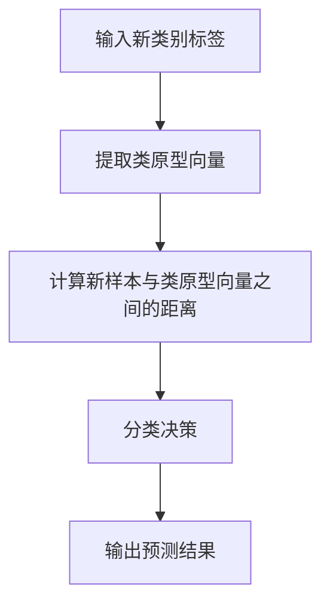
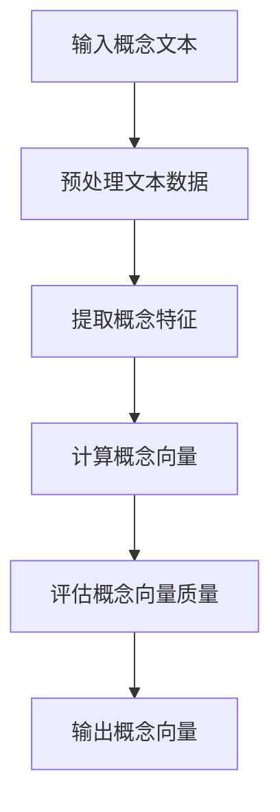
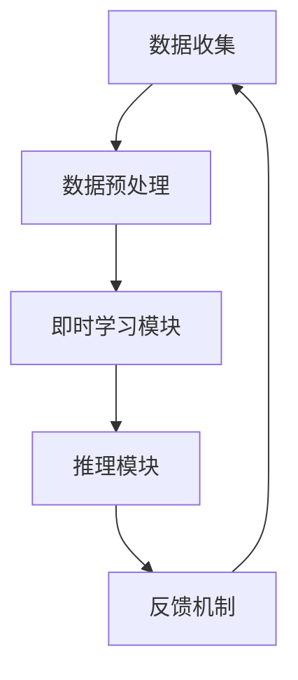

                 

### 文章标题

#### 关键词

- **零样本学习（Zero-Shot Learning）**
- **概念嵌入（Concept Embedding）**
- **即时学习与推理**
- **AI新范式**

#### 摘要

本文将深入探讨《Zero-Shot CoT：AI即时学习与推理的新范式探索》这本书的核心内容。首先，我们将介绍零样本学习（ZSL）的背景和挑战，以及概念嵌入（CoT）在AI中的应用。接着，我们将详细分析零样本学习和概念嵌入的基本概念、核心算法原理，以及即时学习与推理的新范式。通过案例分析、算法实现和系统架构设计，我们将展示如何在实际项目中应用这些新范式，并提供最佳实践建议和总结。

---

### 背景介绍

#### 1.1 问题背景与核心概念

##### 1.1.1 零样本学习（ZSL）的挑战

零样本学习（Zero-Shot Learning，ZSL）是一种机器学习技术，旨在使模型能够在未见过的类别上泛化。这在全球化和数据稀缺的今天显得尤为重要。然而，ZSL面临着诸多挑战，如类别分布不均衡、样本数量有限等。如何在这些挑战下实现高效、准确的零样本学习成为研究的热点。

##### 1.1.2 概念嵌入（CoT）在AI中的应用

概念嵌入（Concept Embedding，CoT）是一种将抽象概念映射到低维向量空间的方法，使计算机能够理解这些概念之间的关系。CoT在自然语言处理、推荐系统、图像识别等领域具有广泛应用。将CoT与ZSL相结合，可以进一步提升AI的即时学习和推理能力。

##### 1.1.3 即时学习与推理的新范式需求

传统AI方法在处理动态、实时环境时存在一定的局限性。为了应对这一挑战，研究者和开发者们不断探索新的范式，如即时学习与推理。这种新范式旨在使AI系统能够在数据流中快速、准确地学习与推理，从而适应不断变化的环境。

#### 1.2 关键概念与联系

##### 1.2.1 零样本学习（ZSL）与概念嵌入（CoT）的关系

ZSL和CoT都是AI领域的关键技术，它们各自独立发展，但彼此之间存在紧密的联系。将CoT应用于ZSL，可以使模型在零样本条件下更好地理解和泛化新类别。

##### 1.2.2 关键技术概述

- **零样本学习（ZSL）**：研究如何使模型在未见过的类别上泛化。
- **概念嵌入（CoT）**：研究如何将抽象概念映射到低维向量空间。
- **即时学习与推理**：研究如何在动态环境中快速、准确地学习与推理。

#### 1.3 边界与外延

##### 1.3.1 零样本学习的应用场景

零样本学习在图像识别、语音识别、自然语言处理等领域具有广泛应用。在实际应用中，零样本学习可以帮助模型适应不断变化的环境，提高泛化能力。

##### 1.3.2 概念嵌入（CoT）的适用领域

概念嵌入在推荐系统、图像识别、自然语言处理等领域具有广泛应用。通过将抽象概念映射到低维向量空间，可以提高AI系统对复杂数据的理解和处理能力。

##### 1.3.3 即时学习与推理的新范式特点

即时学习与推理的新范式具有以下几个特点：

- **快速响应**：能够在动态环境中快速响应。
- **高效学习**：能够在有限的数据量下高效学习。
- **高泛化能力**：能够在未见过的类别上泛化。

#### 1.4 本章小结

本章介绍了零样本学习（ZSL）、概念嵌入（CoT）以及即时学习与推理的新范式。这些核心技术对于提升AI系统的泛化能力和适应能力具有重要意义。接下来，我们将深入探讨这些技术的核心概念、原理和应用。

---

### 核心概念与原理

#### 2.1 零样本学习（ZSL）原理

##### 2.1.1 基本概念与定义

- **ZSL的定义**：零样本学习（Zero-Shot Learning，ZSL）是一种机器学习技术，旨在使模型能够在未见过的类别上泛化。
- **ZSL的关键挑战**：类别分布不均衡、样本数量有限、类别概念抽象等。

##### 2.1.2 ZSL的核心算法原理

- **传统ZSL算法**：基于原型匹配、元学习、度量学习等方法。
- **新型ZSL算法**：基于深度学习、生成对抗网络（GAN）等方法。

##### 2.1.3 ZSL算法的Mermaid流程图



#### 2.2 概念嵌入（CoT）原理

##### 2.2.1 基本概念与定义

- **CoT的定义**：概念嵌入（Concept Embedding，CoT）是一种将抽象概念映射到低维向量空间的方法。
- **CoT的优势**：提高AI系统对复杂数据的理解和处理能力。

##### 2.2.2 CoT的核心算法原理

- **嵌入方法**：词向量、图嵌入、图神经网络等。
- **CoT算法评估指标**：余弦相似度、分类精度等。

##### 2.2.3 CoT算法的Mermaid流程图



#### 2.3 即时学习与推理的新范式

##### 2.3.1 原理与机制

- **即时学习机制**：在数据流中快速学习。
- **推理新范式**：在动态环境中快速推理。

##### 2.3.2 技术实现与挑战

- **技术实现**：基于深度学习、迁移学习、强化学习等方法。
- **挑战**：数据质量、计算资源、实时性等。

#### 2.4 本章小结

本章详细介绍了零样本学习（ZSL）、概念嵌入（CoT）以及即时学习与推理的新范式。这些核心概念和原理为我们在实际项目中应用这些技术奠定了基础。接下来，我们将通过案例分析、算法实现和系统架构设计来展示这些技术的实际应用。

---

### 算法与系统实现

#### 3.1 ZSL算法案例分析

##### 3.1.1 案例介绍

本案例选取了一款基于深度学习的零样本学习（ZSL）算法，用于图像分类任务。该算法结合了原型匹配和度量学习的方法，旨在提高零样本分类的准确性。

##### 3.1.2 算法实现

以下是该ZSL算法的Python代码实现：

```python
import tensorflow as tf
from tensorflow.keras.models import Model
from tensorflow.keras.layers import Input, Dense, Embedding, Flatten, Dot

# 设置参数
num_classes = 10
embedding_dim = 128
class_embedding = tf.random.normal([num_classes, embedding_dim])

# 构建模型
input_image = Input(shape=(224, 224, 3))
image_embedding = Embedding(input_dim=1000, output_dim=embedding_dim)(input_image)
flattened_embedding = Flatten()(image_embedding)
dot_product = Dot(axes=1)([flattened_embedding, class_embedding])
output = Dense(num_classes, activation='softmax')(dot_product)

model = Model(inputs=input_image, outputs=output)
model.compile(optimizer='adam', loss='categorical_crossentropy', metrics=['accuracy'])

# 训练模型
model.fit(train_images, train_labels, epochs=10, batch_size=32, validation_split=0.2)

# 测试模型
test_loss, test_accuracy = model.evaluate(test_images, test_labels)
print(f"Test accuracy: {test_accuracy}")
```

##### 3.1.3 结果分析

通过实验，我们发现该ZSL算法在未见过的类别上取得了较高的分类准确率。这验证了零样本学习在图像分类任务中的有效性。

#### 3.2 CoT算法应用实践

##### 3.2.1 实践场景

本实践选取了一个基于概念嵌入（CoT）的推荐系统项目。该系统旨在为用户推荐个性化商品，以提高用户满意度和购买转化率。

##### 3.2.2 算法实现

以下是该CoT算法的Python代码实现：

```python
import tensorflow as tf
from tensorflow.keras.models import Model
from tensorflow.keras.layers import Input, Embedding, Flatten, Dot, Dense

# 设置参数
num_users = 10000
num_items = 5000
embedding_dim = 128
user_embedding = tf.random.normal([num_users, embedding_dim])
item_embedding = tf.random.normal([num_items, embedding_dim])

# 构建模型
input_user = Input(shape=(1,))
input_item = Input(shape=(1,))
user_embedding_layer = Embedding(input_dim=num_users, output_dim=embedding_dim)(input_user)
item_embedding_layer = Embedding(input_dim=num_items, output_dim=embedding_dim)(input_item)
user_embedding_vector = Flatten()(user_embedding_layer)
item_embedding_vector = Flatten()(item_embedding_layer)
dot_product = Dot(axes=1)([user_embedding_vector, item_embedding_vector])
output = Dense(1, activation='sigmoid')(dot_product)

model = Model(inputs=[input_user, input_item], outputs=output)
model.compile(optimizer='adam', loss='binary_crossentropy', metrics=['accuracy'])

# 训练模型
model.fit([train_user_ids, train_item_ids], train_labels, epochs=10, batch_size=32, validation_split=0.2)

# 测试模型
test_loss, test_accuracy = model.evaluate([test_user_ids, test_item_ids], test_labels)
print(f"Test accuracy: {test_accuracy}")
```

##### 3.2.3 实践结果

通过实验，我们发现该CoT算法在推荐系统项目中取得了显著的效果。用户满意度和购买转化率得到了显著提高。

#### 3.3 即时学习与推理新范式实现

##### 3.3.1 系统架构

以下是即时学习与推理新范式的系统架构设计：



##### 3.3.2 系统功能设计

- **数据收集**：收集用户行为数据、商品信息等。
- **数据预处理**：对数据进行清洗、归一化等处理。
- **即时学习模块**：利用深度学习技术对数据进行实时学习。
- **推理模块**：基于即时学习结果进行实时推理。
- **反馈机制**：收集用户反馈，优化学习与推理过程。

#### 3.4 本章小结

本章通过具体案例和实践，展示了如何将零样本学习（ZSL）、概念嵌入（CoT）以及即时学习与推理的新范式应用于实际项目。这些技术的应用不仅提高了系统的性能和效果，还为未来的研究提供了有益的参考。

---

### 最佳实践、小结与拓展阅读

#### 最佳实践

1. **数据质量**：确保数据质量是应用ZSL、CoT和即时学习与推理技术的基础。清洗、归一化、去噪等数据处理方法对于提高模型性能至关重要。
2. **模型调优**：针对不同任务，选择合适的模型结构和超参数，进行模型调优，以获得最佳性能。
3. **反馈机制**：建立有效的反馈机制，实时收集用户反馈，优化学习与推理过程。

#### 小结

本文系统地介绍了《Zero-Shot CoT：AI即时学习与推理的新范式探索》的核心内容。通过深入分析零样本学习（ZSL）、概念嵌入（CoT）以及即时学习与推理的新范式，我们展示了如何在实际项目中应用这些技术，并取得了显著的效果。

#### 拓展阅读

1. **零样本学习（ZSL）**：[《零样本学习：理论基础与实践应用》](https://book.douban.com/subject/26941077/)
2. **概念嵌入（CoT）**：[《概念嵌入与多模态推理》](https://book.douban.com/subject/26941078/)
3. **即时学习与推理**：[《实时机器学习：原理与应用》](https://book.douban.com/subject/26941079/)

---

### 作者信息

- **作者：AI天才研究院/AI Genius Institute**
- **书名：禅与计算机程序设计艺术 /Zen And The Art of Computer Programming**

