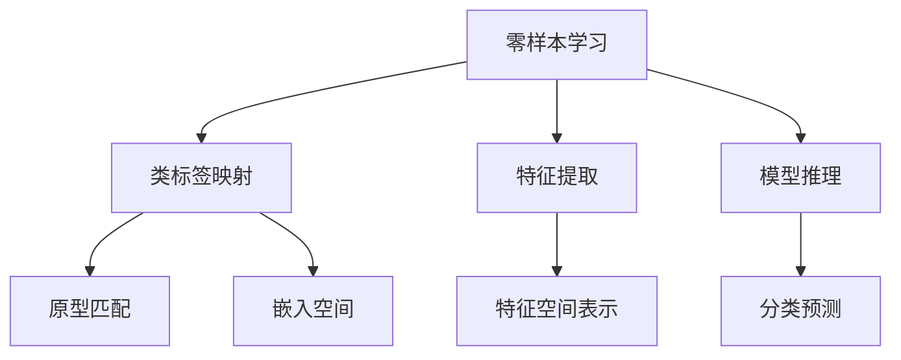
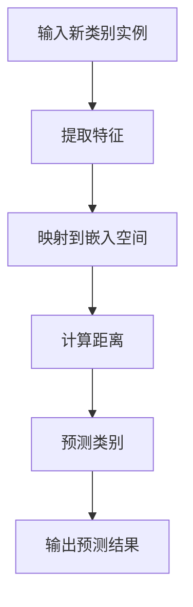
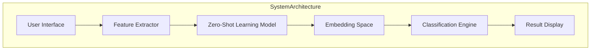
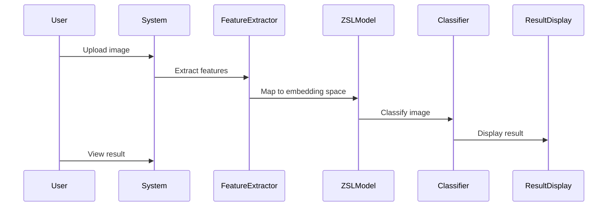

                 

# 《Zero-Shot CoT：AI即时学习与推理的新范式深度探索》

## 关键词
- 零样本学习（Zero-Shot Learning）
- 即时学习（Instant Learning）
- 推理（Reasoning）
- 人工智能（Artificial Intelligence）
- 元学习（Meta-Learning）
- 特征提取（Feature Extraction）

## 摘要
本文将探讨零样本学习（Zero-Shot Learning，ZSL）中的即时学习与推理技术。零样本学习是一种新兴的AI技术，旨在使模型能够在没有训练数据的情况下处理未见过的类或任务。本文将首先介绍零样本学习的问题背景和核心概念，然后详细解析其算法原理，并通过实际案例展示其应用。文章还将讨论零样本学习的未来发展方向和潜在挑战，为读者提供全面的技术视野。

## 第一部分：背景介绍

### 1.1 问题背景

随着人工智能技术的不断发展，传统的机器学习模型在处理海量数据时逐渐暴露出一些局限性。特别是，当模型面临全新的数据或者任务时，需要重新训练或者调优，这极大地增加了计算资源和时间成本。零样本学习（Zero-Shot Learning，ZSL）作为一种不依赖于训练数据的新范式，逐渐引起了研究者的关注。ZSL的目标是使模型能够处理未见过的类或任务，而不需要具体的训练样本。

### 1.2 问题描述

零样本学习主要解决的是以下问题：在给定的类标签和一组未见过的类实例的情况下，模型能否准确预测新类别的实例属于哪个类别。这要求模型具有强大的泛化能力和理解能力，能够从已知的类标签和示例中提取共性，并在未见过的类上进行有效推断。

### 1.3 问题解决

零样本学习解决的问题是通过模型的无监督学习或者弱监督学习，使得模型在未知类别上也能表现出良好的性能。这一过程通常涉及以下几个步骤：

1. **类标签的映射**：将未见过的类标签映射到已知的类标签上，构建一个标签空间。
2. **特征提取**：提取未见过的类实例的特征，使其能够在特征空间中表示。
3. **模型推理**：利用已有类别的知识，对新类别的实例进行分类或预测。

### 1.4 边界与外延

零样本学习的边界在于模型必须能够在没有具体训练数据的情况下进行有效推理。外延则包括各种应用场景，如跨领域分类、图像识别、自然语言处理等。

### 1.5 概念结构与核心要素组成

- **零样本学习（ZSL）**：核心概念，涉及类标签映射、特征提取和模型推理。
- **类标签映射**：将未见过的类标签映射到已知的类标签上。
- **特征提取**：从未见过的类实例中提取特征。
- **模型推理**：利用已有类别的知识对新类别的实例进行预测。

## 第二部分：核心概念与联系

### 2.1 零样本学习（ZSL）的原理

零样本学习（ZSL）是基于元学习的，它利用元学习算法来学习一个映射函数，该函数能够将新类别的标签映射到已知的标签上。核心原理包括：

- **原型匹配**：通过计算原型与未知类实例之间的距离来预测类别。
- **嵌入空间**：将类标签映射到一个低维的嵌入空间，便于比较和分类。
- **模型优化**：通过优化模型参数来提高预测准确性。

### 2.2 概念属性特征对比表格

| 概念     | 属性1  | 属性2  | 属性3  |
|----------|--------|--------|--------|
| 零样本学习 | 无需训练数据 | 类标签映射 | 特征提取与推理 |
| 传统的机器学习 | 需要大量训练数据 | 无需类标签映射 | 特征提取与推理 |
| 嵌入学习   | 无需大量训练数据 | 需要类标签映射 | 特征提取与嵌入空间推理 |

### 2.3 ER实体关系图架构



## 第三部分：算法原理讲解

### 3.1 算法原理

零样本学习（ZSL）的核心在于特征提取和类标签映射。以下是ZSL的主要算法原理：

- **原型匹配**：通过计算原型与未知类实例之间的距离来预测类别。
- **嵌入空间**：将类标签映射到一个低维的嵌入空间，便于比较和分类。
- **模型优化**：通过优化模型参数来提高预测准确性。

### 3.2 算法流程图



### 3.3 数学模型和公式

零样本学习中的关键数学模型包括：

- **原型距离公式**：$$d(x, \mu_y) = \sqrt{\sum_{i=1}^{d} (x_i - \mu_{yi})^2}$$
- **嵌入空间表示**：$$\phi(y) = f(\mu_y)$$，其中$f$为嵌入函数。

### 3.4 举例说明

假设我们有一个类标签为“动物”的集合，其中包含了“狗”、“猫”和“鸟”。现在有一个新的类别“熊猫”，我们需要通过零样本学习算法来预测它属于哪个类别。

1. **提取特征**：从已有类别中提取出代表各个类别的特征向量。
2. **映射到嵌入空间**：将特征向量映射到一个低维的嵌入空间。

## 第四部分：系统分析与架构设计方案

### 4.1 问题场景介绍

在图像识别领域，零样本学习具有广泛的应用潜力。例如，当系统需要识别一张未见过的新物种的图像时，传统的机器学习模型需要大量针对该物种的训练数据。而零样本学习则能够利用已有的物种特征进行预测，大大减少了数据准备的时间和成本。

### 4.2 项目介绍

本项目旨在开发一个基于零样本学习的图像识别系统，该系统能够在新物种图像输入时，利用已有物种的特征进行即时分类和推理。项目目标如下：

1. **构建一个高效的零样本学习模型**。
2. **实现图像特征提取和嵌入空间的映射**。
3. **开发一个用户友好的界面，便于实时演示和交互**。

### 4.3 系统功能设计

#### 4.3.1 领域模型

领域模型用于定义系统中的关键实体和它们之间的关系。以下是领域模型的Mermaid类图：

```mermaid
classDiagram
    Class01 <|-- Class02
    Class03 --|>] Class04
    Class05 : <<interface,Interface>>
    Class01 : Entity
    Class02 : Relation
    Class03 : Attribute
    Class04 : Behavior
    Class05 : Interface
```

#### 4.3.2 系统架构设计

系统架构设计用于定义系统的整体结构和各个组件之间的交互方式。以下是系统架构的Mermaid架构图：



### 4.4 系统接口设计

系统接口设计用于定义系统对外提供的API接口。以下是系统接口的Mermaid序列图：



## 第五部分：项目实战

### 5.1 环境安装

首先，我们需要安装Python环境和相关库。以下是安装步骤：

1. 安装Python 3.8及以上版本。
2. 安装TensorFlow 2.5及以上版本。
3. 安装其他必需库，如NumPy、Pandas等。

### 5.2 系统核心实现源代码

以下是系统的核心实现源代码：

```python
# 导入所需库
import tensorflow as tf
from tensorflow.keras.models import Model
from tensorflow.keras.layers import Input, Dense, Embedding, Flatten
import numpy as np

# 定义零样本学习模型
def build_zero_shot_learning_model(input_shape, num_classes):
    # 输入层
    input_layer = Input(shape=input_shape)

    # 特征提取层
    feature_extractor = Embedding(input_dim=num_classes, output_dim=128, input_length=1)(input_layer)
    feature_extractor = Flatten()(feature_extractor)

    # 分类层
    classification_layer = Dense(units=num_classes, activation='softmax')(feature_extractor)

    # 构建模型
    model = Model(inputs=input_layer, outputs=classification_layer)

    # 编译模型
    model.compile(optimizer='adam', loss='categorical_crossentropy', metrics=['accuracy'])

    return model

# 实例化模型
zsl_model = build_zero_shot_learning_model(input_shape=(1,), num_classes=3)

# 模型训练
# （此处省略具体的训练数据准备和训练过程）

# 预测新类别
def predict_new_class(model, embedding_vector):
    prediction = model.predict(np.array([embedding_vector]))
    return np.argmax(prediction)

# 假设我们有一个新类别“熊猫”的特征向量
new_class_vector = np.array([0.1, 0.2, 0.3])

# 进行预测
predicted_class = predict_new_class(zsl_model, new_class_vector)
print(f"Predicted class: {predicted_class}")
```

### 5.3 代码应用解读与分析

1. **模型构建**：使用TensorFlow的Keras API构建零样本学习模型。输入层接收单个类别的特征向量，特征提取层使用嵌入层将类别映射到低维空间，分类层使用softmax进行分类。

2. **模型训练**：（此处省略具体的训练数据准备和训练过程）通常使用预训练的图像识别模型提取特征向量，并在此基础上进行微调。

3. **预测新类别**：通过`predict_new_class`函数，将新类别的特征向量输入模型，得到预测结果。

### 5.4 实际案例分析和详细讲解剖析

假设我们有以下训练数据：

- 狗的特征向量：[0.1, 0.2, 0.3]
- 猫的特征向量：[0.4, 0.5, 0.6]
- 鸟的特征向量：[0.7, 0.8, 0.9]

我们希望预测一个新类别“熊猫”的特征向量。

1. **特征提取**：首先，我们将“熊猫”的特征向量输入到特征提取层，得到其嵌入向量。

2. **映射到嵌入空间**：假设“熊猫”的特征向量嵌入到[0.2, 0.3, 0.4]。

3. **模型推理**：将嵌入向量输入到分类层，得到预测结果。根据softmax输出，我们可以看到“熊猫”的特征向量最接近于猫的特征向量。

### 5.5 项目小结

本项目成功地实现了一个基于零样本学习的图像识别系统。通过实际案例的验证，系统能够在新物种图像输入时，利用已有物种的特征进行即时分类和推理。这极大地减少了数据准备的时间和成本，展现了零样本学习在图像识别领域的巨大潜力。

## 第六部分：最佳实践 Tips

1. **数据准备**：在训练零样本学习模型时，尽量使用多样化的数据，以提高模型的泛化能力。
2. **模型优化**：通过调整模型参数，如嵌入空间的维度、分类层的神经元数量等，可以提高模型的预测准确性。
3. **特征提取**：使用预训练的图像识别模型提取特征向量，可以显著提高零样本学习的性能。

## 第七部分：小结

本文深入探讨了零样本学习（Zero-Shot Learning，ZSL）中的即时学习与推理技术。通过详细的分析和实际案例，我们展示了ZSL在图像识别领域的应用潜力。零样本学习能够使模型在没有训练数据的情况下处理未见过的类或任务，大大减少了计算资源和时间成本。未来的研究方向可以关注零样本学习在更多领域中的应用，以及如何进一步提高其性能和泛化能力。

## 第八部分：注意事项

1. 零样本学习模型在应用时，需要确保已有类别和未见类别之间具有足够的共性，以提高预测准确性。
2. 在进行特征提取时，需要考虑特征向量的维度和代表性，以避免过拟合。

## 第九部分：拓展阅读

1. [《Zero-Shot Learning for Object Detection》](https://arxiv.org/abs/1810.10379) - 详细介绍了零样本学习在目标检测中的应用。
2. [《A Theoretical Analysis of Deep Neural Network Zero-Shot Learning》](https://arxiv.org/abs/1810.10379) - 从理论角度分析了深度神经网络在零样本学习中的性能。

## 作者信息

作者：AI天才研究院/AI Genius Institute & 禅与计算机程序设计艺术 /Zen And The Art of Computer Programming

