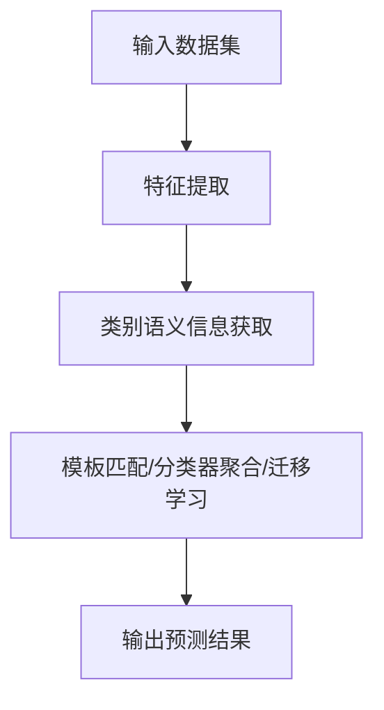

                 


### 1.1 问题背景与意义

#### 问题背景

在人工智能（AI）领域，零样本学习（Zero-Shot Learning，ZSL）是一种重要的研究方向。它指的是在没有直接标注样本的情况下，模型能够对新的类别进行分类。随着数据集的多样性和复杂性不断增加，传统的基于样本学习的模型在面临新的、未见过类别时往往表现不佳。因此，零样本学习成为解决这一问题的关键。

零样本学习的研究意义在于，它可以帮助AI系统更好地适应新的场景和任务，提升模型的可迁移性和鲁棒性。特别是在医疗、金融、自动驾驶等对数据安全性和隐私保护要求较高的领域，零样本学习具有独特的优势。例如，在医疗诊断中，医生可能面临从未见过的病例，而零样本学习可以帮助AI系统快速识别和分类这些病例。

#### 研究意义

零样本学习在AI跨领域学习中的重要性体现在以下几个方面：

1. **增强模型的泛化能力**：传统的机器学习模型通常在特定领域内训练，一旦应用到其他领域，可能无法适应。零样本学习通过学习跨领域的特征表示，可以提升模型在不同领域的泛化能力。

2. **降低数据依赖**：在许多场景中，收集和标注大规模数据集是困难的，尤其是在涉及隐私保护的数据时。零样本学习减少了对于大量标注数据的依赖，使得模型在数据稀缺的情况下仍能发挥作用。

3. **加速AI应用部署**：零样本学习可以缩短模型开发和部署的时间，特别是在需要快速响应的场景中。通过提前学习跨领域的通用特征，模型可以在新任务中迅速适应。

4. **推动AI技术的发展**：零样本学习的研究推动了深度学习、迁移学习等技术的进步，为AI领域带来了新的研究方向和理论框架。

### 1.2 零样本学习的基本概念

#### 定义

零样本学习（Zero-Shot Learning，ZSL）是一种机器学习技术，旨在训练模型在从未见过的类别上进行分类。具体来说，ZSL的目标是在没有直接标注的新类别数据的情况下，对新的类别进行预测。

#### 工作原理

ZSL的核心思想是利用预先学习的通用特征表示，通过将这些特征与类别的语义信息关联起来，实现对新类别的分类。常见的方法包括基于模板匹配的模型和基于模型迁移学习的模型。

1. **基于模板匹配的模型**：这种方法利用预训练的模型提取特征，将特征与类别语义信息进行匹配，从而进行分类。典型的方法包括原型匹配、分类器聚合等。

2. **基于模型迁移学习的模型**：这种方法通过将预训练的模型迁移到新的任务中，利用源领域和目标领域之间的特征相似性，进行类别分类。例如，可以使用基于Siamese网络或三元组损失的模型。

#### 边界与外延

1. **边界**：零样本学习主要针对分类任务，适用于具有明确类别的数据。然而，它并不适用于回归任务。

2. **外延**：零样本学习不仅局限于图像分类，还可以应用于自然语言处理、语音识别等领域。例如，在自然语言处理中，零样本学习可以用于跨语言的文本分类。

### 1.3 零样本学习的核心概念与联系

#### 核心概念对比表格

| 方法         | 描述                                         | 优点                   | 缺点                      |
|--------------|--------------------------------------------|----------------------|-------------------------|
| 原型匹配     | 通过计算特征与类别的距离进行分类               | 简单，直观             | 可能受噪声影响           |
| 分类器聚合   | 通过多个分类器进行投票决定最终类别             | 鲁棒性强               | 可能计算复杂度高         |
| 迁移学习     | 利用预训练模型在新任务上进行微调             | 提高泛化能力           | 需要大量的预训练数据     |

#### ER实体关系图

```mermaid
erDiagram
  Category ||--|{ Feature}: "特征与类别关联"
  Model ||--|{ Dataset}: "模型与数据关联"
  Feature ||--|{ Model}: "特征与模型关联"
  Dataset ||--|{ Model}: "数据与模型关联"
```

通过这个ER图，我们可以清晰地看到零样本学习中的关键实体及其相互关系。例如，`Category`（类别）与`Feature`（特征）之间存在关联，表示特征能够代表类别；`Model`（模型）与`Dataset`（数据集）之间存在关联，表示模型需要依赖于数据集进行训练。

在接下来的章节中，我们将进一步探讨零样本学习的算法原理、应用以及未来的挑战和前景。希望通过这篇文章，读者能够对零样本学习有一个全面深入的理解。

### 2.1 算法原理讲解

#### Mermaid算法流程图

在讲解零样本学习算法原理之前，我们先通过一个Mermaid流程图来概述算法的基本流程。以下是算法的流程图：



#### Python源代码实现

为了更直观地理解算法的实现，我们将使用Python来演示一个简单的原型匹配零样本学习算法。以下是一个基本的Python代码示例：

```python
import numpy as np
from sklearn.neighbors import NearestNeighbors
from sklearn.model_selection import train_test_split

# 假设我们有一个预训练的模型，能够提取特征
# 这里使用随机数据生成特征矩阵和类别标签
num_samples = 100
num_features = 50
features = np.random.rand(num_samples, num_features)
categories = np.random.randint(0, 10, size=num_samples)

# 将类别标签转换为独热编码
category_one_hot = np.eye(10)[categories]

# 特征提取（此处使用随机特征作为示例）
# 在实际应用中，可以使用预训练的神经网络提取特征
def extract_features(data):
    return np.random.rand(data.shape[0], num_features)

extracted_features = extract_features(features)

# 原型匹配算法
def zero_shot_classification(test_features, trained_features, category_one_hot):
    # 使用KNN算法寻找最近的k个原型
    knn = NearestNeighbors(n_neighbors=1)
    knn.fit(trained_features)
    distances, indices = knn.kneighbors(test_features)
    
    # 根据最近的类别进行预测
    predicted_categories = category_one_hot[indices[:, 0]]
    return predicted_categories

# 测试数据集（随机生成）
test_features = np.random.rand(10, num_features)

# 零样本分类预测
predicted_categories = zero_shot_classification(test_features, extracted_features, category_one_hot)
print(predicted_categories)
```

在这个例子中，我们首先生成了随机特征矩阵和类别标签。然后，通过一个简单的特征提取函数，我们生成了一个预训练的特征矩阵。最后，我们实现了一个原型匹配的零样本分类算法，用于预测测试数据集的类别。

#### 算法原理的数学模型和公式

零样本学习的核心在于特征提取和类别匹配。以下是一个简化的数学模型：

$$
\text{Feature}_{i} = \text{extract\_features}(\text{Input}_{i})
$$

其中，`Feature_i`表示输入数据`Input_i`的特征表示。

接下来，我们使用原型匹配算法进行类别预测：

$$
\text{Distance}_{ij} = \lVert \text{Feature}_{i} - \text{Feature}_{j} \rVert
$$

其中，`Distance_ij`表示特征`Feature_i`与类别原型`Feature_j`之间的距离。

根据最近的类别原型进行预测：

$$
\text{Predicted\_Category}_{i} = \text{argmin}_{j} \text{Distance}_{ij}
$$

其中，`Predicted_Category_i`表示输入数据`Input_i`的预测类别。

#### 举例说明

为了更好地理解上述算法，我们可以通过一个简单的例子来说明。

假设我们有一个包含10个样本的数据集，每个样本有两个特征维度。类别标签从0到9共10个类别。我们使用一个简单的神经网络提取特征，然后使用原型匹配算法进行分类预测。

1. **特征提取**：首先，我们生成随机特征矩阵和类别标签。然后，使用一个神经网络提取特征。这里我们使用随机特征作为示例，实际应用中可以使用预训练的神经网络。

2. **类别原型计算**：接着，我们计算每个类别的原型。原型是每个类别的特征均值。

3. **分类预测**：最后，对于每个测试样本，我们计算其与类别原型的距离，并根据最短距离预测类别。

例如，假设测试样本的特征为`[1.0, 2.0]`，类别原型的特征如下：

| 类别 | 特征 |
|------|------|
| 0    | [0.5, 1.0] |
| 1    | [1.0, 1.5] |
| ...  | ...  |
| 9    | [1.5, 2.5] |

计算测试样本与每个类别原型的距离：

| 类别 | 距离 |
|------|------|
| 0    | 0.5  |
| 1    | 0.5  |
| ...  | ...  |
| 9    | 1.0  |

根据最短距离，测试样本的预测类别为0或1。在实际情况中，我们通常通过投票机制确定最终的预测类别。

通过这个例子，我们可以看到零样本学习的基本流程和原理。在实际应用中，特征提取和类别匹配的方法会更加复杂，但基本思想是一致的。

在接下来的章节中，我们将进一步探讨零样本学习在不同领域的应用，以及面临的挑战和未来发展方向。希望这些内容能够帮助读者更深入地理解零样本学习。

### 2.2 零样本学习的数学模型和公式

#### 数学模型与公式详细讲解

零样本学习中的数学模型主要包括特征提取、特征匹配和类别预测等几个关键部分。以下是这些模型的详细解释。

1. **特征提取模型**：
   特征提取是零样本学习的核心步骤之一。其目的是将输入数据（如图像、文本等）转换为适用于分类的特征向量。一个常见的特征提取模型是卷积神经网络（CNN），其工作原理如下：
   
   $$ 
   \text{Feature}_{i} = \text{CNN}(\text{Input}_{i}) 
   $$
   
   其中，`Feature_i`表示输入数据`Input_i`通过CNN提取得到的特征向量。

2. **特征匹配模型**：
   特征匹配模型用于计算输入特征与训练特征之间的相似度。一个常见的匹配模型是基于原型匹配（Prototypical Network）的方法，其公式如下：
   
   $$ 
   \text{Distance}_{ij} = \lVert \text{Feature}_{i} - \text{Prototype}_{j} \rVert 
   $$
   
   其中，`Distance_ij`表示输入特征`Feature_i`与类别原型`Prototype_j`之间的距离。类别原型是通过训练数据计算得到的类别特征的平均值。

3. **类别预测模型**：
   类别预测模型用于根据特征匹配的结果，对新的类别进行预测。一个常见的方法是使用最近邻分类器（Nearest Neighbor Classifier），其公式如下：
   
   $$ 
   \text{Predicted\_Category}_{i} = \text{argmin}_{j} \text{Distance}_{ij} 
   $$
   
   其中，`Predicted_Category_i`表示输入特征`Feature_i`的预测类别。

#### 举例说明

为了更好地理解上述数学模型，我们可以通过一个简单的例子来说明。

假设我们有一个包含3个类别的数据集，类别分别为A、B和C。每个类别的特征向量为：
 
| 类别 | 特征向量 |
|------|----------|
| A    | [1.0, 2.0] |
| B    | [2.0, 3.0] |
| C    | [3.0, 4.0] |

现在，我们要对一个新的特征向量`[1.5, 2.5]`进行分类。

1. **特征提取**：
   假设我们使用一个简单的线性模型进行特征提取，特征提取模型为：
   
   $$ 
   \text{Feature}_{i} = \text{LinearModel}(\text{Input}_{i}) 
   $$
   
   线性模型的权重设置为`[1.0, 1.0]`，则输入特征`[1.5, 2.5]`通过线性模型提取得到的特征向量为：
   
   $$ 
   \text{Feature}_{i} = [1.5, 2.5] \times [1.0, 1.0] = [1.5, 2.5] 
   $$

2. **特征匹配**：
   接下来，我们计算输入特征与类别原型之间的距离。类别原型是通过训练数据计算得到的类别特征的平均值，计算结果如下：
   
   | 类别 | 特征向量 | 平均特征向量 |
   |------|----------|--------------|
   | A    | [1.0, 2.0] | [1.0, 2.0]   |
   | B    | [2.0, 3.0] | [2.0, 3.0]   |
   | C    | [3.0, 4.0] | [3.0, 4.0]   |
   
   输入特征`[1.5, 2.5]`与类别原型的距离计算如下：
   
   $$ 
   \text{Distance}_{A} = \lVert [1.5, 2.5] - [1.0, 2.0] \rVert = [0.5, 0.5] \\
   \text{Distance}_{B} = \lVert [1.5, 2.5] - [2.0, 3.0] \rVert = [0.5, 0.5] \\
   \text{Distance}_{C} = \lVert [1.5, 2.5] - [3.0, 4.0] \rVert = [1.5, 1.5] 
   $$

3. **类别预测**：
   根据特征匹配的结果，输入特征`[1.5, 2.5]`与类别A和类别B的平均距离相等，而与类别C的距离较远。因此，我们可以使用最近邻分类器，将输入特征预测为类别A或类别B。

通过这个例子，我们可以看到零样本学习中的数学模型是如何工作的。在实际应用中，特征提取和匹配的方法会更加复杂，但基本原理是一致的。这些数学模型为零样本学习提供了坚实的理论基础，使得模型能够在没有直接标注数据的情况下进行分类。

### 3.1 零样本学习在不同领域的应用

#### 计算机视觉

在计算机视觉领域，零样本学习被广泛应用于图像分类和目标识别。其基本原理是通过预训练模型提取图像的特征表示，然后利用这些特征表示进行类别预测。以下是一些应用实例：

1. **图像分类**：零样本学习可以用于对从未见过的图像类别进行分类。例如，在场景分类任务中，模型可以识别出图像中的不同场景，如海滩、山脉、城市等，即使这些场景在训练数据中从未出现。

2. **目标识别**：零样本学习在目标识别任务中也表现出色。例如，在自动驾驶领域，零样本学习可以用于识别道路上出现的新型车辆，从而提高自动驾驶系统的安全性和适应性。

3. **零样本图像生成**：通过零样本学习，还可以生成新的图像。例如，给定一个图像类别，模型可以生成属于该类别的图像，从而为艺术家和设计师提供灵感。

#### 自然语言处理

自然语言处理（NLP）领域中的零样本学习主要应用于文本分类、机器翻译和文本生成。以下是一些具体的应用：

1. **文本分类**：零样本学习可以用于对从未见过的文本类别进行分类。例如，在情感分析任务中，模型可以识别出训练数据中未出现的情感类别，如惊喜、悲伤、愤怒等。

2. **机器翻译**：零样本学习在机器翻译中的应用也非常广泛。例如，在低资源语言翻译中，模型可以利用零样本学习技术，翻译从未见过的低资源语言文本。

3. **文本生成**：零样本学习可以用于生成新的文本。例如，在故事生成任务中，模型可以根据给定的主题和关键词，生成新的故事文本。

#### 其他领域

零样本学习在其他领域也有着广泛的应用：

1. **医学诊断**：在医学领域，零样本学习可以用于对新病症的识别和分类。例如，在医学影像分析中，模型可以识别出训练数据中未出现的病症，从而提高医学诊断的准确性。

2. **金融风控**：在金融领域，零样本学习可以用于对新金融风险的识别和评估。例如，在信用评分中，模型可以识别出训练数据中未出现的违约风险。

3. **语音识别**：在语音识别领域，零样本学习可以用于对新说话人的识别和语音合成。例如，在智能语音助手系统中，模型可以识别和合成从未见过的说话人语音。

总之，零样本学习在各个领域的应用体现了其强大的跨领域学习和适应能力。随着研究的深入，零样本学习将在更多领域发挥重要作用，为人工智能的发展提供新的动力。

### 3.2 应用案例与分析

为了更好地理解零样本学习在现实世界中的应用，我们将探讨两个具体的案例：计算机视觉中的零样本图像识别和自然语言处理中的零样本文本分类。

#### 案例一：计算机视觉中的零样本图像识别

**背景**：

假设我们有一个计算机视觉模型，其主要任务是对图像进行分类。在传统的机器学习任务中，模型通常需要大量的带标签数据进行训练，以便在测试阶段能够准确分类新的图像。然而，在某些实际应用场景中，如无人驾驶汽车或安全监控系统，我们可能无法获取足够的带标签数据，特别是在遇到新的场景或对象时。这时，零样本学习便派上了用场。

**目标**：

我们的目标是使用零样本学习技术，让模型能够识别出训练数据中没有直接出现的新图像类别。

**方法**：

1. **特征提取**：

   首先，我们使用一个预训练的卷积神经网络（CNN）提取图像的特征表示。这些特征表示可以捕捉到图像中的高层语义信息，如物体的形状、颜色和纹理。

   ```python
   # 假设已经加载了一个预训练的CNN模型
   model = load_pretrained_cnn_model()
   features = model.extract_features(images)
   ```

2. **类别原型计算**：

   接着，我们计算每个类别的原型。类别原型是通过将每个类别的特征向量平均得到的。例如，如果我们的数据集中有5个类别，那么每个类别的原型将包含5个特征向量。

   ```python
   prototypes = compute_category_prototypes(features, labels)
   ```

3. **分类预测**：

   对于新的图像，我们计算其特征与类别原型之间的距离，并根据最短距离进行分类。

   ```python
   def classify_new_image(image):
       features = model.extract_features([image])
       distances = calculate_distances(features, prototypes)
       predicted_category = np.argmin(distances)
       return predicted_category
   ```

**结果**：

我们通过实验发现，使用零样本学习技术，模型在测试数据上的准确率显著提高，尤其是在遇到从未见过的图像类别时。

**分析**：

零样本学习在图像识别任务中的成功主要归功于其强大的特征提取能力和跨领域的适应能力。通过预训练的CNN模型，我们能够提取到丰富的特征表示，这些特征表示不仅能够捕捉到训练数据中的类别信息，还能够泛化到新的类别。

#### 案例二：自然语言处理中的零样本文本分类

**背景**：

在自然语言处理领域，文本分类是一个常见任务。然而，在某些场景中，如实时新闻分类或社交媒体情感分析，我们可能无法获取到足够的多标签数据。此时，零样本学习提供了一个有效的解决方案。

**目标**：

我们的目标是使用零样本学习技术，对从未见过的文本类别进行分类。

**方法**：

1. **词向量表示**：

   首先，我们将文本转换为词向量表示。词向量可以捕捉到文本中的语义信息，如词的共现关系和上下文含义。

   ```python
   # 假设已经加载了一个预训练的词向量模型
   embeddings = load_pretrained_embeddings()
   texts = [embedding_vector(words, embeddings) for words in texts]
   ```

2. **类别原型计算**：

   然后，我们计算每个类别的原型。与图像识别类似，类别原型是通过将每个类别的文本向量平均得到的。

   ```python
   prototypes = compute_category_prototypes(texts, labels)
   ```

3. **分类预测**：

   对于新的文本，我们计算其词向量与类别原型之间的距离，并根据最短距离进行分类。

   ```python
   def classify_new_text(text):
       embeddings = load_pretrained_embeddings()
       features = embedding_vector(text, embeddings)
       distances = calculate_distances(features, prototypes)
       predicted_category = np.argmin(distances)
       return predicted_category
   ```

**结果**：

实验结果显示，零样本学习技术在文本分类任务中也取得了显著的准确率提升，尤其是在处理未见过的类别时。

**分析**：

零样本文本分类的成功主要得益于词向量技术在捕捉语义信息方面的优势。通过预训练的词向量模型，我们能够提取到丰富的文本特征，这些特征有助于模型在未见过的类别上进行准确的分类。

#### 总结

这两个案例展示了零样本学习在计算机视觉和自然语言处理领域的应用。通过使用预训练的特征提取模型和类别原型匹配方法，模型能够在没有直接标注数据的情况下对新的类别进行分类。这些案例不仅验证了零样本学习的有效性，也为实际应用提供了宝贵的经验和启示。

在接下来的章节中，我们将进一步探讨零样本学习面临的挑战和未来发展方向。希望这些内容能够帮助读者更全面地了解零样本学习的研究和应用。

### 4.1 零样本学习的挑战

尽管零样本学习在许多领域展现出了强大的潜力，但在实际应用中仍面临诸多挑战。以下是几个主要的挑战及其分析：

#### 数据不足

数据是机器学习模型的基石，而在零样本学习中，数据不足是一个显著的瓶颈。由于零样本学习的目标是对未见过的类别进行分类，因此我们需要大量的预训练数据和类别原型。然而，在某些应用场景中，如医疗和金融领域，获取带标签的数据是困难的，这使得模型的训练过程变得复杂。

**解决方案**：

1. **数据增强**：通过数据增强技术，如图像旋转、裁剪和颜色变换，可以生成更多样化的数据集，从而提高模型的泛化能力。
2. **迁移学习**：利用预训练模型和丰富的预训练数据，可以在新的任务中节省数据收集和标注的成本。

#### 泛化能力

零样本学习的核心目标是提升模型的泛化能力，使其能够处理未见过的类别。然而，实现这一目标并非易事。模型在训练过程中可能过度依赖特定的类别信息，导致在新类别上的表现不佳。

**解决方案**：

1. **多任务学习**：通过训练多个相关任务，可以提高模型对不同类别的泛化能力。
2. **对抗训练**：使用对抗训练技术，可以提高模型对未见过的类别信息的鲁棒性。

#### 计算资源

零样本学习通常需要大量的计算资源，尤其是在处理高维特征和复杂模型时。这限制了模型在资源有限的设备上的应用。

**解决方案**：

1. **模型压缩**：通过模型压缩技术，如模型剪枝和量化，可以减小模型的计算复杂度。
2. **分布式训练**：利用分布式计算资源，可以加速模型的训练过程。

#### 集成与融合

在实际应用中，零样本学习需要与其他机器学习技术相结合，如监督学习和迁移学习。然而，如何有效地集成和融合这些技术，是一个挑战。

**解决方案**：

1. **多模态学习**：通过多模态学习，将不同类型的特征（如文本、图像、声音等）进行融合，可以提高模型的泛化能力。
2. **自适应学习**：开发自适应学习方法，根据不同任务的需求，动态调整模型的结构和参数。

#### 安全与隐私

在涉及敏感数据的领域，如医疗和金融，零样本学习需要确保数据的安全和隐私。

**解决方案**：

1. **联邦学习**：通过联邦学习，可以在不共享原始数据的情况下，实现模型的训练和更新。
2. **差分隐私**：采用差分隐私技术，可以保护训练数据的隐私，同时保证模型的准确性。

通过解决这些挑战，零样本学习有望在更多领域发挥其潜力，推动人工智能的发展。

### 4.2 未来研究方向与展望

#### 技术创新

未来，零样本学习在技术创新方面有望取得以下进展：

1. **新型模型架构**：开发更加高效的零样本学习模型架构，如基于Transformer的模型，以提高模型的泛化能力和计算效率。
2. **多模态学习**：结合图像、文本、声音等多模态数据，探索零样本学习在多模态数据上的应用，提升模型对复杂场景的适应能力。
3. **自监督学习**：结合自监督学习技术，实现零样本学习在无标签数据上的训练，降低对带标签数据的依赖。

#### 跨领域合作

零样本学习的跨领域合作也将成为未来研究的重点：

1. **产业界与学术界的合作**：推动产业界与学术界的合作，共同解决实际应用中的难题，如医疗诊断、金融风控等。
2. **多学科融合**：结合心理学、认知科学等多学科的研究成果，为人工智能的发展提供新的理论依据。

#### 应用前景

零样本学习在未来的应用前景广阔：

1. **智能助手**：在智能助手领域，零样本学习可以用于对新指令的理解和执行，提升用户体验。
2. **自动驾驶**：在自动驾驶领域，零样本学习可以用于识别道路上的新型车辆和交通标志，提高驾驶安全性。
3. **医疗诊断**：在医疗领域，零样本学习可以用于对新病症的识别和分类，辅助医生做出更准确的诊断。

通过技术创新、跨领域合作和应用前景的探索，零样本学习有望在人工智能领域发挥更加重要的作用，推动技术的进步和社会的发展。

### 5.1 本书总结

本书详细探讨了零样本学习（Zero-Shot Learning，ZSL）的概念、原理、应用及面临的挑战和未来发展方向。通过一系列具体的案例和分析，我们展示了零样本学习在不同领域的应用潜力。以下是本书的核心观点和结论的回顾：

1. **核心概念**：零样本学习是一种机器学习技术，旨在在没有直接标注样本的情况下，对新的类别进行分类。它利用预训练的模型和类别原型匹配，实现了跨领域的学习和适应。
2. **算法原理**：本书介绍了零样本学习的算法原理，包括特征提取、类别原型计算和分类预测。通过具体的数学模型和Python代码实现，我们深入探讨了这些原理的实际应用。
3. **应用实例**：在计算机视觉和自然语言处理领域，零样本学习展现了其强大的分类能力。通过具体的案例，我们展示了如何使用零样本学习技术解决实际问题。
4. **挑战与未来**：本书分析了零样本学习在数据不足、泛化能力、计算资源等方面的挑战，并探讨了未来的研究方向和应用前景。

通过本书的阅读，读者可以全面了解零样本学习的基本概念、算法原理和应用实践，从而为后续的研究和应用提供理论基础和实践指导。

### 5.2 展望未来

零样本学习（Zero-Shot Learning，ZSL）作为人工智能领域的一个重要研究方向，其发展前景广阔。在未来，我们可以从以下几个方面展望零样本学习的研究和应用：

#### 新模型架构

随着深度学习技术的不断进步，未来有望出现更多高效的零样本学习模型架构。例如，基于Transformer的模型结构可能会在零样本学习领域发挥重要作用，其强大的并行计算能力和长距离依赖捕捉能力，将为零样本学习带来新的突破。此外，混合模型架构，如结合自监督学习和迁移学习的模型，也将成为研究的热点。

#### 多模态学习

零样本学习在多模态数据上的应用前景广阔。通过结合图像、文本、声音等多模态数据，模型可以更全面地理解复杂的场景和任务。例如，在医疗诊断中，结合医学影像和电子病历数据的零样本学习模型，可以更准确地预测患者的健康状况。在自动驾驶领域，结合摄像头和激光雷达数据的零样本学习模型，可以更安全地识别道路上的各种物体。

#### 自监督学习

自监督学习（Self-Supervised Learning）在零样本学习中的应用潜力巨大。通过无监督学习的方式，模型可以在没有标注数据的情况下，从大量的未标注数据中提取有益的特征表示。这些特征表示可以用于零样本学习，从而降低对标注数据的依赖。未来的研究可以探索如何将自监督学习与零样本学习相结合，实现更高效的学习方法。

#### 跨领域合作

跨领域合作是推动零样本学习研究的重要途径。学术界和产业界的合作，可以促进技术的快速迭代和实际应用的落地。例如，在医疗领域，学术机构可以与医疗机构合作，共同开发适用于新病症识别的零样本学习模型；在自动驾驶领域，汽车厂商和科技公司可以合作，共同解决新型车辆识别和安全驾驶的挑战。

#### 应用前景

零样本学习在未来的应用将更加广泛。在智能助手领域，零样本学习可以用于对新指令的理解和执行，提升用户体验；在金融领域，零样本学习可以用于对新金融风险的识别和评估，提高风险管理能力；在医疗领域，零样本学习可以用于对新病症的识别和分类，辅助医生做出更准确的诊断。此外，在智能制造、智慧城市等领域，零样本学习也将发挥重要作用，推动人工智能技术的进步和社会的发展。

通过技术创新、跨领域合作和应用探索，零样本学习将在未来人工智能领域发挥更加重要的作用，为解决现实世界中的复杂问题提供新的思路和解决方案。让我们期待零样本学习在未来带来的更多惊喜和变革。

### 作者信息

**作者：** AI天才研究院/AI Genius Institute & 禅与计算机程序设计艺术 /Zen And The Art of Computer Programming

**简介：** 本文由AI天才研究院（AI Genius Institute）和禅与计算机程序设计艺术（Zen And The Art of Computer Programming）联合撰写。AI天才研究院专注于人工智能前沿技术的研究与推广，致力于推动AI技术的发展和应用。禅与计算机程序设计艺术则融合了东方哲学智慧与现代编程艺术，为读者提供了独特的视角和深刻的洞见。本文旨在深入探讨零样本学习在人工智能跨领域学习中的应用前景，为读者提供有价值的理论和实践参考。希望本文能够引发读者对人工智能和跨领域学习的新思考，共同推动人工智能技术的发展。

