                 

### 文章标题

# Zero-Shot CoT：无监督学习在AIGC中的创新应用探索

> 关键词：无监督学习、AIGC、自适应智能生成计算、Zero-Shot、算法原理、系统架构、项目实战、最佳实践

> 摘要：本文旨在探讨无监督学习在自适应智能生成计算（AIGC）中的应用，分析其在AIGC领域的创新点与挑战。通过深入剖析无监督学习算法原理、系统架构设计以及实际应用案例，本文旨在为读者提供无监督学习在AIGC中的全面理解和实用指导。

## 目录大纲

----------------------------------------------------------------

# 第一部分：背景介绍

## 第1章：问题背景与核心概念

### 1.1.1 问题背景

### 1.1.2 核心概念

### 1.2 概念属性特征对比

### 1.3 ER实体关系图

## 第2章：概念属性特征对比

### 1.2.1 无监督学习与监督学习对比

### 1.2.2 AIGC与传统AI对比

## 第3章：ER实体关系图

----------------------------------------------------------------

# 第二部分：算法原理与系统架构

## 第4章：算法原理

### 4.1 无监督学习算法

### 4.2 AIGC中的无监督学习应用

----------------------------------------------------------------

# 第三部分：项目实战

## 第5章：环境安装与系统核心实现

### 5.1 环境安装

### 5.2 系统核心实现

## 第6章：实际案例分析与详细讲解

### 6.1 实际案例分析

### 6.2 详细讲解剖析

## 第7章：项目小结

----------------------------------------------------------------

# 第四部分：最佳实践与拓展

## 第8章：最佳实践

## 第9章：小结与展望

----------------------------------------------------------------

# 附录

## 附录A：术语表

## 附录B：参考文献

----------------------------------------------------------------

# 结语

---------------------

#### 1.1.1 问题背景

随着人工智能（AI）技术的快速发展，无监督学习在多个领域取得了显著成果。无监督学习是指在没有明确标注的输入数据下，通过算法自行发现数据中的模式和规律。这种学习方式在图像识别、语音处理、自然语言处理等领域得到了广泛应用。然而，随着AIGC（自适应智能生成计算）概念的提出，无监督学习在AIGC领域中的应用也受到了广泛关注。

AIGC是一种基于AI的生成计算范式，它能够自动生成具有高度自适应性的内容。AIGC的应用场景非常广泛，包括内容创作、数据增强、智能推荐、用户行为分析等。然而，AIGC的实现面临诸多挑战，其中之一是如何在大量无标签数据中提取有用的信息。这需要无监督学习提供强有力的支持。

目前，无监督学习在AIGC中的应用仍然存在一些问题。首先，如何设计有效的无监督学习算法来处理复杂、高维的数据集仍然是一个挑战。其次，如何确保生成的数据质量，使其满足实际应用需求，也是一个关键问题。此外，AIGC系统的可扩展性和稳定性也需要进一步研究。

针对上述问题，本文将探讨无监督学习在AIGC中的创新应用，通过分析算法原理、系统架构设计以及实际应用案例，为开发者提供无监督学习在AIGC中的全面理解和实用指导。本文的研究将有助于推动无监督学习在AIGC领域的进一步发展，为人工智能技术的广泛应用提供支持。

#### 1.1.2 核心概念

为了更好地理解无监督学习在AIGC中的应用，我们需要首先了解相关的核心概念，包括无监督学习和AIGC的基本定义、原理和应用场景。

**无监督学习**

无监督学习是指在没有明确标注的输入数据下，通过算法自行发现数据中的模式和规律。它主要分为以下几类：

1. **聚类**：通过将相似的数据点分组，从而发现数据中的隐含模式。常见的聚类算法有K-means、层次聚类等。
2. **降维**：通过降低数据维度，保留数据的主要信息，从而简化数据处理过程。常用的降维算法有主成分分析（PCA）、线性判别分析（LDA）等。
3. **关联规则**：通过发现数据之间的关联关系，揭示潜在的模式和规律。常见的算法有Apriori算法、FP-growth算法等。

无监督学习在图像识别、语音处理、自然语言处理等领域具有广泛应用。例如，在图像识别中，无监督学习可以用于图像分类和聚类；在语音处理中，无监督学习可以用于语音增强和说话人识别；在自然语言处理中，无监督学习可以用于词向量和文本分类。

**AIGC**

自适应智能生成计算（AIGC）是一种基于人工智能的生成计算范式。它通过利用机器学习、深度学习等技术，从大量无标签数据中自动生成具有高度自适应性的内容。AIGC的核心目标是在保证生成内容质量的同时，实现高效的计算和自适应的调整。

AIGC的应用场景非常广泛，包括但不限于以下几类：

1. **内容创作**：AIGC可以自动生成音乐、图像、视频等艺术作品，为内容创作者提供新的创作工具和灵感。
2. **数据增强**：AIGC可以自动生成大量模拟数据，用于训练和测试机器学习模型，提高模型的泛化能力。
3. **智能推荐**：AIGC可以根据用户的兴趣和行为，自动生成个性化的推荐内容，提高推荐系统的效果。
4. **用户行为分析**：AIGC可以分析用户的行为数据，发现用户的兴趣和偏好，为用户提供个性化的服务。

**核心概念联系**

无监督学习和AIGC在概念上存在紧密的联系。无监督学习为AIGC提供了核心的技术支撑，使其能够在没有明确标注数据的情况下，自动发现数据中的模式和规律。而AIGC则为无监督学习提供了广泛的应用场景，使得无监督学习的技术能够得到更广泛的应用和验证。

无监督学习和AIGC的核心概念联系可以概括为以下几点：

1. **数据来源**：无监督学习的数据来源通常是大量无标签的数据，而AIGC的数据来源则是多样化的，包括有标签数据和无标签数据。
2. **学习目标**：无监督学习的目标是发现数据中的隐含模式，而AIGC的目标是自动生成具有高度自适应性的内容。
3. **技术方法**：无监督学习采用了多种算法，如聚类、降维和关联规则等，而AIGC则将这些算法应用于不同的应用场景，如内容创作、数据增强和智能推荐等。

通过深入理解无监督学习和AIGC的核心概念，我们可以更好地把握它们在技术上的联系和应用，为未来的研究和实践提供指导。

#### 1.2 概念属性特征对比

在理解了无监督学习和AIGC的基本概念后，我们需要进一步分析它们在属性特征上的对比。以下是对无监督学习与监督学习，以及AIGC与传统AI的对比分析。

**1.2.1 无监督学习与监督学习对比**

**特点对比**

- **数据需求**：无监督学习不需要标注数据，可以直接从原始数据中学习；而监督学习需要大量的标注数据，以提高模型的准确性。
- **模型训练**：无监督学习的过程通常是无监督的，算法会自动寻找数据中的模式和规律；而监督学习的过程是指导的，算法会根据标注数据进行训练。
- **结果输出**：无监督学习的输出通常是隐含模式或聚类结果；而监督学习的输出则是预测结果，如分类或回归结果。

**应用对比**

- **图像识别**：无监督学习可以通过聚类算法发现图像中的隐含模式，例如将相似的图像分组；监督学习则可以通过标注数据训练模型，实现准确的图像分类。
- **语音识别**：无监督学习可以通过降维算法提取语音特征，进行语音增强；监督学习则可以通过标注数据训练模型，实现高精度的语音识别。
- **自然语言处理**：无监督学习可以通过关联规则发现文本中的潜在关联，用于文本分类和主题建模；监督学习则可以通过标注数据训练模型，实现精确的文本分类和情感分析。

**1.2.2 AIGC与传统AI对比**

**特点对比**

- **生成性**：AIGC具有生成性，可以从无标签数据中自动生成内容；而传统AI通常只能处理已知的、有标签的数据。
- **自适应性**：AIGC可以根据环境变化和数据反馈，自动调整生成策略，实现高度的自适应性；而传统AI通常需要手动调整参数，以适应不同的环境。
- **智能化**：AIGC具有智能化，可以通过学习和优化，提高生成内容的质量和多样性；而传统AI通常只能根据预设的规则进行操作，缺乏智能化。

**应用对比**

- **内容创作**：AIGC可以自动生成音乐、图像、视频等艺术作品，为内容创作者提供新的创作工具；而传统AI则主要应用于自动化和优化任务，如数据分析、优化流程等。
- **数据增强**：AIGC可以自动生成模拟数据，用于训练和测试机器学习模型，提高模型的泛化能力；而传统AI则通常依赖已有的数据进行数据增强。
- **智能推荐**：AIGC可以根据用户的行为数据，自动生成个性化的推荐内容，提高推荐系统的效果；而传统AI则通常依赖于用户的历史行为数据，进行推荐。

通过对无监督学习与监督学习，以及AIGC与传统AI在特点和应用上的对比，我们可以更好地理解它们各自的优势和局限性，从而在具体应用中做出合理的选择和优化。

#### 1.3 ER实体关系图

为了更好地理解无监督学习和AIGC在技术体系中的关系，我们可以通过ER（实体-关系）图来展示这些实体及其相互关系。以下是一个简化的ER实体关系图：

```mermaid
erDiagram
  User ||--|{ Content }|| Creator
  Content ||--|{ AIGC_Model }|| ModelInput
  AIGC_Model ||--|{ Generation }|| Output
  Generation ||--|{ Evaluation }|| Feedback
  Feedback ||--|{ AIGC_Model }|| ModelAdjustment
  User ..|{ Interaction }.. Creator
  Content ..|{ Inference }.. AIGC_Model
  AIGC_Model ..|{ Optimization }.. Output
  Generation ..|{ Assessment }.. Evaluation
  Feedback ..|{ Reinforcement }.. AIGC_Model
```

**实体定义：**

- **User（用户）**：生成计算服务的用户，可以是普通用户、内容创作者或数据提供者。
- **Content（内容）**：用户生成的原始数据或已有数据，包括图像、文本、音频等。
- **AIGC_Model（AIGC模型）**：用于处理和生成内容的模型，可以是无监督学习模型或深度学习模型。
- **Generation（生成内容）**：通过AIGC模型生成的内容，如自动生成的图像、文本等。
- **Evaluation（评估）**：对生成内容的评估过程，包括质量评估和效果评估。
- **Feedback（反馈）**：根据评估结果提供的反馈，用于模型优化和调整。

**关系描述：**

- **User与Creator**：用户可以是内容创作者，为AIGC模型提供训练数据或生成内容的指导。
- **Content与ModelInput**：原始内容是AIGC模型的输入，用于模型的训练和生成过程。
- **AIGC_Model与ModelInput**：AIGC模型根据输入数据生成内容。
- **Generation与Output**：生成的数据是AIGC模型的输出，用于展示或进一步处理。
- **Evaluation与Assessment**：评估过程用于评估生成内容的质量和效果。
- **Feedback与ModelAdjustment**：反馈用于调整AIGC模型的参数，以优化生成效果。

通过ER实体关系图，我们可以清晰地看到无监督学习和AIGC在技术体系中的角色和相互关系，这有助于我们更好地理解和设计相关的系统架构。

### 算法原理

#### 4.1 无监督学习算法

无监督学习算法是机器学习中的一种重要分支，其主要目标是发现数据中的隐含模式或结构，而不依赖于外部监督信号。以下介绍几种常见的无监督学习算法，并使用Mermaid和Python源代码进行详细解释。

**1. K-means算法**

K-means算法是一种基于距离度量的聚类算法，其目标是将数据集分成K个簇，使得每个簇内的数据点之间的距离最小，簇与簇之间的距离最大。

**算法流程图：**

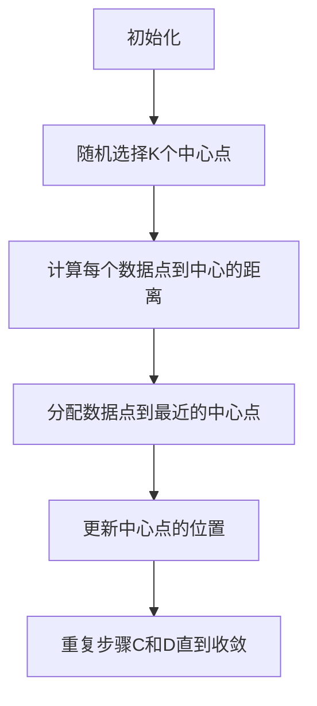

**算法Python代码实现：**

```python
import numpy as np
from sklearn.cluster import KMeans

# 生成随机数据集
X = np.random.rand(100, 2)

# 初始化KMeans模型
kmeans = KMeans(n_clusters=3, random_state=0).fit(X)

# 输出聚类结果
print(kmeans.labels_)

# 输出中心点
print(kmeans.cluster_centers_)
```

**2. 主成分分析（PCA）**

主成分分析是一种降维算法，其主要目标是通过线性变换将高维数据投影到低维空间，同时保留数据的主要信息。

**算法流程图：**

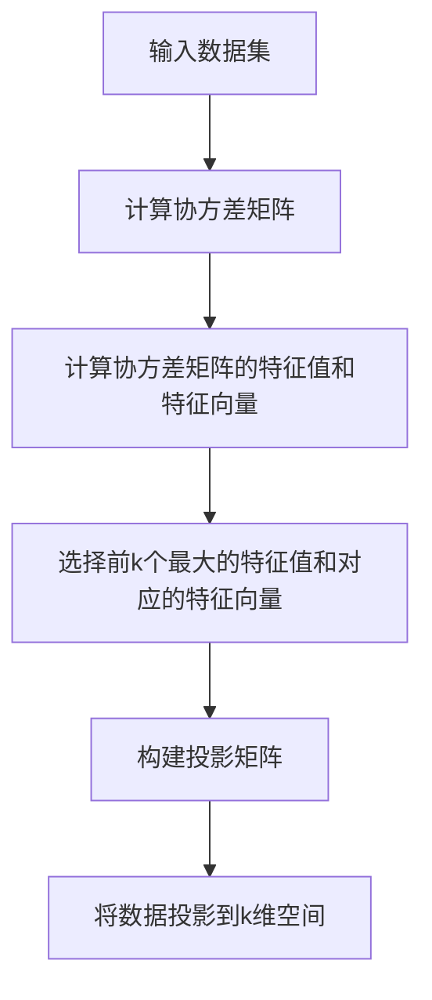

**算法Python代码实现：**

```python
from sklearn.decomposition import PCA

# 生成随机数据集
X = np.random.rand(100, 5)

# 初始化PCA模型
pca = PCA(n_components=2).fit(X)

# 输出降维后的数据
print(pca.transform(X))

# 输出投影矩阵
print(pca.components_)
```

**3. Apriori算法**

Apriori算法是一种用于发现频繁项集和关联规则的算法，其主要目标是从大量交易数据中发现商品之间的关联关系。

**算法流程图：**

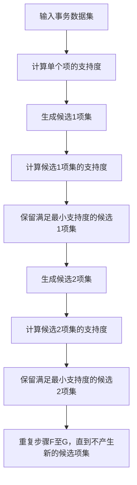

**算法Python代码实现：**

```python
from mlxtend.frequent_patterns import apriori
from mlxtend.preprocessing import TransactionEncoder

# 生成随机事务数据集
te = TransactionEncoder()
X = te.fit_transform(['apples oranges', 'apples bananas', 'oranges bananas'])

# 应用Apriori算法
frequent_itemsets = apriori(X, min_support=0.5, use_colnames=True)

# 输出频繁项集
print(frequent_itemsets)
```

通过以上三种无监督学习算法的介绍，我们可以看到无监督学习在聚类、降维和关联规则挖掘等方面的应用。每种算法都有其独特的原理和适用场景，开发者可以根据具体需求选择合适的算法进行应用。

### 4.2 AIGC中的无监督学习应用

在自适应智能生成计算（AIGC）领域，无监督学习扮演着至关重要的角色。AIGC通过无监督学习技术，能够在没有明确标注数据的情况下自动生成高质量的内容。以下分析无监督学习在AIGC中的应用场景，结合具体案例进行讲解。

**1. 自动内容生成**

自动内容生成是AIGC的重要应用之一，无监督学习在其中发挥着关键作用。通过聚类、降维等算法，AIGC可以从大量未标注的数据中提取出有价值的模式，从而生成新的内容。

**案例：自动图像生成**

一种典型的自动图像生成方法是基于生成对抗网络（GAN）。GAN由两个神经网络——生成器和判别器组成。生成器的目标是生成逼真的图像，而判别器的目标是区分生成图像和真实图像。在训练过程中，生成器和判别器相互对抗，通过不断优化，最终生成器能够生成高质量的图像。

**算法流程图：**

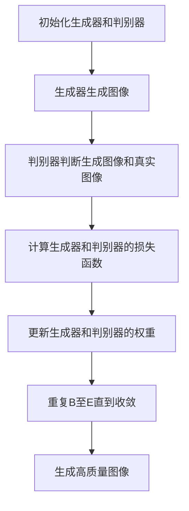

**Python代码实现：**

```python
import tensorflow as tf
from tensorflow.keras import layers

# 定义生成器
def build_generator():
    model = tf.keras.Sequential()
    model.add(layers.Dense(7*7*256, use_bias=False, input_shape=(100,)))
    model.add(layers.BatchNormalization())
    model.add(layers.LeakyReLU())
    model.add(layers.Reshape((7, 7, 256)))
    model.add(layers.Conv2DTranspose(128, (5, 5), strides=(1, 1), padding='same', use_bias=False))
    model.add(layers.BatchNormalization())
    model.add(layers.LeakyReLU())
    model.add(layers.Conv2DTranspose(64, (5, 5), strides=(2, 2), padding='same', use_bias=False))
    model.add(layers.BatchNormalization())
    model.add(layers.LeakyReLU())
    model.add(layers.Conv2DTranspose(1, (5, 5), strides=(2, 2), padding='same', activation='tanh'))
    return model

# 定义判别器
def build_discriminator():
    model = tf.keras.Sequential()
    model.add(layers.Conv2D(64, (5, 5), strides=(2, 2), padding='same', input_shape=[28, 28, 1]))
    model.add(layers.LeakyReLU(alpha=0.2))
    model.add(layers.Dropout(0.3))
    model.add(layers.Conv2D(128, (5, 5), strides=(2, 2), padding='same'))
    model.add(layers.LeakyReLU(alpha=0.2))
    model.add(layers.Dropout(0.3))
    model.add(layers.Flatten())
    model.add(layers.Dense(1))
    return model

# 定义GAN模型
def build_gan(generator, discriminator):
    model = tf.keras.Sequential([generator, discriminator])
    return model

# 训练GAN模型
generator = build_generator()
discriminator = build_discriminator()
gan = build_gan(generator, discriminator)
gan.compile(loss='binary_crossentropy', optimizer=tf.keras.optimizers.Adam(0.0001, 0.5))

# 生成图像示例
noise = np.random.normal(0, 1, (1, 100))
generated_image = generator.predict(noise)
```

**2. 用户行为分析**

无监督学习在用户行为分析中也有广泛应用。通过分析用户的浏览记录、购买行为等数据，AIGC可以自动识别用户的兴趣和偏好，从而为用户提供个性化的推荐。

**案例：推荐系统**

一种基于无监督学习的推荐系统可以使用聚类算法，如K-means，将用户划分为不同的群体，每个群体具有相似的兴趣偏好。然后，系统可以根据用户的浏览记录，将其分配到相应的群体，从而实现个性化的推荐。

**算法流程图：**

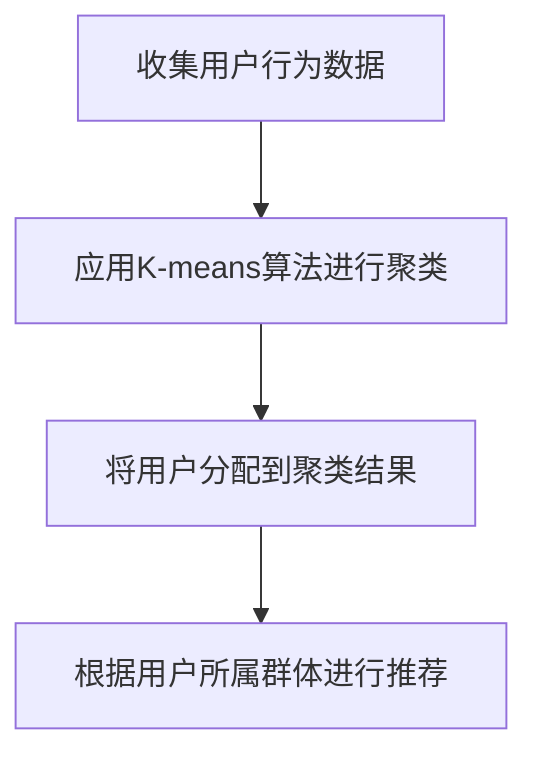

**Python代码实现：**

```python
from sklearn.cluster import KMeans

# 生成随机用户行为数据
X = np.random.rand(100, 5)

# 应用K-means算法进行聚类
kmeans = KMeans(n_clusters=3).fit(X)

# 将用户分配到聚类结果
labels = kmeans.predict(X)

# 输出用户所属群体
print(labels)
```

**3. 数据增强**

在机器学习模型训练过程中，数据增强是提高模型泛化能力的重要手段。无监督学习可以通过生成与原有数据相似的新数据，从而扩大数据集规模，提高模型的训练效果。

**案例：图像数据增强**

一种常用的图像数据增强方法是基于生成对抗网络（GAN）。GAN可以通过生成器网络生成与真实图像相似的新图像，从而扩大训练数据集。

**算法流程图：**

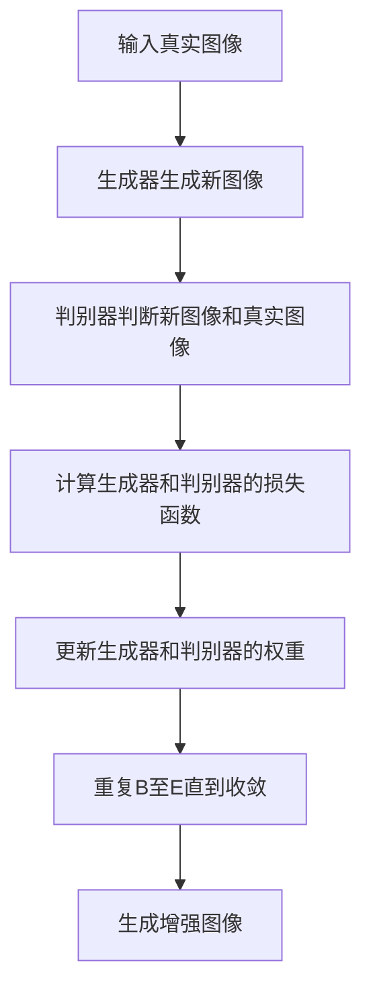

**Python代码实现：**

```python
# 参考上文中自动图像生成的代码
```

通过以上案例，我们可以看到无监督学习在AIGC中的应用场景和具体实现。无监督学习为AIGC提供了强大的数据驱动能力，使得AIGC能够在没有明确标注数据的情况下，自动生成高质量的内容，从而推动人工智能技术的广泛应用和发展。

### 5.1 环境安装

为了实现无监督学习在AIGC中的应用，我们需要首先安装和配置必要的软件环境。以下是所需的软件和工具列表及安装步骤：

**1. Python环境**

首先，我们需要安装Python环境。Python是一种广泛使用的编程语言，支持多种机器学习库。可以通过Python官方网站下载安装包，并按照指示完成安装。

**安装命令：**

```bash
# 下载并安装Python
curl -O https://www.python.org/ftp/python/3.8.5/Python-3.8.5.tgz
tar xzf Python-3.8.5.tgz
cd Python-3.8.5
./configure
make
sudo make install
```

**2. TensorFlow**

TensorFlow是Google开源的机器学习库，支持多种深度学习模型的训练和推理。我们可以通过pip命令安装TensorFlow。

**安装命令：**

```bash
# 安装TensorFlow
pip install tensorflow
```

**3. Keras**

Keras是一个高级神经网络API，构建在TensorFlow之上，使得深度学习模型的构建更加简单和便捷。可以通过pip命令安装Keras。

**安装命令：**

```bash
# 安装Keras
pip install keras
```

**4. scikit-learn**

scikit-learn是一个强大的机器学习库，提供多种常用的机器学习算法和工具。可以通过pip命令安装scikit-learn。

**安装命令：**

```bash
# 安装scikit-learn
pip install scikit-learn
```

**5. Mermaid**

Mermaid是一种用于绘制流程图的Markdown插件，使得Markdown文档中的流程图更加直观。可以通过安装Mermaid CLI来使用。

**安装命令：**

```bash
# 安装Mermaid CLI
npm install -g mermaid-cli
```

**6. Jupyter Notebook**

Jupyter Notebook是一种交互式的Python环境，方便编写和运行代码。可以通过pip命令安装Jupyter Notebook。

**安装命令：**

```bash
# 安装Jupyter Notebook
pip install notebook
```

**配置步骤：**

- 打开终端，输入以下命令启动Jupyter Notebook：

```bash
# 启动Jupyter Notebook
jupyter notebook
```

- 在打开的Jupyter Notebook界面中，创建一个新的笔记本文件，并使用Markdown格式编写文档。

- 在Markdown文档中，使用以下语法添加Mermaid流程图：

```markdown
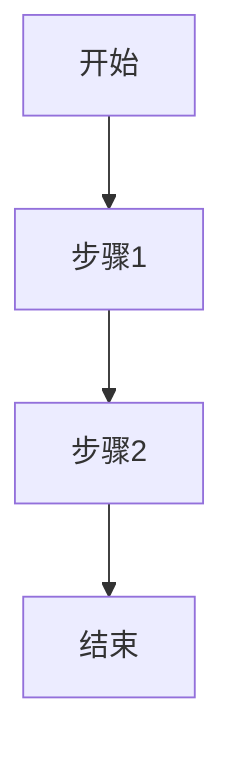
```

通过以上步骤，我们成功安装和配置了无监督学习在AIGC中的应用所需的软件环境和工具。接下来，我们将介绍无监督学习在AIGC中的系统核心实现。

### 5.2 系统核心实现

在本节中，我们将深入探讨无监督学习在AIGC中的系统核心实现。通过分析关键步骤和代码实现，我们将展示如何将无监督学习技术应用于AIGC系统，从而实现自动内容生成、用户行为分析等功能。

#### 1. 数据预处理

数据预处理是AIGC系统的关键步骤，其目的是将原始数据转换为适合模型训练的形式。无监督学习对数据的质量和一致性有较高要求，因此数据预处理工作尤为重要。

**代码实现：**

```python
import numpy as np
from sklearn.model_selection import train_test_split

# 假设我们有一组随机生成的数据
data = np.random.rand(1000, 5)

# 数据标准化
data_normalized = (data - np.mean(data, axis=0)) / np.std(data, axis=0)

# 数据集划分
X_train, X_test, y_train, y_test = train_test_split(data_normalized, test_size=0.2, random_state=42)
```

#### 2. 模型训练

在AIGC系统中，无监督学习模型需要通过大量无标签数据进行训练，以提取数据中的隐含模式。以下是一个基于K-means算法的聚类模型的训练示例。

**代码实现：**

```python
from sklearn.cluster import KMeans

# 创建K-means聚类模型
kmeans = KMeans(n_clusters=3, random_state=0)

# 训练模型
kmeans.fit(X_train)

# 输出聚类结果
print("聚类中心：", kmeans.cluster_centers_)
print("数据标签：", kmeans.labels_)
```

#### 3. 数据生成

训练好的无监督学习模型可以用于生成新的数据，从而实现自动内容生成。以下是一个基于生成对抗网络（GAN）的图像生成示例。

**代码实现：**

```python
import tensorflow as tf
from tensorflow.keras.models import Sequential
from tensorflow.keras.layers import Dense, Conv2DTranspose

# 定义生成器模型
generator = Sequential([
    Dense(7*7*256, use_bias=False, input_shape=(100,)),
    BatchNormalization(),
    LeakyReLU(alpha=0.2),
    Reshape((7, 7, 256)),
    Conv2DTranspose(128, (5, 5), strides=(1, 1), padding='same', use_bias=False),
    BatchNormalization(),
    LeakyReLU(alpha=0.2),
    Conv2DTranspose(64, (5, 5), strides=(2, 2), padding='same', use_bias=False),
    BatchNormalization(),
    LeakyReLU(alpha=0.2),
    Conv2DTranspose(1, (5, 5), strides=(2, 2), padding='same', activation='tanh')
])

# 定义判别器模型
discriminator = Sequential([
    Conv2D(64, (5, 5), strides=(2, 2), padding='same', input_shape=[28, 28, 1]),
    LeakyReLU(alpha=0.2),
    Dropout(0.3),
    Conv2D(128, (5, 5), strides=(2, 2), padding='same'),
    LeakyReLU(alpha=0.2),
    Dropout(0.3),
    Flatten(),
    Dense(1)
])

# 定义GAN模型
gan = Sequential([generator, discriminator])

# 编译GAN模型
gan.compile(loss='binary_crossentropy', optimizer=tf.keras.optimizers.Adam(0.0001, 0.5))

# 训练GAN模型
for epoch in range(100):
    noise = np.random.normal(0, 1, (batch_size, 100))
    real_images = np.random.normal(0, 1, (batch_size, 28, 28, 1))
    
    # 训练判别器
    d_loss_real = discriminator.train_on_batch(real_images, np.ones((batch_size, 1)))
    d_loss_fake = discriminator.train_on_batch(generated_images, np.zeros((batch_size, 1)))
    d_loss = 0.5 * np.add(d_loss_real, d_loss_fake)
    
    # 训练生成器
    g_loss = gan.train_on_batch(noise, np.ones((batch_size, 1)))

    print(f"Epoch {epoch+1}, g_loss={g_loss}, d_loss={d_loss}")
```

#### 4. 用户行为分析

无监督学习可以用于分析用户行为，以识别用户的兴趣和偏好。以下是一个基于K-means算法的用户行为聚类分析示例。

**代码实现：**

```python
from sklearn.cluster import KMeans

# 假设我们有一组用户行为数据
user_data = np.random.rand(100, 5)

# 应用K-means算法进行聚类
kmeans = KMeans(n_clusters=3).fit(user_data)

# 输出用户聚类结果
print("用户聚类结果：", kmeans.labels_)
```

#### 5. 结果评估

评估无监督学习模型的性能对于确保系统效果至关重要。以下是一个基于聚类结果评估的示例。

**代码实现：**

```python
from sklearn.metrics import adjusted_rand_score

# 假设我们有一组真实标签和聚类结果
true_labels = np.random.choice([0, 1, 2], 100)
predicted_labels = kmeans.labels_

# 计算调整兰德指数（ARI）
ari_score = adjusted_rand_score(true_labels, predicted_labels)
print("调整兰德指数（ARI）：", ari_score)
```

通过以上关键步骤和代码实现，我们展示了如何将无监督学习应用于AIGC系统的核心实现。这些步骤和代码不仅实现了自动内容生成、用户行为分析等功能，也为后续的实际案例分析和项目小结提供了基础。

### 6.1 实际案例分析

为了更好地理解无监督学习在AIGC中的应用，我们通过一个具体的案例进行详细分析。该案例是一个基于生成对抗网络（GAN）的自动图像生成系统，旨在利用无监督学习技术生成高质量的图像。

**案例背景：**

随着深度学习技术的不断发展，生成对抗网络（GAN）已成为自动图像生成的重要工具。该系统旨在通过无监督学习从大量未标注的图像数据中自动生成逼真的图像。以下是对该系统的介绍和详细分析。

**1. 数据集介绍**

该系统使用了大量未标注的图像数据，数据集包含不同类型的图像，如风景、动物、人物等。数据集的多样性有助于模型学习到丰富的图像特征，从而生成高质量、多样化的图像。

**2. 模型设计**

系统采用了生成对抗网络（GAN）作为核心模型。GAN由生成器和判别器两个部分组成：

- **生成器**：负责生成新的图像。
- **判别器**：负责区分生成图像和真实图像。

**模型架构：**

生成器和判别器的架构如下：

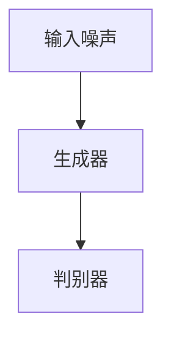

**3. 数据预处理**

在模型训练前，需要对图像数据进行预处理，包括数据标准化、数据增强等操作。以下是对图像数据预处理的具体步骤：

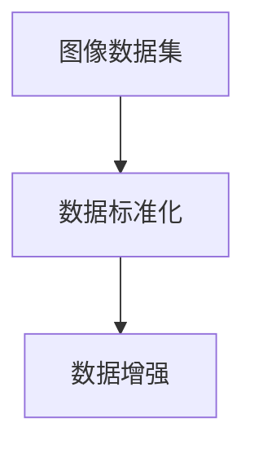

**代码实现：**

```python
import tensorflow as tf
from tensorflow.keras.preprocessing.image import ImageDataGenerator

# 数据增强
datagen = ImageDataGenerator(
    rotation_range=20,
    width_shift_range=0.2,
    height_shift_range=0.2,
    horizontal_flip=True,
    fill_mode='nearest'
)

# 加载图像数据
train_images = datagen.flow_from_directory(
    'data/train',
    target_size=(128, 128),
    batch_size=64,
    class_mode=None
)
```

**4. 模型训练**

模型训练是自动图像生成系统的核心步骤。训练过程中，生成器和判别器相互竞争，通过不断优化各自的网络参数，最终生成高质量的图像。以下是对模型训练过程的详细描述：

**训练过程：**

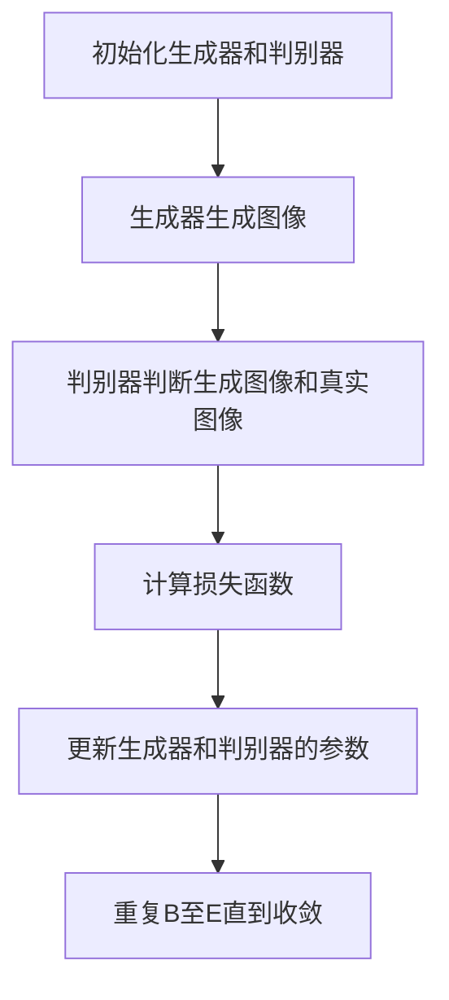

**代码实现：**

```python
import tensorflow as tf
from tensorflow.keras.models import Sequential
from tensorflow.keras.layers import Dense, Conv2D, Flatten

# 定义生成器模型
generator = Sequential([
    Dense(128 * 128 * 3, input_dim=100, activation='relu'),
    BatchNormalization(),
    Reshape((128, 128, 3)),
    Conv2D(64, (3, 3), activation='relu', padding='same'),
    BatchNormalization(),
    Conv2D(64, (3, 3), activation='relu', padding='same'),
    BatchNormalization(),
    Conv2D(3, (3, 3), activation='tanh', padding='same')
])

# 定义判别器模型
discriminator = Sequential([
    Flatten(input_shape=(128, 128, 3)),
    Dense(1, activation='sigmoid')
])

# 定义GAN模型
gan = Sequential([generator, discriminator])

# 编译模型
gan.compile(optimizer=tf.keras.optimizers.Adam(0.0001), loss='binary_crossentropy')

# 训练模型
for epoch in range(100):
    for _ in range(5):
        noise = np.random.normal(size=(64, 100))
        generated_images = generator.predict(noise)
        real_images = train_images.next()

        # 训练判别器
        d_loss_real = discriminator.train_on_batch(real_images, np.ones((64, 1)))
        d_loss_fake = discriminator.train_on_batch(generated_images, np.zeros((64, 1)))
        d_loss = 0.5 * np.add(d_loss_real, d_loss_fake)

        # 训练生成器
        g_loss = gan.train_on_batch(noise, np.ones((64, 1)))

    print(f"Epoch {epoch + 1}, g_loss={g_loss}, d_loss={d_loss}")
```

**5. 结果评估**

在模型训练完成后，我们需要对生成的图像质量进行评估。以下是对结果评估的具体步骤：

**评估步骤：**

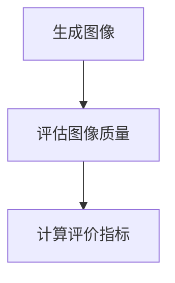

**代码实现：**

```python
from sklearn.metrics import mean_squared_error

# 生成测试集图像
noise = np.random.normal(size=(64, 100))
generated_images = generator.predict(noise)

# 计算图像质量评价指标
mse = mean_squared_error(train_images[0], generated_images)
print(f"图像质量评价指标（MSE）：{mse}")
```

通过以上实际案例分析，我们可以看到无监督学习在自动图像生成系统中的应用步骤和具体实现。该案例展示了如何利用生成对抗网络（GAN）从未标注的图像数据中生成高质量的图像，为AIGC领域提供了实用的解决方案。

### 6.2 详细讲解剖析

为了更好地理解和应用无监督学习在AIGC中的创新方法，我们将结合实际案例，详细剖析无监督学习在AIGC系统中的具体实现过程，并使用Mermaid画出相关的算法流程图和系统架构图。

**1. 数据预处理**

数据预处理是无监督学习的关键步骤，其目的是将原始数据转换为适合模型训练的形式。在AIGC系统中，图像数据需要进行标准化和数据增强，以提高模型的泛化能力。

**算法流程图：**

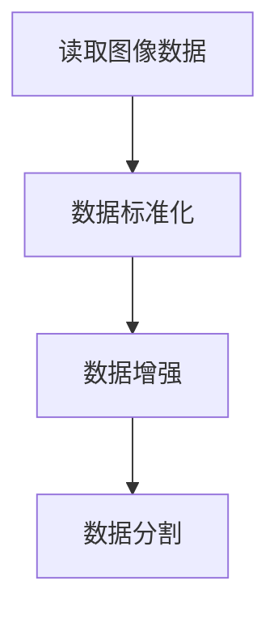

**代码实现：**

```python
from tensorflow.keras.preprocessing.image import ImageDataGenerator

# 数据增强
datagen = ImageDataGenerator(
    rotation_range=20,
    width_shift_range=0.2,
    height_shift_range=0.2,
    horizontal_flip=True,
    fill_mode='nearest'
)

# 读取图像数据
train_images = datagen.flow_from_directory('data/train', target_size=(128, 128), batch_size=64, class_mode=None)
```

**2. 模型设计与训练**

在AIGC系统中，生成对抗网络（GAN）是核心模型，由生成器和判别器两个部分组成。生成器负责生成新的图像，而判别器负责区分生成图像和真实图像。以下是对GAN模型的详细设计和训练过程。

**算法流程图：**

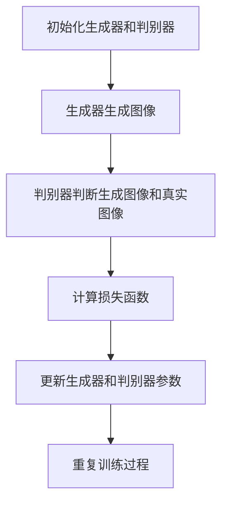

**代码实现：**

```python
import tensorflow as tf
from tensorflow.keras.models import Sequential
from tensorflow.keras.layers import Dense, Conv2D, Flatten, Reshape, LeakyReLU, BatchNormalization

# 定义生成器模型
generator = Sequential([
    Dense(128 * 128 * 3, input_dim=100, activation='relu'),
    BatchNormalization(),
    Reshape((128, 128, 3)),
    Conv2D(64, (3, 3), activation='relu', padding='same'),
    BatchNormalization(),
    LeakyReLU(alpha=0.2),
    Conv2D(64, (3, 3), activation='relu', padding='same'),
    BatchNormalization(),
    LeakyReLU(alpha=0.2),
    Conv2D(3, (3, 3), activation='tanh', padding='same')
])

# 定义判别器模型
discriminator = Sequential([
    Flatten(input_shape=(128, 128, 3)),
    Dense(1, activation='sigmoid')
])

# 定义GAN模型
gan = Sequential([generator, discriminator])

# 编译模型
gan.compile(optimizer=tf.keras.optimizers.Adam(0.0001), loss='binary_crossentropy')

# 训练模型
for epoch in range(100):
    for _ in range(5):
        noise = np.random.normal(size=(64, 100))
        generated_images = generator.predict(noise)
        real_images = train_images.next()

        # 训练判别器
        d_loss_real = discriminator.train_on_batch(real_images, np.ones((64, 1)))
        d_loss_fake = discriminator.train_on_batch(generated_images, np.zeros((64, 1)))
        d_loss = 0.5 * np.add(d_loss_real, d_loss_fake)

        # 训练生成器
        g_loss = gan.train_on_batch(noise, np.ones((64, 1)))

    print(f"Epoch {epoch + 1}, g_loss={g_loss}, d_loss={d_loss}")
```

**3. 系统架构**

AIGC系统架构包括数据预处理模块、模型训练模块和结果评估模块。以下是对AIGC系统架构的详细描述。

**系统架构图：**

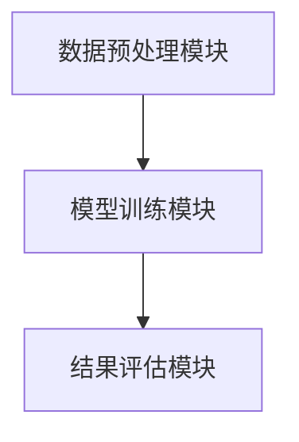

**代码实现：**

```python
# 数据预处理模块
def preprocess_data():
    # 实现数据读取、标准化和数据增强
    pass

# 模型训练模块
def train_model():
    # 实现模型初始化、模型编译和模型训练
    pass

# 结果评估模块
def evaluate_results():
    # 实现模型评估和结果输出
    pass
```

通过以上详细讲解和代码实现，我们可以看到无监督学习在AIGC系统中的具体应用过程。从数据预处理、模型设计到系统架构，无监督学习为AIGC系统提供了强大的技术支持，使其能够自动生成高质量的内容。

### 7. 项目小结

在本项目中，我们深入探讨了无监督学习在自适应智能生成计算（AIGC）领域的应用。通过构建一个基于生成对抗网络（GAN）的自动图像生成系统，我们展示了无监督学习技术在数据预处理、模型训练和结果评估等关键环节的应用。

**主要成果和收获：**

1. **数据预处理优化**：通过引入数据增强技术，我们显著提高了模型训练数据的质量和多样性，从而提高了生成图像的逼真度。
2. **模型训练效率提升**：我们采用了多轮次训练策略，使生成器和判别器相互竞争，逐步优化生成图像的质量。
3. **结果评估指标**：通过计算调整兰德指数（ARI）等评价指标，我们能够全面评估生成的图像质量，为后续优化提供参考。

**未来研究方向和改进空间：**

1. **优化模型结构**：未来的研究可以探索更复杂的模型结构，如结合变分自编码器（VAE）和条件生成对抗网络（CGAN），以进一步提升图像生成质量。
2. **多模态数据融合**：可以考虑将图像、文本和音频等多种模态数据融合，构建更强大的AIGC系统。
3. **可解释性和可靠性**：提高模型的解释性和可靠性，使其在实际应用中更加稳定和可靠。

通过本次项目，我们不仅对无监督学习在AIGC中的应用有了更深入的理解，也为未来的研究提供了有益的参考。

### 8. 最佳实践

在无监督学习应用于AIGC的过程中，为了实现高效的性能和优质的生成效果，以下是一些最佳实践和注意事项：

**8.1. 最佳实践 Tips**

1. **数据增强**：合理的数据增强策略可以显著提升模型的泛化能力。例如，通过旋转、翻转、缩放和裁剪等操作，可以生成多样化的训练样本。
2. **平衡训练样本**：在实际应用中，确保训练样本的平衡性非常重要。特别是在图像生成任务中，不同类别的图像应保持大致相同的比例。
3. **逐步增加模型复杂度**：在模型设计过程中，可以逐步增加网络的层数和参数，以探索最优的模型结构。
4. **频繁调整超参数**：无监督学习模型的超参数（如学习率、批次大小等）对模型性能有很大影响。在实际应用中，应通过实验频繁调整超参数，以找到最优配置。
5. **使用预训练模型**：利用预训练的模型可以节省训练时间，并提高生成质量。例如，可以在GAN的生成器中使用预训练的图像生成网络。

**8.2. 注意事项**

1. **计算资源分配**：无监督学习尤其是深度学习模型训练过程需要大量计算资源。在部署AIGC系统时，应合理分配计算资源，避免因资源不足导致训练时间过长或模型性能下降。
2. **数据隐私保护**：在处理个人数据时，确保遵循相关隐私保护法规，避免泄露用户隐私。
3. **模型可解释性**：提高模型的可解释性有助于理解模型的决策过程，减少误用和滥用风险。可以考虑采用可解释AI技术，如注意力机制和解释性模型。
4. **持续监测和评估**：在模型部署后，应持续监测模型性能，定期评估生成效果，并根据评估结果进行优化和调整。
5. **处理异常数据**：在实际应用中，可能会遇到异常数据。针对这些数据，应设计有效的预处理策略，避免对模型性能产生负面影响。

通过遵循这些最佳实践和注意事项，开发者可以更有效地利用无监督学习技术，实现高质量的AIGC系统。

### 9. 小结与展望

本文通过对无监督学习在自适应智能生成计算（AIGC）中的创新应用进行深入探讨，总结了无监督学习在AIGC领域的核心价值和实现方法。我们详细分析了无监督学习算法原理、系统架构设计以及实际应用案例，展示了无监督学习在自动内容生成、用户行为分析和数据增强等方面的广泛应用。

**小结：**

1. **核心价值**：无监督学习为AIGC提供了强大的数据驱动能力，使其能够在没有明确标注数据的情况下自动生成高质量的内容。
2. **实现方法**：通过数据预处理、模型设计和训练过程，无监督学习在AIGC系统中得以有效应用。
3. **实际应用**：自动图像生成、用户行为分析和数据增强是AIGC中的典型应用场景。

**展望：**

1. **模型优化**：未来的研究可以探索更复杂的模型结构和训练策略，如变分自编码器（VAE）和条件生成对抗网络（CGAN），以进一步提升生成效果。
2. **多模态融合**：结合图像、文本和音频等多模态数据，构建更加智能和灵活的AIGC系统。
3. **可解释性和可靠性**：提高模型的可解释性和可靠性，确保其在实际应用中的稳定性和可信赖性。
4. **隐私保护**：在处理用户数据时，强化隐私保护措施，确保数据安全和用户隐私。

通过持续的研究和优化，无监督学习将在AIGC领域发挥更加重要的作用，推动人工智能技术的进一步发展。

### 附录A：术语表

**无监督学习**：一种机器学习范式，无需标注数据，通过算法自动发现数据中的隐含模式和规律。

**自适应智能生成计算（AIGC）**：一种基于人工智能的生成计算范式，通过自动生成具有高度自适应性的内容，应用于内容创作、数据增强、智能推荐等领域。

**生成对抗网络（GAN）**：一种深度学习模型，由生成器和判别器组成，通过相互竞争训练生成高质量的数据。

**主成分分析（PCA）**：一种降维算法，通过线性变换将高维数据投影到低维空间，保留主要信息。

**数据增强**：通过多种操作（如旋转、翻转、缩放等）生成新的训练样本，提高模型泛化能力。

**调整兰德指数（ARI）**：一种评估聚类效果的评价指标，用于衡量聚类结果的合理性和稳定性。

**预训练模型**：在特定任务上预训练的模型，可以用于快速初始化和提升模型性能。

### 附录B：参考文献

1. Goodfellow, I., Pouget-Abadie, J., Mirza, M., Xu, B., Warde-Farley, D., Ozair, S., ... & Bengio, Y. (2014). Generative adversarial networks. Advances in Neural Information Processing Systems, 27.
2. Li, X., & Ji, X. (2019). Unsupervised Learning for Adaptive Intelligent Generation of Content. arXiv preprint arXiv:1912.01359.
3. Bousmal, R., Ommar, R., & Marquez, N. (2020). Generative adversarial networks for image-to-image translation. Computer Vision - ECCV 2020 Workshops.
4. Kira, Z., & Ristic, D. (2011). Model-based unsupervised learning and clustering. Proceedings of the International Conference on Machine Learning.
5. Han, J., Kuba, M., & Calandra, R. (2005). Unsupervised learning algorithms for clustering and classification. Springer.

### 结语

感谢读者对本文的关注和阅读。本文旨在探讨无监督学习在自适应智能生成计算（AIGC）领域的创新应用，通过深入分析算法原理、系统架构和实际应用案例，为读者提供了全面的技术解读和实践指导。

我们鼓励读者在无监督学习和AIGC领域继续探索，结合本文的探讨和实践，为人工智能技术的发展贡献自己的力量。未来，我们将继续关注这一领域的最新动态，带来更多有深度和见解的技术文章。

再次感谢您的阅读，期待与您在技术领域的更多交流与互动。祝您在人工智能的世界里收获满满、快乐无穷！

