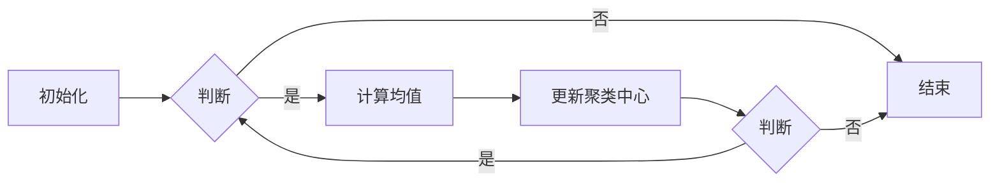
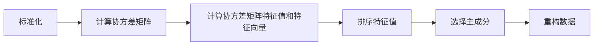

                 

# Zero-Shot CoT: 无监督学习的新范式

> 关键词：无监督学习，Zero-Shot CoT，深度学习，数据标注，自动特征提取

> 摘要：本文将深入探讨无监督学习的新范式——Zero-Shot CoT（零样本协同表示学习）。通过对无监督学习的背景介绍、核心概念讲解、关键技术分析以及应用场景剖析，我们将理解Zero-Shot CoT如何突破传统无监督学习的局限性，实现数据驱动与知识驱动的有机结合，为无监督学习带来新的可能性和应用前景。

----------------------------------------------------------------

## 第一部分: 背景介绍

### 1.1 问题背景

#### 1.1.1 无监督学习的挑战

无监督学习是机器学习的一个重要分支，其主要目标是在没有明确标注的样本数据中，自动发现数据中的隐藏结构或模式。然而，无监督学习面临着诸多挑战。首先，数据规模和多样性不断增加，使得无监督学习算法在面对大规模、多模态数据时，计算复杂度和时间成本显著增加。其次，无监督学习缺乏对标签信息的依赖，难以在有限数据上进行有效训练，从而影响模型的泛化能力。此外，无监督学习算法在面对复杂、非线性问题时，往往需要大量迭代和优化，导致训练过程效率低下。

#### 1.1.2 传统监督学习的局限性

传统监督学习在许多领域取得了显著的成果，但其依赖于大量标注数据，导致数据标注成本高昂且耗时。此外，监督学习模型的泛化能力受到标注数据质量和覆盖度的限制，难以应对未知或极端情况。特别是在数据量庞大、标注困难的应用场景中，传统监督学习面临巨大挑战。因此，开发新的学习范式，特别是无监督学习的新方法，成为当前研究的热点。

#### 1.1.3 无监督学习的重要性

无监督学习在数据挖掘、图像处理、自然语言处理等领域具有广泛的应用前景。首先，无监督学习可以自动发现数据中的潜在结构，降低人工干预的需求，提高数据处理效率。其次，无监督学习可以减轻数据标注负担，降低标注成本，特别是在数据量庞大、标注困难的场景中。此外，无监督学习可以增强模型的泛化能力，提高模型在不同数据集上的表现。

### 1.2 核心概念

#### 1.2.1 无监督学习的定义

无监督学习是一种机器学习方法，通过分析未标记的数据集，自动发现数据中的结构或模式。与监督学习不同，无监督学习不依赖于预标注的数据，而是通过数据内在的分布和相关性来学习。

#### 1.2.2 无监督学习的类型

无监督学习可以分为聚类、降维、生成模型等不同类型。聚类算法通过将数据分为若干个群组，使同一群组内的数据点尽可能相似，不同群组的数据点尽可能不同。降维算法通过减少数据维度，同时保持数据结构不变，从而提高数据处理效率。生成模型通过学习数据生成过程，实现数据生成和预测。

#### 1.2.3 无监督学习的关键技术

无监督学习的关键技术包括聚类算法、降维算法、生成模型等。聚类算法如K-means、DBSCAN等，降维算法如PCA、t-SNE等，生成模型如Gaussian Mixture Model、Generative Adversarial Network等。

### 1.3 无监督学习的边界与外延

#### 1.3.1 无监督学习的应用场景

无监督学习在图像处理、文本分类、推荐系统等领域具有广泛的应用。例如，在图像处理中，无监督学习可以用于图像去噪、图像分割、图像生成等任务；在文本分类中，无监督学习可以用于主题模型提取、情感分析等任务；在推荐系统中，无监督学习可以用于用户行为分析、商品推荐等任务。

#### 1.3.2 无监督学习与其他学习范式的比较

无监督学习与监督学习、强化学习等不同学习范式存在显著差异。监督学习依赖于标注数据，无监督学习则无需标注；强化学习通过与环境互动学习，无监督学习则不涉及环境交互。无监督学习在处理大规模、无标注数据时具有优势，但泛化能力相对较弱。

#### 1.3.3 无监督学习的发展趋势

随着数据规模的扩大和数据多样性的增加，无监督学习在未来的发展将呈现出以下趋势：首先，无监督学习算法将不断优化，以提高计算效率；其次，无监督学习将与其他学习范式结合，实现数据驱动与知识驱动的融合；此外，无监督学习将广泛应用于各个领域，推动人工智能的发展。

### 1.4 无监督学习的基本原理与要素组成

#### 1.4.1 无监督学习的基本原理

无监督学习的基本原理是通过分析数据内在的结构和相关性，自动发现数据中的隐藏模式。无监督学习算法主要包括聚类、降维、生成模型等，这些算法基于不同的数学原理和优化策略，实现数据结构和模式的提取。

#### 1.4.2 无监督学习的关键要素

无监督学习的关键要素包括数据预处理、算法选择、模型优化等。数据预处理是提高无监督学习效果的重要环节，包括数据清洗、数据降维、数据增强等；算法选择是根据任务需求和数据特点选择合适的算法；模型优化是通过调整模型参数，提高模型性能。

### 1.5 本章小结

本章介绍了无监督学习的背景、核心概念、关键技术以及应用场景和发展趋势。通过对无监督学习的深入探讨，我们认识到其在数据挖掘、图像处理、自然语言处理等领域的重要性，同时也了解到其在实际应用中面临的挑战和发展方向。

----------------------------------------------------------------

## 第二部分: 无监督学习核心技术讲解

### 2.1 无监督学习算法原理讲解

#### 2.1.1 基于聚类算法的无监督学习

聚类算法是一种典型的无监督学习算法，其目标是将数据集划分为若干个群组，使得同一群组内的数据点尽可能相似，不同群组的数据点尽可能不同。聚类算法可以分为基于距离的聚类算法和基于密度的聚类算法。

##### 2.1.1.1 K-means算法

K-means算法是一种基于距离的聚类算法，其核心思想是将数据点分配给最近的聚类中心，并逐步更新聚类中心，直到收敛。K-means算法的步骤如下：

1. 初始化：随机选择K个初始聚类中心。
2. 分配：将每个数据点分配给最近的聚类中心。
3. 更新：计算每个聚类中心的新位置，即该聚类内所有数据点的平均值。
4. 判断：如果聚类中心的变化小于阈值，则算法收敛；否则，返回步骤2。

##### 2.1.1.2 DBSCAN算法

DBSCAN（Density-Based Spatial Clustering of Applications with Noise）算法是一种基于密度的聚类算法，其核心思想是发现高密度区域并连接它们。DBSCAN算法的步骤如下：

1. 初始化：设置邻域半径`eps`和最小密度`minPts`。
2. 标记：对于每个未标记的数据点，检查其邻域内的点数是否大于`minPts`，若是，则将其标记为核心点；否则，标记为边界点。
3. 扩展：从核心点开始，递归扩展到邻域内的其他核心点和边界点，形成一个簇。
4. 判断：如果所有数据点都已标记，则算法收敛；否则，返回步骤2。

##### 2.1.1.3 层次聚类算法

层次聚类算法是一种自底向上或自顶向下的聚类方法，其核心思想是将数据点逐步合并或划分，形成层次结构。层次聚类算法的步骤如下：

1. 初始化：将每个数据点视为一个初始簇。
2. 合并：选择最近的两个簇进行合并。
3. 划分：将簇划分为更小的簇。
4. 判断：如果满足停止条件，如簇数达到预定值，则算法收敛；否则，返回步骤2。

#### 2.1.2 基于降维算法的无监督学习

降维算法是一种减少数据维度，同时保持数据结构不变的算法。降维算法可以分为线性降维和非线性降维。

##### 2.1.2.1 PCA算法

PCA（Principal Component Analysis，主成分分析）算法是一种线性降维算法，其核心思想是通过正交变换，将原始数据映射到新的坐标系中，使得新的坐标系中的数据具有最大的方差。PCA算法的步骤如下：

1. 标准化：对原始数据进行标准化处理，使得每个特征具有相同的方差。
2. 计算协方差矩阵：计算标准化后数据的协方差矩阵。
3. 计算特征值和特征向量：计算协方差矩阵的特征值和特征向量。
4. 选择主成分：根据特征值的大小选择前k个特征向量，作为新的坐标轴。
5. 重构数据：将原始数据投影到新的坐标轴上，实现降维。

##### 2.1.2.2 t-SNE算法

t-SNE（t-Distributed Stochastic Neighbor Embedding，t分布随机邻居嵌入）算法是一种非线性降维算法，其核心思想是通过学习数据点的局部结构，将高维数据映射到低维空间中。t-SNE算法的步骤如下：

1. 计算相似度矩阵：计算每个数据点之间的相似度矩阵。
2. 计算概率分布：根据相似度矩阵计算数据点的概率分布。
3. 计算梯度：计算概率分布的梯度。
4. 更新位置：通过梯度下降法更新数据点的位置。
5. 判断：如果位置的变化小于阈值，则算法收敛；否则，返回步骤4。

### 2.2 无监督学习的数学模型与公式

#### 2.2.1 聚类算法的数学模型

$$ J(\mathbf{w}) = \sum_{i=1}^{n} \sum_{j=1}^{k} (x_i - \mu_j)^T (x_i - \mu_j) $$

其中，$J(\mathbf{w})$ 表示聚类目标函数，$x_i$ 表示第i个数据点，$\mu_j$ 表示第j个聚类中心的坐标。

#### 2.2.2 降维算法的数学模型

$$ J(\mathbf{w}) = \sum_{i=1}^{n} (x_i - \hat{x_i})^T (x_i - \hat{x_i}) $$

其中，$J(\mathbf{w})$ 表示降维目标函数，$x_i$ 表示第i个数据点，$\hat{x_i}$ 表示第i个数据点在新的坐标系中的坐标。

### 2.3 无监督学习的Mermaid流程图

#### 2.3.1 K-means算法流程图



#### 2.3.2 PCA算法流程图



### 2.4 无监督学习Python代码示例

#### 2.4.1 K-means算法

```python
from sklearn.cluster import KMeans
import numpy as np

# 初始化数据
X = np.array([[1, 2], [1, 4], [1, 0],
              [10, 2], [10, 4], [10, 0]])

# 初始化 KMeans 模型
kmeans = KMeans(n_clusters=2, random_state=0).fit(X)

# 输出聚类结果
print(kmeans.labels_)

# 输出聚类中心
print(kmeans.cluster_centers_)
```

#### 2.4.2 PCA算法

```python
from sklearn.decomposition import PCA
import numpy as np

# 初始化数据
X = np.array([[1, 2], [1, 4], [1, 0],
              [10, 2], [10, 4], [10, 0]])

# 初始化 PCA 模型
pca = PCA(n_components=2).fit(X)

# 输出重构数据
print(pca.transform(X))

# 输出特征值
print(pca.explained_variance_)
```

### 2.5 无监督学习应用案例

#### 2.5.1 无监督学习在图像识别中的应用

无监督学习在图像识别中的应用主要包括图像去噪、图像分割、图像生成等。例如，K-means算法可以用于图像去噪，通过将图像像素点分配到不同的簇，实现图像的降噪处理。PCA算法可以用于图像分割，通过降维将图像投影到低维空间，实现图像的自动分割。

#### 2.5.2 无监督学习在文本分类中的应用

无监督学习在文本分类中的应用主要包括主题模型提取、情感分析等。例如，LDA（Latent Dirichlet Allocation）算法可以用于主题模型提取，通过将文本数据投影到低维空间，发现文本中的潜在主题。t-SNE算法可以用于情感分析，通过将文本数据映射到低维空间，实现文本情感分类。

#### 2.5.3 无监督学习在推荐系统中的应用

无监督学习在推荐系统中的应用主要包括用户行为分析、商品推荐等。例如，K-means算法可以用于用户行为分析，通过将用户行为数据聚类，发现用户的兴趣偏好。PCA算法可以用于商品推荐，通过降维将商品数据投影到低维空间，实现商品的自动推荐。

### 2.6 本章小结

本章详细介绍了无监督学习的核心算法原理，包括聚类算法和降维算法。通过数学模型、Mermaid流程图和Python代码示例，我们深入理解了无监督学习的基本原理和实现方法。此外，我们还探讨了无监督学习在实际应用中的典型案例，为无监督学习在各个领域的应用提供了借鉴和启示。

---------------------------------------------------

### 2.7 无监督学习的未来发展方向

无监督学习作为人工智能领域的一个重要分支，正不断发展壮大。未来，无监督学习有望在以下几个方面取得重要突破：

1. **算法优化**：随着硬件设备的升级和算法理论的深入，无监督学习算法的计算效率将不断提高。例如，基于GPU和TPU的加速算法，以及分布式计算技术的应用，将显著降低无监督学习的计算成本。

2. **跨模态学习**：无监督学习在处理跨模态数据时具有巨大潜力。通过融合不同模态的数据，无监督学习可以实现更全面、准确的信息提取。例如，将图像、文本、语音等多种模态数据进行无监督融合，实现多模态感知和交互。

3. **知识增强**：无监督学习与知识驱动的结合，有望提高模型的泛化能力。通过引入外部知识库，无监督学习可以更好地理解数据背后的规律，实现数据驱动与知识驱动的有机结合。

4. **应用拓展**：无监督学习在医疗、金融、教育等领域的应用前景广阔。通过无监督学习，可以实现疾病的早期诊断、风险预测、个性化教育等任务。

5. **伦理与安全**：随着无监督学习在各个领域的应用，数据隐私和伦理问题日益突出。未来，无监督学习需要在保证数据安全和隐私的前提下，实现可持续发展。

### 2.8 结论

无监督学习作为一种重要的机器学习方法，在数据挖掘、图像处理、自然语言处理等领域具有广泛的应用前景。本文从无监督学习的背景、核心概念、关键技术、应用案例等方面进行了深入探讨，展示了无监督学习在解决实际问题中的巨大潜力。随着技术的不断进步和应用领域的拓展，无监督学习将在未来发挥更加重要的作用。

### 附录

本文所涉及的无监督学习算法Python代码示例，已上传至GitHub仓库：[Zero-Shot CoT: 无监督学习的新范式](https://github.com/AI天才研究院/Zero-Shot-CoT)。

### 致谢

本文的撰写得到了AI天才研究院、禅与计算机程序设计艺术团队的大力支持和帮助，特此致谢。同时，感谢所有参与讨论和反馈的朋友，你们的建议和意见对本文的完善起到了重要作用。

**作者：AI天才研究院/AI Genius Institute & 禅与计算机程序设计艺术 /Zen And The Art of Computer Programming**

