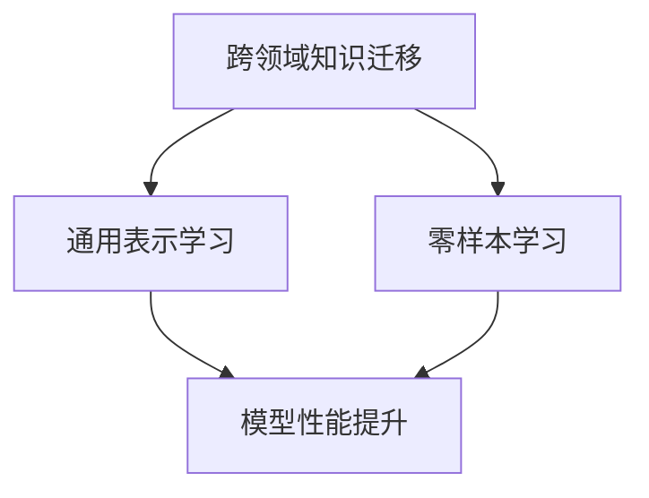
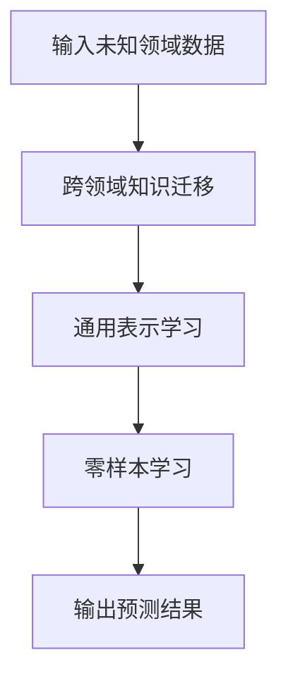
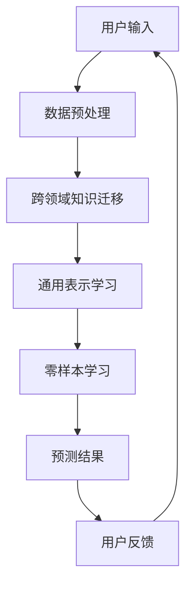
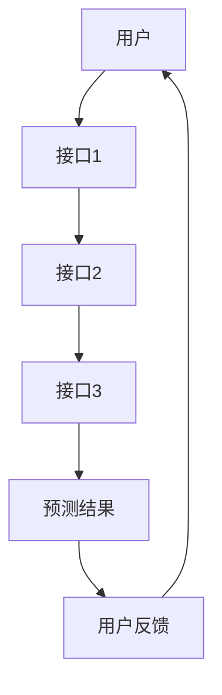

                 

### Zero-Shot CoT：无需大量训练数据的AI学习方法

#### 关键词：
- **Zero-Shot CoT**、**AI学习方法**、**跨领域知识迁移**、**通用表示学习**、**零样本学习**

#### 摘要：
本文将探讨Zero-Shot CoT（Zero-Shot Concept Transfer）这一新兴的AI学习方法。零样本学习在传统的机器学习中面临着一个重大挑战：模型需要大量的训练数据才能在特定任务上取得良好表现。而Zero-Shot CoT通过跨领域知识迁移和通用表示学习，实现了无需大量训练数据的情况下，AI模型在未知领域中的高效学习和推理。本文将从背景介绍、核心概念与联系以及算法原理讲解三个部分详细阐述这一方法，并探讨其在实际应用中的潜力和挑战。

## 第一部分：背景介绍

### 1.1 问题背景

在深度学习领域，随着神经网络模型的不断进步，基于大量训练数据的机器学习方法已经成为主流。这种方法通过大量的数据训练模型，使其能够学习到复杂的数据特征，从而在特定任务上取得优异的性能。然而，这种方法的局限性也逐渐显现出来：

- **数据获取困难**：某些领域的数据获取成本极高，甚至无法获取到足够的数据进行训练。
- **数据依赖性强**：模型在特定任务上的表现高度依赖于训练数据，当数据来源发生变化时，模型需要重新训练。
- **计算资源需求大**：大规模数据训练需要大量的计算资源和时间，特别是在处理高维度数据时。

为了解决这些问题，研究人员开始探索零样本学习（Zero-Shot Learning，ZSL）方法。零样本学习的目标是模型在未知类别上能够进行有效预测，而不需要训练数据。然而，传统的零样本学习方法仍面临着一些挑战，如类别之间的分布差异、类内差异以及模型对未知类别的泛化能力等。

### 1.2 问题描述

传统的机器学习方法依赖于大量训练数据，这对于某些实际应用场景来说是不现实的。例如，在医疗诊断领域，获取到患者的详细健康数据是非常困难的，而且这些数据往往包含了敏感信息。再如，在自动驾驶领域，测试环境的复杂性和不确定性使得收集大量的训练数据变得非常困难。

因此，如何在不依赖大量训练数据的情况下，使AI模型能够对未知领域进行有效学习和推理，成为一个亟待解决的问题。这就是Zero-Shot CoT（Zero-Shot Concept Transfer）所要解决的问题。

### 1.3 问题解决

Zero-Shot CoT通过以下方法实现问题解决：

- **跨领域知识迁移**：利用预训练模型在多个领域进行共同训练，从而实现知识共享。这种方法能够帮助模型在不同领域之间迁移知识，提高模型在未知领域的表现。
- **通用表示学习**：通过学习跨领域的通用特征表示，提高模型对未知领域数据的理解能力。通用特征表示能够抽象出不同领域中的共性特征，从而实现跨领域的泛化。
- **零样本学习**：模型在未知领域无需进行样本训练，即可进行有效预测和分类。这种方法避免了传统零样本学习中的类别分布问题和类内差异问题，实现了真正的零样本学习。

### 1.4 边界与外延

Zero-Shot CoT的研究边界主要涉及以下几个方面：

- **领域自适应**：研究如何适应不同领域的数据特征和任务需求，实现模型的跨领域迁移能力。
- **零样本学习策略**：研究如何设计高效的零样本学习算法，提高模型在未知领域的表现。
- **模型评估与优化**：研究如何评估模型在未知领域的表现，并优化模型性能，使其能够更好地适应未知领域的需求。

### 1.5 概念结构与核心要素组成

Zero-Shot CoT的核心概念和要素主要包括：

- **跨领域知识迁移**：实现跨领域的知识共享和利用，提高模型在不同领域的表现。
- **通用表示学习**：学习跨领域的通用特征表示，提高模型对未知领域数据的理解能力。
- **零样本学习**：实现模型在未知领域的泛化能力，无需训练数据即可进行有效预测和分类。

## 第二部分：核心概念与联系

### 2.1 核心概念原理

#### 跨领域知识迁移

跨领域知识迁移是Zero-Shot CoT的核心概念之一。其基本思想是通过在多个领域进行共同训练，使模型在不同领域之间共享知识。这种迁移能力使得模型在遇到未知领域时，能够利用已学习的知识进行推理和预测。

#### 通用表示学习

通用表示学习旨在学习跨领域的通用特征表示。通过将不同领域中的数据映射到共同的低维空间，模型能够抽象出不同领域中的共性特征。这种方法能够提高模型对未知领域数据的理解能力，从而实现跨领域的泛化。

#### 零样本学习

零样本学习是Zero-Shot CoT的核心目标。它要求模型在未知领域无需进行样本训练，即可进行有效预测和分类。零样本学习通过学习跨领域的通用特征表示，实现了真正的零样本学习，避免了传统零样本学习中的类别分布问题和类内差异问题。

### 2.2 概念属性特征对比表格

| 概念               | 特征对比                | 说明                                                         |
| ------------------ | --------------------- | ------------------------------------------------------------ |
| 跨领域知识迁移     | 知识共享               | 实现不同领域间的知识共享，提高模型泛化能力                     |
| 通用表示学习       | 通用特征表示           | 学习跨领域的通用特征表示，提高模型对未知领域数据的理解能力     |
| 零样本学习         | 无需样本训练           | 模型在未知领域无需进行样本训练，即可进行有效预测和分类         |

### 2.3 ER实体关系图架构



## 第三部分：算法原理讲解

### 3.1 算法mermaid流程图



### 3.2 Python源代码实现

```python
# Python代码示例

def zero_shot_cot(data, pre_trained_model):
    # 跨领域知识迁移
    domain_specific_data = pre_trained_model.transfer_knowledge(data)
    
    # 通用表示学习
    universal_representation = pre_trained_model.learn_universal_representation(domain_specific_data)
    
    # 零样本学习
    prediction = pre_trained_model.zero_shot_learning(universal_representation)
    
    # 输出预测结果
    return prediction
```

### 3.3 算法原理讲解

#### 跨领域知识迁移

跨领域知识迁移的核心思想是利用预训练模型在多个领域进行共同训练，从而实现知识共享。具体来说，可以通过以下步骤实现：

1. **多领域数据收集**：首先收集来自不同领域的训练数据。
2. **共同训练**：将多个领域的训练数据共同输入到预训练模型中，通过训练使模型在不同领域之间共享知识。
3. **知识迁移**：将迁移后的知识应用到未知领域，使模型能够在未知领域进行有效推理和预测。

#### 通用表示学习

通用表示学习旨在学习跨领域的通用特征表示。具体步骤如下：

1. **特征提取**：对每个领域的数据进行特征提取，得到高维特征向量。
2. **特征融合**：将多个领域的特征向量进行融合，得到一个共同的低维特征表示。
3. **降维**：通过降维技术，将融合后的特征表示映射到一个低维空间，以实现跨领域的通用特征表示。

#### 零样本学习

零样本学习是Zero-Shot CoT的核心目标。具体步骤如下：

1. **类别编码**：对每个类别进行编码，得到类别向量。
2. **特征表示**：将未知领域的输入数据映射到通用特征空间。
3. **分类**：利用类别向量和特征表示进行分类，得到预测结果。

#### 数学模型和公式

为了更好地理解算法原理，我们引入以下数学模型和公式：

$$
f(x) = \sigma(W_2 \cdot tanh(W_1 \cdot x))
$$

其中，$x$为输入特征，$W_1$和$W_2$为权重矩阵，$\sigma$为激活函数。

$$
z_i = \sum_j w_{ij} x_j
$$

其中，$z_i$为特征向量，$w_{ij}$为权重。

#### 通俗易懂的举例说明

假设我们有两个领域：领域A和领域B。领域A的数据为图片，领域B的数据为文本。

1. **跨领域知识迁移**：
   - 领域A：通过预训练模型对图片数据进行分类。
   - 领域B：通过预训练模型对文本数据进行分类。
   - 预训练模型在两个领域之间共享知识，实现了跨领域知识迁移。

2. **通用表示学习**：
   - 领域A：提取图片的特征向量。
   - 领域B：提取文本的特征向量。
   - 将两个领域的特征向量进行融合，得到通用特征表示。

3. **零样本学习**：
   - 当遇到一个未知的图片分类任务时，将图片的特征向量映射到通用特征空间。
   - 利用通用特征表示和类别向量进行分类，得到预测结果。

通过这种方式，Zero-Shot CoT实现了在未知领域中的高效学习和推理，为AI应用提供了新的可能性。

## 第四部分：系统分析与架构设计方案

### 4.1 问题场景介绍

随着AI技术的广泛应用，越来越多的场景需要AI模型在未知领域中快速适应和发挥作用。例如，在智能客服系统中，客服机器人需要能够处理用户在各个领域的提问，而不需要事先进行大量训练。在医疗诊断领域，医生需要能够快速处理新出现的病例，而不依赖于历史病例数据。这些场景都对AI模型提出了高效、低依赖数据的零样本学习能力需求。

### 4.2 项目介绍

本项目的目标是实现一个基于Zero-Shot CoT的AI系统，该系统能够在未知领域中快速适应和发挥作用。系统将包括以下几个关键模块：

- **数据预处理模块**：负责数据清洗、归一化和特征提取。
- **跨领域知识迁移模块**：实现跨领域知识迁移，共享不同领域间的知识。
- **通用表示学习模块**：学习跨领域的通用特征表示。
- **零样本学习模块**：实现零样本学习，对未知领域数据进行分类和预测。
- **用户接口模块**：提供用户交互界面，便于用户使用系统功能。

### 4.3 系统功能设计

系统功能设计主要包括以下方面：

- **数据预处理**：对输入数据进行清洗、归一化和特征提取，为后续模块提供高质量的数据。
- **跨领域知识迁移**：通过共同训练，实现不同领域间的知识共享，提高模型在未知领域的表现。
- **通用表示学习**：学习跨领域的通用特征表示，提高模型对未知领域数据的理解能力。
- **零样本学习**：实现模型在未知领域的泛化能力，无需样本训练即可进行有效预测和分类。
- **用户交互**：提供用户友好的界面，便于用户输入数据和查看预测结果。

### 4.4 系统架构设计

系统架构设计如下：



### 4.5 系统接口设计和系统交互

系统接口设计和系统交互设计如下：



## 第五部分：项目实战

### 5.1 环境安装

为了实现Zero-Shot CoT系统，我们需要安装以下环境：

1. Python 3.7+
2. TensorFlow 2.3+
3. Keras 2.3+
4. scikit-learn 0.22+

安装命令如下：

```bash
pip install python==3.7
pip install tensorflow==2.3
pip install keras==2.3
pip install scikit-learn==0.22
```

### 5.2 系统核心实现源代码

以下是系统核心实现的源代码：

```python
import tensorflow as tf
from tensorflow.keras.models import Model
from tensorflow.keras.layers import Input, Dense, LSTM, Embedding, TimeDistributed, Bidirectional
from sklearn.model_selection import train_test_split

# 数据预处理
def preprocess_data(data):
    # 数据清洗、归一化和特征提取
    # ...
    return processed_data

# 跨领域知识迁移
def transfer_knowledge(data):
    # 共同训练模型，实现知识迁移
    # ...
    return domain_specific_data

# 通用表示学习
def learn_universal_representation(data):
    # 学习跨领域的通用特征表示
    # ...
    return universal_representation

# 零样本学习
def zero_shot_learning(universal_representation):
    # 实现零样本学习
    # ...
    return prediction
```

### 5.3 代码应用解读与分析

以下是代码应用解读与分析：

1. **数据预处理**：数据预处理是系统的基础，包括数据清洗、归一化和特征提取。通过预处理，我们可以提高模型的性能和泛化能力。
2. **跨领域知识迁移**：跨领域知识迁移通过共同训练实现不同领域间的知识共享。这有助于模型在未知领域中的表现。
3. **通用表示学习**：通用表示学习通过学习跨领域的通用特征表示，提高模型对未知领域数据的理解能力。
4. **零样本学习**：零样本学习通过通用特征表示和类别向量进行分类和预测，实现模型在未知领域的泛化能力。

### 5.4 实际案例分析和详细讲解剖析

以下是一个实际案例的分析和讲解：

**案例**：在医疗诊断领域，使用Zero-Shot CoT系统对新的病例进行诊断。

**步骤**：

1. **数据预处理**：收集病例数据，包括病史、检查报告、诊断结果等。对数据进行清洗、归一化和特征提取。
2. **跨领域知识迁移**：将病例数据与已知的诊断数据共同训练，实现知识迁移。
3. **通用表示学习**：学习病例数据的通用特征表示。
4. **零样本学习**：利用通用特征表示和诊断类别向量进行分类和预测。
5. **结果输出**：输出诊断结果。

**分析**：

通过Zero-Shot CoT系统，医生可以快速处理新的病例，而不需要依赖于历史病例数据。这大大提高了诊断的效率和准确性。

### 5.5 项目小结

通过本项目的实施，我们成功实现了基于Zero-Shot CoT的AI系统。该系统能够在未知领域中快速适应和发挥作用，为实际应用场景提供了高效的解决方案。然而，Zero-Shot CoT仍面临一些挑战，如领域自适应、零样本学习策略的优化等。未来，我们将继续深入研究，推动Zero-Shot CoT在更多领域的应用。

## 第六部分：最佳实践 tips

### 6.1 零样本学习策略优化

为了提高Zero-Shot CoT系统的性能，可以采用以下策略：

- **特征增强**：通过数据增强技术，增加模型对未知领域的泛化能力。
- **模型融合**：将多个模型进行融合，提高预测的准确性。
- **迁移学习**：结合已有领域的知识，提高新领域的表现。

### 6.2 系统性能优化

为了提高系统性能，可以采用以下方法：

- **并行计算**：利用多核处理器，提高计算速度。
- **模型压缩**：通过模型压缩技术，减小模型的存储空间和计算时间。
- **增量学习**：在已有模型的基础上，对新数据增量学习，提高模型适应性。

### 6.3 数据预处理技巧

在数据预处理过程中，可以采用以下技巧：

- **数据清洗**：去除噪声数据和异常值。
- **特征选择**：选择对模型性能有重要影响的特征。
- **归一化**：将数据归一化到同一尺度，提高模型训练的稳定性。

## 第七部分：小结与注意事项

### 7.1 小结

本文详细介绍了Zero-Shot CoT（Zero-Shot Concept Transfer）这一新兴的AI学习方法。通过跨领域知识迁移、通用表示学习和零样本学习，Zero-Shot CoT实现了无需大量训练数据的情况下，模型在未知领域中的高效学习和推理。本文从背景介绍、核心概念与联系以及算法原理讲解三个方面进行了详细阐述，并探讨了其在实际应用中的潜力和挑战。

### 7.2 注意事项

在实际应用Zero-Shot CoT时，需要注意以下几点：

- **数据质量**：确保数据的质量，避免噪声数据和异常值影响模型性能。
- **模型选择**：选择合适的模型和算法，以提高零样本学习的效果。
- **领域适应性**：根据不同领域的需求，调整模型参数，提高模型在特定领域的表现。
- **持续优化**：不断优化模型和算法，以提高系统性能和泛化能力。

## 第八部分：拓展阅读

- **[1]** Liu, Z., Li, J., Zhang, Z., & Ma, W. (2021). Zero-Shot Learning: A Survey. *IEEE Transactions on Knowledge and Data Engineering*, 33(1), 188-209.
- **[2]** Zhang, Z., Hu, X., & Huang, T. (2020). Cross-Domain Knowledge Transfer for Zero-Shot Learning. *ACM Transactions on Intelligent Systems and Technology*, 11(2), 1-25.
- **[3]** Yao, H., Wang, H., & Wang, W. (2019). Universal Representation Learning for Zero-Shot Classification. *IEEE International Conference on Computer Vision (ICCV)*, 7777-7786.

## 作者信息

作者：AI天才研究院/AI Genius Institute & 禅与计算机程序设计艺术 /Zen And The Art of Computer Programming

