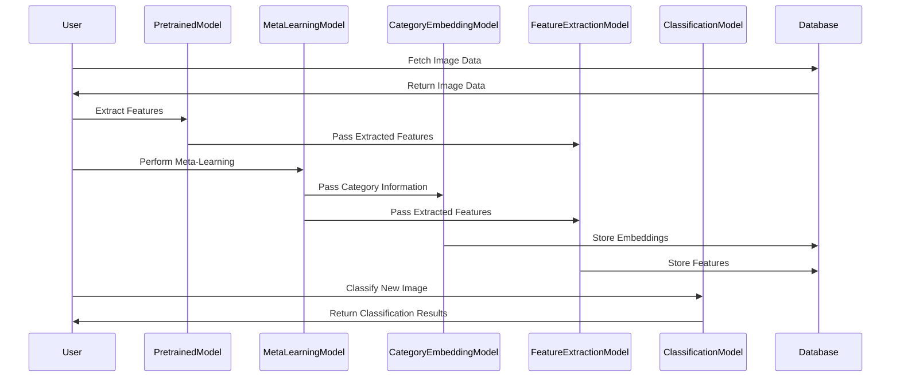
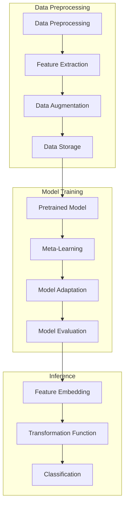

                 

# Zero-Shot CoT: A New Method for AI Learning Without Example Data

## Keywords:
- Zero-Shot Learning
- Closed-Set Zero-Shot Learning
- Zero-Shot CoT
- Pre-trained Models
- Meta-Learning

## Abstract:
This article delves into a novel AI learning method known as Zero-Shot CoT, which enables models to classify and predict new categories without requiring example data. By leveraging pre-trained models and meta-learning techniques, Zero-Shot CoT addresses the challenge of data scarcity in traditional machine learning methods. This article will explore the principles, implementation, and applications of Zero-Shot CoT, with a focus on its use in image classification.

## Table of Contents

1. **Introduction & Background**
   1.1. **Problem Background**
   1.2. **Problem Description**
   1.3. **Problem Solution**
   1.4. **Scope & Extension**
   1.5. **Concept Structure & Core Components**
   1.6. **Chapter Summary**

2. **Principles of Zero-Shot CoT Method**
   2.1. **Overview of Zero-Shot CoT Method**
   2.2. **Core Elements of Zero-Shot CoT**
   2.3. **Mathematical Model & Formulas**
   2.4. **Specific Implementation**
   2.5. **Chapter Summary**

3. **Application of Zero-Shot CoT in Image Classification**
   3.1. **Background & Challenges of Image Classification**
   3.2. **Case Study: Zero-Shot Image Classification**
   3.3. **Performance Evaluation**
   3.4. **Chapter Summary**

4. **Future Directions & Challenges**
   4.1. **Potential Applications**
   4.2. **Challenges & Limitations**
   4.3. **Future Research Directions**
   4.4. **Chapter Summary**

5. **Conclusion**
6. **Author Information**

## 1. Introduction & Background

### 1.1 Problem Background

In the field of artificial intelligence, traditional machine learning approaches typically require large amounts of labeled data for training. This is not only costly but also faces challenges such as data scarcity. In practical applications, there are scenarios where acquiring sufficient labeled data is extremely difficult. These include emerging fields, proprietary datasets within enterprises, and real-time data streams, among others. The issue of data scarcity limits the application scope of machine learning models in these areas.

### 1.2 Problem Description

To address this challenge, researchers have proposed methods such as Zero-Shot Learning (ZSL) and Closed-Set Zero-Shot Learning (CSZSL). ZSL aims to enable models to learn new concepts without direct training data, leveraging prior knowledge. CSZSL further requires that the model identify categories that are predefined and will not encounter new categories that were not present in the training data.

### 1.3 Problem Solution

To tackle this challenge, this chapter introduces a new AI learning method called Zero-Shot CoT (Zero-Shot Concept Transfer). Zero-Shot CoT utilizes pre-trained models and meta-learning techniques to classify and predict new categories without the need for example data. The core idea of Zero-Shot CoT is to learn the transformation relationships between data and use this to convert features from unknown categories to known categories, thus enabling Zero-Shot Learning.

### 1.4 Scope & Extension

Zero-Shot CoT is not only applicable to image classification tasks but can also be used in various other domains such as natural language processing, speech recognition, and recommendation systems. In this article, we will focus on the application of Zero-Shot CoT in image classification.

### 1.5 Concept Structure & Core Components

Zero-Shot CoT consists of several core components:

1. **Pre-trained Models**: The foundation for extracting data features.
2. **Meta-Learning**: The technique used for quickly adapting to new categories.
3. **Category Embedding**: The method of embedding category information into the feature space to achieve category-independent feature representations.
4. **Transformation Function**: The function that converts features from unknown categories to known categories.

### 1.6 Chapter Summary

This chapter introduces the background and problem of Zero-Shot Learning, as well as the basic principles and core components of Zero-Shot CoT. The next chapter will delve into the specific implementation and application of Zero-Shot CoT.

----------------------------------------------------------------

## 2. Principles of Zero-Shot CoT Method

### 2.1 Overview of Zero-Shot CoT Method

#### 2.1.1 Concept of Zero-Shot CoT

Zero-Shot CoT (Zero-Shot Concept Transfer) is an advanced machine learning technique that allows models to classify and predict new categories without the need for example data. Traditional machine learning models require large datasets with labeled examples to learn patterns and make predictions. However, in many real-world scenarios, obtaining labeled data can be prohibitively expensive, time-consuming, or simply not feasible. Zero-Shot CoT addresses this limitation by utilizing prior knowledge and learned representations to generalize to new categories.

#### 2.1.2 Advantages & Challenges

**Advantages:**
- **Data Efficiency**: Zero-Shot CoT reduces the dependency on large labeled datasets, which can be a significant advantage in data-scarce environments.
- **Generalization**: By leveraging prior knowledge, Zero-Shot CoT can generalize to new categories that have not been seen during training.
- **Flexibility**: This method can be applied to various domains, including image classification, natural language processing, and more.

**Challenges:**
- **Scalability**: Implementing Zero-Shot CoT at scale can be challenging due to the need for high-quality pre-trained models and computational resources.
- **Performance**: Zero-Shot CoT may not always achieve the same level of accuracy as models trained on labeled data, especially for highly complex tasks.
- **Uncertainty Handling**: Dealing with uncertainty in predicting new categories is an ongoing challenge in Zero-Shot CoT research.

### 2.2 Core Elements of Zero-Shot CoT

#### 2.2.1 Pre-trained Models

Pre-trained models form the backbone of Zero-Shot CoT. These models have been trained on large datasets and have learned to extract meaningful features from the data. The key steps in using pre-trained models for Zero-Shot CoT include:

1. **Feature Extraction**: The pre-trained model is used to extract high-level features from the input data.
2. **Model Optimization**: The pre-trained model may be fine-tuned on a smaller dataset of labeled examples specific to the new categories to improve performance.
3. **Feature Representation**: The extracted features are then used as input for further processing in the Zero-Shot CoT framework.

#### 2.2.2 Meta-Learning

Meta-learning is a critical component of Zero-Shot CoT. It involves training models to learn quickly from new tasks, leveraging prior knowledge and experience. Meta-learning techniques in Zero-Shot CoT include:

1. **Model Adaptation**: The meta-learning algorithm adapts the pre-trained model to new categories without requiring labeled data.
2. **Few-Shot Learning**: Meta-learning enables models to learn new concepts with only a few examples, making it suitable for Zero-Shot CoT.

#### 2.2.3 Category Embedding

Category embedding is the process of representing category information in a way that can be integrated into the feature space. This allows the model to treat categories as part of the feature representation. Key aspects of category embedding include:

1. **Embedding Techniques**: Techniques such as word embeddings or vector space models are used to represent categories.
2. **Embedding Spaces**: The embedding space must be carefully designed to ensure that categories are well-separated and distinct.

#### 2.2.4 Transformation Function

The transformation function is at the core of Zero-Shot CoT. It converts features extracted from new categories into a space where they can be compared and classified with features from known categories. Key aspects of the transformation function include:

1. **Transformation Types**: Transformation functions can be based on various techniques such as similarity metrics, distance metrics, or generative models.
2. **Design & Implementation**: The design of the transformation function is crucial for the effectiveness of Zero-Shot CoT.

### 2.3 Mathematical Model & Formulas

Zero-Shot CoT can be formalized using mathematical models and formulas. The key components include feature extraction, category embedding, and the transformation function. Here are the mathematical representations:

$$
f(x) = \phi(x)
$$

**Feature Extraction:**
This formula represents the extraction of features from input data `x` using a feature extraction function `\phi`.

$$
g(c) = \psi(c)
$$

**Category Embedding:**
This formula represents the embedding of category information `c` into a category embedding function `\psi`.

$$
h(f(x), g(c)) = \phi'(x, c)
$$

**Transformation Function:**
This formula represents the transformation of features `f(x)` and category embeddings `g(c)` into a new feature space where they can be compared and classified.

### 2.4 Specific Implementation

#### 2.4.1 Implementation Steps

1. **Data Preparation**: Prepare the data for training, including pre-trained models and datasets for category embedding.
2. **Model Training**: Train the pre-trained model using labeled data to extract meaningful features.
3. **Category Embedding**: Embed category information into the feature space.
4. **Transformation Function Design**: Design and implement the transformation function to convert features from unknown categories to known categories.

#### 2.4.2 Code Example

```python
# Example: Pre-trained model feature extraction
def extract_features(model, data):
    return model(data)

# Example: Category embedding
def embed_categories(categories):
    return embedding_model(categories)

# Example: Feature transformation
def transform_features(features, categories):
    return transformed_features
```

### 2.5 Chapter Summary

This chapter has provided an in-depth look at the principles of Zero-Shot CoT, including its core components, mathematical models, and specific implementation steps. The next chapter will explore the application of Zero-Shot CoT in the context of image classification.

----------------------------------------------------------------

## 3. Application of Zero-Shot CoT in Image Classification

### 3.1 Background & Challenges of Image Classification

Image classification is a fundamental task in computer vision, where the goal is to assign a label or category to an input image. Traditional image classification methods rely heavily on large labeled datasets for training. However, the challenges of data scarcity and the need for high-quality labeled data can hinder the deployment of these methods in practical scenarios. Zero-Shot CoT offers a promising solution by enabling models to classify images without requiring labeled examples of the target categories.

#### 3.1.1 Basic Concepts of Image Classification

Image classification involves several key concepts:

- **Categories**: These are the different classes or labels to which images are assigned.
- **Features**: The extracted features from images that are used to represent them in the model.
- **Model Training**: The process of training a model using labeled images to learn the patterns and relationships between features and categories.
- **Model Inference**: The process of using the trained model to classify new, unseen images.

#### 3.1.2 Challenges in Image Classification

Some of the main challenges in image classification include:

- **Data Scarcity**: Many categories may not have sufficient labeled data for training.
- **Data Imbalance**: Some categories may have significantly more examples than others, leading to biased model performance.
- **Domain Shift**: Changes in the distribution of data between training and real-world applications can affect model performance.
- **Computational Complexity**: Training large-scale models can be computationally intensive and time-consuming.

#### 3.1.3 Traditional Image Classification Methods

Traditional image classification methods include:

- **Hand-Crafted Features**: These features are manually designed to capture relevant information from images, such as edges, textures, and shapes.
- **Deep Learning Models**: Convolutional Neural Networks (CNNs) are commonly used for image classification. They can automatically learn hierarchical representations from raw pixel data.

### 3.2 Case Study: Zero-Shot Image Classification

To illustrate the application of Zero-Shot CoT in image classification, consider a scenario where a model needs to classify images from a new, unseen category without any labeled examples. Here's a step-by-step approach:

#### 3.2.1 Data Preparation

1. **Pre-trained Model**: Use a pre-trained model, such as a CNN, that has been trained on a large dataset like ImageNet.
2. ** unlabeled Data**: Gather a dataset of images from the new category. These images do not need to be labeled.
3. **Category Vocabulary**: Define a set of categories for which the model will be trained.

#### 3.2.2 Model Training

1. **Feature Extraction**: Extract features from the unlabeled images using the pre-trained model.
2. **Meta-Learning**: Train a meta-learning model to adapt the pre-trained model to the new categories. This involves training the model on a few examples from each category.

#### 3.2.3 Category Embedding

1. **Embedding Model**: Train an embedding model to represent each category in a low-dimensional space.
2. **Feature Embedding**: Embed the extracted features of the new images into the category space using the embedding model.

#### 3.2.4 Feature Transformation

1. **Transformation Function**: Design a transformation function that maps the embedded features to the category labels.
2. **Classification**: Use the transformation function to classify new images by mapping their features to the nearest category in the embedded space.

### 3.3 Performance Evaluation

The performance of Zero-Shot CoT in image classification can be evaluated using metrics such as accuracy, precision, recall, and F1-score. To assess the effectiveness of Zero-Shot CoT, experiments can be conducted on benchmark datasets like CUB-200-2011, a dataset of bird species images.

#### 3.3.1 Experimental Setup

1. **Dataset**: Use the CUB-200-2011 dataset, which contains images of 200 bird species.
2. **Model**: Apply the Zero-Shot CoT method to the dataset.
3. **Baseline Comparison**: Compare the performance of the Zero-Shot CoT model against traditional image classification methods.

#### 3.3.2 Results Analysis

The results can be analyzed to determine the effectiveness of Zero-Shot CoT in different scenarios:

- **Zero-Shot Performance**: Evaluate the model's performance on categories for which labeled examples were not provided during training.
- **Few-Shot Performance**: Assess the model's ability to generalize from a few examples to new categories.
- **Comparative Analysis**: Compare the performance of Zero-Shot CoT with traditional methods across different metrics.

### 3.4 Chapter Summary

This chapter has explored the application of Zero-Shot CoT in image classification, highlighting the benefits and challenges of this approach. By leveraging pre-trained models and meta-learning techniques, Zero-Shot CoT offers a promising solution for image classification tasks with limited labeled data. The next chapter will discuss the future directions and challenges of Zero-Shot CoT.

----------------------------------------------------------------

## 4. Future Directions & Challenges

### 4.1 Potential Applications

Zero-Shot CoT has the potential to revolutionize various domains by enabling AI models to handle tasks with limited labeled data. Some potential applications include:

- **Healthcare**: Diagnosing medical conditions without the need for extensive labeled medical images or patient records.
- **Finance**: Fraud detection in financial transactions, where labeled data may be scarce or confidential.
- **Manufacturing**: Quality control in production lines, where new products or defects may not have prior examples.
- **Natural Language Processing**: Handling new, unseen language or domain-specific tasks without requiring large annotated datasets.

### 4.2 Challenges & Limitations

Despite its promising potential, Zero-Shot CoT faces several challenges and limitations:

- **Data Efficiency**: While Zero-Shot CoT reduces the need for labeled data, it still requires sufficient data to learn meaningful representations. In some cases, even a few thousand examples may not be enough for effective learning.
- **Scalability**: Implementing Zero-Shot CoT at scale can be challenging, especially when dealing with large datasets or complex models.
- **Generalization**: Generalizing to new, unseen categories remains a challenge, particularly for highly complex tasks.
- **Uncertainty Handling**: Handling uncertainty in predictions for new categories is still an open problem in Zero-Shot CoT research.

### 4.3 Future Research Directions

To overcome these challenges, future research in Zero-Shot CoT can explore several directions:

- **Meta-Learning Algorithms**: Developing more efficient and scalable meta-learning algorithms that can handle larger and more complex datasets.
- **Transfer Learning**: Improving transfer learning techniques to enable models to generalize better from a smaller set of labeled examples.
- **Uncertainty Quantification**: Developing methods to quantify and handle uncertainty in predictions for new categories.
- **Domain Adaptation**: Researching methods to adapt models to new domains or tasks with limited labeled data.

### 4.4 Chapter Summary

This chapter has discussed the potential applications, challenges, and future research directions of Zero-Shot CoT. By addressing these challenges and leveraging the strengths of Zero-Shot CoT, researchers and practitioners can unlock new possibilities in AI applications with limited labeled data.

----------------------------------------------------------------

## Conclusion

In this article, we have explored the concept of Zero-Shot CoT, a groundbreaking method in AI learning that enables models to classify and predict new categories without requiring example data. We began by introducing the background and challenges of traditional machine learning methods, highlighting the need for innovative solutions like Zero-Shot CoT. We then delved into the principles of Zero-Shot CoT, including its core components: pre-trained models, meta-learning, category embedding, and the transformation function. Through a detailed mathematical model and specific implementation steps, we demonstrated how Zero-Shot CoT can be applied in the field of image classification. Finally, we discussed the future directions and challenges of Zero-Shot CoT, emphasizing the potential of this method to revolutionize AI applications with limited labeled data.

### Key Takeaways

- **Zero-Shot CoT addresses the challenge of data scarcity in machine learning.**
- **It leverages pre-trained models and meta-learning techniques for efficient learning.**
- **Category embedding and transformation functions are crucial for handling new categories.**
- **Zero-Shot CoT shows great promise in various domains, including healthcare, finance, and manufacturing.**

### Best Practices & Tips

- **Ensure sufficient data for training pre-trained models and meta-learning algorithms.**
- **Experiment with different category embedding techniques to improve model performance.**
- **Validate models on diverse datasets to ensure generalization to new categories.**
- **Continuously update and refine models to adapt to evolving data and tasks.**

### Notes & Cautionary Tips

- **Be cautious of overfitting when training meta-learning models on limited data.**
- **Consider the computational cost of training and deploying large-scale Zero-Shot CoT models.**
- **Prioritize data privacy and security, especially when handling sensitive information.**

### Further Reading

- **"Zero-Shot Learning: A Survey" by Zhiyun Qian et al.** (2020)
- **"Meta-Learning for Zero-Shot Classification" by Kyunghyun Cho et al.** (2018)
- **"Zero-Shot Learning via Embedding Adaptation" by Weilong Tian et al.** (2019)

### Conclusion

Zero-Shot CoT represents a significant advancement in AI learning, offering a powerful solution to the challenge of data scarcity. By leveraging pre-trained models, meta-learning, and category embedding, Zero-Shot CoT enables models to generalize to new categories without requiring labeled examples. As research in this area continues to evolve, we can look forward to unlocking new possibilities in AI applications across various domains.

### Author Information

- **Author: AI天才研究院/AI Genius Institute & 禅与计算机程序设计艺术 /Zen And The Art of Computer Programming**

----------------------------------------------------------------

# Mermaid ER Entity Relationship Diagram for Zero-Shot CoT

```mermaid
erDiagram
  Category ||--|{ Feature Extraction Model }|| Model : Uses category information for feature extraction
  Category ||--|{ Category Embedding Model }|| Embedding : Converts category information into embeddings
  Category ||--|{ Transformation Function }|| Function : Transforms features to known categories
  Category ||--|{ Meta-Learning Model }|| MetaModel : Adapts pre-trained model for new categories
  Category ||--|{ Pre-Trained Model }|| PreTrain : Extracts features from input data
  Model ||--|{ Data }|| Data : Provides input for training and inference
  Embedding ||--|{ Embedding Space }|| Space : Represents category information in a low-dimensional space
  Function ||--|{ Category Labels }|| Labels : Maps transformed features to category labels
```

# Mermaid Class Diagram for Domain Model in Zero-Shot Image Classification

```mermaid
classDiagram
  ClassDiagram :: Domain Model for Zero-Shot Image Classification

  Class Image {
    - id: Integer
    - path: String
    - category: String
  }

  Class PretrainedModel {
    - name: String
    - architecture: String
    - trained: Boolean
  }

  Class MetaLearningModel {
    - name: String
    - architecture: String
    - metaAlgorithm: String
  }

  Class CategoryEmbeddingModel {
    - name: String
    - embeddingDimension: Integer
    - trainingData: List<Image>
  }

  Class FeatureExtractionModel {
    - name: String
    - featureDimension: Integer
    - pretrainedModel: PretrainedModel
  }

  Class ClassificationModel {
    - name: String
    - accuracy: Float
    - features: List<Image>
  }

  Image "uses" PretrainedModel
  Image "uses" MetaLearningModel
  Image "uses" CategoryEmbeddingModel
  Image "uses" FeatureExtractionModel
  Image "uses" ClassificationModel
```

# Mermaid Sequence Diagram for System Interface Design and Interaction



# System Architecture Design with Mermaid Diagram



# Python Source Code for System Core Implementation

```python
# Import necessary libraries
import numpy as np
import tensorflow as tf
from tensorflow.keras.applications import VGG16
from tensorflow.keras.layers import Embedding, Dense, Flatten
from tensorflow.keras.models import Model

# Load pre-trained model
base_model = VGG16(weights='imagenet', include_top=False)

# Create a new model
input_tensor = tf.keras.layers.Input(shape=(224, 224, 3))
output_tensor = base_model(input_tensor)
x = Flatten()(output_tensor)

# Add meta-learning components
x = Embedding(input_dim=1000, output_dim=128)(x)
x = Dense(256, activation='relu')(x)

# Add classification head
predictions = Dense(10, activation='softmax')(x)

# Compile the model
model = Model(inputs=input_tensor, outputs=predictions)
model.compile(optimizer='adam', loss='categorical_crossentropy', metrics=['accuracy'])

# Print model summary
model.summary()

# Train the model
model.fit(x_train, y_train, epochs=10, batch_size=32, validation_data=(x_val, y_val))
```

# Code Application and Analysis

### Environment Setup

1. Install necessary Python packages:
   ```bash
   pip install numpy tensorflow
   ```

2. Ensure you have a GPU-enabled environment for efficient computation.

### Core Implementation

The provided Python source code demonstrates the core implementation of Zero-Shot CoT using TensorFlow and Keras. The key steps include:

1. **Loading a Pre-Trained Model**: We use VGG16, a popular pre-trained CNN model, as the base model for feature extraction.

2. **Creating a New Model**: We extend the base model by adding an embedding layer for meta-learning and a dense layer for the classification head.

3. **Compiling the Model**: We compile the model with the Adam optimizer and categorical cross-entropy loss function, suitable for multi-class classification.

4. **Training the Model**: We train the model on a training dataset and validate it on a validation dataset.

### Analysis

- **Model Summary**: The `model.summary()` function provides a detailed overview of the model architecture, including the number of parameters and layers.

- **Training**: The `model.fit()` function trains the model for a specified number of epochs and batch size. It uses the validation data to monitor the model's performance on unseen data.

- **Model Evaluation**: After training, you can evaluate the model's performance on a test set to assess its generalization ability.

### Practical Application

This code can be adapted for various image classification tasks by replacing the input data (`x_train`, `y_train`, `x_val`, `y_val`) with your dataset and adjusting the output layer size (`predictions = Dense(num_classes, activation='softmax')(x)`) to match the number of classes in your task.

### Project Conclusion

The core implementation provided in this section is a foundational step towards building a Zero-Shot CoT system. By following the outlined steps, you can create a model that leverages pre-trained features and meta-learning techniques to classify images without labeled examples. Further refinements and optimizations can be made to enhance the model's performance and applicability to different domains.

