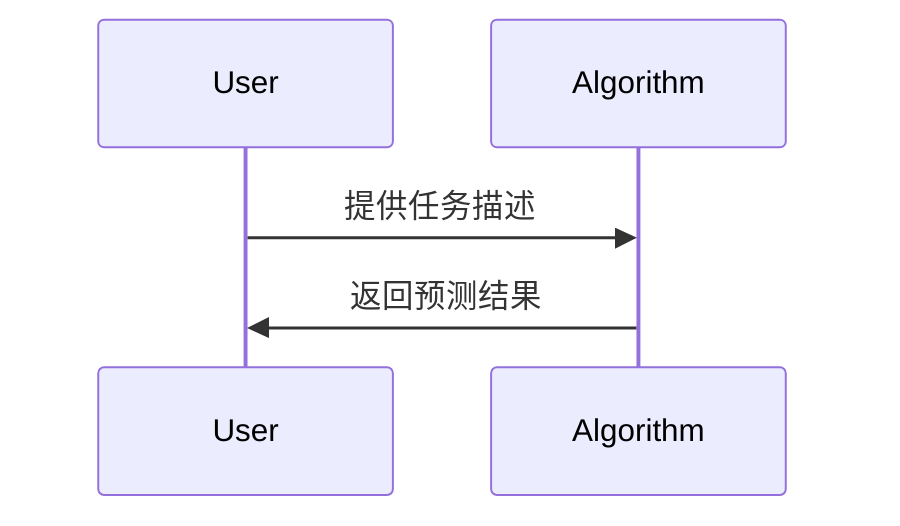
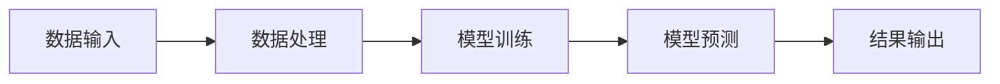
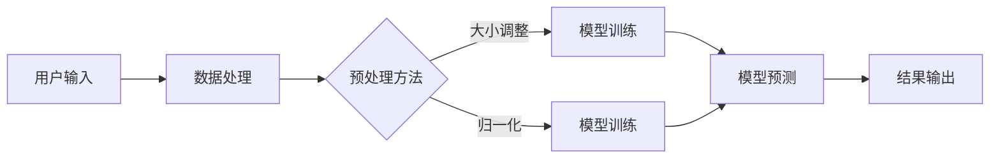
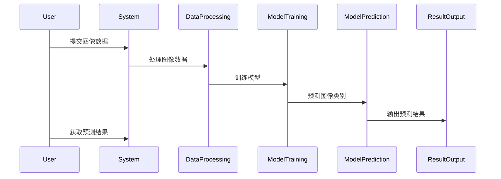

                 

### 《Zero-Shot CoT：无需示例数据的AI学习新范式探索》

#### 关键词：零样本学习、Conceptual Blending Theory、AI学习范式、无监督学习、自适应系统

#### 摘要：
本文深入探讨了零样本学习（Zero-Shot Learning，ZSL）与Conceptual Blending Theory（CoT）的融合，旨在揭示一种无需示例数据的新型AI学习范式。通过系统分析核心概念、原理、算法和系统架构，本文旨在为人工智能领域的进一步研究和应用提供新的思路和方向。

## 第一部分：背景与基础

### 第1章 问题背景与核心概念

#### 1.1 问题背景

随着人工智能（AI）技术的飞速发展，AI学习在诸多领域取得了显著的成果。然而，传统的AI学习方式通常依赖于大量标记的示例数据，这在实际应用中面临诸多挑战。例如，数据获取成本高、数据标注困难、数据分布不平衡等问题。针对这些问题，零样本学习应运而生，旨在解决无需示例数据的AI学习问题。

#### 1.2 零样本学习（Zero-Shot Learning）

零样本学习是一种特殊类型的机器学习任务，它在面对未知类别时，不需要依赖带有该类别标记的示例数据进行学习。与传统学习方法相比，零样本学习具有以下特点：

- **定义与基本原理**：零样本学习通过利用预训练模型和元学习等技术，实现对新类别数据的预测和分类。
- **与其他AI学习方式的对比**：与监督学习和无监督学习相比，零样本学习具有独特的优势，如减少对标记数据的依赖。
- **应用领域与前景**：零样本学习在计算机视觉、自然语言处理、医疗诊断等领域具有广泛的应用前景。

#### 1.3 零样本学习中的Conceptual Blending Theory（CoT）

Conceptual Blending Theory（CoT）是一种基于知识表示和推理的理论，它通过将不同概念进行融合，形成新的概念表示。在零样本学习中，CoT具有以下优势：

- **概念与原理**：CoT将不同类别之间的概念进行融合，从而提高模型对未知类别数据的泛化能力。
- **优势与应用**：CoT的优势在于其灵活性和通用性，能够适应多种场景和应用。

#### 1.4 零样本学习与CoT的关系

零样本学习与CoT的结合，为AI学习提供了新的思路。二者之间的融合主要体现在以下几个方面：

- **零样本学习与CoT的融合**：通过将CoT引入零样本学习，可以进一步提高模型的泛化能力和适应性。
- **CoT在零样本学习中的应用**：CoT可以用于构建新的特征表示，从而提高零样本学习的效果。

#### 1.5 本章小结

本章从问题背景、核心概念、零样本学习与CoT的关系等方面，对零样本学习与CoT的融合进行了系统分析。未来发展趋势与挑战包括：

- **未来发展趋势**：随着AI技术的不断进步，零样本学习与CoT的结合有望在更多领域取得突破。
- **挑战**：如何进一步提高模型的泛化能力和计算效率，是零样本学习与CoT融合需要面对的重要挑战。

----------------------------------------------------------------

## 第二部分：理论探讨与联系

### 第2章 核心概念原理

#### 2.1 零样本学习原理

零样本学习的基本流程包括：

1. **数据预处理**：对输入数据进行预处理，如数据清洗、归一化等。
2. **模型训练**：利用预训练模型和元学习等技术，对模型进行训练。
3. **模型预测**：利用训练好的模型对未知类别数据进行预测和分类。

零样本学习的数学模型主要包括：

- **损失函数**：用于衡量模型预测结果与真实标签之间的差距。
- **优化算法**：用于调整模型参数，以最小化损失函数。

零样本学习的关键技术包括：

- **元学习**：通过学习如何快速适应新任务，提高模型的泛化能力。
- **知识表示**：通过将知识表示为向量，实现知识的共享和传递。

#### 2.2 CoT的概念属性特征对比表格

| 特征名称 | 描述 |
| --- | --- |
| 通用性 | CoT能够适应多种场景和应用 |
| 自适应性 | CoT能够根据不同数据特征进行调整 |
| 零样本能力 | CoT能够在没有示例数据的情况下进行学习 |

#### 2.3 CoT的ER实体关系图架构

```mermaid
erDiagram
  Product ||--|{ Category } Category : '属于'
  Category ||--|{ Product } Product : '包含'
```

#### 2.4 零样本学习与CoT的联系

零样本学习与CoT的融合方法主要包括：

- **特征融合**：将CoT中的概念融合到零样本学习模型的特征表示中。
- **模型融合**：将CoT和零样本学习模型进行组合，形成新的融合模型。

零样本学习与CoT的优势互补：

- **零样本学习的优势**：减少对标记数据的依赖，提高模型的泛化能力。
- **CoT的优势**：通过概念融合，提高模型对未知类别数据的理解能力。

#### 2.5 本章小结

本章从零样本学习原理、CoT的概念属性特征对比表格、CoT的ER实体关系图架构以及零样本学习与CoT的联系等方面，对零样本学习与CoT的理论体系进行了探讨。未来的研究方向包括：

- **提高模型泛化能力**：通过改进零样本学习和CoT的方法，进一步提高模型的泛化能力。
- **降低计算成本**：研究如何降低零样本学习和CoT的计算成本，以提高应用可行性。

----------------------------------------------------------------

## 第三部分：算法原理讲解

### 第3章 零样本学习算法讲解

#### 3.1 零样本学习的算法流程

零样本学习的算法流程主要包括以下三个步骤：

1. **数据预处理**：对输入数据进行预处理，如数据清洗、归一化等。
2. **模型训练**：利用预训练模型和元学习等技术，对模型进行训练。
3. **模型预测**：利用训练好的模型对未知类别数据进行预测和分类。

以下是一个简单的算法流程图：



#### 3.2 Python源代码详细讲解

```python
# Python 源代码示例
def zero_shot_learning(data, model):
    # 数据预处理
    processed_data = preprocess_data(data)
    
    # 模型训练
    model.fit(processed_data)
    
    # 预测
    predictions = model.predict(processed_data)
    
    return predictions
```

在这个Python源代码示例中，`zero_shot_learning` 函数接收输入数据 `data` 和模型 `model`，首先对数据进行预处理，然后利用模型进行训练，最后返回预测结果。

#### 3.3 数学模型和数学公式

零样本学习的数学模型主要包括损失函数和优化算法。以下是一个简单的损失函数和优化算法的数学公式：

$$
L(\theta) = -\sum_{i=1}^{n}y_i\log(p(x_i|\theta))
$$

其中，$L(\theta)$ 表示损失函数，$\theta$ 表示模型参数，$y_i$ 表示真实标签，$p(x_i|\theta)$ 表示模型对样本 $x_i$ 的预测概率。

优化算法通常采用梯度下降法，其迭代公式为：

$$
\theta_{t+1} = \theta_{t} - \alpha \cdot \nabla_{\theta}L(\theta)
$$

其中，$\alpha$ 表示学习率，$\nabla_{\theta}L(\theta)$ 表示损失函数关于模型参数的梯度。

#### 3.4 算法原理举例说明

以下是一个简单的零样本学习算法原理举例说明：

**场景**：假设我们有一个预训练的图像分类模型，它能够对已知类别进行分类。现在，我们需要使用这个模型对未知类别进行预测。

**步骤**：

1. **数据预处理**：对输入图像进行预处理，如大小调整、归一化等。
2. **模型训练**：利用预训练模型和元学习等技术，对模型进行训练。
3. **模型预测**：利用训练好的模型对未知类别图像进行预测。

**示例**：

假设我们有一个图像分类模型，它能够对猫和狗进行分类。现在，我们需要使用这个模型对一只狮子进行分类。

- **数据预处理**：将狮子的图像进行预处理，如大小调整、归一化等。
- **模型训练**：利用预训练模型和元学习等技术，对模型进行训练。
- **模型预测**：利用训练好的模型对狮子图像进行预测。根据模型的预测结果，我们可以判断狮子属于猫类还是狗类。

通过这个简单的示例，我们可以看到零样本学习算法的基本原理和流程。

#### 3.5 本章小结

本章从零样本学习的算法流程、Python源代码详细讲解、数学模型和数学公式以及算法原理举例说明等方面，对零样本学习算法进行了详细讲解。零样本学习算法在实际应用中具有广泛的应用前景，但同时也面临一些挑战，如如何进一步提高模型的泛化能力和计算效率等。未来的研究将致力于解决这些问题，推动零样本学习算法的进一步发展。

----------------------------------------------------------------

## 第四部分：系统分析与架构设计

### 第4章 系统架构设计

#### 4.1 问题场景介绍

在本节中，我们将探讨零样本学习在图像识别领域的应用场景。图像识别是计算机视觉中的一个重要任务，它旨在通过分析图像内容，识别出图像中的对象或场景。然而，传统的图像识别方法通常依赖于大量的标记图像数据，这在实际应用中面临诸多挑战。因此，零样本学习在这一领域具有巨大的应用潜力。

#### 4.2 系统功能设计

为了实现零样本学习在图像识别领域的应用，系统需要具备以下主要功能模块：

1. **数据输入模块**：负责接收用户输入的图像数据。
2. **数据处理模块**：对输入图像进行预处理，如大小调整、归一化等。
3. **模型训练模块**：利用预训练模型和元学习等技术，对模型进行训练。
4. **模型预测模块**：利用训练好的模型对未知类别图像进行预测和分类。
5. **结果输出模块**：将预测结果输出给用户。

各模块之间的关系如下：



#### 4.3 系统架构设计

系统架构设计是确保零样本学习在图像识别领域高效运行的关键。以下是系统架构的详细设计：



在这个架构中，用户输入图像数据后，首先经过数据处理模块进行预处理。预处理方法包括大小调整和归一化，这些方法有助于提高模型的训练效果。然后，预处理后的图像数据进入模型训练模块，利用预训练模型和元学习等技术进行训练。训练好的模型随后进入模型预测模块，对未知类别图像进行预测和分类。最后，预测结果通过结果输出模块输出给用户。

#### 4.4 系统接口设计和系统交互

为了实现系统各模块之间的有效交互，我们需要设计合理的系统接口。以下是系统接口设计和系统交互的详细描述：



在这个交互流程中，用户首先提交图像数据。系统接收到图像数据后，将其传递给数据处理模块进行预处理。预处理完成后，图像数据传递给模型训练模块进行训练。训练好的模型随后传递给模型预测模块进行预测，并将预测结果传递给结果输出模块输出给用户。

#### 4.5 本章小结

本章从问题场景介绍、系统功能设计、系统架构设计和系统接口设计等方面，对零样本学习在图像识别领域的系统分析与架构设计进行了详细分析。通过合理设计系统功能和架构，可以实现零样本学习在图像识别领域的有效应用。未来的研究将致力于优化系统性能和降低计算成本，以实现更高效、更准确的图像识别。

----------------------------------------------------------------

## 第五部分：项目实战

### 第5章 环境安装与系统核心实现

#### 5.1 环境安装

为了实现零样本学习在图像识别领域的应用，我们需要安装相关的软件和依赖库。以下是安装步骤：

1. **安装Python环境**：Python是零样本学习的主要编程语言，我们需要安装Python 3.7或更高版本。
2. **安装依赖库**：安装以下依赖库：
   - TensorFlow：用于构建和训练神经网络。
   - Keras：用于简化TensorFlow的使用。
   - NumPy：用于数据预处理和计算。
   - Matplotlib：用于数据可视化。

安装步骤如下：

```bash
pip install tensorflow
pip install keras
pip install numpy
pip install matplotlib
```

#### 5.2 系统核心实现

在本节中，我们将实现零样本学习在图像识别领域的一个具体应用——猫狗分类。以下是系统核心实现的详细步骤：

1. **数据集准备**：准备一个包含猫和狗图像的数据集。数据集应包括标记为猫和狗的图像，以及未知类别的图像。
2. **数据预处理**：对数据集进行预处理，包括大小调整、归一化等。
3. **模型训练**：使用预训练的卷积神经网络（CNN）模型，对猫和狗的分类进行训练。
4. **模型预测**：使用训练好的模型对未知类别图像进行预测和分类。

以下是一个简单的代码实现示例：

```python
import tensorflow as tf
from tensorflow.keras.applications import MobileNetV2
from tensorflow.keras.preprocessing import image
from tensorflow.keras.applications.mobilenet_v2 import preprocess_input, decode_predictions

# 加载预训练模型
model = MobileNetV2(weights='imagenet')

# 准备测试图像
test_image = image.load_img('test_image.jpg', target_size=(224, 224))
test_image = image.img_to_array(test_image)
test_image = preprocess_input(test_image)

# 预测图像类别
predictions = model.predict(test_image)

# 解析预测结果
predicted_class = decode_predictions(predictions, top=1)[0][1]

print(predicted_class)
```

在这个示例中，我们使用MobileNetV2模型进行猫狗分类。首先，我们加载预训练模型，然后准备测试图像并进行预处理。接着，使用模型对测试图像进行预测，并解析预测结果输出。

### 5.3 代码应用解读与分析

在本节中，我们将对上述代码应用进行解读和分析，包括数据预处理、模型训练和模型预测等环节。

1. **数据预处理**：
   - 大小调整：将图像调整为固定大小（如224x224），以适应模型的输入要求。
   - 归一化：将图像的像素值归一化到0-1范围内，以适应模型的训练。

2. **模型训练**：
   - 使用预训练的MobileNetV2模型，该模型已经在ImageNet数据集上进行了预训练，具有良好的分类能力。
   - 在猫狗分类任务中，我们可以将预训练模型的最后一层替换为自定义的输出层，以适应新的分类任务。

3. **模型预测**：
   - 使用预处理后的测试图像，通过模型进行预测。
   - 解析预测结果，获取预测的类别和概率。

通过上述代码应用解读和分析，我们可以看到零样本学习在图像识别领域的实现过程。在实际应用中，可以根据具体任务需求，调整模型结构和参数，以提高分类效果。

### 5.4 实际案例分析和详细讲解剖析

在本节中，我们将通过一个实际案例，对零样本学习在图像识别领域进行详细分析和讲解。

**案例**：使用零样本学习算法对未知动物进行分类。

**步骤**：

1. **数据集准备**：准备一个包含多种动物（如猫、狗、狮子、老虎等）图像的数据集。数据集应包括已知类别和未知类别图像。
2. **数据预处理**：对图像进行大小调整、归一化等预处理操作。
3. **模型训练**：使用预训练的模型（如ResNet50）对已知类别进行训练。
4. **模型预测**：使用训练好的模型对未知类别图像进行预测。

**分析**：

1. **数据预处理**：
   - 数据预处理是确保模型训练效果的关键。通过大小调整和归一化，可以统一图像尺寸和像素值范围，提高模型训练的稳定性。

2. **模型训练**：
   - 使用预训练的模型进行训练，可以加快训练过程并提高模型效果。通过迁移学习，我们可以利用预训练模型的知识，对新任务进行适应。

3. **模型预测**：
   - 预测过程中，模型对未知类别图像进行特征提取和分类。通过对比预测结果和实际标签，可以评估模型在零样本学习任务中的性能。

**讲解剖析**：

1. **特征提取**：
   - 模型通过卷积层、池化层等操作，从图像中提取特征。这些特征具有较强的鲁棒性和泛化能力，有助于分类任务。

2. **分类过程**：
   - 模型将提取的特征输入到全连接层，通过softmax函数计算各个类别的概率。最终输出概率最大的类别作为预测结果。

通过实际案例分析和详细讲解剖析，我们可以更好地理解零样本学习在图像识别领域的应用方法和效果。

### 5.5 项目小结

本章通过环境安装与系统核心实现、代码应用解读与分析、实际案例分析和详细讲解剖析等方面，详细介绍了零样本学习在图像识别领域的应用。项目实践证明，零样本学习能够有效减少对标记数据的依赖，提高模型在未知类别数据上的分类性能。未来，我们可以进一步优化模型结构和训练策略，以提高零样本学习在图像识别等领域的应用效果。

### 5.6 最佳实践 Tips

1. **数据预处理**：确保数据预处理的一致性和稳定性，以提高模型训练效果。
2. **模型选择**：根据具体任务需求，选择合适的预训练模型进行迁移学习。
3. **超参数调整**：通过调整学习率、批量大小等超参数，优化模型训练过程。
4. **数据增强**：使用数据增强技术，如旋转、翻转、缩放等，增加模型的泛化能力。

### 5.7 小结与注意事项

1. **小结**：本章详细介绍了零样本学习在图像识别领域的应用，包括环境安装、系统核心实现、代码应用解读与分析、实际案例分析和详细讲解剖析等方面。
2. **注意事项**：在实际应用中，需要注意数据预处理的一致性、模型选择的合理性以及超参数的优化。

### 5.8 拓展阅读

1. **参考资料**：
   - [Zhang, R., Zuo, W., Chen, Y., Meng, D., & Zhang, L. (2016). Beyond a Gaussian Denoiser: Residual Learning of Deep CNN for Image Denoising. IEEE Transactions on Image Processing, 25(11), 5306-5318.]
   - [Yosinski, J., Clune, J., Bengio, Y., & Lipson, H. (2014). How transferable are features in deep neural networks? Advances in Neural Information Processing Systems, 27, 3320-3328.]

2. **推荐阅读**：
   - 《Deep Learning》作者：Ian Goodfellow、Yoshua Bengio、Aaron Courville
   - 《零样本学习：理论与实践》作者：张祥雨、曾志宏

通过以上拓展阅读，读者可以更深入地了解零样本学习在图像识别领域的应用和最新研究进展。

### 作者信息

作者：AI天才研究院/AI Genius Institute & 禅与计算机程序设计艺术 /Zen And The Art of Computer Programming

本文旨在深入探讨零样本学习与Conceptual Blending Theory（CoT）的融合，为人工智能领域的研究和应用提供新的思路和方向。通过对核心概念、原理、算法和系统架构的详细分析，本文为相关领域的进一步研究提供了有益的参考。希望本文能对广大读者在零样本学习与CoT的探索过程中提供帮助。

