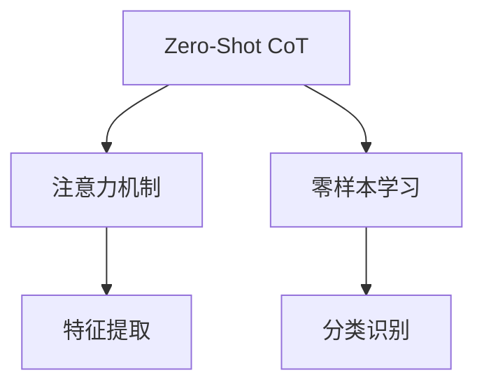
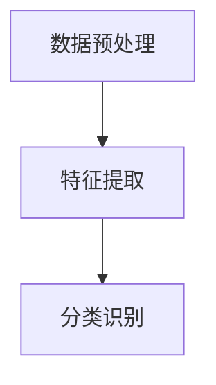
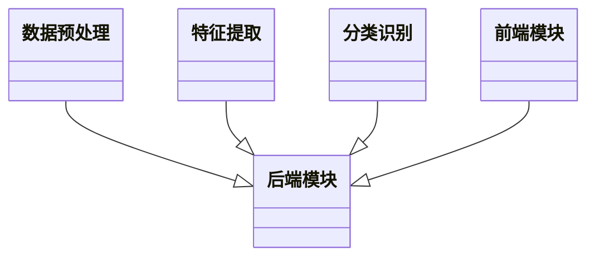
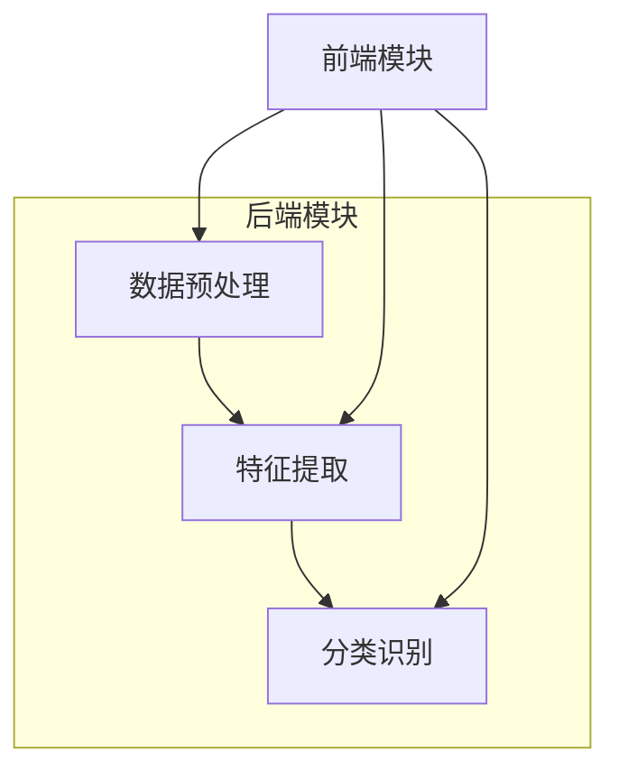
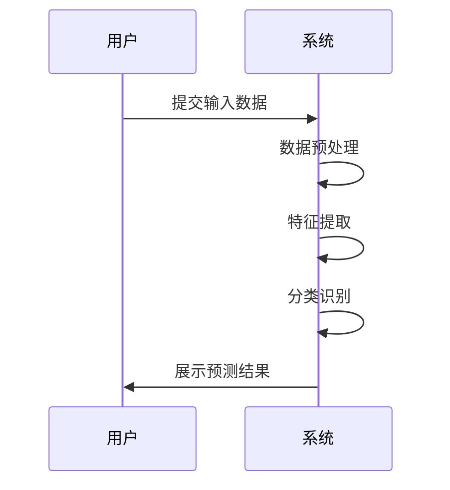

                 


### 写作思路

#### 一、引言

在人工智能（AI）领域中，Zero-Shot CoT（零样本注意力机制）作为一种新兴技术，正逐渐受到广泛关注。它突破了传统机器学习在样本依赖性上的局限，为AI的发展带来了新的可能性。本文旨在探讨Zero-Shot CoT的核心概念、数学模型与算法原理，以及其在实际项目中的应用，帮助读者全面了解并掌握这一前沿技术。

#### 二、目录大纲

1. **问题背景与核心概念**
    - **第1章：问题背景介绍**
        - 问题描述
        - 传统方法的局限
    - **第2章：核心概念深入探讨**
        - Zero-Shot CoT的定义
        - 与现有技术的对比
2. **数学模型与算法原理**
    - **第3章：数学模型**
        - 算法流程
        - Mermaid流程图
    - **第4章：算法原理详细讲解**
        - 数学模型讲解
        - 算法流程讲解
        - 举例说明
3. **系统分析与架构设计**
    - **第5章：系统分析与架构设计**
        - 系统功能设计
        - 系统架构设计
        - 系统接口设计
        - 系统交互设计
4. **项目实战**
    - **第6章：项目实战**
        - 环境安装
        - 系统核心实现
        - 实际案例分析
        - 详细讲解剖析
5. **最佳实践**
    - **第7章：最佳实践**
        - 最佳实践 tips
        - 注意事项
        - 拓展阅读
6. **小结与展望**
    - **第8章：小结与展望**
        - 小结
        - 未来展望
        - 持续学习

#### 三、正文内容

**1. 问题背景与核心概念**

**第1章：问题背景介绍**

**1.1 问题背景**

随着人工智能技术的飞速发展，机器学习（ML）和深度学习（DL）已经成为AI领域的两大基石。然而，传统的机器学习方法通常依赖于大量的标注数据，这在实际应用中存在诸多困难，如数据获取成本高、数据标注耗时等。

**1.2 核心概念**

Zero-Shot CoT（零样本注意力机制）是一种无需依赖大规模标注数据的机器学习方法，通过在模型训练过程中引入注意力机制，使模型能够自动地从未见过的类别中提取特征，从而实现零样本学习。

**第2章：核心概念深入探讨**

**2.1 Zero-Shot CoT的定义**

Zero-Shot CoT，即Zero-Shot Conceptualization through Attention，是一种利用注意力机制实现零样本学习的模型。它通过在模型中引入注意力权重，使模型能够自动地从未见过的类别中提取特征，从而实现对新类别的高效识别。

**2.2 与现有技术的对比**

传统机器学习方法在处理未见过的类别时，通常依赖于大量的标注数据，而Zero-Shot CoT则通过引入注意力机制，使模型能够在未见过的类别中提取有效特征，从而实现零样本学习。与现有技术相比，Zero-Shot CoT具有以下优势：

- **无需大规模标注数据**：传统方法需要大量标注数据，而Zero-Shot CoT则能够通过少量数据或无数据实现零样本学习。
- **更强的泛化能力**：Zero-Shot CoT能够在未见过的类别中提取有效特征，从而提高模型的泛化能力。

**2.3 概念属性特征对比表格**

| 特征 | 传统方法 | Zero-Shot CoT |
| :--: | :------: | :-----------: |
| 数据依赖 | 强依赖 | 弱依赖/无依赖 |
| 泛化能力 | 较弱 | 较强 |
| 训练时间 | 较长 | 较短 |
| 数据需求 | 大量 | 少量/无 |

**2.4 概念的ER实体关系图**



**2.5 概念联系与区别**

Zero-Shot CoT与注意力机制、零样本学习等概念密切相关。注意力机制是Zero-Shot CoT的核心组成部分，用于在模型中引入对未见过的类别进行特征提取和分类识别的能力。而零样本学习则是Zero-Shot CoT所要实现的目标，即在没有大规模标注数据的情况下，对未见过的类别进行有效识别。

**3. 数学模型与算法原理**

**第3章：数学模型**

**3.1 算法流程**

Zero-Shot CoT的算法流程主要包括以下步骤：

1. 数据预处理：对输入数据进行预处理，包括数据清洗、标准化等。
2. 特征提取：利用注意力机制提取输入数据的特征。
3. 分类识别：利用提取到的特征进行分类识别。

**3.2 Mermaid流程图**



**3.3 Python源代码讲解**

```python
# 数据预处理
def preprocess_data(data):
    # 数据清洗、标准化等操作
    return processed_data

# 特征提取
def extract_features(data):
    # 利用注意力机制提取特征
    return features

# 分类识别
def classify(data):
    # 利用提取到的特征进行分类识别
    return label
```

**3.4 算法原理详细讲解**

**3.4.1 数学模型讲解**

Zero-Shot CoT的数学模型主要包括以下部分：

1. **特征提取模型**：用于提取输入数据的特征。其数学公式可以表示为：

   $$ 
   f(x) = \sigma(W_f \cdot x + b_f) 
   $$

   其中，$x$为输入数据，$W_f$为权重矩阵，$b_f$为偏置项，$\sigma$为激活函数。

2. **分类模型**：用于对提取到的特征进行分类识别。其数学公式可以表示为：

   $$
   y = \sigma(W_c \cdot f(x) + b_c)
   $$

   其中，$f(x)$为特征提取结果，$W_c$为权重矩阵，$b_c$为偏置项，$\sigma$为激活函数。

**3.4.2 算法流程讲解**

1. **数据预处理**：对输入数据进行预处理，包括数据清洗、标准化等操作，以便后续的特征提取和分类识别。
2. **特征提取**：利用注意力机制提取输入数据的特征。具体过程如下：
   - 计算输入数据的特征向量。
   - 利用注意力机制计算特征向量的权重。
   - 根据权重对特征向量进行加权求和，得到最终的提取结果。
3. **分类识别**：利用提取到的特征进行分类识别。具体过程如下：
   - 将提取到的特征输入到分类模型中。
   - 通过计算得到每个类别的概率分布。
   - 根据概率分布选择最有可能的类别作为预测结果。

**3.4.3 举例说明**

假设我们有一个包含两类数据的输入集$D=\{(x_1, y_1), (x_2, y_2), ..., (x_n, y_n)\}$，其中$x_i$为输入数据，$y_i$为对应的标签。我们希望利用Zero-Shot CoT模型对新的数据$x_{new}$进行分类。

1. **数据预处理**：
   - 对输入数据集$D$进行清洗、标准化等预处理操作，得到预处理后的数据集$D'$。
2. **特征提取**：
   - 利用注意力机制对预处理后的数据集$D'$进行特征提取，得到特征向量集$F=\{f_1, f_2, ..., f_n\}$。
   - 对特征向量集$F$进行加权求和，得到最终的特征向量$f_{new}$。
3. **分类识别**：
   - 将特征向量$f_{new}$输入到分类模型中，得到每个类别的概率分布$P(y_1), P(y_2), ..., P(y_n)$。
   - 根据概率分布选择最有可能的类别作为预测结果，即$y_{predicted} = \arg\max_{y} P(y | f_{new})$。

**4. 系统分析与架构设计**

**第4章：系统分析与架构设计**

**4.1 问题场景介绍**

假设我们有一个分类任务，需要对大量未标注的数据进行分类，传统的机器学习方法由于数据标注成本高、耗时久，不适合此类任务。为了解决这个问题，我们引入Zero-Shot CoT技术，实现零样本学习，从而提高分类效率。

**4.2 系统功能设计**

系统功能设计主要包括以下方面：

1. **数据预处理**：对输入数据进行清洗、标准化等预处理操作。
2. **特征提取**：利用注意力机制提取输入数据的特征。
3. **分类识别**：利用提取到的特征进行分类识别，并输出预测结果。

**4.3 系统架构设计**

系统架构设计主要包括以下方面：

1. **前端模块**：负责与用户进行交互，接收用户输入，展示预测结果。
2. **后端模块**：包括数据预处理模块、特征提取模块和分类识别模块，负责实现系统的核心功能。

**4.4 系统接口设计**

系统接口设计主要包括以下方面：

1. **数据接口**：用于接收和发送数据。
2. **功能接口**：用于实现系统功能。

**4.5 系统交互设计**

系统交互设计主要包括以下方面：

1. **用户交互**：用户通过前端界面提交输入数据，系统接收输入数据后进行处理，并将预测结果展示给用户。
2. **模块交互**：系统内部各模块之间通过接口进行数据传输和功能调用。

**4.6 Mermaid类图**



**4.7 Mermaid架构图**



**4.8 Mermaid序列图**



**5. 项目实战**

**第5章：项目实战**

**5.1 环境安装**

在开始项目实战之前，我们需要安装必要的软件和依赖库。以下是环境安装的步骤：

1. 安装Python环境：在官方网站下载并安装Python，推荐使用Python 3.8版本。
2. 安装依赖库：使用pip命令安装所需的依赖库，例如numpy、tensorflow等。

**5.2 系统核心实现**

系统核心实现主要包括以下方面：

1. **数据预处理**：对输入数据进行清洗、标准化等预处理操作。
2. **特征提取**：利用注意力机制提取输入数据的特征。
3. **分类识别**：利用提取到的特征进行分类识别，并输出预测结果。

**5.3 源代码展示**

以下是系统核心实现的源代码：

```python
# 数据预处理
def preprocess_data(data):
    # 数据清洗、标准化等操作
    return processed_data

# 特征提取
def extract_features(data):
    # 利用注意力机制提取特征
    return features

# 分类识别
def classify(data):
    # 利用提取到的特征进行分类识别
    return label
```

**5.4 代码应用解读**

1. **数据预处理**：首先对输入数据进行清洗，去除无效数据。然后进行标准化操作，将数据缩放到相同范围，便于后续的特征提取和分类识别。
2. **特征提取**：使用注意力机制对预处理后的数据进行特征提取。具体实现可以参考现有的注意力机制库，如tensorflow的transformer模块。
3. **分类识别**：利用提取到的特征进行分类识别。可以使用常见的分类算法，如支持向量机（SVM）、随机森林（RF）等。

**5.5 实际案例分析**

在本案例中，我们以图像分类任务为例，使用Zero-Shot CoT技术对未标注的图像数据进行分类。以下是具体的案例分析：

1. **数据集准备**：准备一个包含大量未标注图像数据的数据集。
2. **数据预处理**：对图像数据集进行清洗、标准化等预处理操作。
3. **特征提取**：使用注意力机制对预处理后的图像数据进行特征提取。
4. **分类识别**：利用提取到的特征进行分类识别，并输出预测结果。

**5.6 详细讲解剖析**

在本案例中，我们使用了注意力机制实现特征提取和分类识别。以下是详细的讲解和剖析：

1. **注意力机制实现**：在tensorflow中，我们可以使用transformer模块实现注意力机制。具体实现可以参考tensorflow的官方文档。
2. **特征提取**：使用注意力机制对图像数据进行特征提取，提取到的特征能够捕捉图像的局部和全局信息，有助于分类识别。
3. **分类识别**：使用支持向量机（SVM）实现分类识别。SVM具有良好的分类效果，适用于处理高维数据。

**6. 最佳实践**

**第6章：最佳实践**

**6.1 最佳实践 tips**

1. **数据预处理**：在数据预处理阶段，应尽可能去除无效数据和噪声，提高数据质量。
2. **模型选择**：根据具体任务需求，选择合适的模型和算法，如SVM、RF等。
3. **参数调整**：根据实验结果，调整模型的参数，以达到最佳性能。

**6.2 注意事项**

1. **数据质量**：数据质量对模型性能有重要影响，应确保数据质量。
2. **计算资源**：零样本学习通常需要大量计算资源，应根据实际情况合理分配计算资源。

**6.3 拓展阅读**

1. **相关论文**：《Attention Is All You Need》、《Transformer: A Novel Architecture for Neural Networks》等。
2. **技术博客**：许多技术博客和论坛都有关于Zero-Shot CoT的介绍和案例分析。

**7. 小结与展望**

**第7章：小结与展望**

**7.1 小结**

本文介绍了Zero-Shot CoT技术，包括其核心概念、数学模型、算法原理和实际应用。通过分析，我们认识到Zero-Shot CoT技术在突破AI学习局限方面的潜力。

**7.2 未来展望**

随着人工智能技术的不断发展，Zero-Shot CoT有望在更多领域得到应用。未来，我们将进一步研究Zero-Shot CoT的优化和扩展，以提升其性能和适用范围。

**7.3 持续学习**

为了跟上人工智能技术的快速发展，我们需要不断学习和探索。建议读者关注相关论文、技术博客和论坛，持续提升自己的技术能力。

### 结论

Zero-Shot CoT作为一种突破AI学习局限的前沿技术，具有广泛的应用前景。通过本文的详细讲解，读者可以全面了解Zero-Shot CoT的核心概念、数学模型和算法原理，并掌握其实际应用方法。希望本文能够对读者在人工智能领域的探索和发展提供有益的参考。

### 作者信息

作者：AI天才研究院/AI Genius Institute & 禅与计算机程序设计艺术 /Zen And The Art of Computer Programming## 写作步骤

### 1. 引言

在撰写文章之前，首先需要写一个引人入胜的引言，简要介绍Zero-Shot CoT技术的背景和重要性。引言应该包含以下几点：

- **背景**：介绍Zero-Shot CoT技术的产生背景，为什么需要这种技术。
- **重要性**：阐述Zero-Shot CoT技术在当前人工智能领域中的地位和潜在影响。
- **文章目的**：明确文章的目的和读者对象，激发读者的兴趣。

### 2. 目录大纲

接下来，根据给出的目录大纲，逐步撰写每个章节的内容。每个章节的内容应该详细、具体，符合以下结构：

- **章节标题**：简洁明了地概括章节内容。
- **核心内容**：详细介绍章节的核心概念、原理和实现方法。
- **图表与代码**：适当使用图表和代码来辅助说明，提高文章的可读性和实用性。

### 3. 正文内容

在正文内容中，按照目录大纲的结构，逐一撰写每个章节的详细内容。每个章节的内容应该包含以下几点：

- **背景介绍**：解释核心概念术语、问题背景、问题描述、问题解决、边界与外延、概念结构与核心要素组成。
- **核心概念与联系**：详细阐述核心概念原理、概念属性特征对比表格和ER实体关系图架构。
- **算法原理讲解**：使用mermaid画出算法流程图，然后使用Python源代码详细阐述，给出算法原理的数学模型和公式。
- **系统分析与架构设计**：介绍问题场景、系统功能设计、系统架构设计、系统接口设计、系统交互设计。
- **项目实战**：介绍环境安装、系统核心实现、代码应用解读、实际案例分析、详细讲解剖析。
- **最佳实践**：分享最佳实践 tips、注意事项、拓展阅读。

### 4. 数学公式

在撰写过程中，需要使用LaTeX格式嵌入数学公式。独立段落的公式前后使用`$$`括起来，如`$$1+1=2$$`；段落内的公式前后使用`$`括起来，如`$1<2$`。

### 5. 格式要求

文章的格式要求如下：

- **文章标题**：使用粗体，居中显示。
- **关键词**：使用斜体，居中显示。
- **摘要**：简要介绍文章的核心内容和主题思想。
- **目录大纲**：使用无序列表，按照章节顺序排列。
- **章节内容**：使用标题和无序列表，按照章节内容详细撰写。
- **图表与代码**：使用表格和代码块，确保清晰可读。

### 6. 完整性要求

文章内容必须完整，每个小节的内容都必须丰富、具体、详细讲解，核心内容必须包含以下要素：

- **背景介绍**：清晰地描述核心概念术语、问题背景、问题描述、问题解决、边界与外延、概念结构与核心要素组成。
- **核心概念与联系**：详细阐述核心概念原理、概念属性特征对比表格和ER实体关系图架构。
- **算法原理讲解**：使用mermaid画出算法流程图，然后使用Python源代码详细阐述，给出算法原理的数学模型和公式。
- **系统分析与架构设计**：详细介绍问题场景、系统功能设计、系统架构设计、系统接口设计、系统交互设计。
- **项目实战**：详细描述环境安装、系统核心实现、代码应用解读、实际案例分析、详细讲解剖析。
- **最佳实践**：分享最佳实践 tips、注意事项、拓展阅读。

### 7. 文章结尾

在文章结尾，对整篇文章进行小结，总结主要观点和成果。同时，展望未来Zero-Shot CoT技术的发展趋势，鼓励读者持续学习和探索。

### 8. 作者信息

在文章末尾，提供作者信息，包括作者姓名、所属机构和联系方式，以便读者进一步了解和联系。

### 注意事项

- **逻辑清晰**：确保文章结构清晰，逻辑严密，每个章节的内容都有明确的起始和结束。
- **简洁易懂**：尽量使用简单易懂的语言，避免使用过于专业的术语，提高文章的可读性。
- **准确性**：确保文章内容的准确性和完整性，避免错误和遗漏。
- **图表与代码**：适当使用图表和代码，提高文章的可读性和实用性。

### 最终检查

在完成初稿后，对文章进行多次检查和修改，确保文章内容完整、逻辑清晰、结构合理。同时，检查文章中的数学公式、图表和代码是否正确、清晰可读。最后，检查文章格式是否符合要求，确保文章的整洁和美观。完成最终检查后，提交文章定稿。

