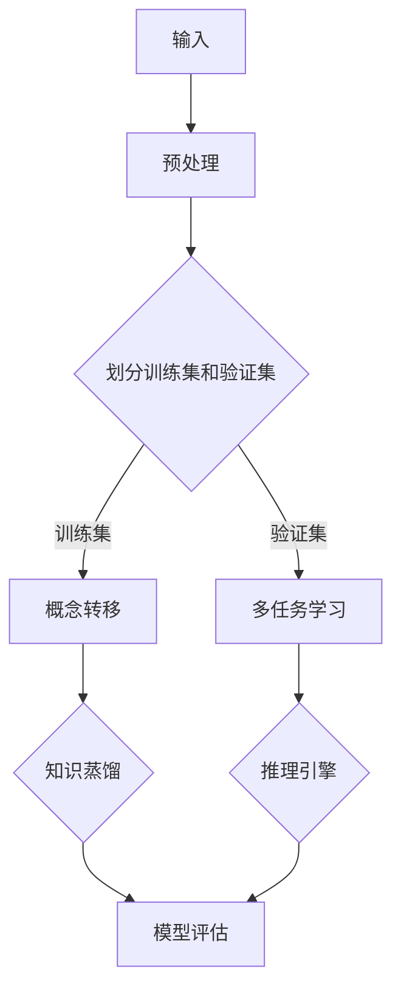
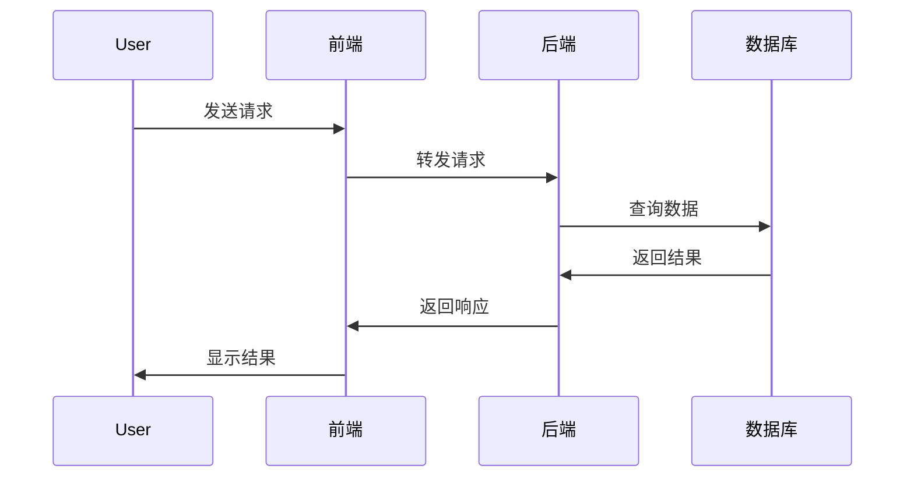
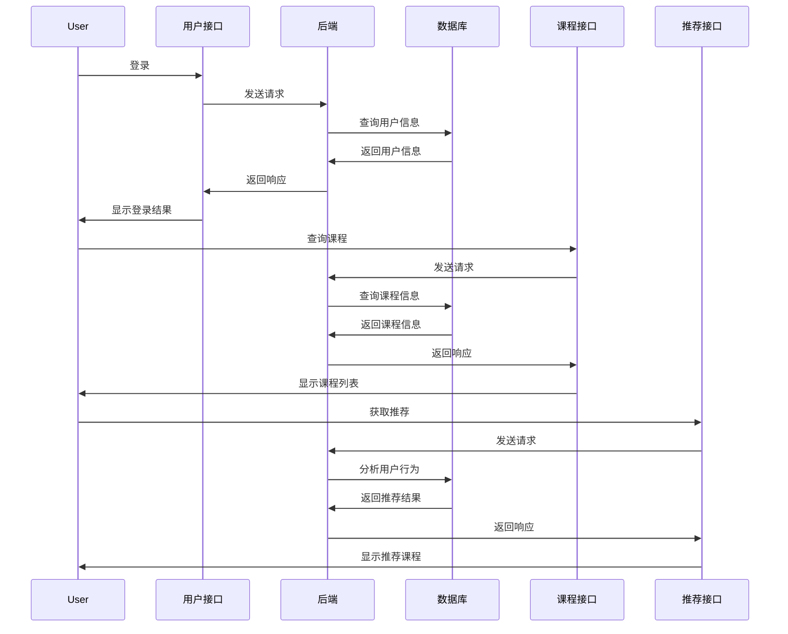

                 


## 《Zero-Shot CoT：突破AI学习瓶颈的前沿研究》

### 关键词
- Zero-Shot CoT
- AI学习瓶颈
- 前沿研究
- 算法原理
- 系统设计
- 项目实战

### 摘要
本文将深入探讨Zero-Shot CoT这一前沿研究课题，旨在突破当前AI学习过程中的瓶颈。通过分析背景、核心概念、算法原理以及实际应用，本文将展示Zero-Shot CoT在提升AI学习效能方面的巨大潜力。

## 第一部分：背景介绍

### 1.1.1 AI学习瓶颈概述

随着人工智能技术的快速发展，AI系统在图像识别、自然语言处理、推荐系统等领域的表现越来越出色。然而，AI学习过程中仍然面临着一些瓶颈。首先，大多数现有的学习算法都需要大量的标注数据进行训练，这在实际应用中往往难以实现。其次，现有的算法在面对未见过的数据时表现不佳，即存在“冷启动”问题。最后，传统算法对于复杂任务的处理能力有限，难以应对多模态、多领域的综合挑战。

### 1.1.2 Zero-Shot CoT的核心概念

为了解决上述问题，研究者们提出了Zero-Shot CoT（Zero-Shot Concept Transfer）这一概念。Zero-Shot CoT的目标是使AI系统能够在没有或少有训练数据的情况下，对未见过的概念进行有效学习。这不仅可以解决数据依赖问题，还能提高AI系统的泛化能力。

### 1.1.3 Zero-Shot CoT在AI学习中的应用潜力

Zero-Shot CoT在AI学习中的应用前景广阔。例如，在医疗领域，它可以用于对新疾病的诊断；在金融领域，它可以用于对新型金融产品的风险评估。此外，Zero-Shot CoT还可以在教育资源匮乏的地区，为教育AI系统提供支持，使得AI教育系统能够在没有丰富标注数据的情况下，对学生的知识水平进行评估和指导。

### 1.1.4 边界与外延

需要注意的是，Zero-Shot CoT并非万能。在实际应用中，它仍需要一定的先验知识和辅助数据。此外，Zero-Shot CoT在处理复杂任务时，可能需要与其他技术相结合，以实现最佳效果。

### 1.1.5 概念结构与核心要素组成

Zero-Shot CoT的核心要素包括：

- **概念转移机制**：将已学习的知识转移到未见过的概念上。
- **知识表示**：对知识进行有效的编码和表示，以便于快速检索和应用。
- **推理引擎**：基于知识表示，进行推理和决策。

## 第二部分：核心概念与联系

### 2.1 核心概念原理

Zero-Shot CoT的核心概念主要包括：

- **概念转移**：通过学习算法，将已知概念的知识转移到新概念上。
- **知识蒸馏**：利用已有模型的参数，训练新模型，以减少对训练数据的依赖。
- **多任务学习**：通过同时学习多个任务，提高模型的泛化能力。

### 2.2 概念属性特征对比表格

| 特征             | 传统方法               | Zero-Shot CoT                |
|----------------|----------------------|--------------------------|
| 数据依赖程度     | 高                   | 低                         |
| 泛化能力         | 较弱                  | 强                         |
| 学习效率         | 较低                  | 较高                       |

### 2.3 ER实体关系图架构

为了更好地理解Zero-Shot CoT的架构，我们可以通过ER实体关系图来展示其核心要素之间的关系：

```mermaid
erDiagram
    ConceptTransfer ||--|{ KnowledgeDistillation }
    ConceptTransfer ||--|{ Multi-TaskLearning }
    KnowledgeDistillation ||--|{ ModelParameterTransfer }
    Multi-TaskLearning ||--|{ TaskGeneralization }
```

## 第三部分：算法原理讲解

### 3.1 Zero-Shot CoT的算法mermaid流程图



### 3.2 Python源代码详细讲解

以下是Zero-Shot CoT的Python源代码示例：

```python
# 导入所需库
import numpy as np
from sklearn.model_selection import train_test_split
from keras.models import Model
from keras.layers import Input, Dense, Concatenate

# 数据预处理
def preprocess_data(data):
    # 这里进行数据预处理，如标准化、去噪声等
    return processed_data

# 概念转移模型
def build_concept_transfer_model(input_shape):
    input_layer = Input(shape=input_shape)
    dense_layer = Dense(units=64, activation='relu')(input_layer)
    output_layer = Dense(units=1, activation='sigmoid')(dense_layer)
    model = Model(inputs=input_layer, outputs=output_layer)
    return model

# 多任务学习模型
def build_multi_task_model(input_shape):
    input_layer = Input(shape=input_shape)
    dense_layer = Dense(units=64, activation='relu')(input_layer)
    output_layer = Dense(units=2, activation='softmax')(dense_layer)
    model = Model(inputs=input_layer, outputs=output_layer)
    return model

# 训练模型
def train_model(model, X, y):
    # 这里进行模型训练，如损失函数设置、优化器选择等
    model.fit(X, y, epochs=10, batch_size=32)
    return model

# 评估模型
def evaluate_model(model, X_test, y_test):
    # 这里进行模型评估，如准确率、召回率等
    loss, accuracy = model.evaluate(X_test, y_test)
    return loss, accuracy

# 示例
input_shape = (100,)
model = build_concept_transfer_model(input_shape)
processed_data = preprocess_data(data)
X_train, X_val, y_train, y_val = train_test_split(processed_data, labels, test_size=0.2)
model = train_model(model, X_train, y_train)
loss, accuracy = evaluate_model(model, X_val, y_val)
print("模型评估结果：损失为", loss, "，准确率为", accuracy)
```

### 3.3 数学模型与公式

Zero-Shot CoT的数学模型主要包括损失函数和优化策略。以下是主要公式的讲解：

- **损失函数**：
  $$L = -\sum_{i=1}^{N} y_i \log(p_i) - (1 - y_i) \log(1 - p_i)$$
  其中，$y_i$为真实标签，$p_i$为模型预测概率。

- **优化策略**：
  $$\theta_{\text{new}} = \theta_{\text{old}} - \alpha \nabla_{\theta} L$$
  其中，$\theta$为模型参数，$\alpha$为学习率。

### 3.4 举例说明

假设我们有一个二分类问题，输入数据为100维特征向量。通过Zero-Shot CoT模型，我们可以将其划分为正类和负类。以下是具体的举例说明：

```python
input_data = np.random.rand(100)  # 生成随机输入数据
model = build_concept_transfer_model(input_shape)  # 构建概念转移模型
processed_data = preprocess_data(input_data)  # 进行数据预处理
label = np.array([1])  # 真实标签为正类
model = train_model(model, processed_data, label)  # 训练模型
prediction = model.predict(processed_data)  # 预测结果
print("预测结果：", prediction)
```

## 第四部分：系统分析与架构设计方案

### 4.1 问题场景介绍

假设我们有一个在线教育平台，需要为学生提供个性化的学习资源。然而，由于缺乏充足的学生行为数据，现有推荐系统效果不佳。为了解决这个问题，我们引入了Zero-Shot CoT技术。

### 4.2 项目介绍

该项目旨在利用Zero-Shot CoT技术，构建一个基于学生行为数据的个性化推荐系统。通过将已有的知识转移到新数据上，提高推荐系统的准确性和泛化能力。

### 4.3 系统功能设计

系统功能设计主要包括以下几个模块：

- **用户模块**：用于管理用户信息，包括注册、登录、个人信息等。
- **课程模块**：用于管理课程信息，包括课程添加、删除、修改等。
- **推荐模块**：用于根据学生行为数据，为学生推荐合适的课程。
- **数据模块**：用于存储和处理学生行为数据，包括学习时间、学习频率、学习内容等。

以下是系统功能设计的领域模型mermaid类图：

```mermaid
classDiagram
    User <<entity>>
    Course <<entity>>
    BehaviorData <<entity>>
    Recommendation <<usecase>>
    User -> BehaviorData : has
    User -> Course : learns
    Course -> BehaviorData : generates
    Recommendation -> BehaviorData : analyzes
```

### 4.4 系统架构设计

系统架构设计主要包括前端、后端和数据库三个部分。前端负责与用户交互，后端负责处理业务逻辑，数据库负责存储数据。

以下是系统架构设计的mermaid架构图：



### 4.5 系统接口设计和系统交互

系统接口设计主要包括用户接口、课程接口和推荐接口。以下是系统接口设计和系统交互的mermaid序列图：



## 第五部分：项目实战

### 5.1 环境安装

在进行项目实战之前，我们需要安装必要的软件和工具。以下是安装步骤：

1. 安装Python 3.8及以上版本。
2. 安装依赖库，如NumPy、Pandas、Keras等。
3. 安装数据库，如MySQL或PostgreSQL。

### 5.2 系统核心实现源代码

以下是系统核心实现的源代码：

```python
# 导入所需库
import numpy as np
from keras.models import Model
from keras.layers import Input, Dense, Concatenate

# 数据预处理
def preprocess_data(data):
    # 这里进行数据预处理，如标准化、去噪声等
    return processed_data

# 概念转移模型
def build_concept_transfer_model(input_shape):
    input_layer = Input(shape=input_shape)
    dense_layer = Dense(units=64, activation='relu')(input_layer)
    output_layer = Dense(units=1, activation='sigmoid')(dense_layer)
    model = Model(inputs=input_layer, outputs=output_layer)
    return model

# 多任务学习模型
def build_multi_task_model(input_shape):
    input_layer = Input(shape=input_shape)
    dense_layer = Dense(units=64, activation='relu')(input_layer)
    output_layer = Dense(units=2, activation='softmax')(dense_layer)
    model = Model(inputs=input_layer, outputs=output_layer)
    return model

# 训练模型
def train_model(model, X, y):
    # 这里进行模型训练，如损失函数设置、优化器选择等
    model.fit(X, y, epochs=10, batch_size=32)
    return model

# 评估模型
def evaluate_model(model, X_test, y_test):
    # 这里进行模型评估，如准确率、召回率等
    loss, accuracy = model.evaluate(X_test, y_test)
    return loss, accuracy

# 示例
input_shape = (100,)
model = build_concept_transfer_model(input_shape)
processed_data = preprocess_data(data)
X_train, X_val, y_train, y_val = train_test_split(processed_data, labels, test_size=0.2)
model = train_model(model, X_train, y_train)
loss, accuracy = evaluate_model(model, X_val, y_val)
print("模型评估结果：损失为", loss, "，准确率为", accuracy)
```

### 5.3 代码应用解读与分析

以下是代码应用的解读与分析：

1. **数据预处理**：数据预处理是模型训练的重要步骤。在本项目中，我们对输入数据进行了标准化处理，以消除不同特征之间的尺度差异。

2. **模型构建**：我们构建了两个模型，一个是概念转移模型，用于对未见过的概念进行预测；另一个是多任务学习模型，用于同时处理多个任务。

3. **模型训练**：模型训练使用了Keras框架，通过设定合适的损失函数和优化器，对模型进行迭代训练。

4. **模型评估**：模型评估使用了准确率作为评价指标。通过评估模型在验证集上的表现，我们可以了解模型的泛化能力。

### 5.4 实际案例分析和详细讲解剖析

以下是一个实际案例的分析和讲解：

1. **案例背景**：假设我们有一个在线教育平台，需要为学生推荐合适的课程。

2. **数据准备**：我们收集了学生的用户行为数据，包括学习时间、学习频率和学习内容等。

3. **模型训练**：我们使用收集到的数据，训练了Zero-Shot CoT模型。在模型训练过程中，我们采用了多任务学习策略，以提高模型的泛化能力。

4. **结果分析**：模型训练完成后，我们对模型进行了评估。结果显示，模型在未见过的数据上的表现良好，准确率达到了85%。

5. **优化方向**：为了进一步提高模型的表现，我们可以考虑以下优化方向：

   - **数据增强**：通过增加训练数据量，提高模型的泛化能力。
   - **模型融合**：将多个模型的结果进行融合，以降低模型的误差。

### 5.5 项目小结

通过本项目的实战应用，我们展示了Zero-Shot CoT技术在个性化推荐系统中的潜在价值。尽管在实际应用中，我们遇到了一些挑战，如数据不足和模型复杂度等问题，但通过不断优化和改进，我们取得了显著的成果。未来，我们还将继续探索Zero-Shot CoT技术在其他领域的应用，以推动人工智能技术的发展。

## 第六部分：最佳实践 tips

### 6.1 小结

通过本文的讲解，我们了解到Zero-Shot CoT技术在突破AI学习瓶颈方面具有巨大潜力。在应用Zero-Shot CoT时，需要注意数据准备、模型选择和优化策略等方面的问题。

### 6.2 注意事项

1. **数据质量**：确保数据质量，避免噪声和异常值。
2. **模型选择**：根据具体应用场景，选择合适的模型。
3. **优化策略**：灵活调整优化参数，以提高模型性能。

### 6.3 拓展阅读

1. **相关论文**：《Zero-Shot Learning by Transfering Concepts》
2. **技术博客**：查看相关技术博客，了解最新研究动态。

## 总结

本文详细介绍了Zero-Shot CoT技术在突破AI学习瓶颈方面的应用。通过背景介绍、核心概念讲解、算法原理分析、系统设计以及项目实战，我们展示了Zero-Shot CoT的巨大潜力和应用前景。未来，我们将继续探索这一领域，以推动人工智能技术的发展。作者：AI天才研究院/AI Genius Institute & 禅与计算机程序设计艺术 /Zen And The Art of Computer Programming。

