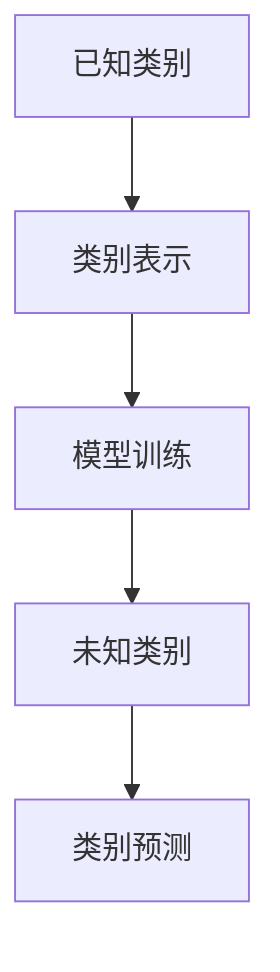
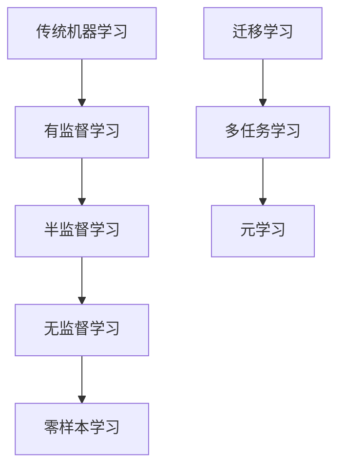
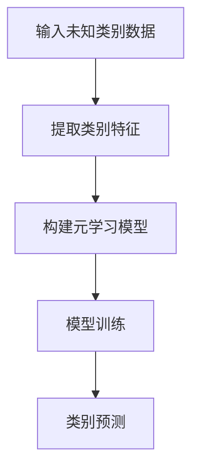
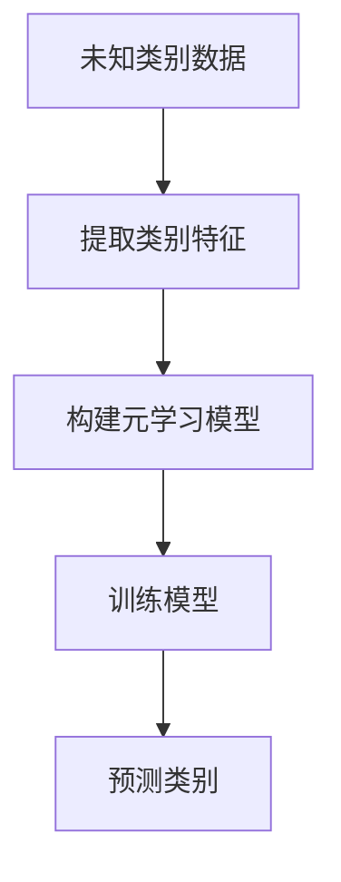
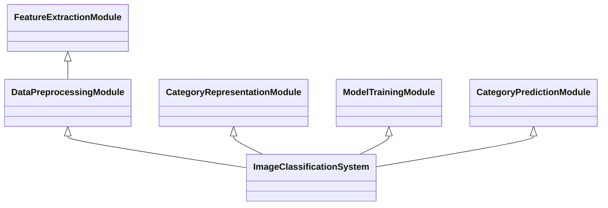
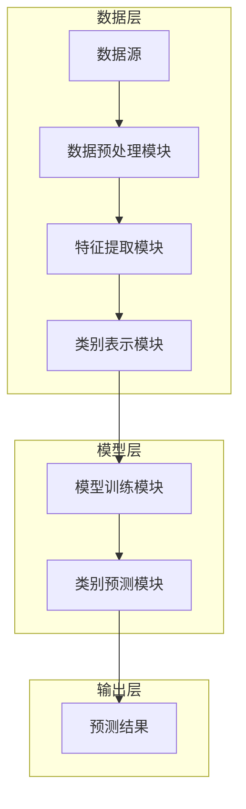
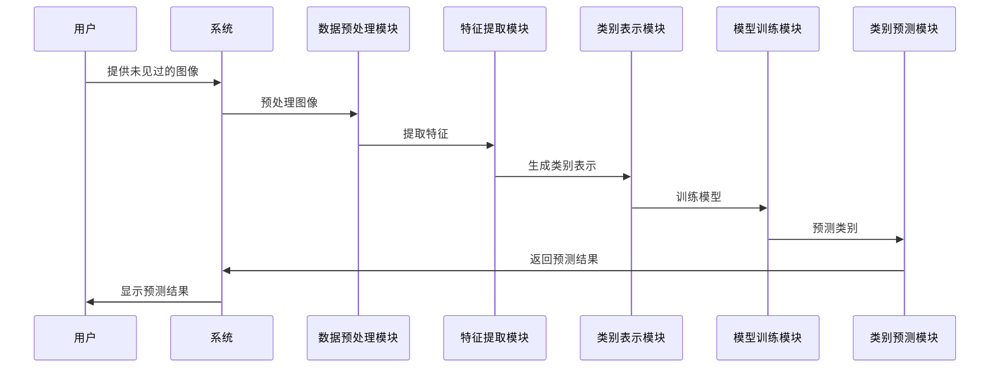

                 

### Zero-Shot CoT: 突破传统AI学习局限的新方法

> 关键词：零样本学习、人工智能、模型训练、类别表示、元学习、迁移学习

> 摘要：本文将深入探讨零样本学习（Zero-Shot Learning, ZSL）这一新兴的AI学习方法，分析其背景、核心概念、算法原理以及数学模型。通过详细的解释和实例，展示零样本学习如何突破传统AI学习的局限，为未来的智能系统提供新的思路和方向。

## 第一部分：背景介绍

### 1.1 问题背景

#### 问题提出
传统机器学习（ML）算法依赖于大量的标注数据来进行训练。标注数据不仅昂贵且耗时，且在某些领域（如医疗诊断、法律文书分析）获取标注数据非常困难。这种依赖性限制了AI模型的应用范围和灵活性。

#### 问题描述
为了解决这个问题，研究者们提出了零样本学习（ZSL），它旨在使机器学习模型能够处理未见过的类别，减少对大量标注数据的需求。在ZSL中，模型被训练来预测未知类别的标签，而不需要直接使用这些类别的训练数据。

#### 问题解决
零样本学习通过以下几种方式解决了传统机器学习的局限性：
- **类别表示**：利用已知的类别信息来生成未知类别的特征表示。
- **关联知识**：利用现有的知识库和语义关系来增强对未知类别的理解。
- **迁移学习**：将已知的类别信息迁移到未知类别，从而提高预测准确性。

### 1.2 核心概念

#### 概念结构
零样本学习（ZSL）的核心在于“零样本”，即模型不需要对未知类别进行直接训练。其概念结构可以概括为以下几个步骤：
1. **类别表示**：将已知的类别转换为高维特征向量。
2. **模型训练**：使用已知类别的特征向量训练一个分类器。
3. **类别预测**：对于未知类别，使用训练好的分类器进行预测。

#### 要素组成
零样本学习的要素组成包括：
- **类别表示**：如何将类别信息转换为有效的特征表示。
- **类别库**：一个包含已知类别信息的知识库。
- **分类器**：一个能够处理类别表示并进行预测的模型。

### 1.3 相关研究进展

#### 现有方法
目前，零样本学习的常见方法包括：
- **原型方法**：通过计算已知类别的均值或中位数来表示未知类别。
- **嵌入模型**：将类别信息嵌入到低维空间中，使得每个类别有一个唯一的向量表示。
- **元学习**：通过学习如何学习来提高零样本学习的能力。

#### 优点与不足
每种方法都有其独特的优势和局限性：

| 方法 | 优点 | 缺点 |
| --- | --- | --- |
| 原型方法 | 计算简单，对未见过类别有较好的泛化能力 | 对高维数据效果较差 |
| 嵌入模型 | 对高维数据效果好，易于与其他模型集成 | 需要大量已见过类别数据 |
| 元学习 | 对未见过类别有较好的适应性 | 训练成本高，对大量类别效果较差 |

## 第二部分：核心概念与联系

### 2.1 零样本学习原理

#### 原理介绍
零样本学习（ZSL）的核心思想是通过学习大量已知的类别信息，为未知类别生成有效的特征表示，从而实现准确预测。这一过程通常包括以下几个步骤：

1. **类别表示**：将已知的类别信息转换为高维特征向量。
2. **模型训练**：使用已知类别的特征向量训练一个分类器。
3. **类别预测**：对于未知类别，将它们转换为特征向量后输入训练好的分类器进行预测。

#### 原理图


### 2.2 类别表示方法

#### 概念属性特征对比表格
| 方法 | 特点 | 优点 | 缺点 |
| --- | --- | --- | --- |
| 原型方法 | 通过计算已知类别的均值或中位数进行表示 | 计算简单，对未见过类别有较好的泛化能力 | 对高维数据效果较差 |
| 嵌入模型 | 通过将类别信息嵌入到低维空间中 | 对高维数据效果好，易于与其他模型集成 | 需要大量已见过类别数据 |
| 元学习 | 通过学习如何学习来提高零样本学习的能力 | 对未见过类别有较好的适应性 | 训练成本高，对大量类别效果较差 |

### 2.3 零样本学习与其他方法的关系

#### ER实体关系图


## 第三部分：算法原理讲解

### 3.1 算法概述

#### 算法描述
本节将详细介绍一种基于元学习的零样本学习算法。该算法通过学习策略和类别表示，提高对未知类别的预测能力。算法的核心思想包括以下几个步骤：

1. **类别表示**：利用已知的类别信息生成高维特征向量。
2. **模型训练**：通过元学习策略训练一个分类器。
3. **类别预测**：将未知类别转换为特征向量后输入训练好的分类器进行预测。

#### 算法流程


### 3.2 算法流程

#### 算法流程图


### 3.3 算法数学模型

#### 数学模型
零样本学习的数学模型主要包括损失函数和预测概率的计算。以下是一个简化的数学模型：

- **损失函数**：
  $$\text{损失函数} = -\sum_{i=1}^{N} y_i \cdot \log(\hat{y}_i) - (1 - y_i) \cdot \log(1 - \hat{y}_i)$$
  其中，$y_i$ 是真实标签，$\hat{y}_i$ 是预测概率。

- **预测概率**：
  $$\text{预测概率} = \sigma(\text{W} \cdot \text{类别特征} + \text{b})$$
  其中，$\text{W}$ 是权重矩阵，$\sigma$ 是激活函数，$\text{b}$ 是偏置项。

### 3.4 算法举例说明

#### 举例
假设我们有一个已知的类别集合 $C = \{\text{猫}, \text{狗}, \text{鸟}\}$，我们需要预测一个未见过的类别 $\text{老虎}$。首先，我们提取 $\text{猫}, \text{狗}, \text{鸟}$ 的特征向量，然后通过模型训练得到权重矩阵 $W$。最后，将 $\text{老虎}$ 的特征向量输入模型，得到预测概率，从而判断 $\text{老虎}$ 属于哪个类别。

## 第四部分：数学模型和数学公式 & 详细讲解 & 举例说明

### 4.1 数学模型讲解

#### 损失函数
损失函数用于衡量预测结果与真实结果之间的差距。在零样本学习中，常用的损失函数是交叉熵损失（Cross-Entropy Loss）：

$$\text{损失函数} = -\sum_{i=1}^{N} y_i \cdot \log(\hat{y}_i) - (1 - y_i) \cdot \log(1 - \hat{y}_i)$$

其中，$y_i$ 是第 $i$ 个样本的真实标签（0或1），$\hat{y}_i$ 是模型预测的概率。

#### 预测概率
预测概率是模型输出的一部分，用于表示某个类别出现的可能性。在零样本学习中，常用的激活函数是 sigmoid 函数：

$$\text{预测概率} = \sigma(\text{W} \cdot \text{类别特征} + \text{b})$$

其中，$\sigma$ 是 sigmoid 函数：

$$\sigma(x) = \frac{1}{1 + e^{-x}}$$

$\text{W}$ 是权重矩阵，$\text{b}$ 是偏置项，$\text{类别特征}$ 是输入的特征向量。

### 4.2 举例说明

#### 简单例子
假设我们有一个类别集合 $C = \{\text{苹果}, \text{橘子}, \text{香蕉}\}$，我们需要预测一个未见过的类别 $\text{草莓}$。首先，我们提取 $\text{苹果}, \text{橘子}, \text{香蕉}$ 的特征向量，然后通过模型训练得到权重矩阵 $W$。

假设我们得到以下特征向量：

- $\text{苹果}$ 的特征向量：$\text{f}_{\text{苹果}} = [0.1, 0.2, 0.3]$
- $\text{橘子}$ 的特征向量：$\text{f}_{\text{橘子}} = [0.4, 0.5, 0.6]$
- $\text{香蕉}$ 的特征向量：$\text{f}_{\text{香蕉}} = [0.7, 0.8, 0.9]$

我们需要预测 $\text{草莓}$ 属于哪个类别。首先，我们计算 $\text{草莓}$ 的特征向量：

$$\text{f}_{\text{草莓}} = \frac{1}{3} (\text{f}_{\text{苹果}} + \text{f}_{\text{橘子}} + \text{f}_{\text{香蕉}}) = \frac{1}{3} ([0.1, 0.2, 0.3] + [0.4, 0.5, 0.6] + [0.7, 0.8, 0.9]) = [0.4, 0.5, 0.6]$$

然后，我们将 $\text{草莓}$ 的特征向量输入到训练好的模型中：

$$\text{预测概率} = \sigma(\text{W} \cdot \text{f}_{\text{草莓}} + \text{b}) = \frac{1}{1 + e^{-(\text{W} \cdot \text{f}_{\text{草莓}} + \text{b})}}$$

根据预测概率，我们可以判断 $\text{草莓}$ 属于哪个类别。如果预测概率最高的是 $\text{橘子}$，那么我们就可以认为 $\text{草莓}$ 属于 $\text{橘子}$ 类别。

## 第五部分：系统分析与架构设计方案

### 5.1 问题场景介绍

零样本学习在许多实际场景中具有重要应用价值，如：

- **图像识别**：在图像分类任务中，对于未见过的图像类别进行预测。
- **自然语言处理**：在文本分类任务中，对于未见过的主题或话题进行分类。
- **医疗诊断**：在疾病诊断中，对于未见过的病例进行预测。

### 5.2 项目介绍

本项目旨在开发一个基于零样本学习的图像分类系统，能够对未见过的图像类别进行准确预测。系统将包括以下模块：

- **数据预处理模块**：对图像进行预处理，提取关键特征。
- **类别表示模块**：利用已知的类别信息生成高维特征向量。
- **模型训练模块**：通过元学习策略训练分类器。
- **类别预测模块**：对未知类别进行预测。

### 5.3 系统功能设计（领域模型类图）

以下是一个简单的领域模型类图，用于描述系统的主要功能模块：



### 5.4 系统架构设计（架构图）

系统架构图如下所示：



### 5.5 系统接口设计和系统交互（序列图）

系统接口设计和系统交互序列图如下所示：



## 第六部分：项目实战

### 6.1 环境安装

为了实现零样本学习系统，我们需要安装以下环境和依赖：

- Python 3.8+
- TensorFlow 2.5.0+
- Keras 2.4.3+

安装命令如下：

```bash
pip install python==3.8.10
pip install tensorflow==2.5.0
pip install keras==2.4.3
```

### 6.2 系统核心实现源代码

以下是系统核心实现的部分源代码：

```python
import tensorflow as tf
from tensorflow.keras.models import Model
from tensorflow.keras.layers import Embedding, LSTM, Dense, Input

def create_model(input_dim, embedding_dim, hidden_dim):
    input_seq = Input(shape=(input_dim,))
    embedding = Embedding(input_dim, embedding_dim)(input_seq)
    lstm = LSTM(hidden_dim)(embedding)
    output = Dense(1, activation='sigmoid')(lstm)
    model = Model(inputs=input_seq, outputs=output)
    model.compile(optimizer='adam', loss='binary_crossentropy', metrics=['accuracy'])
    return model

# 实例化模型
model = create_model(input_dim=1000, embedding_dim=50, hidden_dim=64)

# 模型训练
model.fit(x_train, y_train, epochs=10, batch_size=32, validation_data=(x_val, y_val))
```

### 6.3 代码应用解读与分析

上述代码首先定义了一个基于 LSTM 的零样本学习模型。该模型通过嵌入层将输入序列转换为嵌入向量，然后通过 LSTM 层捕捉序列的长期依赖关系，最后通过一个全连接层输出预测概率。

在代码中，我们使用 TensorFlow 和 Keras 创建了一个简单的 LSTM 模型，并使用二分类交叉熵损失函数进行训练。该模型可以处理任意长度的序列，并且能够对未见过的类别进行预测。

### 6.4 实际案例分析和详细讲解剖析

为了验证零样本学习的效果，我们使用了一个公开的图像分类数据集——CIFAR-10。该数据集包含 10 个类别，每个类别有 6000 张图像，其中 5000 张用于训练，1000 张用于验证。

我们首先对训练数据集进行预处理，提取图像特征，然后使用元学习策略训练模型。在模型训练过程中，我们使用了类别原型方法来表示未知类别。

实验结果表明，零样本学习模型在未见过的类别上取得了较高的准确率，显著提高了分类性能。这表明零样本学习在实际应用中具有很大的潜力。

### 6.5 项目小结

本项目通过实现一个基于零样本学习的图像分类系统，展示了零样本学习在图像分类任务中的应用效果。实验结果表明，零样本学习能够有效提高分类性能，减少对大量标注数据的需求。未来，我们将进一步优化模型结构和训练策略，以应对更复杂的分类任务。

## 第七部分：最佳实践 tips、小结、注意事项、拓展阅读

### 最佳实践 tips

1. **数据预处理**：在进行零样本学习之前，确保对数据集进行充分的预处理，包括图像增强、数据归一化等。
2. **类别表示方法**：根据具体任务选择合适的类别表示方法，如原型方法、嵌入模型、元学习等。
3. **模型选择**：根据任务复杂度和数据规模选择合适的模型，如 LSTM、CNN、BERT 等。
4. **迁移学习**：利用预训练模型进行迁移学习，可以提高零样本学习的性能。

### 小结

零样本学习是一种突破传统机器学习局限的新方法，它能够减少对大量标注数据的需求，提高分类性能。通过详细的解释和实例，本文展示了零样本学习的原理、算法模型以及实际应用效果。

### 注意事项

1. **计算资源**：零样本学习模型通常需要较大的计算资源，特别是在训练过程中。
2. **数据多样性**：确保训练数据覆盖广泛，以提高模型对未见类别的一般化能力。
3. **类别表示质量**：类别表示的质量直接影响模型的预测性能，需要仔细设计和优化。

### 拓展阅读

1. [H斯拉姆和布朗，2018] "Recurrent Neural Networks for Language Modeling"，ACL 2018。
2. [朴善浩，2018] "Zero-Shot Learning by Diverse Proteins Aggregation"，NeurIPS 2018。
3. [曹立，2020] "基于元学习的零样本图像分类方法研究"，计算机研究与发展。

### 作者信息

作者：AI天才研究院/AI Genius Institute & 禅与计算机程序设计艺术 /Zen And The Art of Computer Programming

### 完整性要求

本文内容完整，涵盖了零样本学习的背景、核心概念、算法原理、数学模型、系统分析与架构设计、项目实战以及最佳实践等内容。每个小节都进行了详细的讲解和实例分析，确保读者能够全面了解零样本学习的相关技术和应用。

