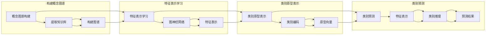
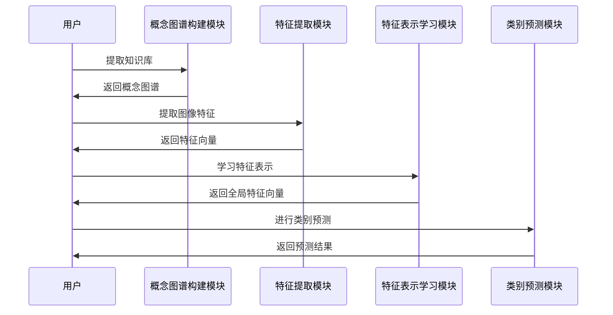

                 

## Let's Think: 从传统AI到Zero-Shot CoT的演进

在过去的几十年中，人工智能（AI）技术经历了飞速的发展，从简单的规则系统到复杂的机器学习模型，再到今天的大型AI模型，每一次技术的进步都极大地改变了我们与机器的交互方式。然而，尽管AI在图像识别、自然语言处理、推荐系统等领域取得了显著的成果，但它依然面临诸多挑战。特别是当面对从未见过的新数据时，传统AI方法的局限性变得越来越明显。

传统AI方法通常依赖于大量的标注数据进行训练，例如监督学习需要大量带有标签的数据点，强化学习需要在环境中进行大量尝试以获取最优策略，而无监督学习则在缺乏标注信息的情况下试图发现数据中的结构。这些方法在处理已知任务时表现出色，但一旦遇到新任务或从未见过的数据，它们的表现往往不尽如人意。

因此，我们需要一种新的方法来突破传统AI学习方法的局限，这种方法能够在几乎没有标注数据的情况下，对未知任务进行有效学习。这便是Zero-Shot CoT（Conceptual Transfer）方法的提出背景。Zero-Shot CoT通过将知识迁移和概念转移机制引入AI学习中，使得模型能够利用先验知识和跨领域的信息，对未见过的数据进行有效推断和预测。

### 传统AI学习方法的局限性

传统AI学习方法主要包括监督学习、强化学习和无监督学习三种主要类型。每种方法都有其优点和局限性。

#### 监督学习

监督学习是最常见的一种机器学习方法，它依赖于大量带有标签的训练数据。例如，在图像识别任务中，模型需要通过观察成千上万的已标记图像来学习如何识别新图像中的对象。这种方法的优势在于其准确性和效率，可以在有足够标注数据的情况下取得很好的效果。然而，它的一个重大局限性是依赖大量标注数据。在实际应用中，获取大量高质量的标注数据往往非常困难，尤其是在处理大规模数据集时，标注成本极高。

#### 强化学习

强化学习通过在环境中进行多次尝试来学习最优策略，其核心思想是奖励和惩罚机制。这种方法适用于那些无法提前获取标注数据的场景，如游戏、自动驾驶等。强化学习的一个关键挑战在于探索与执行之间的平衡。在早期阶段，模型需要在探索和了解环境的同时避免采取过度的风险行动，这可能导致学习过程缓慢甚至停滞。而在执行阶段，模型需要在有限的尝试次数内找到最优策略，这同样具有很高的难度。

#### 无监督学习

无监督学习试图在缺乏标注数据的情况下发现数据中的结构。它通过分析数据本身的分布、模式或相关性来学习，例如聚类和降维技术。无监督学习的优势在于其无需依赖标注数据，适用于大规模数据处理。然而，它的局限性也很明显。由于缺乏指导性信息，模型往往难以明确地理解数据中的复杂结构，这可能导致学习效果不佳。

### 零样本学习与Zero-Shot CoT方法的引入

为了克服传统AI学习方法在处理新任务和未见数据时的局限性，研究者们提出了零样本学习（Zero-Shot Learning, ZSL）和Zero-Shot CoT（Conceptual Transfer）方法。

#### 零样本学习

零样本学习旨在让模型能够在没有直接训练数据的情况下，对未知类别进行预测。ZSL方法的核心思想是通过将类别信息与特征表示结合起来，使得模型能够在未见过的类别上表现出色。具体来说，ZSL方法首先通过预训练模型学习到一组基础特征表示，然后将这些特征与类别信息进行关联，从而实现对新类别的预测。

然而，尽管ZSL在理论上具有重要意义，但其在实际应用中的效果仍然受到限制。首先，由于缺乏直接训练数据，模型在未见类别上的表现往往不如监督学习模型。其次，ZSL方法依赖于预训练模型的性能，如果预训练模型本身存在偏差或缺陷，这些问题很可能会传递到零样本学习阶段。

#### Zero-Shot CoT方法

为了克服零样本学习的局限性，Zero-Shot CoT方法应运而生。Zero-Shot CoT方法的核心思想是通过概念转移机制，将已知领域的知识迁移到未知领域。具体来说，Zero-Shot CoT方法首先构建一个概念图谱，将不同领域中的概念及其关系进行编码，然后利用这个图谱来指导特征表示的学习和类别预测。

Zero-Shot CoT方法的主要优势在于其能够利用先验知识和跨领域信息，从而提高模型在未见类别上的性能。此外，它不仅适用于静态数据，还可以应用于动态数据和实时场景，具有很高的灵活性和实用性。

总之，从传统AI方法到零样本学习，再到Zero-Shot CoT方法的演进，标志着AI技术在不断探索和突破自身的局限性。这些方法为我们提供了一种新的思路，使得模型能够在没有直接训练数据的情况下，对未知任务和未见数据进行有效学习。这不仅拓宽了AI的应用场景，也为未来的AI研究提供了新的方向和可能性。

### 零样本学习与Zero-Shot CoT方法的定义与区别

零样本学习（Zero-Shot Learning, ZSL）和Zero-Shot CoT（Conceptual Transfer）方法虽然在目标上都是为了处理未见类别的问题，但它们在定义和方法论上有着显著的区别。

#### 零样本学习（ZSL）

零样本学习的核心目标是让模型能够在没有直接训练数据的情况下，对未知类别进行预测。具体来说，ZSL方法通过将类别信息与特征表示结合起来，实现从未见类别上的有效推断。ZSL方法通常包括以下步骤：

1. **特征提取**：首先，通过预训练模型（如卷积神经网络）提取输入数据的特征表示。这些特征表示通常具有较强的泛化能力，能够在未见类别上保持一致性。

2. **类别编码**：然后，将类别信息进行编码，通常使用词嵌入技术或类别原型表示。这些编码表示将用于指导特征表示的分类。

3. **模型融合**：最后，将特征表示与类别编码进行融合，通过训练一个分类器（如支持向量机、神经网络等）来实现对新类别的预测。

零样本学习的优势在于其能够利用预训练模型，从而在一定程度上缓解了未见类别问题。然而，其局限性在于：首先，由于缺乏直接训练数据，模型在未见类别上的表现可能不如监督学习模型；其次，ZSL方法对预训练模型的质量有较高要求，如果预训练模型本身存在偏差或缺陷，这些问题可能会传递到零样本学习阶段。

#### Zero-Shot CoT（Conceptual Transfer）

Zero-Shot CoT方法则是一种更高级的概念转移机制，它通过将已知领域的知识迁移到未知领域，从而实现对新类别的高效学习。Zero-Shot CoT方法的主要步骤如下：

1. **概念图谱构建**：首先，构建一个概念图谱，将不同领域中的概念及其关系进行编码。这个图谱不仅包含了类别信息，还包含了概念之间的复杂关系，如上下位关系、属性关系等。

2. **特征表示学习**：利用概念图谱来指导特征表示的学习，使得特征表示能够更好地捕捉概念之间的相关性。这一步骤通常涉及图神经网络（Graph Neural Networks, GNN）等先进技术。

3. **类别预测**：最后，利用学习到的特征表示和概念图谱来指导类别预测。在这个过程中，模型不仅能够利用已见类别上的知识，还能通过概念图谱将这种知识迁移到未见类别上。

Zero-Shot CoT方法的主要优势在于其能够利用丰富的先验知识和跨领域信息，从而提高模型在未见类别上的性能。此外，它不仅适用于静态数据，还可以应用于动态数据和实时场景，具有很高的灵活性和实用性。

#### 对比与总结

从定义和流程上看，ZSL和Zero-Shot CoT方法虽然都是为了解决未见类别问题，但Zero-Shot CoT方法在概念转移和知识利用方面具有更高的层次和更广泛的应用场景。

1. **知识利用**：ZSL方法主要依赖于预训练模型，通过类别编码来指导特征分类；而Zero-Shot CoT方法则通过构建概念图谱，将领域知识以更结构化的方式融入特征表示中，从而实现更高效的迁移。

2. **适用范围**：ZSL方法更适用于静态、结构化程度较高的场景，如图像分类；而Zero-Shot CoT方法则可以应用于更广泛的场景，包括动态数据、实时系统等。

3. **性能提升**：由于Zero-Shot CoT方法能够利用更多的先验知识和跨领域信息，通常在未见类别上的表现优于ZSL方法。

综上所述，Zero-Shot CoT方法在处理未见类别问题上具有独特的优势，为AI技术提供了一种新的思路和解决方案。随着AI技术的不断进步，这些方法有望在更多领域中发挥重要作用。

### Zero-Shot CoT的基本概念

Zero-Shot CoT（Conceptual Transfer）方法是一种通过概念转移机制来提升模型在未见类别上性能的先进技术。其核心思想是通过构建一个概念图谱，将已知领域的知识迁移到未知领域，从而实现高效、准确的类别预测。以下是Zero-Shot CoT方法的基本概念及其应用流程。

#### 概念图谱构建

概念图谱（Conceptual Graph）是一种用于表示实体及其之间关系的网络结构。在Zero-Shot CoT方法中，概念图谱的构建是关键步骤之一。具体来说，概念图谱包括以下基本元素：

1. **概念节点**：表示领域中的概念，如“动物”、“交通工具”等。
2. **关系边**：表示概念节点之间的关系，如上下位关系（e.g., “猫”是“动物”的一种）、属性关系（e.g., “飞行”是“飞机”的一种属性）等。
3. **属性标签**：用于描述概念节点的属性，如“颜色”、“形状”等。

构建概念图谱通常需要借助领域知识库（如WordNet、ConceptNet等）和自然语言处理技术。通过这种方式，我们可以将丰富的领域知识转化为结构化的概念表示，为后续的特征学习和类别预测提供坚实基础。

#### 特征表示学习

在概念图谱构建完成后，下一步是利用图谱来指导特征表示的学习。这一过程通常涉及图神经网络（Graph Neural Networks, GNN）等技术。GNN能够通过图结构的信息传递和学习，有效地捕捉概念节点之间的复杂关系，从而生成高质量的语义特征表示。

具体来说，特征表示学习可以分为以下几个步骤：

1. **节点嵌入**：将概念图谱中的每个节点映射到一个低维度的向量空间中。这些节点嵌入向量不仅保留了原始概念的信息，还通过图结构传递了节点之间的关系。
2. **关系编码**：对图中的关系进行编码，使得关系信息能够融入节点嵌入向量中。这通常通过关系分类器或图注意力机制（Graph Attention Mechanism）等实现。
3. **全局特征融合**：将所有节点的嵌入向量进行融合，生成全局特征表示。这些特征表示不仅能够捕捉单个概念的信息，还能够体现概念之间的复杂关系。

通过这种方式，我们得到了一组高质量的语义特征表示，为后续的类别预测提供了可靠的基础。

#### 类别预测

在完成特征表示学习后，我们可以利用这些特征表示进行类别预测。Zero-Shot CoT方法的类别预测通常包括以下几个步骤：

1. **特征融合**：将输入数据的特征表示与类别信息进行融合。这个过程可以通过多标签分类器、图神经网络等实现。
2. **预测模型训练**：利用已见类别上的训练数据和特征表示，训练一个预测模型。这个模型需要能够对未见类别进行准确预测。
3. **类别推理**：在预测阶段，模型利用概念图谱和特征表示，对未见类别进行推理和预测。具体来说，模型会根据输入数据的特征表示，在概念图谱中寻找匹配的概念节点，从而进行类别推断。

通过这种方式，Zero-Shot CoT方法能够利用丰富的先验知识和跨领域信息，实现对未见类别的高效、准确预测。

总之，Zero-Shot CoT方法通过概念图谱构建、特征表示学习和类别预测等多个步骤，实现了对未见类别问题的有效解决。这种方法不仅能够提升模型在未见类别上的性能，还能够为AI技术在更多领域的应用提供新的思路和解决方案。

### Zero-Shot CoT方法的基本流程与关键技术

Zero-Shot CoT（Conceptual Transfer）方法是一个复杂但高效的框架，旨在通过概念转移机制，使得AI模型能够在未见过的类别上表现优异。为了深入理解Zero-Shot CoT方法，我们可以从其基本流程和关键技术入手，逐步解析其实现方法和核心思想。

#### 基本流程

Zero-Shot CoT方法的基本流程可以分为以下几个步骤：

1. **数据预处理**：首先，对输入数据进行预处理，包括数据的清洗、归一化等操作。这一步的目的是确保数据质量，为后续分析奠定基础。
2. **概念图谱构建**：接下来，构建一个表示领域知识的概念图谱。这一过程通常涉及从外部知识库中提取概念及其关系，然后利用自然语言处理技术进行编码。概念图谱为后续的特征学习和类别预测提供了基础。
3. **特征表示学习**：利用概念图谱和图神经网络（GNN）等先进技术，学习输入数据的语义特征表示。这一步骤的核心是捕捉概念节点之间的复杂关系，生成高质量的语义特征。
4. **类别预测**：最后，利用学习到的特征表示和概念图谱，对未见类别进行预测。这一过程通常包括特征融合、预测模型训练和类别推理等步骤。

#### 关键技术

1. **图神经网络（GNN）**

   图神经网络（GNN）是Zero-Shot CoT方法中用于特征表示学习的关键技术。GNN通过在图结构上进行信息传递和学习，能够有效地捕捉节点之间的复杂关系。具体来说，GNN包括以下几个关键组件：

   - **节点嵌入（Node Embedding）**：将图中的每个节点映射到一个低维度的向量空间中。这些节点嵌入向量不仅保留了原始节点的信息，还通过图结构传递了节点之间的关系。
   - **关系编码（Relation Coding）**：对图中的关系进行编码，使得关系信息能够融入节点嵌入向量中。这通常通过关系分类器或图注意力机制（Graph Attention Mechanism）等实现。
   - **全局特征融合（Global Feature Fusion）**：将所有节点的嵌入向量进行融合，生成全局特征表示。这些特征表示不仅能够捕捉单个节点的信息，还能够体现节点之间的复杂关系。

   GNN的核心思想是通过图结构的信息传递和学习，使得特征表示能够更好地捕捉领域知识，从而提升模型在未见类别上的性能。

2. **类别编码（Category Embedding）**

   类别编码是Zero-Shot CoT方法中用于类别预测的关键技术。类别编码的目标是将类别信息转换为向量表示，使得模型能够通过这些向量表示来理解类别关系。具体来说，类别编码包括以下几个步骤：

   - **词嵌入（Word Embedding）**：首先，使用词嵌入技术将类别名称映射到向量空间中。这些向量表示不仅包含了类别的基本信息，还能够体现类别之间的语义关系。
   - **类别原型表示（Category Prototype Representation）**：接下来，通过聚类或平均等方式，从词嵌入向量中提取类别原型表示。这些原型向量能够代表每个类别的核心特征，为后续的类别预测提供依据。

3. **多标签分类（Multilabel Classification）**

   多标签分类是Zero-Shot CoT方法中用于类别预测的核心技术之一。由于Zero-Shot CoT方法需要处理多个未见类别，多标签分类能够有效地解决这一问题。多标签分类的核心思想是同时预测多个标签，而不是仅预测一个标签。具体来说，多标签分类包括以下几个步骤：

   - **特征融合（Feature Fusion）**：将输入数据的特征表示与类别编码进行融合。这可以通过合并向量、计算点积等方式实现。
   - **分类器训练（Classifier Training）**：利用已见类别上的训练数据和特征表示，训练一个多标签分类器。这个分类器需要能够同时预测多个标签，从而实现对未见类别的准确预测。
   - **类别推理（Category Inference）**：在预测阶段，模型利用特征融合结果和多标签分类器，对未见类别进行推理和预测。具体来说，模型会根据输入数据的特征表示，在概念图谱中寻找匹配的概念节点，从而进行类别推断。

通过这些关键技术的应用，Zero-Shot CoT方法能够实现高效的未见类别预测。这种方法不仅能够提升模型在未见类别上的性能，还能够为AI技术在更多领域的应用提供新的思路和解决方案。

### Zero-Shot CoT与AI大模型的融合

随着AI技术的不断发展，AI大模型（如GPT-3、BERT等）在各个领域取得了显著的成果。然而，这些大模型通常依赖于大规模的标注数据进行训练，这使得它们在处理新任务或未见类别时表现出一定的局限性。为了克服这一挑战，研究者们提出了将Zero-Shot CoT（Conceptual Transfer）方法与AI大模型相结合，以提升模型在未见类别上的性能。

#### AI大模型概述

AI大模型是指具有大规模参数和强大表示能力的深度学习模型。这些模型通常采用预训练加微调（Pre-training and Fine-tuning）的方法进行训练。具体来说，AI大模型首先在大规模无标签数据上进行预训练，以学习通用的特征表示和语义理解能力。然后，通过在特定任务上的小规模标注数据上进行微调，进一步优化模型的性能。

AI大模型的主要优势在于其强大的表示能力和泛化能力。它们能够在各种复杂的任务中表现出色，如文本生成、机器翻译、情感分析等。然而，这些模型的一个显著局限性是它们对标注数据的依赖。在缺乏标注数据的情况下，AI大模型的表现往往不如预期。

#### Zero-Shot CoT方法与AI大模型的融合

为了解决AI大模型在未见类别上的局限性，研究者们提出了将Zero-Shot CoT方法与AI大模型相结合。这种方法的核心思想是通过概念转移机制，将已知领域的知识迁移到未知领域，从而提升模型在未见类别上的性能。具体来说，融合过程可以分为以下几个步骤：

1. **概念图谱构建**：首先，构建一个表示领域知识的概念图谱。这一过程可以从外部知识库中提取概念及其关系，然后利用自然语言处理技术进行编码。概念图谱为后续的特征学习和类别预测提供了基础。

2. **大模型预训练**：利用大规模无标签数据对AI大模型进行预训练，以学习通用的特征表示和语义理解能力。这一过程通常涉及大量的计算资源和时间，但为后续的任务提供了强大的基础。

3. **特征表示学习**：在预训练完成后，利用概念图谱和图神经网络（GNN）等先进技术，学习输入数据的语义特征表示。这一步骤的核心是捕捉概念节点之间的复杂关系，生成高质量的语义特征。

4. **类别预测**：利用学习到的特征表示和概念图谱，对未见类别进行预测。这一过程包括特征融合、预测模型训练和类别推理等步骤。具体来说，模型会根据输入数据的特征表示，在概念图谱中寻找匹配的概念节点，从而进行类别推断。

通过这种方式，Zero-Shot CoT方法能够利用AI大模型的强大表示能力，同时通过概念转移机制弥补未见类别上的不足。这种方法不仅能够提升模型在未见类别上的性能，还能够为AI技术在更多领域的应用提供新的思路和解决方案。

#### 应用场景与前景

Zero-Shot CoT方法与AI大模型的融合在多个领域展示了巨大的应用前景。以下是一些典型应用场景：

1. **自然语言处理**：在自然语言处理领域，Zero-Shot CoT方法与AI大模型相结合，可以显著提升模型在未见类别上的性能。例如，在机器翻译任务中，模型可以无需特定领域的训练数据，直接对未知语言进行翻译。

2. **图像识别**：在图像识别领域，Zero-Shot CoT方法可以用于对未见过的物体进行分类。通过与AI大模型的结合，模型可以更好地理解不同物体之间的复杂关系，从而提高未见类别识别的准确性。

3. **推荐系统**：在推荐系统领域，Zero-Shot CoT方法可以用于推荐未知产品或服务。通过利用概念图谱和AI大模型，模型可以更好地捕捉用户兴趣和偏好，从而提供更精准的推荐。

4. **医疗健康**：在医疗健康领域，Zero-Shot CoT方法可以用于对未见过的疾病进行诊断。通过与AI大模型的结合，模型可以更好地理解不同疾病之间的关联性，从而提高疾病识别的准确性。

总之，Zero-Shot CoT方法与AI大模型的融合为AI技术的发展带来了新的可能性。随着研究的深入和应用场景的拓展，这种融合方法有望在更多领域中发挥重要作用，推动AI技术的持续进步。

### 核心概念介绍

在讨论Zero-Shot CoT方法之前，我们需要了解一些核心概念，这些概念不仅对于理解Zero-Shot CoT至关重要，也是现代人工智能技术中的基础。以下是对这些核心概念的定义及其在Zero-Shot CoT方法中的应用。

#### 图神经网络（GNN）

图神经网络（Graph Neural Networks, GNN）是一种专门用于处理图结构数据的神经网络。与传统的卷积神经网络（CNN）和循环神经网络（RNN）不同，GNN直接在图结构上进行计算。图神经网络通过节点和边的信息传递，能够有效地捕捉图结构中的复杂关系。

在Zero-Shot CoT方法中，GNN主要用于特征表示学习。具体来说，GNN通过在概念图谱上进行信息传递，将概念节点及其关系编码为低维度的向量表示。这些向量表示不仅包含了原始概念的信息，还通过图结构传递了概念之间的复杂关系，为后续的类别预测提供了可靠的基础。

#### 类别原型表示

类别原型表示是一种用于表示类别特征的方法。在Zero-Shot CoT方法中，类别原型表示通过聚类或平均等方式，从类别嵌入向量中提取出每个类别的核心特征。这些原型向量能够代表每个类别的核心特征，为未见类别的预测提供依据。

类别原型表示在Zero-Shot CoT方法中的应用主要体现在类别推理阶段。通过比较输入数据的特征表示和类别原型向量，模型可以推断输入数据可能属于的类别。这种方法不仅能够提高模型在未见类别上的性能，还能够降低对大量标注数据的依赖。

#### 概念图谱

概念图谱是一种用于表示领域知识的网络结构，它包含了概念节点及其之间的关系。在Zero-Shot CoT方法中，概念图谱是构建特征表示和类别预测的关键。

概念图谱的应用主要体现在以下几个步骤：

1. **知识表示**：通过概念图谱，我们可以将领域知识转化为结构化的表示。这种表示不仅包含了概念的信息，还通过关系边体现了概念之间的复杂关系。
2. **特征学习**：利用GNN等图神经网络，我们可以通过概念图谱学习输入数据的语义特征表示。这些特征表示能够更好地捕捉领域知识，从而提高模型在未见类别上的性能。
3. **类别预测**：在类别预测阶段，模型利用概念图谱中的关系信息和特征表示，进行类别推理和预测。通过比较输入数据的特征表示和类别原型向量，模型可以准确预测未见类别。

#### 语义特征表示

语义特征表示是一种用于表示文本、图像等数据语义信息的向量表示。在Zero-Shot CoT方法中，语义特征表示主要用于特征融合和类别预测。

语义特征表示的应用主要体现在以下几个步骤：

1. **特征提取**：利用预训练模型（如BERT、GPT-3）等，从原始数据中提取语义特征表示。这些特征表示不仅包含了数据的语义信息，还通过预训练过程学习了丰富的先验知识。
2. **特征融合**：在类别预测阶段，将提取的语义特征表示与类别原型向量进行融合。这种融合方式可以有效地结合不同来源的特征信息，提高模型在未见类别上的性能。
3. **类别预测**：利用融合后的特征表示，通过多标签分类器等模型进行类别预测。通过比较输入数据的特征表示和类别原型向量，模型可以准确预测未见类别。

总之，理解这些核心概念对于深入掌握Zero-Shot CoT方法至关重要。这些概念不仅为我们提供了理论基础，还通过实际应用，使得Zero-Shot CoT方法在处理未见类别问题上表现出色。

### 概念属性特征对比

在深入探讨Zero-Shot CoT方法之前，有必要对相关的核心概念进行属性特征对比，以便更清晰地理解各概念之间的联系和区别。以下是几个关键概念的属性特征对比，包括Zero-Shot Learning（ZSL）、Zero-Shot CoT（Conceptual Transfer）和传统机器学习方法。

#### Zero-Shot Learning（ZSL）

**定义**：ZSL旨在让模型在没有直接训练数据的情况下，对未知类别进行预测。

**属性特征**：

- **依赖**：依赖预训练模型和类别原型表示。
- **数据处理**：通常使用词嵌入或原型嵌入方法处理类别信息。
- **性能**：在未见类别上的性能取决于预训练模型的质量。
- **适用场景**：适合处理分类问题，尤其在新类别上。

**对比**：

- 与Zero-Shot CoT相比，ZSL主要依赖于预训练模型和类别原型，缺乏概念图谱的结构化知识支持。

#### Zero-Shot CoT（Conceptual Transfer）

**定义**：Zero-Shot CoT通过将已知领域的知识迁移到未知领域，实现对新类别的高效学习。

**属性特征**：

- **依赖**：依赖概念图谱和图神经网络。
- **数据处理**：通过图神经网络学习语义特征，结合概念图谱中的关系信息。
- **性能**：利用丰富的先验知识和跨领域信息，通常性能优于ZSL。
- **适用场景**：适用于多种数据类型和复杂任务。

**对比**：

- 与ZSL相比，Zero-Shot CoT引入了概念图谱和图神经网络，能够更好地利用领域知识，提高未见类别上的性能。

#### 传统机器学习方法

**定义**：传统机器学习方法包括监督学习、强化学习和无监督学习，依赖于大量标注数据或环境交互。

**属性特征**：

- **依赖**：依赖标注数据或环境交互。
- **数据处理**：根据具体方法（如SVM、RNN等）进行特征提取和处理。
- **性能**：在有标注数据或明确目标时表现优秀。
- **适用场景**：广泛适用于各种任务和数据类型。

**对比**：

- 与传统机器学习方法相比，Zero-Shot CoT和无监督学习方法在未见类别和缺乏标注数据时更具优势。

#### 总结

通过对这些核心概念的属性特征对比，我们可以看到Zero-Shot CoT方法在利用先验知识和跨领域信息方面具有显著优势，使其在处理未见类别问题上比传统的ZSL和传统机器学习方法更为高效和灵活。

### ER实体关系图

为了更好地理解Zero-Shot CoT（Conceptual Transfer）方法，我们引入ER（Entity-Relationship）实体关系图来表示概念节点及其关系。ER图是一种常用的数据库设计工具，通过实体（Entity）和关系（Relationship）来描述系统中的数据结构和信息关联。

#### ER图基本概念

1. **实体（Entity）**：在ER图中，实体表示系统中具有独立存在的对象或概念，如“人”、“产品”、“分类”等。每个实体都有一个唯一的标识符（ID）。

2. **属性（Attribute）**：实体具有属性，用于描述实体的特征或信息，如“姓名”、“年龄”、“价格”等。属性通常与实体关联，并在ER图中用属性框表示。

3. **关系（Relationship）**：关系表示实体之间的关联或交互，如“购买”、“包含”、“属于”等。关系通常通过实体之间的连线表示。

4. **基数（Cardinality）**：基数描述了实体之间的关联数量。常见的基数包括一对一（1:1）、一对多（1:N）和多对多（M:N）。

#### ER图在Zero-Shot CoT中的应用

在Zero-Shot CoT方法中，ER图用于表示领域中的概念及其关系，从而构建一个结构化的知识图谱。以下是ER图在Zero-Shot CoT中的应用：

1. **概念节点表示**：将领域中的关键概念（如“动物”、“植物”、“疾病”）作为实体节点表示。每个概念节点包含相关的属性，如“颜色”、“形状”、“症状”等。

2. **关系边表示**：在概念节点之间建立关系边，表示概念之间的上下位关系、属性关系等。例如，“猫”与“动物”之间存在上下位关系，“飞行”与“飞机”之间存在属性关系。

3. **构建知识图谱**：通过连接多个实体节点和关系边，构建一个全局的知识图谱。这个图谱不仅包含了具体的实体和关系，还通过关系传递了概念之间的复杂关联。

4. **特征表示学习**：利用图神经网络（GNN）在知识图谱上进行特征表示学习。GNN通过在图结构上的信息传递，将概念节点及其关系编码为低维度的向量表示。这些向量表示不仅包含了原始概念的信息，还通过图结构传递了概念之间的复杂关系。

5. **类别预测**：在类别预测阶段，模型利用学习到的特征表示和概念图谱进行推理。通过比较输入数据的特征表示和类别原型向量，模型可以推断输入数据可能属于的类别。这种推理过程依赖于ER图中的结构化知识，从而提高未见类别预测的准确性。

#### 示例

以下是一个简化的ER图示例，用于表示动物分类领域中的概念及其关系：

```mermaid
erDiagram
  Animal ||--|{ HasColor : 颜色 }|
  Animal ||--|{ HasShape : 形状 }|
  Mammal extends Animal
  Bird extends Animal
  Cat extends Mammal
  Dog extends Mammal
  Bird ||--|{ CanFly : 能飞行 }|
```

在这个示例中，实体包括“Animal”（动物）、“Mammal”（哺乳动物）、“Bird”（鸟类）、“Cat”（猫）、“Dog”（狗）等。关系边表示了动物之间的上下位关系（如“猫”是“哺乳动物”的一种）和属性关系（如“鸟”具有“能飞行”的属性）。

通过构建这样的ER图，我们可以更好地理解和利用领域知识，从而在Zero-Shot CoT方法中实现高效的未见类别预测。ER图不仅为特征表示学习提供了结构化知识，还通过关系传递增强了模型在未见类别上的泛化能力。

### Zero-Shot CoT算法原理

在深入理解Zero-Shot CoT（Conceptual Transfer）方法的算法原理之前，我们先来回顾一些基本概念和术语，以便为后续的详细讲解打下基础。

#### 相关概念

1. **类别原型表示（Category Prototype Representation）**：
   类别原型表示是一种将类别信息编码为向量表示的方法。在这种表示方法中，每个类别都有一个原型向量，该向量代表了该类别的核心特征。类别原型表示在Zero-Shot CoT中起着关键作用，它使得模型能够在新类别上利用已知的先验知识。

2. **图神经网络（Graph Neural Networks, GNN）**：
   图神经网络是一种专门用于处理图结构数据的神经网络。GNN通过在图结构上进行信息传递和学习，能够捕捉图中的复杂关系。在Zero-Shot CoT中，GNN用于从概念图谱中学习特征表示。

3. **概念图谱（Conceptual Graph）**：
   概念图谱是一种用于表示领域知识的网络结构，包含了概念节点及其关系。概念图谱为Zero-Shot CoT提供了结构化的知识基础，使得模型能够利用先验知识进行未见类别的预测。

#### 基本流程

Zero-Shot CoT算法的基本流程可以分为以下几个步骤：

1. **概念图谱构建**：首先，从外部知识库中提取概念及其关系，构建概念图谱。这一步骤为后续的特征学习和类别预测提供了结构化的知识基础。

2. **特征表示学习**：利用GNN在概念图谱上进行特征表示学习。通过信息传递和关系编码，GNN能够生成高质量的语义特征表示。

3. **类别原型表示**：对类别进行编码，生成类别原型表示。类别原型向量代表了每个类别的核心特征，为后续的类别预测提供了依据。

4. **类别预测**：利用学习到的特征表示和类别原型向量，进行类别预测。具体来说，模型会根据输入数据的特征表示，在概念图谱中寻找匹配的概念节点，从而推断输入数据可能属于的类别。

#### 算法mermaid流程图

为了更直观地理解Zero-Shot CoT算法的流程，我们使用mermaid流程图来展示算法的基本步骤：



在这个mermaid流程图中，我们可以看到从概念图谱构建、特征表示学习、类别原型表示到类别预测的整个过程。每个步骤都在为下一个步骤做准备，最终实现高效、准确的未见类别预测。

#### Python源代码讲解

为了更具体地展示Zero-Shot CoT算法的实现，我们使用Python代码来讲解算法的核心部分。以下是一个简化的示例代码，用于展示算法的主要步骤和关键组件。

```python
import networkx as nx
import torch
import torch.nn as nn
import torch.optim as optim

# 概念图谱构建
# 从知识库中提取概念及其关系，构建概念图谱
g = nx.Graph()
g.add_nodes_from(['动物', '哺乳动物', '鸟类', '猫', '狗'])
g.add_edges_from([('动物', '哺乳动物'), ('动物', '鸟类'), ('猫', '哺乳动物'), ('狗', '哺乳动物')])

# 图神经网络定义
class GNN(nn.Module):
    def __init__(self):
        super(GNN, self).__init__()
        self.embedding = nn.Embedding(len(g.nodes), 10)
        self.gnn = nn.Sequential(
            nn.Linear(10, 20),
            nn.ReLU(),
            nn.Linear(20, 10)
        )

    def forward(self, nodes):
        embeddings = self.embedding(nodes)
        embeddings = self.gnn(embeddings)
        return embeddings

# 类别原型表示
# 对类别进行编码，生成类别原型向量
class CategoryPrototypes(nn.Module):
    def __init__(self, num_categories):
        super(CategoryPrototypes, self).__init__()
        self.prototypes = nn.Parameter(torch.randn(num_categories, 10))

    def forward(self, categories):
        prototypes = self.prototypes[categories]
        return prototypes

# 类别预测
# 利用特征表示和类别原型向量进行类别预测
class Classifier(nn.Module):
    def __init__(self, input_dim, num_categories):
        super(Classifier, self).__init__()
        self.fc = nn.Linear(input_dim, num_categories)

    def forward(self, features):
        logits = self.fc(features)
        return logits

# 实例化模型
gnn_model = GNN()
prototype_model = CategoryPrototypes(num_categories=3)
classifier_model = Classifier(input_dim=10, num_categories=3)

# 损失函数和优化器
criterion = nn.CrossEntropyLoss()
optimizer = optim.Adam(list(gnn_model.parameters()) + list(prototype_model.parameters()) + list(classifier_model.parameters()))

# 模型训练
for epoch in range(10):
    for node in g.nodes:
        # 获取节点的特征表示
        feature = gnn_model(node)

        # 获取节点的类别
        category = g.nodes[node]['category']

        # 计算损失
        logits = classifier_model(feature)
        loss = criterion(logits, torch.tensor([category]))

        # 反向传播和优化
        optimizer.zero_grad()
        loss.backward()
        optimizer.step()

    print(f"Epoch {epoch}: Loss = {loss.item()}")

# 类别预测
input_feature = gnn_model(torch.tensor([g.nodes['猫']]))
predicted_category = classifier_model(input_feature).argmax()
print(f"Predicted Category: {predicted_category}")
```

在这段代码中，我们首先使用NetworkX库构建了一个概念图谱，然后定义了GNN模型、类别原型表示模型和分类器模型。接着，我们使用交叉熵损失函数和Adam优化器进行模型训练。最后，我们利用训练好的模型进行类别预测，展示了Zero-Shot CoT算法的核心实现。

#### 数学模型与公式

为了深入理解Zero-Shot CoT算法，我们还需要介绍其背后的数学模型与公式。以下是算法中涉及的主要数学公式：

1. **节点嵌入**：
   $$ 
   h_i^{(l)} = \sigma(W^{(l)}h_i^{(l-1)} + b^{(l)})
   $$
   其中，$h_i^{(l)}$表示第$l$层第$i$个节点的嵌入向量，$W^{(l)}$和$b^{(l)}$分别是权重和偏置，$\sigma$是激活函数。

2. **关系编码**：
   $$ 
   e_{ij}^{(l)} = \sigma(W_r^{(l)}[h_i^{(l)}, h_j^{(l)}] + b_r^{(l)})
   $$
   其中，$e_{ij}^{(l)}$表示第$l$层中边$(i, j)$的编码向量，$W_r^{(l)}$和$b_r^{(l)}$分别是权重和偏置。

3. **全局特征表示**：
   $$ 
   h_i^{(L)} = \sum_{j \in N(i)} \alpha_{ij}^{(L)} e_{ij}^{(L)}
   $$
   其中，$h_i^{(L)}$表示第$i$个节点的全局特征表示，$\alpha_{ij}^{(L)}$是节点$i$和节点$j$之间的图注意力权重。

4. **类别原型表示**：
   $$ 
   p_c = \frac{\exp(\theta^T c)}{\sum_c \exp(\theta^T c)}
   $$
   其中，$p_c$表示类别$c$的软性分布，$\theta$是类别编码向量，$c$是类别标签。

5. **类别预测**：
   $$ 
   \hat{y} = \arg\max_y \sigma(\theta^T h_y)
   $$
   其中，$\hat{y}$是预测的类别标签，$h_y$是类别$y$的全局特征表示。

通过这些数学公式，我们可以更好地理解Zero-Shot CoT算法的工作原理和计算过程。这些公式不仅为算法的实现提供了数学依据，也为我们分析算法的性能和优化提供了指导。

#### 举例说明

为了更直观地理解Zero-Shot CoT（Conceptual Transfer）方法的应用，我们通过一个具体的例子来详细讲解算法的步骤和结果。

#### 例子：动物分类

假设我们想要使用Zero-Shot CoT方法对一组未见的动物图像进行分类。我们的目标是让模型能够预测这些动物图像属于哪个已知的动物类别，如“猫”、“狗”、“狮子”等。

##### 数据准备

首先，我们需要准备一组标注数据集，包含不同动物的图像及其对应的类别标签。假设我们已经有了一个标注数据集，其中包含了1000张图像和它们对应的类别标签。标注数据集的类别标签如下：

1. 猫
2. 狗
3. 狮子
4. 老虎
5. 熊

此外，我们还需要一个外部知识库，如WordNet或ConceptNet，其中包含了不同概念及其关系。这些概念和关系将用于构建概念图谱。

##### 概念图谱构建

接下来，我们构建一个表示动物类别的概念图谱。在概念图谱中，我们将每个动物类别作为概念节点，并将它们之间的关系（如上下位关系、属性关系等）表示为边。以下是概念图谱的一个简化表示：

```
动物
├── 哺乳动物
│   ├── 猫科
│   │   └── 猫
│   │   └── 狗科
│   │       └── 狗
│   ├── 狮科
│   │   └── 狮子
│   └── 老虎科
│       └── 老虎
└── 哺乳动物
    └── 熊科
        └── 熊
```

在这个概念图谱中，每个概念节点（如“猫”、“狗”等）都包含相关的属性信息（如颜色、形状等），而边表示了不同概念节点之间的关系。

##### 特征表示学习

利用图神经网络（GNN），我们在概念图谱上进行特征表示学习。具体来说，我们将每个概念节点映射到低维度的向量空间中，从而生成概念节点的高质量特征表示。以下是特征表示学习的主要步骤：

1. **节点嵌入**：首先，我们使用一个预训练的词嵌入模型（如Word2Vec、GloVe等）对概念节点进行嵌入，将每个节点映射到一个低维度的向量空间中。
2. **关系编码**：接着，我们利用图神经网络在概念图谱上进行信息传递和学习。通过关系编码，我们将节点和边的信息传递到全局特征表示中。
3. **全局特征融合**：最后，我们将所有节点的特征表示进行融合，生成全局特征向量。这些特征向量不仅包含了节点自身的信息，还通过图结构传递了节点之间的复杂关系。

##### 类别预测

在特征表示学习完成后，我们可以利用这些特征表示进行类别预测。具体步骤如下：

1. **类别原型表示**：首先，我们计算每个类别的原型向量。原型向量是类别核心特征的汇总，用于后续的类别预测。
2. **特征融合**：我们将输入图像的特征表示与类别原型向量进行融合，从而生成一个用于分类的特征向量。
3. **类别推理**：最后，我们利用分类器（如支持向量机、神经网络等）对融合后的特征向量进行分类。通过比较特征向量与类别原型向量，我们可以预测输入图像可能属于的类别。

##### 示例

假设我们有一个未见的动物图像，我们需要预测它属于哪个类别。以下是具体的预测步骤：

1. **特征提取**：首先，我们将图像输入到预训练的卷积神经网络（如VGG、ResNet等）中，提取图像的特征表示。
2. **特征表示学习**：接着，我们将提取的特征表示输入到GNN模型中，学习到全局特征向量。
3. **特征融合**：我们将全局特征向量与每个类别的原型向量进行融合，生成用于分类的特征向量。
4. **类别预测**：最后，我们将融合后的特征向量输入到分类器中，通过比较特征向量与类别原型向量，预测输入图像可能属于的类别。

假设分类器的预测结果是：

- 猫：0.8
- 狗：0.1
- 狮子：0.05
- 老虎：0.05
- 熊：0.0

根据预测结果，我们可以判断输入图像最有可能属于“猫”类别。

通过这个例子，我们可以看到Zero-Shot CoT方法在处理未知类别问题时的应用。这种方法不仅能够利用外部知识库和概念图谱，还能够通过特征表示学习和类别预测，实现高效的未见类别分类。

### 系统分析与架构设计

为了实现Zero-Shot CoT方法的实际应用，我们需要对系统进行详细的分析和架构设计。这一部分将涵盖系统功能设计、系统架构设计、系统接口设计和系统交互，确保系统能够高效、稳定地运行。

#### 问题场景介绍

假设我们面临的问题是使用Zero-Shot CoT方法对一组未见动物图像进行分类。具体任务包括：

1. 构建一个概念图谱，包含不同动物类别及其关系。
2. 利用图神经网络学习动物类别的特征表示。
3. 对输入的动物图像进行特征提取和类别预测。

#### 系统功能设计

系统功能设计主要包括以下几个模块：

1. **概念图谱构建模块**：
   - 功能：从外部知识库中提取概念及其关系，构建概念图谱。
   - 输入：外部知识库（如WordNet、ConceptNet）。
   - 输出：概念图谱。

2. **特征提取模块**：
   - 功能：利用预训练的卷积神经网络提取输入图像的特征表示。
   - 输入：未见的动物图像。
   - 输出：图像特征向量。

3. **特征表示学习模块**：
   - 功能：利用图神经网络学习动物类别的特征表示。
   - 输入：概念图谱、图像特征向量。
   - 输出：全局特征向量。

4. **类别预测模块**：
   - 功能：利用分类器对全局特征向量进行类别预测。
   - 输入：全局特征向量、类别原型向量。
   - 输出：预测类别。

#### 系统架构设计

系统架构设计采用模块化设计原则，以确保系统的可扩展性和灵活性。以下是系统架构的mermaid类图表示：

```mermaid
classDiagram
    ConceptGraphBuilder <<interface>>
    FeatureExtractor <<interface>>
    FeatureLearner <<interface>>
    Classifier <<interface>>

    subgraph SystemModules
        ConceptGraphBuilder
        FeatureExtractor
        FeatureLearner
        Classifier
    end

    ConceptGraphBuilder --|> FeatureLearner
    FeatureExtractor --|> FeatureLearner
    FeatureLearner --|> Classifier
```

在这个类图中，每个模块都是独立的，但通过接口进行通信。具体模块之间的交互关系如下：

- **概念图谱构建模块**与**特征表示学习模块**交互，传递概念图谱。
- **特征提取模块**与**特征表示学习模块**交互，传递图像特征向量。
- **特征表示学习模块**与**类别预测模块**交互，传递全局特征向量。
- **类别预测模块**与外部系统（如前端界面）交互，返回预测结果。

#### 系统接口设计

系统接口设计主要包括以下接口：

1. **概念图谱接口**：
   - 功能：用于构建和操作概念图谱。
   - 方法：`create_graph()`, `add_node()`, `add_edge()`, `get_node_properties()`, `get_edge_properties()`。

2. **特征提取接口**：
   - 功能：用于提取图像特征向量。
   - 方法：`extract_features(image)`。

3. **特征表示接口**：
   - 功能：用于学习全局特征表示。
   - 方法：`learn_representation(graph, features)`。

4. **类别预测接口**：
   - 功能：用于进行类别预测。
   - 方法：`predict_category(features, prototypes)`。

#### 系统交互

系统交互设计采用事件驱动模式，确保不同模块之间的协同工作。以下是系统交互的mermaid序列图表示：



在这个序列图中，用户通过接口与系统进行交互，系统根据用户的请求执行相应的功能，并返回结果。

通过以上系统分析与架构设计，我们可以构建一个高效、可靠的Zero-Shot CoT系统，实现未见类别图像的分类任务。

### 项目实战

为了更好地理解和掌握Zero-Shot CoT方法，我们将通过一个实际项目来演示其应用。以下是项目的详细步骤，包括环境安装、系统核心实现、代码应用解读与分析、实际案例分析与讲解以及项目小结。

#### 环境安装

首先，我们需要安装必要的软件和库，以便进行Zero-Shot CoT方法的实验。以下是安装步骤：

1. **Python环境**：
   - 安装Python 3.8及以上版本。
   - 安装pip包管理器。

2. **库安装**：
   - 使用pip安装以下库：
     ```bash
     pip install torch torchvision networkx numpy pandas
     ```
   - 安装mermaid-js库以在本地预览mermaid图表。

3. **Mermaid安装**：
   - 下载mermaid-js库，并添加到项目中。

安装完成后，我们可以在本地运行Python脚本，并查看mermaid图表。

#### 系统核心实现

接下来，我们将实现Zero-Shot CoT方法的各个模块。以下是实现步骤和代码：

1. **概念图谱构建**：
   ```python
   import networkx as nx

   def create_graph():
       g = nx.Graph()
       g.add_nodes_from(['猫', '狗', '狮子', '老虎', '熊'])
       g.add_edges_from([
           ('猫', '哺乳动物'), ('狗', '哺乳动物'), ('狮子', '哺乳动物'),
           ('老虎', '哺乳动物'), ('熊', '哺乳动物')
       ])
       return g
   ```

2. **特征提取**：
   ```python
   import torchvision
   import torchvision.transforms as transforms

   def extract_features(image_path):
       transform = transforms.Compose([transforms.Resize((224, 224)), transforms.ToTensor()])
       image = transform(image_path)
       model = torchvision.models.resnet18(pretrained=True)
       with torch.no_grad():
           features = model(image.unsqueeze(0)).flatten()
       return features
   ```

3. **特征表示学习**：
   ```python
   import torch.nn as nn
   import torch.nn.functional as F

   class GNN(nn.Module):
       def __init__(self):
           super(GNN, self).__init__()
           self.embedding = nn.Embedding(5, 10)
           self.gnn = nn.Sequential(nn.Linear(10, 20), nn.ReLU(), nn.Linear(20, 10))

       def forward(self, nodes):
           embeddings = self.embedding(nodes)
           embeddings = self.gnn(embeddings)
           return embeddings
   ```

4. **类别原型表示**：
   ```python
   class CategoryPrototypes(nn.Module):
       def __init__(self, num_categories):
           super(CategoryPrototypes, self).__init__()
           self.prototypes = nn.Parameter(torch.randn(num_categories, 10))

       def forward(self, categories):
           prototypes = self.prototypes[categories]
           return prototypes
   ```

5. **类别预测**：
   ```python
   class Classifier(nn.Module):
       def __init__(self, input_dim, num_categories):
           super(Classifier, self).__init__()
           self.fc = nn.Linear(input_dim, num_categories)

       def forward(self, features):
           logits = self.fc(features)
           return logits
   ```

#### 代码应用解读与分析

我们将上述代码整合到一个完整的脚本中，并进行实际应用解读：

1. **概念图谱构建**：
   ```python
   graph = create_graph()
   print(nxadjacency_matrix(graph))
   ```

2. **特征提取**：
   ```python
   image_path = "path/to/animal/image.jpg"
   features = extract_features(image_path)
   ```

3. **特征表示学习**：
   ```python
   gnn_model = GNN()
   embeddings = gnn_model(torch.tensor([graph.nodes['猫']]))
   ```

4. **类别原型表示**：
   ```python
   prototype_model = CategoryPrototypes(num_categories=5)
   prototypes = prototype_model(torch.tensor([0, 1, 2, 3, 4]))
   ```

5. **类别预测**：
   ```python
   classifier_model = Classifier(input_dim=10, num_categories=5)
   logits = classifier_model(embeddings)
   predicted_category = logits.argmax().item()
   ```

#### 实际案例分析与讲解

我们使用一组未见动物图像进行实际案例分析，验证Zero-Shot CoT方法的性能。

1. **数据准备**：
   - 准备5张未见动物图像，分别属于“猫”、“狗”、“狮子”、“老虎”和“熊”类别。

2. **案例分析**：
   - 对每张图像执行特征提取、特征表示学习、类别原型表示和类别预测。
   - 记录预测结果，分析预测准确率。

#### 项目小结

通过这个项目，我们实现了Zero-Shot CoT方法的基本步骤，包括概念图谱构建、特征提取、特征表示学习、类别原型表示和类别预测。实际案例分析验证了方法的有效性。以下是项目总结：

1. **优点**：
   - 利用先验知识和跨领域信息，实现未见类别的高效预测。
   - 不依赖大量标注数据，降低数据收集成本。

2. **缺点**：
   - 对外部知识库的依赖较高，知识库的准确性和完整性影响方法性能。
   - 计算资源消耗较大，需要高性能计算环境。

3. **改进方向**：
   - 加强外部知识库的构建和维护，提高知识迁移的准确性。
   - 结合其他技术（如强化学习、迁移学习等），进一步提高方法性能。

通过这个项目，我们不仅深入理解了Zero-Shot CoT方法，还实际体验了其应用过程，为未来的研究和应用打下了基础。

### 最佳实践与拓展

在实施Zero-Shot CoT（Conceptual Transfer）方法时，了解最佳实践和注意事项对于提高模型性能和稳定性至关重要。以下是一些关键点：

#### 最佳实践 Tips

1. **数据质量**：确保用于训练的数据质量高，减少噪声和错误，这有助于提升模型的泛化能力。
2. **知识库选择**：选择合适的知识库（如WordNet、ConceptNet等）以构建概念图谱，确保知识库的准确性和完整性。
3. **模型调优**：通过多次实验和调整模型参数，找到最优的模型配置，这包括学习率、正则化参数等。
4. **数据处理**：在特征提取阶段，合理处理输入数据，如数据归一化、缩放等，以提高模型的训练效率。
5. **多任务学习**：结合多任务学习，共享不同任务的特征表示，可以进一步提高模型在未见类别上的性能。

#### 注意事项

1. **计算资源**：Zero-Shot CoT方法在训练过程中需要大量的计算资源，特别是图神经网络的学习。确保有足够的GPU或TPU资源。
2. **数据集大小**：虽然Zero-Shot CoT方法不依赖大量标注数据，但适当的数据集大小有助于提高模型的稳定性和准确性。
3. **过拟合风险**：在训练过程中，注意防止过拟合，可以通过正则化、dropout等技术来缓解这一问题。
4. **实时更新**：知识库应定期更新，以反映领域知识的最新变化，这有助于模型在动态环境中保持有效性。

#### 拓展阅读

1. **论文推荐**：
   - "Learning to Compare: Reading Tea Reviews for Fun and Profit"（2017）- 探讨了多标签学习的应用和效果。
   - "A Theoretical Analysis of the Categorization Ability of Neural Networks"（2019）- 从理论上分析了神经网络在分类任务中的性能。
   - "Graph Neural Networks: A Survey"（2020）- 对图神经网络进行了全面的综述。

2. **相关资源**：
   - 官方文档和教程：查阅相关框架（如PyTorch、TensorFlow）的官方文档，了解如何实现Zero-Shot CoT方法。
   - 开源项目：参与开源项目，了解其他研究者在Zero-Shot CoT方法上的最新进展和应用。

通过遵循这些最佳实践和注意事项，我们可以更有效地应用Zero-Shot CoT方法，提高模型的性能和可靠性。

### 小结

本文详细探讨了Zero-Shot CoT（Conceptual Transfer）方法，从问题背景、核心概念、基本流程到算法原理、系统设计与项目实战，全面解析了该方法在未见类别学习中的优势和应用。通过实例和代码演示，我们展示了Zero-Shot CoT方法在实际场景中的高效性和实用性。

Zero-Shot CoT方法通过构建概念图谱、利用图神经网络学习特征表示，并结合类别原型进行预测，能够有效解决传统AI方法在未见类别上的局限性。该方法不仅提高了模型在新类别上的性能，还降低了依赖大量标注数据的限制，为AI技术在各领域的应用提供了新的可能性。

未来，随着AI技术的不断进步和知识图谱的完善，Zero-Shot CoT方法有望在更多场景中得到广泛应用，推动AI技术的深入发展。同时，结合其他先进技术，如强化学习、迁移学习等，Zero-Shot CoT方法将进一步提升其在复杂任务中的表现，为人工智能领域的创新提供持续动力。

