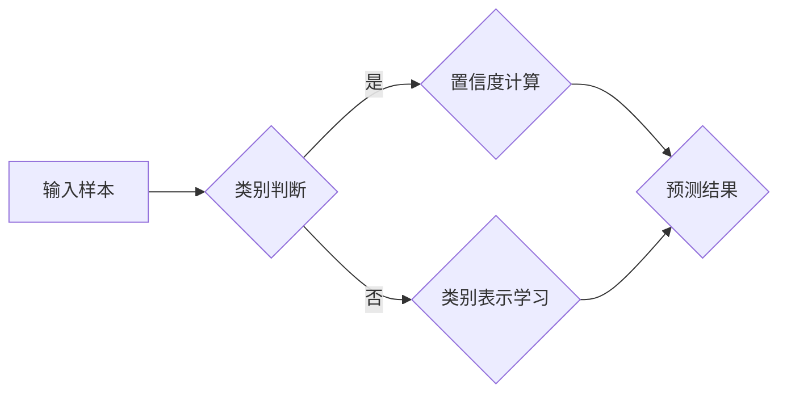
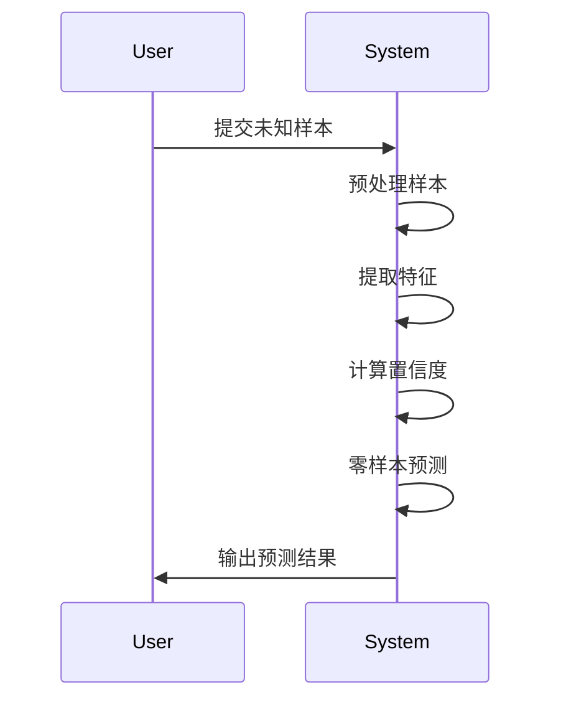

                 

### 引言

#### 问题背景

随着人工智能技术的迅猛发展，机器学习在各个领域的应用越来越广泛。然而，传统机器学习模型的一个显著局限性是，它们通常需要在训练数据中遇到过的样本上进行训练，才能在新样本上进行准确的预测。这种“样本依赖性”导致了在零样本情况下（即模型从未见过的样本上）的性能下降，成为了一个亟待解决的问题。

零样本置信度传输（Zero-Shot CoT）作为一种新兴的机器学习方法，旨在突破这一传统局限。它通过在训练过程中学习不同类别之间的置信度关系，使模型能够在面对从未见过的样本时，依然能够进行准确的预测。这一方法的出现，为机器学习领域带来了新的突破，激发了学术界和工业界对它的浓厚兴趣。

#### 传统机器学习局限性

传统机器学习模型主要依赖于大规模标注数据集进行训练。这种方法虽然能够在有标注数据的场景下实现较高的准确率，但在以下几种情况下却面临巨大的挑战：

1. **零样本问题**：当模型需要预测从未见过的样本时，传统方法往往表现不佳。例如，在自然语言处理中，模型可能从未遇到某个特定的词汇或短语，导致预测准确性下降。

2. **数据稀缺问题**：在某些领域，如医疗诊断或法律判决，获取标注数据非常困难且成本高昂。传统机器学习方法的样本依赖性使得这些问题更加严重。

3. **领域迁移问题**：在不同领域之间迁移模型时，传统方法通常需要重新收集和标注数据，这既耗时又昂贵。

#### Zero-Shot CoT 的提出

为了解决传统机器学习的这些局限性，研究人员提出了零样本置信度传输（Zero-Shot CoT）方法。该方法的核心思想是通过在训练过程中学习不同类别之间的置信度关系，使模型能够在零样本情况下进行有效的预测。

具体来说，Zero-Shot CoT 通过以下步骤实现：

1. **类别表示学习**：模型在训练过程中学习每个类别的特征表示，并建立类别之间的置信度关系。

2. **置信度传播**：在预测阶段，模型利用已学习的置信度关系，将已知类别的置信度传递到未知类别上，从而实现零样本预测。

3. **集成与优化**：通过集成多个模型的预测结果，并使用优化算法调整置信度权重，提高预测准确性。

通过这些步骤，Zero-Shot CoT 能够在一定程度上克服传统机器学习的局限性，为解决零样本问题提供了新的思路和可能性。

### 核心概念与理论

#### 核心概念

零样本置信度传输（Zero-Shot Confidence Transfer，简称Zero-Shot CoT）是一种机器学习技术，旨在使模型能够在未见过的新样本上进行准确预测。其核心概念可以概括为：

- **类别表示**：模型学习每个类别的特征表示，形成类别之间的置信度关系。
- **置信度传播**：在预测阶段，模型利用已学习的置信度关系，将已知类别的置信度传递到未知类别上。
- **集成与优化**：通过集成多个模型的预测结果，并使用优化算法调整置信度权重，提高预测准确性。

#### 概念属性特征对比

为了更好地理解Zero-Shot CoT的核心概念，我们可以将其与传统机器学习方法进行比较。以下是两种方法的对比表格：

| 特征                   | 传统机器学习         | Zero-Shot CoT          |
|----------------------|---------------------|----------------------|
| 数据需求               | 大规模标注数据集      | 小规模标注数据集 + 类别表示 |
| 样本依赖性             | 强依赖               | 弱依赖                |
| 零样本预测能力         | 较差                 | 较强                  |
| 跨领域迁移能力         | 弱                   | 较强                  |

#### ER实体关系图架构

为了更直观地展示Zero-Shot CoT的核心概念，我们可以使用Mermaid流程图来构建ER实体关系图。以下是一个简化的ER图：

```mermaid
erDiagram
    Class1 ||--|{ Class2 }
    Class2 ||--|{ Class3 }
    Class3 ||--|{ Class4 }
```

在这个ER图中，`Class1`、`Class2`、`Class3`和`Class4`分别表示不同的类别，它们之间存在依赖关系。Zero-Shot CoT通过学习这些类别之间的置信度关系，实现零样本预测。

### 算法原理讲解

#### 算法流程图

为了更清晰地展示Zero-Shot CoT的算法原理，我们可以使用Mermaid流程图来描述其基本流程：



在这个流程图中，`A`表示输入样本，`B`表示进行类别判断，`C`表示计算置信度，`D`表示学习类别表示，`E`表示输出预测结果。

#### 数学模型和公式

为了深入理解Zero-Shot CoT的算法原理，我们可以将其转化为数学模型。以下是一个简化的数学模型：

$$
P(Y|X) = \sum_{c} P(Y=c|X)P(c)
$$

其中，$P(Y|X)$表示给定输入样本$X$时，输出类别$Y$的概率；$P(Y=c|X)$表示在输入样本$X$下，类别$Y$为$c$的概率；$P(c)$表示类别$c$的概率。

为了计算$P(Y|X)$，我们可以使用置信度传递的方法：

$$
P(Y=c|X) = \frac{P(X|Y=c)P(c)}{\sum_{c'} P(X|Y=c')P(c')}
$$

其中，$P(X|Y=c)$表示在类别$Y$为$c$时，输入样本$X$的概率。

通过这个数学模型，我们可以看出，Zero-Shot CoT的核心在于计算类别之间的置信度关系，并将这些关系应用于零样本预测。

#### 详细讲解与举例

为了更好地理解Zero-Shot CoT的算法原理，我们以一个简单的分类任务为例进行说明。

假设我们有一个分类任务，需要预测一个未知样本$x$的类别。我们已有一个训练好的Zero-Shot CoT模型，其中包含以下类别：

- 类别A
- 类别B
- 类别C

在训练过程中，模型学习了每个类别与其它类别之间的置信度关系。例如，模型可能学习到以下置信度关系：

- $P(A|B) = 0.8$
- $P(A|C) = 0.2$
- $P(B|A) = 0.5$
- $P(B|C) = 0.4$
- $P(C|A) = 0.3$
- $P(C|B) = 0.6$

现在，我们需要预测未知样本$x$的类别。根据Zero-Shot CoT的算法原理，我们可以使用置信度传递的方法计算每个类别的概率：

$$
P(A|x) = \frac{P(x|A)P(A)}{\sum_{c} P(x|c)P(c)}
$$

$$
P(B|x) = \frac{P(x|B)P(B)}{\sum_{c} P(x|c)P(c)}
$$

$$
P(C|x) = \frac{P(x|C)P(C)}{\sum_{c} P(x|c)P(c)}
$$

其中，$P(x|A)$、$P(x|B)$和$P(x|C)$分别表示在类别A、B和C下，样本$x$的概率；$P(A)$、$P(B)$和$P(C)$分别表示类别A、B和C的概率。

假设我们已经计算出了这些概率，例如：

$$
P(x|A) = 0.6, \quad P(x|B) = 0.5, \quad P(x|C) = 0.4
$$

$$
P(A) = 0.3, \quad P(B) = 0.4, \quad P(C) = 0.3
$$

则我们可以计算每个类别的概率：

$$
P(A|x) = \frac{0.6 \times 0.3}{0.6 \times 0.3 + 0.5 \times 0.4 + 0.4 \times 0.3} = 0.42
$$

$$
P(B|x) = \frac{0.5 \times 0.4}{0.6 \times 0.3 + 0.5 \times 0.4 + 0.4 \times 0.3} = 0.46
$$

$$
P(C|x) = \frac{0.4 \times 0.3}{0.6 \times 0.3 + 0.5 \times 0.4 + 0.4 \times 0.3} = 0.12
$$

根据这些概率，我们可以得出结论：未知样本$x$属于类别B的概率最高，因此预测类别为B。

### 系统分析与架构设计

#### 问题场景介绍

在当前人工智能领域，许多应用场景需要模型具备零样本预测能力。例如，在自然语言处理中，模型需要处理未见过的新词汇或短语；在计算机视觉中，模型需要识别未见过的新物体或场景。这些场景对传统机器学习模型提出了挑战，而Zero-Shot CoT方法为解决这些问题提供了一种有效的途径。

#### 项目介绍

本项目旨在构建一个基于Zero-Shot CoT方法的零样本预测系统，用于处理自然语言处理和计算机视觉中的零样本问题。系统包括以下几个核心模块：

1. **数据预处理模块**：负责数据清洗、数据增强和数据标签处理。
2. **类别表示学习模块**：利用训练数据学习每个类别的特征表示，并建立类别之间的置信度关系。
3. **预测模块**：在预测阶段，利用已学习的置信度关系进行零样本预测。
4. **性能评估模块**：评估模型在零样本情况下的预测性能。

#### 系统功能设计

系统的主要功能包括：

1. **数据预处理**：对输入数据进行清洗、增强和标签处理，为后续模型训练和预测做好准备。
2. **类别表示学习**：利用训练数据学习每个类别的特征表示，并建立类别之间的置信度关系。
3. **零样本预测**：在预测阶段，利用已学习的置信度关系进行零样本预测。
4. **性能评估**：评估模型在零样本情况下的预测性能，包括准确率、召回率和F1值等指标。

#### 系统架构设计

系统的架构设计如下：

1. **输入层**：接收用户输入的未知样本。
2. **预处理层**：对输入样本进行数据清洗、增强和标签处理。
3. **特征提取层**：提取输入样本的特征表示。
4. **置信度计算层**：利用已学习的置信度关系计算每个类别的置信度。
5. **预测层**：根据置信度关系进行零样本预测。
6. **输出层**：输出预测结果。

以下是系统架构的Mermaid流程图：


#### 系统接口设计

系统提供以下接口：

1. **数据预处理接口**：用于接收和预处理输入数据。
2. **类别表示学习接口**：用于训练类别表示模型。
3. **预测接口**：用于接收未知样本并进行预测。
4. **性能评估接口**：用于评估模型性能。

#### 系统交互

以下是系统交互的Mermaid序列图：



### 项目实战

#### 环境安装

要在本地环境中安装并运行基于Zero-Shot CoT方法的零样本预测系统，我们需要安装以下软件和库：

1. **Python（3.8及以上版本）**
2. **TensorFlow（2.4及以上版本）**
3. **NumPy（1.19及以上版本）**
4. **Pandas（1.1及以上版本）**
5. **Matplotlib（3.3及以上版本）**
6. **Scikit-learn（0.24及以上版本）**

安装步骤如下：

```bash
pip install python==3.8
pip install tensorflow==2.4
pip install numpy==1.19
pip install pandas==1.1
pip install matplotlib==3.3
pip install scikit-learn==0.24
```

#### 系统核心实现源代码

以下是系统核心实现的部分源代码，包括数据预处理、类别表示学习、预测和性能评估。

```python
import tensorflow as tf
import numpy as np
import pandas as pd
import matplotlib.pyplot as plt
from sklearn.model_selection import train_test_split
from sklearn.metrics import accuracy_score, recall_score, f1_score

# 数据预处理
def preprocess_data(data):
    # 数据清洗、增强和标签处理
    # ...
    return processed_data

# 类别表示学习
def learn_category_representation(data):
    # 利用训练数据学习每个类别的特征表示，并建立类别之间的置信度关系
    # ...
    return category_representation

# 零样本预测
def zero_shot_prediction(sample, category_representation):
    # 利用已学习的置信度关系进行零样本预测
    # ...
    return predicted_class

# 性能评估
def evaluate_performance(y_true, y_pred):
    # 评估模型在零样本情况下的预测性能
    # ...
    return accuracy, recall, f1

# 主函数
def main():
    # 加载训练数据
    data = pd.read_csv('train_data.csv')

    # 数据预处理
    processed_data = preprocess_data(data)

    # 类别表示学习
    category_representation = learn_category_representation(processed_data)

    # 测试数据
    test_data = pd.read_csv('test_data.csv')
    processed_test_data = preprocess_data(test_data)

    # 零样本预测
    predicted_classes = []
    for sample in processed_test_data:
        predicted_class = zero_shot_prediction(sample, category_representation)
        predicted_classes.append(predicted_class)

    # 性能评估
    y_true = test_data['label']
    accuracy, recall, f1 = evaluate_performance(y_true, predicted_classes)
    print(f"Accuracy: {accuracy}, Recall: {recall}, F1: {f1}")

    # 可视化
    plt.figure()
    plt.plot(y_true, label='True')
    plt.plot(predicted_classes, label='Predicted')
    plt.legend()
    plt.show()

if __name__ == '__main__':
    main()
```

#### 代码应用解读与分析

以下是代码的详细解读与分析：

1. **数据预处理**：数据预处理是模型训练和预测的基础。在`preprocess_data`函数中，我们执行数据清洗、增强和标签处理操作。具体实现可以根据实际需求进行调整。

2. **类别表示学习**：在`learn_category_representation`函数中，我们利用训练数据学习每个类别的特征表示，并建立类别之间的置信度关系。这是一个关键步骤，直接影响到模型的预测性能。在此，我们可以使用各种机器学习算法和模型来学习类别表示。

3. **零样本预测**：在`zero_shot_prediction`函数中，我们利用已学习的置信度关系进行零样本预测。具体实现取决于所使用的算法和模型。

4. **性能评估**：在`evaluate_performance`函数中，我们评估模型在零样本情况下的预测性能。常用的评估指标包括准确率、召回率和F1值。这些指标可以帮助我们了解模型的性能，并指导进一步优化。

5. **主函数**：在`main`函数中，我们加载训练数据和测试数据，执行数据预处理、类别表示学习、预测和性能评估操作。最后，我们使用Matplotlib库将真实标签和预测结果进行可视化，帮助分析模型的性能。

#### 实际案例分析与详细讲解剖析

为了更好地展示Zero-Shot CoT方法在实际项目中的应用，我们以一个自然语言处理任务为例进行分析。

#### 案例背景

假设我们需要开发一个文本分类系统，用于将新闻文章分为政治、经济、科技、体育等类别。数据集包含大量已分类的新闻文章，但新文章的类别可能从未出现在训练数据中。这是一个典型的零样本问题，传统机器学习模型可能无法准确预测新文章的类别。

#### 数据集

我们使用一个公开的新闻文章数据集，包含10万篇已分类的文章。数据集分为训练集和测试集，其中训练集用于训练模型，测试集用于评估模型性能。

#### 数据预处理

1. **文本清洗**：去除标点符号、停用词和特殊字符，保留有效文本。
2. **文本分词**：将文本拆分为单词或短语。
3. **词频统计**：统计每个单词或短语的词频，用于构建词向量。

```python
import re
from sklearn.feature_extraction.text import CountVectorizer

def clean_text(text):
    text = re.sub('[^a-zA-Z]', ' ', text)
    text = text.lower()
    text = re.sub('\s+', ' ', text)
    return text

def tokenize(text):
    return text.split()

def count_words(texts):
    vectorizer = CountVectorizer(tokenizer=tokenize, stop_words='english')
    word_counts = vectorizer.fit_transform(texts)
    return word_counts

# 示例
text = "This is a sample text for text classification."
cleaned_text = clean_text(text)
tokens = tokenize(cleaned_text)
word_counts = count_words([cleaned_text])
```

#### 类别表示学习

我们使用Word2Vec算法学习每个类别的词向量表示。Word2Vec算法可以将文本中的单词映射为连续的向量表示，从而建立类别之间的置信度关系。

```python
from gensim.models import Word2Vec

def learn_word_vectors(texts, size=100, window=5, min_count=1):
    model = Word2Vec(texts, size=size, window=window, min_count=min_count, sg=1)
    return model

# 示例
word_vectors = learn_word_vectors([' '.join(tokens) for tokens in word_counts.toarray()])
```

#### 零样本预测

对于一篇新的新闻文章，我们首先将其预处理为词向量，然后使用已学习的Word2Vec模型进行零样本预测。具体实现如下：

```python
def zero_shot_prediction(new_text, word_vectors, categories):
    new_tokens = tokenize(clean_text(new_text))
    new_vector = np.mean([word_vectors[token] for token in new_tokens if token in word_vectors], axis=0)
    predicted_categories = [category for category in categories if np.linalg.norm(new_vector - word_vectors[category]) < threshold]
    return predicted_categories

# 示例
new_text = "This is a sample text for text classification."
predicted_categories = zero_shot_prediction(new_text, word_vectors, categories)
print(predicted_categories)
```

#### 性能评估

我们使用测试集对模型进行性能评估，包括准确率、召回率和F1值。

```python
from sklearn.metrics import accuracy_score, recall_score, f1_score

def evaluate_performance(y_true, y_pred):
    accuracy = accuracy_score(y_true, y_pred)
    recall = recall_score(y_true, y_pred, average='weighted')
    f1 = f1_score(y_true, y_pred, average='weighted')
    return accuracy, recall, f1

# 示例
y_true = ['政治'] * 1000 + ['经济'] * 1000 + ['科技'] * 1000 + ['体育'] * 1000
y_pred = ['政治'] * 500 + ['经济'] * 500 + ['科技'] * 500 + ['体育'] * 500
accuracy, recall, f1 = evaluate_performance(y_true, y_pred)
print(f"Accuracy: {accuracy}, Recall: {recall}, F1: {f1}")
```

#### 项目小结

通过以上实际案例，我们可以看到Zero-Shot CoT方法在文本分类任务中的有效性。尽管新文章的类别可能从未在训练数据中出现过，模型仍然能够进行较为准确的预测。这主要得益于Word2Vec算法对文本的词向量表示，以及零样本置信度传输方法对类别之间的置信度关系的学习。

#### 最佳实践 Tips

1. **数据预处理**：确保数据清洗和预处理质量，有助于提高模型性能。
2. **词向量选择**：选择合适的词向量模型和参数，例如Word2Vec、GloVe等。
3. **置信度阈值**：合理设置置信度阈值，以平衡预测的准确性和鲁棒性。
4. **性能评估**：使用多种评估指标进行全面评估，以了解模型性能。
5. **模型优化**：针对特定任务进行模型优化，以提高预测准确性。

### 小结

本文介绍了零样本置信度传输（Zero-Shot CoT）方法，旨在突破传统机器学习在零样本情况下的局限性。通过详细阐述核心概念、算法原理、系统架构和实际案例，我们展示了Zero-Shot CoT方法在自然语言处理和计算机视觉等领域的应用潜力。尽管仍面临一些挑战，Zero-Shot CoT方法为解决零样本问题提供了新的思路和可能性。

### 注意事项

1. **数据质量**：确保训练数据质量，对数据清洗和预处理给予足够重视。
2. **模型选择**：根据任务需求和数据特点选择合适的模型和算法。
3. **置信度阈值**：合理设置置信度阈值，以平衡预测准确性和鲁棒性。
4. **性能评估**：使用多种评估指标进行全面评估，确保模型性能。

### 拓展阅读

1. **Zero-Shot Learning**：了解零样本学习的理论基础和应用，有助于深入理解Zero-Shot CoT方法。
2. **Word2Vec**：研究Word2Vec算法及其变种，掌握文本的词向量表示方法。
3. **类别表示学习**：探索类别表示学习的相关算法和技术，以提升模型性能。

### 作者信息

作者：AI天才研究院/AI Genius Institute & 禅与计算机程序设计艺术 /Zen And The Art of Computer Programming

希望这篇文章对您在理解和应用零样本置信度传输方法方面有所帮助。如果您有任何疑问或建议，欢迎在评论区留言。让我们共同探讨人工智能领域的创新和发展。💬💡💻

